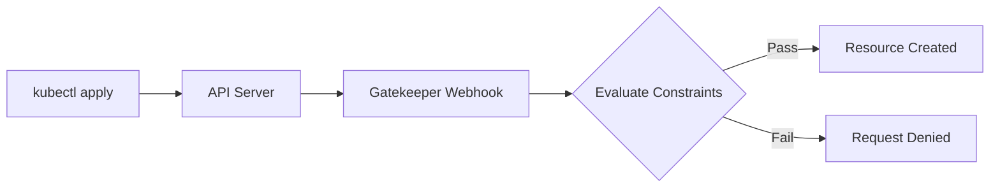

# How to Configure Gatekeeper Constraint Templates

Author: [nawazdhandala](https://www.github.com/nawazdhandala)

Tags: Kubernetes, Gatekeeper, OPA, Policy as Code, Security, Rego, Admission Control, DevOps

Description: A practical guide to creating and configuring Gatekeeper ConstraintTemplates in Kubernetes for policy enforcement using Rego policies.

---

> Gatekeeper transforms Kubernetes admission control from a black box into a declarative, auditable policy engine. ConstraintTemplates are the building blocks that define what rules you can enforce across your cluster.

## What is Gatekeeper?

Gatekeeper is a customizable admission webhook for Kubernetes that enforces policies executed by the Open Policy Agent (OPA). It uses Custom Resource Definitions (CRDs) to define policy templates (ConstraintTemplates) and instantiate them as Constraints.



### Prerequisites

Before diving in, ensure you have Gatekeeper installed:

```bash
# Install Gatekeeper using kubectl
kubectl apply -f https://raw.githubusercontent.com/open-policy-agent/gatekeeper/v3.14.0/deploy/gatekeeper.yaml

# Verify installation
kubectl get pods -n gatekeeper-system
```

## ConstraintTemplate Anatomy

A ConstraintTemplate consists of two main parts: the CRD specification and the Rego policy. Let us break down the structure.

```yaml
# ConstraintTemplate structure overview
apiVersion: templates.gatekeeper.sh/v1
kind: ConstraintTemplate
metadata:
  name: k8srequiredlabels  # Template name (lowercase, no hyphens)
spec:
  crd:
    spec:
      names:
        kind: K8sRequiredLabels  # CRD kind for constraints using this template
      validation:
        openAPIV3Schema:         # Schema for constraint parameters
          type: object
          properties:
            labels:
              type: array
              items:
                type: string
  targets:
    - target: admission.k8s.gatekeeper.sh  # Target for admission control
      rego: |
        # Rego policy goes here
        package k8srequiredlabels

        violation[{"msg": msg}] {
          # Policy logic
        }
```

### Key Components Explained

1. **metadata.name**: Must be lowercase with no hyphens. This becomes part of the CRD name.
2. **spec.crd.spec.names.kind**: The Kind name for Constraint resources using this template.
3. **spec.crd.spec.validation**: OpenAPI v3 schema defining parameters the Constraint can accept.
4. **spec.targets**: Where the Rego policy lives. The target specifies this is for admission control.

## Writing Rego Policies

Rego is the policy language used by OPA. In Gatekeeper, you write rules that produce violations when resources do not meet your requirements.

### Basic Rego Structure for Gatekeeper

```rego
# Package name must match the ConstraintTemplate name
package k8srequiredlabels

# The violation rule is what Gatekeeper evaluates
# It must return an object with a "msg" field
violation[{"msg": msg}] {
    # 'input' contains the admission review request
    # 'input.review.object' is the resource being created/updated

    # Define what labels are required (from constraint parameters)
    required := input.parameters.labels[_]

    # Check if the label exists on the resource
    not input.review.object.metadata.labels[required]

    # Construct the violation message
    msg := sprintf("Resource must have label: %v", [required])
}
```

### Understanding the Input Object

The `input` object in Gatekeeper Rego policies contains:

```rego
# input.review - The AdmissionReview request
# input.review.object - The resource being evaluated
# input.review.oldObject - Previous state (for UPDATE operations)
# input.review.operation - CREATE, UPDATE, DELETE, CONNECT
# input.review.userInfo - Information about the requesting user
# input.parameters - Parameters from the Constraint resource
```

### Common Rego Patterns

```rego
# Pattern 1: Check if a field exists
violation[{"msg": msg}] {
    # Check that resources field is not missing
    not input.review.object.spec.containers[_].resources
    msg := "Container must have resource limits defined"
}

# Pattern 2: Check field value against allowed list
violation[{"msg": msg}] {
    container := input.review.object.spec.containers[_]
    image := container.image

    # Check if image uses latest tag
    endswith(image, ":latest")
    msg := sprintf("Container %v uses :latest tag which is not allowed", [container.name])
}

# Pattern 3: Check numeric constraints
violation[{"msg": msg}] {
    container := input.review.object.spec.containers[_]

    # Get memory limit in bytes
    memory_limit := container.resources.limits.memory

    # Compare against maximum allowed
    units.parse_bytes(memory_limit) > units.parse_bytes(input.parameters.maxMemory)
    msg := sprintf("Container %v exceeds maximum memory limit of %v", [container.name, input.parameters.maxMemory])
}
```

## Creating Constraint Resources

Once you have a ConstraintTemplate, you create Constraint resources that instantiate the policy with specific parameters.

```yaml
# Constraint resource that uses the K8sRequiredLabels template
apiVersion: constraints.gatekeeper.sh/v1beta1
kind: K8sRequiredLabels  # Must match the kind defined in ConstraintTemplate
metadata:
  name: require-team-label
spec:
  # enforcementAction: deny | dryrun | warn
  enforcementAction: deny

  # Match specifies which resources this constraint applies to
  match:
    kinds:
      - apiGroups: [""]
        kinds: ["Pod"]
      - apiGroups: ["apps"]
        kinds: ["Deployment", "StatefulSet"]

    # Optional: limit to specific namespaces
    namespaces:
      - production
      - staging

    # Optional: exclude specific namespaces
    excludedNamespaces:
      - kube-system
      - gatekeeper-system

    # Optional: label selector for resources
    labelSelector:
      matchLabels:
        policy-check: enabled

  # Parameters passed to the Rego policy
  parameters:
    labels:
      - team
      - environment
```

### Match Configuration Options

```yaml
# Comprehensive match configuration example
match:
  # Match specific resource types
  kinds:
    - apiGroups: [""]            # Core API group (Pods, Services, etc.)
      kinds: ["Pod", "Service"]
    - apiGroups: ["apps"]        # Apps API group
      kinds: ["Deployment"]
    - apiGroups: ["networking.k8s.io"]
      kinds: ["Ingress"]

  # Match by scope
  scope: Namespaced  # or Cluster

  # Include only these namespaces
  namespaces:
    - production
    - staging

  # Exclude these namespaces
  excludedNamespaces:
    - kube-system
    - kube-public
    - gatekeeper-system

  # Match resources with specific labels
  labelSelector:
    matchLabels:
      enforce-policy: "true"
    matchExpressions:
      - key: environment
        operator: In
        values: ["prod", "staging"]

  # Match resources with specific namespace labels
  namespaceSelector:
    matchLabels:
      policy-enabled: "true"
```

## Working with Parameters

Parameters make your ConstraintTemplates reusable. Define them in the OpenAPI schema and access them in Rego.

### Defining Complex Parameters

```yaml
apiVersion: templates.gatekeeper.sh/v1
kind: ConstraintTemplate
metadata:
  name: k8scontainerlimits
spec:
  crd:
    spec:
      names:
        kind: K8sContainerLimits
      validation:
        openAPIV3Schema:
          type: object
          properties:
            # Simple string parameter
            cpu:
              type: string
              description: "Maximum CPU limit (e.g., '500m', '2')"

            # Simple string parameter
            memory:
              type: string
              description: "Maximum memory limit (e.g., '512Mi', '2Gi')"

            # Array of strings
            exemptImages:
              type: array
              description: "Images exempt from this policy"
              items:
                type: string

            # Nested object
            ranges:
              type: object
              properties:
                minCpu:
                  type: string
                maxCpu:
                  type: string
  targets:
    - target: admission.k8s.gatekeeper.sh
      rego: |
        package k8scontainerlimits

        # Check if image is exempt
        exempt_image(image) {
            exempt := input.parameters.exemptImages[_]
            startswith(image, exempt)
        }

        violation[{"msg": msg}] {
            container := input.review.object.spec.containers[_]
            not exempt_image(container.image)

            # Access nested parameters
            cpu_limit := container.resources.limits.cpu
            max_cpu := input.parameters.cpu

            # Parse and compare CPU values
            to_millicores(cpu_limit) > to_millicores(max_cpu)

            msg := sprintf(
                "Container %v CPU limit %v exceeds maximum %v",
                [container.name, cpu_limit, max_cpu]
            )
        }

        # Helper function to convert CPU to millicores
        to_millicores(cpu) = result {
            endswith(cpu, "m")
            result := to_number(trim_suffix(cpu, "m"))
        }

        to_millicores(cpu) = result {
            not endswith(cpu, "m")
            result := to_number(cpu) * 1000
        }
```

### Using Parameters in Constraints

```yaml
apiVersion: constraints.gatekeeper.sh/v1beta1
kind: K8sContainerLimits
metadata:
  name: container-must-have-limits
spec:
  enforcementAction: deny
  match:
    kinds:
      - apiGroups: [""]
        kinds: ["Pod"]
  parameters:
    cpu: "2"
    memory: "4Gi"
    exemptImages:
      - "gcr.io/google-containers/"
      - "k8s.gcr.io/"
    ranges:
      minCpu: "100m"
      maxCpu: "4"
```

## Validation and Testing

Always validate your ConstraintTemplates before deploying to production.

### Local Testing with Gator

Gator is the Gatekeeper CLI tool for testing policies locally.

```bash
# Install gator
go install github.com/open-policy-agent/gatekeeper/v3/cmd/gator@latest

# Test a constraint template and constraint against sample resources
gator test \
  --filename constraint-template.yaml \
  --filename constraint.yaml \
  --filename test-resources/
```

### Creating Test Cases

```yaml
# test-resources/valid-pod.yaml
# This pod should pass the required labels constraint
apiVersion: v1
kind: Pod
metadata:
  name: valid-pod
  labels:
    team: platform
    environment: production
spec:
  containers:
    - name: nginx
      image: nginx:1.21
---
# test-resources/invalid-pod.yaml
# This pod should fail - missing required labels
apiVersion: v1
kind: Pod
metadata:
  name: invalid-pod
  labels:
    app: nginx  # Missing 'team' and 'environment' labels
spec:
  containers:
    - name: nginx
      image: nginx:1.21
```

### Gator Test Suite

```yaml
# gator-tests.yaml
apiVersion: test.gatekeeper.sh/v1alpha1
kind: Suite
metadata:
  name: required-labels-test
tests:
  - name: "pod-missing-labels-should-fail"
    template: constraint-template.yaml
    constraint: constraint.yaml
    cases:
      - name: "missing-team-label"
        object: test-resources/invalid-pod.yaml
        assertions:
          - violations: yes
            message: "must have label: team"

      - name: "valid-pod-should-pass"
        object: test-resources/valid-pod.yaml
        assertions:
          - violations: no
```

Run the test suite:

```bash
gator verify gator-tests.yaml
```

## Audit Mode

Gatekeeper continuously audits existing resources in your cluster against constraints. This helps identify violations in resources that were created before the policy was implemented.

### Checking Audit Results

```bash
# View constraint status including audit violations
kubectl get constraint require-team-label -o yaml
```

The output includes:

```yaml
status:
  auditTimestamp: "2026-01-27T10:30:00Z"
  totalViolations: 3
  violations:
    - enforcementAction: deny
      kind: Pod
      message: "Resource must have label: team"
      name: legacy-app
      namespace: default
    - enforcementAction: deny
      kind: Deployment
      message: "Resource must have label: team"
      name: old-service
      namespace: staging
```

### Configuring Audit Behavior

```yaml
# Gatekeeper config for audit settings
apiVersion: config.gatekeeper.sh/v1alpha1
kind: Config
metadata:
  name: config
  namespace: gatekeeper-system
spec:
  # How often to run audits (default: 60 seconds)
  sync:
    syncOnly:
      - group: ""
        version: "v1"
        kind: "Pod"
      - group: "apps"
        version: "v1"
        kind: "Deployment"

  # Namespaces exempt from admission and audit
  match:
    - excludedNamespaces:
        - kube-system
        - gatekeeper-system
      processes:
        - "*"

  # Readiness configuration
  readiness:
    statsEnabled: true
```

## Dry-Run Mode

Dry-run mode lets you test policies without blocking resources. This is essential for safely rolling out new policies.

### Setting Up Dry-Run

```yaml
apiVersion: constraints.gatekeeper.sh/v1beta1
kind: K8sRequiredLabels
metadata:
  name: require-team-label-dryrun
spec:
  # Use dryrun to log violations without blocking
  enforcementAction: dryrun
  match:
    kinds:
      - apiGroups: [""]
        kinds: ["Pod"]
  parameters:
    labels:
      - team
```

### Monitoring Dry-Run Violations

```bash
# Check violations in dry-run mode
kubectl get k8srequiredlabels require-team-label-dryrun -o yaml

# View Gatekeeper logs for dry-run violations
kubectl logs -n gatekeeper-system -l control-plane=controller-manager | grep "dryrun"
```

### Progressive Enforcement Strategy

```yaml
# Step 1: Deploy in dryrun mode
# File: constraint-dryrun.yaml
apiVersion: constraints.gatekeeper.sh/v1beta1
kind: K8sRequiredLabels
metadata:
  name: require-team-label
spec:
  enforcementAction: dryrun
  # ... rest of spec

---
# Step 2: After validating, switch to warn
# This shows warnings but does not block
apiVersion: constraints.gatekeeper.sh/v1beta1
kind: K8sRequiredLabels
metadata:
  name: require-team-label
spec:
  enforcementAction: warn
  # ... rest of spec

---
# Step 3: Finally, switch to deny
apiVersion: constraints.gatekeeper.sh/v1beta1
kind: K8sRequiredLabels
metadata:
  name: require-team-label
spec:
  enforcementAction: deny
  # ... rest of spec
```

## Common ConstraintTemplates

Here are production-ready templates for common use cases.

### Require Labels

```yaml
apiVersion: templates.gatekeeper.sh/v1
kind: ConstraintTemplate
metadata:
  name: k8srequiredlabels
  annotations:
    description: "Requires resources to have specified labels"
spec:
  crd:
    spec:
      names:
        kind: K8sRequiredLabels
      validation:
        openAPIV3Schema:
          type: object
          properties:
            message:
              type: string
            labels:
              type: array
              items:
                type: object
                properties:
                  key:
                    type: string
                  allowedRegex:
                    type: string
  targets:
    - target: admission.k8s.gatekeeper.sh
      rego: |
        package k8srequiredlabels

        get_message(parameters, _default) = msg {
            not parameters.message
            msg := _default
        }

        get_message(parameters, _) = msg {
            msg := parameters.message
        }

        violation[{"msg": msg, "details": {"missing_labels": missing}}] {
            provided := {label | input.review.object.metadata.labels[label]}
            required := {label | label := input.parameters.labels[_].key}
            missing := required - provided
            count(missing) > 0
            def_msg := sprintf("Missing required labels: %v", [missing])
            msg := get_message(input.parameters, def_msg)
        }

        violation[{"msg": msg}] {
            value := input.review.object.metadata.labels[key]
            expected := input.parameters.labels[_]
            expected.key == key
            expected.allowedRegex != ""
            not regex.match(expected.allowedRegex, value)
            msg := sprintf("Label %v value %v does not match regex %v", [key, value, expected.allowedRegex])
        }
```

### Disallow Latest Tag

```yaml
apiVersion: templates.gatekeeper.sh/v1
kind: ConstraintTemplate
metadata:
  name: k8sdisallowedtags
  annotations:
    description: "Prevents use of specified image tags"
spec:
  crd:
    spec:
      names:
        kind: K8sDisallowedTags
      validation:
        openAPIV3Schema:
          type: object
          properties:
            tags:
              type: array
              items:
                type: string
            exemptImages:
              type: array
              items:
                type: string
  targets:
    - target: admission.k8s.gatekeeper.sh
      rego: |
        package k8sdisallowedtags

        # Check all container types
        violation[{"msg": msg}] {
            container := input_containers[_]
            tag := get_tag(container.image)
            disallowed_tag(tag)
            not exempt_image(container.image)
            msg := sprintf(
                "Container %v uses disallowed tag %v. Specify an explicit version tag.",
                [container.name, tag]
            )
        }

        # Get containers from pod spec
        input_containers[c] {
            c := input.review.object.spec.containers[_]
        }
        input_containers[c] {
            c := input.review.object.spec.initContainers[_]
        }
        input_containers[c] {
            c := input.review.object.spec.ephemeralContainers[_]
        }

        # Extract tag from image reference
        get_tag(image) = tag {
            contains(image, ":")
            parts := split(image, ":")
            tag := parts[count(parts) - 1]
        }
        get_tag(image) = "latest" {
            not contains(image, ":")
        }

        # Check if tag is disallowed
        disallowed_tag(tag) {
            disallowed := input.parameters.tags[_]
            tag == disallowed
        }

        # Check if image is exempt
        exempt_image(image) {
            exempt := input.parameters.exemptImages[_]
            startswith(image, exempt)
        }
```

### Require Resource Limits

```yaml
apiVersion: templates.gatekeeper.sh/v1
kind: ConstraintTemplate
metadata:
  name: k8scontainerresources
  annotations:
    description: "Requires containers to have resource requests and limits"
spec:
  crd:
    spec:
      names:
        kind: K8sContainerResources
      validation:
        openAPIV3Schema:
          type: object
          properties:
            exemptImages:
              type: array
              items:
                type: string
            requireLimits:
              type: boolean
            requireRequests:
              type: boolean
  targets:
    - target: admission.k8s.gatekeeper.sh
      rego: |
        package k8scontainerresources

        violation[{"msg": msg}] {
            container := input_containers[_]
            not exempt_image(container.image)
            input.parameters.requireLimits
            not container.resources.limits
            msg := sprintf("Container %v must have resource limits", [container.name])
        }

        violation[{"msg": msg}] {
            container := input_containers[_]
            not exempt_image(container.image)
            input.parameters.requireLimits
            not container.resources.limits.cpu
            msg := sprintf("Container %v must have CPU limit", [container.name])
        }

        violation[{"msg": msg}] {
            container := input_containers[_]
            not exempt_image(container.image)
            input.parameters.requireLimits
            not container.resources.limits.memory
            msg := sprintf("Container %v must have memory limit", [container.name])
        }

        violation[{"msg": msg}] {
            container := input_containers[_]
            not exempt_image(container.image)
            input.parameters.requireRequests
            not container.resources.requests
            msg := sprintf("Container %v must have resource requests", [container.name])
        }

        input_containers[c] {
            c := input.review.object.spec.containers[_]
        }
        input_containers[c] {
            c := input.review.object.spec.initContainers[_]
        }

        exempt_image(image) {
            exempt := input.parameters.exemptImages[_]
            startswith(image, exempt)
        }
```

### Allowed Repositories

```yaml
apiVersion: templates.gatekeeper.sh/v1
kind: ConstraintTemplate
metadata:
  name: k8sallowedrepos
  annotations:
    description: "Restricts container images to allowed repositories"
spec:
  crd:
    spec:
      names:
        kind: K8sAllowedRepos
      validation:
        openAPIV3Schema:
          type: object
          properties:
            repos:
              type: array
              description: "List of allowed image repository prefixes"
              items:
                type: string
  targets:
    - target: admission.k8s.gatekeeper.sh
      rego: |
        package k8sallowedrepos

        violation[{"msg": msg}] {
            container := input_containers[_]
            image := container.image
            not image_allowed(image)
            msg := sprintf(
                "Container %v image %v is not from an allowed repository. Allowed: %v",
                [container.name, image, input.parameters.repos]
            )
        }

        image_allowed(image) {
            repo := input.parameters.repos[_]
            startswith(image, repo)
        }

        input_containers[c] {
            c := input.review.object.spec.containers[_]
        }
        input_containers[c] {
            c := input.review.object.spec.initContainers[_]
        }
        input_containers[c] {
            c := input.review.object.spec.ephemeralContainers[_]
        }
```

## Best Practices Summary

When working with Gatekeeper ConstraintTemplates, follow these guidelines:

1. **Start with dry-run mode**: Always deploy new constraints in `enforcementAction: dryrun` first. Monitor violations before enforcing.

2. **Use meaningful violation messages**: Include enough context in your error messages to help developers fix issues quickly.

3. **Exempt system namespaces**: Always exclude `kube-system` and `gatekeeper-system` from constraints to avoid breaking cluster functionality.

4. **Version your templates**: Use Git to track changes and maintain a library of tested templates.

5. **Test with Gator**: Use the Gator CLI to validate templates locally before deploying to clusters.

6. **Use parameters for flexibility**: Make templates reusable by parameterizing values like labels, limits, and allowed lists.

7. **Document your policies**: Add annotations to describe what each template does and why it exists.

8. **Monitor audit results**: Regularly check constraint status for violations in existing resources.

9. **Progressive rollout**: Move from dryrun to warn to deny, giving teams time to comply.

10. **Keep Rego simple**: Complex Rego is hard to debug. Prefer multiple simple rules over one complex rule.

---

Gatekeeper ConstraintTemplates give you the power to enforce consistent policies across your Kubernetes clusters. Start with the common templates above, customize them for your organization's needs, and gradually expand coverage as your team becomes comfortable with policy as code.

For comprehensive observability of your Kubernetes clusters and policy violations, check out [OneUptime](https://oneuptime.com) - an open-source platform that helps you monitor, alert, and respond to issues across your infrastructure.
