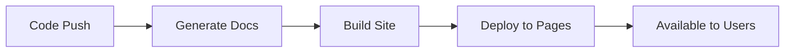

# How to Generate Documentation with GitHub Actions

Author: [nawazdhandala](https://www.github.com/nawazdhandala)

Tags: GitHub Actions, Documentation, API Docs, TypeDoc, Sphinx, JSDoc, DevOps

Description: Automate documentation generation in GitHub Actions using tools like TypeDoc, Sphinx, JSDoc, and OpenAPI generators, with automatic deployment to GitHub Pages or other hosting platforms.

---

Documentation that is out of sync with code is worse than no documentation. By generating docs automatically in your CI pipeline, you ensure they always reflect the current state of your codebase.

## Documentation Generation Flow

A typical docs pipeline looks like this:



## TypeScript Documentation with TypeDoc

Generate API documentation from TypeScript source code:

```yaml
# .github/workflows/docs.yml
name: Documentation

on:
  push:
    branches: [main]
    paths:
      - 'src/**'
      - 'docs/**'
      - 'typedoc.json'

jobs:
  build-docs:
    runs-on: ubuntu-latest
    steps:
      - uses: actions/checkout@v4

      - name: Set up Node.js
        uses: actions/setup-node@v4
        with:
          node-version: '20'
          cache: 'npm'

      - name: Install dependencies
        run: npm ci

      - name: Generate TypeDoc documentation
        run: npx typedoc

      - name: Upload docs artifact
        uses: actions/upload-pages-artifact@v3
        with:
          path: docs/

  deploy-docs:
    needs: build-docs
    runs-on: ubuntu-latest
    permissions:
      pages: write
      id-token: write
    environment:
      name: github-pages
      url: ${{ steps.deployment.outputs.page_url }}
    steps:
      - name: Deploy to GitHub Pages
        id: deployment
        uses: actions/deploy-pages@v4
```

Configure TypeDoc in your project:

```json
{
  "entryPoints": ["src/index.ts"],
  "out": "docs",
  "name": "My Library",
  "readme": "README.md",
  "excludePrivate": true,
  "excludeProtected": false,
  "includeVersion": true,
  "categorizeByGroup": true,
  "navigationLinks": {
    "GitHub": "https://github.com/myorg/mylib"
  }
}
```

## JavaScript Documentation with JSDoc

Generate documentation from JSDoc comments:

```yaml
jobs:
  jsdoc:
    runs-on: ubuntu-latest
    steps:
      - uses: actions/checkout@v4

      - name: Set up Node.js
        uses: actions/setup-node@v4
        with:
          node-version: '20'
          cache: 'npm'

      - run: npm ci

      - name: Generate JSDoc
        run: npx jsdoc -c jsdoc.json

      - name: Upload docs
        uses: actions/upload-artifact@v4
        with:
          name: jsdoc-output
          path: docs/
```

JSDoc configuration:

```json
{
  "source": {
    "include": ["src"],
    "includePattern": ".+\\.js(x)?$",
    "excludePattern": "(node_modules|test)"
  },
  "opts": {
    "destination": "./docs",
    "recurse": true,
    "readme": "./README.md"
  },
  "templates": {
    "cleverLinks": true,
    "monospaceLinks": true
  },
  "plugins": ["plugins/markdown"]
}
```

## Python Documentation with Sphinx

Generate docs for Python projects:

```yaml
jobs:
  sphinx-docs:
    runs-on: ubuntu-latest
    steps:
      - uses: actions/checkout@v4

      - name: Set up Python
        uses: actions/setup-python@v5
        with:
          python-version: '3.11'
          cache: 'pip'

      - name: Install dependencies
        run: |
          pip install -r requirements.txt
          pip install sphinx sphinx-rtd-theme sphinx-autodoc-typehints

      - name: Build documentation
        run: |
          cd docs
          make html

      - name: Upload docs
        uses: actions/upload-pages-artifact@v3
        with:
          path: docs/_build/html
```

Sphinx configuration (conf.py):

```python
# docs/conf.py
project = 'My Project'
copyright = '2026, My Team'
author = 'My Team'

extensions = [
    'sphinx.ext.autodoc',
    'sphinx.ext.napoleon',
    'sphinx.ext.viewcode',
    'sphinx_autodoc_typehints',
]

html_theme = 'sphinx_rtd_theme'
html_static_path = ['_static']

# Auto-generate API docs
autodoc_default_options = {
    'members': True,
    'undoc-members': True,
    'show-inheritance': True,
}
```

## OpenAPI Documentation

Generate API documentation from OpenAPI specs:

```yaml
jobs:
  openapi-docs:
    runs-on: ubuntu-latest
    steps:
      - uses: actions/checkout@v4

      # Validate OpenAPI spec first
      - name: Validate OpenAPI
        run: npx @redocly/cli lint openapi.yaml

      # Generate static HTML docs with Redoc
      - name: Generate Redoc docs
        run: |
          npx @redocly/cli build-docs openapi.yaml \
            --output docs/api/index.html \
            --title "API Documentation"

      # Alternative: Generate with Swagger UI
      - name: Generate Swagger UI
        run: |
          mkdir -p docs/swagger
          cp openapi.yaml docs/swagger/
          cat > docs/swagger/index.html << 'EOF'
          <!DOCTYPE html>
          <html>
          <head>
            <title>API Docs</title>
            <link rel="stylesheet" href="https://unpkg.com/swagger-ui-dist@5/swagger-ui.css">
          </head>
          <body>
            <div id="swagger-ui"></div>
            <script src="https://unpkg.com/swagger-ui-dist@5/swagger-ui-bundle.js"></script>
            <script>
              SwaggerUIBundle({
                url: "openapi.yaml",
                dom_id: '#swagger-ui'
              });
            </script>
          </body>
          </html>
          EOF

      - name: Upload docs
        uses: actions/upload-pages-artifact@v3
        with:
          path: docs/
```

## MkDocs for Project Documentation

Build beautiful documentation sites with MkDocs:

```yaml
jobs:
  mkdocs:
    runs-on: ubuntu-latest
    steps:
      - uses: actions/checkout@v4

      - name: Set up Python
        uses: actions/setup-python@v5
        with:
          python-version: '3.11'

      - name: Install MkDocs
        run: |
          pip install mkdocs-material mkdocs-minify-plugin mkdocstrings[python]

      - name: Build docs
        run: mkdocs build --strict

      - name: Upload docs
        uses: actions/upload-pages-artifact@v3
        with:
          path: site/
```

MkDocs configuration:

```yaml
# mkdocs.yml
site_name: My Project
site_url: https://myorg.github.io/myproject
repo_url: https://github.com/myorg/myproject

theme:
  name: material
  features:
    - navigation.tabs
    - navigation.sections
    - search.highlight
    - content.code.copy

plugins:
  - search
  - minify:
      minify_html: true
  - mkdocstrings:
      handlers:
        python:
          options:
            show_source: true

nav:
  - Home: index.md
  - Getting Started: getting-started.md
  - API Reference: api/
```

## Auto-Generate README Sections

Keep README sections in sync with code:

```yaml
jobs:
  update-readme:
    runs-on: ubuntu-latest
    steps:
      - uses: actions/checkout@v4

      - name: Set up Node.js
        uses: actions/setup-node@v4
        with:
          node-version: '20'

      - run: npm ci

      # Generate CLI help text
      - name: Generate CLI docs
        run: |
          node bin/cli.js --help > cli-help.txt

      # Update README with generated content
      - name: Update README
        run: |
          node scripts/update-readme.js

      # Commit if changed
      - name: Commit changes
        run: |
          git config user.name "github-actions[bot]"
          git config user.email "github-actions[bot]@users.noreply.github.com"
          git add README.md
          git diff --staged --quiet || git commit -m "docs: update auto-generated sections"
          git push
```

Script to update README sections:

```javascript
// scripts/update-readme.js
const fs = require('fs');

const readme = fs.readFileSync('README.md', 'utf8');
const cliHelp = fs.readFileSync('cli-help.txt', 'utf8');

// Replace content between markers
const updated = readme.replace(
  /<!-- CLI_HELP_START -->[\s\S]*<!-- CLI_HELP_END -->/,
  `<!-- CLI_HELP_START -->\n\`\`\`\n${cliHelp}\n\`\`\`\n<!-- CLI_HELP_END -->`
);

fs.writeFileSync('README.md', updated);
```

## Documentation Preview on PRs

Deploy preview docs for pull requests:

```yaml
name: Docs Preview

on:
  pull_request:
    paths:
      - 'docs/**'
      - 'src/**'

jobs:
  preview:
    runs-on: ubuntu-latest
    steps:
      - uses: actions/checkout@v4

      - name: Build docs
        run: |
          npm ci
          npm run docs:build

      - name: Deploy preview
        uses: peaceiris/actions-gh-pages@v4
        with:
          github_token: ${{ secrets.GITHUB_TOKEN }}
          publish_dir: ./docs
          destination_dir: pr-${{ github.event.number }}

      - name: Comment preview URL
        uses: actions/github-script@v7
        with:
          script: |
            github.rest.issues.createComment({
              issue_number: context.issue.number,
              owner: context.repo.owner,
              repo: context.repo.repo,
              body: `Documentation preview deployed: https://${context.repo.owner}.github.io/${context.repo.repo}/pr-${context.issue.number}/`
            });
```

## Multi-Language Documentation

Generate docs for projects with multiple languages:

```yaml
jobs:
  build-all-docs:
    runs-on: ubuntu-latest
    steps:
      - uses: actions/checkout@v4

      - name: Set up Node.js
        uses: actions/setup-node@v4
        with:
          node-version: '20'

      - name: Set up Python
        uses: actions/setup-python@v5
        with:
          python-version: '3.11'

      - name: Install dependencies
        run: |
          npm ci
          pip install sphinx sphinx-rtd-theme

      # Build TypeScript docs
      - name: Build TypeScript docs
        run: npx typedoc --out docs/typescript

      # Build Python docs
      - name: Build Python docs
        run: |
          cd python
          sphinx-build -b html docs ../docs/python

      # Build combined site
      - name: Build landing page
        run: |
          cat > docs/index.html << 'EOF'
          <!DOCTYPE html>
          <html>
          <head><title>Documentation</title></head>
          <body>
            <h1>Documentation</h1>
            <ul>
              <li><a href="typescript/">TypeScript SDK</a></li>
              <li><a href="python/">Python SDK</a></li>
            </ul>
          </body>
          </html>
          EOF

      - name: Upload docs
        uses: actions/upload-pages-artifact@v3
        with:
          path: docs/
```

## Versioned Documentation

Maintain documentation for multiple versions:

```yaml
jobs:
  versioned-docs:
    runs-on: ubuntu-latest
    steps:
      - uses: actions/checkout@v4
        with:
          fetch-depth: 0

      - name: Set up Python
        uses: actions/setup-python@v5
        with:
          python-version: '3.11'

      - name: Install mike
        run: pip install mkdocs-material mike

      - name: Configure git
        run: |
          git config user.name "github-actions[bot]"
          git config user.email "github-actions[bot]@users.noreply.github.com"

      - name: Deploy versioned docs
        run: |
          VERSION=$(cat VERSION)
          mike deploy --push --update-aliases $VERSION latest
```

## Best Practices

1. **Generate on every push** - Keep docs in sync with code by regenerating on each commit.

2. **Validate before deploying** - Check for broken links and formatting issues.

3. **Use semantic versioning** - Match doc versions to release versions.

4. **Include examples** - Code examples should be extracted from actual tests to ensure they work.

5. **Preview before merge** - Deploy preview sites for documentation PRs.

6. **Keep it fast** - Cache dependencies and use incremental builds when possible.

Automated documentation ensures your users always have accurate, up-to-date information about your project.
