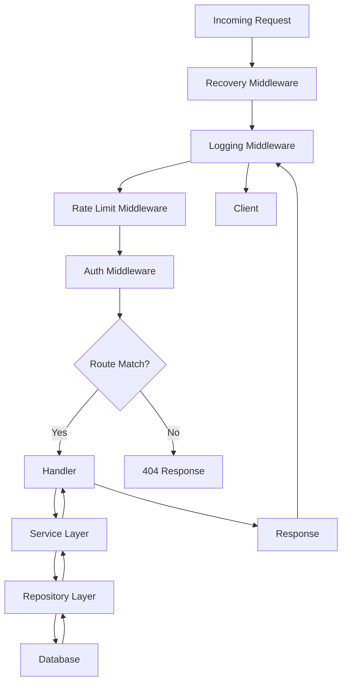
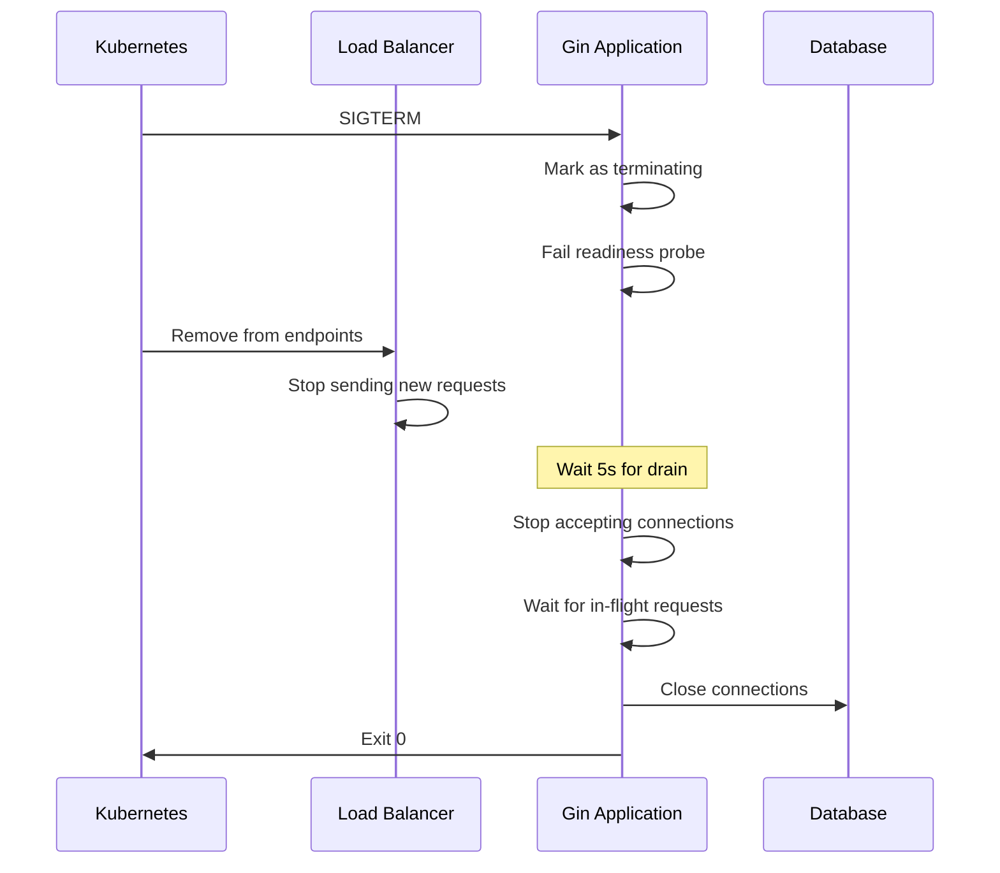
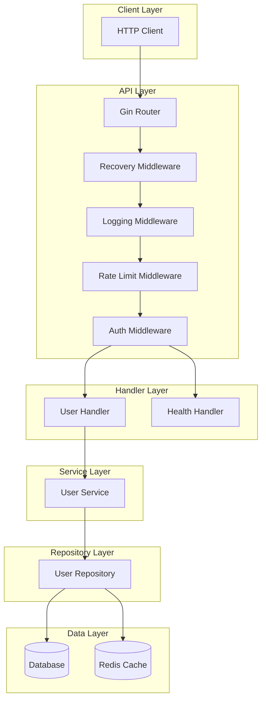

# How to Build Production APIs with Gin

By [Nawaz Dhandala](https://github.com/nawazdhandala)

Tags: Go, Gin, API Development, Backend, Microservices, Production, REST API

Description: A comprehensive guide to building production-ready APIs with Gin framework in Go, covering project structure, middleware, request validation, error handling, graceful shutdown, and monitoring integration.

---

> "Simplicity is the ultimate sophistication." - Leonardo da Vinci

Building production APIs requires more than just handling HTTP requests. You need proper error handling, request validation, middleware for cross-cutting concerns, graceful shutdown, and observability. Gin is one of the most popular Go web frameworks, known for its performance and simplicity. This guide shows you how to build production-grade APIs with Gin.

## Why Gin for Production APIs

| Feature | Benefit |
|---------|---------|
| **Performance** | Fastest Go web framework with zero allocation router |
| **Middleware** | Extensible middleware system for cross-cutting concerns |
| **Validation** | Built-in request validation with go-playground/validator |
| **Error Recovery** | Panic recovery middleware prevents crashes |
| **JSON Handling** | Efficient JSON serialization and deserialization |
| **Routing** | RESTful routing with parameter binding |

## Project Structure

A well-organized project structure is essential for maintainability. Here is a recommended layout for production Gin applications:

```
myapi/
├── cmd/
│   └── server/
│       └── main.go              # Application entry point
├── internal/
│   ├── config/
│   │   └── config.go            # Configuration management
│   ├── handler/
│   │   ├── handler.go           # Handler interface and base
│   │   ├── user_handler.go      # User-related handlers
│   │   └── health_handler.go    # Health check handlers
│   ├── middleware/
│   │   ├── auth.go              # Authentication middleware
│   │   ├── logging.go           # Request logging middleware
│   │   ├── recovery.go          # Panic recovery middleware
│   │   └── ratelimit.go         # Rate limiting middleware
│   ├── model/
│   │   ├── user.go              # User model
│   │   └── error.go             # Error types
│   ├── repository/
│   │   └── user_repository.go   # Data access layer
│   ├── service/
│   │   └── user_service.go      # Business logic layer
│   └── validator/
│       └── validator.go         # Custom validators
├── pkg/
│   └── response/
│       └── response.go          # Standardized API responses
├── go.mod
├── go.sum
└── Makefile
```

## Request Lifecycle

Understanding the request lifecycle helps you design middleware and handlers effectively:



## Configuration Management

Start with a robust configuration system that supports environment variables and defaults:

```go
// internal/config/config.go
package config

import (
    "os"
    "strconv"
    "time"
)

// Config holds all application configuration.
// Values are loaded from environment variables with sensible defaults.
type Config struct {
    // Server configuration
    ServerPort         string
    ServerReadTimeout  time.Duration
    ServerWriteTimeout time.Duration

    // Database configuration
    DatabaseURL string

    // JWT configuration
    JWTSecret     string
    JWTExpiration time.Duration

    // Rate limiting
    RateLimitRequests int
    RateLimitWindow   time.Duration

    // Environment
    Environment string
}

// Load reads configuration from environment variables.
// It provides sensible defaults for development while requiring
// explicit configuration in production.
func Load() *Config {
    return &Config{
        ServerPort:         getEnv("SERVER_PORT", "8080"),
        ServerReadTimeout:  getDurationEnv("SERVER_READ_TIMEOUT", 10*time.Second),
        ServerWriteTimeout: getDurationEnv("SERVER_WRITE_TIMEOUT", 10*time.Second),
        DatabaseURL:        getEnv("DATABASE_URL", "postgres://localhost/myapi"),
        JWTSecret:          getEnv("JWT_SECRET", "change-me-in-production"),
        JWTExpiration:      getDurationEnv("JWT_EXPIRATION", 24*time.Hour),
        RateLimitRequests:  getIntEnv("RATE_LIMIT_REQUESTS", 100),
        RateLimitWindow:    getDurationEnv("RATE_LIMIT_WINDOW", time.Minute),
        Environment:        getEnv("ENVIRONMENT", "development"),
    }
}

// getEnv retrieves an environment variable or returns a default value.
func getEnv(key, defaultValue string) string {
    if value := os.Getenv(key); value != "" {
        return value
    }
    return defaultValue
}

// getIntEnv retrieves an integer environment variable or returns a default.
func getIntEnv(key string, defaultValue int) int {
    if value := os.Getenv(key); value != "" {
        if intValue, err := strconv.Atoi(value); err == nil {
            return intValue
        }
    }
    return defaultValue
}

// getDurationEnv retrieves a duration environment variable or returns a default.
func getDurationEnv(key string, defaultValue time.Duration) time.Duration {
    if value := os.Getenv(key); value != "" {
        if duration, err := time.ParseDuration(value); err == nil {
            return duration
        }
    }
    return defaultValue
}

// IsProduction returns true if running in production environment.
func (c *Config) IsProduction() bool {
    return c.Environment == "production"
}
```

## Middleware Implementation

Middleware in Gin processes requests before they reach your handlers. The order of middleware matters as they execute in the order they are added.

### Logging Middleware

Structured logging is essential for debugging and monitoring:

```go
// internal/middleware/logging.go
package middleware

import (
    "log/slog"
    "time"

    "github.com/gin-gonic/gin"
    "github.com/google/uuid"
)

// LoggingMiddleware logs every request with structured fields.
// It captures request details, response status, and latency.
func LoggingMiddleware(logger *slog.Logger) gin.HandlerFunc {
    return func(c *gin.Context) {
        // Generate a unique request ID for tracing
        requestID := uuid.New().String()
        c.Set("request_id", requestID)
        c.Header("X-Request-ID", requestID)

        // Capture start time for latency calculation
        startTime := time.Now()
        path := c.Request.URL.Path
        query := c.Request.URL.RawQuery

        // Process the request
        c.Next()

        // Calculate request duration
        latency := time.Since(startTime)

        // Build log attributes
        attrs := []slog.Attr{
            slog.String("request_id", requestID),
            slog.String("method", c.Request.Method),
            slog.String("path", path),
            slog.String("query", query),
            slog.Int("status", c.Writer.Status()),
            slog.Duration("latency", latency),
            slog.String("client_ip", c.ClientIP()),
            slog.String("user_agent", c.Request.UserAgent()),
            slog.Int("body_size", c.Writer.Size()),
        }

        // Add error if present
        if len(c.Errors) > 0 {
            attrs = append(attrs, slog.String("errors", c.Errors.String()))
        }

        // Log at appropriate level based on status code
        status := c.Writer.Status()
        msg := "Request completed"

        switch {
        case status >= 500:
            logger.LogAttrs(c.Request.Context(), slog.LevelError, msg, attrs...)
        case status >= 400:
            logger.LogAttrs(c.Request.Context(), slog.LevelWarn, msg, attrs...)
        default:
            logger.LogAttrs(c.Request.Context(), slog.LevelInfo, msg, attrs...)
        }
    }
}
```

### Recovery Middleware

Custom panic recovery with proper error responses:

```go
// internal/middleware/recovery.go
package middleware

import (
    "log/slog"
    "net/http"
    "runtime/debug"

    "github.com/gin-gonic/gin"
)

// RecoveryMiddleware recovers from panics and returns a 500 error.
// In production, it hides stack traces from clients while logging them.
func RecoveryMiddleware(logger *slog.Logger, isProduction bool) gin.HandlerFunc {
    return func(c *gin.Context) {
        defer func() {
            if err := recover(); err != nil {
                // Get stack trace
                stack := debug.Stack()

                // Log the panic with full details
                logger.Error("Panic recovered",
                    slog.Any("error", err),
                    slog.String("stack", string(stack)),
                    slog.String("path", c.Request.URL.Path),
                    slog.String("method", c.Request.Method),
                )

                // Build response based on environment
                response := gin.H{
                    "error":   "Internal Server Error",
                    "message": "An unexpected error occurred",
                }

                // Include stack trace in development
                if !isProduction {
                    response["debug"] = gin.H{
                        "panic": err,
                        "stack": string(stack),
                    }
                }

                // Abort with error response
                c.AbortWithStatusJSON(http.StatusInternalServerError, response)
            }
        }()

        c.Next()
    }
}
```

### Authentication Middleware

JWT-based authentication with role support:

```go
// internal/middleware/auth.go
package middleware

import (
    "errors"
    "net/http"
    "strings"

    "github.com/gin-gonic/gin"
    "github.com/golang-jwt/jwt/v5"
)

// Claims defines the custom claims structure for JWT tokens.
// It includes user identification and role information.
type Claims struct {
    UserID string   `json:"user_id"`
    Email  string   `json:"email"`
    Roles  []string `json:"roles"`
    jwt.RegisteredClaims
}

// AuthMiddleware validates JWT tokens and extracts user information.
// It supports Bearer token authentication and sets user context.
func AuthMiddleware(jwtSecret string) gin.HandlerFunc {
    return func(c *gin.Context) {
        // Extract the Authorization header
        authHeader := c.GetHeader("Authorization")
        if authHeader == "" {
            c.AbortWithStatusJSON(http.StatusUnauthorized, gin.H{
                "error":   "Unauthorized",
                "message": "Authorization header is required",
            })
            return
        }

        // Validate Bearer token format
        parts := strings.Split(authHeader, " ")
        if len(parts) != 2 || strings.ToLower(parts[0]) != "bearer" {
            c.AbortWithStatusJSON(http.StatusUnauthorized, gin.H{
                "error":   "Unauthorized",
                "message": "Invalid authorization header format",
            })
            return
        }

        tokenString := parts[1]

        // Parse and validate the JWT token
        claims := &Claims{}
        token, err := jwt.ParseWithClaims(tokenString, claims, func(token *jwt.Token) (interface{}, error) {
            // Validate the signing method to prevent algorithm switching attacks
            if _, ok := token.Method.(*jwt.SigningMethodHMAC); !ok {
                return nil, errors.New("invalid signing method")
            }
            return []byte(jwtSecret), nil
        })

        if err != nil || !token.Valid {
            c.AbortWithStatusJSON(http.StatusUnauthorized, gin.H{
                "error":   "Unauthorized",
                "message": "Invalid or expired token",
            })
            return
        }

        // Set user information in context for downstream handlers
        c.Set("user_id", claims.UserID)
        c.Set("email", claims.Email)
        c.Set("roles", claims.Roles)

        c.Next()
    }
}

// RequireRoles creates middleware that checks for specific roles.
// It should be used after AuthMiddleware.
func RequireRoles(requiredRoles ...string) gin.HandlerFunc {
    return func(c *gin.Context) {
        // Get roles from context (set by AuthMiddleware)
        rolesInterface, exists := c.Get("roles")
        if !exists {
            c.AbortWithStatusJSON(http.StatusForbidden, gin.H{
                "error":   "Forbidden",
                "message": "No roles found in token",
            })
            return
        }

        userRoles, ok := rolesInterface.([]string)
        if !ok {
            c.AbortWithStatusJSON(http.StatusInternalServerError, gin.H{
                "error":   "Internal Error",
                "message": "Invalid roles format",
            })
            return
        }

        // Check if user has any of the required roles
        hasRole := false
        for _, required := range requiredRoles {
            for _, userRole := range userRoles {
                if userRole == required {
                    hasRole = true
                    break
                }
            }
            if hasRole {
                break
            }
        }

        if !hasRole {
            c.AbortWithStatusJSON(http.StatusForbidden, gin.H{
                "error":   "Forbidden",
                "message": "Insufficient permissions",
            })
            return
        }

        c.Next()
    }
}
```

### Rate Limiting Middleware

Protect your API from abuse with rate limiting:

```go
// internal/middleware/ratelimit.go
package middleware

import (
    "net/http"
    "sync"
    "time"

    "github.com/gin-gonic/gin"
)

// RateLimiter implements a simple in-memory rate limiter.
// For production, consider using Redis for distributed rate limiting.
type RateLimiter struct {
    requests map[string][]time.Time
    mu       sync.RWMutex
    limit    int
    window   time.Duration
}

// NewRateLimiter creates a rate limiter with the specified limit and window.
func NewRateLimiter(limit int, window time.Duration) *RateLimiter {
    rl := &RateLimiter{
        requests: make(map[string][]time.Time),
        limit:    limit,
        window:   window,
    }

    // Start cleanup goroutine to prevent memory leaks
    go rl.cleanup()

    return rl
}

// cleanup removes expired entries periodically.
func (rl *RateLimiter) cleanup() {
    ticker := time.NewTicker(rl.window)
    for range ticker.C {
        rl.mu.Lock()
        now := time.Now()
        for key, timestamps := range rl.requests {
            // Filter out expired timestamps
            valid := make([]time.Time, 0)
            for _, ts := range timestamps {
                if now.Sub(ts) < rl.window {
                    valid = append(valid, ts)
                }
            }
            if len(valid) == 0 {
                delete(rl.requests, key)
            } else {
                rl.requests[key] = valid
            }
        }
        rl.mu.Unlock()
    }
}

// Allow checks if a request is allowed for the given key.
// Returns whether allowed, remaining requests, and retry-after duration.
func (rl *RateLimiter) Allow(key string) (bool, int, time.Duration) {
    rl.mu.Lock()
    defer rl.mu.Unlock()

    now := time.Now()
    windowStart := now.Add(-rl.window)

    // Get existing timestamps and filter expired ones
    timestamps := rl.requests[key]
    valid := make([]time.Time, 0, len(timestamps))
    for _, ts := range timestamps {
        if ts.After(windowStart) {
            valid = append(valid, ts)
        }
    }

    // Check if limit exceeded
    if len(valid) >= rl.limit {
        // Calculate retry after duration
        retryAfter := valid[0].Add(rl.window).Sub(now)
        return false, rl.limit - len(valid), retryAfter
    }

    // Add current request
    valid = append(valid, now)
    rl.requests[key] = valid

    return true, rl.limit - len(valid), 0
}

// RateLimitMiddleware creates Gin middleware for rate limiting.
func RateLimitMiddleware(limiter *RateLimiter) gin.HandlerFunc {
    return func(c *gin.Context) {
        // Use client IP as the rate limit key
        // In production, you might use user ID for authenticated requests
        key := c.ClientIP()

        allowed, remaining, retryAfter := limiter.Allow(key)

        // Set rate limit headers
        c.Header("X-RateLimit-Limit", string(rune(limiter.limit)))
        c.Header("X-RateLimit-Remaining", string(rune(remaining)))

        if !allowed {
            c.Header("Retry-After", retryAfter.String())
            c.AbortWithStatusJSON(http.StatusTooManyRequests, gin.H{
                "error":       "Too Many Requests",
                "message":     "Rate limit exceeded",
                "retry_after": retryAfter.Seconds(),
            })
            return
        }

        c.Next()
    }
}
```

## Request Validation

Gin uses go-playground/validator for request validation. Here is how to set up custom validators:

```go
// internal/validator/validator.go
package validator

import (
    "regexp"

    "github.com/gin-gonic/gin/binding"
    "github.com/go-playground/validator/v10"
)

// RegisterCustomValidators registers custom validation rules.
func RegisterCustomValidators() error {
    if v, ok := binding.Validator.Engine().(*validator.Validate); ok {
        // Register custom validation for usernames
        if err := v.RegisterValidation("username", validateUsername); err != nil {
            return err
        }

        // Register custom validation for strong passwords
        if err := v.RegisterValidation("strongpassword", validateStrongPassword); err != nil {
            return err
        }

        // Register custom validation for phone numbers
        if err := v.RegisterValidation("phone", validatePhone); err != nil {
            return err
        }
    }

    return nil
}

// validateUsername ensures username contains only alphanumeric characters and underscores.
func validateUsername(fl validator.FieldLevel) bool {
    username := fl.Field().String()
    matched, _ := regexp.MatchString(`^[a-zA-Z0-9_]{3,30}$`, username)
    return matched
}

// validateStrongPassword ensures password meets strength requirements.
func validateStrongPassword(fl validator.FieldLevel) bool {
    password := fl.Field().String()
    if len(password) < 8 {
        return false
    }

    hasUpper := regexp.MustCompile(`[A-Z]`).MatchString(password)
    hasLower := regexp.MustCompile(`[a-z]`).MatchString(password)
    hasDigit := regexp.MustCompile(`[0-9]`).MatchString(password)
    hasSpecial := regexp.MustCompile(`[!@#$%^&*(),.?":{}|<>]`).MatchString(password)

    return hasUpper && hasLower && hasDigit && hasSpecial
}

// validatePhone validates phone number format (E.164).
func validatePhone(fl validator.FieldLevel) bool {
    phone := fl.Field().String()
    matched, _ := regexp.MatchString(`^\+?[1-9]\d{1,14}$`, phone)
    return matched
}
```

## Error Handling

Create a standardized error handling system:

```go
// internal/model/error.go
package model

import (
    "fmt"
    "net/http"
)

// AppError represents an application-level error with HTTP status.
type AppError struct {
    Code    string `json:"code"`
    Message string `json:"message"`
    Status  int    `json:"-"`
    Details any    `json:"details,omitempty"`
}

// Error implements the error interface.
func (e *AppError) Error() string {
    return fmt.Sprintf("%s: %s", e.Code, e.Message)
}

// Common error constructors for consistency across the application.

// ErrNotFound creates a 404 Not Found error.
func ErrNotFound(resource string) *AppError {
    return &AppError{
        Code:    "NOT_FOUND",
        Message: fmt.Sprintf("%s not found", resource),
        Status:  http.StatusNotFound,
    }
}

// ErrBadRequest creates a 400 Bad Request error.
func ErrBadRequest(message string) *AppError {
    return &AppError{
        Code:    "BAD_REQUEST",
        Message: message,
        Status:  http.StatusBadRequest,
    }
}

// ErrValidation creates a 422 Unprocessable Entity error with validation details.
func ErrValidation(details any) *AppError {
    return &AppError{
        Code:    "VALIDATION_ERROR",
        Message: "Request validation failed",
        Status:  http.StatusUnprocessableEntity,
        Details: details,
    }
}

// ErrUnauthorized creates a 401 Unauthorized error.
func ErrUnauthorized(message string) *AppError {
    return &AppError{
        Code:    "UNAUTHORIZED",
        Message: message,
        Status:  http.StatusUnauthorized,
    }
}

// ErrForbidden creates a 403 Forbidden error.
func ErrForbidden(message string) *AppError {
    return &AppError{
        Code:    "FORBIDDEN",
        Message: message,
        Status:  http.StatusForbidden,
    }
}

// ErrInternal creates a 500 Internal Server Error.
func ErrInternal(message string) *AppError {
    return &AppError{
        Code:    "INTERNAL_ERROR",
        Message: message,
        Status:  http.StatusInternalServerError,
    }
}

// ErrConflict creates a 409 Conflict error.
func ErrConflict(message string) *AppError {
    return &AppError{
        Code:    "CONFLICT",
        Message: message,
        Status:  http.StatusConflict,
    }
}
```

## Standardized API Responses

Create consistent response structures:

```go
// pkg/response/response.go
package response

import (
    "net/http"

    "github.com/gin-gonic/gin"
    "github.com/go-playground/validator/v10"
)

// Response represents a standardized API response.
type Response struct {
    Success bool   `json:"success"`
    Data    any    `json:"data,omitempty"`
    Error   any    `json:"error,omitempty"`
    Meta    *Meta  `json:"meta,omitempty"`
}

// Meta contains pagination and other metadata.
type Meta struct {
    Page       int   `json:"page,omitempty"`
    PerPage    int   `json:"per_page,omitempty"`
    Total      int64 `json:"total,omitempty"`
    TotalPages int   `json:"total_pages,omitempty"`
}

// Success sends a successful response with data.
func Success(c *gin.Context, status int, data any) {
    c.JSON(status, Response{
        Success: true,
        Data:    data,
    })
}

// SuccessWithMeta sends a successful response with data and metadata.
func SuccessWithMeta(c *gin.Context, status int, data any, meta *Meta) {
    c.JSON(status, Response{
        Success: true,
        Data:    data,
        Meta:    meta,
    })
}

// Error sends an error response.
func Error(c *gin.Context, status int, code, message string) {
    c.JSON(status, Response{
        Success: false,
        Error: gin.H{
            "code":    code,
            "message": message,
        },
    })
}

// ValidationError sends a validation error response with field details.
func ValidationError(c *gin.Context, err error) {
    var details []gin.H

    // Extract validation errors
    if validationErrors, ok := err.(validator.ValidationErrors); ok {
        for _, e := range validationErrors {
            details = append(details, gin.H{
                "field":   e.Field(),
                "tag":     e.Tag(),
                "value":   e.Value(),
                "message": formatValidationError(e),
            })
        }
    }

    c.JSON(http.StatusUnprocessableEntity, Response{
        Success: false,
        Error: gin.H{
            "code":    "VALIDATION_ERROR",
            "message": "Request validation failed",
            "details": details,
        },
    })
}

// formatValidationError creates a human-readable validation error message.
func formatValidationError(e validator.FieldError) string {
    switch e.Tag() {
    case "required":
        return e.Field() + " is required"
    case "email":
        return e.Field() + " must be a valid email address"
    case "min":
        return e.Field() + " must be at least " + e.Param() + " characters"
    case "max":
        return e.Field() + " must be at most " + e.Param() + " characters"
    case "username":
        return e.Field() + " must contain only letters, numbers, and underscores (3-30 characters)"
    case "strongpassword":
        return e.Field() + " must be at least 8 characters with uppercase, lowercase, number, and special character"
    default:
        return e.Field() + " failed validation: " + e.Tag()
    }
}

// Created sends a 201 Created response.
func Created(c *gin.Context, data any) {
    Success(c, http.StatusCreated, data)
}

// NoContent sends a 204 No Content response.
func NoContent(c *gin.Context) {
    c.Status(http.StatusNoContent)
}
```

## Handler Implementation

Here is a complete handler example with proper error handling and validation:

```go
// internal/handler/user_handler.go
package handler

import (
    "fmt"
    "net/http"

    "github.com/gin-gonic/gin"
    "myapi/internal/model"
    "myapi/internal/service"
    "myapi/pkg/response"
)

// UserHandler handles user-related HTTP requests.
type UserHandler struct {
    userService *service.UserService
}

// NewUserHandler creates a new UserHandler instance.
func NewUserHandler(userService *service.UserService) *UserHandler {
    return &UserHandler{
        userService: userService,
    }
}

// CreateUserRequest represents the request body for creating a user.
type CreateUserRequest struct {
    Username string `json:"username" binding:"required,username"`
    Email    string `json:"email" binding:"required,email"`
    Password string `json:"password" binding:"required,strongpassword"`
    FullName string `json:"full_name" binding:"required,min=2,max=100"`
}

// UpdateUserRequest represents the request body for updating a user.
type UpdateUserRequest struct {
    Email    string `json:"email" binding:"omitempty,email"`
    FullName string `json:"full_name" binding:"omitempty,min=2,max=100"`
}

// CreateUser handles POST /users
func (h *UserHandler) CreateUser(c *gin.Context) {
    var req CreateUserRequest

    // Bind and validate the request body
    if err := c.ShouldBindJSON(&req); err != nil {
        response.ValidationError(c, err)
        return
    }

    // Call the service layer
    user, err := h.userService.CreateUser(c.Request.Context(), &service.CreateUserInput{
        Username: req.Username,
        Email:    req.Email,
        Password: req.Password,
        FullName: req.FullName,
    })

    if err != nil {
        // Handle application errors
        if appErr, ok := err.(*model.AppError); ok {
            response.Error(c, appErr.Status, appErr.Code, appErr.Message)
            return
        }
        // Handle unexpected errors
        response.Error(c, http.StatusInternalServerError, "INTERNAL_ERROR", "An unexpected error occurred")
        return
    }

    response.Created(c, user)
}

// GetUser handles GET /users/:id
func (h *UserHandler) GetUser(c *gin.Context) {
    userID := c.Param("id")

    user, err := h.userService.GetUser(c.Request.Context(), userID)
    if err != nil {
        if appErr, ok := err.(*model.AppError); ok {
            response.Error(c, appErr.Status, appErr.Code, appErr.Message)
            return
        }
        response.Error(c, http.StatusInternalServerError, "INTERNAL_ERROR", "An unexpected error occurred")
        return
    }

    response.Success(c, http.StatusOK, user)
}

// ListUsers handles GET /users
func (h *UserHandler) ListUsers(c *gin.Context) {
    // Parse pagination parameters
    page := c.DefaultQuery("page", "1")
    perPage := c.DefaultQuery("per_page", "20")

    users, total, err := h.userService.ListUsers(c.Request.Context(), page, perPage)
    if err != nil {
        if appErr, ok := err.(*model.AppError); ok {
            response.Error(c, appErr.Status, appErr.Code, appErr.Message)
            return
        }
        response.Error(c, http.StatusInternalServerError, "INTERNAL_ERROR", "An unexpected error occurred")
        return
    }

    // Calculate total pages
    pageInt := 1
    perPageInt := 20
    fmt.Sscanf(page, "%d", &pageInt)
    fmt.Sscanf(perPage, "%d", &perPageInt)
    totalPages := int(total) / perPageInt
    if int(total)%perPageInt > 0 {
        totalPages++
    }

    response.SuccessWithMeta(c, http.StatusOK, users, &response.Meta{
        Page:       pageInt,
        PerPage:    perPageInt,
        Total:      total,
        TotalPages: totalPages,
    })
}

// UpdateUser handles PATCH /users/:id
func (h *UserHandler) UpdateUser(c *gin.Context) {
    userID := c.Param("id")

    var req UpdateUserRequest
    if err := c.ShouldBindJSON(&req); err != nil {
        response.ValidationError(c, err)
        return
    }

    user, err := h.userService.UpdateUser(c.Request.Context(), userID, &service.UpdateUserInput{
        Email:    req.Email,
        FullName: req.FullName,
    })

    if err != nil {
        if appErr, ok := err.(*model.AppError); ok {
            response.Error(c, appErr.Status, appErr.Code, appErr.Message)
            return
        }
        response.Error(c, http.StatusInternalServerError, "INTERNAL_ERROR", "An unexpected error occurred")
        return
    }

    response.Success(c, http.StatusOK, user)
}

// DeleteUser handles DELETE /users/:id
func (h *UserHandler) DeleteUser(c *gin.Context) {
    userID := c.Param("id")

    err := h.userService.DeleteUser(c.Request.Context(), userID)
    if err != nil {
        if appErr, ok := err.(*model.AppError); ok {
            response.Error(c, appErr.Status, appErr.Code, appErr.Message)
            return
        }
        response.Error(c, http.StatusInternalServerError, "INTERNAL_ERROR", "An unexpected error occurred")
        return
    }

    response.NoContent(c)
}
```

## Health Check Handlers

Implement health checks for Kubernetes and load balancers:

```go
// internal/handler/health_handler.go
package handler

import (
    "context"
    "net/http"
    "sync"
    "time"

    "github.com/gin-gonic/gin"
)

// HealthChecker defines the interface for dependency health checks.
type HealthChecker interface {
    Name() string
    Check(ctx context.Context) error
}

// HealthHandler handles health check endpoints.
type HealthHandler struct {
    checkers      []HealthChecker
    isReady       bool
    isTerminating bool
    mu            sync.RWMutex
}

// NewHealthHandler creates a new HealthHandler.
func NewHealthHandler(checkers ...HealthChecker) *HealthHandler {
    return &HealthHandler{
        checkers: checkers,
        isReady:  false,
    }
}

// SetReady marks the application as ready to receive traffic.
func (h *HealthHandler) SetReady(ready bool) {
    h.mu.Lock()
    defer h.mu.Unlock()
    h.isReady = ready
}

// SetTerminating marks the application as shutting down.
func (h *HealthHandler) SetTerminating() {
    h.mu.Lock()
    defer h.mu.Unlock()
    h.isTerminating = true
    h.isReady = false
}

// Liveness handles the liveness probe endpoint.
// Returns 200 if the application is running, 500 otherwise.
func (h *HealthHandler) Liveness(c *gin.Context) {
    c.JSON(http.StatusOK, gin.H{
        "status": "ok",
        "time":   time.Now().UTC(),
    })
}

// Readiness handles the readiness probe endpoint.
// Returns 200 if ready to receive traffic, 503 otherwise.
func (h *HealthHandler) Readiness(c *gin.Context) {
    h.mu.RLock()
    isReady := h.isReady
    isTerminating := h.isTerminating
    h.mu.RUnlock()

    if isTerminating {
        c.JSON(http.StatusServiceUnavailable, gin.H{
            "status":  "terminating",
            "message": "Application is shutting down",
        })
        return
    }

    if !isReady {
        c.JSON(http.StatusServiceUnavailable, gin.H{
            "status":  "not ready",
            "message": "Application is not ready to receive traffic",
        })
        return
    }

    // Check all dependencies
    ctx, cancel := context.WithTimeout(c.Request.Context(), 5*time.Second)
    defer cancel()

    results := make(map[string]string)
    allHealthy := true

    for _, checker := range h.checkers {
        if err := checker.Check(ctx); err != nil {
            results[checker.Name()] = err.Error()
            allHealthy = false
        } else {
            results[checker.Name()] = "ok"
        }
    }

    if !allHealthy {
        c.JSON(http.StatusServiceUnavailable, gin.H{
            "status":       "unhealthy",
            "dependencies": results,
        })
        return
    }

    c.JSON(http.StatusOK, gin.H{
        "status":       "ok",
        "dependencies": results,
        "time":         time.Now().UTC(),
    })
}
```

## Graceful Shutdown

Implement graceful shutdown to handle in-flight requests during deployments:

```go
// cmd/server/main.go
package main

import (
    "context"
    "log/slog"
    "net/http"
    "os"
    "os/signal"
    "syscall"
    "time"

    "github.com/gin-gonic/gin"
    "myapi/internal/config"
    "myapi/internal/handler"
    "myapi/internal/middleware"
    "myapi/internal/validator"
)

func main() {
    // Initialize structured logger
    logger := slog.New(slog.NewJSONHandler(os.Stdout, &slog.HandlerOptions{
        Level: slog.LevelInfo,
    }))
    slog.SetDefault(logger)

    // Load configuration
    cfg := config.Load()

    // Set Gin mode based on environment
    if cfg.IsProduction() {
        gin.SetMode(gin.ReleaseMode)
    }

    // Register custom validators
    if err := validator.RegisterCustomValidators(); err != nil {
        logger.Error("Failed to register validators", slog.Any("error", err))
        os.Exit(1)
    }

    // Initialize health handler
    healthHandler := handler.NewHealthHandler()

    // Create Gin router
    router := gin.New()

    // Apply global middleware in the correct order
    router.Use(middleware.RecoveryMiddleware(logger, cfg.IsProduction()))
    router.Use(middleware.LoggingMiddleware(logger))

    // Rate limiter
    rateLimiter := middleware.NewRateLimiter(cfg.RateLimitRequests, cfg.RateLimitWindow)
    router.Use(middleware.RateLimitMiddleware(rateLimiter))

    // Health check routes (no auth required)
    router.GET("/health/live", healthHandler.Liveness)
    router.GET("/health/ready", healthHandler.Readiness)

    // API routes
    api := router.Group("/api/v1")
    {
        // Public routes
        api.POST("/auth/login", authHandler.Login)
        api.POST("/auth/register", authHandler.Register)

        // Protected routes
        protected := api.Group("")
        protected.Use(middleware.AuthMiddleware(cfg.JWTSecret))
        {
            // User routes
            users := protected.Group("/users")
            {
                users.GET("", userHandler.ListUsers)
                users.POST("", userHandler.CreateUser)
                users.GET("/:id", userHandler.GetUser)
                users.PATCH("/:id", userHandler.UpdateUser)
                users.DELETE("/:id", middleware.RequireRoles("admin"), userHandler.DeleteUser)
            }
        }
    }

    // Create HTTP server with timeouts
    server := &http.Server{
        Addr:         ":" + cfg.ServerPort,
        Handler:      router,
        ReadTimeout:  cfg.ServerReadTimeout,
        WriteTimeout: cfg.ServerWriteTimeout,
        IdleTimeout:  120 * time.Second,
    }

    // Start server in a goroutine
    go func() {
        logger.Info("Starting server", slog.String("port", cfg.ServerPort))
        if err := server.ListenAndServe(); err != nil && err != http.ErrServerClosed {
            logger.Error("Server failed to start", slog.Any("error", err))
            os.Exit(1)
        }
    }()

    // Mark application as ready after startup
    healthHandler.SetReady(true)
    logger.Info("Application is ready to receive traffic")

    // Wait for interrupt signal
    quit := make(chan os.Signal, 1)
    signal.Notify(quit, syscall.SIGINT, syscall.SIGTERM)
    sig := <-quit

    logger.Info("Received shutdown signal", slog.String("signal", sig.String()))

    // Mark as terminating (fail readiness checks)
    healthHandler.SetTerminating()

    // Wait for load balancer to stop sending traffic
    logger.Info("Waiting for load balancer drain...")
    time.Sleep(5 * time.Second)

    // Create shutdown context with timeout
    ctx, cancel := context.WithTimeout(context.Background(), 30*time.Second)
    defer cancel()

    // Attempt graceful shutdown
    logger.Info("Shutting down server...")
    if err := server.Shutdown(ctx); err != nil {
        logger.Error("Server forced to shutdown", slog.Any("error", err))
        os.Exit(1)
    }

    logger.Info("Server shutdown complete")
}
```

## Shutdown Sequence

Here is the graceful shutdown sequence visualized:



## Architecture Overview

Here is how the components interact in a production Gin application:



## Production Monitoring

For production APIs, monitoring is essential. Integrate with [OneUptime](https://oneuptime.com) to get comprehensive observability:

```go
// internal/middleware/metrics.go
package middleware

import (
    "strconv"
    "time"

    "github.com/gin-gonic/gin"
    "github.com/prometheus/client_golang/prometheus"
    "github.com/prometheus/client_golang/prometheus/promauto"
)

var (
    // httpRequestsTotal counts all HTTP requests by method, path, and status
    httpRequestsTotal = promauto.NewCounterVec(
        prometheus.CounterOpts{
            Name: "http_requests_total",
            Help: "Total number of HTTP requests",
        },
        []string{"method", "path", "status"},
    )

    // httpRequestDuration tracks request latency distribution
    httpRequestDuration = promauto.NewHistogramVec(
        prometheus.HistogramOpts{
            Name:    "http_request_duration_seconds",
            Help:    "HTTP request duration in seconds",
            Buckets: prometheus.DefBuckets,
        },
        []string{"method", "path"},
    )
)

// MetricsMiddleware collects Prometheus metrics for each request.
// Export these metrics to OneUptime for dashboards and alerting.
func MetricsMiddleware() gin.HandlerFunc {
    return func(c *gin.Context) {
        start := time.Now()
        path := c.FullPath()
        if path == "" {
            path = "unknown"
        }

        c.Next()

        duration := time.Since(start).Seconds()
        status := strconv.Itoa(c.Writer.Status())

        httpRequestsTotal.WithLabelValues(c.Request.Method, path, status).Inc()
        httpRequestDuration.WithLabelValues(c.Request.Method, path).Observe(duration)
    }
}
```

OneUptime provides:

- **API Monitoring**: Monitor endpoint availability and response times
- **Error Tracking**: Capture and analyze API errors in real-time
- **Performance Metrics**: Track latency percentiles (p50, p95, p99)
- **Alerting**: Get notified when SLOs are breached
- **Distributed Tracing**: Trace requests across microservices

## Summary

Building production APIs with Gin requires attention to several key areas:

| Component | Purpose |
|-----------|---------|
| **Project Structure** | Clean separation of concerns |
| **Middleware** | Cross-cutting concerns like logging, auth, rate limiting |
| **Validation** | Input validation with custom validators |
| **Error Handling** | Consistent error responses |
| **Health Checks** | Kubernetes-compatible probes |
| **Graceful Shutdown** | Handle in-flight requests during deployments |
| **Monitoring** | Observability with metrics and tracing |

By following these patterns, you will build APIs that are maintainable, reliable, and ready for production traffic. Remember to always monitor your APIs in production using tools like [OneUptime](https://oneuptime.com) to catch issues before they impact users.
