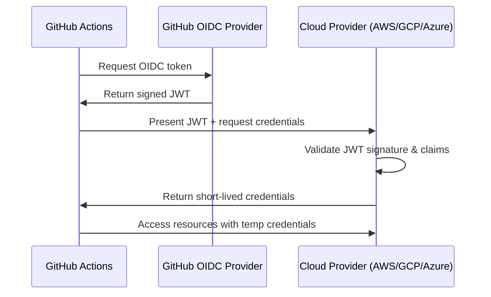

# How to Use GitHub Actions with OIDC for Secure Cloud Access

Author: [nawazdhandala](https://www.github.com/nawazdhandala)

Tags: GitHub Actions, OIDC, AWS, GCP, Azure, Security, CI/CD, DevOps

Description: Learn how to use GitHub Actions OIDC to securely access AWS, GCP, and Azure without storing long-lived credentials as secrets.

---

> Stop storing cloud credentials in your repository secrets. OIDC lets GitHub Actions authenticate directly with cloud providers using short-lived tokens that cannot be leaked or stolen.

## Why OIDC is Better Than Static Credentials

Traditional CI/CD pipelines store long-lived access keys as secrets. This approach has serious problems:

- **Key rotation is painful** - You need to update secrets across all repositories
- **Keys can leak** - Compromised secrets work until manually revoked
- **No audit trail** - Hard to trace which workflow used which credentials
- **Overly broad access** - Same key often used for multiple purposes

OIDC (OpenID Connect) solves these problems by letting GitHub Actions request short-lived tokens directly from cloud providers. No secrets to store, rotate, or leak.

## How OIDC Works with GitHub Actions



1. GitHub Actions workflow requests an OIDC token from GitHub
2. GitHub signs a JWT containing claims about the workflow (repo, branch, job, etc.)
3. Workflow presents the JWT to the cloud provider
4. Cloud provider validates the JWT signature against GitHub's public keys
5. Cloud provider checks claims match the trust policy
6. Cloud provider issues short-lived credentials (typically 1 hour)

## Setting Up OIDC with AWS

### Step 1: Create the OIDC Identity Provider

```bash
# Create the OIDC provider in AWS
aws iam create-open-id-connect-provider \
  --url https://token.actions.githubusercontent.com \
  --client-id-list sts.amazonaws.com \
  --thumbprint-list 6938fd4d98bab03faadb97b34396831e3780aea1
```

Or using Terraform:

```hcl
# Create GitHub OIDC provider
resource "aws_iam_openid_connect_provider" "github" {
  url = "https://token.actions.githubusercontent.com"

  client_id_list = ["sts.amazonaws.com"]

  # GitHub's thumbprint - verify current value at:
  # https://github.blog/changelog/2022-01-13-github-actions-update-on-oidc-based-deployments-to-aws/
  thumbprint_list = ["6938fd4d98bab03faadb97b34396831e3780aea1"]
}
```

### Step 2: Create an IAM Role with Trust Policy

```hcl
# IAM role that GitHub Actions will assume
resource "aws_iam_role" "github_actions" {
  name = "github-actions-deploy"

  assume_role_policy = jsonencode({
    Version = "2012-10-17"
    Statement = [
      {
        Effect = "Allow"
        Principal = {
          Federated = aws_iam_openid_connect_provider.github.arn
        }
        Action = "sts:AssumeRoleWithWebIdentity"
        Condition = {
          StringEquals = {
            # Only allow tokens from your org/repo
            "token.actions.githubusercontent.com:aud" = "sts.amazonaws.com"
          }
          StringLike = {
            # Restrict to specific repository and branch
            "token.actions.githubusercontent.com:sub" = "repo:your-org/your-repo:ref:refs/heads/main"
          }
        }
      }
    ]
  })
}

# Attach permissions the role needs
resource "aws_iam_role_policy_attachment" "github_actions_ecr" {
  role       = aws_iam_role.github_actions.name
  policy_arn = "arn:aws:iam::aws:policy/AmazonEC2ContainerRegistryPowerUser"
}
```

### Step 3: Configure the GitHub Actions Workflow

```yaml
# .github/workflows/deploy.yml
name: Deploy to AWS

on:
  push:
    branches: [main]

# Required for OIDC token generation
permissions:
  id-token: write   # Needed to request the JWT
  contents: read    # Needed to checkout code

jobs:
  deploy:
    runs-on: ubuntu-latest

    steps:
      - name: Checkout code
        uses: actions/checkout@v4

      # Configure AWS credentials using OIDC
      - name: Configure AWS credentials
        uses: aws-actions/configure-aws-credentials@v4
        with:
          role-to-assume: arn:aws:iam::123456789012:role/github-actions-deploy
          aws-region: us-east-1
          # Optional: session duration (default 1 hour, max 12 hours)
          role-duration-seconds: 3600

      # Now you can use AWS CLI/SDK
      - name: Deploy to ECR
        run: |
          aws ecr get-login-password --region us-east-1 | docker login --username AWS --password-stdin 123456789012.dkr.ecr.us-east-1.amazonaws.com
          docker build -t my-app .
          docker push 123456789012.dkr.ecr.us-east-1.amazonaws.com/my-app:${{ github.sha }}
```

## Setting Up OIDC with GCP

### Step 1: Create Workload Identity Pool and Provider

```bash
# Enable required APIs
gcloud services enable iamcredentials.googleapis.com

# Create workload identity pool
gcloud iam workload-identity-pools create "github-pool" \
  --project="your-project-id" \
  --location="global" \
  --display-name="GitHub Actions Pool"

# Create OIDC provider in the pool
gcloud iam workload-identity-pools providers create-oidc "github-provider" \
  --project="your-project-id" \
  --location="global" \
  --workload-identity-pool="github-pool" \
  --display-name="GitHub Provider" \
  --attribute-mapping="google.subject=assertion.sub,attribute.actor=assertion.actor,attribute.repository=assertion.repository,attribute.repository_owner=assertion.repository_owner" \
  --issuer-uri="https://token.actions.githubusercontent.com"
```

Or using Terraform:

```hcl
# Workload Identity Pool
resource "google_iam_workload_identity_pool" "github" {
  workload_identity_pool_id = "github-pool"
  display_name              = "GitHub Actions Pool"
  description               = "Pool for GitHub Actions OIDC"
}

# OIDC Provider in the pool
resource "google_iam_workload_identity_pool_provider" "github" {
  workload_identity_pool_id          = google_iam_workload_identity_pool.github.workload_identity_pool_id
  workload_identity_pool_provider_id = "github-provider"
  display_name                       = "GitHub Provider"

  attribute_mapping = {
    "google.subject"             = "assertion.sub"
    "attribute.actor"            = "assertion.actor"
    "attribute.repository"       = "assertion.repository"
    "attribute.repository_owner" = "assertion.repository_owner"
  }

  oidc {
    issuer_uri = "https://token.actions.githubusercontent.com"
  }
}
```

### Step 2: Create Service Account and Grant Access

```hcl
# Service account for GitHub Actions
resource "google_service_account" "github_actions" {
  account_id   = "github-actions-deploy"
  display_name = "GitHub Actions Deploy"
}

# Allow workload identity to impersonate this service account
resource "google_service_account_iam_binding" "github_actions_binding" {
  service_account_id = google_service_account.github_actions.name
  role               = "roles/iam.workloadIdentityUser"

  members = [
    # Restrict to specific repository
    "principalSet://iam.googleapis.com/${google_iam_workload_identity_pool.github.name}/attribute.repository/your-org/your-repo"
  ]
}

# Grant permissions to the service account
resource "google_project_iam_member" "github_actions_gke" {
  project = "your-project-id"
  role    = "roles/container.developer"
  member  = "serviceAccount:${google_service_account.github_actions.email}"
}
```

### Step 3: Configure GitHub Actions Workflow

```yaml
# .github/workflows/deploy-gcp.yml
name: Deploy to GCP

on:
  push:
    branches: [main]

permissions:
  id-token: write
  contents: read

jobs:
  deploy:
    runs-on: ubuntu-latest

    steps:
      - name: Checkout code
        uses: actions/checkout@v4

      # Authenticate to GCP using Workload Identity
      - name: Authenticate to Google Cloud
        uses: google-github-actions/auth@v2
        with:
          workload_identity_provider: 'projects/123456789/locations/global/workloadIdentityPools/github-pool/providers/github-provider'
          service_account: 'github-actions-deploy@your-project-id.iam.gserviceaccount.com'

      # Set up gcloud CLI
      - name: Set up Cloud SDK
        uses: google-github-actions/setup-gcloud@v2

      # Deploy to GKE
      - name: Deploy to GKE
        run: |
          gcloud container clusters get-credentials my-cluster --zone us-central1-a
          kubectl apply -f k8s/
```

## Setting Up OIDC with Azure

### Step 1: Create App Registration with Federated Credentials

Using Azure CLI:

```bash
# Create app registration
az ad app create --display-name "github-actions-deploy"

# Get the app ID
APP_ID=$(az ad app list --display-name "github-actions-deploy" --query "[0].appId" -o tsv)

# Create service principal
az ad sp create --id $APP_ID

# Create federated credential for the main branch
az ad app federated-credential create \
  --id $APP_ID \
  --parameters '{
    "name": "github-main-branch",
    "issuer": "https://token.actions.githubusercontent.com",
    "subject": "repo:your-org/your-repo:ref:refs/heads/main",
    "audiences": ["api://AzureADTokenExchange"]
  }'
```

Or using Terraform:

```hcl
# App registration
resource "azuread_application" "github_actions" {
  display_name = "github-actions-deploy"
}

# Service principal
resource "azuread_service_principal" "github_actions" {
  application_id = azuread_application.github_actions.application_id
}

# Federated credential for main branch
resource "azuread_application_federated_identity_credential" "github_main" {
  application_object_id = azuread_application.github_actions.object_id
  display_name          = "github-main-branch"
  description           = "GitHub Actions from main branch"
  audiences             = ["api://AzureADTokenExchange"]
  issuer                = "https://token.actions.githubusercontent.com"
  subject               = "repo:your-org/your-repo:ref:refs/heads/main"
}

# Federated credential for pull requests (separate if needed)
resource "azuread_application_federated_identity_credential" "github_pr" {
  application_object_id = azuread_application.github_actions.object_id
  display_name          = "github-pull-requests"
  description           = "GitHub Actions from pull requests"
  audiences             = ["api://AzureADTokenExchange"]
  issuer                = "https://token.actions.githubusercontent.com"
  subject               = "repo:your-org/your-repo:pull_request"
}

# Assign role to the service principal
resource "azurerm_role_assignment" "github_actions_contributor" {
  scope                = data.azurerm_subscription.current.id
  role_definition_name = "Contributor"
  principal_id         = azuread_service_principal.github_actions.object_id
}
```

### Step 2: Configure GitHub Actions Workflow

```yaml
# .github/workflows/deploy-azure.yml
name: Deploy to Azure

on:
  push:
    branches: [main]

permissions:
  id-token: write
  contents: read

env:
  AZURE_CLIENT_ID: ${{ secrets.AZURE_CLIENT_ID }}
  AZURE_TENANT_ID: ${{ secrets.AZURE_TENANT_ID }}
  AZURE_SUBSCRIPTION_ID: ${{ secrets.AZURE_SUBSCRIPTION_ID }}

jobs:
  deploy:
    runs-on: ubuntu-latest

    steps:
      - name: Checkout code
        uses: actions/checkout@v4

      # Login to Azure using OIDC
      - name: Azure Login
        uses: azure/login@v2
        with:
          client-id: ${{ env.AZURE_CLIENT_ID }}
          tenant-id: ${{ env.AZURE_TENANT_ID }}
          subscription-id: ${{ env.AZURE_SUBSCRIPTION_ID }}

      # Deploy to Azure
      - name: Deploy to AKS
        run: |
          az aks get-credentials --resource-group my-rg --name my-cluster
          kubectl apply -f k8s/
```

## Claim Customization and Restrictions

GitHub OIDC tokens include claims you can use to restrict access. Here are the most useful ones:

| Claim | Example Value | Use Case |
|-------|---------------|----------|
| `sub` | `repo:org/repo:ref:refs/heads/main` | Restrict to specific branch |
| `repository` | `org/repo` | Restrict to specific repo |
| `repository_owner` | `org` | Restrict to entire org |
| `job_workflow_ref` | `org/repo/.github/workflows/deploy.yml@refs/heads/main` | Restrict to specific workflow |
| `environment` | `production` | Restrict to GitHub Environment |

### Example: Restrict to Specific Workflow

```hcl
# AWS trust policy restricting to specific workflow file
{
  "Condition": {
    "StringEquals": {
      "token.actions.githubusercontent.com:aud": "sts.amazonaws.com"
    },
    "StringLike": {
      # Only allow the deploy.yml workflow on main branch
      "token.actions.githubusercontent.com:sub": "repo:your-org/your-repo:ref:refs/heads/main"
    }
  }
}
```

### Example: Restrict to GitHub Environment

```yaml
# Workflow using a GitHub Environment
jobs:
  deploy:
    runs-on: ubuntu-latest
    environment: production  # This adds environment claim to the token

    steps:
      - name: Configure AWS credentials
        uses: aws-actions/configure-aws-credentials@v4
        with:
          role-to-assume: arn:aws:iam::123456789012:role/production-deploy
          aws-region: us-east-1
```

```hcl
# Trust policy for production environment only
{
  "Condition": {
    "StringEquals": {
      "token.actions.githubusercontent.com:aud": "sts.amazonaws.com",
      "token.actions.githubusercontent.com:sub": "repo:your-org/your-repo:environment:production"
    }
  }
}
```

## Security Best Practices

### 1. Use the Most Restrictive Subject Claim

```hcl
# Bad: Any branch can assume this role
"token.actions.githubusercontent.com:sub": "repo:your-org/your-repo:*"

# Better: Only main branch
"token.actions.githubusercontent.com:sub": "repo:your-org/your-repo:ref:refs/heads/main"

# Best: Only production environment (requires manual approval)
"token.actions.githubusercontent.com:sub": "repo:your-org/your-repo:environment:production"
```

### 2. Apply Least Privilege Permissions

Create separate roles for different purposes:

```hcl
# Read-only role for CI tests
resource "aws_iam_role" "github_actions_ci" {
  name = "github-actions-ci"
  # Trust policy for any branch
}

# Deployment role with more permissions
resource "aws_iam_role" "github_actions_deploy" {
  name = "github-actions-deploy"
  # Trust policy for main branch only
}
```

### 3. Use GitHub Environments for Production

```yaml
# Define environments in repository settings with protection rules
jobs:
  deploy-staging:
    environment: staging
    # Auto-deploys

  deploy-production:
    environment: production
    needs: deploy-staging
    # Requires manual approval via environment protection rules
```

### 4. Audit and Monitor

```bash
# AWS: Check CloudTrail for AssumeRoleWithWebIdentity events
aws cloudtrail lookup-events \
  --lookup-attributes AttributeKey=EventName,AttributeValue=AssumeRoleWithWebIdentity

# GCP: Check audit logs
gcloud logging read 'protoPayload.methodName="google.iam.credentials.v1.IAMCredentials.GenerateAccessToken"'
```

### 5. Set Session Duration Appropriately

```yaml
# Only request the time you need
- name: Configure AWS credentials
  uses: aws-actions/configure-aws-credentials@v4
  with:
    role-to-assume: arn:aws:iam::123456789012:role/github-actions
    aws-region: us-east-1
    role-duration-seconds: 900  # 15 minutes instead of default 1 hour
```

## Troubleshooting Common Issues

### Error: "Not authorized to perform sts:AssumeRoleWithWebIdentity"

Common causes:

1. **Subject claim mismatch** - Check the exact format of your branch/environment

```bash
# Debug: Print the actual token claims
- name: Debug OIDC token
  run: |
    TOKEN=$(curl -s -H "Authorization: bearer $ACTIONS_ID_TOKEN_REQUEST_TOKEN" \
      "$ACTIONS_ID_TOKEN_REQUEST_URL&audience=sts.amazonaws.com" | jq -r '.value')
    echo $TOKEN | cut -d'.' -f2 | base64 -d 2>/dev/null | jq .
```

2. **Missing permissions block** - Ensure `id-token: write` is set

```yaml
permissions:
  id-token: write
  contents: read
```

3. **Wrong audience** - AWS uses `sts.amazonaws.com`, GCP uses the workload identity pool URL

### Error: "OIDC provider not found"

```bash
# Verify the provider exists
aws iam list-open-id-connect-providers

# Check the provider details
aws iam get-open-id-connect-provider \
  --open-id-connect-provider-arn arn:aws:iam::123456789012:oidc-provider/token.actions.githubusercontent.com
```

### Error: "Token expired"

The OIDC token has a short lifetime (about 5 minutes). If your workflow takes too long before requesting credentials, it will fail.

```yaml
# Get credentials early in the workflow
steps:
  - name: Configure AWS credentials  # Do this first
    uses: aws-actions/configure-aws-credentials@v4
    with:
      role-to-assume: arn:aws:iam::123456789012:role/github-actions
      aws-region: us-east-1

  - name: Checkout code  # Then checkout
    uses: actions/checkout@v4
```

### Error: GCP "Could not fetch access token"

```bash
# Verify workload identity pool configuration
gcloud iam workload-identity-pools providers describe github-provider \
  --project=your-project-id \
  --location=global \
  --workload-identity-pool=github-pool

# Check service account binding
gcloud iam service-accounts get-iam-policy github-actions-deploy@your-project-id.iam.gserviceaccount.com
```

## Migrating from Static Secrets

### Step 1: Audit Current Secret Usage

```bash
# List all secrets in your repository (via GitHub CLI)
gh secret list

# Check which workflows use which secrets
grep -r "secrets\." .github/workflows/
```

### Step 2: Create OIDC Configuration in Cloud Provider

Follow the setup steps for your cloud provider above.

### Step 3: Update Workflows Gradually

```yaml
# Before: Using static credentials
- name: Configure AWS credentials
  uses: aws-actions/configure-aws-credentials@v4
  with:
    aws-access-key-id: ${{ secrets.AWS_ACCESS_KEY_ID }}
    aws-secret-access-key: ${{ secrets.AWS_SECRET_ACCESS_KEY }}
    aws-region: us-east-1

# After: Using OIDC
- name: Configure AWS credentials
  uses: aws-actions/configure-aws-credentials@v4
  with:
    role-to-assume: arn:aws:iam::123456789012:role/github-actions
    aws-region: us-east-1
```

### Step 4: Test and Verify

Run the workflow on a branch first:

```yaml
# Temporarily allow the branch in your trust policy for testing
"token.actions.githubusercontent.com:sub": [
  "repo:your-org/your-repo:ref:refs/heads/main",
  "repo:your-org/your-repo:ref:refs/heads/migrate-to-oidc"
]
```

### Step 5: Remove Old Secrets

After verifying OIDC works:

```bash
# Delete the old static credentials
gh secret delete AWS_ACCESS_KEY_ID
gh secret delete AWS_SECRET_ACCESS_KEY

# Revoke the IAM user access keys in AWS
aws iam delete-access-key --user-name github-actions-user --access-key-id AKIA...
```

## Summary

| Aspect | Static Credentials | OIDC |
|--------|-------------------|------|
| Storage | Secrets in GitHub | No secrets needed |
| Rotation | Manual | Automatic (every request) |
| Lifetime | Until manually revoked | Minutes to hours |
| Audit | Limited | Full traceability |
| Blast radius | Until detected | Single job run |

OIDC is the modern, secure way to connect GitHub Actions to cloud providers. It eliminates credential management overhead while providing better security through short-lived, traceable tokens.

---

For monitoring your CI/CD pipelines and cloud deployments, check out [OneUptime](https://oneuptime.com) - the open-source observability platform that helps you track deployments, monitor infrastructure, and respond to incidents faster.
