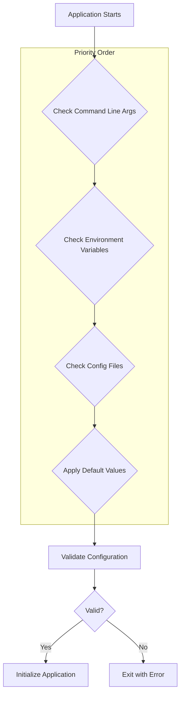
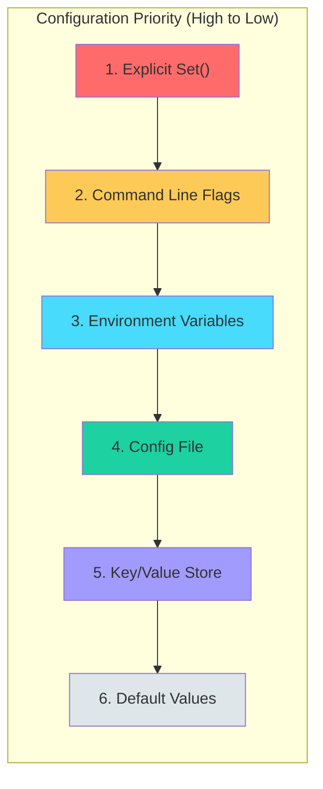
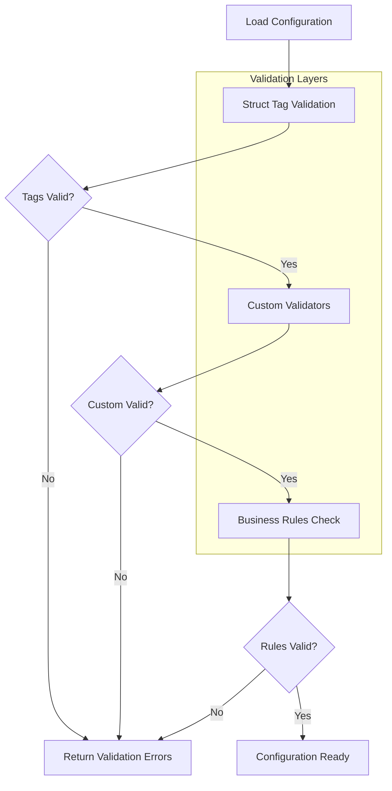
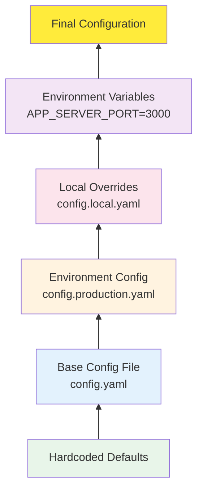

# How to Handle Configuration in Go Applications

Author: [nawazdhandala](https://www.github.com/nawazdhandala)

Tags: Go, Golang, Configuration, Viper, Environment Variables, YAML, JSON, TOML, Best Practices

Description: A comprehensive guide to handling configuration in Go applications, covering environment variables, Viper library, multiple configuration file formats, validation, and best practices for building maintainable applications.

---

> Proper configuration management is the foundation of building flexible, maintainable, and secure Go applications. The key is to separate configuration from code, support multiple sources, validate early, and provide sensible defaults.

Configuration is one of the most critical aspects of any application. It determines how your application behaves across different environments, from local development to production. Go provides several approaches to handle configuration, from simple environment variables to sophisticated configuration libraries.

---

## Prerequisites

Before we begin, ensure you have:
- Go 1.21 or higher installed
- Basic understanding of Go packages and modules
- A code editor with Go support
- An observability backend like [OneUptime](https://oneuptime.com) for monitoring

---

## Configuration Flow Overview

Understanding how configuration flows through your application is essential for designing a robust system.



---

## Using Environment Variables with os.Getenv

The simplest way to handle configuration in Go is using environment variables with the standard library. This approach is ideal for simple applications and follows the twelve-factor app methodology.

### Basic Environment Variable Reading

```go
// config/env.go
package config

import (
    "fmt"
    "os"
    "strconv"
    "time"
)

// Config holds all configuration values for the application.
// Using a struct makes it easy to pass configuration around
// and ensures type safety at compile time.
type Config struct {
    // Server configuration
    ServerHost string
    ServerPort int

    // Database configuration
    DatabaseURL      string
    DatabasePoolSize int

    // Application settings
    LogLevel    string
    Environment string
    Debug       bool

    // Timeouts
    ReadTimeout  time.Duration
    WriteTimeout time.Duration
}

// LoadFromEnv reads configuration from environment variables.
// This function demonstrates the basic pattern for loading
// configuration without any external dependencies.
func LoadFromEnv() (*Config, error) {
    cfg := &Config{}

    // Server configuration with defaults
    // getEnvOrDefault returns the environment variable value
    // or falls back to the provided default value
    cfg.ServerHost = getEnvOrDefault("SERVER_HOST", "0.0.0.0")

    // Parse integer values with error handling
    // Environment variables are always strings, so we need
    // to convert them to appropriate types
    port, err := strconv.Atoi(getEnvOrDefault("SERVER_PORT", "8080"))
    if err != nil {
        return nil, fmt.Errorf("invalid SERVER_PORT: %w", err)
    }
    cfg.ServerPort = port

    // Database configuration
    // For sensitive values like database URLs, we don't provide
    // defaults - the application should fail if they're missing
    cfg.DatabaseURL = os.Getenv("DATABASE_URL")
    if cfg.DatabaseURL == "" {
        return nil, fmt.Errorf("DATABASE_URL is required")
    }

    // Parse pool size with default value
    poolSize, err := strconv.Atoi(getEnvOrDefault("DATABASE_POOL_SIZE", "10"))
    if err != nil {
        return nil, fmt.Errorf("invalid DATABASE_POOL_SIZE: %w", err)
    }
    cfg.DatabasePoolSize = poolSize

    // Application settings with sensible defaults
    cfg.LogLevel = getEnvOrDefault("LOG_LEVEL", "info")
    cfg.Environment = getEnvOrDefault("ENVIRONMENT", "development")
    cfg.Debug = getEnvOrDefault("DEBUG", "false") == "true"

    // Parse duration values
    // Go's time.ParseDuration accepts strings like "30s", "5m", "1h"
    readTimeout, err := time.ParseDuration(getEnvOrDefault("READ_TIMEOUT", "30s"))
    if err != nil {
        return nil, fmt.Errorf("invalid READ_TIMEOUT: %w", err)
    }
    cfg.ReadTimeout = readTimeout

    writeTimeout, err := time.ParseDuration(getEnvOrDefault("WRITE_TIMEOUT", "30s"))
    if err != nil {
        return nil, fmt.Errorf("invalid WRITE_TIMEOUT: %w", err)
    }
    cfg.WriteTimeout = writeTimeout

    return cfg, nil
}

// getEnvOrDefault retrieves an environment variable or returns
// the default value if the variable is not set or empty.
// This is a common helper pattern for configuration loading.
func getEnvOrDefault(key, defaultValue string) string {
    if value := os.Getenv(key); value != "" {
        return value
    }
    return defaultValue
}
```

### Using the Configuration in Your Application

```go
// main.go
package main

import (
    "fmt"
    "log"
    "net/http"

    "myapp/config"
)

func main() {
    // Load configuration at application startup
    // This is the first thing we do to ensure all
    // dependencies have access to configuration
    cfg, err := config.LoadFromEnv()
    if err != nil {
        // Configuration errors should cause immediate exit
        // Don't try to continue with invalid configuration
        log.Fatalf("Failed to load configuration: %v", err)
    }

    // Log configuration for debugging (exclude sensitive values)
    log.Printf("Starting server on %s:%d", cfg.ServerHost, cfg.ServerPort)
    log.Printf("Environment: %s, Debug: %v", cfg.Environment, cfg.Debug)

    // Create server with configuration
    server := &http.Server{
        Addr:         fmt.Sprintf("%s:%d", cfg.ServerHost, cfg.ServerPort),
        ReadTimeout:  cfg.ReadTimeout,
        WriteTimeout: cfg.WriteTimeout,
    }

    // Start the server
    if err := server.ListenAndServe(); err != nil {
        log.Fatalf("Server failed: %v", err)
    }
}
```

### Using the envconfig Package

For a cleaner approach with struct tags, use Kelsey Hightower's envconfig package.

```go
// config/envconfig.go
package config

import (
    "fmt"
    "log"
    "time"

    "github.com/kelseyhightower/envconfig"
)

// AppConfig uses struct tags to define environment variable mappings.
// The envconfig package automatically handles type conversion and
// provides support for required fields and default values.
type AppConfig struct {
    // Required field - app will fail to start if not set
    DatabaseURL string `envconfig:"DATABASE_URL" required:"true"`

    // Port with a default value
    Port int `envconfig:"PORT" default:"8080"`

    // Boolean flag with default
    Debug bool `envconfig:"DEBUG" default:"false"`

    // Duration parsing is built-in
    Timeout time.Duration `envconfig:"TIMEOUT" default:"30s"`

    // Slice from comma-separated values
    AllowedOrigins []string `envconfig:"ALLOWED_ORIGINS" default:"http://localhost:3000"`

    // Nested struct with prefix
    Redis RedisConfig
}

// RedisConfig holds Redis connection settings.
// Nested structs are supported with their own tags.
type RedisConfig struct {
    Host     string `envconfig:"REDIS_HOST" default:"localhost"`
    Port     int    `envconfig:"REDIS_PORT" default:"6379"`
    Password string `envconfig:"REDIS_PASSWORD"`
    DB       int    `envconfig:"REDIS_DB" default:"0"`
}

// LoadWithEnvconfig loads configuration using the envconfig package.
// It provides automatic type conversion and validation.
func LoadWithEnvconfig() (*AppConfig, error) {
    var cfg AppConfig

    // Process environment variables into the struct
    // The empty string prefix means no prefix is added to env var names
    err := envconfig.Process("", &cfg)
    if err != nil {
        return nil, fmt.Errorf("failed to load configuration: %w", err)
    }

    return &cfg, nil
}

func main() {
    cfg, err := LoadWithEnvconfig()
    if err != nil {
        log.Fatalf("Configuration error: %v", err)
    }

    fmt.Printf("Server will listen on port: %d\n", cfg.Port)
    fmt.Printf("Request timeout: %v\n", cfg.Timeout)
    fmt.Printf("Redis: %s:%d\n", cfg.Redis.Host, cfg.Redis.Port)
}
```

---

## Using Viper for Configuration

Viper is the most popular configuration library for Go. It supports multiple configuration formats, environment variables, command-line flags, and remote configuration systems.

### Installation

```bash
# Install viper - the Swiss Army knife of Go configuration
go get github.com/spf13/viper
```

### Basic Viper Setup

```go
// config/viper.go
package config

import (
    "fmt"
    "strings"
    "time"

    "github.com/spf13/viper"
)

// AppConfig represents the complete application configuration.
// Viper can automatically bind struct fields to configuration
// keys using the mapstructure tag.
type AppConfig struct {
    Server   ServerConfig   `mapstructure:"server"`
    Database DatabaseConfig `mapstructure:"database"`
    Cache    CacheConfig    `mapstructure:"cache"`
    Logging  LoggingConfig  `mapstructure:"logging"`
    Features FeatureFlags   `mapstructure:"features"`
}

// ServerConfig holds HTTP server settings.
// Using nested structs keeps related configuration grouped
// and makes the configuration file structure intuitive.
type ServerConfig struct {
    Host         string        `mapstructure:"host"`
    Port         int           `mapstructure:"port"`
    ReadTimeout  time.Duration `mapstructure:"read_timeout"`
    WriteTimeout time.Duration `mapstructure:"write_timeout"`
    IdleTimeout  time.Duration `mapstructure:"idle_timeout"`
}

// DatabaseConfig holds database connection settings.
type DatabaseConfig struct {
    Driver          string        `mapstructure:"driver"`
    Host            string        `mapstructure:"host"`
    Port            int           `mapstructure:"port"`
    Name            string        `mapstructure:"name"`
    User            string        `mapstructure:"user"`
    Password        string        `mapstructure:"password"`
    SSLMode         string        `mapstructure:"ssl_mode"`
    MaxOpenConns    int           `mapstructure:"max_open_conns"`
    MaxIdleConns    int           `mapstructure:"max_idle_conns"`
    ConnMaxLifetime time.Duration `mapstructure:"conn_max_lifetime"`
}

// CacheConfig holds Redis cache settings.
type CacheConfig struct {
    Enabled  bool          `mapstructure:"enabled"`
    Host     string        `mapstructure:"host"`
    Port     int           `mapstructure:"port"`
    Password string        `mapstructure:"password"`
    DB       int           `mapstructure:"db"`
    TTL      time.Duration `mapstructure:"ttl"`
}

// LoggingConfig holds logging configuration.
type LoggingConfig struct {
    Level      string `mapstructure:"level"`
    Format     string `mapstructure:"format"`
    Output     string `mapstructure:"output"`
    FilePath   string `mapstructure:"file_path"`
    MaxSize    int    `mapstructure:"max_size"`
    MaxBackups int    `mapstructure:"max_backups"`
    MaxAge     int    `mapstructure:"max_age"`
}

// FeatureFlags holds feature toggle settings.
type FeatureFlags struct {
    NewDashboard    bool `mapstructure:"new_dashboard"`
    BetaFeatures    bool `mapstructure:"beta_features"`
    MaintenanceMode bool `mapstructure:"maintenance_mode"`
}

// LoadConfig initializes viper and loads configuration
// from multiple sources with the following priority order:
// 1. Environment variables (highest priority)
// 2. Configuration file
// 3. Default values (lowest priority)
func LoadConfig(configPath string) (*AppConfig, error) {
    v := viper.New()

    // Set default values first
    // Defaults ensure the application can run with minimal configuration
    setDefaults(v)

    // Configure config file location
    if configPath != "" {
        // Use specific config file if provided
        v.SetConfigFile(configPath)
    } else {
        // Search for config in standard locations
        v.SetConfigName("config")           // Name of config file (without extension)
        v.SetConfigType("yaml")             // Config file format
        v.AddConfigPath(".")                // Current directory
        v.AddConfigPath("./config")         // Config subdirectory
        v.AddConfigPath("/etc/myapp")       // System config directory
        v.AddConfigPath("$HOME/.myapp")     // User config directory
    }

    // Read the config file
    // We don't treat missing config file as fatal error
    // since we have defaults and environment variables
    if err := v.ReadInConfig(); err != nil {
        if _, ok := err.(viper.ConfigFileNotFoundError); !ok {
            // Config file was found but another error was produced
            return nil, fmt.Errorf("error reading config file: %w", err)
        }
        // Config file not found, will use defaults and env vars
    }

    // Enable environment variable binding
    // This allows any config value to be overridden via env var
    v.SetEnvPrefix("APP")                  // Environment variable prefix
    v.SetEnvKeyReplacer(strings.NewReplacer(
        ".", "_",                          // server.port -> SERVER_PORT
        "-", "_",                          // some-key -> SOME_KEY
    ))
    v.AutomaticEnv()                       // Automatically read env vars

    // Unmarshal configuration into struct
    var config AppConfig
    if err := v.Unmarshal(&config); err != nil {
        return nil, fmt.Errorf("unable to decode config: %w", err)
    }

    return &config, nil
}

// setDefaults configures default values for all settings.
// Defaults should be sensible for local development.
func setDefaults(v *viper.Viper) {
    // Server defaults
    v.SetDefault("server.host", "0.0.0.0")
    v.SetDefault("server.port", 8080)
    v.SetDefault("server.read_timeout", "30s")
    v.SetDefault("server.write_timeout", "30s")
    v.SetDefault("server.idle_timeout", "60s")

    // Database defaults
    v.SetDefault("database.driver", "postgres")
    v.SetDefault("database.host", "localhost")
    v.SetDefault("database.port", 5432)
    v.SetDefault("database.ssl_mode", "disable")
    v.SetDefault("database.max_open_conns", 25)
    v.SetDefault("database.max_idle_conns", 5)
    v.SetDefault("database.conn_max_lifetime", "5m")

    // Cache defaults
    v.SetDefault("cache.enabled", false)
    v.SetDefault("cache.host", "localhost")
    v.SetDefault("cache.port", 6379)
    v.SetDefault("cache.db", 0)
    v.SetDefault("cache.ttl", "1h")

    // Logging defaults
    v.SetDefault("logging.level", "info")
    v.SetDefault("logging.format", "json")
    v.SetDefault("logging.output", "stdout")
    v.SetDefault("logging.max_size", 100)
    v.SetDefault("logging.max_backups", 3)
    v.SetDefault("logging.max_age", 28)

    // Feature flags defaults
    v.SetDefault("features.new_dashboard", false)
    v.SetDefault("features.beta_features", false)
    v.SetDefault("features.maintenance_mode", false)
}
```

### Configuration Source Priority

Understanding Viper's configuration precedence is crucial for debugging configuration issues.



---

## Configuration File Formats (YAML, JSON, TOML)

Go applications commonly use YAML, JSON, or TOML for configuration files. Each format has its strengths.

### YAML Configuration

YAML is the most popular format due to its readability and support for comments.

```yaml
# config.yaml
# Application configuration for MyApp
# This file contains settings for local development

server:
  host: "0.0.0.0"
  port: 8080
  read_timeout: "30s"
  write_timeout: "30s"
  idle_timeout: "60s"

database:
  driver: "postgres"
  host: "localhost"
  port: 5432
  name: "myapp_dev"
  user: "myapp"
  password: "${DATABASE_PASSWORD}"  # Use env var for sensitive data
  ssl_mode: "disable"
  max_open_conns: 25
  max_idle_conns: 5
  conn_max_lifetime: "5m"

cache:
  enabled: true
  host: "localhost"
  port: 6379
  password: ""
  db: 0
  ttl: "1h"

logging:
  level: "debug"
  format: "text"  # Use "json" in production
  output: "stdout"

features:
  new_dashboard: true
  beta_features: false
  maintenance_mode: false

# Observability settings for OneUptime integration
observability:
  enabled: true
  endpoint: "https://oneuptime.com/otlp"
  service_name: "myapp"
  environment: "development"
```

### Reading YAML with Standard Library

```go
// config/yaml_loader.go
package config

import (
    "fmt"
    "os"
    "time"

    "gopkg.in/yaml.v3"
)

// ServerConfig holds server-related configuration.
type ServerConfig struct {
    Host         string        `yaml:"host"`
    Port         int           `yaml:"port"`
    ReadTimeout  time.Duration `yaml:"read_timeout"`
    WriteTimeout time.Duration `yaml:"write_timeout"`
}

// DatabaseConfig holds database connection settings.
type DatabaseConfig struct {
    Driver          string        `yaml:"driver"`
    Host            string        `yaml:"host"`
    Port            int           `yaml:"port"`
    Name            string        `yaml:"name"`
    User            string        `yaml:"user"`
    Password        string        `yaml:"password"`
    MaxOpenConns    int           `yaml:"max_open_conns"`
    MaxIdleConns    int           `yaml:"max_idle_conns"`
    ConnMaxLifetime time.Duration `yaml:"conn_max_lifetime"`
}

// Config is the root configuration structure.
type Config struct {
    Server   ServerConfig   `yaml:"server"`
    Database DatabaseConfig `yaml:"database"`
}

// LoadYAMLConfig reads and parses a YAML configuration file.
// It also expands environment variables in the configuration.
func LoadYAMLConfig(path string) (*Config, error) {
    // Read the file contents
    data, err := os.ReadFile(path)
    if err != nil {
        return nil, fmt.Errorf("failed to read config file: %w", err)
    }

    // Expand environment variables in the config
    // This allows ${VAR_NAME} syntax in YAML files
    expanded := os.ExpandEnv(string(data))

    // Parse YAML into struct
    var cfg Config
    if err := yaml.Unmarshal([]byte(expanded), &cfg); err != nil {
        return nil, fmt.Errorf("failed to parse config file: %w", err)
    }

    return &cfg, nil
}

func main() {
    cfg, err := LoadYAMLConfig("config.yaml")
    if err != nil {
        fmt.Printf("Error: %v\n", err)
        os.Exit(1)
    }

    fmt.Printf("Server: %s:%d\n", cfg.Server.Host, cfg.Server.Port)
    fmt.Printf("Database: %s@%s:%d/%s\n",
        cfg.Database.User, cfg.Database.Host,
        cfg.Database.Port, cfg.Database.Name)
}
```

### JSON Configuration

JSON is widely supported but doesn't allow comments.

```json
{
  "server": {
    "host": "0.0.0.0",
    "port": 8080,
    "read_timeout": "30s",
    "write_timeout": "30s",
    "idle_timeout": "60s"
  },
  "database": {
    "driver": "postgres",
    "host": "localhost",
    "port": 5432,
    "name": "myapp_dev",
    "user": "myapp",
    "password": "",
    "ssl_mode": "disable",
    "max_open_conns": 25,
    "max_idle_conns": 5,
    "conn_max_lifetime": "5m"
  },
  "cache": {
    "enabled": true,
    "host": "localhost",
    "port": 6379,
    "password": "",
    "db": 0,
    "ttl": "1h"
  },
  "logging": {
    "level": "info",
    "format": "json",
    "output": "stdout"
  },
  "features": {
    "new_dashboard": false,
    "beta_features": false,
    "maintenance_mode": false
  }
}
```

### Reading JSON Configuration

```go
// config/json_loader.go
package config

import (
    "encoding/json"
    "fmt"
    "os"
)

// JSONConfig represents the JSON configuration structure.
type JSONConfig struct {
    AppName     string   `json:"app_name"`
    Environment string   `json:"environment"`
    Port        int      `json:"port"`
    Features    []string `json:"features"`
}

// LoadJSONConfig reads and parses a JSON configuration file.
// It uses strict parsing to catch unknown fields.
func LoadJSONConfig(path string) (*JSONConfig, error) {
    file, err := os.Open(path)
    if err != nil {
        return nil, fmt.Errorf("failed to open config: %w", err)
    }
    defer file.Close()

    var cfg JSONConfig
    decoder := json.NewDecoder(file)

    // Disallow unknown fields for strict parsing
    // This helps catch typos in configuration keys
    decoder.DisallowUnknownFields()

    if err := decoder.Decode(&cfg); err != nil {
        return nil, fmt.Errorf("failed to decode config: %w", err)
    }

    return &cfg, nil
}
```

### TOML Configuration

TOML provides a balance between readability and structure.

```toml
# config.toml
# Application Configuration

[server]
host = "0.0.0.0"
port = 8080
read_timeout = "30s"
write_timeout = "30s"
idle_timeout = "60s"

[database]
driver = "postgres"
host = "localhost"
port = 5432
name = "myapp_dev"
user = "myapp"
password = ""
ssl_mode = "disable"
max_open_conns = 25
max_idle_conns = 5
conn_max_lifetime = "5m"

[cache]
enabled = true
host = "localhost"
port = 6379
password = ""
db = 0
ttl = "1h"

[logging]
level = "info"
format = "json"
output = "stdout"

[features]
new_dashboard = false
beta_features = false
maintenance_mode = false
```

### Reading TOML Configuration

```go
// config/toml_loader.go
package config

import (
    "fmt"

    "github.com/BurntSushi/toml"
)

// TOMLConfig represents the TOML configuration structure.
type TOMLConfig struct {
    Title    string
    Server   ServerConfig
    Database DatabaseConfig
}

// LoadTOMLConfig reads and parses a TOML configuration file.
func LoadTOMLConfig(path string) (*TOMLConfig, error) {
    var cfg TOMLConfig

    // toml.DecodeFile reads and decodes in one step
    if _, err := toml.DecodeFile(path, &cfg); err != nil {
        return nil, fmt.Errorf("failed to load TOML config: %w", err)
    }

    return &cfg, nil
}
```

### Multi-Format Support with Viper

```go
// config/multi_format.go
package config

import (
    "fmt"
    "path/filepath"

    "github.com/spf13/viper"
)

// LoadConfigFile loads configuration from a file,
// automatically detecting the format from the extension.
// Supported formats: yaml, yml, json, toml, hcl, env, properties
func LoadConfigFile(filename string) (*AppConfig, error) {
    v := viper.New()

    // Set defaults first
    setDefaults(v)

    // Determine file type from extension
    ext := filepath.Ext(filename)
    switch ext {
    case ".yaml", ".yml":
        v.SetConfigType("yaml")
    case ".json":
        v.SetConfigType("json")
    case ".toml":
        v.SetConfigType("toml")
    case ".env":
        v.SetConfigType("env")
    default:
        return nil, fmt.Errorf("unsupported config format: %s", ext)
    }

    v.SetConfigFile(filename)

    if err := v.ReadInConfig(); err != nil {
        return nil, fmt.Errorf("failed to read config file: %w", err)
    }

    var config AppConfig
    if err := v.Unmarshal(&config); err != nil {
        return nil, fmt.Errorf("failed to unmarshal config: %w", err)
    }

    return &config, nil
}
```

---

## Configuration Validation

Validating configuration at startup prevents runtime errors and makes debugging easier.

### Installation

```bash
# Install the validator library
go get github.com/go-playground/validator/v10
```

### Implementing Validation

```go
// config/validation.go
package config

import (
    "fmt"
    "net"
    "strings"
    "time"

    "github.com/go-playground/validator/v10"
)

// ValidatedConfig extends AppConfig with validation tags.
// The validate tag specifies validation rules that are
// checked when Validate() is called.
type ValidatedConfig struct {
    Server   ValidatedServerConfig   `mapstructure:"server" validate:"required"`
    Database ValidatedDatabaseConfig `mapstructure:"database" validate:"required"`
    Cache    ValidatedCacheConfig    `mapstructure:"cache"`
    Logging  ValidatedLoggingConfig  `mapstructure:"logging" validate:"required"`
}

// ValidatedServerConfig includes validation rules for server settings.
type ValidatedServerConfig struct {
    // Host must be a valid IPv4, IPv6, or hostname
    Host string `mapstructure:"host" validate:"required,ip|hostname"`

    // Port must be between 1 and 65535
    Port int `mapstructure:"port" validate:"required,min=1,max=65535"`

    // Timeouts must be positive durations
    ReadTimeout  time.Duration `mapstructure:"read_timeout" validate:"required,gt=0"`
    WriteTimeout time.Duration `mapstructure:"write_timeout" validate:"required,gt=0"`
    IdleTimeout  time.Duration `mapstructure:"idle_timeout" validate:"required,gt=0"`
}

// ValidatedDatabaseConfig includes validation rules for database settings.
type ValidatedDatabaseConfig struct {
    // Driver must be one of the supported database drivers
    Driver string `mapstructure:"driver" validate:"required,oneof=postgres mysql sqlite3"`

    Host string `mapstructure:"host" validate:"required"`
    Port int    `mapstructure:"port" validate:"required,min=1,max=65535"`
    Name string `mapstructure:"name" validate:"required,min=1,max=63"`
    User string `mapstructure:"user" validate:"required"`

    // Password is required in production but optional in development
    Password string `mapstructure:"password"`

    // SSL mode must be a valid PostgreSQL SSL mode
    SSLMode string `mapstructure:"ssl_mode" validate:"required,oneof=disable allow prefer require verify-ca verify-full"`

    // Connection pool settings with reasonable bounds
    MaxOpenConns    int           `mapstructure:"max_open_conns" validate:"min=1,max=1000"`
    MaxIdleConns    int           `mapstructure:"max_idle_conns" validate:"min=0,max=1000"`
    ConnMaxLifetime time.Duration `mapstructure:"conn_max_lifetime" validate:"gt=0"`
}

// ValidatedCacheConfig includes validation rules for cache settings.
type ValidatedCacheConfig struct {
    Enabled  bool          `mapstructure:"enabled"`
    Host     string        `mapstructure:"host" validate:"required_if=Enabled true"`
    Port     int           `mapstructure:"port" validate:"required_if=Enabled true,min=1,max=65535"`
    Password string        `mapstructure:"password"`
    DB       int           `mapstructure:"db" validate:"min=0,max=15"`
    TTL      time.Duration `mapstructure:"ttl" validate:"gt=0"`
}

// ValidatedLoggingConfig includes validation rules for logging settings.
type ValidatedLoggingConfig struct {
    // Level must be a valid log level
    Level string `mapstructure:"level" validate:"required,oneof=debug info warn error fatal"`

    // Format must be text or json
    Format string `mapstructure:"format" validate:"required,oneof=text json"`

    // Output must be stdout, stderr, or file
    Output string `mapstructure:"output" validate:"required,oneof=stdout stderr file"`

    // FilePath is required if output is file
    FilePath string `mapstructure:"file_path" validate:"required_if=Output file"`
}

// ConfigValidator handles configuration validation.
type ConfigValidator struct {
    validate *validator.Validate
}

// NewConfigValidator creates a new validator with custom rules.
func NewConfigValidator() *ConfigValidator {
    v := validator.New()

    // Register custom validation functions
    // These extend the built-in validators with domain-specific rules
    v.RegisterValidation("valid_log_level", validateLogLevel)
    v.RegisterValidation("valid_host", validateHost)

    return &ConfigValidator{validate: v}
}

// Validate checks all configuration values against their rules.
// Returns a detailed error message listing all validation failures.
func (cv *ConfigValidator) Validate(config *ValidatedConfig) error {
    if err := cv.validate.Struct(config); err != nil {
        // Convert validation errors to a more readable format
        if validationErrors, ok := err.(validator.ValidationErrors); ok {
            return formatValidationErrors(validationErrors)
        }
        return err
    }

    // Additional custom validation logic
    if err := cv.validateBusinessRules(config); err != nil {
        return err
    }

    return nil
}

// validateBusinessRules checks cross-field validation rules
// that can't be expressed with struct tags.
func (cv *ConfigValidator) validateBusinessRules(config *ValidatedConfig) error {
    // MaxIdleConns should not exceed MaxOpenConns
    if config.Database.MaxIdleConns > config.Database.MaxOpenConns {
        return fmt.Errorf(
            "database.max_idle_conns (%d) cannot exceed database.max_open_conns (%d)",
            config.Database.MaxIdleConns,
            config.Database.MaxOpenConns,
        )
    }

    // WriteTimeout should be greater than or equal to ReadTimeout
    if config.Server.WriteTimeout < config.Server.ReadTimeout {
        return fmt.Errorf(
            "server.write_timeout (%s) should be >= server.read_timeout (%s)",
            config.Server.WriteTimeout,
            config.Server.ReadTimeout,
        )
    }

    return nil
}

// validateLogLevel is a custom validator for log levels.
func validateLogLevel(fl validator.FieldLevel) bool {
    level := fl.Field().String()
    validLevels := map[string]bool{
        "debug": true, "info": true, "warn": true,
        "error": true, "fatal": true,
    }
    return validLevels[level]
}

// validateHost checks if a string is a valid host (IP or hostname).
func validateHost(fl validator.FieldLevel) bool {
    host := fl.Field().String()

    // Check if it's a valid IP
    if ip := net.ParseIP(host); ip != nil {
        return true
    }

    // Check if it's a valid hostname (basic check)
    if len(host) > 0 && len(host) <= 253 {
        return true
    }

    return false
}

// formatValidationErrors converts validation errors to readable messages.
func formatValidationErrors(errors validator.ValidationErrors) error {
    var messages []string
    for _, err := range errors {
        msg := fmt.Sprintf(
            "field '%s' failed validation: %s",
            err.Namespace(),
            err.Tag(),
        )
        messages = append(messages, msg)
    }
    return fmt.Errorf("configuration validation failed:\n  - %s",
        strings.Join(messages, "\n  - "))
}
```

### Validation Flow



---

## Default Values and Overrides

Implementing a robust default and override system ensures your application works across all environments.

### Layered Configuration System

```go
// config/layered.go
package config

import (
    "fmt"
    "os"
    "strings"

    "github.com/spf13/viper"
)

// ConfigLoader manages loading configuration from multiple sources.
// It implements a layered approach where each layer can override
// values from the previous layer.
type ConfigLoader struct {
    v           *viper.Viper
    environment string
}

// NewConfigLoader creates a new configuration loader.
func NewConfigLoader() *ConfigLoader {
    return &ConfigLoader{
        v:           viper.New(),
        environment: os.Getenv("APP_ENV"),
    }
}

// Load reads configuration from all sources in priority order.
// Later sources override earlier ones.
func (cl *ConfigLoader) Load() (*AppConfig, error) {
    // Step 1: Set hardcoded defaults
    // These are the fallback values used when nothing else is specified
    cl.setHardcodedDefaults()

    // Step 2: Load base configuration file
    // This contains settings common to all environments
    if err := cl.loadBaseConfig(); err != nil {
        return nil, fmt.Errorf("failed to load base config: %w", err)
    }

    // Step 3: Load environment-specific configuration
    // This contains settings specific to dev, staging, or prod
    if err := cl.loadEnvironmentConfig(); err != nil {
        // Environment-specific config is optional
        // Log warning but don't fail
        fmt.Printf("Warning: %v\n", err)
    }

    // Step 4: Load local overrides (not committed to version control)
    // Developers can use this for personal settings
    if err := cl.loadLocalOverrides(); err != nil {
        // Local overrides are optional
        // Silently ignore if not present
    }

    // Step 5: Apply environment variable overrides
    // Environment variables have highest priority
    cl.applyEnvironmentVariables()

    // Step 6: Unmarshal to struct
    var config AppConfig
    if err := cl.v.Unmarshal(&config); err != nil {
        return nil, fmt.Errorf("failed to unmarshal config: %w", err)
    }

    return &config, nil
}

// setHardcodedDefaults sets the absolute baseline defaults.
// These ensure the application can start with zero configuration.
func (cl *ConfigLoader) setHardcodedDefaults() {
    defaults := map[string]interface{}{
        // Server defaults suitable for local development
        "server.host":          "127.0.0.1",
        "server.port":          8080,
        "server.read_timeout":  "30s",
        "server.write_timeout": "30s",
        "server.idle_timeout":  "120s",

        // Database defaults for local PostgreSQL
        "database.driver":            "postgres",
        "database.host":              "localhost",
        "database.port":              5432,
        "database.name":              "app_development",
        "database.user":              "postgres",
        "database.password":          "",
        "database.ssl_mode":          "disable",
        "database.max_open_conns":    10,
        "database.max_idle_conns":    5,
        "database.conn_max_lifetime": "1h",

        // Cache disabled by default
        "cache.enabled": false,
        "cache.host":    "localhost",
        "cache.port":    6379,
        "cache.db":      0,
        "cache.ttl":     "1h",

        // Verbose logging for development
        "logging.level":  "debug",
        "logging.format": "text",
        "logging.output": "stdout",

        // All features disabled by default
        "features.new_dashboard":    false,
        "features.beta_features":    false,
        "features.maintenance_mode": false,
    }

    for key, value := range defaults {
        cl.v.SetDefault(key, value)
    }
}

// loadBaseConfig loads the base configuration file.
func (cl *ConfigLoader) loadBaseConfig() error {
    cl.v.SetConfigName("config")
    cl.v.SetConfigType("yaml")
    cl.v.AddConfigPath(".")
    cl.v.AddConfigPath("./config")

    if err := cl.v.ReadInConfig(); err != nil {
        if _, ok := err.(viper.ConfigFileNotFoundError); ok {
            // Base config not found, will use defaults
            return nil
        }
        return err
    }

    return nil
}

// loadEnvironmentConfig loads environment-specific configuration.
// Files are named config.{environment}.yaml (e.g., config.production.yaml)
func (cl *ConfigLoader) loadEnvironmentConfig() error {
    if cl.environment == "" {
        cl.environment = "development"
    }

    envConfigName := fmt.Sprintf("config.%s", cl.environment)

    envViper := viper.New()
    envViper.SetConfigName(envConfigName)
    envViper.SetConfigType("yaml")
    envViper.AddConfigPath(".")
    envViper.AddConfigPath("./config")

    if err := envViper.ReadInConfig(); err != nil {
        if _, ok := err.(viper.ConfigFileNotFoundError); ok {
            return fmt.Errorf("no config file for environment: %s", cl.environment)
        }
        return err
    }

    // Merge environment config into main config
    if err := cl.v.MergeConfigMap(envViper.AllSettings()); err != nil {
        return fmt.Errorf("failed to merge environment config: %w", err)
    }

    return nil
}

// loadLocalOverrides loads local development overrides.
// The config.local.yaml file should be in .gitignore
func (cl *ConfigLoader) loadLocalOverrides() error {
    localViper := viper.New()
    localViper.SetConfigName("config.local")
    localViper.SetConfigType("yaml")
    localViper.AddConfigPath(".")
    localViper.AddConfigPath("./config")

    if err := localViper.ReadInConfig(); err != nil {
        return err // Silently fail if not found
    }

    return cl.v.MergeConfigMap(localViper.AllSettings())
}

// applyEnvironmentVariables binds environment variables to config keys.
// Environment variables use the APP_ prefix and underscores for nesting.
// Example: APP_SERVER_PORT=3000 maps to server.port
func (cl *ConfigLoader) applyEnvironmentVariables() {
    cl.v.SetEnvPrefix("APP")
    cl.v.SetEnvKeyReplacer(strings.NewReplacer(".", "_"))
    cl.v.AutomaticEnv()
}
```

### Configuration Priority Visualization



---

## Complete Example: Production-Ready Configuration

Here's a complete example bringing everything together.

```go
// config/config.go
package config

import (
    "fmt"
    "os"
    "sync"

    "github.com/go-playground/validator/v10"
    "github.com/spf13/viper"
)

// Global configuration instance with thread-safe access.
// Using sync.Once ensures configuration is loaded exactly once.
var (
    instance *AppConfig
    once     sync.Once
    loadErr  error
)

// Get returns the global configuration instance.
// This function is safe to call from multiple goroutines.
// It will load configuration on first call and return
// the cached instance on subsequent calls.
func Get() (*AppConfig, error) {
    once.Do(func() {
        instance, loadErr = loadConfiguration()
    })
    return instance, loadErr
}

// MustGet returns configuration or panics on error.
// Use this in main() or initialization code where
// configuration errors should be fatal.
func MustGet() *AppConfig {
    cfg, err := Get()
    if err != nil {
        panic(fmt.Sprintf("failed to load configuration: %v", err))
    }
    return cfg
}

// loadConfiguration performs the actual configuration loading.
func loadConfiguration() (*AppConfig, error) {
    // Determine configuration file path
    configPath := os.Getenv("CONFIG_PATH")
    if configPath == "" {
        configPath = "config.yaml"
    }

    // Create loader
    loader := NewConfigLoader()

    // Load configuration
    config, err := loader.Load()
    if err != nil {
        return nil, fmt.Errorf("failed to load config: %w", err)
    }

    // Validate configuration
    validate := validator.New()
    if err := validate.Struct(config); err != nil {
        return nil, fmt.Errorf("config validation failed: %w", err)
    }

    return config, nil
}

// Reload forces configuration to be reloaded.
// Useful for configuration hot-reloading scenarios.
// Note: This requires careful synchronization in production.
func Reload() error {
    newConfig, err := loadConfiguration()
    if err != nil {
        return err
    }
    instance = newConfig
    return nil
}
```

### Main Application Entry Point

```go
// main.go
package main

import (
    "context"
    "fmt"
    "log"
    "net/http"
    "os"
    "os/signal"
    "syscall"
    "time"

    "myapp/config"
)

func main() {
    // Load configuration - fail fast if invalid
    cfg := config.MustGet()

    // Log startup configuration (exclude sensitive values)
    log.Printf("Starting application...")
    log.Printf("  Environment: %s", cfg.Logging.Level)
    log.Printf("  Server: %s:%d", cfg.Server.Host, cfg.Server.Port)
    log.Printf("  Database: %s@%s:%d/%s",
        cfg.Database.User,
        cfg.Database.Host,
        cfg.Database.Port,
        cfg.Database.Name,
    )
    log.Printf("  Cache enabled: %v", cfg.Cache.Enabled)
    log.Printf("  Log level: %s", cfg.Logging.Level)

    // Create HTTP server with configuration
    server := &http.Server{
        Addr:         fmt.Sprintf("%s:%d", cfg.Server.Host, cfg.Server.Port),
        ReadTimeout:  cfg.Server.ReadTimeout,
        WriteTimeout: cfg.Server.WriteTimeout,
        IdleTimeout:  cfg.Server.IdleTimeout,
        Handler:      setupRoutes(cfg),
    }

    // Start server in goroutine
    go func() {
        log.Printf("Server listening on %s", server.Addr)
        if err := server.ListenAndServe(); err != http.ErrServerClosed {
            log.Fatalf("Server error: %v", err)
        }
    }()

    // Wait for interrupt signal
    quit := make(chan os.Signal, 1)
    signal.Notify(quit, syscall.SIGINT, syscall.SIGTERM)
    <-quit

    // Graceful shutdown
    log.Println("Shutting down server...")
    ctx, cancel := context.WithTimeout(context.Background(), 30*time.Second)
    defer cancel()

    if err := server.Shutdown(ctx); err != nil {
        log.Fatalf("Server forced to shutdown: %v", err)
    }

    log.Println("Server exited gracefully")
}

func setupRoutes(cfg *config.AppConfig) http.Handler {
    mux := http.NewServeMux()

    mux.HandleFunc("/health", func(w http.ResponseWriter, r *http.Request) {
        w.WriteHeader(http.StatusOK)
        fmt.Fprintf(w, `{"status":"healthy","log_level":"%s"}`, cfg.Logging.Level)
    })

    mux.HandleFunc("/", func(w http.ResponseWriter, r *http.Request) {
        fmt.Fprintf(w, "Hello from Go application!")
    })

    return mux
}
```

---

## Best Practices Summary

Following these best practices ensures your Go application's configuration is maintainable, secure, and reliable.

| Practice | Description |
|----------|-------------|
| **Fail fast** | Validate all configuration at startup and exit immediately on errors |
| **Use typed configuration** | Parse strings into proper types (int, bool, duration) early |
| **Environment variables first** | Follow 12-factor principles for portability |
| **Provide sensible defaults** | Minimize required configuration for development |
| **Document all options** | Use struct tags or generate documentation |
| **Separate secrets** | Never commit secrets; use secret managers in production |
| **Validate thoroughly** | Check ranges, formats, and required fields |
| **Support hot reload** | For feature flags and tunable parameters |
| **Layer configuration** | Defaults, then config files, then env vars (highest priority) |
| **Keep it simple** | Start with env vars and add complexity as needed |

### Key Takeaways

1. **Start Simple**: Use `os.Getenv()` for simple applications and move to Viper when you need more features.

2. **Validate Early**: Catch configuration errors at startup, not at runtime when they cause hard-to-debug issues.

3. **Use Proper Types**: Don't pass strings around when you need integers or durations.

4. **Keep Secrets Safe**: Never hardcode credentials or commit them to version control.

5. **Document Everything**: Make it easy for others (and future you) to understand what configuration options exist.

6. **Test Configuration Loading**: Write unit tests for your configuration loading code.

---

## Conclusion

Configuration management in Go doesn't have to be complicated. Start with simple environment variables using `os.Getenv` for small applications, and graduate to Viper when you need more sophisticated features like multiple file formats, configuration watching, and remote configuration.

Key takeaways:
- Environment variables are the simplest and most portable configuration method
- Viper provides a comprehensive solution for complex configuration needs
- Always validate configuration at startup to catch errors early
- Layer configuration sources with clear precedence rules
- Keep sensitive data out of configuration files

By following these patterns and best practices, you'll build Go applications that are flexible, secure, and easy to deploy across different environments.

---

For comprehensive monitoring of your Go applications, explore [OneUptime](https://oneuptime.com) - the open-source observability platform.

**Related Reading:**
- [How to Instrument Go Applications with OpenTelemetry](https://oneuptime.com/blog)
- [Best Practices for Logging in Go Applications](https://oneuptime.com/blog)
- [Building Production-Ready Go Services](https://oneuptime.com/blog)
