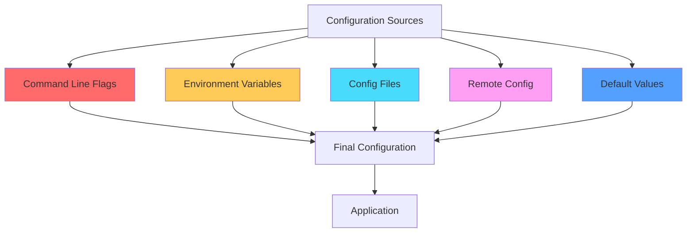
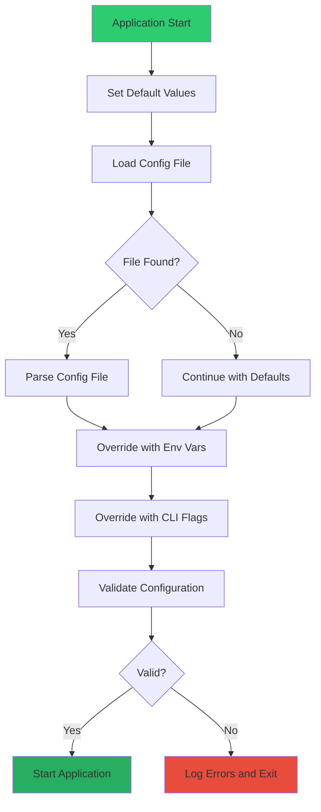

# How to Handle Configuration in Go Applications

Author: [nawazdhandala](https://github.com/nawazdhandala)

Tags: Go, Configuration, DevOps, Viper, Environment Variables, YAML, TOML, Best Practices

Description: Learn how to manage configuration in Go applications using Viper, envconfig, and other libraries. Covers environment variables, config files (YAML, JSON, TOML), validation, default values, and production best practices.

---

> "Configuration is the skeleton of your application; get it wrong, and everything falls apart." - Anonymous

Managing configuration effectively is crucial for building robust, maintainable Go applications. Whether you're deploying to development, staging, or production environments, your application needs to adapt its behavior based on external configuration. This guide covers the most popular approaches and libraries for handling configuration in Go.

## Configuration Sources Overview

Go applications typically pull configuration from multiple sources with a well-defined precedence:



The typical precedence order (highest to lowest):
1. Command line flags
2. Environment variables
3. Config files
4. Remote configuration (Consul, etcd)
5. Default values

## Using Viper for Configuration Management

Viper is the most popular configuration library in Go. It supports multiple config formats, environment variables, command-line flags, and remote config stores.

### Installation

```bash
go get github.com/spf13/viper
```

### Basic Viper Setup

```go
package config

import (
    "fmt"
    "log"
    "strings"

    "github.com/spf13/viper"
)

// Config holds all application configuration
type Config struct {
    Server   ServerConfig
    Database DatabaseConfig
    Redis    RedisConfig
    Logging  LoggingConfig
}

// ServerConfig contains HTTP server settings
type ServerConfig struct {
    Host         string
    Port         int
    ReadTimeout  int
    WriteTimeout int
}

// DatabaseConfig contains database connection settings
type DatabaseConfig struct {
    Host     string
    Port     int
    User     string
    Password string
    DBName   string
    SSLMode  string
}

// RedisConfig contains Redis connection settings
type RedisConfig struct {
    Host     string
    Port     int
    Password string
    DB       int
}

// LoggingConfig contains logging settings
type LoggingConfig struct {
    Level  string
    Format string
}

// LoadConfig reads configuration from file and environment variables
func LoadConfig(configPath string) (*Config, error) {
    // Set the config file name and path
    viper.SetConfigName("config")
    viper.SetConfigType("yaml")
    viper.AddConfigPath(configPath)
    viper.AddConfigPath(".")
    viper.AddConfigPath("./config")

    // Enable reading from environment variables
    viper.AutomaticEnv()

    // Replace dots with underscores for env var names
    // e.g., server.port becomes SERVER_PORT
    viper.SetEnvKeyReplacer(strings.NewReplacer(".", "_"))

    // Set default values
    setDefaults()

    // Read the config file
    if err := viper.ReadInConfig(); err != nil {
        // Config file not found is acceptable if env vars are set
        if _, ok := err.(viper.ConfigFileNotFoundError); !ok {
            return nil, fmt.Errorf("error reading config file: %w", err)
        }
        log.Println("No config file found, using defaults and environment variables")
    }

    // Unmarshal into the Config struct
    var config Config
    if err := viper.Unmarshal(&config); err != nil {
        return nil, fmt.Errorf("unable to decode config: %w", err)
    }

    return &config, nil
}

// setDefaults sets default values for all configuration options
func setDefaults() {
    // Server defaults
    viper.SetDefault("server.host", "0.0.0.0")
    viper.SetDefault("server.port", 8080)
    viper.SetDefault("server.readtimeout", 30)
    viper.SetDefault("server.writetimeout", 30)

    // Database defaults
    viper.SetDefault("database.host", "localhost")
    viper.SetDefault("database.port", 5432)
    viper.SetDefault("database.sslmode", "disable")

    // Redis defaults
    viper.SetDefault("redis.host", "localhost")
    viper.SetDefault("redis.port", 6379)
    viper.SetDefault("redis.db", 0)

    // Logging defaults
    viper.SetDefault("logging.level", "info")
    viper.SetDefault("logging.format", "json")
}
```

### YAML Configuration File

```yaml
# config.yaml
server:
  host: "0.0.0.0"
  port: 8080
  readtimeout: 30
  writetimeout: 30

database:
  host: "localhost"
  port: 5432
  user: "appuser"
  password: "${DB_PASSWORD}"  # Can be overridden by env var
  dbname: "myapp"
  sslmode: "require"

redis:
  host: "localhost"
  port: 6379
  password: ""
  db: 0

logging:
  level: "info"
  format: "json"
```

### JSON Configuration File

```json
{
  "server": {
    "host": "0.0.0.0",
    "port": 8080,
    "readtimeout": 30,
    "writetimeout": 30
  },
  "database": {
    "host": "localhost",
    "port": 5432,
    "user": "appuser",
    "password": "",
    "dbname": "myapp",
    "sslmode": "require"
  },
  "redis": {
    "host": "localhost",
    "port": 6379,
    "password": "",
    "db": 0
  },
  "logging": {
    "level": "info",
    "format": "json"
  }
}
```

### TOML Configuration File

```toml
# config.toml
[server]
host = "0.0.0.0"
port = 8080
readtimeout = 30
writetimeout = 30

[database]
host = "localhost"
port = 5432
user = "appuser"
password = ""
dbname = "myapp"
sslmode = "require"

[redis]
host = "localhost"
port = 6379
password = ""
db = 0

[logging]
level = "info"
format = "json"
```

## Using envconfig for Environment Variables

For simpler applications that primarily use environment variables, the `envconfig` library provides a clean, struct-tag-based approach.

### Installation

```bash
go get github.com/kelseyhightower/envconfig
```

### Basic envconfig Usage

```go
package config

import (
    "fmt"
    "time"

    "github.com/kelseyhightower/envconfig"
)

// Config holds all configuration loaded from environment variables
// Struct tags define the env var names and defaults
type Config struct {
    // Server configuration
    ServerHost         string        `envconfig:"SERVER_HOST" default:"0.0.0.0"`
    ServerPort         int           `envconfig:"SERVER_PORT" default:"8080"`
    ServerReadTimeout  time.Duration `envconfig:"SERVER_READ_TIMEOUT" default:"30s"`
    ServerWriteTimeout time.Duration `envconfig:"SERVER_WRITE_TIMEOUT" default:"30s"`

    // Database configuration - required fields have no default
    DatabaseURL      string `envconfig:"DATABASE_URL" required:"true"`
    DatabaseMaxConns int    `envconfig:"DATABASE_MAX_CONNS" default:"25"`
    DatabaseMinConns int    `envconfig:"DATABASE_MIN_CONNS" default:"5"`

    // Redis configuration
    RedisURL string `envconfig:"REDIS_URL" default:"redis://localhost:6379/0"`

    // Application settings
    Environment string `envconfig:"APP_ENV" default:"development"`
    Debug       bool   `envconfig:"DEBUG" default:"false"`
    LogLevel    string `envconfig:"LOG_LEVEL" default:"info"`

    // Feature flags
    EnableMetrics bool `envconfig:"ENABLE_METRICS" default:"true"`
    EnableTracing bool `envconfig:"ENABLE_TRACING" default:"true"`

    // API keys and secrets - required in production
    JWTSecret   string `envconfig:"JWT_SECRET" required:"true"`
    APIKey      string `envconfig:"API_KEY"`
}

// LoadFromEnv loads configuration from environment variables
func LoadFromEnv() (*Config, error) {
    var cfg Config

    // Process reads env vars and populates the struct
    // The prefix "APP" means all env vars should be prefixed with APP_
    // e.g., APP_SERVER_HOST, APP_DATABASE_URL
    if err := envconfig.Process("APP", &cfg); err != nil {
        return nil, fmt.Errorf("failed to load config from env: %w", err)
    }

    return &cfg, nil
}

// LoadWithoutPrefix loads config without any prefix requirement
func LoadWithoutPrefix() (*Config, error) {
    var cfg Config

    // Empty string means no prefix required
    if err := envconfig.Process("", &cfg); err != nil {
        return nil, fmt.Errorf("failed to load config from env: %w", err)
    }

    return &cfg, nil
}

// Usage prints environment variable usage information
func Usage() {
    var cfg Config
    envconfig.Usage("APP", &cfg)
}
```

### envconfig with Nested Structs

```go
package config

import (
    "time"

    "github.com/kelseyhightower/envconfig"
)

// ServerConfig groups server-related settings
type ServerConfig struct {
    Host         string        `envconfig:"HOST" default:"0.0.0.0"`
    Port         int           `envconfig:"PORT" default:"8080"`
    ReadTimeout  time.Duration `envconfig:"READ_TIMEOUT" default:"30s"`
    WriteTimeout time.Duration `envconfig:"WRITE_TIMEOUT" default:"30s"`
}

// DatabaseConfig groups database-related settings
type DatabaseConfig struct {
    URL      string `envconfig:"URL" required:"true"`
    MaxConns int    `envconfig:"MAX_CONNS" default:"25"`
    MinConns int    `envconfig:"MIN_CONNS" default:"5"`
}

// Config is the root configuration struct
type Config struct {
    Server   ServerConfig   `envconfig:"SERVER"`
    Database DatabaseConfig `envconfig:"DATABASE"`
    Debug    bool           `envconfig:"DEBUG" default:"false"`
}

// LoadConfig loads the full configuration
// Environment variables will be:
// SERVER_HOST, SERVER_PORT, DATABASE_URL, DATABASE_MAX_CONNS, etc.
func LoadConfig() (*Config, error) {
    var cfg Config
    if err := envconfig.Process("", &cfg); err != nil {
        return nil, err
    }
    return &cfg, nil
}
```

## Configuration Validation

Always validate your configuration at startup to fail fast with clear error messages.

```go
package config

import (
    "errors"
    "fmt"
    "net/url"
    "strings"
)

// ValidationError represents a configuration validation error
type ValidationError struct {
    Field   string
    Message string
}

func (e ValidationError) Error() string {
    return fmt.Sprintf("config validation error: %s - %s", e.Field, e.Message)
}

// ValidationErrors holds multiple validation errors
type ValidationErrors []ValidationError

func (e ValidationErrors) Error() string {
    var msgs []string
    for _, err := range e {
        msgs = append(msgs, err.Error())
    }
    return strings.Join(msgs, "; ")
}

// Validate checks if the configuration is valid
func (c *Config) Validate() error {
    var errs ValidationErrors

    // Validate server configuration
    if c.Server.Port < 1 || c.Server.Port > 65535 {
        errs = append(errs, ValidationError{
            Field:   "server.port",
            Message: "must be between 1 and 65535",
        })
    }

    if c.Server.ReadTimeout <= 0 {
        errs = append(errs, ValidationError{
            Field:   "server.readtimeout",
            Message: "must be greater than 0",
        })
    }

    // Validate database configuration
    if c.Database.Host == "" {
        errs = append(errs, ValidationError{
            Field:   "database.host",
            Message: "is required",
        })
    }

    if c.Database.User == "" {
        errs = append(errs, ValidationError{
            Field:   "database.user",
            Message: "is required",
        })
    }

    validSSLModes := map[string]bool{
        "disable": true, "allow": true, "prefer": true,
        "require": true, "verify-ca": true, "verify-full": true,
    }
    if !validSSLModes[c.Database.SSLMode] {
        errs = append(errs, ValidationError{
            Field:   "database.sslmode",
            Message: "must be one of: disable, allow, prefer, require, verify-ca, verify-full",
        })
    }

    // Validate logging configuration
    validLogLevels := map[string]bool{
        "debug": true, "info": true, "warn": true, "error": true,
    }
    if !validLogLevels[strings.ToLower(c.Logging.Level)] {
        errs = append(errs, ValidationError{
            Field:   "logging.level",
            Message: "must be one of: debug, info, warn, error",
        })
    }

    if len(errs) > 0 {
        return errs
    }

    return nil
}

// ValidateURL checks if a string is a valid URL
func ValidateURL(rawURL string) error {
    if rawURL == "" {
        return errors.New("URL is empty")
    }

    parsed, err := url.Parse(rawURL)
    if err != nil {
        return fmt.Errorf("invalid URL: %w", err)
    }

    if parsed.Scheme == "" {
        return errors.New("URL must have a scheme (http, https, etc.)")
    }

    if parsed.Host == "" {
        return errors.New("URL must have a host")
    }

    return nil
}
```

### Using go-playground/validator for Struct Validation

```go
package config

import (
    "fmt"

    "github.com/go-playground/validator/v10"
)

// Config with validation tags
type Config struct {
    Server   ServerConfig   `validate:"required"`
    Database DatabaseConfig `validate:"required"`
    Redis    RedisConfig    `validate:"required"`
    Logging  LoggingConfig  `validate:"required"`
}

type ServerConfig struct {
    Host         string `validate:"required,hostname|ip"`
    Port         int    `validate:"required,min=1,max=65535"`
    ReadTimeout  int    `validate:"required,min=1,max=300"`
    WriteTimeout int    `validate:"required,min=1,max=300"`
}

type DatabaseConfig struct {
    Host     string `validate:"required,hostname|ip"`
    Port     int    `validate:"required,min=1,max=65535"`
    User     string `validate:"required,min=1"`
    Password string `validate:"required,min=8"`
    DBName   string `validate:"required,min=1,max=63"`
    SSLMode  string `validate:"required,oneof=disable allow prefer require verify-ca verify-full"`
}

type RedisConfig struct {
    Host     string `validate:"required,hostname|ip"`
    Port     int    `validate:"required,min=1,max=65535"`
    Password string `validate:"omitempty,min=1"`
    DB       int    `validate:"min=0,max=15"`
}

type LoggingConfig struct {
    Level  string `validate:"required,oneof=debug info warn error"`
    Format string `validate:"required,oneof=json text"`
}

// Validate uses go-playground/validator to check the config
func (c *Config) Validate() error {
    validate := validator.New()

    if err := validate.Struct(c); err != nil {
        // Format validation errors nicely
        if validationErrors, ok := err.(validator.ValidationErrors); ok {
            for _, e := range validationErrors {
                return fmt.Errorf("config validation failed: field '%s' %s",
                    e.Namespace(), e.Tag())
            }
        }
        return err
    }

    return nil
}
```

## Configuration Loading Flow

Here's a complete example showing how to load configuration with proper precedence and validation:



```go
package main

import (
    "flag"
    "log"
    "os"

    "github.com/spf13/viper"
)

func main() {
    // Step 1: Parse command-line flags
    configPath := flag.String("config", "", "Path to config file")
    port := flag.Int("port", 0, "Server port (overrides config)")
    flag.Parse()

    // Step 2: Initialize Viper with defaults
    viper.SetDefault("server.port", 8080)
    viper.SetDefault("server.host", "0.0.0.0")
    viper.SetDefault("logging.level", "info")

    // Step 3: Load config file if specified
    if *configPath != "" {
        viper.SetConfigFile(*configPath)
    } else {
        viper.SetConfigName("config")
        viper.SetConfigType("yaml")
        viper.AddConfigPath(".")
        viper.AddConfigPath("./config")
        viper.AddConfigPath("/etc/myapp")
    }

    if err := viper.ReadInConfig(); err != nil {
        if _, ok := err.(viper.ConfigFileNotFoundError); !ok {
            log.Fatalf("Error reading config file: %v", err)
        }
        log.Println("No config file found, using defaults and env vars")
    } else {
        log.Printf("Using config file: %s", viper.ConfigFileUsed())
    }

    // Step 4: Enable environment variable overrides
    viper.AutomaticEnv()
    viper.SetEnvPrefix("MYAPP")

    // Step 5: Apply command-line flag overrides
    if *port != 0 {
        viper.Set("server.port", *port)
    }

    // Step 6: Unmarshal and validate
    var config Config
    if err := viper.Unmarshal(&config); err != nil {
        log.Fatalf("Failed to unmarshal config: %v", err)
    }

    if err := config.Validate(); err != nil {
        log.Fatalf("Configuration validation failed: %v", err)
        os.Exit(1)
    }

    // Step 7: Start application with validated config
    log.Printf("Starting server on %s:%d", config.Server.Host, config.Server.Port)
    // ... start your application
}
```

## Environment-Specific Configuration

Support multiple environments with separate config files:

```go
package config

import (
    "fmt"
    "os"
    "path/filepath"

    "github.com/spf13/viper"
)

// Environment represents the application environment
type Environment string

const (
    Development Environment = "development"
    Staging     Environment = "staging"
    Production  Environment = "production"
    Testing     Environment = "testing"
)

// LoadEnvironmentConfig loads config based on APP_ENV
func LoadEnvironmentConfig() (*Config, error) {
    // Determine current environment
    env := os.Getenv("APP_ENV")
    if env == "" {
        env = string(Development)
    }

    // Load base configuration first
    viper.SetConfigName("config")
    viper.SetConfigType("yaml")
    viper.AddConfigPath("./config")

    if err := viper.ReadInConfig(); err != nil {
        return nil, fmt.Errorf("failed to read base config: %w", err)
    }

    // Load environment-specific overrides
    // e.g., config.production.yaml, config.staging.yaml
    envConfigFile := fmt.Sprintf("config.%s", env)
    viper.SetConfigName(envConfigFile)

    // MergeInConfig merges the environment config with the base config
    if err := viper.MergeInConfig(); err != nil {
        // Environment-specific config is optional
        if _, ok := err.(viper.ConfigFileNotFoundError); !ok {
            return nil, fmt.Errorf("failed to read %s config: %w", env, err)
        }
    }

    // Environment variables always take precedence
    viper.AutomaticEnv()

    var config Config
    if err := viper.Unmarshal(&config); err != nil {
        return nil, fmt.Errorf("failed to unmarshal config: %w", err)
    }

    return &config, nil
}
```

### Directory Structure

```
myapp/
  config/
    config.yaml              # Base configuration (defaults)
    config.development.yaml  # Development overrides
    config.staging.yaml      # Staging overrides
    config.production.yaml   # Production overrides
```

## Secrets Management

Never store secrets in config files committed to version control. Use environment variables or secret managers.

```go
package config

import (
    "context"
    "encoding/json"
    "fmt"
    "os"

    "github.com/aws/aws-sdk-go-v2/aws"
    "github.com/aws/aws-sdk-go-v2/config"
    "github.com/aws/aws-sdk-go-v2/service/secretsmanager"
)

// Secrets holds sensitive configuration
type Secrets struct {
    DatabasePassword string `json:"database_password"`
    JWTSecret        string `json:"jwt_secret"`
    APIKey           string `json:"api_key"`
    RedisPassword    string `json:"redis_password"`
}

// LoadSecretsFromAWS loads secrets from AWS Secrets Manager
func LoadSecretsFromAWS(ctx context.Context, secretName string) (*Secrets, error) {
    // Load AWS configuration
    cfg, err := config.LoadDefaultConfig(ctx)
    if err != nil {
        return nil, fmt.Errorf("failed to load AWS config: %w", err)
    }

    // Create Secrets Manager client
    client := secretsmanager.NewFromConfig(cfg)

    // Retrieve the secret
    result, err := client.GetSecretValue(ctx, &secretsmanager.GetSecretValueInput{
        SecretId: aws.String(secretName),
    })
    if err != nil {
        return nil, fmt.Errorf("failed to get secret: %w", err)
    }

    // Parse the secret JSON
    var secrets Secrets
    if err := json.Unmarshal([]byte(*result.SecretString), &secrets); err != nil {
        return nil, fmt.Errorf("failed to parse secret: %w", err)
    }

    return &secrets, nil
}

// LoadSecretsFromEnv loads secrets from environment variables
// This is useful for local development or when using Kubernetes secrets
func LoadSecretsFromEnv() *Secrets {
    return &Secrets{
        DatabasePassword: os.Getenv("DATABASE_PASSWORD"),
        JWTSecret:        os.Getenv("JWT_SECRET"),
        APIKey:           os.Getenv("API_KEY"),
        RedisPassword:    os.Getenv("REDIS_PASSWORD"),
    }
}

// MergeSecretsIntoConfig merges loaded secrets into the main config
func MergeSecretsIntoConfig(config *Config, secrets *Secrets) {
    if secrets.DatabasePassword != "" {
        config.Database.Password = secrets.DatabasePassword
    }
    if secrets.RedisPassword != "" {
        config.Redis.Password = secrets.RedisPassword
    }
}
```

## Hot Reloading Configuration

Viper supports watching config files for changes:

```go
package config

import (
    "log"
    "sync"

    "github.com/fsnotify/fsnotify"
    "github.com/spf13/viper"
)

// ConfigManager handles configuration with hot reloading
type ConfigManager struct {
    config *Config
    mu     sync.RWMutex

    // Callbacks to notify when config changes
    onChangeCallbacks []func(*Config)
}

// NewConfigManager creates a new config manager with hot reloading
func NewConfigManager() (*ConfigManager, error) {
    cm := &ConfigManager{}

    // Initial config load
    if err := cm.loadConfig(); err != nil {
        return nil, err
    }

    // Watch for changes
    viper.WatchConfig()
    viper.OnConfigChange(func(e fsnotify.Event) {
        log.Printf("Config file changed: %s", e.Name)

        if err := cm.loadConfig(); err != nil {
            log.Printf("Failed to reload config: %v", err)
            return
        }

        // Notify all registered callbacks
        cm.mu.RLock()
        config := cm.config
        callbacks := cm.onChangeCallbacks
        cm.mu.RUnlock()

        for _, cb := range callbacks {
            cb(config)
        }
    })

    return cm, nil
}

// loadConfig loads and validates the configuration
func (cm *ConfigManager) loadConfig() error {
    var config Config
    if err := viper.Unmarshal(&config); err != nil {
        return err
    }

    if err := config.Validate(); err != nil {
        return err
    }

    cm.mu.Lock()
    cm.config = &config
    cm.mu.Unlock()

    return nil
}

// Get returns the current configuration
func (cm *ConfigManager) Get() *Config {
    cm.mu.RLock()
    defer cm.mu.RUnlock()
    return cm.config
}

// OnChange registers a callback for config changes
func (cm *ConfigManager) OnChange(callback func(*Config)) {
    cm.mu.Lock()
    cm.onChangeCallbacks = append(cm.onChangeCallbacks, callback)
    cm.mu.Unlock()
}
```

## Complete Application Example

Here's a complete example tying everything together:

```go
package main

import (
    "context"
    "flag"
    "fmt"
    "log"
    "net/http"
    "os"
    "os/signal"
    "strings"
    "syscall"
    "time"

    "github.com/spf13/viper"
)

// Config represents the complete application configuration
type Config struct {
    App      AppConfig      `mapstructure:"app"`
    Server   ServerConfig   `mapstructure:"server"`
    Database DatabaseConfig `mapstructure:"database"`
    Logging  LoggingConfig  `mapstructure:"logging"`
}

type AppConfig struct {
    Name        string `mapstructure:"name"`
    Environment string `mapstructure:"environment"`
    Debug       bool   `mapstructure:"debug"`
}

type ServerConfig struct {
    Host            string        `mapstructure:"host"`
    Port            int           `mapstructure:"port"`
    ReadTimeout     time.Duration `mapstructure:"read_timeout"`
    WriteTimeout    time.Duration `mapstructure:"write_timeout"`
    ShutdownTimeout time.Duration `mapstructure:"shutdown_timeout"`
}

type DatabaseConfig struct {
    Host         string `mapstructure:"host"`
    Port         int    `mapstructure:"port"`
    User         string `mapstructure:"user"`
    Password     string `mapstructure:"password"`
    DBName       string `mapstructure:"dbname"`
    SSLMode      string `mapstructure:"sslmode"`
    MaxOpenConns int    `mapstructure:"max_open_conns"`
    MaxIdleConns int    `mapstructure:"max_idle_conns"`
}

type LoggingConfig struct {
    Level  string `mapstructure:"level"`
    Format string `mapstructure:"format"`
}

func main() {
    // Parse command-line flags
    configFile := flag.String("config", "", "path to config file")
    flag.Parse()

    // Load configuration
    config, err := loadConfig(*configFile)
    if err != nil {
        log.Fatalf("Failed to load configuration: %v", err)
    }

    // Validate configuration
    if err := validateConfig(config); err != nil {
        log.Fatalf("Configuration validation failed: %v", err)
    }

    // Log the loaded configuration (redact sensitive fields)
    log.Printf("Configuration loaded: app=%s, env=%s, server=%s:%d",
        config.App.Name,
        config.App.Environment,
        config.Server.Host,
        config.Server.Port,
    )

    // Create HTTP server
    server := &http.Server{
        Addr:         fmt.Sprintf("%s:%d", config.Server.Host, config.Server.Port),
        ReadTimeout:  config.Server.ReadTimeout,
        WriteTimeout: config.Server.WriteTimeout,
        Handler:      http.HandlerFunc(healthHandler),
    }

    // Start server in a goroutine
    go func() {
        log.Printf("Starting server on %s", server.Addr)
        if err := server.ListenAndServe(); err != http.ErrServerClosed {
            log.Fatalf("Server error: %v", err)
        }
    }()

    // Wait for shutdown signal
    quit := make(chan os.Signal, 1)
    signal.Notify(quit, syscall.SIGINT, syscall.SIGTERM)
    <-quit

    log.Println("Shutting down server...")

    // Graceful shutdown
    ctx, cancel := context.WithTimeout(context.Background(), config.Server.ShutdownTimeout)
    defer cancel()

    if err := server.Shutdown(ctx); err != nil {
        log.Fatalf("Server shutdown error: %v", err)
    }

    log.Println("Server stopped")
}

func loadConfig(configFile string) (*Config, error) {
    // Set defaults
    viper.SetDefault("app.name", "myapp")
    viper.SetDefault("app.environment", "development")
    viper.SetDefault("app.debug", false)
    viper.SetDefault("server.host", "0.0.0.0")
    viper.SetDefault("server.port", 8080)
    viper.SetDefault("server.read_timeout", "30s")
    viper.SetDefault("server.write_timeout", "30s")
    viper.SetDefault("server.shutdown_timeout", "10s")
    viper.SetDefault("database.host", "localhost")
    viper.SetDefault("database.port", 5432)
    viper.SetDefault("database.sslmode", "disable")
    viper.SetDefault("database.max_open_conns", 25)
    viper.SetDefault("database.max_idle_conns", 5)
    viper.SetDefault("logging.level", "info")
    viper.SetDefault("logging.format", "json")

    // Load config file
    if configFile != "" {
        viper.SetConfigFile(configFile)
    } else {
        viper.SetConfigName("config")
        viper.SetConfigType("yaml")
        viper.AddConfigPath(".")
        viper.AddConfigPath("./config")
        viper.AddConfigPath("/etc/myapp")
    }

    if err := viper.ReadInConfig(); err != nil {
        if _, ok := err.(viper.ConfigFileNotFoundError); !ok {
            return nil, fmt.Errorf("error reading config: %w", err)
        }
        log.Println("No config file found, using defaults and environment variables")
    }

    // Environment variable overrides
    viper.AutomaticEnv()
    viper.SetEnvPrefix("MYAPP")
    viper.SetEnvKeyReplacer(strings.NewReplacer(".", "_"))

    // Unmarshal
    var config Config
    if err := viper.Unmarshal(&config); err != nil {
        return nil, fmt.Errorf("error unmarshaling config: %w", err)
    }

    return &config, nil
}

func validateConfig(config *Config) error {
    if config.App.Name == "" {
        return fmt.Errorf("app.name is required")
    }
    if config.Server.Port < 1 || config.Server.Port > 65535 {
        return fmt.Errorf("server.port must be between 1 and 65535")
    }
    if config.Database.User == "" && config.App.Environment == "production" {
        return fmt.Errorf("database.user is required in production")
    }
    return nil
}

func healthHandler(w http.ResponseWriter, r *http.Request) {
    w.Header().Set("Content-Type", "application/json")
    w.WriteHeader(http.StatusOK)
    w.Write([]byte(`{"status":"healthy"}`))
}
```

## Monitoring Your Configuration

Proper configuration monitoring helps catch issues before they impact users. Use [OneUptime](https://oneuptime.com) to monitor your Go applications and get alerted when configuration-related issues occur, such as:

- Application failing to start due to missing configuration
- Configuration validation errors
- Secrets rotation failures
- Environment-specific configuration mismatches

Set up health checks that verify your configuration is valid, and use structured logging to track configuration changes across deployments.

## Summary

| Approach | Best For | Pros | Cons |
|----------|----------|------|------|
| **Viper** | Complex applications | Multiple sources, hot reload, full-featured | Learning curve |
| **envconfig** | 12-factor apps | Simple, struct tags, clear documentation | Env vars only |
| **Standard library** | Simple apps | No dependencies | Manual parsing |

Key best practices:
- Always validate configuration at startup
- Use strong typing with struct tags
- Keep secrets out of config files
- Support multiple environments
- Provide sensible defaults
- Document all configuration options
- Monitor configuration-related failures

Proper configuration management is foundational to building reliable, maintainable Go applications. Invest time in getting it right early, and it will pay dividends throughout your application's lifecycle.
