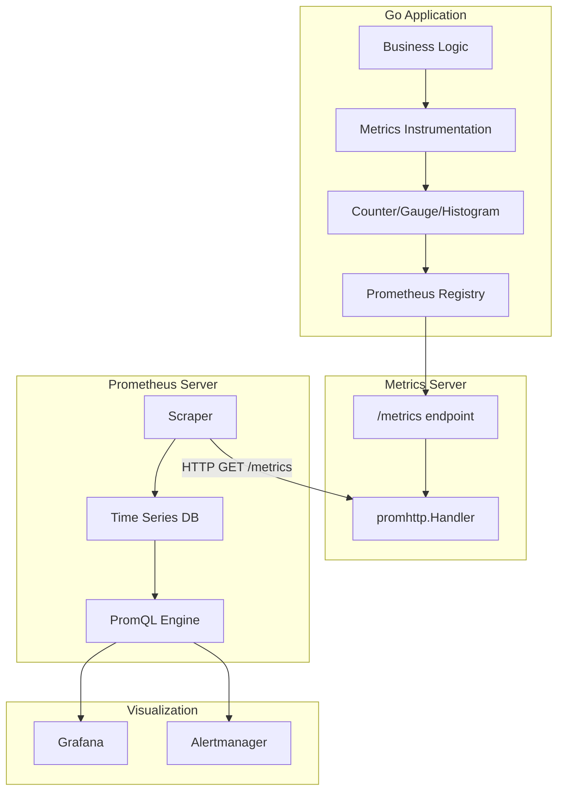
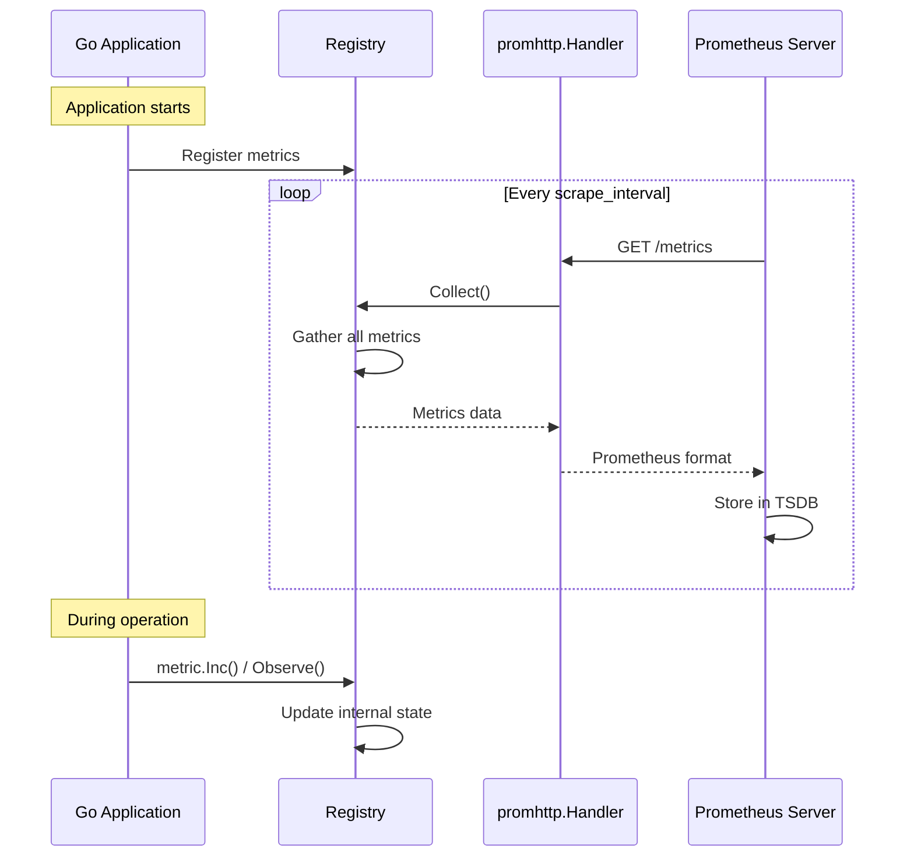
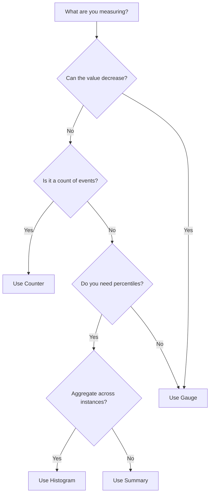

# How to Build a Metrics Exporter in Go

Author: [nawazdhandala](https://www.github.com/nawazdhandala)

Tags: Go, Prometheus, Metrics, Observability, Monitoring, OpenTelemetry, SRE

Description: A comprehensive guide to building a Prometheus metrics exporter in Go using the prometheus/client_golang library, covering custom metrics types, HTTP exposure, and production best practices.

---

> "If you can't measure it, you can't improve it." - Metrics are the foundation of observability. Building custom exporters lets you expose the exact signals your systems need to stay healthy and performant.

Prometheus has become the de facto standard for metrics collection in cloud-native environments. While many libraries provide auto-instrumentation, understanding how to build custom metrics exporters gives you fine-grained control over what you measure and how you expose it.

This guide walks through building a production-ready metrics exporter in Go using the official `prometheus/client_golang` library. You will learn how to create counters, gauges, histograms, and summaries, expose them via HTTP, and follow best practices for naming and labeling.

---

## Table of Contents

1. Understanding Prometheus Metrics
2. Setting Up Your Go Project
3. Creating a Basic Metrics Exporter
4. Custom Metrics Types
5. Exposing Metrics via HTTP
6. Registering and Collecting Metrics
7. Advanced Patterns
8. Architecture Overview
9. Best Practices
10. Complete Example

---

## Understanding Prometheus Metrics

Prometheus defines four core metric types:

| Metric Type | Use Case | Example |
|------------|----------|---------|
| Counter | Monotonically increasing values | Total HTTP requests, errors count |
| Gauge | Values that can go up or down | Current memory usage, active connections |
| Histogram | Distribution of values in buckets | Request latency percentiles |
| Summary | Similar to histogram, but calculates quantiles client-side | Response time quantiles |

Each metric can have labels (key-value pairs) that allow dimensional aggregation in queries.

---

## Setting Up Your Go Project

Initialize a new Go module and install the Prometheus client library:

```bash
# Create project directory
mkdir go-metrics-exporter
cd go-metrics-exporter

# Initialize Go module
go mod init github.com/yourorg/metrics-exporter

# Install Prometheus client library
go get github.com/prometheus/client_golang/prometheus
go get github.com/prometheus/client_golang/prometheus/promhttp
go get github.com/prometheus/client_golang/prometheus/promauto
```

Your `go.mod` should look like:

```go
module github.com/yourorg/metrics-exporter

go 1.21

require github.com/prometheus/client_golang v1.19.0
```

---

## Creating a Basic Metrics Exporter

Let us start with a minimal exporter that exposes basic application metrics:

```go
// main.go
package main

import (
    "log"
    "net/http"

    // prometheus provides the core metric types and registry
    "github.com/prometheus/client_golang/prometheus"
    // promhttp provides HTTP handlers for exposing metrics
    "github.com/prometheus/client_golang/prometheus/promhttp"
)

// Define metrics at package level for easy access across your application.
// Using prometheus.NewCounterVec allows adding labels for dimensional data.
var (
    // httpRequestsTotal tracks the total number of HTTP requests.
    // Labels: method (GET, POST, etc.), endpoint (the URL path), status (HTTP status code)
    httpRequestsTotal = prometheus.NewCounterVec(
        prometheus.CounterOpts{
            // Namespace groups related metrics (usually your app/service name)
            Namespace: "myapp",
            // Subsystem further categorizes within the namespace
            Subsystem: "http",
            // Name should describe what is being measured
            Name:      "requests_total",
            // Help text appears in the /metrics output and documentation
            Help:      "Total number of HTTP requests processed",
        },
        // Label names - these become dimensions you can filter/group by
        []string{"method", "endpoint", "status"},
    )
)

func init() {
    // Register metrics with the default Prometheus registry.
    // This must happen before the metrics are used.
    prometheus.MustRegister(httpRequestsTotal)
}

func main() {
    // Create a simple HTTP server with instrumented handlers
    http.HandleFunc("/api/users", instrumentHandler("GET", "/api/users", handleUsers))
    http.HandleFunc("/api/orders", instrumentHandler("GET", "/api/orders", handleOrders))

    // Expose metrics at /metrics endpoint using promhttp handler
    http.Handle("/metrics", promhttp.Handler())

    log.Println("Starting server on :8080")
    log.Println("Metrics available at http://localhost:8080/metrics")
    log.Fatal(http.ListenAndServe(":8080", nil))
}

// instrumentHandler wraps an HTTP handler to record metrics
func instrumentHandler(method, endpoint string, handler http.HandlerFunc) http.HandlerFunc {
    return func(w http.ResponseWriter, r *http.Request) {
        // Call the actual handler
        handler(w, r)

        // Increment the counter with appropriate labels
        // .Inc() adds 1 to the counter value
        httpRequestsTotal.WithLabelValues(method, endpoint, "200").Inc()
    }
}

func handleUsers(w http.ResponseWriter, r *http.Request) {
    w.Write([]byte(`{"users": []}`))
}

func handleOrders(w http.ResponseWriter, r *http.Request) {
    w.Write([]byte(`{"orders": []}`))
}
```

---

## Custom Metrics Types

### Counter

Counters are for values that only increase. They reset to zero when the process restarts:

```go
// metrics/counters.go
package metrics

import "github.com/prometheus/client_golang/prometheus"

// ErrorsTotal counts application errors by type and severity.
// Counters are ideal for tracking events that accumulate over time.
var ErrorsTotal = prometheus.NewCounterVec(
    prometheus.CounterOpts{
        Namespace: "myapp",
        Name:      "errors_total",
        Help:      "Total number of errors by type and severity",
    },
    []string{"type", "severity"},
)

// Example usage:
// metrics.ErrorsTotal.WithLabelValues("database", "critical").Inc()
// metrics.ErrorsTotal.WithLabelValues("validation", "warning").Add(5)
```

### Gauge

Gauges represent values that can increase or decrease:

```go
// metrics/gauges.go
package metrics

import "github.com/prometheus/client_golang/prometheus"

// ActiveConnections tracks current number of active connections.
// Gauges are perfect for "current state" metrics.
var ActiveConnections = prometheus.NewGaugeVec(
    prometheus.GaugeOpts{
        Namespace: "myapp",
        Name:      "active_connections",
        Help:      "Current number of active connections by pool",
    },
    []string{"pool"},
)

// QueueDepth tracks the current depth of work queues.
var QueueDepth = prometheus.NewGaugeVec(
    prometheus.GaugeOpts{
        Namespace: "myapp",
        Name:      "queue_depth",
        Help:      "Current number of items in the queue",
    },
    []string{"queue_name"},
)

// Example usage:
// metrics.ActiveConnections.WithLabelValues("postgres").Inc()    // +1
// metrics.ActiveConnections.WithLabelValues("postgres").Dec()    // -1
// metrics.ActiveConnections.WithLabelValues("redis").Set(42)     // Set exact value
// metrics.QueueDepth.WithLabelValues("orders").Add(10)           // +10
// metrics.QueueDepth.WithLabelValues("orders").Sub(3)            // -3
```

### Histogram

Histograms measure the distribution of values and are ideal for latencies:

```go
// metrics/histograms.go
package metrics

import "github.com/prometheus/client_golang/prometheus"

// RequestDuration measures HTTP request latency distribution.
// Histograms bucket observations into configurable ranges,
// enabling percentile calculations in PromQL.
var RequestDuration = prometheus.NewHistogramVec(
    prometheus.HistogramOpts{
        Namespace: "myapp",
        Subsystem: "http",
        Name:      "request_duration_seconds",
        Help:      "HTTP request latency distribution in seconds",
        // Buckets define the histogram boundaries.
        // Choose buckets based on your expected latency ranges.
        // These buckets: 5ms, 10ms, 25ms, 50ms, 100ms, 250ms, 500ms, 1s, 2.5s, 5s, 10s
        Buckets: []float64{0.005, 0.01, 0.025, 0.05, 0.1, 0.25, 0.5, 1, 2.5, 5, 10},
    },
    []string{"method", "endpoint"},
)

// DatabaseQueryDuration measures database query latency.
var DatabaseQueryDuration = prometheus.NewHistogramVec(
    prometheus.HistogramOpts{
        Namespace: "myapp",
        Subsystem: "database",
        Name:      "query_duration_seconds",
        Help:      "Database query latency distribution in seconds",
        // Tighter buckets for faster expected operations
        Buckets: prometheus.ExponentialBuckets(0.001, 2, 10), // 1ms to ~1s
    },
    []string{"query_type", "table"},
)

// Example usage:
// start := time.Now()
// // ... perform operation ...
// duration := time.Since(start).Seconds()
// metrics.RequestDuration.WithLabelValues("GET", "/api/users").Observe(duration)
```

### Summary

Summaries calculate streaming quantiles on the client side:

```go
// metrics/summaries.go
package metrics

import "github.com/prometheus/client_golang/prometheus"

// ResponseSize tracks the size of HTTP responses.
// Summaries compute quantiles over a sliding time window.
// Use when you need precise quantiles but do not need to aggregate across instances.
var ResponseSize = prometheus.NewSummaryVec(
    prometheus.SummaryOpts{
        Namespace: "myapp",
        Subsystem: "http",
        Name:      "response_size_bytes",
        Help:      "HTTP response size in bytes",
        // Objectives define which quantiles to calculate and their error tolerance.
        // {0.5: 0.05} means "the 50th percentile with 5% error tolerance"
        Objectives: map[float64]float64{
            0.5:  0.05,  // 50th percentile (median)
            0.9:  0.01,  // 90th percentile
            0.99: 0.001, // 99th percentile
        },
        // MaxAge defines the duration for which observations are kept
        MaxAge: prometheus.DefMaxAge,
    },
    []string{"endpoint"},
)

// Example usage:
// metrics.ResponseSize.WithLabelValues("/api/users").Observe(float64(responseBytes))
```

---

## Exposing Metrics via HTTP

Create a dedicated metrics server with proper configuration:

```go
// server/metrics.go
package server

import (
    "context"
    "log"
    "net/http"
    "time"

    "github.com/prometheus/client_golang/prometheus/promhttp"
)

// MetricsServer handles the /metrics endpoint for Prometheus scraping.
type MetricsServer struct {
    server *http.Server
}

// NewMetricsServer creates a new metrics server on the specified address.
// Separating the metrics endpoint from your main application server is
// a common pattern that provides better isolation and security.
func NewMetricsServer(addr string) *MetricsServer {
    mux := http.NewServeMux()

    // promhttp.Handler() returns a handler that serves the default registry.
    // It automatically formats metrics in Prometheus exposition format.
    mux.Handle("/metrics", promhttp.Handler())

    // Optional: Add a health check endpoint
    mux.HandleFunc("/health", func(w http.ResponseWriter, r *http.Request) {
        w.WriteHeader(http.StatusOK)
        w.Write([]byte("OK"))
    })

    return &MetricsServer{
        server: &http.Server{
            Addr:         addr,
            Handler:      mux,
            ReadTimeout:  10 * time.Second,
            WriteTimeout: 10 * time.Second,
            IdleTimeout:  30 * time.Second,
        },
    }
}

// Start begins serving metrics. Call this in a goroutine.
func (m *MetricsServer) Start() error {
    log.Printf("Metrics server starting on %s", m.server.Addr)
    return m.server.ListenAndServe()
}

// Shutdown gracefully stops the metrics server.
func (m *MetricsServer) Shutdown(ctx context.Context) error {
    log.Println("Metrics server shutting down...")
    return m.server.Shutdown(ctx)
}
```

### Custom Handler with Additional Options

For more control over metrics exposition:

```go
// server/custom_handler.go
package server

import (
    "net/http"

    "github.com/prometheus/client_golang/prometheus"
    "github.com/prometheus/client_golang/prometheus/promhttp"
)

// CreateCustomMetricsHandler returns a handler with custom options.
// This gives you fine-grained control over how metrics are exposed.
func CreateCustomMetricsHandler(registry *prometheus.Registry) http.Handler {
    return promhttp.HandlerFor(
        registry,
        promhttp.HandlerOpts{
            // EnableOpenMetrics enables the OpenMetrics format when requested.
            // This is the newer standard that Prometheus also supports.
            EnableOpenMetrics: true,

            // ErrorHandling defines how errors during metrics collection are handled.
            // HTTPErrorOnError returns HTTP 500 on collection errors.
            ErrorHandling: promhttp.HTTPErrorOnError,

            // Registry is used for collecting metrics about the metrics endpoint itself.
            // This enables meta-metrics like promhttp_metric_handler_requests_total.
            Registry: registry,

            // Timeout for collecting metrics (0 means no timeout)
            Timeout: 0,
        },
    )
}
```

---

## Registering and Collecting Metrics

### Using a Custom Registry

Custom registries provide isolation and control:

```go
// registry/registry.go
package registry

import (
    "github.com/prometheus/client_golang/prometheus"
    "github.com/prometheus/client_golang/prometheus/collectors"
)

// AppRegistry is a custom registry for application metrics.
// Using a custom registry instead of the default gives you:
// - Isolation from other libraries' metrics
// - Control over which collectors are included
// - Ability to create multiple registries for different purposes
var AppRegistry = prometheus.NewRegistry()

func init() {
    // Register standard Go runtime collectors.
    // These provide valuable insights into your application's runtime behavior.

    // GoCollector exports metrics about Go runtime (goroutines, GC, memory)
    AppRegistry.MustRegister(collectors.NewGoCollector())

    // ProcessCollector exports metrics about the process (CPU, memory, file descriptors)
    AppRegistry.MustRegister(collectors.NewProcessCollector(collectors.ProcessCollectorOpts{}))
}

// RegisterMetrics registers application-specific metrics with our custom registry.
// Call this during application initialization.
func RegisterMetrics(cs ...prometheus.Collector) error {
    for _, c := range cs {
        if err := AppRegistry.Register(c); err != nil {
            return err
        }
    }
    return nil
}
```

### Custom Collector Interface

For complex metrics that need computation at collection time:

```go
// collector/custom.go
package collector

import (
    "sync"

    "github.com/prometheus/client_golang/prometheus"
)

// ConnectionPoolCollector collects metrics about database connection pools.
// Implement the prometheus.Collector interface when you need to:
// - Compute metric values at scrape time
// - Collect metrics from external sources
// - Create metrics dynamically
type ConnectionPoolCollector struct {
    // poolStats is a function that returns current pool statistics.
    // This allows the collector to fetch fresh data on each scrape.
    poolStats func() PoolStats

    // Metric descriptors describe the metrics this collector will produce.
    // They must be created once and reused.
    activeDesc    *prometheus.Desc
    idleDesc      *prometheus.Desc
    waitCountDesc *prometheus.Desc
    waitTimeDesc  *prometheus.Desc

    mu sync.Mutex
}

// PoolStats represents connection pool statistics.
type PoolStats struct {
    Active       int
    Idle         int
    WaitCount    int64
    WaitDuration float64 // seconds
}

// NewConnectionPoolCollector creates a new collector for connection pool metrics.
func NewConnectionPoolCollector(poolName string, statsFn func() PoolStats) *ConnectionPoolCollector {
    // Labels that will be applied to all metrics from this collector
    labels := prometheus.Labels{"pool": poolName}

    return &ConnectionPoolCollector{
        poolStats: statsFn,
        // prometheus.NewDesc creates a metric descriptor.
        // Parameters: fully-qualified name, help text, variable labels, constant labels
        activeDesc: prometheus.NewDesc(
            "myapp_db_pool_connections_active",
            "Number of active connections in the pool",
            nil, // no variable labels
            labels,
        ),
        idleDesc: prometheus.NewDesc(
            "myapp_db_pool_connections_idle",
            "Number of idle connections in the pool",
            nil,
            labels,
        ),
        waitCountDesc: prometheus.NewDesc(
            "myapp_db_pool_wait_count_total",
            "Total number of times a connection was waited for",
            nil,
            labels,
        ),
        waitTimeDesc: prometheus.NewDesc(
            "myapp_db_pool_wait_duration_seconds_total",
            "Total time spent waiting for connections",
            nil,
            labels,
        ),
    }
}

// Describe sends all metric descriptors to the channel.
// This is called once during registration to validate metric definitions.
func (c *ConnectionPoolCollector) Describe(ch chan<- *prometheus.Desc) {
    ch <- c.activeDesc
    ch <- c.idleDesc
    ch <- c.waitCountDesc
    ch <- c.waitTimeDesc
}

// Collect fetches current statistics and sends metrics to the channel.
// This is called on every scrape, so keep it fast.
func (c *ConnectionPoolCollector) Collect(ch chan<- prometheus.Metric) {
    c.mu.Lock()
    defer c.mu.Unlock()

    // Fetch current statistics
    stats := c.poolStats()

    // Create and send gauge metrics
    ch <- prometheus.MustNewConstMetric(
        c.activeDesc,
        prometheus.GaugeValue,
        float64(stats.Active),
    )
    ch <- prometheus.MustNewConstMetric(
        c.idleDesc,
        prometheus.GaugeValue,
        float64(stats.Idle),
    )

    // Create and send counter metrics
    ch <- prometheus.MustNewConstMetric(
        c.waitCountDesc,
        prometheus.CounterValue,
        float64(stats.WaitCount),
    )
    ch <- prometheus.MustNewConstMetric(
        c.waitTimeDesc,
        prometheus.CounterValue,
        stats.WaitDuration,
    )
}
```

---

## Advanced Patterns

### Middleware for HTTP Instrumentation

Create reusable middleware for comprehensive HTTP metrics:

```go
// middleware/prometheus.go
package middleware

import (
    "net/http"
    "strconv"
    "time"

    "github.com/prometheus/client_golang/prometheus"
    "github.com/prometheus/client_golang/prometheus/promauto"
)

// HTTPMetrics holds all HTTP-related metrics.
// Grouping related metrics in a struct makes them easier to manage.
type HTTPMetrics struct {
    requestsTotal   *prometheus.CounterVec
    requestDuration *prometheus.HistogramVec
    requestSize     *prometheus.SummaryVec
    responseSize    *prometheus.SummaryVec
    inFlight        prometheus.Gauge
}

// NewHTTPMetrics creates and registers HTTP metrics.
// Using promauto.NewXxx automatically registers metrics with the default registry.
func NewHTTPMetrics(namespace, subsystem string) *HTTPMetrics {
    return &HTTPMetrics{
        requestsTotal: promauto.NewCounterVec(
            prometheus.CounterOpts{
                Namespace: namespace,
                Subsystem: subsystem,
                Name:      "requests_total",
                Help:      "Total number of HTTP requests",
            },
            []string{"method", "path", "status"},
        ),
        requestDuration: promauto.NewHistogramVec(
            prometheus.HistogramOpts{
                Namespace: namespace,
                Subsystem: subsystem,
                Name:      "request_duration_seconds",
                Help:      "HTTP request duration in seconds",
                Buckets:   prometheus.DefBuckets,
            },
            []string{"method", "path"},
        ),
        requestSize: promauto.NewSummaryVec(
            prometheus.SummaryOpts{
                Namespace:  namespace,
                Subsystem:  subsystem,
                Name:       "request_size_bytes",
                Help:       "HTTP request size in bytes",
                Objectives: map[float64]float64{0.5: 0.05, 0.9: 0.01, 0.99: 0.001},
            },
            []string{"method", "path"},
        ),
        responseSize: promauto.NewSummaryVec(
            prometheus.SummaryOpts{
                Namespace:  namespace,
                Subsystem:  subsystem,
                Name:       "response_size_bytes",
                Help:       "HTTP response size in bytes",
                Objectives: map[float64]float64{0.5: 0.05, 0.9: 0.01, 0.99: 0.001},
            },
            []string{"method", "path"},
        ),
        inFlight: promauto.NewGauge(
            prometheus.GaugeOpts{
                Namespace: namespace,
                Subsystem: subsystem,
                Name:      "requests_in_flight",
                Help:      "Number of HTTP requests currently being processed",
            },
        ),
    }
}

// responseWriter wraps http.ResponseWriter to capture status code and size.
type responseWriter struct {
    http.ResponseWriter
    statusCode int
    size       int
}

func (rw *responseWriter) WriteHeader(code int) {
    rw.statusCode = code
    rw.ResponseWriter.WriteHeader(code)
}

func (rw *responseWriter) Write(b []byte) (int, error) {
    size, err := rw.ResponseWriter.Write(b)
    rw.size += size
    return size, err
}

// Middleware returns an HTTP middleware that records metrics.
func (m *HTTPMetrics) Middleware(next http.Handler) http.Handler {
    return http.HandlerFunc(func(w http.ResponseWriter, r *http.Request) {
        // Track in-flight requests
        m.inFlight.Inc()
        defer m.inFlight.Dec()

        // Record start time for duration calculation
        start := time.Now()

        // Wrap response writer to capture status and size
        wrapped := &responseWriter{ResponseWriter: w, statusCode: http.StatusOK}

        // Record request size
        m.requestSize.WithLabelValues(r.Method, r.URL.Path).Observe(float64(r.ContentLength))

        // Call the next handler
        next.ServeHTTP(wrapped, r)

        // Calculate duration
        duration := time.Since(start).Seconds()

        // Record metrics
        m.requestsTotal.WithLabelValues(
            r.Method,
            r.URL.Path,
            strconv.Itoa(wrapped.statusCode),
        ).Inc()

        m.requestDuration.WithLabelValues(r.Method, r.URL.Path).Observe(duration)
        m.responseSize.WithLabelValues(r.Method, r.URL.Path).Observe(float64(wrapped.size))
    })
}
```

### Timer Helper

A convenient helper for timing operations:

```go
// helpers/timer.go
package helpers

import (
    "time"

    "github.com/prometheus/client_golang/prometheus"
)

// Timer helps measure operation duration.
// Use it with defer for clean timing code.
type Timer struct {
    histogram *prometheus.HistogramVec
    labels    []string
    start     time.Time
}

// NewTimer starts a new timer for the given histogram and labels.
func NewTimer(histogram *prometheus.HistogramVec, labels ...string) *Timer {
    return &Timer{
        histogram: histogram,
        labels:    labels,
        start:     time.Now(),
    }
}

// ObserveDuration records the elapsed time since the timer was created.
// Typically used with defer: defer helpers.NewTimer(metric, "label").ObserveDuration()
func (t *Timer) ObserveDuration() {
    t.histogram.WithLabelValues(t.labels...).Observe(time.Since(t.start).Seconds())
}

// Example usage:
// func processOrder(orderID string) error {
//     defer helpers.NewTimer(metrics.OrderProcessingDuration, "process").ObserveDuration()
//     // ... processing logic ...
//     return nil
// }
```

---

## Architecture Overview

Understanding how metrics flow from your application to Prometheus:



### Metric Collection Flow



### Metric Types Decision Tree



---

## Best Practices

### Naming Conventions

Follow Prometheus naming conventions for consistency:

```go
// Good naming examples:
// <namespace>_<subsystem>_<name>_<unit>

// Counters should end with _total
"myapp_http_requests_total"
"myapp_errors_total"

// Gauges describe current state
"myapp_connections_active"
"myapp_queue_depth"

// Histograms/Summaries should include units
"myapp_http_request_duration_seconds"
"myapp_response_size_bytes"
```

### Label Best Practices

```go
// DO: Use labels for dimensions you will filter/group by
prometheus.NewCounterVec(opts, []string{"method", "status", "path"})

// DO NOT: Use high-cardinality labels (user IDs, request IDs)
// This creates too many time series and degrades performance
prometheus.NewCounterVec(opts, []string{"user_id"}) // BAD!

// DO: Keep label values bounded
// method: GET, POST, PUT, DELETE, etc.
// status: 2xx, 3xx, 4xx, 5xx (or specific codes)

// DO NOT: Use unbounded label values
// path: /users/123, /users/456 (use /users/:id instead)
```

### Performance Considerations

```go
// Pre-create label combinations for hot paths
var (
    requestsOK    = httpRequests.WithLabelValues("GET", "/api", "200")
    requestsError = httpRequests.WithLabelValues("GET", "/api", "500")
)

func handleRequest() {
    // Fast: uses pre-created label combination
    requestsOK.Inc()

    // Slower: creates label combination on each call
    // httpRequests.WithLabelValues("GET", "/api", "200").Inc()
}
```

### Summary Table

| Practice | Do | Do Not |
|----------|-----|-------|
| Naming | Use snake_case with namespace | CamelCase or inconsistent naming |
| Units | Include in name (seconds, bytes) | Omit units |
| Labels | Bounded, low cardinality | User IDs, timestamps |
| Counters | End with _total | Generic names |
| Histograms | Define meaningful buckets | Use defaults blindly |
| Registration | Register once at startup | Register in hot paths |

---

## Complete Example

Here is a production-ready metrics exporter:

```go
// main.go
package main

import (
    "context"
    "log"
    "math/rand"
    "net/http"
    "os"
    "os/signal"
    "sync"
    "syscall"
    "time"

    "github.com/prometheus/client_golang/prometheus"
    "github.com/prometheus/client_golang/prometheus/collectors"
    "github.com/prometheus/client_golang/prometheus/promhttp"
)

// Metrics defines all application metrics in one place.
// This pattern keeps metrics organized and discoverable.
type Metrics struct {
    // HTTP metrics
    HTTPRequestsTotal    *prometheus.CounterVec
    HTTPRequestDuration  *prometheus.HistogramVec
    HTTPRequestsInFlight prometheus.Gauge

    // Business metrics
    OrdersProcessed *prometheus.CounterVec
    OrderValue      *prometheus.HistogramVec

    // System metrics
    ActiveWorkers prometheus.Gauge
    QueueDepth    *prometheus.GaugeVec
}

// NewMetrics creates and initializes all application metrics.
func NewMetrics(reg prometheus.Registerer) *Metrics {
    m := &Metrics{
        HTTPRequestsTotal: prometheus.NewCounterVec(
            prometheus.CounterOpts{
                Namespace: "myapp",
                Subsystem: "http",
                Name:      "requests_total",
                Help:      "Total number of HTTP requests by method, path, and status",
            },
            []string{"method", "path", "status"},
        ),
        HTTPRequestDuration: prometheus.NewHistogramVec(
            prometheus.HistogramOpts{
                Namespace: "myapp",
                Subsystem: "http",
                Name:      "request_duration_seconds",
                Help:      "HTTP request duration in seconds",
                Buckets:   []float64{.001, .005, .01, .025, .05, .1, .25, .5, 1, 2.5, 5},
            },
            []string{"method", "path"},
        ),
        HTTPRequestsInFlight: prometheus.NewGauge(
            prometheus.GaugeOpts{
                Namespace: "myapp",
                Subsystem: "http",
                Name:      "requests_in_flight",
                Help:      "Number of HTTP requests currently being processed",
            },
        ),
        OrdersProcessed: prometheus.NewCounterVec(
            prometheus.CounterOpts{
                Namespace: "myapp",
                Subsystem: "orders",
                Name:      "processed_total",
                Help:      "Total number of orders processed by status",
            },
            []string{"status"},
        ),
        OrderValue: prometheus.NewHistogramVec(
            prometheus.HistogramOpts{
                Namespace: "myapp",
                Subsystem: "orders",
                Name:      "value_dollars",
                Help:      "Order value distribution in dollars",
                Buckets:   []float64{10, 25, 50, 100, 250, 500, 1000, 2500, 5000},
            },
            []string{"category"},
        ),
        ActiveWorkers: prometheus.NewGauge(
            prometheus.GaugeOpts{
                Namespace: "myapp",
                Subsystem: "workers",
                Name:      "active",
                Help:      "Number of active worker goroutines",
            },
        ),
        QueueDepth: prometheus.NewGaugeVec(
            prometheus.GaugeOpts{
                Namespace: "myapp",
                Subsystem: "queue",
                Name:      "depth",
                Help:      "Current depth of work queues",
            },
            []string{"queue_name"},
        ),
    }

    // Register all metrics
    reg.MustRegister(
        m.HTTPRequestsTotal,
        m.HTTPRequestDuration,
        m.HTTPRequestsInFlight,
        m.OrdersProcessed,
        m.OrderValue,
        m.ActiveWorkers,
        m.QueueDepth,
    )

    return m
}

// Application represents our main application.
type Application struct {
    metrics  *Metrics
    registry *prometheus.Registry
}

// NewApplication creates a new application instance with metrics.
func NewApplication() *Application {
    // Create a custom registry for isolation
    reg := prometheus.NewRegistry()

    // Add standard Go collectors
    reg.MustRegister(collectors.NewGoCollector())
    reg.MustRegister(collectors.NewProcessCollector(collectors.ProcessCollectorOpts{}))

    return &Application{
        metrics:  NewMetrics(reg),
        registry: reg,
    }
}

// instrumentedHandler wraps HTTP handlers with metrics collection.
func (app *Application) instrumentedHandler(path string, handler http.HandlerFunc) http.HandlerFunc {
    return func(w http.ResponseWriter, r *http.Request) {
        // Track in-flight requests
        app.metrics.HTTPRequestsInFlight.Inc()
        defer app.metrics.HTTPRequestsInFlight.Dec()

        // Start timer
        start := time.Now()

        // Wrap response writer to capture status
        wrapped := &statusRecorder{ResponseWriter: w, statusCode: 200}

        // Call handler
        handler(wrapped, r)

        // Record metrics
        duration := time.Since(start).Seconds()
        status := http.StatusText(wrapped.statusCode)

        app.metrics.HTTPRequestsTotal.WithLabelValues(r.Method, path, status).Inc()
        app.metrics.HTTPRequestDuration.WithLabelValues(r.Method, path).Observe(duration)
    }
}

type statusRecorder struct {
    http.ResponseWriter
    statusCode int
}

func (r *statusRecorder) WriteHeader(code int) {
    r.statusCode = code
    r.ResponseWriter.WriteHeader(code)
}

// simulateOrders generates fake order metrics for demonstration.
func (app *Application) simulateOrders(ctx context.Context, wg *sync.WaitGroup) {
    defer wg.Done()

    categories := []string{"electronics", "clothing", "food", "books"}
    ticker := time.NewTicker(500 * time.Millisecond)
    defer ticker.Stop()

    for {
        select {
        case <-ctx.Done():
            return
        case <-ticker.C:
            // Simulate order processing
            category := categories[rand.Intn(len(categories))]
            value := rand.Float64() * 500
            success := rand.Float64() > 0.1

            app.metrics.OrderValue.WithLabelValues(category).Observe(value)

            if success {
                app.metrics.OrdersProcessed.WithLabelValues("success").Inc()
            } else {
                app.metrics.OrdersProcessed.WithLabelValues("failed").Inc()
            }

            // Simulate queue depth changes
            app.metrics.QueueDepth.WithLabelValues("orders").Set(float64(rand.Intn(100)))
            app.metrics.QueueDepth.WithLabelValues("notifications").Set(float64(rand.Intn(50)))
        }
    }
}

func main() {
    // Initialize application
    app := NewApplication()

    // Create context for graceful shutdown
    ctx, cancel := context.WithCancel(context.Background())
    defer cancel()

    var wg sync.WaitGroup

    // Start background order simulation
    wg.Add(1)
    go app.simulateOrders(ctx, &wg)

    // Set up HTTP handlers
    mux := http.NewServeMux()

    // Application endpoints
    mux.HandleFunc("/api/health", app.instrumentedHandler("/api/health", func(w http.ResponseWriter, r *http.Request) {
        w.WriteHeader(http.StatusOK)
        w.Write([]byte(`{"status": "healthy"}`))
    }))

    mux.HandleFunc("/api/orders", app.instrumentedHandler("/api/orders", func(w http.ResponseWriter, r *http.Request) {
        // Simulate variable latency
        time.Sleep(time.Duration(rand.Intn(100)) * time.Millisecond)
        w.WriteHeader(http.StatusOK)
        w.Write([]byte(`{"orders": []}`))
    }))

    // Metrics endpoint using custom registry
    mux.Handle("/metrics", promhttp.HandlerFor(
        app.registry,
        promhttp.HandlerOpts{
            EnableOpenMetrics: true,
        },
    ))

    // Create server
    server := &http.Server{
        Addr:         ":8080",
        Handler:      mux,
        ReadTimeout:  10 * time.Second,
        WriteTimeout: 10 * time.Second,
    }

    // Start server in goroutine
    go func() {
        log.Println("Server starting on :8080")
        log.Println("Metrics available at http://localhost:8080/metrics")
        if err := server.ListenAndServe(); err != http.ErrServerClosed {
            log.Fatalf("Server error: %v", err)
        }
    }()

    // Wait for shutdown signal
    sigChan := make(chan os.Signal, 1)
    signal.Notify(sigChan, syscall.SIGINT, syscall.SIGTERM)
    <-sigChan

    // Graceful shutdown
    log.Println("Shutting down...")
    cancel()

    shutdownCtx, shutdownCancel := context.WithTimeout(context.Background(), 10*time.Second)
    defer shutdownCancel()

    if err := server.Shutdown(shutdownCtx); err != nil {
        log.Printf("Shutdown error: %v", err)
    }

    wg.Wait()
    log.Println("Server stopped")
}
```

### Testing Your Exporter

Run the application and test the metrics endpoint:

```bash
# Start the application
go run main.go

# In another terminal, fetch metrics
curl http://localhost:8080/metrics

# Example output:
# HELP myapp_http_requests_total Total number of HTTP requests by method, path, and status
# TYPE myapp_http_requests_total counter
# myapp_http_requests_total{method="GET",path="/api/orders",status="OK"} 5
#
# HELP myapp_orders_processed_total Total number of orders processed by status
# TYPE myapp_orders_processed_total counter
# myapp_orders_processed_total{status="success"} 42
# myapp_orders_processed_total{status="failed"} 3
```

### Prometheus Configuration

Add your exporter to Prometheus scrape configuration:

```yaml
# prometheus.yml
scrape_configs:
  - job_name: 'myapp'
    scrape_interval: 15s
    static_configs:
      - targets: ['localhost:8080']
```

---

## Summary

Building a metrics exporter in Go with Prometheus involves:

1. **Choose the right metric type**: Counters for accumulating values, gauges for current state, histograms for distributions
2. **Follow naming conventions**: Use `namespace_subsystem_name_unit` format with `_total` suffix for counters
3. **Use labels wisely**: Keep cardinality low, pre-create label combinations for hot paths
4. **Expose via HTTP**: Use `promhttp.Handler()` or custom handlers for more control
5. **Register properly**: Use custom registries for isolation, register metrics at startup
6. **Instrument comprehensively**: HTTP middleware, database queries, external calls, business events

The `prometheus/client_golang` library provides a robust foundation for building production-ready metrics exporters. Combined with proper instrumentation patterns, you can gain deep visibility into your Go applications.

---

*Need a complete observability solution? [OneUptime](https://oneuptime.com) provides unified monitoring, alerting, and incident management with native Prometheus integration. Send your metrics to OneUptime for correlation with logs and traces.*

---

### Related Reading

- [What are Metrics in OpenTelemetry: A Complete Guide](https://oneuptime.com/blog/post/2025-08-26-what-are-metrics-in-opentelemetry/view)
- [The Three Pillars of Observability: Logs, Metrics, Traces](https://oneuptime.com/blog/post/2025-08-20-three-pillars-of-observability-logs-metrics-traces/view)
- [SRE Metrics to Track](https://oneuptime.com/blog/post/2025-11-28-sre-metrics-to-track/view)
