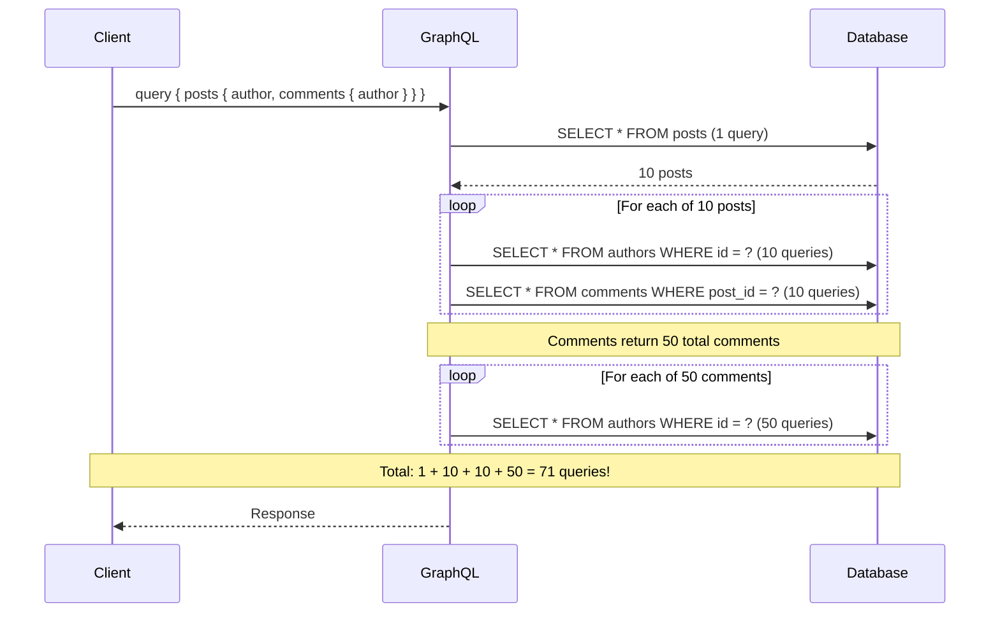
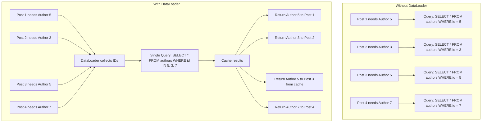
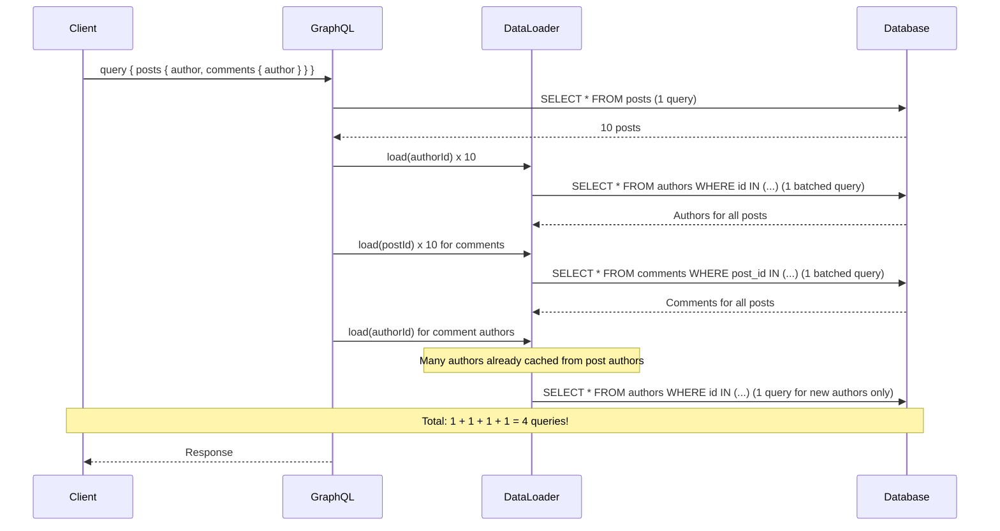

# How to Build GraphQL Resolvers with N+1 Prevention

Author: [nawazdhandala](https://www.github.com/nawazdhandala)

Tags: GraphQL, Node.js, Apollo Server, DataLoader, Performance, Backend, API Design

Description: Learn how to build efficient GraphQL resolvers that prevent the N+1 query problem using DataLoader for batching and caching. This guide covers implementation patterns in Node.js with Apollo Server.

---

> "The N+1 problem is the silent performance killer in GraphQL APIs. Without proper batching, a simple query can turn into hundreds of database calls." - GraphQL Best Practices

The N+1 query problem is one of the most common performance pitfalls in GraphQL APIs. Unlike REST endpoints where you control exactly what data is fetched, GraphQL's flexible query structure means clients can request deeply nested data that triggers cascading database queries. Understanding and preventing this issue is essential for building performant GraphQL services.

## Understanding the N+1 Problem

The N+1 problem occurs when your GraphQL resolver makes one query to fetch a list of items (the "1"), then makes an additional query for each item to fetch related data (the "N"). This pattern scales poorly and can overwhelm your database.

### A Problematic Example

Consider this GraphQL schema for a blog platform:

```graphql
# Schema definition for a blog with posts and authors
type Query {
  posts: [Post!]!
}

type Post {
  id: ID!
  title: String!
  content: String!
  author: Author!      # Each post has an author
  comments: [Comment!]! # Each post has multiple comments
}

type Author {
  id: ID!
  name: String!
  email: String!
}

type Comment {
  id: ID!
  text: String!
  author: Author!      # Each comment also has an author
}
```

With naive resolvers, a simple query becomes expensive:

```graphql
# This innocent-looking query can trigger 100+ database calls
query {
  posts {
    id
    title
    author {
      name
    }
    comments {
      text
      author {
        name
      }
    }
  }
}
```

### The Problematic Resolver Pattern

```javascript
// BAD: Naive resolvers that cause N+1 queries
const resolvers = {
  Query: {
    // 1 query to fetch all posts
    posts: async () => {
      return await db.query('SELECT * FROM posts');
    },
  },
  Post: {
    // N queries - one for each post's author
    author: async (post) => {
      return await db.query(
        'SELECT * FROM authors WHERE id = $1',
        [post.authorId]
      );
    },
    // N queries - one for each post's comments
    comments: async (post) => {
      return await db.query(
        'SELECT * FROM comments WHERE post_id = $1',
        [post.id]
      );
    },
  },
  Comment: {
    // N queries - one for each comment's author
    author: async (comment) => {
      return await db.query(
        'SELECT * FROM authors WHERE id = $1',
        [comment.authorId]
      );
    },
  },
};
```

### Visualizing the Problem

The following diagram shows how a single GraphQL query explodes into many database calls:



## The DataLoader Pattern

DataLoader, created by Facebook, solves the N+1 problem through two mechanisms: batching and caching. It collects all individual requests made during a single tick of the event loop and combines them into a single batch request.

### How DataLoader Works



### Installing DataLoader

```bash
# Install DataLoader for batching and caching
npm install dataloader
```

### Basic DataLoader Implementation

```javascript
const DataLoader = require('dataloader');

// Batch function: receives an array of keys, returns array of values
// The order of results MUST match the order of keys
async function batchAuthors(authorIds) {
  console.log(`Batching authors: ${authorIds.join(', ')}`);

  // Single query for all authors
  const authors = await db.query(
    'SELECT * FROM authors WHERE id = ANY($1)',
    [authorIds]
  );

  // Create a map for O(1) lookup
  const authorMap = new Map(authors.map(author => [author.id, author]));

  // Return authors in the same order as the input IDs
  // This is critical - DataLoader requires positional correspondence
  return authorIds.map(id => authorMap.get(id) || null);
}

// Create a new DataLoader instance
const authorLoader = new DataLoader(batchAuthors);

// Usage: these calls are automatically batched
const author1 = await authorLoader.load(5);  // Queued
const author2 = await authorLoader.load(3);  // Queued
const author3 = await authorLoader.load(5);  // Returns cached result
// Actual query: SELECT * FROM authors WHERE id = ANY([5, 3])
```

## Implementation in Node.js with Apollo Server

### Project Structure

```
src/
  index.js           # Apollo Server setup
  schema.js          # GraphQL type definitions
  resolvers.js       # Resolver functions
  loaders/
    index.js         # DataLoader factory
    authorLoader.js  # Author batch function
    commentLoader.js # Comment batch function
  db.js              # Database connection
```

### Setting Up Apollo Server with DataLoader

```javascript
// src/index.js
const { ApolloServer } = require('@apollo/server');
const { startStandaloneServer } = require('@apollo/server/standalone');
const typeDefs = require('./schema');
const resolvers = require('./resolvers');
const createLoaders = require('./loaders');

const server = new ApolloServer({
  typeDefs,
  resolvers,
});

async function startServer() {
  const { url } = await startStandaloneServer(server, {
    // Create fresh loaders for each request
    // This ensures per-request caching and prevents data leaks
    context: async ({ req }) => {
      return {
        // Each request gets its own loader instances
        loaders: createLoaders(),
        // You can also add auth context here
        user: await authenticateUser(req),
      };
    },
    listen: { port: 4000 },
  });

  console.log(`GraphQL server ready at ${url}`);
}

startServer();
```

### Creating the DataLoader Factory

```javascript
// src/loaders/index.js
const DataLoader = require('dataloader');
const db = require('../db');

// Factory function creates fresh loaders for each request
function createLoaders() {
  return {
    // Author loader - batches author fetches by ID
    author: new DataLoader(async (authorIds) => {
      const authors = await db.query(
        `SELECT * FROM authors WHERE id = ANY($1)`,
        [authorIds]
      );

      // Map results to maintain order correspondence with input IDs
      const authorMap = new Map(authors.map(a => [a.id, a]));
      return authorIds.map(id => authorMap.get(id) || null);
    }),

    // Comment loader - batches comment fetches by post ID
    // Note: This returns arrays since each post has multiple comments
    commentsByPost: new DataLoader(async (postIds) => {
      const comments = await db.query(
        `SELECT * FROM comments WHERE post_id = ANY($1)`,
        [postIds]
      );

      // Group comments by post_id
      const commentsByPostId = new Map();
      postIds.forEach(id => commentsByPostId.set(id, []));

      comments.forEach(comment => {
        const postComments = commentsByPostId.get(comment.post_id);
        if (postComments) {
          postComments.push(comment);
        }
      });

      // Return arrays in the same order as input post IDs
      return postIds.map(id => commentsByPostId.get(id) || []);
    }),

    // Post loader - batches post fetches by ID
    post: new DataLoader(async (postIds) => {
      const posts = await db.query(
        `SELECT * FROM posts WHERE id = ANY($1)`,
        [postIds]
      );

      const postMap = new Map(posts.map(p => [p.id, p]));
      return postIds.map(id => postMap.get(id) || null);
    }),
  };
}

module.exports = createLoaders;
```

### Optimized Resolvers Using DataLoader

```javascript
// src/resolvers.js
const resolvers = {
  Query: {
    // Initial query still fetches all posts
    posts: async (_, __, { loaders }) => {
      const posts = await db.query('SELECT * FROM posts ORDER BY created_at DESC');

      // Prime the cache with posts we already have
      // This prevents redundant fetches if posts are requested by ID later
      posts.forEach(post => loaders.post.prime(post.id, post));

      return posts;
    },

    // Single post query uses the loader
    post: async (_, { id }, { loaders }) => {
      return loaders.post.load(id);
    },
  },

  Post: {
    // Now batched: multiple posts requesting authors = single query
    author: async (post, _, { loaders }) => {
      return loaders.author.load(post.authorId);
    },

    // Now batched: multiple posts requesting comments = single query
    comments: async (post, _, { loaders }) => {
      return loaders.commentsByPost.load(post.id);
    },
  },

  Comment: {
    // Reuses the same author loader - benefits from caching too
    author: async (comment, _, { loaders }) => {
      return loaders.author.load(comment.authorId);
    },
  },
};

module.exports = resolvers;
```

### Query Performance Comparison

With DataLoader, the same query now makes far fewer database calls:



## Advanced Batching Patterns

### Composite Keys

Sometimes you need to batch by multiple fields:

```javascript
// src/loaders/compositeLoader.js
const DataLoader = require('dataloader');

// Batch function for fetching user roles in specific organizations
function createUserRoleLoader() {
  return new DataLoader(async (keys) => {
    // Keys are objects: { userId, organizationId }
    // Extract unique combinations for the query
    const userIds = [...new Set(keys.map(k => k.userId))];
    const orgIds = [...new Set(keys.map(k => k.organizationId))];

    const roles = await db.query(
      `SELECT * FROM user_roles
       WHERE user_id = ANY($1) AND organization_id = ANY($2)`,
      [userIds, orgIds]
    );

    // Create lookup map with composite key
    const roleMap = new Map();
    roles.forEach(role => {
      const key = `${role.user_id}:${role.organization_id}`;
      roleMap.set(key, role);
    });

    // Return results in order, using composite key for lookup
    return keys.map(({ userId, organizationId }) => {
      const key = `${userId}:${organizationId}`;
      return roleMap.get(key) || null;
    });
  }, {
    // Custom cache key function for composite keys
    cacheKeyFn: ({ userId, organizationId }) => `${userId}:${organizationId}`,
  });
}
```

### Handling Errors in Batches

```javascript
// src/loaders/errorHandlingLoader.js
const DataLoader = require('dataloader');

function createRobustAuthorLoader() {
  return new DataLoader(async (authorIds) => {
    try {
      const authors = await db.query(
        'SELECT * FROM authors WHERE id = ANY($1)',
        [authorIds]
      );

      const authorMap = new Map(authors.map(a => [a.id, a]));

      // Return Error instances for missing authors
      // DataLoader will throw these when accessed
      return authorIds.map(id => {
        const author = authorMap.get(id);
        if (!author) {
          return new Error(`Author ${id} not found`);
        }
        return author;
      });
    } catch (error) {
      // If the entire batch fails, return errors for all keys
      // This prevents one bad query from crashing the whole request
      console.error('Batch author fetch failed:', error);
      return authorIds.map(() => new Error('Failed to fetch author'));
    }
  });
}
```

### Pagination with DataLoader

```javascript
// src/loaders/paginatedLoader.js
const DataLoader = require('dataloader');

// Loader for paginated comments
function createPaginatedCommentsLoader() {
  return new DataLoader(async (requests) => {
    // Each request: { postId, limit, offset }
    // Group by limit/offset to batch similar pagination requests
    const results = await Promise.all(
      requests.map(async ({ postId, limit, offset }) => {
        return db.query(
          `SELECT * FROM comments
           WHERE post_id = $1
           ORDER BY created_at DESC
           LIMIT $2 OFFSET $3`,
          [postId, limit, offset]
        );
      })
    );

    return results;
  }, {
    // Each unique combination of parameters gets its own cache entry
    cacheKeyFn: ({ postId, limit, offset }) => `${postId}:${limit}:${offset}`,
    // Disable batching since pagination params differ
    batch: false,
  });
}

// Resolver usage
const resolvers = {
  Post: {
    comments: async (post, { first = 10, skip = 0 }, { loaders }) => {
      return loaders.paginatedComments.load({
        postId: post.id,
        limit: first,
        offset: skip,
      });
    },
  },
};
```

## Caching Strategies

### Per-Request Caching

DataLoader caches within a single request by default. This is the safest approach as it prevents stale data issues:

```javascript
// Fresh loaders per request - cache only lives for one request
context: async ({ req }) => ({
  loaders: createLoaders(),
}),
```

### Request-Scoped Cache with Priming

```javascript
// src/loaders/primedLoader.js
function createLoaders(initialData = {}) {
  const loaders = {
    author: new DataLoader(batchAuthors),
    post: new DataLoader(batchPosts),
  };

  // Prime cache with data you already have
  // Useful when you fetch data in middleware or parent resolvers
  if (initialData.currentUser) {
    loaders.author.prime(initialData.currentUser.id, initialData.currentUser);
  }

  return loaders;
}

// Usage in context
context: async ({ req }) => {
  const currentUser = await getCurrentUser(req);
  return {
    loaders: createLoaders({ currentUser }),
    currentUser,
  };
},
```

### Manual Cache Invalidation

```javascript
// Sometimes you need to clear cached data after mutations
const resolvers = {
  Mutation: {
    updateAuthor: async (_, { id, input }, { loaders }) => {
      const updatedAuthor = await db.query(
        'UPDATE authors SET name = $1, email = $2 WHERE id = $3 RETURNING *',
        [input.name, input.email, id]
      );

      // Clear the stale cached value
      loaders.author.clear(id);

      // Prime with the new value so subsequent reads get fresh data
      loaders.author.prime(id, updatedAuthor[0]);

      return updatedAuthor[0];
    },

    deleteAuthor: async (_, { id }, { loaders }) => {
      await db.query('DELETE FROM authors WHERE id = $1', [id]);

      // Clear from cache
      loaders.author.clear(id);

      return { success: true };
    },
  },
};
```

## Testing DataLoader

### Unit Testing Batch Functions

```javascript
// src/loaders/__tests__/authorLoader.test.js
const { batchAuthors } = require('../authorLoader');

// Mock database
jest.mock('../../db', () => ({
  query: jest.fn(),
}));

const db = require('../../db');

describe('batchAuthors', () => {
  beforeEach(() => {
    jest.clearAllMocks();
  });

  it('batches multiple author requests into single query', async () => {
    // Setup mock response
    db.query.mockResolvedValue([
      { id: 1, name: 'Alice', email: 'alice@example.com' },
      { id: 2, name: 'Bob', email: 'bob@example.com' },
    ]);

    // Call batch function
    const result = await batchAuthors([1, 2]);

    // Verify single query was made
    expect(db.query).toHaveBeenCalledTimes(1);
    expect(db.query).toHaveBeenCalledWith(
      expect.stringContaining('WHERE id = ANY'),
      [[1, 2]]
    );

    // Verify results are in correct order
    expect(result).toHaveLength(2);
    expect(result[0].name).toBe('Alice');
    expect(result[1].name).toBe('Bob');
  });

  it('returns null for missing authors', async () => {
    db.query.mockResolvedValue([
      { id: 1, name: 'Alice', email: 'alice@example.com' },
      // Author 2 is missing
    ]);

    const result = await batchAuthors([1, 2]);

    expect(result[0].name).toBe('Alice');
    expect(result[1]).toBeNull();
  });

  it('maintains order even when DB returns different order', async () => {
    // Database returns in different order
    db.query.mockResolvedValue([
      { id: 3, name: 'Charlie', email: 'charlie@example.com' },
      { id: 1, name: 'Alice', email: 'alice@example.com' },
      { id: 2, name: 'Bob', email: 'bob@example.com' },
    ]);

    // Request in specific order
    const result = await batchAuthors([1, 2, 3]);

    // Results should match request order, not DB order
    expect(result[0].name).toBe('Alice');
    expect(result[1].name).toBe('Bob');
    expect(result[2].name).toBe('Charlie');
  });
});
```

### Integration Testing with Apollo Server

```javascript
// src/__tests__/integration.test.js
const { ApolloServer } = require('@apollo/server');
const typeDefs = require('../schema');
const resolvers = require('../resolvers');
const createLoaders = require('../loaders');

describe('GraphQL API with DataLoader', () => {
  let server;
  let queryCount;

  beforeEach(() => {
    queryCount = 0;

    // Mock db.query to count calls
    jest.spyOn(db, 'query').mockImplementation(async (sql, params) => {
      queryCount++;
      // Return mock data based on query
      if (sql.includes('FROM posts')) {
        return mockPosts;
      }
      if (sql.includes('FROM authors')) {
        return mockAuthors.filter(a => params[0].includes(a.id));
      }
      return [];
    });

    server = new ApolloServer({ typeDefs, resolvers });
  });

  it('batches author queries across multiple posts', async () => {
    const response = await server.executeOperation(
      {
        query: `
          query {
            posts {
              id
              title
              author {
                name
              }
            }
          }
        `,
      },
      {
        contextValue: { loaders: createLoaders() },
      }
    );

    expect(response.body.singleResult.errors).toBeUndefined();

    // Should be 2 queries total: one for posts, one batched for all authors
    // Without DataLoader, this would be 1 + N queries
    expect(queryCount).toBe(2);
  });
});
```

## Performance Monitoring

### Logging DataLoader Statistics

```javascript
// src/loaders/monitoredLoader.js
const DataLoader = require('dataloader');

function createMonitoredLoader(name, batchFn) {
  let loadCount = 0;
  let batchCount = 0;
  let cacheHits = 0;

  const loader = new DataLoader(async (keys) => {
    batchCount++;
    console.log(`[${name}] Batch #${batchCount}: ${keys.length} keys`);

    const startTime = Date.now();
    const results = await batchFn(keys);
    const duration = Date.now() - startTime;

    console.log(`[${name}] Batch #${batchCount} completed in ${duration}ms`);

    return results;
  });

  // Wrap load to track statistics
  const originalLoad = loader.load.bind(loader);
  loader.load = async (key) => {
    loadCount++;
    const result = await originalLoad(key);
    return result;
  };

  // Add method to get statistics
  loader.getStats = () => ({
    name,
    loadCount,
    batchCount,
    cacheHits,
    batchEfficiency: loadCount > 0 ? (loadCount / batchCount).toFixed(2) : 0,
  });

  return loader;
}

// Usage
const authorLoader = createMonitoredLoader('author', batchAuthors);

// At end of request
console.log(authorLoader.getStats());
// Output: { name: 'author', loadCount: 50, batchCount: 3, batchEfficiency: '16.67' }
```

### Integration with Monitoring Tools

For production monitoring, integrate with [OneUptime](https://oneuptime.com) to track your GraphQL resolver performance. OneUptime can help you identify slow resolvers, track N+1 regressions, and alert on performance degradation.

```javascript
// src/monitoring/graphqlMetrics.js
const { trace } = require('@opentelemetry/api');

function createTracedLoader(name, batchFn) {
  const tracer = trace.getTracer('graphql-dataloaders');

  return new DataLoader(async (keys) => {
    return tracer.startActiveSpan(`dataloader.${name}`, async (span) => {
      span.setAttribute('dataloader.name', name);
      span.setAttribute('dataloader.keys_count', keys.length);

      try {
        const results = await batchFn(keys);
        span.setAttribute('dataloader.results_count', results.length);
        return results;
      } catch (error) {
        span.recordException(error);
        throw error;
      } finally {
        span.end();
      }
    });
  });
}
```

## Common Pitfalls and Solutions

### Pitfall 1: Returning Results in Wrong Order

```javascript
// WRONG: Results order doesn't match input order
async function badBatchAuthors(ids) {
  const authors = await db.query('SELECT * FROM authors WHERE id = ANY($1)', [ids]);
  return authors; // Database may return in any order!
}

// CORRECT: Map results to match input order
async function goodBatchAuthors(ids) {
  const authors = await db.query('SELECT * FROM authors WHERE id = ANY($1)', [ids]);
  const authorMap = new Map(authors.map(a => [a.id, a]));
  return ids.map(id => authorMap.get(id) || null); // Maintains input order
}
```

### Pitfall 2: Sharing Loaders Across Requests

```javascript
// WRONG: Global loader shares cache across requests
const globalAuthorLoader = new DataLoader(batchAuthors);

app.use((req, res, next) => {
  req.loaders = { author: globalAuthorLoader }; // Stale data!
  next();
});

// CORRECT: Create fresh loaders per request
app.use((req, res, next) => {
  req.loaders = createLoaders(); // Fresh cache per request
  next();
});
```

### Pitfall 3: Not Handling Null Results

```javascript
// WRONG: Throws when author not found
async function fragileResolver(post, _, { loaders }) {
  const author = await loaders.author.load(post.authorId);
  return author.name; // TypeError if author is null!
}

// CORRECT: Handle missing data gracefully
async function robustResolver(post, _, { loaders }) {
  const author = await loaders.author.load(post.authorId);
  return author?.name || 'Unknown Author';
}
```

## Summary

| Technique | Purpose | Implementation |
|-----------|---------|----------------|
| **DataLoader** | Batch and cache requests | Create per-request instances |
| **Batch Functions** | Combine multiple queries | Return results in input order |
| **Cache Priming** | Prevent redundant fetches | Prime with known data |
| **Cache Invalidation** | Handle mutations | Clear/prime after updates |
| **Composite Keys** | Multi-field lookups | Custom cacheKeyFn |
| **Monitoring** | Track performance | OpenTelemetry integration |

The N+1 problem is avoidable with proper architecture. DataLoader provides an elegant solution that works with GraphQL's execution model. By batching database queries and caching results within each request, you can build GraphQL APIs that remain performant regardless of query complexity.

For comprehensive monitoring of your GraphQL API performance, including resolver timing and query analysis, consider using [OneUptime](https://oneuptime.com). It provides real-time observability into your GraphQL services, helping you catch N+1 regressions before they impact users.
