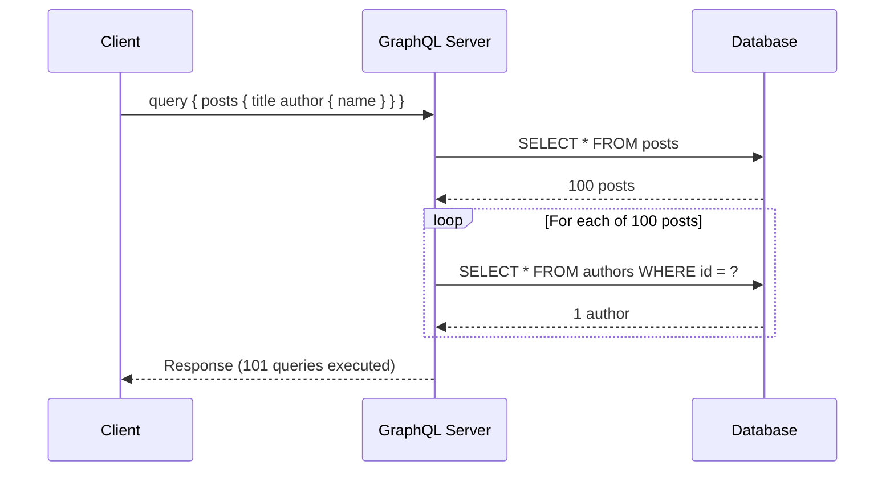
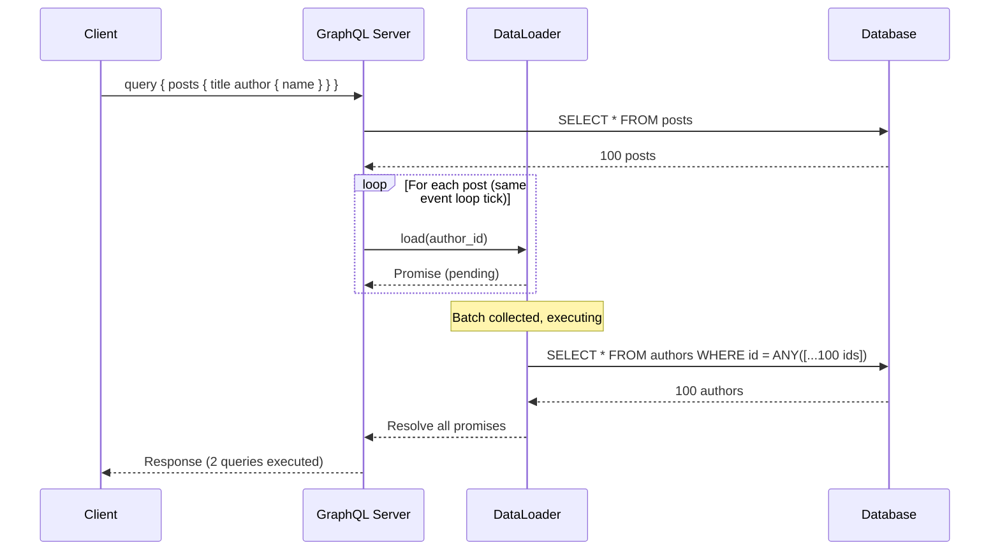
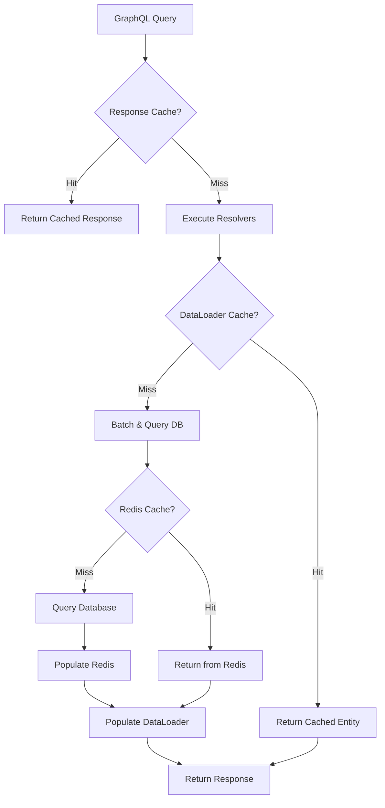
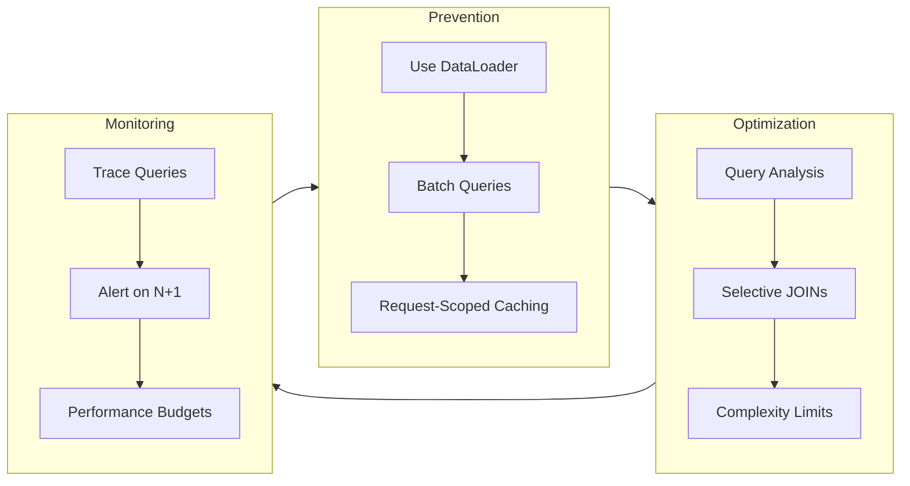

# How to Build GraphQL Resolvers with N+1 Prevention

Author: [nawazdhandala](https://github.com/nawazdhandala)

Tags: GraphQL, N+1 Problem, DataLoader, Performance, API Design, Backend Development

Description: A comprehensive guide to understanding and preventing the N+1 query problem in GraphQL resolvers, covering DataLoader implementation, field-level resolvers, caching strategies, and query optimization techniques for production-ready APIs.

---

> The N+1 problem is the silent performance killer in GraphQL APIs. Master batching and caching, and your resolvers will scale from prototype to production without rewriting a line of business logic.

GraphQL's flexibility is a double-edged sword. While clients love requesting exactly the data they need, naive resolver implementations can turn a single query into hundreds of database calls. This guide walks through the N+1 problem, why it happens, and battle-tested patterns to eliminate it.

## Understanding the N+1 Problem

The N+1 problem occurs when your GraphQL server executes one query to fetch a list of N items, then executes N additional queries to fetch related data for each item. Consider a simple schema:

```graphql
# schema.graphql
# A typical blog schema demonstrating parent-child relationships
# that can trigger N+1 queries if not handled properly

type Query {
  posts: [Post!]!
}

type Post {
  id: ID!
  title: String!
  author: Author!      # This relationship is the N+1 trap
  comments: [Comment!]!
}

type Author {
  id: ID!
  name: String!
  email: String!
}

type Comment {
  id: ID!
  body: String!
  author: Author!      # Another potential N+1 source
}
```

A naive resolver implementation creates the problem:

```typescript
// resolvers/post.ts
// WARNING: This is the WRONG way to implement resolvers
// Each post triggers a separate database query for its author

const resolvers = {
  Query: {
    // First query: SELECT * FROM posts (returns N posts)
    posts: async () => {
      return await db.query('SELECT * FROM posts');
    },
  },
  Post: {
    // N additional queries: SELECT * FROM authors WHERE id = ?
    // Called once per post, resulting in N+1 total queries
    author: async (post) => {
      return await db.query(
        'SELECT * FROM authors WHERE id = $1',
        [post.author_id]
      );
    },
    // Another N queries for comments
    comments: async (post) => {
      return await db.query(
        'SELECT * FROM comments WHERE post_id = $1',
        [post.id]
      );
    },
  },
};
```

The execution flow looks like this:



With 100 posts, you execute 101 database queries. With nested relationships, this explodes exponentially.

## Using DataLoader for Batching

DataLoader is the standard solution for N+1 prevention. It batches multiple individual loads into a single batch request and caches results within a single request lifecycle.

```typescript
// loaders/authorLoader.ts
// DataLoader batches individual author requests into a single query
// Key insight: collect all IDs, fetch once, return in order

import DataLoader from 'dataloader';

// The batch function receives an array of keys and must return
// results in the exact same order as the keys were provided
async function batchAuthors(authorIds: readonly string[]): Promise<Author[]> {
  // Single query fetches all authors at once
  // This replaces N individual queries with 1 batch query
  const authors = await db.query(
    `SELECT * FROM authors WHERE id = ANY($1)`,
    [authorIds]
  );

  // CRITICAL: Results must be returned in the same order as input keys
  // DataLoader requires this for correct mapping back to callers
  const authorMap = new Map(authors.map(a => [a.id, a]));
  return authorIds.map(id => authorMap.get(id));
}

// Create a new loader instance per request to ensure
// request-scoped caching and avoid data leakage between users
export function createAuthorLoader() {
  return new DataLoader(batchAuthors);
}
```

Integrate the loader into your GraphQL context:

```typescript
// server.ts
// Create fresh loaders for each request to maintain isolation
// Loaders are request-scoped to prevent cache pollution

import { ApolloServer } from '@apollo/server';
import { createAuthorLoader } from './loaders/authorLoader';
import { createCommentLoader } from './loaders/commentLoader';

const server = new ApolloServer({
  typeDefs,
  resolvers,
});

// Context factory runs for each request
// Fresh loaders ensure no data leaks between requests
const { url } = await startStandaloneServer(server, {
  context: async ({ req }) => {
    return {
      // Each request gets its own loader instances
      // This provides request-level caching without cross-request pollution
      loaders: {
        author: createAuthorLoader(),
        comment: createCommentLoader(),
        // Add more loaders as your schema grows
      },
      // Include user info for authorization
      user: await authenticateUser(req),
    };
  },
});
```

Update your resolvers to use the loader:

```typescript
// resolvers/post.ts
// Optimized resolvers using DataLoader
// Multiple calls to loader.load() are batched automatically

const resolvers = {
  Query: {
    posts: async () => {
      return await db.query('SELECT * FROM posts');
    },
  },
  Post: {
    // Instead of querying directly, delegate to DataLoader
    // DataLoader collects all load() calls in the current tick
    // and executes them as a single batch
    author: async (post, _args, context) => {
      // This doesn't execute immediately - it's batched
      return context.loaders.author.load(post.author_id);
    },
    comments: async (post, _args, context) => {
      return context.loaders.comment.load(post.id);
    },
  },
};
```

The execution flow with DataLoader:



## Implementing Field-Level Resolvers

Field-level resolvers give you fine-grained control over data fetching. The key is understanding when data is already available versus when it needs fetching.

```typescript
// resolvers/author.ts
// Field-level resolvers with intelligent data fetching
// Avoid unnecessary queries when data is already present

const resolvers = {
  Author: {
    // Computed field - no database query needed
    // Derives value from existing parent data
    displayName: (author) => {
      return `${author.name} <${author.email}>`;
    },

    // Conditional fetching - only query if needed
    // Check if data was already included in parent query
    posts: async (author, _args, context) => {
      // If posts were eagerly loaded, use them
      // This pattern works well with query complexity analysis
      if (author.posts) {
        return author.posts;
      }
      // Otherwise, use DataLoader to batch fetch
      return context.loaders.authorPosts.load(author.id);
    },

    // Field with arguments requires custom handling
    // Arguments change the cache key semantics
    recentPosts: async (author, { limit = 5 }, context) => {
      // For parameterized fields, include args in the cache key
      // This prevents returning cached results for different parameters
      const cacheKey = `${author.id}:${limit}`;
      return context.loaders.authorRecentPosts.load(cacheKey);
    },
  },
};
```

Handle complex nested relationships with composed loaders:

```typescript
// loaders/composedLoaders.ts
// Loaders for relationships with parameters or complex keys
// Demonstrates handling non-trivial batching scenarios

import DataLoader from 'dataloader';

// Loader for parameterized queries
// Key format: "authorId:limit" parsed in batch function
export function createAuthorRecentPostsLoader() {
  return new DataLoader(async (keys: readonly string[]) => {
    // Parse composite keys back into components
    const parsed = keys.map(key => {
      const [authorId, limit] = key.split(':');
      return { authorId, limit: parseInt(limit, 10) };
    });

    // Group by limit to minimize query variations
    // This optimization reduces query count when limits vary
    const byLimit = new Map<number, string[]>();
    for (const { authorId, limit } of parsed) {
      if (!byLimit.has(limit)) byLimit.set(limit, []);
      byLimit.get(limit).push(authorId);
    }

    // Execute one query per unique limit value
    const results = new Map<string, Post[]>();
    for (const [limit, authorIds] of byLimit) {
      const posts = await db.query(
        `SELECT * FROM posts
         WHERE author_id = ANY($1)
         ORDER BY created_at DESC
         LIMIT $2`,
        [authorIds, limit]
      );

      // Group results by author
      for (const post of posts) {
        const key = `${post.author_id}:${limit}`;
        if (!results.has(key)) results.set(key, []);
        results.get(key).push(post);
      }
    }

    // Return in original key order
    return keys.map(key => results.get(key) || []);
  });
}
```

## Caching Strategies

Effective caching operates at multiple levels. Understanding where to cache prevents redundant work across requests.



Implement multi-layer caching:

```typescript
// loaders/cachedAuthorLoader.ts
// Multi-tier caching: DataLoader -> Redis -> Database
// Reduces database load for frequently accessed entities

import DataLoader from 'dataloader';
import Redis from 'ioredis';

const redis = new Redis(process.env.REDIS_URL);
const CACHE_TTL = 300; // 5 minutes

export function createCachedAuthorLoader() {
  return new DataLoader(async (authorIds: readonly string[]) => {
    const results: (Author | null)[] = new Array(authorIds.length);
    const uncachedIds: string[] = [];
    const uncachedIndexes: number[] = [];

    // Step 1: Check Redis for cached authors
    // Use MGET for efficient batch retrieval
    const cacheKeys = authorIds.map(id => `author:${id}`);
    const cached = await redis.mget(cacheKeys);

    for (let i = 0; i < authorIds.length; i++) {
      if (cached[i]) {
        // Cache hit - parse and use cached data
        results[i] = JSON.parse(cached[i]);
      } else {
        // Cache miss - need to fetch from database
        uncachedIds.push(authorIds[i]);
        uncachedIndexes.push(i);
      }
    }

    // Step 2: Fetch uncached authors from database
    if (uncachedIds.length > 0) {
      const authors = await db.query(
        `SELECT * FROM authors WHERE id = ANY($1)`,
        [uncachedIds]
      );

      // Build map for efficient lookup
      const authorMap = new Map(authors.map(a => [a.id, a]));

      // Step 3: Populate results and update Redis cache
      const pipeline = redis.pipeline();

      for (let i = 0; i < uncachedIds.length; i++) {
        const author = authorMap.get(uncachedIds[i]) || null;
        results[uncachedIndexes[i]] = author;

        if (author) {
          // Cache the fetched author for future requests
          pipeline.setex(
            `author:${author.id}`,
            CACHE_TTL,
            JSON.stringify(author)
          );
        }
      }

      // Execute all cache writes in a single round trip
      await pipeline.exec();
    }

    return results;
  });
}
```

Implement cache invalidation for mutations:

```typescript
// resolvers/mutations.ts
// Cache invalidation on mutations
// Ensures data consistency across cache layers

const resolvers = {
  Mutation: {
    updateAuthor: async (_, { id, input }, context) => {
      // Update database
      const author = await db.query(
        `UPDATE authors SET name = $1, email = $2
         WHERE id = $3 RETURNING *`,
        [input.name, input.email, id]
      );

      // Invalidate Redis cache
      // Delete ensures next read fetches fresh data
      await redis.del(`author:${id}`);

      // Clear DataLoader cache for this request
      // Prevents stale data in subsequent resolvers
      context.loaders.author.clear(id);

      // Optionally prime the loader with fresh data
      // Avoids unnecessary database query if author is accessed again
      context.loaders.author.prime(id, author);

      return author;
    },
  },
};
```

## Query Optimization Techniques

Beyond caching, optimize the queries themselves using query analysis and database-level optimizations.

```typescript
// utils/queryAnalysis.ts
// Analyze incoming GraphQL queries to optimize data fetching
// Look-ahead pattern: know what fields are requested before resolving

import { GraphQLResolveInfo } from 'graphql';
import graphqlFields from 'graphql-fields';

// Extract requested fields from GraphQL info
// Enables conditional eager loading based on selection set
export function getRequestedFields(info: GraphQLResolveInfo): Set<string> {
  const fields = graphqlFields(info);
  return new Set(Object.keys(fields));
}

// Check if nested relationship is requested
// Avoids loading relationships that won't be used
export function isFieldRequested(
  info: GraphQLResolveInfo,
  fieldPath: string
): boolean {
  const fields = graphqlFields(info);
  const parts = fieldPath.split('.');

  let current = fields;
  for (const part of parts) {
    if (!current[part]) return false;
    current = current[part];
  }
  return true;
}
```

Apply query analysis in resolvers:

```typescript
// resolvers/query.ts
// Optimized root resolver using query analysis
// Eager load only what's needed based on the query

import { getRequestedFields, isFieldRequested } from '../utils/queryAnalysis';

const resolvers = {
  Query: {
    posts: async (_, args, context, info) => {
      // Analyze what fields the client requested
      const requestedFields = getRequestedFields(info);

      // Build optimized SQL based on selection
      let query = 'SELECT p.*';
      let joins = '';

      // Only join author table if author fields are requested
      // Reduces data transfer and query complexity
      if (isFieldRequested(info, 'author')) {
        query += `,
          a.id as author_id,
          a.name as author_name,
          a.email as author_email`;
        joins += ' LEFT JOIN authors a ON p.author_id = a.id';
      }

      query += ` FROM posts p${joins}`;

      // Apply pagination from arguments
      if (args.limit) {
        query += ` LIMIT ${parseInt(args.limit, 10)}`;
      }
      if (args.offset) {
        query += ` OFFSET ${parseInt(args.offset, 10)}`;
      }

      const rows = await db.query(query);

      // Transform rows to include nested author if fetched
      return rows.map(row => ({
        ...row,
        // Embed author data if it was joined
        // Resolver can skip DataLoader call when data exists
        author: row.author_id ? {
          id: row.author_id,
          name: row.author_name,
          email: row.author_email,
        } : undefined,
      }));
    },
  },

  Post: {
    author: async (post, _args, context) => {
      // Check if author was already loaded via JOIN
      // Avoids redundant DataLoader call
      if (post.author) {
        return post.author;
      }
      // Fall back to DataLoader for lazy loading
      return context.loaders.author.load(post.author_id);
    },
  },
};
```

Implement query complexity analysis to prevent abuse:

```typescript
// plugins/queryComplexity.ts
// Limit query complexity to prevent resource exhaustion
// Assign costs to fields based on their database impact

import {
  getComplexity,
  simpleEstimator,
  fieldExtensionsEstimator
} from 'graphql-query-complexity';

export const complexityPlugin = {
  requestDidStart: () => ({
    didResolveOperation({ request, document, schema }) {
      const complexity = getComplexity({
        schema,
        query: document,
        variables: request.variables,
        estimators: [
          // Use field extensions for custom costs
          fieldExtensionsEstimator(),
          // Fall back to simple multiplier estimation
          simpleEstimator({ defaultComplexity: 1 }),
        ],
      });

      const maxComplexity = 1000;

      if (complexity > maxComplexity) {
        throw new Error(
          `Query complexity ${complexity} exceeds maximum ${maxComplexity}`
        );
      }

      // Log complexity for monitoring
      console.log(`Query complexity: ${complexity}`);
    },
  }),
};
```

Define complexity in your schema:

```typescript
// schema/types.ts
// Assign complexity costs to expensive fields
// Prevents clients from constructing abusive queries

const typeDefs = gql`
  type Post {
    id: ID!
    title: String!
    # author lookup has moderate cost
    author: Author! @complexity(value: 5)
    # comments can be expensive with high counts
    comments(
      limit: Int = 10
    ): [Comment!]! @complexity(value: 10, multipliers: ["limit"])
  }
`;
```

## Best Practices Summary

Following these practices ensures your GraphQL API remains performant as it scales.



Key takeaways for N+1 prevention:

1. **Always use DataLoader** - Create loaders for every relationship in your schema. The upfront investment prevents exponential query growth.

2. **Keep loaders request-scoped** - Fresh loader instances per request prevent cache pollution and data leakage between users.

3. **Implement multi-tier caching** - DataLoader for request-level, Redis for cross-request, and response caching for repeated queries.

4. **Analyze queries before execution** - Use the GraphQL `info` parameter to understand what data is actually needed.

5. **Set complexity limits** - Prevent malicious or accidental query abuse with complexity analysis.

6. **Monitor query patterns** - Trace database queries in production to catch N+1 regressions early.

7. **Test with realistic data** - N+1 issues only become apparent with production-scale datasets.

8. **Document loader requirements** - Make it clear which loaders each resolver depends on to prevent missing context errors.

---

For monitoring your GraphQL API performance and catching N+1 issues in production, [OneUptime](https://oneuptime.com) provides distributed tracing that visualizes database query patterns and alerts on performance regressions before they impact users.
