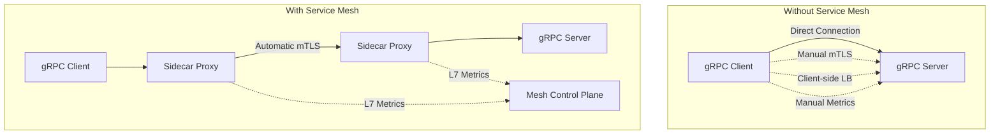
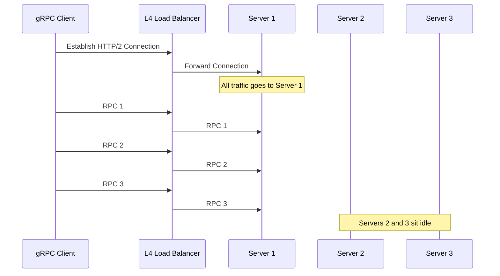
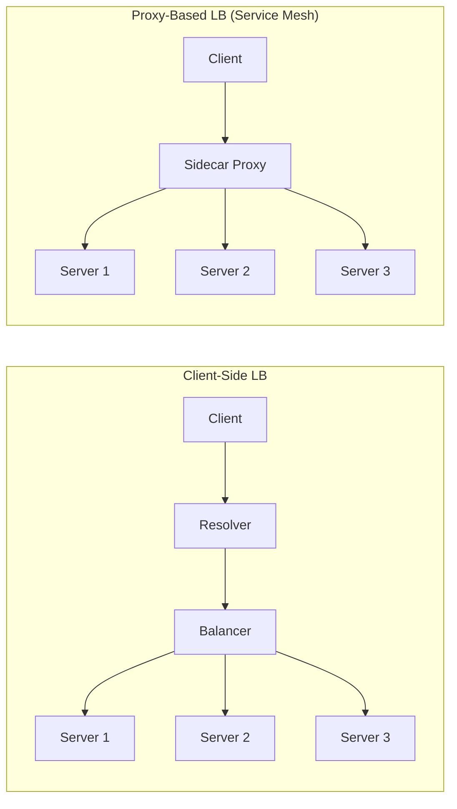
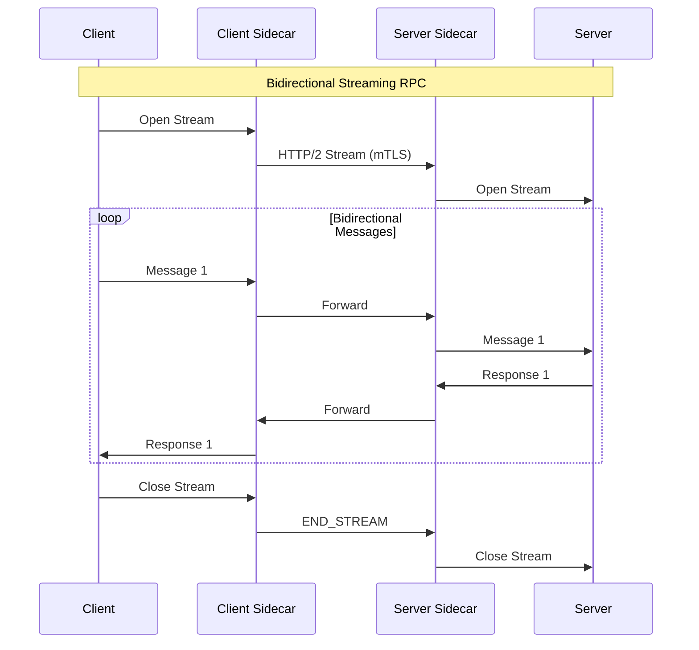

# How to Use gRPC with Service Mesh

By [Nawaz Dhandala](https://github.com/nawazdhandala)

Tags: gRPC, Service Mesh, Istio, Linkerd, mTLS, Load Balancing, Kubernetes, Microservices, Observability, DevOps

Description: A comprehensive guide to integrating gRPC with service meshes like Istio and Linkerd, covering mTLS configuration, HTTP/2 load balancing, observability setup, and best practices for running gRPC services in production.

---

> "A service mesh gives you visibility and control over your microservices traffic without changing a single line of application code." - Kelsey Hightower

gRPC and service meshes are a natural fit. Both are built around HTTP/2, both excel in microservices architectures, and together they solve the hardest problems in distributed systems: security, observability, and traffic management. This guide covers everything you need to run gRPC services with Istio and Linkerd in production.

## Why gRPC Needs a Service Mesh

gRPC brings efficient binary serialization, bidirectional streaming, and strong typing. But it also introduces challenges that service meshes solve elegantly:



### The HTTP/2 Load Balancing Problem

Traditional L4 load balancers don't work well with gRPC because HTTP/2 multiplexes all requests over a single long-lived connection. The load balancer sees one connection and sends all traffic to one backend.



Service meshes solve this with L7-aware load balancing that distributes individual gRPC calls across backends.

## Setting Up Istio with gRPC

### Install Istio

```bash
# Download and install Istio CLI
curl -L https://istio.io/downloadIstio | sh -
cd istio-*
export PATH=$PWD/bin:$PATH

# Install Istio with the demo profile (includes all features)
istioctl install --set profile=demo -y

# Enable automatic sidecar injection for your namespace
kubectl label namespace default istio-injection=enabled
```

### Deploy a gRPC Service

Here's a sample gRPC service deployment that works with Istio:

```yaml
# grpc-server-deployment.yaml
# Deploys a gRPC server with Istio sidecar injection
apiVersion: apps/v1
kind: Deployment
metadata:
  name: grpc-server
  labels:
    app: grpc-server
    version: v1
spec:
  replicas: 3
  selector:
    matchLabels:
      app: grpc-server
  template:
    metadata:
      labels:
        app: grpc-server
        version: v1
      annotations:
        # Tells Istio this service speaks gRPC on port 50051
        sidecar.istio.io/userVolume: '[{"name":"grpc-certs","emptyDir":{}}]'
    spec:
      containers:
        - name: grpc-server
          image: your-registry/grpc-server:v1
          ports:
            - containerPort: 50051
              name: grpc  # Port naming is crucial for Istio
          resources:
            requests:
              memory: "128Mi"
              cpu: "100m"
            limits:
              memory: "256Mi"
              cpu: "500m"
          # Health check using gRPC health checking protocol
          readinessProbe:
            grpc:
              port: 50051
            initialDelaySeconds: 5
            periodSeconds: 10
          livenessProbe:
            grpc:
              port: 50051
            initialDelaySeconds: 10
            periodSeconds: 20
---
# Service definition - port naming tells Istio the protocol
apiVersion: v1
kind: Service
metadata:
  name: grpc-server
  labels:
    app: grpc-server
spec:
  ports:
    - port: 50051
      targetPort: 50051
      name: grpc  # IMPORTANT: Name must start with 'grpc' for Istio
  selector:
    app: grpc-server
```

### Istio Virtual Service for gRPC

```yaml
# grpc-virtual-service.yaml
# Configure traffic routing for gRPC services
apiVersion: networking.istio.io/v1beta1
kind: VirtualService
metadata:
  name: grpc-server
spec:
  hosts:
    - grpc-server
  http:
    # Route configuration for gRPC (uses http stanza, not tcp)
    - match:
        - port: 50051
      route:
        - destination:
            host: grpc-server
            port:
              number: 50051
      # Retry configuration for transient failures
      retries:
        attempts: 3
        perTryTimeout: 2s
        retryOn: "cancelled,deadline-exceeded,resource-exhausted,unavailable"
      # Timeout for the entire request
      timeout: 30s
```

### Destination Rule for Load Balancing

```yaml
# grpc-destination-rule.yaml
# Configure connection pooling and load balancing for gRPC
apiVersion: networking.istio.io/v1beta1
kind: DestinationRule
metadata:
  name: grpc-server
spec:
  host: grpc-server
  trafficPolicy:
    # Connection pool settings optimized for gRPC
    connectionPool:
      tcp:
        maxConnections: 100
        connectTimeout: 5s
      http:
        h2UpgradePolicy: UPGRADE  # Force HTTP/2
        http2MaxRequests: 1000
        maxRequestsPerConnection: 0  # Unlimited (HTTP/2 multiplexing)
        maxRetries: 3
    # Load balancer configuration
    loadBalancer:
      simple: ROUND_ROBIN  # Options: ROUND_ROBIN, LEAST_CONN, RANDOM
    # Outlier detection (circuit breaking)
    outlierDetection:
      consecutive5xxErrors: 5
      interval: 30s
      baseEjectionTime: 30s
      maxEjectionPercent: 50
```

## Setting Up Linkerd with gRPC

Linkerd is lighter weight than Istio and has excellent gRPC support out of the box.

### Install Linkerd

```bash
# Install the Linkerd CLI
curl --proto '=https' --tlsv1.2 -sSfL https://run.linkerd.io/install | sh
export PATH=$HOME/.linkerd2/bin:$PATH

# Validate your cluster is ready
linkerd check --pre

# Install Linkerd control plane
linkerd install --crds | kubectl apply -f -
linkerd install | kubectl apply -f -

# Wait for installation to complete
linkerd check

# Install the viz extension for observability
linkerd viz install | kubectl apply -f -
```

### Inject Linkerd into gRPC Services

```bash
# Inject Linkerd proxy into existing deployments
kubectl get deploy grpc-server -o yaml | linkerd inject - | kubectl apply -f -

# Or annotate namespace for automatic injection
kubectl annotate namespace default linkerd.io/inject=enabled
```

### Linkerd Service Profile for gRPC

```yaml
# grpc-service-profile.yaml
# Define routes and configure per-route metrics/retries
apiVersion: linkerd.io/v1alpha2
kind: ServiceProfile
metadata:
  name: grpc-server.default.svc.cluster.local
  namespace: default
spec:
  routes:
    # Define routes for each gRPC method
    - name: "POST /mypackage.MyService/GetUser"
      condition:
        method: POST
        pathRegex: /mypackage\.MyService/GetUser
      # Enable retries for this route
      isRetryable: true
      # Timeout for this specific method
      timeout: 5s
    - name: "POST /mypackage.MyService/CreateUser"
      condition:
        method: POST
        pathRegex: /mypackage\.MyService/CreateUser
      # Don't retry mutations
      isRetryable: false
      timeout: 10s
    - name: "POST /mypackage.MyService/StreamUpdates"
      condition:
        method: POST
        pathRegex: /mypackage\.MyService/StreamUpdates
      # Longer timeout for streaming RPCs
      timeout: 300s
  # Retry budget prevents retry storms
  retryBudget:
    retryRatio: 0.2  # Max 20% of requests can be retries
    minRetriesPerSecond: 10
    ttl: 10s
```

## mTLS Configuration

Both Istio and Linkerd provide automatic mTLS between services. Here's how to configure and verify it.

### Istio mTLS

```yaml
# peer-authentication.yaml
# Enable strict mTLS for the entire mesh
apiVersion: security.istio.io/v1beta1
kind: PeerAuthentication
metadata:
  name: default
  namespace: istio-system  # Applies mesh-wide
spec:
  mtls:
    mode: STRICT  # Options: STRICT, PERMISSIVE, DISABLE
---
# namespace-peer-auth.yaml
# Or enable per-namespace
apiVersion: security.istio.io/v1beta1
kind: PeerAuthentication
metadata:
  name: default
  namespace: production
spec:
  mtls:
    mode: STRICT
---
# workload-peer-auth.yaml
# Or per-workload with port-level granularity
apiVersion: security.istio.io/v1beta1
kind: PeerAuthentication
metadata:
  name: grpc-server
  namespace: default
spec:
  selector:
    matchLabels:
      app: grpc-server
  mtls:
    mode: STRICT
  portLevelMtls:
    50051:
      mode: STRICT
```

### Verify mTLS is Working

```bash
# Check mTLS status for a pod
istioctl x describe pod grpc-server-xxxx-yyyy

# Check if traffic is encrypted
istioctl proxy-config secret grpc-server-xxxx-yyyy -o json | \
  jq '.dynamicActiveSecrets[0].secret.tlsCertificate'

# Test from a non-mesh pod (should fail with STRICT mTLS)
kubectl run test --rm -it --image=nicolaka/netshoot -- \
  grpcurl -plaintext grpc-server:50051 list
```

### Linkerd mTLS

Linkerd enables mTLS by default with no configuration needed.

```bash
# Verify mTLS is active
linkerd viz edges deployment

# Check certificate details
linkerd identity -l app=grpc-server

# View TLS connections in dashboard
linkerd viz dashboard
```

### Authorization Policies

```yaml
# istio-authz-policy.yaml
# Restrict which services can call your gRPC server
apiVersion: security.istio.io/v1beta1
kind: AuthorizationPolicy
metadata:
  name: grpc-server-authz
  namespace: default
spec:
  selector:
    matchLabels:
      app: grpc-server
  action: ALLOW
  rules:
    # Only allow requests from the api-gateway service account
    - from:
        - source:
            principals:
              - "cluster.local/ns/default/sa/api-gateway"
      to:
        - operation:
            # Allow specific gRPC methods
            paths:
              - "/mypackage.MyService/GetUser"
              - "/mypackage.MyService/ListUsers"
            methods:
              - "POST"
    # Allow health checks from any authenticated service
    - from:
        - source:
            principals:
              - "*"
      to:
        - operation:
            paths:
              - "/grpc.health.v1.Health/*"
```

## Load Balancing for gRPC

### Understanding gRPC Load Balancing Strategies



### Istio Load Balancing Algorithms

```yaml
# load-balancing-examples.yaml
# Different load balancing strategies for different use cases
apiVersion: networking.istio.io/v1beta1
kind: DestinationRule
metadata:
  name: grpc-round-robin
spec:
  host: grpc-server
  trafficPolicy:
    loadBalancer:
      simple: ROUND_ROBIN  # Default, good for uniform requests
---
apiVersion: networking.istio.io/v1beta1
kind: DestinationRule
metadata:
  name: grpc-least-conn
spec:
  host: grpc-server
  trafficPolicy:
    loadBalancer:
      simple: LEAST_REQUEST  # Better for varying request durations
---
# Consistent hashing for sticky sessions
apiVersion: networking.istio.io/v1beta1
kind: DestinationRule
metadata:
  name: grpc-consistent-hash
spec:
  host: grpc-server
  trafficPolicy:
    loadBalancer:
      consistentHash:
        # Hash based on a gRPC metadata header
        httpHeaderName: "x-user-id"
        # Or hash based on source IP
        # useSourceIp: true
```

### Locality-Aware Load Balancing

```yaml
# locality-lb.yaml
# Prefer local backends, fail over to remote only when necessary
apiVersion: networking.istio.io/v1beta1
kind: DestinationRule
metadata:
  name: grpc-server-locality
spec:
  host: grpc-server
  trafficPolicy:
    connectionPool:
      http:
        h2UpgradePolicy: UPGRADE
    loadBalancer:
      simple: ROUND_ROBIN
      localityLbSetting:
        enabled: true
        # Distribute traffic within locality first
        distribute:
          - from: "us-west1/*"
            to:
              "us-west1/*": 80
              "us-east1/*": 20
    outlierDetection:
      consecutive5xxErrors: 5
      interval: 30s
      baseEjectionTime: 30s
```

## Observability

### Istio Telemetry for gRPC

Istio automatically collects metrics, traces, and access logs for gRPC traffic.

```yaml
# telemetry-config.yaml
# Configure what telemetry to collect
apiVersion: telemetry.istio.io/v1alpha1
kind: Telemetry
metadata:
  name: grpc-telemetry
  namespace: default
spec:
  selector:
    matchLabels:
      app: grpc-server
  # Access logging configuration
  accessLogging:
    - providers:
        - name: envoy
      filter:
        expression: "response.code >= 400"  # Log only errors
  # Tracing configuration
  tracing:
    - providers:
        - name: "zipkin"
      randomSamplingPercentage: 10.0  # Sample 10% of requests
      customTags:
        grpc.method:
          header:
            name: ":path"
```

### Key gRPC Metrics

```yaml
# prometheus-rules.yaml
# Alerting rules for gRPC services
apiVersion: monitoring.coreos.com/v1
kind: PrometheusRule
metadata:
  name: grpc-alerts
spec:
  groups:
    - name: grpc.rules
      rules:
        # High error rate alert
        - alert: GrpcHighErrorRate
          expr: |
            sum(rate(istio_requests_total{
              destination_service="grpc-server.default.svc.cluster.local",
              response_code!~"0|OK"
            }[5m])) /
            sum(rate(istio_requests_total{
              destination_service="grpc-server.default.svc.cluster.local"
            }[5m])) > 0.05
          for: 5m
          labels:
            severity: critical
          annotations:
            summary: "gRPC server has high error rate"
            description: "Error rate is {{ $value | humanizePercentage }}"

        # High latency alert
        - alert: GrpcHighLatency
          expr: |
            histogram_quantile(0.99,
              sum(rate(istio_request_duration_milliseconds_bucket{
                destination_service="grpc-server.default.svc.cluster.local"
              }[5m])) by (le)
            ) > 1000
          for: 5m
          labels:
            severity: warning
          annotations:
            summary: "gRPC server has high P99 latency"
            description: "P99 latency is {{ $value }}ms"
```

### Distributed Tracing

```yaml
# Enable tracing with Jaeger
apiVersion: install.istio.io/v1alpha1
kind: IstioOperator
spec:
  meshConfig:
    enableTracing: true
    defaultConfig:
      tracing:
        sampling: 100.0  # 100% for development, lower for production
        zipkin:
          address: jaeger-collector.observability:9411
```

### Linkerd Observability

```bash
# View real-time gRPC metrics
linkerd viz stat deploy/grpc-server

# View per-route metrics (requires ServiceProfile)
linkerd viz routes deploy/grpc-server

# View live traffic
linkerd viz tap deploy/grpc-server

# View in dashboard
linkerd viz dashboard
```

### Integrating with OneUptime

For comprehensive monitoring of your gRPC services running on a service mesh, integrate with [OneUptime](https://oneuptime.com). OneUptime provides:

- **Unified Observability**: Collect metrics, traces, and logs from Istio/Linkerd in one platform
- **Smart Alerting**: ML-powered anomaly detection for gRPC latency and error patterns
- **Service Maps**: Visualize gRPC service dependencies automatically
- **Incident Management**: When gRPC services degrade, automatically create incidents and notify on-call engineers

```yaml
# opentelemetry-collector.yaml
# Export mesh telemetry to OneUptime
apiVersion: v1
kind: ConfigMap
metadata:
  name: otel-collector-config
data:
  config.yaml: |
    receivers:
      prometheus:
        config:
          scrape_configs:
            - job_name: 'istio-mesh'
              kubernetes_sd_configs:
                - role: pod
              relabel_configs:
                - source_labels: [__meta_kubernetes_pod_annotation_prometheus_io_scrape]
                  action: keep
                  regex: true

    processors:
      batch:
        timeout: 10s

    exporters:
      otlp:
        endpoint: "https://otlp.oneuptime.com:4317"
        headers:
          Authorization: "Bearer ${ONEUPTIME_API_KEY}"

    service:
      pipelines:
        metrics:
          receivers: [prometheus]
          processors: [batch]
          exporters: [otlp]
```

## Traffic Management Patterns

### Canary Deployments for gRPC

```yaml
# canary-deployment.yaml
# Gradually shift traffic to new gRPC server version
apiVersion: networking.istio.io/v1beta1
kind: VirtualService
metadata:
  name: grpc-server-canary
spec:
  hosts:
    - grpc-server
  http:
    - match:
        - headers:
            x-canary:
              exact: "true"
      route:
        - destination:
            host: grpc-server
            subset: v2
    - route:
        - destination:
            host: grpc-server
            subset: v1
          weight: 90
        - destination:
            host: grpc-server
            subset: v2
          weight: 10
---
apiVersion: networking.istio.io/v1beta1
kind: DestinationRule
metadata:
  name: grpc-server-versions
spec:
  host: grpc-server
  subsets:
    - name: v1
      labels:
        version: v1
    - name: v2
      labels:
        version: v2
```

### Circuit Breaking

```yaml
# circuit-breaker.yaml
# Prevent cascading failures in gRPC services
apiVersion: networking.istio.io/v1beta1
kind: DestinationRule
metadata:
  name: grpc-server-circuit-breaker
spec:
  host: grpc-server
  trafficPolicy:
    connectionPool:
      tcp:
        maxConnections: 100
      http:
        h2UpgradePolicy: UPGRADE
        http2MaxRequests: 1000
        maxRequestsPerConnection: 0
    outlierDetection:
      # Eject hosts with consecutive errors
      consecutive5xxErrors: 5
      # Also track gateway errors (connection failures)
      consecutiveGatewayErrors: 5
      # Check every 30 seconds
      interval: 30s
      # Eject for 30 seconds minimum
      baseEjectionTime: 30s
      # Don't eject more than 50% of hosts
      maxEjectionPercent: 50
      # Eject on specific gRPC status codes
      consecutiveLocalOriginFailures: 5
```

### Rate Limiting gRPC

```yaml
# rate-limit.yaml
# Protect gRPC services from overload
apiVersion: networking.istio.io/v1alpha3
kind: EnvoyFilter
metadata:
  name: grpc-rate-limit
spec:
  workloadSelector:
    labels:
      app: grpc-server
  configPatches:
    - applyTo: HTTP_FILTER
      match:
        context: SIDECAR_INBOUND
        listener:
          filterChain:
            filter:
              name: "envoy.filters.network.http_connection_manager"
      patch:
        operation: INSERT_BEFORE
        value:
          name: envoy.filters.http.local_ratelimit
          typed_config:
            "@type": type.googleapis.com/udpa.type.v1.TypedStruct
            type_url: type.googleapis.com/envoy.extensions.filters.http.local_ratelimit.v3.LocalRateLimit
            value:
              stat_prefix: http_local_rate_limiter
              token_bucket:
                max_tokens: 1000
                tokens_per_fill: 100
                fill_interval: 1s
              filter_enabled:
                runtime_key: local_rate_limit_enabled
                default_value:
                  numerator: 100
                  denominator: HUNDRED
              filter_enforced:
                runtime_key: local_rate_limit_enforced
                default_value:
                  numerator: 100
                  denominator: HUNDRED
              response_headers_to_add:
                - append: false
                  header:
                    key: x-local-rate-limit
                    value: "true"
```

## gRPC Streaming with Service Mesh

Streaming RPCs require special consideration in service meshes.



### Configuring Timeouts for Streaming

```yaml
# streaming-config.yaml
# Special configuration for long-running gRPC streams
apiVersion: networking.istio.io/v1beta1
kind: VirtualService
metadata:
  name: grpc-streaming-server
spec:
  hosts:
    - grpc-streaming-server
  http:
    - match:
        - uri:
            prefix: "/mypackage.StreamingService/"
      route:
        - destination:
            host: grpc-streaming-server
      # Long timeout for streaming RPCs
      timeout: 0s  # No timeout (use with caution)
---
apiVersion: networking.istio.io/v1beta1
kind: DestinationRule
metadata:
  name: grpc-streaming-server
spec:
  host: grpc-streaming-server
  trafficPolicy:
    connectionPool:
      http:
        h2UpgradePolicy: UPGRADE
        # Keep connections alive for streaming
        idleTimeout: 3600s
        http2MaxRequests: 100
```

## Troubleshooting

### Common Issues and Solutions

```bash
# Issue: gRPC calls failing with "upstream connect error"
# Check if port is named correctly
kubectl get svc grpc-server -o yaml | grep -A5 ports

# Issue: mTLS handshake failures
# Check certificate status
istioctl proxy-config secret <pod-name> -o json

# Issue: Load balancing not working
# Verify HTTP/2 is being used
istioctl proxy-config clusters <pod-name> | grep grpc-server

# Issue: High latency after adding mesh
# Check proxy resource usage
kubectl top pods -l app=grpc-server --containers

# Debug proxy configuration
istioctl analyze
istioctl proxy-status
```

### Enable Debug Logging

```yaml
# debug-logging.yaml
# Enable debug logs for troubleshooting
apiVersion: networking.istio.io/v1alpha3
kind: EnvoyFilter
metadata:
  name: grpc-debug-logging
spec:
  workloadSelector:
    labels:
      app: grpc-server
  configPatches:
    - applyTo: NETWORK_FILTER
      match:
        listener:
          filterChain:
            filter:
              name: "envoy.filters.network.http_connection_manager"
      patch:
        operation: MERGE
        value:
          typed_config:
            "@type": type.googleapis.com/envoy.extensions.filters.network.http_connection_manager.v3.HttpConnectionManager
            access_log:
              - name: envoy.access_loggers.file
                typed_config:
                  "@type": type.googleapis.com/envoy.extensions.access_loggers.file.v3.FileAccessLog
                  path: /dev/stdout
                  log_format:
                    json_format:
                      protocol: "%PROTOCOL%"
                      method: "%REQ(:METHOD)%"
                      path: "%REQ(:PATH)%"
                      response_code: "%RESPONSE_CODE%"
                      grpc_status: "%GRPC_STATUS%"
                      duration: "%DURATION%"
                      upstream_host: "%UPSTREAM_HOST%"
```

## Best Practices Summary

1. **Always name ports correctly**: Use `grpc` or `grpc-*` prefix for gRPC service ports
2. **Enable strict mTLS**: Don't leave services in permissive mode in production
3. **Configure appropriate timeouts**: Streaming RPCs need longer or no timeouts
4. **Use retry budgets**: Prevent retry storms with Linkerd's retry budget feature
5. **Monitor gRPC-specific metrics**: Track `grpc_status` codes, not just HTTP status
6. **Implement health checking**: Use the gRPC health checking protocol
7. **Start with LEAST_REQUEST load balancing**: Better than ROUND_ROBIN for varying request durations
8. **Test failover scenarios**: Verify circuit breakers and outlier detection work as expected

## Conclusion

Running gRPC with a service mesh provides automatic mTLS, proper L7 load balancing, and deep observability without changing your application code. Whether you choose Istio for its rich feature set or Linkerd for its simplicity, you'll get a production-ready gRPC infrastructure.

For monitoring your gRPC services in production, consider using [OneUptime](https://oneuptime.com) to unify your metrics, traces, and logs with intelligent alerting and incident management.
