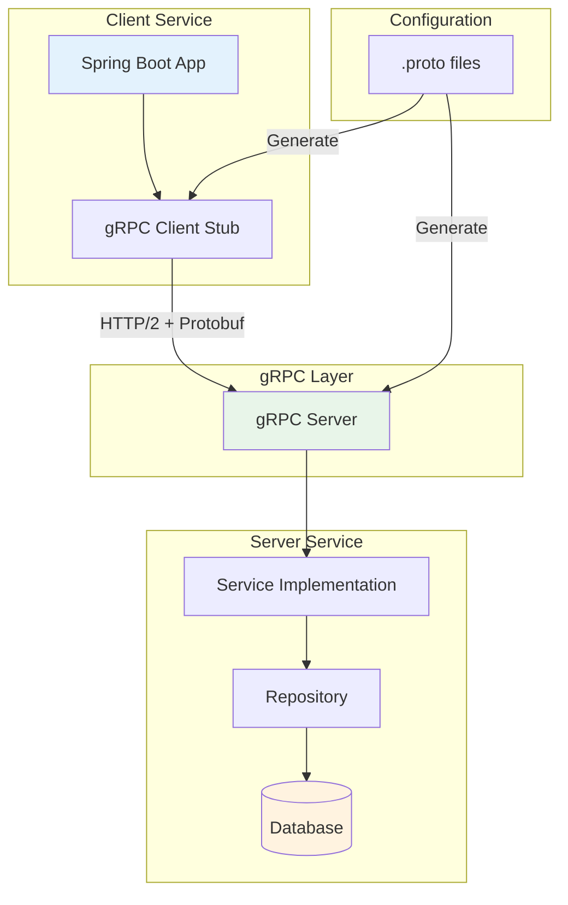

# How to Build gRPC Services in Spring Boot

Author: [nawazdhandala](https://www.github.com/nawazdhandala)

Tags: Java, Spring Boot, gRPC, Protocol Buffers, Microservices, API, Performance, RPC

Description: Learn how to build high-performance gRPC services in Spring Boot. This guide covers Protocol Buffer definitions, service implementation, client setup, error handling, and streaming patterns.

---

> REST is great for public APIs, but when you need high-performance communication between microservices, gRPC is hard to beat. It uses Protocol Buffers for efficient serialization and HTTP/2 for multiplexed connections. This guide shows you how to build gRPC services in Spring Boot.

gRPC (Google Remote Procedure Call) excels at internal service communication. It offers strong typing, code generation, and better performance than JSON-based REST APIs. Spring Boot has excellent gRPC support through community libraries.

---

## Project Setup

### Dependencies

Add the gRPC starter and build plugin to your `pom.xml`:

```xml
<!-- pom.xml -->
<properties>
    <grpc.version>1.60.0</grpc.version>
    <protobuf.version>3.25.0</protobuf.version>
</properties>

<dependencies>
    <!-- Spring Boot Starter -->
    <dependency>
        <groupId>org.springframework.boot</groupId>
        <artifactId>spring-boot-starter</artifactId>
    </dependency>

    <!-- gRPC Spring Boot Starter -->
    <dependency>
        <groupId>net.devh</groupId>
        <artifactId>grpc-spring-boot-starter</artifactId>
        <version>2.15.0.RELEASE</version>
    </dependency>

    <!-- gRPC Protocol Buffers -->
    <dependency>
        <groupId>io.grpc</groupId>
        <artifactId>grpc-protobuf</artifactId>
        <version>${grpc.version}</version>
    </dependency>

    <!-- gRPC Stub generation -->
    <dependency>
        <groupId>io.grpc</groupId>
        <artifactId>grpc-stub</artifactId>
        <version>${grpc.version}</version>
    </dependency>
</dependencies>

<build>
    <extensions>
        <!-- OS classifier for protoc -->
        <extension>
            <groupId>kr.motd.maven</groupId>
            <artifactId>os-maven-plugin</artifactId>
            <version>1.7.1</version>
        </extension>
    </extensions>
    <plugins>
        <!-- Protocol Buffer compiler plugin -->
        <plugin>
            <groupId>org.xolstice.maven.plugins</groupId>
            <artifactId>protobuf-maven-plugin</artifactId>
            <version>0.6.1</version>
            <configuration>
                <protocArtifact>
                    com.google.protobuf:protoc:${protobuf.version}:exe:${os.detected.classifier}
                </protocArtifact>
                <pluginId>grpc-java</pluginId>
                <pluginArtifact>
                    io.grpc:protoc-gen-grpc-java:${grpc.version}:exe:${os.detected.classifier}
                </pluginArtifact>
            </configuration>
            <executions>
                <execution>
                    <goals>
                        <goal>compile</goal>
                        <goal>compile-custom</goal>
                    </goals>
                </execution>
            </executions>
        </plugin>
    </plugins>
</build>
```

### Configuration

Configure the gRPC server in `application.yml`:

```yaml
# application.yml
grpc:
  server:
    port: 9090  # gRPC server port (separate from HTTP)
    security:
      enabled: false  # Enable TLS in production
  client:
    # Client configuration for calling other services
    user-service:
      address: static://localhost:9091
      negotiation-type: plaintext
```

---

## Protocol Buffer Definitions

Protocol Buffers define your service contract. Create a `.proto` file in `src/main/proto`:

```protobuf
// src/main/proto/user.proto
// Protocol Buffer definition for user service

syntax = "proto3";

package com.example.grpc;

// Java package for generated code
option java_package = "com.example.grpc.generated";
option java_outer_classname = "UserProto";
option java_multiple_files = true;

// User message - defines the user data structure
message User {
    string id = 1;           // Unique identifier
    string email = 2;        // Email address
    string name = 3;         // Display name
    int64 created_at = 4;    // Unix timestamp of creation
    UserStatus status = 5;   // Account status
}

// User status enum
enum UserStatus {
    UNKNOWN = 0;
    ACTIVE = 1;
    INACTIVE = 2;
    SUSPENDED = 3;
}

// Request to get a user by ID
message GetUserRequest {
    string user_id = 1;
}

// Request to create a new user
message CreateUserRequest {
    string email = 1;
    string name = 2;
}

// Response containing a user
message UserResponse {
    User user = 1;
}

// Request to list users with pagination
message ListUsersRequest {
    int32 page_size = 1;   // Number of users per page
    string page_token = 2;  // Token for pagination
}

// Response containing a list of users
message ListUsersResponse {
    repeated User users = 1;
    string next_page_token = 2;  // Token for next page, empty if last page
}

// The User service definition
service UserService {
    // Get a single user by ID
    rpc GetUser(GetUserRequest) returns (UserResponse);

    // Create a new user
    rpc CreateUser(CreateUserRequest) returns (UserResponse);

    // List users with pagination
    rpc ListUsers(ListUsersRequest) returns (ListUsersResponse);

    // Stream all users (server streaming)
    rpc StreamUsers(ListUsersRequest) returns (stream User);
}
```

Run `mvn compile` to generate the Java classes from the proto file.

---

## Implementing the gRPC Service

Create the service implementation using the generated base class:

```java
// UserGrpcService.java
// gRPC service implementation
package com.example.service;

import com.example.grpc.generated.*;
import io.grpc.Status;
import io.grpc.stub.StreamObserver;
import net.devh.boot.grpc.server.service.GrpcService;
import org.slf4j.Logger;
import org.slf4j.LoggerFactory;

import java.util.List;
import java.util.Optional;
import java.util.UUID;

@GrpcService  // Registers this as a gRPC service
public class UserGrpcService extends UserServiceGrpc.UserServiceImplBase {

    private static final Logger log = LoggerFactory.getLogger(UserGrpcService.class);

    private final UserRepository userRepository;

    public UserGrpcService(UserRepository userRepository) {
        this.userRepository = userRepository;
    }

    @Override
    public void getUser(GetUserRequest request, StreamObserver<UserResponse> responseObserver) {
        log.info("GetUser request for user_id: {}", request.getUserId());

        try {
            // Find the user in the repository
            Optional<UserEntity> userEntity = userRepository.findById(request.getUserId());

            if (userEntity.isPresent()) {
                // Convert entity to proto and send response
                User user = convertToProto(userEntity.get());
                UserResponse response = UserResponse.newBuilder()
                    .setUser(user)
                    .build();

                responseObserver.onNext(response);
                responseObserver.onCompleted();
            } else {
                // User not found - return NOT_FOUND status
                responseObserver.onError(
                    Status.NOT_FOUND
                        .withDescription("User not found: " + request.getUserId())
                        .asRuntimeException()
                );
            }

        } catch (Exception e) {
            log.error("Error getting user", e);
            responseObserver.onError(
                Status.INTERNAL
                    .withDescription("Internal error: " + e.getMessage())
                    .asRuntimeException()
            );
        }
    }

    @Override
    public void createUser(CreateUserRequest request, StreamObserver<UserResponse> responseObserver) {
        log.info("CreateUser request for email: {}", request.getEmail());

        try {
            // Validate the request
            if (request.getEmail().isEmpty()) {
                responseObserver.onError(
                    Status.INVALID_ARGUMENT
                        .withDescription("Email is required")
                        .asRuntimeException()
                );
                return;
            }

            // Check if email already exists
            if (userRepository.existsByEmail(request.getEmail())) {
                responseObserver.onError(
                    Status.ALREADY_EXISTS
                        .withDescription("User with this email already exists")
                        .asRuntimeException()
                );
                return;
            }

            // Create new user entity
            UserEntity entity = new UserEntity();
            entity.setId(UUID.randomUUID().toString());
            entity.setEmail(request.getEmail());
            entity.setName(request.getName());
            entity.setCreatedAt(System.currentTimeMillis());
            entity.setStatus(UserStatus.ACTIVE);

            // Save to repository
            userRepository.save(entity);

            // Return the created user
            User user = convertToProto(entity);
            UserResponse response = UserResponse.newBuilder()
                .setUser(user)
                .build();

            responseObserver.onNext(response);
            responseObserver.onCompleted();

        } catch (Exception e) {
            log.error("Error creating user", e);
            responseObserver.onError(
                Status.INTERNAL
                    .withDescription("Failed to create user: " + e.getMessage())
                    .asRuntimeException()
            );
        }
    }

    @Override
    public void listUsers(ListUsersRequest request, StreamObserver<ListUsersResponse> responseObserver) {
        log.info("ListUsers request with page_size: {}", request.getPageSize());

        try {
            int pageSize = request.getPageSize() > 0 ? request.getPageSize() : 10;
            String pageToken = request.getPageToken();

            // Fetch users from repository with pagination
            List<UserEntity> entities = userRepository.findAll(pageSize, pageToken);

            // Convert entities to protos
            ListUsersResponse.Builder responseBuilder = ListUsersResponse.newBuilder();
            for (UserEntity entity : entities) {
                responseBuilder.addUsers(convertToProto(entity));
            }

            // Set next page token if there are more results
            if (entities.size() == pageSize) {
                UserEntity lastEntity = entities.get(entities.size() - 1);
                responseBuilder.setNextPageToken(lastEntity.getId());
            }

            responseObserver.onNext(responseBuilder.build());
            responseObserver.onCompleted();

        } catch (Exception e) {
            log.error("Error listing users", e);
            responseObserver.onError(
                Status.INTERNAL
                    .withDescription("Failed to list users")
                    .asRuntimeException()
            );
        }
    }

    @Override
    public void streamUsers(ListUsersRequest request, StreamObserver<User> responseObserver) {
        log.info("StreamUsers request");

        try {
            // Stream all users one by one
            List<UserEntity> allUsers = userRepository.findAll();

            for (UserEntity entity : allUsers) {
                // Send each user as a separate message
                responseObserver.onNext(convertToProto(entity));
            }

            // Signal completion
            responseObserver.onCompleted();

        } catch (Exception e) {
            log.error("Error streaming users", e);
            responseObserver.onError(
                Status.INTERNAL
                    .withDescription("Failed to stream users")
                    .asRuntimeException()
            );
        }
    }

    // Helper method to convert entity to proto
    private User convertToProto(UserEntity entity) {
        return User.newBuilder()
            .setId(entity.getId())
            .setEmail(entity.getEmail())
            .setName(entity.getName())
            .setCreatedAt(entity.getCreatedAt())
            .setStatus(entity.getStatus())
            .build();
    }
}
```

---

## gRPC Client Implementation

To call gRPC services from another Spring Boot application:

```java
// UserServiceClient.java
// gRPC client for calling user service
package com.example.client;

import com.example.grpc.generated.*;
import io.grpc.StatusRuntimeException;
import net.devh.boot.grpc.client.inject.GrpcClient;
import org.slf4j.Logger;
import org.slf4j.LoggerFactory;
import org.springframework.stereotype.Service;

import java.util.Optional;

@Service
public class UserServiceClient {

    private static final Logger log = LoggerFactory.getLogger(UserServiceClient.class);

    // Inject the gRPC stub - name matches application.yml config
    @GrpcClient("user-service")
    private UserServiceGrpc.UserServiceBlockingStub userServiceStub;

    public Optional<User> getUser(String userId) {
        log.info("Calling getUser for: {}", userId);

        try {
            GetUserRequest request = GetUserRequest.newBuilder()
                .setUserId(userId)
                .build();

            UserResponse response = userServiceStub.getUser(request);
            return Optional.of(response.getUser());

        } catch (StatusRuntimeException e) {
            // Handle specific gRPC errors
            switch (e.getStatus().getCode()) {
                case NOT_FOUND:
                    log.warn("User not found: {}", userId);
                    return Optional.empty();
                case UNAVAILABLE:
                    log.error("User service unavailable", e);
                    throw new ServiceUnavailableException("User service is down");
                default:
                    log.error("gRPC error calling user service", e);
                    throw new RuntimeException("Failed to get user", e);
            }
        }
    }

    public User createUser(String email, String name) {
        log.info("Calling createUser for: {}", email);

        CreateUserRequest request = CreateUserRequest.newBuilder()
            .setEmail(email)
            .setName(name)
            .build();

        try {
            UserResponse response = userServiceStub.createUser(request);
            return response.getUser();
        } catch (StatusRuntimeException e) {
            if (e.getStatus().getCode() == io.grpc.Status.Code.ALREADY_EXISTS) {
                throw new UserAlreadyExistsException("User already exists: " + email);
            }
            throw new RuntimeException("Failed to create user", e);
        }
    }
}
```

---

## Error Handling

Use gRPC status codes to communicate errors clearly:

```java
// GrpcErrorHandler.java
// Centralized error handling for gRPC services
package com.example.config;

import io.grpc.*;
import net.devh.boot.grpc.server.interceptor.GrpcGlobalServerInterceptor;
import org.slf4j.Logger;
import org.slf4j.LoggerFactory;

@GrpcGlobalServerInterceptor
public class GrpcErrorHandler implements ServerInterceptor {

    private static final Logger log = LoggerFactory.getLogger(GrpcErrorHandler.class);

    @Override
    public <ReqT, RespT> ServerCall.Listener<ReqT> interceptCall(
            ServerCall<ReqT, RespT> call,
            Metadata headers,
            ServerCallHandler<ReqT, RespT> next) {

        ServerCall.Listener<ReqT> listener = next.startCall(call, headers);

        return new ForwardingServerCallListener.SimpleForwardingServerCallListener<ReqT>(listener) {

            @Override
            public void onHalfClose() {
                try {
                    super.onHalfClose();
                } catch (IllegalArgumentException e) {
                    // Convert validation errors to INVALID_ARGUMENT
                    log.warn("Validation error: {}", e.getMessage());
                    call.close(
                        Status.INVALID_ARGUMENT.withDescription(e.getMessage()),
                        new Metadata()
                    );
                } catch (NotFoundException e) {
                    // Convert not found errors to NOT_FOUND
                    log.warn("Resource not found: {}", e.getMessage());
                    call.close(
                        Status.NOT_FOUND.withDescription(e.getMessage()),
                        new Metadata()
                    );
                } catch (Exception e) {
                    // All other errors become INTERNAL
                    log.error("Unexpected error in gRPC call", e);
                    call.close(
                        Status.INTERNAL.withDescription("Internal server error"),
                        new Metadata()
                    );
                }
            }
        };
    }
}
```

---

## Service Architecture

The following diagram shows the gRPC service architecture:



---

## Streaming Patterns

gRPC supports four communication patterns:

### Server Streaming

The server sends multiple messages in response to a single request:

```java
// Server streaming - send multiple responses
@Override
public void streamUsers(ListUsersRequest request, StreamObserver<User> responseObserver) {
    // Stream users one at a time
    userRepository.streamAll().forEach(entity -> {
        responseObserver.onNext(convertToProto(entity));
    });
    responseObserver.onCompleted();
}
```

### Client Streaming

The client sends multiple messages, server responds once:

```java
// Client streaming - receive multiple requests
@Override
public StreamObserver<CreateUserRequest> batchCreateUsers(
        StreamObserver<BatchCreateResponse> responseObserver) {

    return new StreamObserver<CreateUserRequest>() {
        private int count = 0;

        @Override
        public void onNext(CreateUserRequest request) {
            // Process each user creation request
            createUser(request);
            count++;
        }

        @Override
        public void onError(Throwable t) {
            log.error("Error in batch create", t);
        }

        @Override
        public void onCompleted() {
            // Send final response with count
            responseObserver.onNext(
                BatchCreateResponse.newBuilder()
                    .setCreatedCount(count)
                    .build()
            );
            responseObserver.onCompleted();
        }
    };
}
```

---

## Best Practices

### 1. Use Meaningful Error Codes

```java
// Map domain errors to gRPC status codes
if (user == null) {
    throw Status.NOT_FOUND
        .withDescription("User not found")
        .asRuntimeException();
}

if (!isValidEmail(email)) {
    throw Status.INVALID_ARGUMENT
        .withDescription("Invalid email format")
        .asRuntimeException();
}
```

### 2. Add Deadlines

Always set deadlines on client calls to prevent hanging:

```java
// Set a 5 second deadline
UserResponse response = userServiceStub
    .withDeadlineAfter(5, TimeUnit.SECONDS)
    .getUser(request);
```

### 3. Use Interceptors for Cross-Cutting Concerns

```java
// Logging interceptor
@GrpcGlobalServerInterceptor
public class LoggingInterceptor implements ServerInterceptor {
    @Override
    public <ReqT, RespT> ServerCall.Listener<ReqT> interceptCall(
            ServerCall<ReqT, RespT> call,
            Metadata headers,
            ServerCallHandler<ReqT, RespT> next) {

        log.info("gRPC call: {}", call.getMethodDescriptor().getFullMethodName());
        return next.startCall(call, headers);
    }
}
```

### 4. Version Your Proto Files

Include version in package names for backward compatibility:

```protobuf
package com.example.grpc.v1;  // Version in package
```

---

## Conclusion

gRPC provides high-performance, strongly-typed communication between services. Key points:

- Define contracts with Protocol Buffers
- Use `@GrpcService` for server implementations
- Use `@GrpcClient` for client stubs
- Handle errors with appropriate status codes
- Set deadlines on all client calls
- Use streaming for large data sets

For internal microservice communication, gRPC offers significant advantages over REST in terms of performance and type safety.

---

*Want to monitor your gRPC services? [OneUptime](https://oneuptime.com) provides end-to-end visibility into gRPC latency, error rates, and service health.*

**Related Reading:**
- [How to Build Reactive HTTP Clients with WebClient in Spring](https://oneuptime.com/blog/post/2026-01-24-reactive-http-client-webclient-spring/view)
- [Traces and Spans in OpenTelemetry](https://oneuptime.com/blog/post/2025-08-27-traces-and-spans-in-opentelemetry/view)
