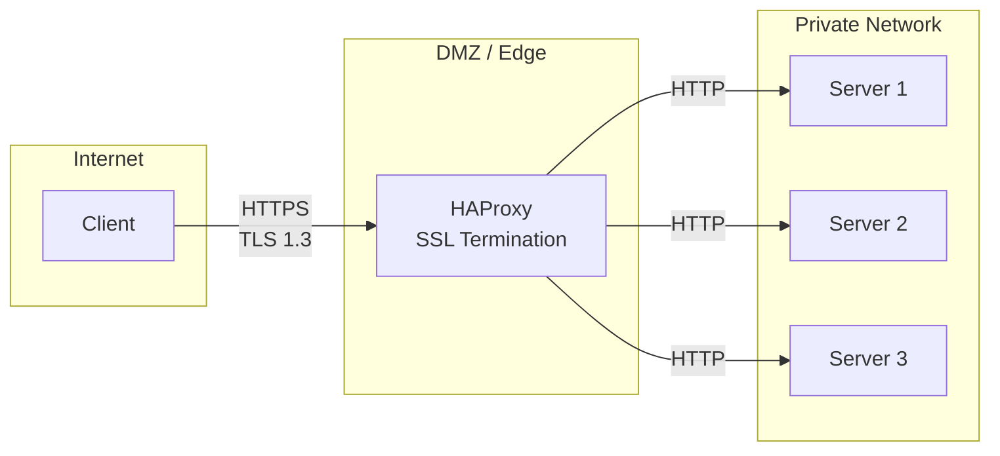
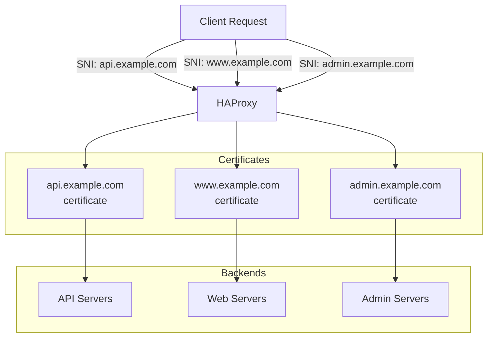
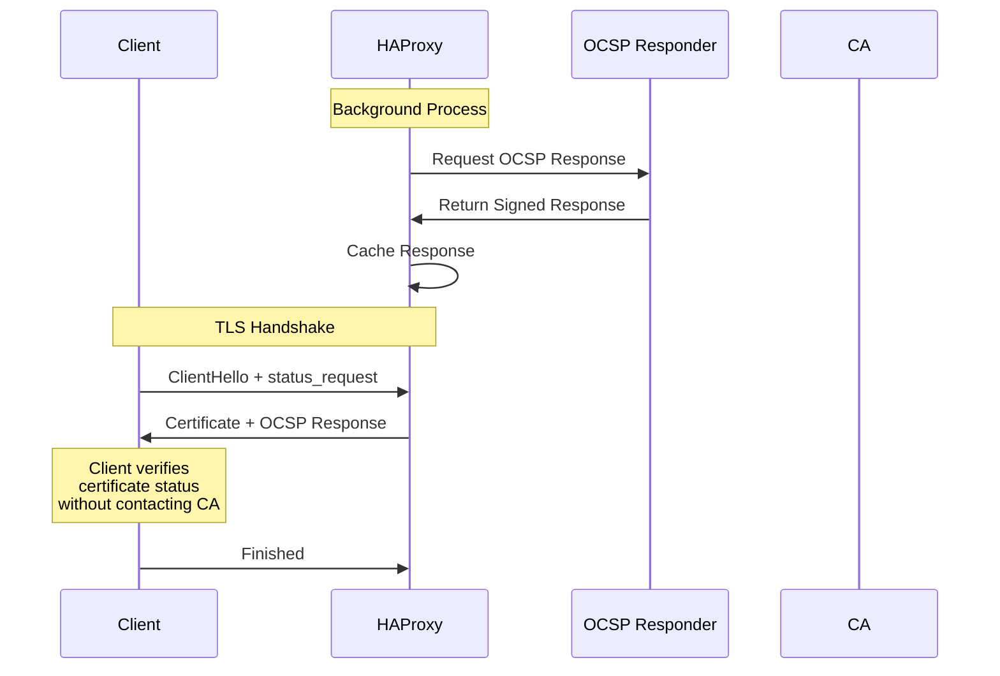
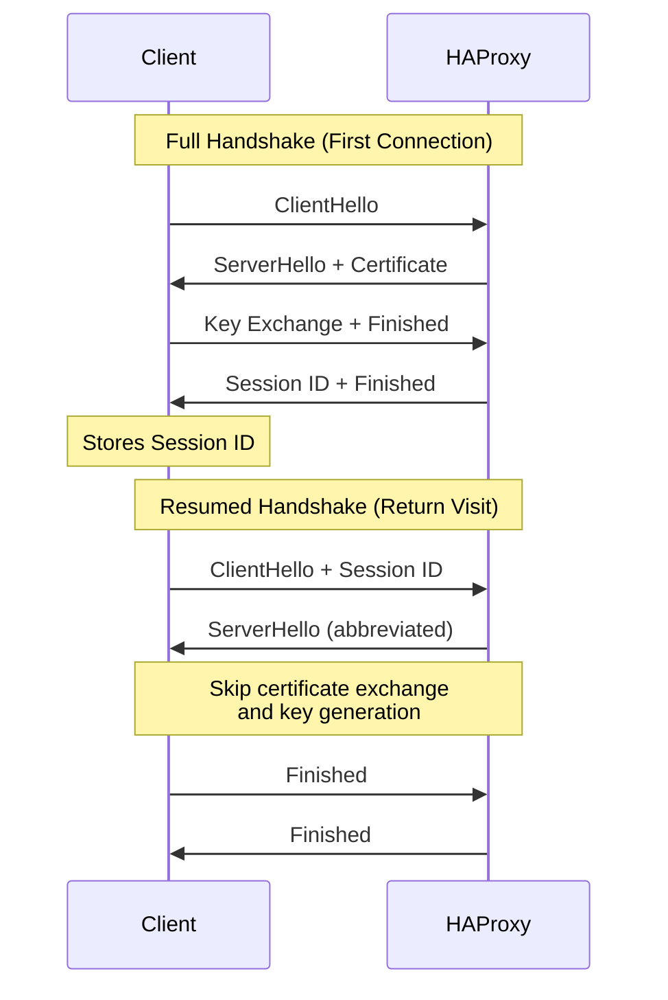
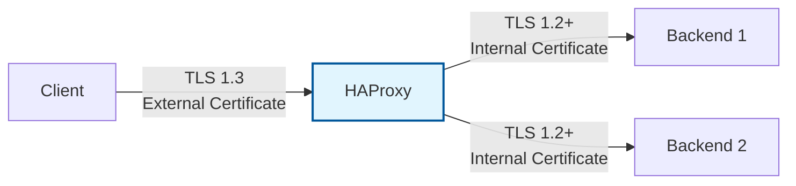

# How to Configure HAProxy SSL Termination

Author: [nawazdhandala](https://www.github.com/nawazdhandala)

Tags: HAProxy, SSL, TLS, Load Balancing, Security, DevOps, Networking, HTTPS

Description: A comprehensive guide to configuring SSL/TLS termination in HAProxy, including certificate management, SNI-based routing, OCSP stapling, and security best practices for production deployments.

---

> "The first step in securing network communications is to establish trust through proper certificate management." - Unknown

SSL termination (also known as SSL offloading) is the process of decrypting encrypted traffic at a load balancer before passing it to backend servers. This reduces the computational burden on your application servers and centralizes certificate management. HAProxy excels at this task, offering high-performance SSL termination with modern TLS features.

## Understanding SSL Termination

SSL termination occurs at the load balancer level, where encrypted client connections are decrypted, inspected, and optionally re-encrypted before being forwarded to backend servers.



### Why Terminate SSL at HAProxy?

- **Performance**: Offload CPU-intensive cryptographic operations from application servers
- **Centralized Management**: Single location for certificate updates and renewals
- **Inspection**: Ability to inspect and modify HTTP headers after decryption
- **Flexibility**: Apply different SSL policies per frontend or domain

## Basic SSL Certificate Configuration

### Preparing Your Certificate

HAProxy requires certificates in PEM format with the private key included. Combine your certificate, intermediate certificates, and private key into a single file.

```bash
# Combine certificate chain and private key into a single PEM file
# Order matters: certificate -> intermediate -> root -> private key
cat domain.crt intermediate.crt ca.crt domain.key > /etc/haproxy/certs/domain.pem

# Set proper permissions - HAProxy runs as haproxy user
# Private key must be protected from unauthorized access
chmod 600 /etc/haproxy/certs/domain.pem
chown haproxy:haproxy /etc/haproxy/certs/domain.pem

# Verify the certificate chain is valid
openssl verify -CAfile ca.crt -untrusted intermediate.crt domain.crt
```

### Basic SSL Frontend Configuration

```haproxy
# /etc/haproxy/haproxy.cfg
# Basic HAProxy configuration with SSL termination

global
    # Logging configuration - send logs to syslog
    log /dev/log local0
    log /dev/log local1 notice

    # Process management and security
    chroot /var/lib/haproxy
    user haproxy
    group haproxy
    daemon

    # SSL/TLS global settings
    # Use modern TLS defaults with secure cipher suites
    ssl-default-bind-ciphers ECDHE+AESGCM:DHE+AESGCM:ECDHE+CHACHA20:DHE+CHACHA20
    ssl-default-bind-ciphersuites TLS_AES_128_GCM_SHA256:TLS_AES_256_GCM_SHA384:TLS_CHACHA20_POLY1305_SHA256
    ssl-default-bind-options ssl-min-ver TLSv1.2 no-tls-tickets

    # DH parameters for DHE key exchange
    # Generate with: openssl dhparam -out dhparam.pem 2048
    ssl-dh-param-file /etc/haproxy/dhparam.pem

    # Maximum number of concurrent SSL connections
    maxsslconn 50000

    # Tune SSL memory usage and session caching
    tune.ssl.default-dh-param 2048
    tune.ssl.cachesize 100000
    tune.ssl.lifetime 300

defaults
    log global
    mode http
    option httplog
    option dontlognull

    # Timeouts - adjust based on your application needs
    timeout connect 5s
    timeout client 30s
    timeout server 30s
    timeout http-keep-alive 10s
    timeout http-request 10s

# HTTPS frontend with SSL termination
frontend https_frontend
    # Bind to port 443 with SSL certificate
    # The ssl keyword enables SSL termination
    # crt specifies the path to the PEM file
    bind *:443 ssl crt /etc/haproxy/certs/domain.pem

    # Set X-Forwarded headers so backends know the original request details
    http-request set-header X-Forwarded-Proto https
    http-request set-header X-Forwarded-Port 443
    http-request set-header X-Real-IP %[src]

    # Add HSTS header for security
    # max-age of 1 year, include subdomains, enable preloading
    http-response set-header Strict-Transport-Security "max-age=31536000; includeSubDomains; preload"

    # Route to backend servers
    default_backend web_servers

# HTTP frontend - redirect all traffic to HTTPS
frontend http_frontend
    bind *:80

    # Permanent redirect (301) from HTTP to HTTPS
    http-request redirect scheme https code 301 unless { ssl_fc }

backend web_servers
    balance roundrobin
    option httpchk GET /health

    # Backend servers receive unencrypted HTTP traffic
    server web1 192.168.1.10:8080 check
    server web2 192.168.1.11:8080 check
    server web3 192.168.1.12:8080 check
```

## SNI-Based Routing

Server Name Indication (SNI) allows HAProxy to serve multiple SSL certificates on a single IP address, routing traffic based on the requested hostname. This is essential for hosting multiple domains on the same infrastructure.



### Directory-Based Certificate Loading

HAProxy can automatically load all certificates from a directory and match them based on SNI.

```haproxy
# /etc/haproxy/haproxy.cfg
# SNI-based routing configuration for multiple domains

global
    log /dev/log local0
    chroot /var/lib/haproxy
    user haproxy
    group haproxy
    daemon

    # Modern SSL settings
    ssl-default-bind-ciphers ECDHE+AESGCM:DHE+AESGCM:ECDHE+CHACHA20
    ssl-default-bind-options ssl-min-ver TLSv1.2

defaults
    log global
    mode http
    option httplog
    timeout connect 5s
    timeout client 30s
    timeout server 30s

frontend https_frontend
    # Load all certificates from a directory
    # HAProxy automatically matches certificates based on SNI
    # Certificate files should be named to match their domains
    bind *:443 ssl crt /etc/haproxy/certs/

    # Define ACLs for routing based on the Host header
    # -i flag makes the comparison case-insensitive
    acl is_api hdr(host) -i api.example.com
    acl is_www hdr(host) -i www.example.com example.com
    acl is_admin hdr(host) -i admin.example.com

    # Route to appropriate backends based on hostname
    use_backend api_servers if is_api
    use_backend web_servers if is_www
    use_backend admin_servers if is_admin

    # Default backend for unmatched hosts
    default_backend web_servers

backend api_servers
    balance roundrobin
    option httpchk GET /health
    http-request set-header X-Forwarded-Proto https
    server api1 192.168.1.20:8080 check
    server api2 192.168.1.21:8080 check

backend web_servers
    balance roundrobin
    option httpchk GET /health
    http-request set-header X-Forwarded-Proto https
    server web1 192.168.1.10:8080 check
    server web2 192.168.1.11:8080 check

backend admin_servers
    balance roundrobin
    option httpchk GET /health
    http-request set-header X-Forwarded-Proto https
    # Restrict admin access to internal networks only
    http-request deny unless { src 10.0.0.0/8 192.168.0.0/16 }
    server admin1 192.168.1.30:8080 check
```

### Certificate Naming Convention

For automatic SNI matching, name your certificate files to match the domain they serve.

```bash
# Certificate file naming for automatic SNI matching
# HAProxy uses the Common Name (CN) or Subject Alternative Names (SAN)
# to match incoming SNI hostnames

/etc/haproxy/certs/
    api.example.com.pem     # Serves api.example.com
    www.example.com.pem     # Serves www.example.com
    example.com.pem         # Serves example.com
    admin.example.com.pem   # Serves admin.example.com
    wildcard.example.com.pem # Serves *.example.com (fallback)

# To verify which certificate will be served for a domain:
openssl s_client -connect localhost:443 -servername api.example.com < /dev/null 2>&1 | openssl x509 -noout -subject
```

## OCSP Stapling Configuration

Online Certificate Status Protocol (OCSP) stapling improves SSL handshake performance and user privacy. Instead of clients checking certificate revocation status with the CA, HAProxy fetches and caches this information, including it in the TLS handshake.



### Enabling OCSP Stapling in HAProxy

```haproxy
# /etc/haproxy/haproxy.cfg
# OCSP stapling configuration

global
    log /dev/log local0
    chroot /var/lib/haproxy
    user haproxy
    group haproxy
    daemon

    # SSL settings with OCSP stapling support
    ssl-default-bind-ciphers ECDHE+AESGCM:DHE+AESGCM:ECDHE+CHACHA20
    ssl-default-bind-options ssl-min-ver TLSv1.2

    # OCSP update timing configuration
    # maxdelay: maximum time between OCSP updates (default 3600s)
    # mindelay: minimum time between OCSP updates (prevents hammering)
    tune.ssl.ocsp-update.maxdelay 3600
    tune.ssl.ocsp-update.mindelay 300

defaults
    log global
    mode http
    option httplog
    timeout connect 5s
    timeout client 30s
    timeout server 30s

frontend https_frontend
    # Enable OCSP stapling with 'ocsp-update on'
    # The certificate file must include the issuer certificate for OCSP to work
    # HAProxy will automatically fetch OCSP responses in the background
    bind *:443 ssl crt /etc/haproxy/certs/domain.pem ocsp-update on

    default_backend web_servers

backend web_servers
    balance roundrobin
    server web1 192.168.1.10:8080 check
    server web2 192.168.1.11:8080 check
```

### Preparing Certificates for OCSP

```bash
#!/bin/bash
# Script to prepare certificate with OCSP support for HAProxy

DOMAIN="example.com"
CERT_DIR="/etc/haproxy/certs"

# Download issuer certificate (needed for OCSP verification)
# Replace with your CA's issuer certificate URL
wget -O ${CERT_DIR}/issuer.crt "https://your-ca.com/intermediate.crt"

# Combine in correct order for OCSP support:
# 1. Server certificate
# 2. Issuer/intermediate certificate (required for OCSP)
# 3. Private key
cat ${CERT_DIR}/${DOMAIN}.crt \
    ${CERT_DIR}/issuer.crt \
    ${CERT_DIR}/${DOMAIN}.key > ${CERT_DIR}/${DOMAIN}.pem

# Verify OCSP responder URL is present in the certificate
echo "OCSP Responder URL:"
openssl x509 -in ${CERT_DIR}/${DOMAIN}.crt -noout -ocsp_uri

# Test OCSP response manually to verify it works
echo "Testing OCSP response:"
openssl ocsp -issuer ${CERT_DIR}/issuer.crt \
    -cert ${CERT_DIR}/${DOMAIN}.crt \
    -url $(openssl x509 -in ${CERT_DIR}/${DOMAIN}.crt -noout -ocsp_uri) \
    -resp_text

# Set secure permissions
chmod 600 ${CERT_DIR}/${DOMAIN}.pem
chown haproxy:haproxy ${CERT_DIR}/${DOMAIN}.pem

echo "Certificate prepared for OCSP stapling"
```

### Verifying OCSP Stapling

```bash
# Test OCSP stapling with OpenSSL
# The output should show "OCSP Response Status: successful"
echo "Testing OCSP stapling..."
openssl s_client -connect example.com:443 \
    -servername example.com \
    -status < /dev/null 2>&1 | grep -A 20 "OCSP Response"

# Check HAProxy runtime for OCSP status via stats socket
echo "show ssl ocsp-response" | socat stdio /var/run/haproxy/admin.sock

# View OCSP response details for a specific certificate
echo "show ssl ocsp-response /etc/haproxy/certs/domain.pem" | \
    socat stdio /var/run/haproxy/admin.sock
```

## SSL/TLS Security Best Practices

### Modern TLS Configuration

A production-grade TLS configuration prioritizes security while maintaining compatibility with modern clients.

```haproxy
# /etc/haproxy/haproxy.cfg
# Production-grade SSL/TLS configuration

global
    log /dev/log local0
    chroot /var/lib/haproxy
    user haproxy
    group haproxy
    daemon

    # TLS 1.3 cipher suites (highest priority)
    # These are the only ciphers available in TLS 1.3
    ssl-default-bind-ciphersuites TLS_AES_256_GCM_SHA384:TLS_CHACHA20_POLY1305_SHA256:TLS_AES_128_GCM_SHA256

    # TLS 1.2 cipher suites (fallback for older clients)
    # Prioritize ECDHE for forward secrecy
    # Use AESGCM and CHACHA20 for authenticated encryption
    # Avoid CBC mode ciphers due to padding oracle vulnerabilities
    ssl-default-bind-ciphers ECDHE-ECDSA-AES256-GCM-SHA384:ECDHE-RSA-AES256-GCM-SHA384:ECDHE-ECDSA-CHACHA20-POLY1305:ECDHE-RSA-CHACHA20-POLY1305:ECDHE-ECDSA-AES128-GCM-SHA256:ECDHE-RSA-AES128-GCM-SHA256:DHE-RSA-AES256-GCM-SHA384:DHE-RSA-AES128-GCM-SHA256

    # Security options
    # ssl-min-ver TLSv1.2: Disable TLS 1.0 and 1.1 (insecure)
    # no-tls-tickets: Disable session tickets (for perfect forward secrecy)
    ssl-default-bind-options ssl-min-ver TLSv1.2 no-tls-tickets

    # For TLS 1.3 only environments (maximum security):
    # ssl-default-bind-options ssl-min-ver TLSv1.3

    # DH parameters for DHE key exchange
    # Generate strong parameters: openssl dhparam -out /etc/haproxy/dhparam.pem 4096
    ssl-dh-param-file /etc/haproxy/dhparam.pem

    # Performance tuning
    tune.ssl.default-dh-param 4096
    tune.ssl.cachesize 100000
    tune.ssl.lifetime 600
    tune.ssl.maxrecord 16384

defaults
    log global
    mode http
    option httplog
    option forwardfor
    timeout connect 5s
    timeout client 30s
    timeout server 30s
    timeout http-keep-alive 10s

frontend https_frontend
    # Enable HTTP/2 with ALPN negotiation
    # alpn h2,http/1.1 advertises HTTP/2 support to clients
    bind *:443 ssl crt /etc/haproxy/certs/ alpn h2,http/1.1 ocsp-update on

    # Security response headers
    # HSTS: Force HTTPS for 2 years, include subdomains, allow preloading
    http-response set-header Strict-Transport-Security "max-age=63072000; includeSubDomains; preload"
    # Prevent MIME type sniffing
    http-response set-header X-Content-Type-Options "nosniff"
    # Prevent clickjacking
    http-response set-header X-Frame-Options "DENY"
    # Enable XSS filter in browsers
    http-response set-header X-XSS-Protection "1; mode=block"
    # Control referrer information
    http-response set-header Referrer-Policy "strict-origin-when-cross-origin"

    # Log SSL details for debugging and monitoring
    http-request capture req.hdr(Host) len 64
    http-request set-header X-SSL-Protocol %[ssl_fc_protocol]
    http-request set-header X-SSL-Cipher %[ssl_fc_cipher]

    default_backend web_servers

# HTTP to HTTPS redirect with HSTS preload support
frontend http_frontend
    bind *:80
    # 301 permanent redirect to HTTPS
    http-request redirect scheme https code 301
```

### Generating Strong DH Parameters

```bash
# Generate 4096-bit DH parameters for DHE key exchange
# This process takes several minutes but only needs to be done once
echo "Generating DH parameters (this will take a few minutes)..."
openssl dhparam -out /etc/haproxy/dhparam.pem 4096

# Set proper permissions
chmod 600 /etc/haproxy/dhparam.pem
chown haproxy:haproxy /etc/haproxy/dhparam.pem

# Verify the DH parameters
openssl dhparam -in /etc/haproxy/dhparam.pem -check
```

### Client Certificate Authentication (mTLS)

Mutual TLS requires clients to present valid certificates, providing strong authentication for API services and internal communications.

```haproxy
# /etc/haproxy/haproxy.cfg
# Mutual TLS (mTLS) configuration

global
    log /dev/log local0
    chroot /var/lib/haproxy
    user haproxy
    group haproxy
    daemon

defaults
    log global
    mode http
    timeout connect 5s
    timeout client 30s
    timeout server 30s

frontend mtls_frontend
    # Configure mutual TLS authentication
    # ca-file: CA certificate used to verify client certificates
    # verify required: reject connections without valid client cert
    # crl-file: Certificate Revocation List (optional but recommended)
    bind *:443 ssl crt /etc/haproxy/certs/server.pem \
        ca-file /etc/haproxy/certs/ca.crt \
        verify required \
        crl-file /etc/haproxy/certs/crl.pem

    # Pass client certificate information to backend applications
    # ssl_c_s_dn: Subject Distinguished Name
    # ssl_c_verify: Verification result (0 = success)
    # ssl_c_serial: Certificate serial number
    http-request set-header X-SSL-Client-CN %{+Q}[ssl_c_s_dn(cn)]
    http-request set-header X-SSL-Client-DN %{+Q}[ssl_c_s_dn]
    http-request set-header X-SSL-Client-Verify %[ssl_c_verify]
    http-request set-header X-SSL-Client-Serial %[ssl_c_serial,hex]
    http-request set-header X-SSL-Client-NotBefore %[ssl_c_notbefore]
    http-request set-header X-SSL-Client-NotAfter %[ssl_c_notafter]

    # Optional: Restrict access to specific certificate subjects
    acl valid_client ssl_c_s_dn(cn) -m str "allowed-service"
    http-request deny unless valid_client

    default_backend secure_backend

backend secure_backend
    balance roundrobin
    server app1 192.168.1.10:8080 check
    server app2 192.168.1.11:8080 check
```

## SSL Session Resumption and Performance

### Session Caching Configuration

SSL session resumption dramatically reduces TLS handshake overhead for returning clients.



```haproxy
# /etc/haproxy/haproxy.cfg
# Optimized SSL session handling

global
    log /dev/log local0
    chroot /var/lib/haproxy
    user haproxy
    group haproxy
    daemon

    # SSL session cache configuration
    # cachesize: number of sessions to cache
    # Estimate: 1 session = ~200 bytes, 100000 sessions = ~20MB
    tune.ssl.cachesize 100000

    # Session lifetime in seconds
    # Longer lifetime = more cache hits, but less forward secrecy
    # 600 seconds (10 minutes) is a good balance
    tune.ssl.lifetime 600

    # For TLS 1.2: disable session tickets for better forward secrecy
    # TLS 1.3 handles this differently with PSK-based resumption
    ssl-default-bind-options ssl-min-ver TLSv1.2 no-tls-tickets

    # Multi-threading for high concurrency
    nbthread 4

defaults
    log global
    mode http
    timeout connect 5s
    timeout client 60s
    timeout server 60s
    timeout http-keep-alive 30s

frontend https_frontend
    # Enable HTTP/2 with ALPN for multiplexed connections
    # HTTP/2 allows multiple requests over a single TLS connection
    bind *:443 ssl crt /etc/haproxy/certs/domain.pem alpn h2,http/1.1

    default_backend web_servers

backend web_servers
    balance roundrobin
    # Enable connection reuse to backends
    http-reuse safe
    server web1 192.168.1.10:8080 check
    server web2 192.168.1.11:8080 check
```

## Re-Encryption to Backend (SSL Bridging)

When backends require encrypted connections, configure HAProxy to re-encrypt traffic after termination.



```haproxy
# /etc/haproxy/haproxy.cfg
# SSL termination with re-encryption to backends

global
    log /dev/log local0
    chroot /var/lib/haproxy
    user haproxy
    group haproxy
    daemon

defaults
    log global
    mode http
    timeout connect 5s
    timeout client 30s
    timeout server 30s

frontend https_frontend
    # Terminate SSL from clients
    bind *:443 ssl crt /etc/haproxy/certs/domain.pem
    default_backend secure_servers

backend secure_servers
    balance roundrobin

    # Re-encrypt traffic to backends
    # ssl: enable SSL for backend connections
    # verify required: verify backend certificate (recommended)
    # ca-file: CA certificate to verify backend certs
    # sni req.hdr(host): send original SNI to backend
    server web1 192.168.1.10:443 ssl \
        verify required \
        ca-file /etc/haproxy/certs/backend-ca.crt \
        sni req.hdr(host) \
        check check-ssl

    server web2 192.168.1.11:443 ssl \
        verify required \
        ca-file /etc/haproxy/certs/backend-ca.crt \
        sni req.hdr(host) \
        check check-ssl

    # Health checks over SSL
    option httpchk GET /health
    http-check expect status 200
```

## Let's Encrypt Integration

Automate certificate management with Let's Encrypt for free, trusted SSL certificates.

```bash
#!/bin/bash
# /etc/haproxy/scripts/renew-certs.sh
# Automated Let's Encrypt certificate renewal for HAProxy

set -e

DOMAIN="example.com"
HAPROXY_CERT_DIR="/etc/haproxy/certs"
LE_CERT_DIR="/etc/letsencrypt/live/${DOMAIN}"

# Method 1: Webroot mode (HAProxy serves ACME challenges)
# This is preferred as it requires no downtime
certbot renew --webroot -w /var/www/letsencrypt --quiet

# Method 2: Standalone mode (requires stopping HAProxy briefly)
# Use only if webroot mode is not possible
# systemctl stop haproxy
# certbot renew --standalone --quiet
# systemctl start haproxy

# Combine certificate for HAProxy
# Order: fullchain (cert + intermediate) + private key
cat ${LE_CERT_DIR}/fullchain.pem ${LE_CERT_DIR}/privkey.pem > ${HAPROXY_CERT_DIR}/${DOMAIN}.pem

# Set secure permissions
chmod 600 ${HAPROXY_CERT_DIR}/${DOMAIN}.pem
chown haproxy:haproxy ${HAPROXY_CERT_DIR}/${DOMAIN}.pem

# Reload HAProxy without downtime
systemctl reload haproxy

# Verify the reload was successful
if systemctl is-active --quiet haproxy; then
    echo "$(date): HAProxy reloaded successfully with new certificates" >> /var/log/cert-renewal.log
else
    echo "$(date): ERROR - HAProxy failed to reload" >> /var/log/cert-renewal.log
    exit 1
fi
```

### HAProxy Configuration for ACME Challenges

```haproxy
# /etc/haproxy/haproxy.cfg
# Support for Let's Encrypt ACME HTTP-01 challenge

frontend http_frontend
    bind *:80

    # Detect ACME challenge requests
    # These paths are used by Let's Encrypt for domain validation
    acl is_acme_challenge path_beg /.well-known/acme-challenge/

    # Serve ACME challenges from local directory
    use_backend acme_challenge if is_acme_challenge

    # Redirect everything else to HTTPS
    http-request redirect scheme https code 301 unless is_acme_challenge

backend acme_challenge
    # Serve challenge files from webroot
    # Run: python3 -m http.server 8080 --directory /var/www/letsencrypt
    # Or configure nginx/apache to serve this directory
    server localhost 127.0.0.1:8080
```

### Automated Renewal Cron Job

```bash
# Add to /etc/cron.d/certbot-haproxy
# Run renewal check twice daily (recommended by Let's Encrypt)
0 3,15 * * * root /etc/haproxy/scripts/renew-certs.sh
```

## Monitoring SSL/TLS with OneUptime

Proper monitoring ensures your SSL termination remains healthy and certificates stay valid. [OneUptime](https://oneuptime.com) provides comprehensive monitoring for SSL certificates and HAProxy health.

### HAProxy Statistics Endpoint

```haproxy
# /etc/haproxy/haproxy.cfg
# Enable statistics for monitoring

frontend stats
    bind *:8404
    mode http
    stats enable
    stats uri /stats
    stats refresh 10s
    stats auth admin:secure_password_here

    # Prometheus metrics endpoint for integration with monitoring systems
    http-request use-service prometheus-exporter if { path /metrics }
```

### Key Metrics to Monitor

| Metric | Description | Alert Threshold |
|--------|-------------|-----------------|
| Certificate Expiry | Days until certificate expires | < 30 days |
| SSL Handshake Errors | Failed TLS negotiations | > 1% of connections |
| OCSP Response Age | Freshness of OCSP staple | > 24 hours |
| Protocol Distribution | TLS 1.2 vs 1.3 usage | TLS 1.2 > 50% (review clients) |
| Cipher Usage | Which ciphers are negotiated | Weak ciphers detected |
| Session Cache Hit Rate | SSL session resumption rate | < 50% (tune cache size) |

```bash
# Query HAProxy stats socket for SSL metrics
echo "show info" | socat stdio /var/run/haproxy/admin.sock | grep -i ssl

# Check SSL session cache statistics
echo "show stat" | socat stdio /var/run/haproxy/admin.sock | grep -E "ssl_sess|ssl_reuse"

# View certificate expiration dates
echo "show ssl cert /etc/haproxy/certs/domain.pem" | socat stdio /var/run/haproxy/admin.sock
```

## Troubleshooting Common Issues

### Certificate Chain Problems

```bash
# Verify the complete certificate chain
openssl verify -CAfile /etc/haproxy/certs/ca-bundle.crt /etc/haproxy/certs/domain.pem

# Check certificate details and expiration
openssl x509 -in /etc/haproxy/certs/domain.pem -text -noout | head -20

# Test SSL connection and display certificate chain
openssl s_client -connect example.com:443 -servername example.com -showcerts

# Verify certificate and key match (modulus should be identical)
openssl x509 -noout -modulus -in domain.crt | md5sum
openssl rsa -noout -modulus -in domain.key | md5sum
```

### HAProxy SSL Debug Logging

```haproxy
# Enable detailed logging for SSL troubleshooting
global
    log /dev/log local0 debug

defaults
    log global
    option httplog

    # Custom log format including SSL details
    # %sslv: SSL version
    # %sslc: SSL cipher
    log-format "%ci:%cp [%tr] %ft %b/%s %TR/%Tw/%Tc/%Tr/%Ta %ST %B %CC %CS %tsc %ac/%fc/%bc/%sc/%rc %sq/%bq %hr %hs %{+Q}r ssl_fc=%[ssl_fc] ssl_fc_protocol=%[ssl_fc_protocol] ssl_fc_cipher=%[ssl_fc_cipher]"
```

### Common Error Messages and Solutions

| Error | Cause | Solution |
|-------|-------|----------|
| `SSL handshake failure` | Certificate/key mismatch | Verify cert and key match with modulus check |
| `unable to load certificate` | Wrong format or permissions | Check PEM format and file permissions (600) |
| `no shared cipher` | Cipher mismatch with client | Update cipher suites or check client compatibility |
| `certificate verify failed` | Invalid or incomplete chain | Include intermediate certificates in PEM file |
| `OCSP response not found` | Missing issuer certificate | Add issuer cert to PEM for OCSP support |

### Testing SSL Configuration

```bash
# Comprehensive SSL test script
#!/bin/bash

DOMAIN=$1
PORT=${2:-443}

echo "=== SSL Configuration Test for ${DOMAIN}:${PORT} ==="

# Test basic connectivity
echo -e "\n--- Basic Connectivity ---"
openssl s_client -connect ${DOMAIN}:${PORT} -servername ${DOMAIN} < /dev/null 2>&1 | \
    grep -E "(SSL-Session|Protocol|Cipher|Server certificate)"

# Check supported protocols
echo -e "\n--- Protocol Support ---"
for proto in tls1 tls1_1 tls1_2 tls1_3; do
    result=$(openssl s_client -connect ${DOMAIN}:${PORT} -servername ${DOMAIN} -${proto} < /dev/null 2>&1)
    if echo "$result" | grep -q "Protocol.*TLS"; then
        echo "${proto}: SUPPORTED"
    else
        echo "${proto}: not supported"
    fi
done

# Check OCSP stapling
echo -e "\n--- OCSP Stapling ---"
openssl s_client -connect ${DOMAIN}:${PORT} -servername ${DOMAIN} -status < /dev/null 2>&1 | \
    grep -A 5 "OCSP Response"

# Check certificate expiration
echo -e "\n--- Certificate Expiration ---"
openssl s_client -connect ${DOMAIN}:${PORT} -servername ${DOMAIN} < /dev/null 2>&1 | \
    openssl x509 -noout -dates

# Verify HAProxy config syntax
echo -e "\n--- HAProxy Config Validation ---"
haproxy -c -f /etc/haproxy/haproxy.cfg
```

---

SSL termination in HAProxy is a powerful way to centralize your TLS management while maintaining high performance. By following these best practices - using strong ciphers, enabling OCSP stapling, implementing proper certificate management, and monitoring your setup - you can ensure secure, efficient HTTPS for your applications.

Remember to regularly audit your SSL configuration using tools like [SSL Labs](https://www.ssllabs.com/ssltest/) and keep your HAProxy version updated for the latest security patches. For comprehensive monitoring of your HAProxy instances and SSL certificate health, consider using [OneUptime](https://oneuptime.com) to catch issues before they impact your users.
