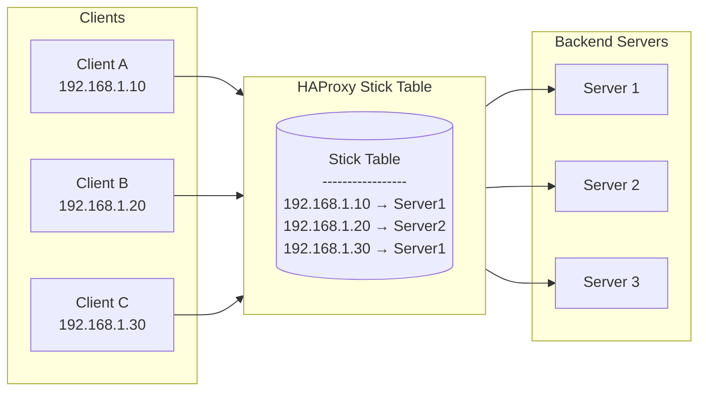
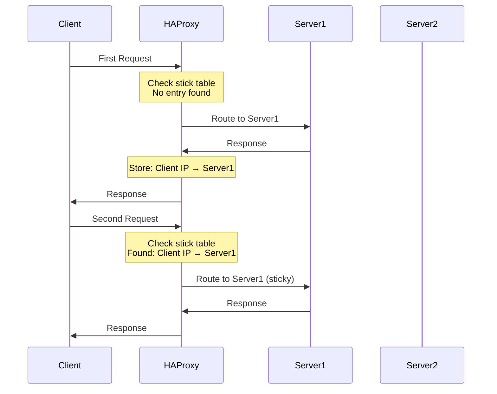
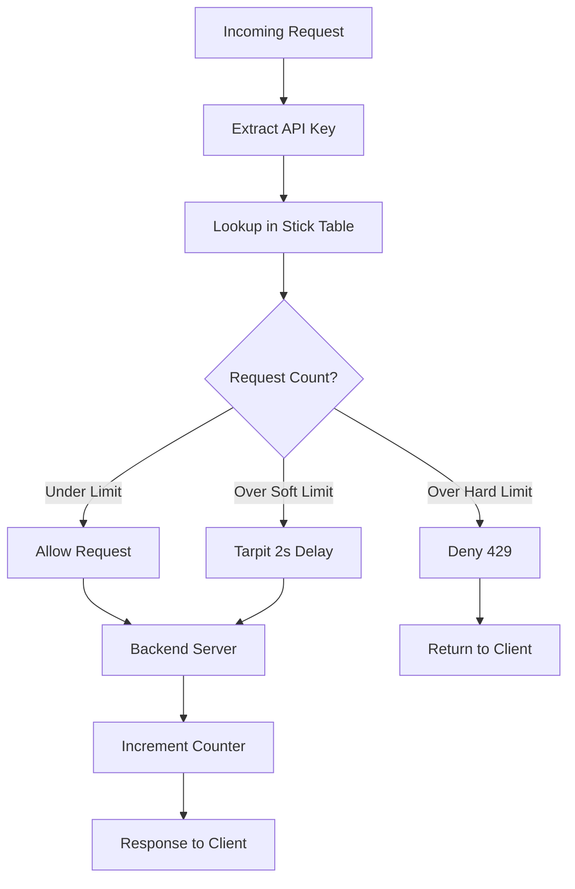
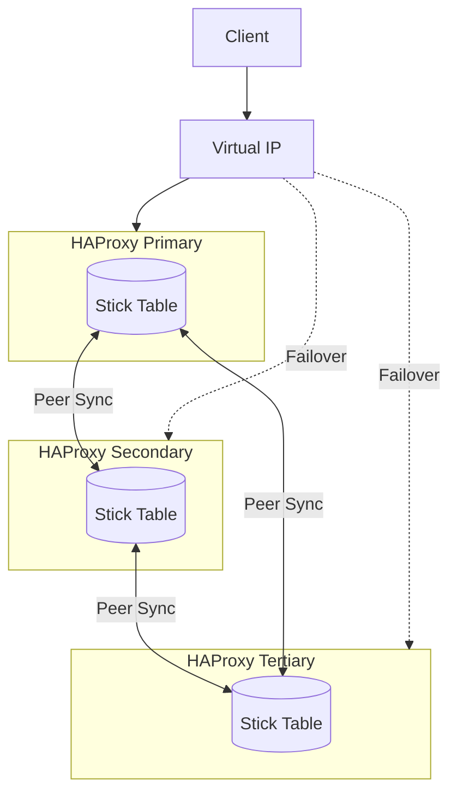

# How to Configure HAProxy Stick Tables

By [Nawaz Dhandala](https://github.com/nawazdhandala)

Tags: HAProxy, Load Balancing, Session Persistence, Rate Limiting, High Availability, DevOps, Networking

Description: A comprehensive guide to configuring HAProxy stick tables for session persistence, rate limiting, and connection tracking. Learn how to implement stateful load balancing with peer replication for high availability.

---

> "The best load balancer is the one that remembers its users." - Anonymous SRE

Stick tables are one of HAProxy's most powerful features. They allow you to track and store information about connections, sessions, and requests in memory. This enables sophisticated features like session persistence (sticky sessions), rate limiting, abuse detection, and connection tracking - all without external dependencies.

## Understanding Stick Tables

A stick table is an in-memory key-value store that HAProxy uses to track various metrics about connections and requests. Each entry in the table is indexed by a key (like client IP, session cookie, or URL) and can store multiple data types.



### Basic Stick Table Syntax

```haproxy
# Basic stick table configuration
# Define a table that tracks client IPs with a 30-minute expiry
backend my_backend
    # Create stick table: type=ip, size=100k entries, expire after 30m
    stick-table type ip size 100k expire 30m

    # Store the server assignment based on source IP
    stick on src

    # Backend servers
    server server1 10.0.0.1:8080 check
    server server2 10.0.0.2:8080 check
    server server3 10.0.0.3:8080 check
```

## Stick Table Types

HAProxy supports several key types for stick tables. Choose based on what you want to track.

### IP-Based Tracking

```haproxy
# Track by client IP address (IPv4)
# Use case: Simple session persistence by source IP
backend web_backend
    stick-table type ip size 100k expire 30m
    stick on src

    server web1 10.0.0.1:80 check
    server web2 10.0.0.2:80 check
```

### IPv6 Tracking

```haproxy
# Track by IPv6 address
# Use case: Session persistence for IPv6 clients
backend ipv6_backend
    stick-table type ipv6 size 100k expire 30m
    stick on src

    server web1 [2001:db8::1]:80 check
    server web2 [2001:db8::2]:80 check
```

### String-Based Tracking

```haproxy
# Track by arbitrary string (session ID, username, etc.)
# Use case: Session persistence by cookie or header value
backend api_backend
    # String type with max length of 64 characters
    stick-table type string len 64 size 100k expire 1h

    # Stick on session cookie value
    stick on req.cook(SESSIONID)
    stick store-request req.cook(SESSIONID)

    server api1 10.0.0.1:8080 check
    server api2 10.0.0.2:8080 check
```

### Integer-Based Tracking

```haproxy
# Track by integer value
# Use case: User ID-based routing
backend user_backend
    stick-table type integer size 50k expire 2h

    # Extract user_id from URL query parameter
    stick on url_param(user_id)

    server app1 10.0.0.1:8080 check
    server app2 10.0.0.2:8080 check
```

### Binary Tracking

```haproxy
# Track by binary data (useful for hashes)
# Use case: Complex key combinations
backend binary_backend
    stick-table type binary len 20 size 100k expire 30m

    server srv1 10.0.0.1:8080 check
    server srv2 10.0.0.2:8080 check
```

## Session Persistence (Sticky Sessions)

Session persistence ensures that a client's requests consistently go to the same backend server. This is critical for stateful applications.



### Cookie-Based Session Persistence

```haproxy
# Session persistence using application session cookie
# This is the most reliable method for web applications
frontend http_front
    bind *:80
    default_backend web_servers

backend web_servers
    balance roundrobin

    # Create stick table keyed by session cookie
    stick-table type string len 64 size 100k expire 30m

    # Look up existing entry on request
    stick match req.cook(JSESSIONID)

    # Store new entry from response cookie
    stick store-response res.cook(JSESSIONID)

    # Enable cookie-based server identification as backup
    cookie SERVERID insert indirect nocache

    server web1 10.0.0.1:8080 check cookie s1
    server web2 10.0.0.2:8080 check cookie s2
    server web3 10.0.0.3:8080 check cookie s3
```

### Source IP Persistence with Fallback

```haproxy
# Sticky sessions by source IP with cookie fallback
# Handles NAT scenarios where multiple users share an IP
frontend http_front
    bind *:80
    default_backend web_servers

backend web_servers
    balance roundrobin

    # Primary stick table: by source IP
    stick-table type ip size 100k expire 30m
    stick on src

    # Cookie as backup for shared IP scenarios
    cookie SERVERID insert indirect nocache httponly secure

    server web1 10.0.0.1:8080 check cookie s1
    server web2 10.0.0.2:8080 check cookie s2
```

### Header-Based Persistence

```haproxy
# Stick sessions based on custom header (e.g., X-Tenant-ID)
# Use case: Multi-tenant applications
backend multi_tenant
    balance roundrobin

    stick-table type string len 32 size 50k expire 1h

    # Stick based on tenant ID header
    stick on req.hdr(X-Tenant-ID)

    server tenant1 10.0.0.1:8080 check
    server tenant2 10.0.0.2:8080 check
```

## Rate Limiting with Stick Tables

Stick tables excel at rate limiting because they can track request counts, connection rates, and data transfer rates per client.

### Available Counters

| Counter | Description |
|---------|-------------|
| `conn_cnt` | Total connection count |
| `conn_cur` | Current connections |
| `conn_rate(<period>)` | Connection rate over period |
| `http_req_cnt` | Total HTTP request count |
| `http_req_rate(<period>)` | HTTP request rate over period |
| `http_err_cnt` | HTTP error count |
| `http_err_rate(<period>)` | HTTP error rate over period |
| `bytes_in_cnt` | Total bytes received |
| `bytes_in_rate(<period>)` | Bytes received rate |
| `bytes_out_cnt` | Total bytes sent |
| `bytes_out_rate(<period>)` | Bytes sent rate |
| `gpc0` | General purpose counter 0 |
| `gpc0_rate(<period>)` | General purpose counter 0 rate |

### Basic Request Rate Limiting

```haproxy
# Rate limit: Max 100 requests per 10 seconds per IP
frontend http_front
    bind *:80

    # Define stick table with request rate tracking
    stick-table type ip size 100k expire 30s store http_req_rate(10s)

    # Track client requests
    http-request track-sc0 src

    # Deny if request rate exceeds 100 per 10 seconds
    http-request deny deny_status 429 if { sc_http_req_rate(0) gt 100 }

    default_backend web_servers

backend web_servers
    server web1 10.0.0.1:8080 check
    server web2 10.0.0.2:8080 check
```

### Connection Rate Limiting

```haproxy
# Limit new connections: Max 20 new connections per second per IP
frontend http_front
    bind *:80

    # Track connection rate
    stick-table type ip size 100k expire 30s store conn_rate(1s),conn_cur

    # Track source IP
    tcp-request connection track-sc0 src

    # Reject if connection rate too high
    tcp-request connection reject if { sc_conn_rate(0) gt 20 }

    # Also limit concurrent connections
    tcp-request connection reject if { sc_conn_cur(0) gt 50 }

    default_backend web_servers
```

### Tiered Rate Limiting

```haproxy
# Implement tiered rate limiting with different thresholds
frontend http_front
    bind *:80

    # Main rate limiting table
    stick-table type ip size 100k expire 1m store http_req_rate(10s),http_err_rate(10s),conn_rate(1s)

    http-request track-sc0 src

    # Tier 1: Soft limit - add delay (tarpit)
    # If > 50 requests/10s, add 2 second delay
    http-request tarpit deny_status 429 if { sc_http_req_rate(0) gt 50 } { sc_http_req_rate(0) le 100 }

    # Tier 2: Hard limit - deny request
    # If > 100 requests/10s, deny completely
    http-request deny deny_status 429 if { sc_http_req_rate(0) gt 100 }

    # Tier 3: Ban based on error rate
    # If generating > 20 errors/10s, deny
    http-request deny deny_status 403 if { sc_http_err_rate(0) gt 20 }

    default_backend web_servers
```

### API Rate Limiting by Key

```haproxy
# Rate limit API requests by API key
frontend api_front
    bind *:443 ssl crt /etc/ssl/certs/api.pem

    # Rate limit table keyed by API key header
    stick-table type string len 64 size 50k expire 1m store http_req_rate(1m)

    # Track by API key
    http-request track-sc0 req.hdr(X-API-Key)

    # Different limits based on plan (using map file)
    # Premium keys (starting with 'prm_') get 1000 req/min
    http-request deny deny_status 429 if { req.hdr(X-API-Key) -m beg prm_ } { sc_http_req_rate(0) gt 1000 }

    # Standard keys get 100 req/min
    http-request deny deny_status 429 if { req.hdr(X-API-Key) -m beg std_ } { sc_http_req_rate(0) gt 100 }

    # Default: 10 req/min
    http-request deny deny_status 429 if { sc_http_req_rate(0) gt 10 }

    default_backend api_servers
```



## Abuse Detection and Blocking

Stick tables can identify and block malicious behavior patterns.

### Detecting and Blocking Abusers

```haproxy
# Detect and block suspicious behavior
frontend http_front
    bind *:80

    # Track multiple metrics for abuse detection
    stick-table type ip size 100k expire 10m store http_req_rate(10s),http_err_rate(10s),gpc0,gpc0_rate(1m)

    http-request track-sc0 src

    # Mark as abuser (set gpc0) if error rate is high
    # gpc0 acts as an "abuse score"
    http-request sc-inc-gpc0(0) if { sc_http_err_rate(0) gt 10 }

    # Block if abuse score is high
    http-request deny deny_status 403 if { sc_get_gpc0(0) gt 5 }

    # Log abuse attempts
    http-request set-log-level warning if { sc_get_gpc0(0) gt 0 }

    default_backend web_servers
```

### Blocking Bad Bots and Crawlers

```haproxy
# Identify and throttle aggressive bots
frontend http_front
    bind *:80

    stick-table type ip size 200k expire 5m store http_req_rate(1s),http_req_rate(1m)

    http-request track-sc0 src

    # Aggressive rate: > 10 requests per second = bot
    http-request tarpit if { sc_http_req_rate(0) gt 10 }

    # Known bad bot user agents - immediate deny
    http-request deny if { req.hdr(User-Agent) -m sub -i "BadBot" }
    http-request deny if { req.hdr(User-Agent) -m sub -i "scanner" }

    # Missing user agent + high rate = suspicious
    http-request deny deny_status 403 if !{ req.hdr(User-Agent) -m found } { sc_http_req_rate(0) gt 5 }

    default_backend web_servers
```

## Replication Between Peers

For high availability, HAProxy can replicate stick table entries between peers. This ensures session persistence survives failover.



### Configuring Peers

```haproxy
# Peer configuration for stick table replication
# This goes in your main haproxy.cfg

# Define the peer group
peers haproxy_peers
    # Define each HAProxy instance in the cluster
    # Format: peer <name> <ip>:<port>
    peer haproxy1 10.0.1.1:1024
    peer haproxy2 10.0.1.2:1024
    peer haproxy3 10.0.1.3:1024

# Frontend configuration
frontend http_front
    bind *:80
    default_backend web_servers

# Backend with replicated stick table
backend web_servers
    balance roundrobin

    # Stick table with peer replication
    # The 'peers' keyword links to the peers section
    stick-table type ip size 100k expire 30m peers haproxy_peers

    stick on src

    server web1 10.0.0.1:8080 check
    server web2 10.0.0.2:8080 check
    server web3 10.0.0.3:8080 check
```

### Complete HA Configuration

```haproxy
# Complete HAProxy configuration with peer replication
# File: /etc/haproxy/haproxy.cfg

global
    log /dev/log local0
    chroot /var/lib/haproxy
    stats socket /run/haproxy/admin.sock mode 660 level admin
    stats timeout 30s
    user haproxy
    group haproxy
    daemon

defaults
    log     global
    mode    http
    option  httplog
    option  dontlognull
    timeout connect 5000ms
    timeout client  50000ms
    timeout server  50000ms

# Peer configuration - each node needs this
peers mycluster
    # Bind address for peer communication
    bind *:1024

    # List all peers (including self)
    # The local peer must match the hostname
    peer haproxy-node-1 10.0.1.1:1024
    peer haproxy-node-2 10.0.1.2:1024
    peer haproxy-node-3 10.0.1.3:1024

# Shared rate limiting table (replicated)
backend rate_limit_table
    stick-table type ip size 200k expire 5m store http_req_rate(10s),conn_rate(1s) peers mycluster

frontend http_front
    bind *:80

    # Reference the shared rate limiting table
    http-request track-sc0 src table rate_limit_table
    http-request deny deny_status 429 if { sc_http_req_rate(0,rate_limit_table) gt 100 }

    default_backend web_servers

backend web_servers
    balance roundrobin

    # Session persistence table (replicated)
    stick-table type ip size 100k expire 30m peers mycluster
    stick on src

    server web1 10.0.0.1:8080 check
    server web2 10.0.0.2:8080 check
    server web3 10.0.0.3:8080 check
```

### Peer Sync Monitoring

```haproxy
# Enable stats page to monitor peer sync status
frontend stats
    bind *:8404
    stats enable
    stats uri /stats
    stats refresh 10s
    stats admin if LOCALHOST

    # Shows peer connection status and table sync state
```

## Monitoring Stick Tables

### Using the Stats Socket

```bash
# Connect to HAProxy stats socket
echo "show table web_servers" | socat stdio /run/haproxy/admin.sock

# Output example:
# # table: web_servers, type: ip, size:102400, used:3
# 0x55a8c0: key=192.168.1.10 use=0 exp=1723 server_id=1
# 0x55a8d0: key=192.168.1.20 use=0 exp=1456 server_id=2
# 0x55a8e0: key=192.168.1.30 use=0 exp=892 server_id=1

# Show rate limiting table with counters
echo "show table rate_limit_table" | socat stdio /run/haproxy/admin.sock

# Clear a specific entry
echo "clear table web_servers key 192.168.1.10" | socat stdio /run/haproxy/admin.sock

# Clear all entries
echo "clear table web_servers" | socat stdio /run/haproxy/admin.sock
```

### Exposing Metrics for Prometheus

```haproxy
# Enable Prometheus metrics endpoint
frontend stats
    bind *:8405
    http-request use-service prometheus-exporter if { path /metrics }
```

```yaml
# Prometheus scrape config
scrape_configs:
  - job_name: 'haproxy'
    static_configs:
      - targets: ['haproxy1:8405', 'haproxy2:8405', 'haproxy3:8405']
```

## Best Practices

### Memory Sizing

```haproxy
# Calculate memory requirements:
# - IP table entry: ~50 bytes base + counters
# - String table entry: ~50 bytes base + string length + counters
#
# Example: 100k IP entries with 3 counters ≈ 10MB

backend web_servers
    # Size based on expected unique clients
    # Allow 20% headroom for spikes
    stick-table type ip size 120k expire 30m store http_req_rate(10s),conn_rate(1s),conn_cur
```

### Expire Times

```haproxy
# Choose expire times based on use case:
# - Session persistence: Match session timeout (30m - 2h)
# - Rate limiting: Short (10s - 5m)
# - Abuse tracking: Longer (10m - 1h)

# Session persistence
stick-table type ip size 100k expire 30m

# Rate limiting (short memory)
stick-table type ip size 200k expire 30s store http_req_rate(10s)

# Abuse tracking (longer memory)
stick-table type ip size 50k expire 1h store gpc0,http_err_cnt
```

### Multiple Tables

```haproxy
# Use separate tables for different purposes
frontend http_front
    bind *:80

    # Table 1: Rate limiting (high volume, short expire)
    http-request track-sc0 src table rate_limits

    # Table 2: Abuse tracking (lower volume, longer expire)
    http-request track-sc1 src table abuse_tracking

    # Apply rate limit
    http-request deny deny_status 429 if { sc_http_req_rate(0,rate_limits) gt 100 }

    # Apply abuse block
    http-request deny deny_status 403 if { sc_get_gpc0(1,abuse_tracking) gt 10 }

    default_backend web_servers

backend rate_limits
    stick-table type ip size 200k expire 30s store http_req_rate(10s)

backend abuse_tracking
    stick-table type ip size 50k expire 1h store gpc0,http_err_cnt
```

## Troubleshooting

### Common Issues

**Stick table not persisting sessions:**
```bash
# Check if table has entries
echo "show table backend_name" | socat stdio /run/haproxy/admin.sock

# Verify stick rule matches
# Enable detailed logging
frontend http_front
    log-format "%ci:%cp [%tr] %ft %b/%s %ST %B %{+Q}r stick_match:%[sc0_tracked]"
```

**Peer sync not working:**
```bash
# Check peer connectivity
echo "show peers" | socat stdio /run/haproxy/admin.sock

# Verify firewall allows peer port (default 1024)
nc -zv peer_ip 1024

# Check for hostname resolution issues
# Peer names must match hostnames exactly
```

**Memory issues with large tables:**
```bash
# Monitor table usage
echo "show table all" | socat stdio /run/haproxy/admin.sock | grep "used:"

# Reduce table size or expire time if needed
```

## Monitoring HAProxy with OneUptime

To ensure your HAProxy load balancers are performing optimally, monitor them with [OneUptime](https://oneuptime.com). Set up:

- **Uptime monitoring** for your HAProxy frontends
- **Custom metrics** for stick table utilization and peer sync status
- **Alerts** when rate limiting triggers spike abnormally
- **Dashboards** visualizing request distribution across backends

With proper monitoring, you can catch issues before they impact users - whether it is a stick table filling up, peer replication lag, or an unexpected surge in rate-limited requests.

---

Stick tables transform HAProxy from a simple load balancer into an intelligent traffic management system. Start with basic session persistence, add rate limiting as needed, and implement peer replication for high availability. The key is matching your stick table configuration to your specific traffic patterns and application requirements.
