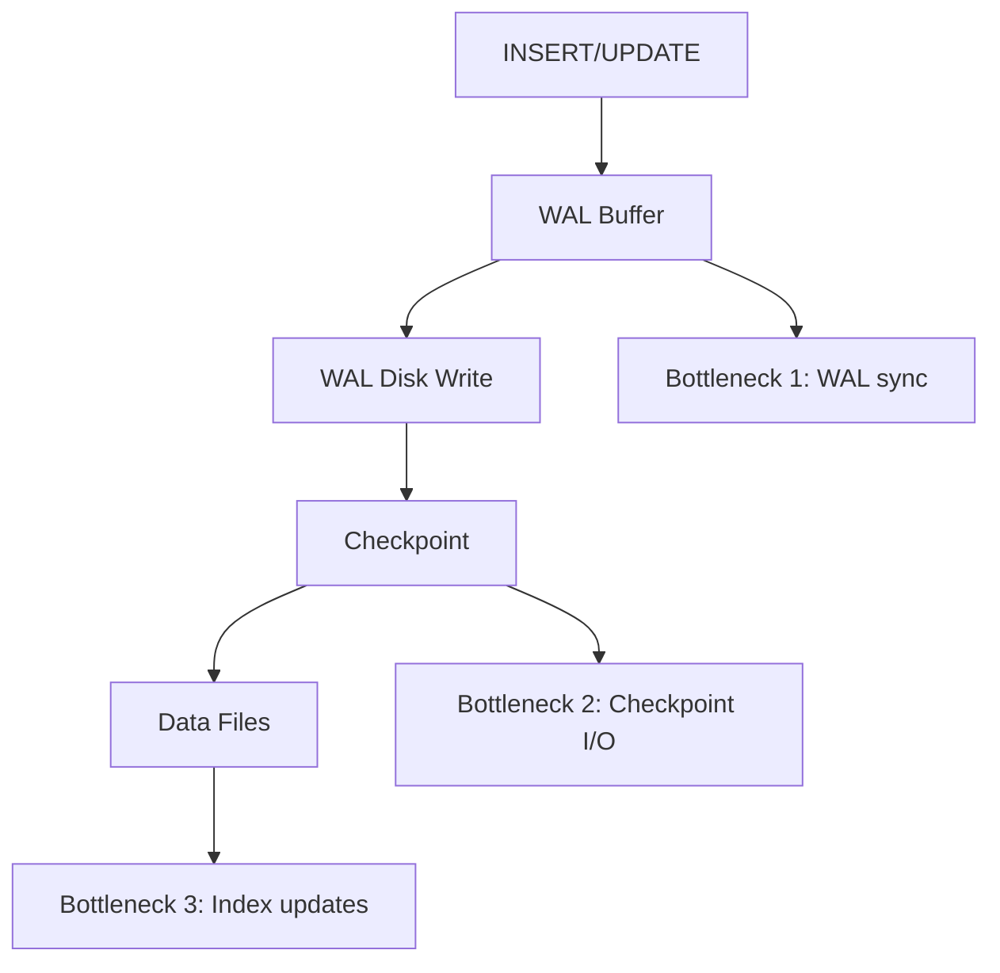

# How to Tune PostgreSQL for High Write Throughput

Author: [nawazdhandala](https://www.github.com/nawazdhandala)

Tags: PostgreSQL, Performance Tuning, Write Throughput, WAL, Database Optimization, High Performance

Description: Learn how to tune PostgreSQL for high write throughput workloads. This guide covers WAL configuration, checkpoint tuning, index strategies, and system-level optimizations for write-heavy applications.

---

> PostgreSQL defaults are conservative, designed to work on modest hardware with mixed workloads. If your application is write-heavy, logging millions of events, processing transactions, or ingesting time-series data, those defaults leave performance on the table. This guide shows you how to tune PostgreSQL for maximum write throughput.

---

## Understanding Write Path Bottlenecks

Before tuning, understand where writes can slow down:



1. **WAL synchronization**: Every commit waits for WAL to hit disk
2. **Checkpoint I/O**: Periodic flushes of dirty buffers
3. **Index maintenance**: Each index slows down writes

---

## WAL Configuration

### Increase WAL Buffers

```sql
-- Check current setting
SHOW wal_buffers;  -- Default: -1 (auto, usually 16MB)

-- Set in postgresql.conf
wal_buffers = 64MB  -- Increase for high write volume
```

### Tune synchronous_commit

```sql
-- Full durability (default) - safest, slowest
synchronous_commit = on

-- Async WAL write - faster, risk of losing last few transactions on crash
synchronous_commit = off

-- Write to OS buffer, don't wait for disk
synchronous_commit = local

-- Trade-offs:
-- on: Zero data loss, ~3-5x slower
-- off: May lose last ~200ms of commits on crash, much faster
-- local: Middle ground
```

### Reduce WAL Volume

```sql
-- Compress WAL records (PostgreSQL 15+)
wal_compression = zstd  -- or 'pglz', 'lz4'

-- Reduce full page writes after checkpoint
full_page_writes = on  -- Keep on for crash safety

-- But tune checkpoint to reduce frequency
checkpoint_timeout = 15min  -- Increase from default 5min
max_wal_size = 4GB  -- Increase from default 1GB
min_wal_size = 1GB
```

---

## Checkpoint Tuning

Checkpoints flush dirty pages to disk. Poorly tuned checkpoints cause I/O spikes.

### Spread Checkpoint I/O

```sql
-- postgresql.conf

-- Time between checkpoints (increase for less frequent checkpoints)
checkpoint_timeout = 15min  -- Default: 5min

-- Maximum WAL size before forced checkpoint
max_wal_size = 8GB  -- Default: 1GB

-- Spread checkpoint over this fraction of checkpoint_timeout
checkpoint_completion_target = 0.9  -- Default: 0.9

-- WARNING threshold when checkpoints happen too frequently
checkpoint_warning = 30s
```

### Monitor Checkpoints

```sql
-- Check checkpoint frequency
SELECT
    checkpoints_timed,       -- Scheduled checkpoints
    checkpoints_req,         -- Requested (forced) checkpoints
    checkpoint_write_time,   -- Time spent writing
    checkpoint_sync_time,    -- Time spent syncing
    buffers_checkpoint       -- Buffers written
FROM pg_stat_bgwriter;

-- If checkpoints_req is high, increase max_wal_size
```

---

## Shared Buffers and Memory

### Configure Shared Buffers

```sql
-- postgresql.conf

-- Database buffer cache (shared across all connections)
shared_buffers = 8GB  -- Start with 25% of RAM, max ~40%

-- Work memory for sorts/hashes (per operation, not per connection)
work_mem = 256MB  -- Careful: can multiply by parallel workers

-- Maintenance operations (VACUUM, CREATE INDEX)
maintenance_work_mem = 2GB

-- Effective cache size (hint for planner, not allocation)
effective_cache_size = 24GB  -- ~75% of available RAM
```

### Huge Pages (Linux)

```bash
# Calculate huge pages needed
# shared_buffers / huge_page_size + some overhead
# For 8GB shared_buffers with 2MB huge pages: 8192/2 + 100 = 4196

# /etc/sysctl.conf
vm.nr_hugepages = 4200

# postgresql.conf
huge_pages = try  # or 'on' to require them
```

---

## Index Strategy for Writes

### Minimize Indexes

```sql
-- Every index slows down writes
-- Example: Table with 5 indexes
-- Each INSERT updates: 1 table + 5 indexes = 6 write operations

-- Audit your indexes
SELECT
    schemaname,
    tablename,
    indexname,
    idx_scan,
    idx_tup_read
FROM pg_stat_user_indexes
WHERE idx_scan = 0  -- Unused indexes
ORDER BY pg_relation_size(indexrelid) DESC;

-- Drop unused indexes
DROP INDEX idx_unused_index;
```

### Use Partial Indexes

```sql
-- Full index (updates on every insert)
CREATE INDEX idx_orders_status ON orders (status);

-- Partial index (only indexes active orders)
CREATE INDEX idx_orders_active ON orders (created_at)
WHERE status = 'active';
-- Smaller index, fewer updates
```

### Defer Index Creation for Bulk Loads

```sql
-- For bulk inserts, drop indexes and recreate after

-- Before bulk load
DROP INDEX idx_events_created;
DROP INDEX idx_events_user;

-- Bulk insert (much faster without indexes)
COPY events FROM '/data/events.csv' WITH CSV;

-- Recreate indexes (can run in parallel with PostgreSQL 11+)
CREATE INDEX CONCURRENTLY idx_events_created ON events (created_at);
CREATE INDEX CONCURRENTLY idx_events_user ON events (user_id);
```

---

## COPY vs INSERT

### Use COPY for Bulk Loads

```sql
-- Slow: Individual inserts
INSERT INTO events (user_id, data) VALUES (1, '{}');
INSERT INTO events (user_id, data) VALUES (2, '{}');
-- ... 1 million times

-- Fast: COPY command
COPY events (user_id, data) FROM STDIN;
1\t{}
2\t{}
\.

-- From file
COPY events FROM '/data/events.csv' WITH CSV HEADER;
```

### Batch Inserts

```python
# Python with psycopg2

# Slow: Individual inserts
for row in rows:
    cursor.execute("INSERT INTO events VALUES (%s, %s)", row)

# Fast: executemany with prepared statement
cursor.executemany(
    "INSERT INTO events VALUES (%s, %s)",
    rows
)

# Fastest: COPY protocol
from io import StringIO

buffer = StringIO()
for row in rows:
    buffer.write(f"{row[0]}\t{row[1]}\n")
buffer.seek(0)

cursor.copy_from(buffer, 'events', columns=('user_id', 'data'))
```

---

## Table Structure Optimization

### Optimize Column Order

```sql
-- PostgreSQL stores columns in defined order
-- Align to reduce padding

-- Bad: Lots of padding due to alignment
CREATE TABLE bad_order (
    flag BOOLEAN,      -- 1 byte + 7 padding
    big_id BIGINT,     -- 8 bytes
    small_val SMALLINT,-- 2 bytes + 6 padding
    other_id BIGINT    -- 8 bytes
);  -- Total: 32 bytes per row

-- Good: Minimized padding
CREATE TABLE good_order (
    big_id BIGINT,     -- 8 bytes
    other_id BIGINT,   -- 8 bytes
    small_val SMALLINT,-- 2 bytes
    flag BOOLEAN       -- 1 byte + 5 padding
);  -- Total: 24 bytes per row
```

### Use UNLOGGED Tables for Temporary Data

```sql
-- UNLOGGED tables don't write WAL (much faster writes)
-- WARNING: Data lost on crash, not replicated

CREATE UNLOGGED TABLE temp_import (
    id SERIAL,
    data JSONB
);

-- Good for: Import staging, session data, caches
-- Bad for: Anything you can't afford to lose
```

### Consider Table Partitioning

```sql
-- Partitioned tables can parallelize writes
CREATE TABLE events (
    id BIGSERIAL,
    created_at TIMESTAMP NOT NULL,
    data JSONB
) PARTITION BY RANGE (created_at);

-- Creates separate heap files that can be written in parallel
```

---

## System-Level Tuning

### Linux I/O Scheduler

```bash
# For SSDs, use 'none' or 'mq-deadline'
echo none > /sys/block/sda/queue/scheduler

# For HDDs, use 'mq-deadline'
echo mq-deadline > /sys/block/sda/queue/scheduler
```

### Filesystem Mount Options

```bash
# /etc/fstab for PostgreSQL data directory
/dev/sda1 /var/lib/postgresql ext4 noatime,nodiratime 0 0

# noatime: Don't update access time on reads
# nodiratime: Don't update directory access time
```

### Kernel Parameters

```bash
# /etc/sysctl.conf

# Reduce swappiness (keep PostgreSQL in RAM)
vm.swappiness = 10

# Increase dirty page ratios (buffer more writes)
vm.dirty_ratio = 40
vm.dirty_background_ratio = 10

# Increase file handles
fs.file-max = 100000
```

---

## Parallel Operations

### Enable Parallel Writes (PostgreSQL 14+)

```sql
-- Parallelize maintenance operations
max_parallel_maintenance_workers = 4

-- Parallel CREATE INDEX
CREATE INDEX CONCURRENTLY idx_events_data ON events (data);
-- Uses multiple workers automatically
```

### Parallel Foreign Key Checks

```sql
-- PostgreSQL 15+ can parallelize FK validation
ALTER TABLE orders
    ADD CONSTRAINT orders_customer_fk
    FOREIGN KEY (customer_id) REFERENCES customers(id);
-- Validates existing rows in parallel
```

---

## Monitoring Write Performance

### Key Metrics to Track

```sql
-- WAL generation rate
SELECT
    pg_wal_lsn_diff(pg_current_wal_lsn(), '0/0') / (1024*1024*1024) AS total_wal_gb,
    pg_wal_lsn_diff(pg_current_wal_lsn(), '0/0') /
        EXTRACT(EPOCH FROM (NOW() - pg_postmaster_start_time())) / (1024*1024)
        AS wal_mb_per_second;

-- Checkpoint activity
SELECT * FROM pg_stat_bgwriter;

-- Buffer writes
SELECT
    buffers_checkpoint,
    buffers_clean,
    buffers_backend,
    buffers_backend_fsync  -- Bad if > 0 (backend doing sync)
FROM pg_stat_bgwriter;

-- Table write activity
SELECT
    relname,
    n_tup_ins,
    n_tup_upd,
    n_tup_del,
    n_tup_hot_upd  -- HOT updates (good, no index update)
FROM pg_stat_user_tables
ORDER BY n_tup_ins + n_tup_upd DESC
LIMIT 10;
```

### Benchmark Your Changes

```bash
# Use pgbench for write testing
pgbench -i -s 100 testdb  # Initialize

# Write-heavy test
pgbench -c 32 -j 4 -T 60 -N testdb
# -c: clients
# -j: threads
# -T: duration
# -N: skip vacuum during test

# Custom script for INSERT testing
cat > insert_test.sql << EOF
INSERT INTO events (user_id, data)
VALUES (random() * 10000, '{"test": true}');
EOF

pgbench -c 32 -j 4 -T 60 -f insert_test.sql testdb
```

---

## Configuration Summary

```sql
-- postgresql.conf for high write throughput

# WAL
wal_buffers = 64MB
synchronous_commit = off  # If you can tolerate some data loss
wal_compression = zstd

# Checkpoints
checkpoint_timeout = 15min
max_wal_size = 8GB
min_wal_size = 2GB
checkpoint_completion_target = 0.9

# Memory
shared_buffers = 8GB  # 25% of RAM
work_mem = 256MB
maintenance_work_mem = 2GB
effective_cache_size = 24GB  # 75% of RAM
huge_pages = try

# Background Writer
bgwriter_delay = 200ms
bgwriter_lru_maxpages = 100
bgwriter_lru_multiplier = 2.0
```

---

## Conclusion

Tuning PostgreSQL for high write throughput requires balancing durability against performance. Key takeaways:

1. Tune WAL settings (buffers, compression, sync commit)
2. Spread checkpoint I/O over longer intervals
3. Minimize indexes on write-heavy tables
4. Use COPY for bulk loads instead of INSERT
5. Consider UNLOGGED tables for non-critical data
6. Monitor WAL generation and checkpoint frequency

Start with the configuration summary above and adjust based on your workload and durability requirements. Always benchmark before and after changes.

---

*Need to monitor your PostgreSQL write performance? [OneUptime](https://oneuptime.com) provides database monitoring with WAL metrics, checkpoint tracking, and write throughput analysis for PostgreSQL.*

**Related Reading:**
- [How to Read and Optimize Slow Queries with EXPLAIN ANALYZE](https://oneuptime.com/blog/post/2026-01-25-explain-analyze-postgresql/view)
- [How to Scale Tables with Time-Based Partitioning in PostgreSQL](https://oneuptime.com/blog/post/2026-01-26-time-based-partitioning-postgresql/view)
