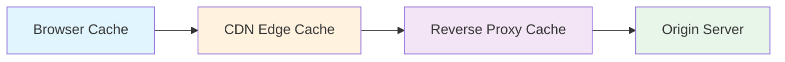
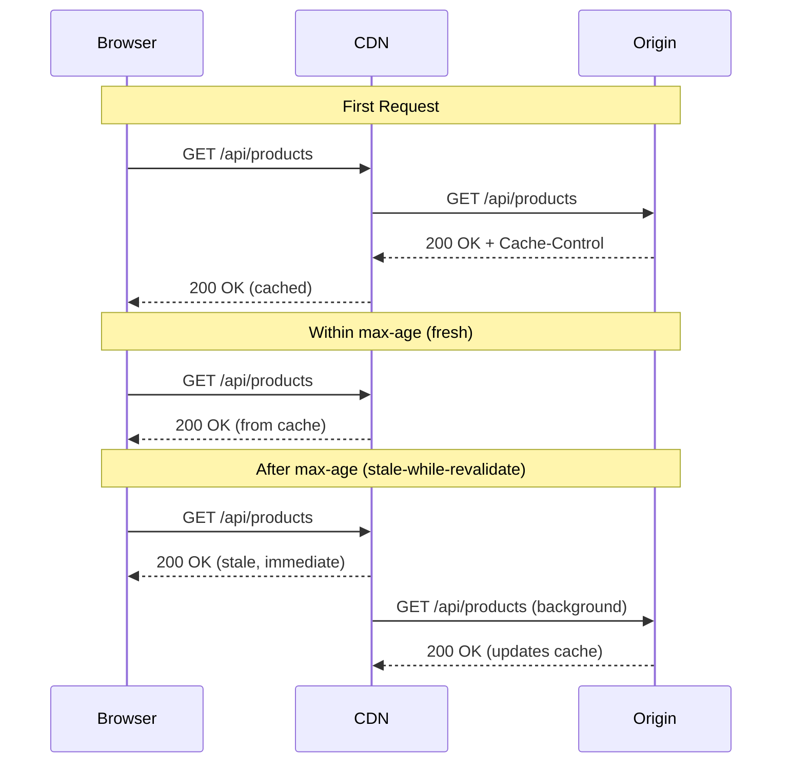
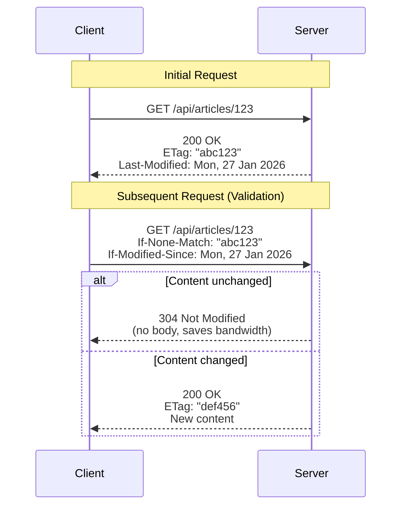
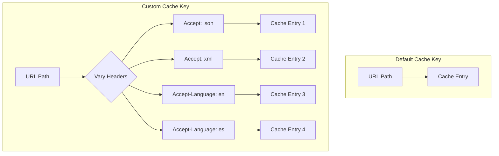
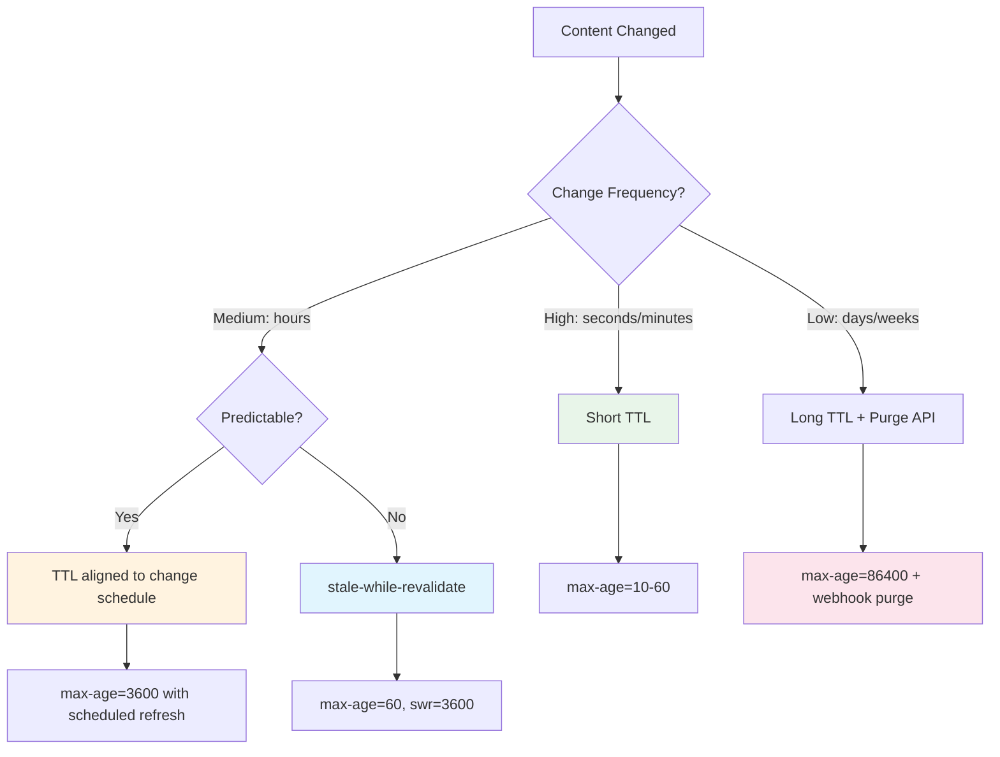
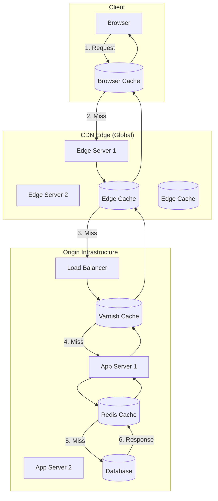
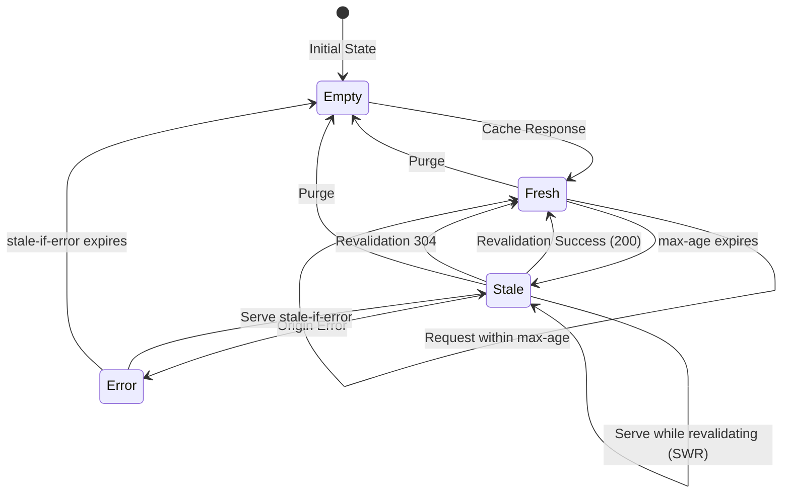

# How to Use HTTP Caching Headers in REST APIs

By [Nawaz Dhandala](https://github.com/nawazdhandala)

Tags: HTTP, Caching, REST API, Performance, CDN, Web Development, Backend

Description: A comprehensive guide to HTTP caching headers in REST APIs covering Cache-Control directives, ETags, conditional requests, Vary header usage, CDN strategies, and cache invalidation patterns for building high-performance APIs.

---

> **Caching is the most effective way to improve API performance.** A request that never reaches your server is infinitely faster than the most optimized code. Master HTTP caching headers and you can reduce latency by 90%, cut infrastructure costs, and dramatically improve user experience.

HTTP caching is one of the most powerful yet underutilized features of the web platform. When properly implemented, caching headers tell browsers, CDNs, and proxy servers exactly how to store and reuse responses, eliminating redundant requests and reducing server load.

This guide walks through every HTTP caching mechanism you need to know: from basic Cache-Control directives to advanced conditional request patterns, CDN optimization strategies, and cache invalidation techniques.

---

## Table of Contents

1. Why HTTP Caching Matters
2. Cache-Control Header Options
3. ETag and Conditional Requests
4. Vary Header Usage
5. CDN Caching Strategies
6. Cache Invalidation Patterns
7. Cache Flow Visualization
8. Best Practices Summary
9. Common Pitfalls to Avoid

---

## 1. Why HTTP Caching Matters

Before diving into headers, let's understand the impact of proper caching:

| Metric | Without Caching | With Caching |
|--------|-----------------|--------------|
| Response Time | 200-500ms | 0-50ms (cache hit) |
| Server Load | 100% of requests | 10-30% of requests |
| Bandwidth Cost | Full payload every time | Minimal (304 responses) |
| User Experience | Noticeable delays | Instant responses |

HTTP caching operates at multiple layers:



Each layer can serve cached responses, reducing the load on downstream services.

---

## 2. Cache-Control Header Options

The `Cache-Control` header is the primary mechanism for controlling caching behavior. It accepts multiple directives that can be combined.

### Basic Directives

```javascript
// Express.js middleware for setting cache headers
// This middleware demonstrates the most common Cache-Control patterns

const express = require('express');
const app = express();

// Public caching - safe for CDNs and shared caches
// Use for: static assets, public API responses, documentation
app.get('/api/public-data', (req, res) => {
  // max-age: browser caches for 1 hour (3600 seconds)
  // public: allows CDNs and proxies to cache the response
  // s-maxage: CDNs cache for 1 day (86400 seconds), overrides max-age for shared caches
  res.set('Cache-Control', 'public, max-age=3600, s-maxage=86400');
  res.json({ data: 'This can be cached by anyone' });
});

// Private caching - only browser can cache
// Use for: user-specific data, personalized content, authenticated responses
app.get('/api/user/profile', (req, res) => {
  // private: only the end user's browser can cache, CDNs must not store
  // max-age: browser caches for 5 minutes
  // must-revalidate: after max-age expires, must check with server before using stale
  res.set('Cache-Control', 'private, max-age=300, must-revalidate');
  res.json({ user: req.user });
});

// No caching - sensitive or real-time data
// Use for: authentication tokens, financial transactions, real-time data
app.get('/api/auth/token', (req, res) => {
  // no-store: never cache this response anywhere, don't even store temporarily
  // no-cache: always revalidate with server before using (but may store)
  // Together they ensure maximum freshness
  res.set('Cache-Control', 'no-store, no-cache, must-revalidate, proxy-revalidate');
  res.set('Pragma', 'no-cache'); // HTTP/1.0 backward compatibility
  res.set('Expires', '0');       // HTTP/1.0 backward compatibility
  res.json({ token: generateToken() });
});

// Immutable content - never changes, cache forever
// Use for: versioned static assets, content-addressed resources
app.get('/api/v1/assets/:hash', (req, res) => {
  // immutable: tells browser this will NEVER change, don't even revalidate
  // max-age set to 1 year (31536000 seconds) - effectively forever
  res.set('Cache-Control', 'public, max-age=31536000, immutable');
  res.sendFile(getAssetByHash(req.params.hash));
});
```

### Cache-Control Directive Reference

| Directive | Purpose | Use Case |
|-----------|---------|----------|
| `public` | Any cache can store | Static assets, public API data |
| `private` | Only browser can store | User-specific content |
| `no-cache` | Must revalidate before use | Frequently updated content |
| `no-store` | Never store anywhere | Sensitive data, tokens |
| `max-age=N` | Fresh for N seconds (browser) | General TTL control |
| `s-maxage=N` | Fresh for N seconds (CDN/proxy) | CDN-specific TTL |
| `must-revalidate` | Must check after stale | Critical freshness |
| `proxy-revalidate` | Proxies must revalidate | Proxy-specific control |
| `immutable` | Never changes | Versioned assets |
| `stale-while-revalidate=N` | Serve stale while fetching fresh | Performance optimization |
| `stale-if-error=N` | Serve stale if origin errors | Resilience |

### Advanced: Stale-While-Revalidate Pattern

```javascript
// Stale-while-revalidate provides the best of both worlds:
// - Immediate response (from cache)
// - Fresh data (fetched in background)

app.get('/api/products', async (req, res) => {
  // max-age=60: content is fresh for 1 minute
  // stale-while-revalidate=300: for 5 minutes after becoming stale,
  //   serve the stale version immediately while fetching fresh in background
  // stale-if-error=86400: if origin is down, serve stale for up to 24 hours
  res.set('Cache-Control', 'public, max-age=60, stale-while-revalidate=300, stale-if-error=86400');

  const products = await getProducts();
  res.json(products);
});
```



---

## 3. ETag and Conditional Requests

ETags enable efficient cache validation. Instead of downloading the full response, clients can ask "has this changed?" and receive a lightweight 304 Not Modified response if it hasn't.

### Implementing ETags

```javascript
const crypto = require('crypto');
const express = require('express');
const app = express();

// Generate a strong ETag based on content hash
// Strong ETags guarantee byte-for-byte equality
function generateETag(content) {
  // Use SHA-256 hash of content for strong ETag
  // The hash changes if even a single byte changes
  const hash = crypto
    .createHash('sha256')
    .update(JSON.stringify(content))
    .digest('hex')
    .substring(0, 16); // Truncate for brevity

  // Strong ETag format: "hash"
  return `"${hash}"`;
}

// Generate a weak ETag based on semantic version
// Weak ETags indicate semantic equivalence, not byte equality
function generateWeakETag(content, version) {
  // Weak ETag format: W/"version"
  // Use when responses may differ in whitespace, encoding, etc.
  return `W/"${version}-${content.lastModified}"`;
}

// Middleware to handle conditional requests
function conditionalGet(generateContent) {
  return async (req, res, next) => {
    try {
      // Generate the response content
      const content = await generateContent(req);
      const etag = generateETag(content);
      const lastModified = new Date(content.updatedAt || Date.now());

      // Set cache headers
      res.set('ETag', etag);
      res.set('Last-Modified', lastModified.toUTCString());
      res.set('Cache-Control', 'private, max-age=0, must-revalidate');

      // Check If-None-Match header (ETag validation)
      const clientETag = req.get('If-None-Match');
      if (clientETag && clientETag === etag) {
        // Content hasn't changed, return 304
        // This saves bandwidth - no body sent
        return res.status(304).end();
      }

      // Check If-Modified-Since header (time-based validation)
      const clientModified = req.get('If-Modified-Since');
      if (clientModified) {
        const clientDate = new Date(clientModified);
        if (lastModified <= clientDate) {
          // Content hasn't been modified since client's copy
          return res.status(304).end();
        }
      }

      // Content has changed or no conditional headers, send full response
      res.json(content);
    } catch (error) {
      next(error);
    }
  };
}

// Usage example
app.get('/api/articles/:id', conditionalGet(async (req) => {
  const article = await db.articles.findById(req.params.id);
  return {
    id: article.id,
    title: article.title,
    content: article.content,
    updatedAt: article.updatedAt
  };
}));
```

### Conditional Request Flow



### PUT/PATCH with ETags (Optimistic Concurrency)

```javascript
// ETags also enable optimistic locking for updates
// Prevents lost updates when multiple clients edit the same resource

app.put('/api/articles/:id', async (req, res) => {
  const articleId = req.params.id;
  const clientETag = req.get('If-Match'); // Client sends ETag they're updating from

  if (!clientETag) {
    // Require ETag for updates to prevent accidental overwrites
    return res.status(428).json({
      error: 'Precondition Required',
      message: 'If-Match header with ETag is required for updates'
    });
  }

  // Fetch current article and its ETag
  const currentArticle = await db.articles.findById(articleId);
  const currentETag = generateETag(currentArticle);

  // Compare ETags - if they don't match, someone else modified the resource
  if (clientETag !== currentETag) {
    return res.status(412).json({
      error: 'Precondition Failed',
      message: 'Resource has been modified by another client',
      currentETag: currentETag
    });
  }

  // ETags match - safe to update
  const updatedArticle = await db.articles.update(articleId, req.body);
  const newETag = generateETag(updatedArticle);

  res.set('ETag', newETag);
  res.json(updatedArticle);
});
```

---

## 4. Vary Header Usage

The `Vary` header tells caches that responses may differ based on specific request headers. Without it, caches might serve incorrect responses.

### Common Vary Patterns

```javascript
// The Vary header is crucial for proper caching of content negotiation

// Vary by Accept header - different formats for same URL
app.get('/api/data', (req, res) => {
  // This endpoint returns JSON or XML based on Accept header
  // Caches must store separate versions for each Accept value
  res.set('Vary', 'Accept');
  res.set('Cache-Control', 'public, max-age=3600');

  const acceptHeader = req.get('Accept');

  if (acceptHeader?.includes('application/xml')) {
    res.type('application/xml');
    res.send(convertToXML(data));
  } else {
    res.json(data);
  }
});

// Vary by Accept-Encoding - different compressions
// Note: Most servers/CDNs handle this automatically
app.get('/api/large-data', (req, res) => {
  // Cache stores separate versions for gzip, br, identity
  res.set('Vary', 'Accept-Encoding');
  res.set('Cache-Control', 'public, max-age=3600');
  res.json(largeDataset);
});

// Vary by Accept-Language - internationalization
app.get('/api/messages', (req, res) => {
  // Different cached versions for en-US, es, fr, etc.
  res.set('Vary', 'Accept-Language');
  res.set('Cache-Control', 'public, max-age=3600');

  const lang = req.get('Accept-Language')?.split(',')[0] || 'en';
  const messages = getLocalizedMessages(lang);
  res.json(messages);
});

// Vary by Authorization - DON'T cache authenticated responses publicly
app.get('/api/user/dashboard', (req, res) => {
  // IMPORTANT: Vary on Authorization means each user gets their own cache entry
  // Combined with 'private', this ensures user data isolation
  res.set('Vary', 'Authorization');
  res.set('Cache-Control', 'private, max-age=60');
  res.json(getUserDashboard(req.user));
});

// Multiple Vary headers combined
app.get('/api/products', (req, res) => {
  // Cache considers Accept, Accept-Language, AND Accept-Encoding
  // Each unique combination gets a separate cache entry
  res.set('Vary', 'Accept, Accept-Language, Accept-Encoding');
  res.set('Cache-Control', 'public, max-age=1800');

  const format = negotiateFormat(req);
  const lang = negotiateLanguage(req);
  res.type(format);
  res.send(formatProducts(getProducts(), format, lang));
});
```

### Vary Header Pitfalls

```javascript
// WARNING: Never Vary on headers with high cardinality

// BAD: Vary on User-Agent creates thousands of cache entries
app.get('/api/bad-example', (req, res) => {
  // Every unique User-Agent string = new cache entry
  // This effectively disables caching
  res.set('Vary', 'User-Agent'); // DON'T DO THIS
  res.json(data);
});

// BETTER: Use a normalized device class header
app.get('/api/good-example', (req, res) => {
  // Set a custom header based on device detection
  // Only 3-4 values: mobile, tablet, desktop, bot
  const deviceClass = detectDeviceClass(req.get('User-Agent'));
  res.set('X-Device-Class', deviceClass);
  res.set('Vary', 'X-Device-Class');
  res.set('Cache-Control', 'public, max-age=3600');
  res.json(getContentForDevice(deviceClass));
});

// BAD: Vary on Cookie breaks shared caching
app.get('/api/another-bad-example', (req, res) => {
  // Every unique cookie combination = new cache entry
  res.set('Vary', 'Cookie'); // DON'T DO THIS for shared caches
  res.json(data);
});
```

---

## 5. CDN Caching Strategies

CDNs sit between clients and your origin server, caching responses at edge locations worldwide. Proper CDN configuration can handle 90%+ of your traffic.

### CDN-Specific Headers

```javascript
// Cloudflare-specific caching directives
app.get('/api/cdn-optimized', (req, res) => {
  // Standard Cache-Control for browsers and generic caches
  res.set('Cache-Control', 'public, max-age=60, s-maxage=3600');

  // Cloudflare-specific: Cache for 1 week at edge
  // CDN-Cache-Control is becoming a standard (RFC 9213)
  res.set('CDN-Cache-Control', 'max-age=604800');

  // Cloudflare proprietary: fine-grained edge control
  // Only Cloudflare understands this header
  res.set('Cloudflare-CDN-Cache-Control', 'max-age=604800');

  res.json(data);
});

// Surrogate-Control for Fastly/Varnish
app.get('/api/fastly-optimized', (req, res) => {
  // Browser gets short cache time
  res.set('Cache-Control', 'public, max-age=60');

  // Surrogate (CDN/reverse proxy) gets longer cache time
  // Fastly strips this header before sending to client
  res.set('Surrogate-Control', 'max-age=86400, stale-while-revalidate=604800');

  // Surrogate-Key enables targeted purging
  // You can purge all resources with a specific key
  res.set('Surrogate-Key', 'products product-123 category-electronics');

  res.json(data);
});

// Akamai Edge-Control
app.get('/api/akamai-optimized', (req, res) => {
  res.set('Cache-Control', 'public, max-age=60');

  // Akamai-specific edge caching
  res.set('Edge-Control', 'max-age=86400, downstream-ttl=60');

  res.json(data);
});
```

### Multi-Layer Cache Configuration

```javascript
// A complete caching middleware for production APIs

function cacheMiddleware(options = {}) {
  const {
    browserTTL = 60,        // 1 minute for browsers
    cdnTTL = 3600,          // 1 hour for CDN
    staleWhileRevalidate = 86400, // 24 hours stale-while-revalidate
    isPublic = true,
    varyOn = ['Accept', 'Accept-Encoding']
  } = options;

  return (req, res, next) => {
    // Skip caching for non-GET requests
    if (req.method !== 'GET') {
      res.set('Cache-Control', 'no-store');
      return next();
    }

    // Build Cache-Control directive
    const directives = [
      isPublic ? 'public' : 'private',
      `max-age=${browserTTL}`,
    ];

    if (isPublic) {
      directives.push(`s-maxage=${cdnTTL}`);
      directives.push(`stale-while-revalidate=${staleWhileRevalidate}`);
      directives.push('stale-if-error=86400');
    } else {
      directives.push('must-revalidate');
    }

    res.set('Cache-Control', directives.join(', '));

    // Set Vary header for proper cache keying
    if (varyOn.length > 0) {
      res.set('Vary', varyOn.join(', '));
    }

    // CDN-specific headers
    if (isPublic) {
      res.set('CDN-Cache-Control', `max-age=${cdnTTL}`);
      res.set('Surrogate-Control', `max-age=${cdnTTL}`);
    }

    next();
  };
}

// Usage examples
app.use('/api/static', cacheMiddleware({
  browserTTL: 3600,
  cdnTTL: 86400,
  isPublic: true
}));

app.use('/api/user', cacheMiddleware({
  browserTTL: 60,
  isPublic: false,
  varyOn: ['Authorization']
}));
```

### Cache Key Customization



---

## 6. Cache Invalidation Patterns

Cache invalidation is famously one of the two hard problems in computer science. Here are proven patterns to handle it effectively.

### Pattern 1: Time-Based Expiration (TTL)

```javascript
// The simplest approach: let caches expire naturally

// Short TTL for frequently changing data
app.get('/api/stock-prices', (req, res) => {
  // 10 second cache - data is near-real-time
  res.set('Cache-Control', 'public, max-age=10');
  res.json(getStockPrices());
});

// Long TTL for stable data
app.get('/api/countries', (req, res) => {
  // 24 hour cache - country list rarely changes
  res.set('Cache-Control', 'public, max-age=86400');
  res.json(getCountries());
});
```

### Pattern 2: Versioned URLs (Cache Busting)

```javascript
// Include version in URL - when content changes, URL changes
// Old URL remains cached, new URL fetches fresh content

const contentVersion = process.env.CONTENT_VERSION || 'v1';

app.get(`/api/${contentVersion}/config`, (req, res) => {
  // Cache forever - URL changes when content changes
  res.set('Cache-Control', 'public, max-age=31536000, immutable');
  res.json(getConfig());
});

// Or use content hash in URL
app.get('/api/bundles/:hash', (req, res) => {
  // Hash is derived from content, so same hash = same content
  res.set('Cache-Control', 'public, max-age=31536000, immutable');
  res.sendFile(getBundleByHash(req.params.hash));
});
```

### Pattern 3: Purge API (Active Invalidation)

```javascript
// Actively invalidate cached content when source data changes

const cdnPurgeClient = require('./cdn-purge-client');

// Middleware to track cacheable URLs
const cacheRegistry = new Map();

function registerCacheableUrl(pattern, tags) {
  return (req, res, next) => {
    const url = req.originalUrl;
    cacheRegistry.set(url, { pattern, tags, cachedAt: Date.now() });
    next();
  };
}

// Purge by URL
async function purgeUrl(url) {
  console.log(`Purging cache for: ${url}`);

  // Cloudflare
  await fetch('https://api.cloudflare.com/client/v4/zones/{zone_id}/purge_cache', {
    method: 'POST',
    headers: {
      'Authorization': `Bearer ${process.env.CLOUDFLARE_TOKEN}`,
      'Content-Type': 'application/json'
    },
    body: JSON.stringify({ files: [url] })
  });
}

// Purge by tag (Surrogate-Key)
async function purgeByTag(tags) {
  console.log(`Purging cache for tags: ${tags.join(', ')}`);

  // Fastly supports tag-based purging
  for (const tag of tags) {
    await fetch(`https://api.fastly.com/service/{service_id}/purge/${tag}`, {
      method: 'POST',
      headers: { 'Fastly-Key': process.env.FASTLY_TOKEN }
    });
  }
}

// Usage: Invalidate when data changes
app.put('/api/products/:id', async (req, res) => {
  const product = await db.products.update(req.params.id, req.body);

  // Purge all caches related to this product
  await purgeByTag([
    `product-${product.id}`,
    `category-${product.categoryId}`,
    'products-list'
  ]);

  res.json(product);
});
```

### Pattern 4: Soft Purge (Stale-While-Revalidate)

```javascript
// Instead of hard purge, mark content as stale
// CDN serves stale content while fetching fresh in background

async function softPurge(url) {
  // Fastly soft purge - marks as stale but doesn't delete
  await fetch(`https://api.fastly.com/purge/${encodeURIComponent(url)}`, {
    method: 'POST',
    headers: {
      'Fastly-Key': process.env.FASTLY_TOKEN,
      'Fastly-Soft-Purge': '1'  // Soft purge instead of hard purge
    }
  });
}

// Benefits:
// 1. No cache miss storm - stale content served immediately
// 2. Fresh content fetched in background
// 3. If origin fails, stale content still available
```

### Cache Invalidation Decision Tree



---

## 7. Cache Flow Visualization

Understanding how requests flow through cache layers helps design better caching strategies.

### Complete Request Flow



### Cache State Machine



---

## 8. Best Practices Summary

### Do's

| Practice | Implementation |
|----------|----------------|
| Use `Cache-Control` over `Expires` | Modern, more flexible, takes precedence |
| Set `Vary` correctly | Prevents serving wrong cached content |
| Use `stale-while-revalidate` | Improves perceived performance |
| Implement ETags for APIs | Enables efficient validation |
| Version your assets | Enables aggressive caching + instant updates |
| Use CDN-specific headers | Optimize each cache layer independently |
| Set `immutable` for versioned assets | Prevents unnecessary revalidation |
| Cache error responses briefly | `max-age=5` prevents error storms |

### Don'ts

| Anti-Pattern | Why It's Bad |
|--------------|--------------|
| `Vary: User-Agent` | Creates thousands of cache entries |
| `Vary: Cookie` | Effectively disables shared caching |
| Missing `Vary` on negotiated content | Wrong content served from cache |
| `no-cache` when you mean `no-store` | `no-cache` still allows storing |
| Same TTL everywhere | Different content needs different strategies |
| Forgetting `private` for user data | CDNs may cache personal information |
| Hard purge everything | Causes cache stampede |

### Quick Reference Card

```javascript
// Copy-paste templates for common scenarios

// Static assets (CSS, JS, images with hash in filename)
'Cache-Control: public, max-age=31536000, immutable'

// HTML pages
'Cache-Control: public, max-age=0, must-revalidate'

// API responses (public)
'Cache-Control: public, max-age=60, s-maxage=3600, stale-while-revalidate=86400'

// API responses (authenticated)
'Cache-Control: private, max-age=60, must-revalidate'

// Real-time data
'Cache-Control: no-store'

// Sensitive data
'Cache-Control: no-store, no-cache, must-revalidate, proxy-revalidate'

// Error responses
'Cache-Control: no-cache, max-age=5'
```

---

## 9. Common Pitfalls to Avoid

### Pitfall 1: Cache Poisoning

```javascript
// DANGER: Reflecting user input in cached responses

// BAD - attacker can poison cache with malicious content
app.get('/api/search', (req, res) => {
  res.set('Cache-Control', 'public, max-age=3600');
  // If query contains XSS and response is cached...
  res.json({ query: req.query.q, results: search(req.query.q) });
});

// GOOD - sanitize and don't cache user-specific searches
app.get('/api/search', (req, res) => {
  const sanitizedQuery = sanitize(req.query.q);
  res.set('Cache-Control', 'private, max-age=60');
  res.json({ query: sanitizedQuery, results: search(sanitizedQuery) });
});
```

### Pitfall 2: Cache Stampede

```javascript
// When cache expires, all requests hit origin simultaneously

// PROBLEM: All requests pile up when cache expires
// Solution 1: Stale-while-revalidate
res.set('Cache-Control', 'public, max-age=60, stale-while-revalidate=3600');

// Solution 2: Jittered expiration
function getJitteredMaxAge(baseSeconds, jitterPercent = 0.1) {
  const jitter = baseSeconds * jitterPercent * Math.random();
  return Math.floor(baseSeconds + jitter);
}

res.set('Cache-Control', `public, max-age=${getJitteredMaxAge(3600)}`);

// Solution 3: Request coalescing (at origin)
const coalescedRequests = new Map();

async function getWithCoalescing(key, fetchFn) {
  if (coalescedRequests.has(key)) {
    return coalescedRequests.get(key);
  }

  const promise = fetchFn();
  coalescedRequests.set(key, promise);

  try {
    return await promise;
  } finally {
    coalescedRequests.delete(key);
  }
}
```

### Pitfall 3: Over-Caching Authenticated Content

```javascript
// CRITICAL: Never let CDNs cache user-specific data

// WRONG - CDN might cache and serve user A's data to user B
app.get('/api/user/profile', (req, res) => {
  res.set('Cache-Control', 'public, max-age=3600'); // DANGEROUS!
  res.json(req.user);
});

// CORRECT - private ensures only browser caches
app.get('/api/user/profile', (req, res) => {
  res.set('Cache-Control', 'private, max-age=300');
  res.set('Vary', 'Authorization');
  res.json(req.user);
});
```

---

## Conclusion

HTTP caching is a powerful tool for building high-performance REST APIs. The key principles are:

1. **Cache aggressively** - Default to caching, opt out selectively
2. **Layer your caches** - Browser, CDN, and origin each serve different purposes
3. **Use appropriate TTLs** - Match cache duration to content change frequency
4. **Validate efficiently** - ETags and conditional requests save bandwidth
5. **Vary correctly** - Ensure caches store correct versions for different clients
6. **Plan for invalidation** - Use versioning, purge APIs, or short TTLs

Implement these patterns correctly and you'll see dramatic improvements in API performance, reduced infrastructure costs, and happier users.

---

*Want to monitor your API performance and cache hit rates? [OneUptime](https://oneuptime.com) provides comprehensive observability for your APIs, including response time tracking, error monitoring, and custom metrics. Set up alerts when cache performance degrades and track the impact of your caching strategies in real-time.*
