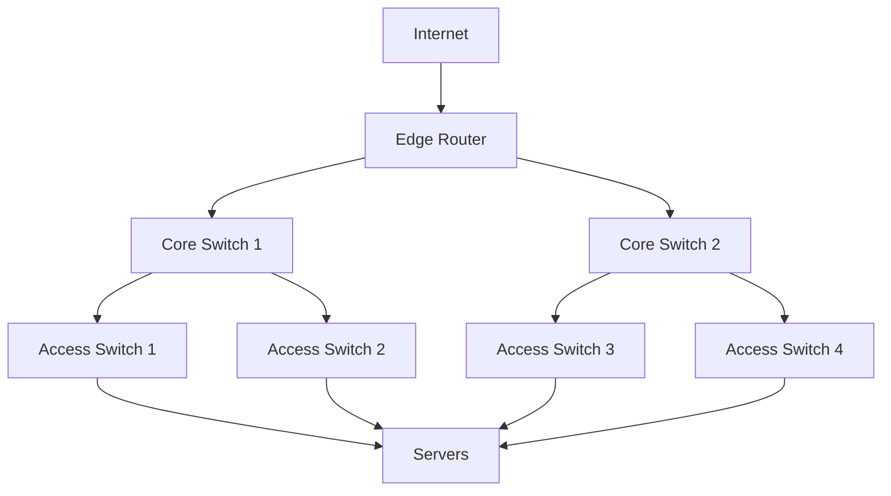

# How to Configure Infrastructure Monitoring in Grafana

Author: [nawazdhandala](https://www.github.com/nawazdhandala)

Tags: Grafana, Infrastructure Monitoring, Prometheus, Node Exporter, System Metrics, DevOps, SRE

Description: Set up comprehensive infrastructure monitoring in Grafana covering servers, networks, storage, and cloud resources with actionable dashboards and alerts.

---

## Infrastructure Monitoring Fundamentals

Infrastructure monitoring tracks the health and performance of your underlying compute, network, and storage resources. Unlike application monitoring, infrastructure monitoring focuses on:

- Server health (CPU, memory, disk, network)
- Network devices and connectivity
- Storage systems and capacity
- Cloud provider resources
- Hardware status and failures

Grafana paired with Prometheus provides a powerful platform for infrastructure visibility.

## Setting Up Data Collection

### Node Exporter for Linux Servers

Node Exporter collects system metrics from Linux machines.

```bash
# Install node_exporter
wget https://github.com/prometheus/node_exporter/releases/download/v1.7.0/node_exporter-1.7.0.linux-amd64.tar.gz
tar xvfz node_exporter-*.tar.gz
cd node_exporter-*
./node_exporter &
```

Or as a systemd service:

```ini
# /etc/systemd/system/node_exporter.service
[Unit]
Description=Node Exporter
After=network.target

[Service]
User=node_exporter
ExecStart=/usr/local/bin/node_exporter
Restart=always

[Install]
WantedBy=multi-user.target
```

### Windows Exporter

For Windows servers, use Windows Exporter:

```powershell
# Install via msi
msiexec /i windows_exporter-0.25.1-amd64.msi

# Or run directly
.\windows_exporter.exe --collectors.enabled "cpu,cs,logical_disk,memory,net,os,process,system"
```

### Prometheus Configuration

Configure Prometheus to scrape your exporters:

```yaml
# prometheus.yml
global:
  scrape_interval: 15s

scrape_configs:
  - job_name: 'node'
    static_configs:
      - targets:
        - 'server1:9100'
        - 'server2:9100'
        - 'server3:9100'
    relabel_configs:
      - source_labels: [__address__]
        regex: '(.*):\d+'
        target_label: instance
        replacement: '$1'

  - job_name: 'windows'
    static_configs:
      - targets:
        - 'winserver1:9182'
```

## Server Dashboard Components

### CPU Monitoring

Track CPU utilization across modes:

```promql
# Overall CPU utilization
100 - (avg(rate(node_cpu_seconds_total{mode="idle"}[5m])) * 100)

# CPU by mode
sum(rate(node_cpu_seconds_total[5m])) by (mode)

# CPU utilization per core
100 - (avg(rate(node_cpu_seconds_total{mode="idle"}[5m])) by (cpu) * 100)

# Load average
node_load1
node_load5
node_load15
```

Panel configuration:

```yaml
Panel: CPU Utilization
Type: Time series

Queries:
  - Legend: System
    Expr: sum(rate(node_cpu_seconds_total{mode="system"}[5m])) * 100
  - Legend: User
    Expr: sum(rate(node_cpu_seconds_total{mode="user"}[5m])) * 100
  - Legend: IOWait
    Expr: sum(rate(node_cpu_seconds_total{mode="iowait"}[5m])) * 100

Stack: true
Unit: percent
```

### Memory Monitoring

```promql
# Memory utilization percentage
(1 - (node_memory_MemAvailable_bytes / node_memory_MemTotal_bytes)) * 100

# Memory breakdown
node_memory_MemTotal_bytes
node_memory_MemAvailable_bytes
node_memory_Cached_bytes
node_memory_Buffers_bytes

# Swap usage
(1 - (node_memory_SwapFree_bytes / node_memory_SwapTotal_bytes)) * 100
```

### Disk Monitoring

```promql
# Disk space usage percentage
(1 - (node_filesystem_avail_bytes / node_filesystem_size_bytes)) * 100

# Disk I/O
rate(node_disk_read_bytes_total[5m])
rate(node_disk_written_bytes_total[5m])

# Disk latency
rate(node_disk_read_time_seconds_total[5m]) / rate(node_disk_reads_completed_total[5m])
rate(node_disk_write_time_seconds_total[5m]) / rate(node_disk_writes_completed_total[5m])

# IOPS
rate(node_disk_reads_completed_total[5m])
rate(node_disk_writes_completed_total[5m])
```

### Network Monitoring

```promql
# Network throughput
rate(node_network_receive_bytes_total{device!~"lo|veth.*"}[5m]) * 8
rate(node_network_transmit_bytes_total{device!~"lo|veth.*"}[5m]) * 8

# Packet rate
rate(node_network_receive_packets_total[5m])
rate(node_network_transmit_packets_total[5m])

# Network errors
rate(node_network_receive_errs_total[5m])
rate(node_network_transmit_errs_total[5m])
```

## Multi-Server Overview Dashboard

Create a dashboard showing all servers at a glance.

### Server Status Table

```promql
# Server up/down status with metadata
up{job="node"} * on(instance) group_left(nodename) node_uname_info
```

Configuration:

```yaml
Panel: Server Status
Type: Table

Transformations:
  - Organize fields:
      Keep: [instance, nodename, Value]
      Rename:
        Value: Status

Thresholds:
  - 1: green
  - 0: red
```

### Resource Utilization Heatmap

```promql
# CPU utilization by server
100 - (avg(rate(node_cpu_seconds_total{mode="idle"}[5m])) by (instance) * 100)
```

```yaml
Panel: Server CPU Heatmap
Type: Status history

Color mode: Continuous
Thresholds:
  - 0: green
  - 70: yellow
  - 90: red
```

### Capacity Planning View

```promql
# Servers by memory utilization
sort_desc(
  (1 - (node_memory_MemAvailable_bytes / node_memory_MemTotal_bytes)) * 100
)

# Disk space forecast (linear regression)
predict_linear(node_filesystem_avail_bytes{mountpoint="/"}[7d], 30*24*3600)
```

## Network Infrastructure Dashboard

### SNMP Monitoring

For network devices, use SNMP Exporter:

```yaml
# snmp.yml generator config
modules:
  if_mib:
    walk:
      - ifDescr
      - ifOperStatus
      - ifInOctets
      - ifOutOctets
      - ifInErrors
      - ifOutErrors
```

```promql
# Interface status
ifOperStatus{job="snmp"}

# Interface throughput
rate(ifInOctets{job="snmp"}[5m]) * 8
rate(ifOutOctets{job="snmp"}[5m]) * 8

# Interface errors
rate(ifInErrors{job="snmp"}[5m])
rate(ifOutErrors{job="snmp"}[5m])
```

### Network Topology Visualization



Use Grafana's Node Graph panel with network topology data.

## Storage Monitoring

### Disk Array Monitoring

```promql
# Storage pool capacity
storage_pool_total_bytes
storage_pool_used_bytes

# Storage latency
storage_read_latency_seconds
storage_write_latency_seconds

# IOPS
storage_read_iops
storage_write_iops
```

### NFS/SAN Monitoring

```promql
# NFS operations
rate(node_nfs_requests_total[5m])

# NFS latency
rate(node_nfs_rpc_retransmissions_total[5m])
```

## Cloud Provider Integration

### AWS CloudWatch

Use the CloudWatch data source:

```yaml
Data source: CloudWatch
Region: us-east-1

# EC2 CPU
Namespace: AWS/EC2
Metric: CPUUtilization
Dimensions: InstanceId=$instance

# RDS metrics
Namespace: AWS/RDS
Metric: DatabaseConnections
Dimensions: DBInstanceIdentifier=$database
```

### GCP Monitoring

```yaml
Data source: Google Cloud Monitoring
Project: my-project

# GCE CPU
Metric: compute.googleapis.com/instance/cpu/utilization
Filter: resource.instance_id="$instance"

# Cloud SQL
Metric: cloudsql.googleapis.com/database/cpu/utilization
```

### Azure Monitor

```yaml
Data source: Azure Monitor
Subscription: $subscription

# VM CPU
Resource type: Microsoft.Compute/virtualMachines
Metric: Percentage CPU
```

## Alerting Rules

### Critical Server Alerts

```yaml
groups:
  - name: infrastructure
    rules:
      - alert: HighCPUUsage
        expr: |
          100 - (avg by(instance) (rate(node_cpu_seconds_total{mode="idle"}[5m])) * 100) > 90
        for: 5m
        labels:
          severity: warning
        annotations:
          summary: "High CPU usage on {{ $labels.instance }}"
          description: "CPU usage is {{ $value | printf \"%.1f\" }}%"

      - alert: HighMemoryUsage
        expr: |
          (1 - (node_memory_MemAvailable_bytes / node_memory_MemTotal_bytes)) * 100 > 90
        for: 5m
        labels:
          severity: warning
        annotations:
          summary: "High memory usage on {{ $labels.instance }}"

      - alert: DiskSpaceLow
        expr: |
          (1 - (node_filesystem_avail_bytes{mountpoint="/"} / node_filesystem_size_bytes{mountpoint="/"})) * 100 > 85
        for: 5m
        labels:
          severity: warning
        annotations:
          summary: "Disk space low on {{ $labels.instance }}"
          description: "{{ $value | printf \"%.1f\" }}% disk used"

      - alert: DiskSpaceCritical
        expr: |
          (1 - (node_filesystem_avail_bytes{mountpoint="/"} / node_filesystem_size_bytes{mountpoint="/"})) * 100 > 95
        for: 5m
        labels:
          severity: critical
        annotations:
          summary: "Disk space critical on {{ $labels.instance }}"

      - alert: ServerDown
        expr: up{job="node"} == 0
        for: 1m
        labels:
          severity: critical
        annotations:
          summary: "Server {{ $labels.instance }} is down"
```

### Predictive Alerts

```yaml
- alert: DiskWillFillIn24Hours
  expr: |
    predict_linear(node_filesystem_avail_bytes{mountpoint="/"}[6h], 24*3600) < 0
  for: 1h
  labels:
    severity: warning
  annotations:
    summary: "Disk on {{ $labels.instance }} predicted to fill within 24 hours"
```

## Recording Rules for Performance

Pre-compute common metrics:

```yaml
groups:
  - name: infrastructure_recording
    interval: 1m
    rules:
      - record: instance:node_cpu:utilization
        expr: |
          100 - (avg by(instance) (rate(node_cpu_seconds_total{mode="idle"}[5m])) * 100)

      - record: instance:node_memory:utilization
        expr: |
          (1 - (node_memory_MemAvailable_bytes / node_memory_MemTotal_bytes)) * 100

      - record: instance:node_disk:utilization
        expr: |
          (1 - (node_filesystem_avail_bytes{mountpoint="/"} / node_filesystem_size_bytes{mountpoint="/"})) * 100

      - record: instance:node_network:receive_bytes_rate5m
        expr: |
          sum by(instance) (rate(node_network_receive_bytes_total{device!~"lo|veth.*"}[5m]))
```

Then use these in dashboards:

```promql
# Fast query using recording rule
instance:node_cpu:utilization{instance="server1"}
```

## Dashboard Organization

Structure your infrastructure dashboards:

```
Infrastructure/
├── Overview
│   └── All servers at a glance
├── Compute/
│   ├── Linux Servers
│   ├── Windows Servers
│   └── VM Platform
├── Network/
│   ├── Core Network
│   └── Edge Devices
├── Storage/
│   ├── SAN Overview
│   └── NFS Servers
└── Cloud/
    ├── AWS Resources
    ├── GCP Resources
    └── Azure Resources
```

## Conclusion

Infrastructure monitoring in Grafana provides the foundation for understanding system health and capacity. Start with Node Exporter for server basics, expand to network and storage monitoring, and integrate cloud provider metrics for complete visibility. Use recording rules for query performance, set up predictive alerts to catch issues before they impact users, and organize dashboards to match your infrastructure topology. This observability foundation supports everything you build on top of it.
