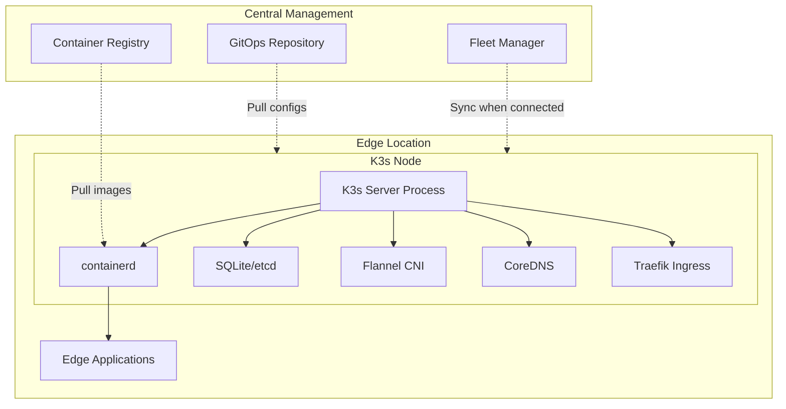
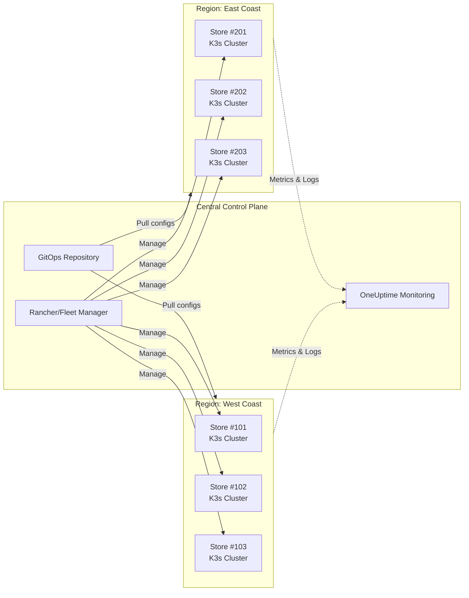

# How to Configure K3s for Edge Deployment

Author: [nawazdhandala](https://www.github.com/nawazdhandala)

Tags: Kubernetes, K3s, Edge Computing, IoT, DevOps, Infrastructure, Air-Gapped, Fleet Management

Description: A comprehensive guide to deploying K3s at the edge, covering lightweight configuration, air-gapped installation, resource constraints, and fleet management for disconnected or resource-limited environments.

---

> "The edge is where the cloud meets reality - where milliseconds matter and connectivity is a luxury, not a guarantee." - Edge Computing Principle

K3s has become the de facto standard for running Kubernetes at the edge. With a binary under 100MB, support for ARM processors, and the ability to run on devices with as little as 512MB of RAM, it brings container orchestration to places where traditional Kubernetes cannot go. This guide walks through practical configurations for deploying K3s in edge scenarios - from retail stores to factory floors to remote IoT installations.

## Understanding K3s Architecture for Edge

Before diving into configuration, it is important to understand how K3s differs from standard Kubernetes and why those differences matter at the edge.



K3s packages everything into a single binary: the API server, scheduler, controller manager, and kubelet. For storage, it defaults to SQLite instead of etcd, eliminating the need for a separate database cluster. This architectural simplicity is what makes edge deployment practical.

## Lightweight Configuration

Edge devices often have limited CPU, memory, and storage. K3s provides several flags to minimize resource consumption.

### Minimal Server Installation

```bash
# Install K3s with minimal components
# --disable: Removes components you do not need
# --kubelet-arg: Tunes kubelet for constrained environments
# --kube-apiserver-arg: Reduces API server memory footprint

curl -sfL https://get.k3s.io | INSTALL_K3S_EXEC="server \
  --disable traefik \
  --disable servicelb \
  --disable local-storage \
  --kubelet-arg=max-pods=30 \
  --kubelet-arg=eviction-hard=memory.available<200Mi \
  --kubelet-arg=eviction-minimum-reclaim=memory.available=100Mi \
  --kubelet-arg=system-reserved=cpu=200m,memory=200Mi \
  --kube-apiserver-arg=max-requests-inflight=100 \
  --kube-apiserver-arg=max-mutating-requests-inflight=50" sh -
```

### Resource-Optimized Configuration File

Create a configuration file at `/etc/rancher/k3s/config.yaml` for cleaner management:

```yaml
# /etc/rancher/k3s/config.yaml
# K3s configuration optimized for edge devices with limited resources

# Disable components not needed at the edge
disable:
  - traefik          # Use a lighter ingress or none at all
  - servicelb        # MetalLB or direct NodePort access instead
  - local-storage    # Use host-path or dedicated storage class
  - metrics-server   # Install only if you need HPA

# Use SQLite for single-node deployments (default, but explicit here)
# For multi-node edge clusters, consider embedded etcd
datastore-endpoint: ""

# Kubelet optimizations for constrained environments
kubelet-arg:
  - "max-pods=30"                                    # Limit pod count
  - "eviction-hard=memory.available<200Mi"           # Aggressive eviction
  - "eviction-soft=memory.available<300Mi"           # Soft eviction threshold
  - "eviction-soft-grace-period=memory.available=1m" # Grace period
  - "image-gc-high-threshold=70"                     # Clean images earlier
  - "image-gc-low-threshold=50"                      # Keep less images cached
  - "system-reserved=cpu=200m,memory=200Mi"          # Reserve for system

# API server tuning
kube-apiserver-arg:
  - "max-requests-inflight=100"
  - "max-mutating-requests-inflight=50"

# Controller manager tuning
kube-controller-manager-arg:
  - "node-monitor-period=30s"      # Check nodes less frequently
  - "node-monitor-grace-period=60s" # More tolerance for slow responses

# Write kubeconfig with restricted permissions
write-kubeconfig-mode: "0644"

# Use wireguard for encrypted node communication (optional)
# flannel-backend: wireguard-native
```

### Agent Node Configuration for Minimal Footprint

For worker nodes joining an edge cluster:

```bash
# Install K3s agent with minimal footprint
# K3S_URL: Points to the server node
# K3S_TOKEN: Retrieved from /var/lib/rancher/k3s/server/node-token on server

curl -sfL https://get.k3s.io | K3S_URL=https://edge-server:6443 \
  K3S_TOKEN=<token> \
  INSTALL_K3S_EXEC="agent \
    --kubelet-arg=max-pods=20 \
    --kubelet-arg=eviction-hard=memory.available<150Mi \
    --kubelet-arg=system-reserved=cpu=100m,memory=150Mi" sh -
```

## Air-Gapped Installation

Many edge locations have limited or no internet connectivity. K3s supports fully air-gapped installations with pre-downloaded images and binaries.

### Preparation Phase (Online Environment)

```bash
#!/bin/bash
# prepare-airgap.sh
# Run this script in an environment with internet access
# It downloads all components needed for offline K3s installation

K3S_VERSION="v1.29.1+k3s2"
ARCH="amd64"  # Change to arm64 or arm for ARM devices

# Create directory structure for air-gapped package
mkdir -p airgap-bundle/{bin,images}
cd airgap-bundle

# Download K3s binary
echo "Downloading K3s binary..."
curl -Lo bin/k3s https://github.com/k3s-io/k3s/releases/download/${K3S_VERSION}/k3s-${ARCH}
chmod +x bin/k3s

# Download the K3s install script
curl -Lo bin/install.sh https://get.k3s.io
chmod +x bin/install.sh

# Download the air-gapped images tarball
# This contains all system images K3s needs to function
echo "Downloading K3s images..."
curl -Lo images/k3s-airgap-images-${ARCH}.tar.gz \
  https://github.com/k3s-io/k3s/releases/download/${K3S_VERSION}/k3s-airgap-images-${ARCH}.tar.gz

# Download your application images and save them
echo "Saving application images..."
# Example: Save images your workloads need
docker pull nginx:alpine
docker pull redis:7-alpine
docker save nginx:alpine redis:7-alpine -o images/app-images.tar

# Create checksums for verification
echo "Creating checksums..."
sha256sum bin/k3s > checksums.txt
sha256sum images/*.tar* >> checksums.txt

# Package everything
cd ..
tar -czvf k3s-airgap-bundle.tar.gz airgap-bundle/

echo "Air-gapped bundle created: k3s-airgap-bundle.tar.gz"
echo "Transfer this file to your edge device via USB, SCP, or other means"
```

### Installation Phase (Offline Environment)

```bash
#!/bin/bash
# install-airgap.sh
# Run this script on the air-gapped edge device

BUNDLE_PATH="/path/to/k3s-airgap-bundle.tar.gz"

# Extract the bundle
tar -xzvf ${BUNDLE_PATH}
cd airgap-bundle

# Verify checksums
echo "Verifying checksums..."
sha256sum -c checksums.txt || { echo "Checksum verification failed!"; exit 1; }

# Install K3s binary
echo "Installing K3s binary..."
sudo cp bin/k3s /usr/local/bin/
sudo chmod +x /usr/local/bin/k3s

# Create required directories
sudo mkdir -p /var/lib/rancher/k3s/agent/images/

# Load air-gapped images
# K3s will automatically load images from this directory on startup
echo "Installing air-gapped images..."
sudo cp images/k3s-airgap-images-*.tar.gz /var/lib/rancher/k3s/agent/images/
sudo gunzip /var/lib/rancher/k3s/agent/images/k3s-airgap-images-*.tar.gz

# Load application images
sudo ctr -n k8s.io images import images/app-images.tar

# Install K3s using the offline script
echo "Installing K3s..."
INSTALL_K3S_SKIP_DOWNLOAD=true ./bin/install.sh

# Verify installation
echo "Verifying installation..."
sudo k3s kubectl get nodes
sudo k3s kubectl get pods -A

echo "K3s air-gapped installation complete!"
```

### Air-Gapped Registry Configuration

For ongoing deployments, set up a local registry that K3s can pull from:

```yaml
# /etc/rancher/k3s/registries.yaml
# Configure K3s to use a local air-gapped registry

mirrors:
  # Redirect Docker Hub requests to local registry
  "docker.io":
    endpoint:
      - "http://local-registry.edge.local:5000"

  # Redirect all image pulls to local registry
  "*":
    endpoint:
      - "http://local-registry.edge.local:5000"

configs:
  "local-registry.edge.local:5000":
    # For insecure registries (HTTP)
    tls:
      insecure_skip_verify: true
    # If registry requires authentication
    auth:
      username: edge-user
      password: edge-password
```

## Resource Constraints Management

Edge devices require careful resource management to ensure stability. K3s provides several mechanisms to enforce limits.

### Resource Quota for Edge Namespaces

```yaml
# resource-quota.yaml
# Enforce resource limits at the namespace level
# This prevents any single application from consuming all resources

apiVersion: v1
kind: ResourceQuota
metadata:
  name: edge-resource-quota
  namespace: edge-apps
spec:
  hard:
    # Limit total CPU and memory for the namespace
    requests.cpu: "1"           # 1 CPU core total for all pods
    requests.memory: 512Mi      # 512MB RAM total
    limits.cpu: "2"             # Allow bursting to 2 cores
    limits.memory: 1Gi          # Hard limit at 1GB

    # Limit number of objects to prevent resource exhaustion
    pods: "20"                  # Maximum 20 pods
    services: "10"              # Maximum 10 services
    secrets: "20"               # Maximum 20 secrets
    configmaps: "20"            # Maximum 20 configmaps
    persistentvolumeclaims: "5" # Maximum 5 PVCs
```

### LimitRange for Default Constraints

```yaml
# limit-range.yaml
# Set default resource requests and limits for pods
# Ensures every pod has defined resource boundaries

apiVersion: v1
kind: LimitRange
metadata:
  name: edge-limit-range
  namespace: edge-apps
spec:
  limits:
    # Default limits for containers that do not specify their own
    - default:
        cpu: 200m           # Default CPU limit
        memory: 256Mi       # Default memory limit
      defaultRequest:
        cpu: 50m            # Default CPU request
        memory: 64Mi        # Default memory request
      max:
        cpu: 500m           # Maximum CPU any container can request
        memory: 512Mi       # Maximum memory any container can request
      min:
        cpu: 10m            # Minimum CPU (prevents tiny allocations)
        memory: 16Mi        # Minimum memory
      type: Container

    # Limits for pods (sum of all containers)
    - max:
        cpu: "1"
        memory: 1Gi
      type: Pod
```

### Priority Classes for Critical Workloads

```yaml
# priority-classes.yaml
# Define priority levels for edge workloads
# Higher priority pods will preempt lower priority ones when resources are scarce

---
# Critical system components - never evict
apiVersion: scheduling.k8s.io/v1
kind: PriorityClass
metadata:
  name: edge-critical
value: 1000000
globalDefault: false
description: "Critical edge infrastructure that must always run"
preemptionPolicy: PreemptLowerPriority

---
# Important business applications
apiVersion: scheduling.k8s.io/v1
kind: PriorityClass
metadata:
  name: edge-high
value: 100000
globalDefault: false
description: "Important edge applications"
preemptionPolicy: PreemptLowerPriority

---
# Default priority for standard workloads
apiVersion: scheduling.k8s.io/v1
kind: PriorityClass
metadata:
  name: edge-normal
value: 10000
globalDefault: true  # This is the default for pods without explicit priority
description: "Normal edge workloads"
preemptionPolicy: PreemptLowerPriority

---
# Low priority batch jobs that can be evicted
apiVersion: scheduling.k8s.io/v1
kind: PriorityClass
metadata:
  name: edge-low
value: 1000
globalDefault: false
description: "Low priority batch jobs, evictable"
preemptionPolicy: Never  # Do not evict other pods to run these
```

### Example Deployment with Resource Constraints

```yaml
# edge-app-deployment.yaml
# Example deployment optimized for edge constraints

apiVersion: apps/v1
kind: Deployment
metadata:
  name: edge-data-collector
  namespace: edge-apps
spec:
  replicas: 1  # Single replica typical for edge
  strategy:
    type: Recreate  # Faster than RollingUpdate on single-node
  selector:
    matchLabels:
      app: data-collector
  template:
    metadata:
      labels:
        app: data-collector
    spec:
      # Use high priority for critical data collection
      priorityClassName: edge-high

      # Tolerate node pressure to avoid unnecessary evictions
      tolerations:
        - key: "node.kubernetes.io/memory-pressure"
          operator: "Exists"
          effect: "NoSchedule"
        - key: "node.kubernetes.io/disk-pressure"
          operator: "Exists"
          effect: "NoSchedule"

      containers:
        - name: collector
          image: local-registry.edge.local:5000/data-collector:v1.2

          # Explicit resource constraints
          resources:
            requests:
              cpu: 50m       # Minimal CPU request
              memory: 64Mi   # Minimal memory request
            limits:
              cpu: 200m      # Allow bursting
              memory: 128Mi  # Hard memory limit

          # Aggressive liveness probe for quick recovery
          livenessProbe:
            httpGet:
              path: /healthz
              port: 8080
            initialDelaySeconds: 5
            periodSeconds: 10
            failureThreshold: 2

          # Environment variables for edge-specific config
          env:
            - name: EDGE_MODE
              value: "true"
            - name: BUFFER_SIZE
              value: "1000"  # Smaller buffer for memory constraints
            - name: SYNC_INTERVAL
              value: "60"    # Sync data every 60 seconds
```

## Fleet Management

Managing hundreds or thousands of edge K3s clusters requires centralized tooling. Here is how to implement fleet management.



### Fleet GitRepo Configuration

Using Rancher Fleet for GitOps-based fleet management:

```yaml
# fleet-gitrepo.yaml
# Define a GitRepo that Fleet will sync to all edge clusters

apiVersion: fleet.cattle.io/v1alpha1
kind: GitRepo
metadata:
  name: edge-applications
  namespace: fleet-default
spec:
  # Git repository containing edge workload definitions
  repo: https://github.com/your-org/edge-fleet-configs
  branch: main

  # Path within the repo containing the manifests
  paths:
    - /edge-apps/base        # Base configurations
    - /edge-apps/overlays    # Environment-specific overlays

  # Target specific clusters using labels
  targets:
    # Deploy to all edge clusters
    - name: all-edge
      clusterSelector:
        matchLabels:
          environment: edge

    # Deploy region-specific configs
    - name: west-coast
      clusterSelector:
        matchLabels:
          environment: edge
          region: west

    - name: east-coast
      clusterSelector:
        matchLabels:
          environment: edge
          region: east

  # Polling interval - how often to check for updates
  pollingInterval: 5m

  # Force sync even if there are local changes
  forceSyncGeneration: 1
```

### Cluster Group Definition

```yaml
# cluster-group.yaml
# Group edge clusters for targeted deployments

apiVersion: fleet.cattle.io/v1alpha1
kind: ClusterGroup
metadata:
  name: retail-stores
  namespace: fleet-default
spec:
  selector:
    matchLabels:
      type: retail
      environment: edge
    matchExpressions:
      - key: region
        operator: In
        values:
          - west
          - east
          - central

---
apiVersion: fleet.cattle.io/v1alpha1
kind: ClusterGroup
metadata:
  name: manufacturing-plants
  namespace: fleet-default
spec:
  selector:
    matchLabels:
      type: manufacturing
      environment: edge
```

### Edge Cluster Registration Script

```bash
#!/bin/bash
# register-edge-cluster.sh
# Script to register a new edge K3s cluster with the central fleet manager

# Configuration - set these for your environment
FLEET_MANAGER_URL="https://rancher.central.example.com"
CLUSTER_NAME="${1:-edge-$(hostname)}"
REGION="${2:-unknown}"
CLUSTER_TYPE="${3:-retail}"  # retail, manufacturing, warehouse, etc.

# Labels for fleet targeting
LABELS="environment=edge,region=${REGION},type=${CLUSTER_TYPE}"

echo "Registering cluster: ${CLUSTER_NAME}"
echo "Labels: ${LABELS}"

# Generate cluster registration token from Fleet manager
# This would typically come from your central management system
REGISTRATION_TOKEN=$(curl -s -X POST \
  -H "Authorization: Bearer ${FLEET_API_TOKEN}" \
  "${FLEET_MANAGER_URL}/v1/management.cattle.io.clusterregistrationtokens" \
  -d "{\"metadata\":{\"namespace\":\"fleet-default\"},\"spec\":{\"ttl\":\"24h\"}}" \
  | jq -r '.status.token')

# Create the fleet-agent namespace
kubectl create namespace cattle-fleet-system --dry-run=client -o yaml | kubectl apply -f -

# Apply cluster labels
kubectl label namespace cattle-fleet-system \
  fleet.cattle.io/cluster-name=${CLUSTER_NAME} \
  ${LABELS//,/ } \
  --overwrite

# Install the fleet agent
# This connects the edge cluster to the central fleet manager
cat <<EOF | kubectl apply -f -
apiVersion: v1
kind: Secret
metadata:
  name: fleet-agent-bootstrap-secret
  namespace: cattle-fleet-system
type: Opaque
stringData:
  token: "${REGISTRATION_TOKEN}"
  apiServerURL: "${FLEET_MANAGER_URL}"
  systemRegistrationNamespace: "fleet-default"
  clusterNamespace: "fleet-default"
  clientID: "${CLUSTER_NAME}"
  labels: "${LABELS}"
EOF

# Deploy fleet agent
kubectl apply -f https://github.com/rancher/fleet/releases/latest/download/fleet-agent-deployment.yaml

echo "Edge cluster registered successfully!"
echo "Check status: kubectl get clusters.fleet.cattle.io -n fleet-default"
```

### Bundle for Edge-Specific Configurations

```yaml
# fleet-bundle.yaml
# Define a Fleet Bundle for edge-specific workloads

apiVersion: fleet.cattle.io/v1alpha1
kind: Bundle
metadata:
  name: edge-monitoring-agent
  namespace: fleet-default
spec:
  # Resources to deploy
  resources:
    - content: |
        apiVersion: v1
        kind: ConfigMap
        metadata:
          name: edge-monitor-config
          namespace: monitoring
        data:
          # Lightweight monitoring config for edge
          config.yaml: |
            scrape_interval: 60s  # Less frequent for edge
            remote_write:
              url: https://oneuptime.example.com/api/telemetry
              batch_size: 100
              timeout: 30s

    - content: |
        apiVersion: apps/v1
        kind: DaemonSet
        metadata:
          name: edge-telemetry-agent
          namespace: monitoring
        spec:
          selector:
            matchLabels:
              app: telemetry-agent
          template:
            metadata:
              labels:
                app: telemetry-agent
            spec:
              containers:
                - name: agent
                  image: otel/opentelemetry-collector:latest
                  resources:
                    requests:
                      cpu: 10m
                      memory: 32Mi
                    limits:
                      cpu: 100m
                      memory: 128Mi

  # Target all edge clusters
  targets:
    - clusterSelector:
        matchLabels:
          environment: edge

  # Diff options for handling changes
  diff:
    comparePatches:
      - apiVersion: apps/v1
        kind: DaemonSet
        operations:
          - op: remove
            path: /spec/template/spec/containers/0/resources/limits
```

## Monitoring Edge Clusters with OneUptime

Edge deployments require robust monitoring to detect issues before they impact operations. Integrate your K3s edge clusters with [OneUptime](https://oneuptime.com) for comprehensive observability.

```yaml
# oneuptime-edge-monitoring.yaml
# Deploy OpenTelemetry collector configured to send data to OneUptime

apiVersion: v1
kind: Namespace
metadata:
  name: monitoring

---
apiVersion: v1
kind: ConfigMap
metadata:
  name: otel-collector-config
  namespace: monitoring
data:
  config.yaml: |
    # OpenTelemetry Collector configuration for edge monitoring
    # Optimized for low bandwidth and intermittent connectivity

    receivers:
      # Receive metrics from edge applications
      otlp:
        protocols:
          grpc:
            endpoint: 0.0.0.0:4317
          http:
            endpoint: 0.0.0.0:4318

      # Collect host metrics
      hostmetrics:
        collection_interval: 60s  # Less frequent for edge
        scrapers:
          cpu:
          memory:
          disk:
          network:

      # Kubernetes metrics
      k8s_cluster:
        collection_interval: 60s

    processors:
      # Batch data to reduce network calls
      batch:
        timeout: 60s
        send_batch_size: 256

      # Add edge-specific attributes
      resource:
        attributes:
          - key: deployment.environment
            value: edge
            action: insert
          - key: k8s.cluster.name
            from_attribute: CLUSTER_NAME
            action: insert

      # Filter out verbose data to save bandwidth
      filter:
        metrics:
          exclude:
            match_type: regexp
            metric_names:
              - ".*_bucket"  # Exclude histogram buckets

    exporters:
      # Send to OneUptime
      otlphttp:
        endpoint: https://oneuptime.com/otlp
        headers:
          x-oneuptime-token: "${ONEUPTIME_TOKEN}"
        retry_on_failure:
          enabled: true
          initial_interval: 10s
          max_interval: 60s
          max_elapsed_time: 300s
        sending_queue:
          enabled: true
          num_consumers: 2
          queue_size: 1000

    service:
      pipelines:
        metrics:
          receivers: [otlp, hostmetrics, k8s_cluster]
          processors: [resource, filter, batch]
          exporters: [otlphttp]
        traces:
          receivers: [otlp]
          processors: [resource, batch]
          exporters: [otlphttp]
        logs:
          receivers: [otlp]
          processors: [resource, batch]
          exporters: [otlphttp]

---
apiVersion: apps/v1
kind: DaemonSet
metadata:
  name: otel-collector
  namespace: monitoring
spec:
  selector:
    matchLabels:
      app: otel-collector
  template:
    metadata:
      labels:
        app: otel-collector
    spec:
      # Run on all nodes including edge nodes
      tolerations:
        - operator: Exists

      containers:
        - name: collector
          image: otel/opentelemetry-collector-contrib:latest
          args:
            - --config=/etc/otel/config.yaml

          # Edge-optimized resources
          resources:
            requests:
              cpu: 20m
              memory: 64Mi
            limits:
              cpu: 200m
              memory: 256Mi

          env:
            - name: CLUSTER_NAME
              valueFrom:
                fieldRef:
                  fieldPath: spec.nodeName
            - name: ONEUPTIME_TOKEN
              valueFrom:
                secretKeyRef:
                  name: oneuptime-credentials
                  key: token

          volumeMounts:
            - name: config
              mountPath: /etc/otel

          ports:
            - containerPort: 4317  # OTLP gRPC
            - containerPort: 4318  # OTLP HTTP

      volumes:
        - name: config
          configMap:
            name: otel-collector-config
```

## Handling Network Partitions

Edge locations may experience network outages. K3s can continue operating during partitions, but you need to handle reconnection gracefully.

```yaml
# network-resilience.yaml
# Configurations for handling intermittent connectivity

---
# Store and forward pattern for metrics during outages
apiVersion: v1
kind: ConfigMap
metadata:
  name: store-forward-config
  namespace: monitoring
data:
  config.yaml: |
    # File-based queue for metrics during network outages
    storage:
      file_storage:
        directory: /var/lib/otel/buffer
        timeout: 10s
        compaction:
          on_start: true
          directory: /var/lib/otel/buffer

    extensions:
      file_storage:
        directory: /var/lib/otel/buffer

    exporters:
      otlphttp:
        endpoint: https://oneuptime.com/otlp
        sending_queue:
          enabled: true
          storage: file_storage  # Persist queue to disk

---
# PersistentVolume for buffering during outages
apiVersion: v1
kind: PersistentVolumeClaim
metadata:
  name: otel-buffer
  namespace: monitoring
spec:
  accessModes:
    - ReadWriteOnce
  resources:
    requests:
      storage: 1Gi  # Buffer up to 1GB of telemetry during outages
  storageClassName: local-path
```

## Summary

K3s provides a production-ready Kubernetes distribution that runs effectively at the edge. Key takeaways:

1. **Lightweight Configuration**: Disable unnecessary components and tune kubelet for constrained resources
2. **Air-Gapped Installation**: Pre-download binaries and images for offline deployment
3. **Resource Constraints**: Use ResourceQuotas, LimitRanges, and PriorityClasses to manage limited resources
4. **Fleet Management**: Use GitOps with Rancher Fleet or similar tools for managing clusters at scale
5. **Monitoring**: Integrate with [OneUptime](https://oneuptime.com) for comprehensive edge observability with offline buffering

The edge is no longer a compromise - with proper K3s configuration, you get the full power of Kubernetes orchestration in locations where traditional infrastructure cannot reach.

For more Kubernetes deployment strategies, see [Choosing the Right Kubernetes Distribution](https://oneuptime.com/blog/post/2025-11-27-choosing-the-right-kubernetes-distribution/view) and [Kubernetes Is Your Private Cloud](https://oneuptime.com/blog/post/2025-11-12-kubernetes-is-your-private-cloud/view).
