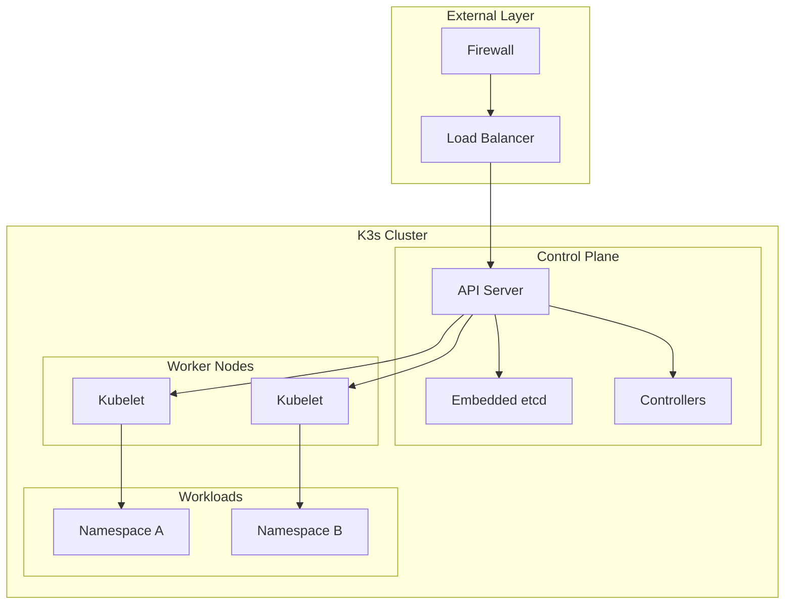
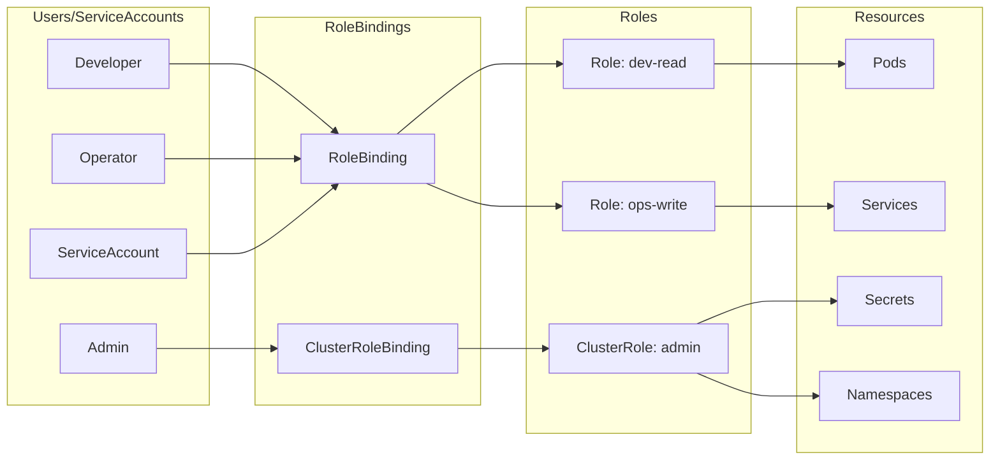
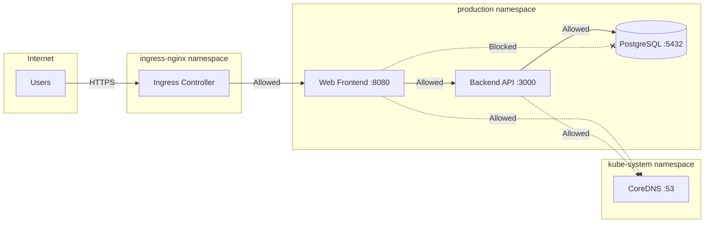
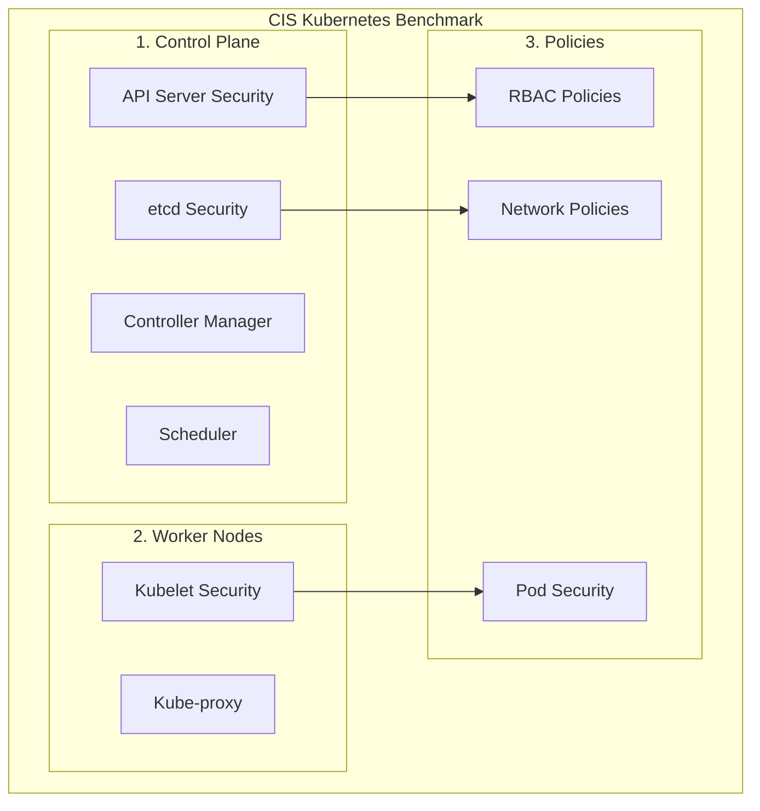

# How to Secure K3s Cluster

Author: [nawazdhandala](https://www.github.com/nawazdhandala)

Tags: K3s, Kubernetes, Security, RBAC, Network Policies, CIS Benchmark, Secret Encryption, DevOps

Description: A comprehensive guide to securing your K3s cluster with RBAC configuration, network policies, secret encryption at rest, and CIS benchmark compliance for production-ready deployments.

---

> "Security is not a product, but a process." - Bruce Schneier

K3s is a lightweight, certified Kubernetes distribution perfect for edge computing, IoT, and resource-constrained environments. However, its simplicity does not mean you can skip security hardening. This guide walks you through securing K3s from installation to production.

## Security Architecture Overview

Before diving into configurations, let us understand the security layers in a K3s cluster.



## Secure K3s Installation

The security journey begins at installation. K3s provides several flags to harden the cluster from the start.

### Install K3s with Security Hardening Flags

```bash
# Install K3s server with security hardening options
# --secrets-encryption: Enables encryption of secrets at rest
# --protect-kernel-defaults: Prevents kubelet from modifying kernel parameters
# --kube-apiserver-arg: Passes additional arguments to the API server
curl -sfL https://get.k3s.io | INSTALL_K3S_EXEC="server \
  --secrets-encryption \
  --protect-kernel-defaults \
  --kube-apiserver-arg='audit-log-path=/var/log/k3s-audit.log' \
  --kube-apiserver-arg='audit-log-maxage=30' \
  --kube-apiserver-arg='audit-log-maxbackup=10' \
  --kube-apiserver-arg='audit-log-maxsize=100' \
  --kube-apiserver-arg='anonymous-auth=false' \
  --kube-apiserver-arg='authorization-mode=RBAC,Node'" sh -
```

### Configure Kernel Parameters for Security

Before installing K3s with `--protect-kernel-defaults`, ensure your system has the correct kernel parameters.

```bash
# /etc/sysctl.d/90-kubelet.conf
# Required kernel parameters for CIS compliance

# Enable IP forwarding for pod networking
net.ipv4.ip_forward = 1

# Disable IPv6 if not needed (reduces attack surface)
net.ipv6.conf.all.disable_ipv6 = 1
net.ipv6.conf.default.disable_ipv6 = 1

# Protect against SYN flood attacks
net.ipv4.tcp_syncookies = 1
net.ipv4.tcp_max_syn_backlog = 2048
net.ipv4.tcp_synack_retries = 2

# Disable source routing (prevent IP spoofing)
net.ipv4.conf.all.accept_source_route = 0
net.ipv4.conf.default.accept_source_route = 0

# Enable reverse path filtering
net.ipv4.conf.all.rp_filter = 1
net.ipv4.conf.default.rp_filter = 1

# Ignore ICMP redirects
net.ipv4.conf.all.accept_redirects = 0
net.ipv4.conf.default.accept_redirects = 0
net.ipv4.conf.all.secure_redirects = 0
net.ipv4.conf.default.secure_redirects = 0

# Do not send ICMP redirects
net.ipv4.conf.all.send_redirects = 0
net.ipv4.conf.default.send_redirects = 0

# Log martian packets
net.ipv4.conf.all.log_martians = 1
```

Apply the configuration:

```bash
# Apply kernel parameters
sudo sysctl --system
```

## RBAC Configuration

Role-Based Access Control (RBAC) is essential for controlling who can do what in your cluster.



### Create a Restricted Developer Role

```yaml
# developer-role.yaml
# This Role grants read access to common resources
# and limited write access to pods and deployments
apiVersion: rbac.authorization.k8s.io/v1
kind: Role
metadata:
  namespace: development  # Role is namespace-scoped
  name: developer
rules:
  # Read access to pods, services, and configmaps
  - apiGroups: [""]
    resources: ["pods", "pods/log", "services", "configmaps"]
    verbs: ["get", "list", "watch"]

  # Full access to deployments for CI/CD
  - apiGroups: ["apps"]
    resources: ["deployments"]
    verbs: ["get", "list", "watch", "create", "update", "patch"]

  # Exec into pods for debugging (consider restricting in production)
  - apiGroups: [""]
    resources: ["pods/exec"]
    verbs: ["create"]

  # Port forwarding for local development
  - apiGroups: [""]
    resources: ["pods/portforward"]
    verbs: ["create"]
---
# Bind the role to a specific user
apiVersion: rbac.authorization.k8s.io/v1
kind: RoleBinding
metadata:
  name: developer-binding
  namespace: development
subjects:
  - kind: User
    name: jane.developer@company.com  # User from your identity provider
    apiGroup: rbac.authorization.k8s.io
roleRef:
  kind: Role
  name: developer
  apiGroup: rbac.authorization.k8s.io
```

### Create a Read-Only Cluster Role for Monitoring

```yaml
# monitoring-clusterrole.yaml
# ClusterRole for monitoring systems like Prometheus
# Grants read-only access across all namespaces
apiVersion: rbac.authorization.k8s.io/v1
kind: ClusterRole
metadata:
  name: monitoring-reader
rules:
  # Read access to core resources
  - apiGroups: [""]
    resources:
      - nodes
      - nodes/metrics
      - nodes/proxy
      - pods
      - services
      - endpoints
      - namespaces
    verbs: ["get", "list", "watch"]

  # Read metrics from metrics-server
  - apiGroups: ["metrics.k8s.io"]
    resources: ["pods", "nodes"]
    verbs: ["get", "list"]

  # Access to custom metrics
  - apiGroups: ["custom.metrics.k8s.io"]
    resources: ["*"]
    verbs: ["get", "list"]

  # Non-resource URLs for /metrics endpoints
  - nonResourceURLs: ["/metrics", "/metrics/*"]
    verbs: ["get"]
---
# ServiceAccount for Prometheus
apiVersion: v1
kind: ServiceAccount
metadata:
  name: prometheus
  namespace: monitoring
---
# Bind ClusterRole to ServiceAccount
apiVersion: rbac.authorization.k8s.io/v1
kind: ClusterRoleBinding
metadata:
  name: prometheus-monitoring
subjects:
  - kind: ServiceAccount
    name: prometheus
    namespace: monitoring
roleRef:
  kind: ClusterRole
  name: monitoring-reader
  apiGroup: rbac.authorization.k8s.io
```

### Restrict ServiceAccount Token Auto-Mounting

```yaml
# secure-serviceaccount.yaml
# ServiceAccount with disabled auto-mount
# Pods using this account must explicitly request tokens
apiVersion: v1
kind: ServiceAccount
metadata:
  name: secure-app
  namespace: production
automountServiceAccountToken: false  # Disable automatic token mounting
---
# Pod that explicitly mounts the token when needed
apiVersion: v1
kind: Pod
metadata:
  name: secure-pod
  namespace: production
spec:
  serviceAccountName: secure-app
  automountServiceAccountToken: false  # Also disable at pod level
  containers:
    - name: app
      image: myapp:latest
      # If token is needed, mount it explicitly with reduced permissions
      volumeMounts:
        - name: token
          mountPath: /var/run/secrets/kubernetes.io/serviceaccount
          readOnly: true
  volumes:
    - name: token
      projected:
        sources:
          - serviceAccountToken:
              path: token
              expirationSeconds: 3600  # Short-lived token (1 hour)
              audience: api  # Limit token audience
```

## Network Policies

Network Policies control traffic flow between pods. K3s uses Flannel by default, which does not support Network Policies. Install a CNI that does.

### Install Calico for Network Policy Support

```bash
# Disable Flannel and install Calico during K3s installation
curl -sfL https://get.k3s.io | INSTALL_K3S_EXEC="server \
  --flannel-backend=none \
  --disable-network-policy \
  --cluster-cidr=10.42.0.0/16" sh -

# Install Calico operator
kubectl create -f https://raw.githubusercontent.com/projectcalico/calico/v3.27.0/manifests/tigera-operator.yaml

# Configure Calico for K3s
kubectl apply -f - <<EOF
apiVersion: operator.tigera.io/v1
kind: Installation
metadata:
  name: default
spec:
  calicoNetwork:
    ipPools:
      - blockSize: 26
        cidr: 10.42.0.0/16
        encapsulation: VXLANCrossSubnet
        natOutgoing: Enabled
        nodeSelector: all()
EOF
```

### Default Deny All Traffic

```yaml
# default-deny.yaml
# Apply to every namespace to implement zero-trust networking
# Denies all ingress and egress traffic by default
apiVersion: networking.k8s.io/v1
kind: NetworkPolicy
metadata:
  name: default-deny-all
  namespace: production  # Apply per namespace
spec:
  podSelector: {}  # Matches all pods in namespace
  policyTypes:
    - Ingress
    - Egress
```

### Allow Only Required Traffic

```yaml
# app-network-policy.yaml
# Define explicit allow rules for your application
apiVersion: networking.k8s.io/v1
kind: NetworkPolicy
metadata:
  name: web-app-policy
  namespace: production
spec:
  podSelector:
    matchLabels:
      app: web-frontend
  policyTypes:
    - Ingress
    - Egress
  ingress:
    # Allow traffic from ingress controller
    - from:
        - namespaceSelector:
            matchLabels:
              kubernetes.io/metadata.name: ingress-nginx
          podSelector:
            matchLabels:
              app.kubernetes.io/name: ingress-nginx
      ports:
        - protocol: TCP
          port: 8080
  egress:
    # Allow DNS resolution
    - to:
        - namespaceSelector:
            matchLabels:
              kubernetes.io/metadata.name: kube-system
          podSelector:
            matchLabels:
              k8s-app: kube-dns
      ports:
        - protocol: UDP
          port: 53
        - protocol: TCP
          port: 53
    # Allow traffic to backend API
    - to:
        - podSelector:
            matchLabels:
              app: backend-api
      ports:
        - protocol: TCP
          port: 3000
---
# Backend API can only talk to database
apiVersion: networking.k8s.io/v1
kind: NetworkPolicy
metadata:
  name: backend-api-policy
  namespace: production
spec:
  podSelector:
    matchLabels:
      app: backend-api
  policyTypes:
    - Ingress
    - Egress
  ingress:
    # Only accept from web frontend
    - from:
        - podSelector:
            matchLabels:
              app: web-frontend
      ports:
        - protocol: TCP
          port: 3000
  egress:
    # Allow DNS
    - to:
        - namespaceSelector:
            matchLabels:
              kubernetes.io/metadata.name: kube-system
      ports:
        - protocol: UDP
          port: 53
    # Allow database connection
    - to:
        - podSelector:
            matchLabels:
              app: postgres
      ports:
        - protocol: TCP
          port: 5432
```

### Network Policy Flow Visualization



## Secret Encryption at Rest

K3s stores secrets in its embedded etcd database. By default, secrets are only base64 encoded, not encrypted.

### Enable Secret Encryption

```bash
# K3s automatically enables encryption when started with --secrets-encryption
# Verify encryption is enabled
sudo k3s secrets-encrypt status

# Example output:
# Encryption Status: Enabled
# Current Rotation Stage: start
# Server Encryption Hashes: All hashes match
```

### Configure Custom Encryption

```yaml
# /var/lib/rancher/k3s/server/cred/encryption-config.yaml
# Custom encryption configuration with multiple providers
apiVersion: apiserver.config.k8s.io/v1
kind: EncryptionConfiguration
resources:
  - resources:
      - secrets
      - configmaps  # Optionally encrypt ConfigMaps too
    providers:
      # AES-GCM is recommended for performance
      - aesgcm:
          keys:
            - name: key1
              secret: <base64-encoded-32-byte-key>  # Generate with: head -c 32 /dev/urandom | base64
      # AES-CBC as fallback
      - aescbc:
          keys:
            - name: key2
              secret: <base64-encoded-32-byte-key>
      # Identity provider allows reading unencrypted data during rotation
      - identity: {}
```

### Generate Encryption Key

```bash
# Generate a secure 32-byte key for AES encryption
# This key must be kept secure - losing it means losing access to secrets
head -c 32 /dev/urandom | base64

# Store the key securely (e.g., in a hardware security module or vault)
# Never commit encryption keys to version control
```

### Rotate Encryption Keys

```bash
# Prepare new encryption key (updates config, does not re-encrypt)
sudo k3s secrets-encrypt prepare

# Rotate all secrets to use the new key
sudo k3s secrets-encrypt rotate

# Reencrypt all secrets with the new key
sudo k3s secrets-encrypt reencrypt

# Verify rotation completed
sudo k3s secrets-encrypt status
```

### Using External Secrets Operator

For production environments, consider using External Secrets Operator with a secrets manager.

```yaml
# external-secret.yaml
# Fetch secrets from AWS Secrets Manager, HashiCorp Vault, etc.
apiVersion: external-secrets.io/v1beta1
kind: ExternalSecret
metadata:
  name: database-credentials
  namespace: production
spec:
  refreshInterval: 1h  # Sync every hour
  secretStoreRef:
    kind: ClusterSecretStore
    name: vault-backend
  target:
    name: database-credentials  # Name of the K8s secret to create
    creationPolicy: Owner
    template:
      engineVersion: v2
      data:
        # Template the secret data
        username: "{{ .username }}"
        password: "{{ .password }}"
        connection_string: "postgresql://{{ .username }}:{{ .password }}@postgres:5432/app"
  data:
    - secretKey: username
      remoteRef:
        key: production/database
        property: username
    - secretKey: password
      remoteRef:
        key: production/database
        property: password
```

## CIS Benchmark Compliance

The Center for Internet Security (CIS) provides benchmarks for securing Kubernetes clusters. K3s can be configured to meet many of these requirements.



### Run CIS Benchmark Audit

```bash
# Install kube-bench for CIS benchmark scanning
# kube-bench checks your cluster against CIS benchmarks
kubectl apply -f https://raw.githubusercontent.com/aquasecurity/kube-bench/main/job.yaml

# Wait for the job to complete
kubectl wait --for=condition=complete job/kube-bench -n default --timeout=300s

# View the results
kubectl logs job/kube-bench

# For K3s-specific checks, use the k3s configuration
kubectl apply -f - <<EOF
apiVersion: batch/v1
kind: Job
metadata:
  name: kube-bench-k3s
spec:
  template:
    spec:
      hostPID: true
      containers:
        - name: kube-bench
          image: aquasec/kube-bench:latest
          command: ["kube-bench", "--config-dir", "/etc/kube-bench/cfg", "--config", "/etc/kube-bench/cfg/config.yaml"]
          volumeMounts:
            - name: var-lib-rancher
              mountPath: /var/lib/rancher
              readOnly: true
            - name: etc-rancher
              mountPath: /etc/rancher
              readOnly: true
      restartPolicy: Never
      volumes:
        - name: var-lib-rancher
          hostPath:
            path: /var/lib/rancher
        - name: etc-rancher
          hostPath:
            path: /etc/rancher
  backoffLimit: 0
EOF
```

### API Server Hardening

```bash
# K3s server configuration for CIS compliance
# Add these arguments to INSTALL_K3S_EXEC or /etc/rancher/k3s/config.yaml

# /etc/rancher/k3s/config.yaml
# CIS 1.2.1 - Ensure anonymous auth is disabled
kube-apiserver-arg:
  - "anonymous-auth=false"

# CIS 1.2.2 - Use RBAC authorization
  - "authorization-mode=RBAC,Node"

# CIS 1.2.6 - Ensure audit logging is enabled
  - "audit-log-path=/var/log/k3s/audit.log"
  - "audit-log-maxage=30"
  - "audit-log-maxbackup=10"
  - "audit-log-maxsize=100"
  - "audit-policy-file=/var/lib/rancher/k3s/server/audit-policy.yaml"

# CIS 1.2.10 - Ensure admission controllers are enabled
  - "enable-admission-plugins=NodeRestriction,PodSecurity"

# CIS 1.2.16 - Secure communication with etcd
  - "etcd-cafile=/var/lib/rancher/k3s/server/tls/etcd/server-ca.crt"
  - "etcd-certfile=/var/lib/rancher/k3s/server/tls/etcd/client.crt"
  - "etcd-keyfile=/var/lib/rancher/k3s/server/tls/etcd/client.key"

# CIS 1.2.22 - Set request timeout
  - "request-timeout=300s"

# CIS 1.2.29 - Ensure API server TLS config is secure
  - "tls-min-version=VersionTLS12"
  - "tls-cipher-suites=TLS_ECDHE_ECDSA_WITH_AES_128_GCM_SHA256,TLS_ECDHE_RSA_WITH_AES_128_GCM_SHA256,TLS_ECDHE_ECDSA_WITH_AES_256_GCM_SHA384,TLS_ECDHE_RSA_WITH_AES_256_GCM_SHA384"
```

### Audit Policy Configuration

```yaml
# /var/lib/rancher/k3s/server/audit-policy.yaml
# Kubernetes audit policy for security monitoring
apiVersion: audit.k8s.io/v1
kind: Policy
rules:
  # Log authentication failures at Metadata level
  - level: Metadata
    resources:
      - group: "authentication.k8s.io"
        resources: ["*"]

  # Log all changes to secrets at Metadata level (content hidden for security)
  - level: Metadata
    resources:
      - group: ""
        resources: ["secrets"]

  # Log changes to RBAC at RequestResponse level
  - level: RequestResponse
    resources:
      - group: "rbac.authorization.k8s.io"
        resources: ["*"]

  # Log pod creation and deletion at Request level
  - level: Request
    resources:
      - group: ""
        resources: ["pods"]
    verbs: ["create", "delete", "patch", "update"]

  # Log exec/attach/portforward at Request level
  - level: Request
    resources:
      - group: ""
        resources: ["pods/exec", "pods/attach", "pods/portforward"]

  # Skip logging read-only requests to common endpoints
  - level: None
    users: ["system:kube-proxy"]
    verbs: ["watch"]
    resources:
      - group: ""
        resources: ["endpoints", "services"]

  # Skip logging health checks
  - level: None
    nonResourceURLs:
      - "/healthz*"
      - "/readyz*"
      - "/livez*"

  # Default: log everything else at Metadata level
  - level: Metadata
```

### Pod Security Standards

```yaml
# namespace-with-pod-security.yaml
# Enforce Pod Security Standards at namespace level
# This is the replacement for deprecated PodSecurityPolicy
apiVersion: v1
kind: Namespace
metadata:
  name: production
  labels:
    # Enforce restricted profile - most secure
    pod-security.kubernetes.io/enforce: restricted
    pod-security.kubernetes.io/enforce-version: latest
    # Warn about baseline violations
    pod-security.kubernetes.io/warn: restricted
    pod-security.kubernetes.io/warn-version: latest
    # Audit all violations
    pod-security.kubernetes.io/audit: restricted
    pod-security.kubernetes.io/audit-version: latest
---
# Example compliant pod for restricted namespace
apiVersion: v1
kind: Pod
metadata:
  name: secure-pod
  namespace: production
spec:
  securityContext:
    runAsNonRoot: true  # Required: must not run as root
    runAsUser: 1000     # Run as non-root user
    runAsGroup: 1000
    fsGroup: 1000
    seccompProfile:
      type: RuntimeDefault  # Required: use default seccomp profile
  containers:
    - name: app
      image: myapp:latest
      securityContext:
        allowPrivilegeEscalation: false  # Required: prevent privilege escalation
        readOnlyRootFilesystem: true     # Recommended: read-only filesystem
        capabilities:
          drop:
            - ALL  # Required: drop all capabilities
      resources:
        limits:
          memory: "256Mi"
          cpu: "500m"
        requests:
          memory: "128Mi"
          cpu: "250m"
```

### Kubelet Security Configuration

```yaml
# /etc/rancher/k3s/config.yaml
# Kubelet security settings for CIS compliance

# CIS 4.2.1 - Disable anonymous authentication
kubelet-arg:
  - "anonymous-auth=false"

# CIS 4.2.2 - Ensure authorization is not set to AlwaysAllow
  - "authorization-mode=Webhook"

# CIS 4.2.4 - Verify client CA
  - "client-ca-file=/var/lib/rancher/k3s/agent/client-ca.crt"

# CIS 4.2.6 - Protect kernel defaults
protect-kernel-defaults: true

# CIS 4.2.10 - Rotate certificates automatically
  - "rotate-certificates=true"

# CIS 4.2.11 - Set certificate rotation
  - "rotate-server-certificates=true"

# CIS 4.2.12 - Ensure TLS cipher suites
  - "tls-min-version=VersionTLS12"
  - "tls-cipher-suites=TLS_ECDHE_ECDSA_WITH_AES_128_GCM_SHA256,TLS_ECDHE_RSA_WITH_AES_128_GCM_SHA256"
```

## Additional Security Measures

### Secure Node Access

```bash
# Restrict SSH access to K3s nodes
# /etc/ssh/sshd_config additions

# Disable root login
PermitRootLogin no

# Use key-based authentication only
PasswordAuthentication no
PubkeyAuthentication yes

# Limit users who can SSH
AllowUsers admin

# Use strong ciphers
Ciphers chacha20-poly1305@openssh.com,aes256-gcm@openssh.com,aes128-gcm@openssh.com

# Restart SSH service after changes
sudo systemctl restart sshd
```

### Enable Firewall Rules

```bash
# Configure firewall for K3s nodes using iptables
# Allow SSH
sudo iptables -A INPUT -p tcp --dport 22 -j ACCEPT

# Allow K3s API server (control plane only)
sudo iptables -A INPUT -p tcp --dport 6443 -j ACCEPT

# Allow Flannel VXLAN (if using Flannel)
sudo iptables -A INPUT -p udp --dport 8472 -j ACCEPT

# Allow kubelet metrics
sudo iptables -A INPUT -p tcp --dport 10250 -j ACCEPT

# Allow etcd (control plane only, for HA clusters)
sudo iptables -A INPUT -p tcp --dport 2379:2380 -j ACCEPT

# Drop all other incoming traffic
sudo iptables -A INPUT -j DROP

# Save iptables rules
sudo iptables-save > /etc/iptables/rules.v4
```

### Image Security with Admission Controllers

```yaml
# image-policy-webhook.yaml
# Restrict which container registries can be used
apiVersion: admissionregistration.k8s.io/v1
kind: ValidatingWebhookConfiguration
metadata:
  name: image-policy
webhooks:
  - name: image-policy.security.io
    rules:
      - apiGroups: [""]
        apiVersions: ["v1"]
        operations: ["CREATE", "UPDATE"]
        resources: ["pods"]
    clientConfig:
      service:
        name: image-policy-webhook
        namespace: security
        path: "/validate"
      caBundle: <ca-bundle>
    admissionReviewVersions: ["v1"]
    sideEffects: None
    failurePolicy: Fail
---
# Use OPA Gatekeeper for image policy
# Constraint template to allow only trusted registries
apiVersion: templates.gatekeeper.sh/v1
kind: ConstraintTemplate
metadata:
  name: k8sallowedrepos
spec:
  crd:
    spec:
      names:
        kind: K8sAllowedRepos
      validation:
        openAPIV3Schema:
          type: object
          properties:
            repos:
              type: array
              items:
                type: string
  targets:
    - target: admission.k8s.gatekeeper.sh
      rego: |
        package k8sallowedrepos

        violation[{"msg": msg}] {
          container := input.review.object.spec.containers[_]
          satisfied := [good | repo = input.parameters.repos[_] ; good = startswith(container.image, repo)]
          not any(satisfied)
          msg := sprintf("container <%v> has an invalid image repo <%v>, allowed repos are %v", [container.name, container.image, input.parameters.repos])
        }
---
# Apply the constraint
apiVersion: constraints.gatekeeper.sh/v1beta1
kind: K8sAllowedRepos
metadata:
  name: allowed-repos
spec:
  match:
    kinds:
      - apiGroups: [""]
        kinds: ["Pod"]
    namespaces:
      - production
  parameters:
    repos:
      - "gcr.io/my-project/"
      - "docker.io/mycompany/"
      - "registry.company.internal/"
```

## Security Monitoring with OneUptime

After hardening your K3s cluster, monitoring is essential to detect security incidents. [OneUptime](https://oneuptime.com) provides comprehensive observability for Kubernetes clusters.

```yaml
# oneuptime-agent.yaml
# Deploy OneUptime agent for security monitoring
apiVersion: v1
kind: Namespace
metadata:
  name: oneuptime
  labels:
    pod-security.kubernetes.io/enforce: privileged  # Agent needs host access
---
apiVersion: apps/v1
kind: DaemonSet
metadata:
  name: oneuptime-agent
  namespace: oneuptime
spec:
  selector:
    matchLabels:
      app: oneuptime-agent
  template:
    metadata:
      labels:
        app: oneuptime-agent
    spec:
      serviceAccountName: oneuptime-agent
      containers:
        - name: agent
          image: oneuptime/agent:latest
          env:
            - name: ONEUPTIME_URL
              value: "https://oneuptime.com"
            - name: ONEUPTIME_SECRET_KEY
              valueFrom:
                secretKeyRef:
                  name: oneuptime-credentials
                  key: secret-key
          volumeMounts:
            - name: logs
              mountPath: /var/log
              readOnly: true
      volumes:
        - name: logs
          hostPath:
            path: /var/log
```

OneUptime can monitor:
- API server audit logs for suspicious activity
- Failed authentication attempts
- RBAC permission changes
- Network policy violations
- Pod security standard violations
- Resource usage anomalies

## Security Checklist

Use this checklist to verify your K3s cluster security:

- [ ] K3s installed with `--secrets-encryption` flag
- [ ] Anonymous authentication disabled on API server
- [ ] RBAC enabled and properly configured
- [ ] ServiceAccount token auto-mounting disabled by default
- [ ] Network policies implemented with default deny
- [ ] Pod Security Standards enforced at namespace level
- [ ] Audit logging enabled with proper retention
- [ ] TLS minimum version set to 1.2
- [ ] Strong cipher suites configured
- [ ] CIS benchmark scan passing
- [ ] Container images pulled only from trusted registries
- [ ] Node SSH access restricted
- [ ] Firewall rules configured
- [ ] Monitoring and alerting in place

---

Securing K3s requires a defense-in-depth approach. Start with the installation flags, add RBAC policies, implement network segmentation, encrypt your secrets, and continuously monitor for threats. A lightweight distribution does not mean lightweight security - apply the same rigor you would to any production Kubernetes cluster.
