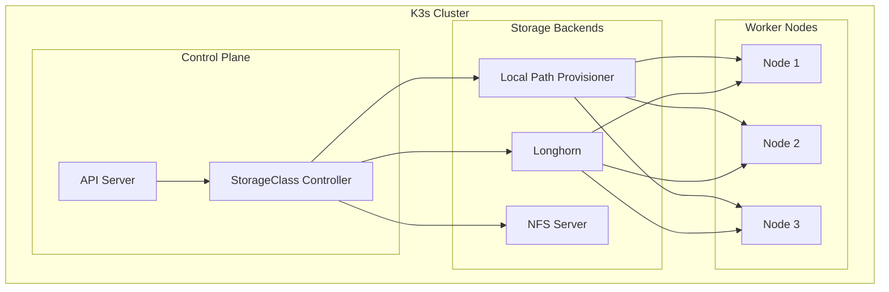
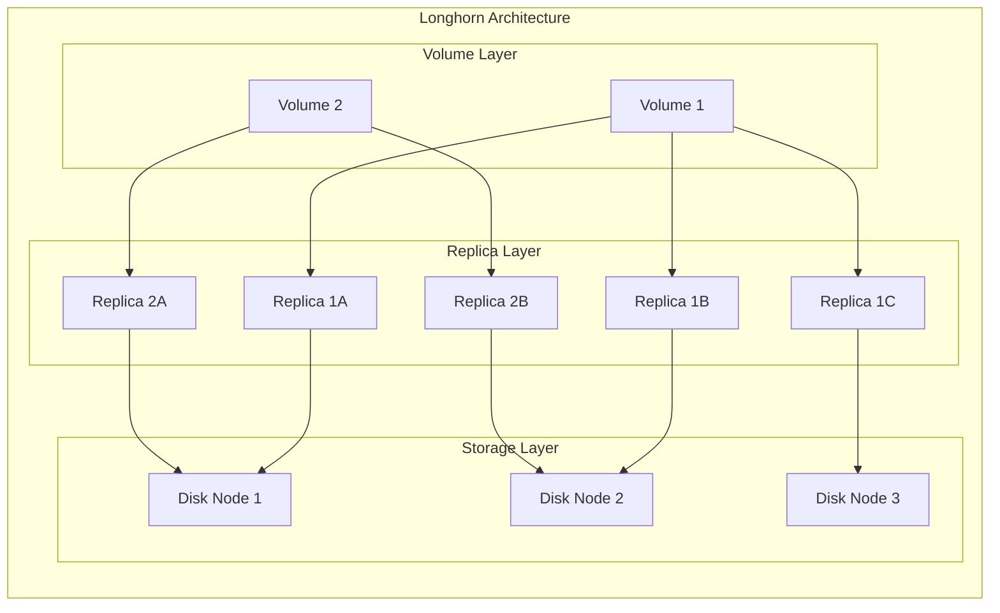
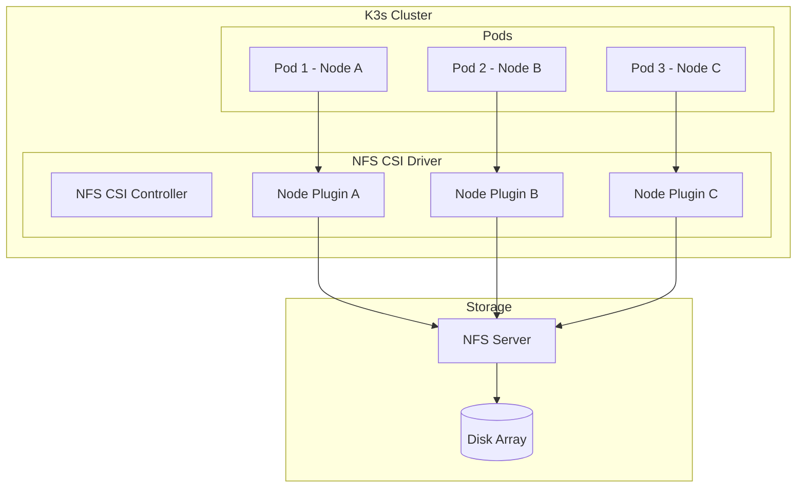
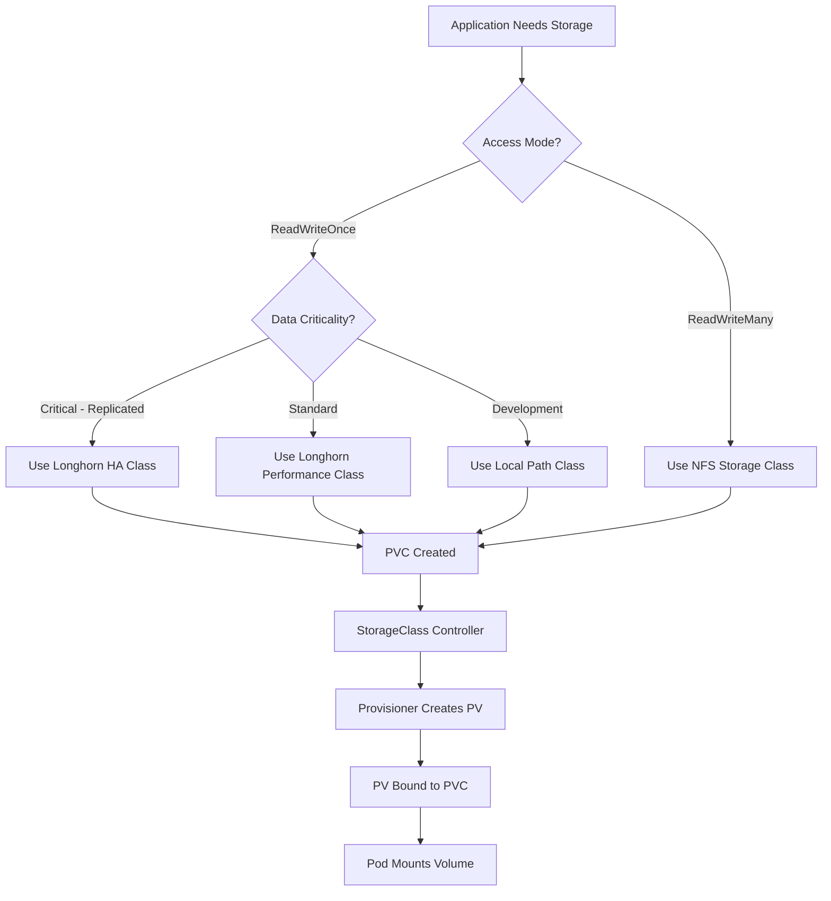

# How to Configure K3s Storage Classes

Author: [nawazdhandala](https://github.com/nawazdhandala)

Tags: K3s, Kubernetes, Storage, Longhorn, NFS, DevOps, Bare Metal, Edge Computing

Description: A comprehensive guide to configuring storage classes in K3s, covering the built-in local path provisioner, Longhorn for replicated block storage, NFS for shared filesystems, and dynamic provisioning patterns for production workloads.

---

> "Storage is the silent partner in every Kubernetes deployment. Get it wrong, and your stateful workloads become ticking time bombs. Get it right, and your cluster hums along without drama."

K3s ships with a lightweight storage solution out of the box, but production workloads often demand more: replicated volumes, shared filesystems, or integration with existing NFS infrastructure. This guide walks through configuring storage classes in K3s, from the default local path provisioner to enterprise-grade options like Longhorn and NFS.

## Understanding K3s Storage Architecture

K3s simplifies Kubernetes by bundling essential components, including a default storage class. Before configuring custom storage, understand how the pieces fit together.



## Local Path Provisioner: The Default Option

K3s includes Rancher's Local Path Provisioner by default. It creates volumes on the node's local filesystem, making it perfect for development and single-node clusters.

### How It Works

The local path provisioner watches for PersistentVolumeClaim (PVC) resources and automatically creates directories on the node where the pod is scheduled.

```yaml
# Check the default storage class
# This command shows the built-in local-path storage class
apiVersion: storage.k8s.io/v1
kind: StorageClass
metadata:
  name: local-path
  annotations:
    # This annotation marks it as the default storage class
    storageclass.kubernetes.io/is-default-class: "true"
provisioner: rancher.io/local-path
volumeBindingMode: WaitForFirstConsumer
reclaimPolicy: Delete
```

### Using the Local Path Provisioner

Create a PVC that uses the default storage class:

```yaml
# pvc-local-path.yaml
# This PVC will automatically use the local-path storage class
apiVersion: v1
kind: PersistentVolumeClaim
metadata:
  name: app-data
  namespace: default
spec:
  # No storageClassName needed - uses the default
  accessModes:
    - ReadWriteOnce  # Local path only supports RWO
  resources:
    requests:
      storage: 10Gi  # Requested storage size
```

Deploy a pod that uses this storage:

```yaml
# pod-with-storage.yaml
# Example pod mounting the local path PVC
apiVersion: v1
kind: Pod
metadata:
  name: app-with-storage
  namespace: default
spec:
  containers:
    - name: app
      image: nginx:alpine
      volumeMounts:
        - name: data
          mountPath: /data  # Mount point inside the container
  volumes:
    - name: data
      persistentVolumeClaim:
        claimName: app-data  # Reference to the PVC
```

### Customizing the Local Path Provisioner

You can customize where volumes are stored by editing the ConfigMap:

```yaml
# custom-local-path-config.yaml
# Modify the default storage location
apiVersion: v1
kind: ConfigMap
metadata:
  name: local-path-config
  namespace: kube-system
data:
  # Change the base path for volume storage
  config.json: |-
    {
      "nodePathMap": [
        {
          "node": "DEFAULT_PATH_FOR_NON_LISTED_NODES",
          "paths": ["/opt/k3s-storage"]
        },
        {
          "node": "worker-node-1",
          "paths": ["/mnt/fast-ssd/k3s-storage"]
        },
        {
          "node": "worker-node-2",
          "paths": ["/mnt/nvme/k3s-storage"]
        }
      ]
    }
```

Apply with:

```bash
# Apply the custom configuration
kubectl apply -f custom-local-path-config.yaml

# Restart the provisioner to pick up changes
kubectl rollout restart deployment local-path-provisioner -n kube-system
```

### Limitations of Local Path

- **No replication**: Data lives on a single node
- **No shared access**: Only ReadWriteOnce is supported
- **Node affinity required**: Pods must schedule on the same node as their data

## Longhorn: Replicated Block Storage for K3s

Longhorn provides distributed block storage with automatic replication, snapshots, and backups. It is the natural upgrade from local path when you need data resilience.

### Architecture Overview



### Installing Longhorn on K3s

First, ensure prerequisites are met:

```bash
# Install required packages on all nodes (Debian/Ubuntu)
sudo apt-get update
sudo apt-get install -y open-iscsi nfs-common

# Enable and start iscsid
sudo systemctl enable iscsid
sudo systemctl start iscsid

# Verify iscsi is running
sudo systemctl status iscsid
```

Install Longhorn using Helm:

```bash
# Add the Longhorn Helm repository
helm repo add longhorn https://charts.longhorn.io
helm repo update

# Create namespace for Longhorn
kubectl create namespace longhorn-system

# Install Longhorn with custom values
helm install longhorn longhorn/longhorn \
  --namespace longhorn-system \
  --set defaultSettings.defaultDataPath="/var/lib/longhorn" \
  --set defaultSettings.defaultReplicaCount=3 \
  --set defaultSettings.storageMinimalAvailablePercentage=15 \
  --set persistence.defaultClassReplicaCount=3
```

### Creating a Longhorn Storage Class

```yaml
# longhorn-storage-class.yaml
# Custom storage class with specific replica and performance settings
apiVersion: storage.k8s.io/v1
kind: StorageClass
metadata:
  name: longhorn-fast
  annotations:
    # Set as default if you want Longhorn to be the primary storage
    storageclass.kubernetes.io/is-default-class: "false"
provisioner: driver.longhorn.io
allowVolumeExpansion: true  # Allow online volume expansion
reclaimPolicy: Retain       # Keep data after PVC deletion
volumeBindingMode: Immediate
parameters:
  # Number of replicas for data redundancy
  numberOfReplicas: "3"
  # Use best-effort locality for replica scheduling
  dataLocality: "best-effort"
  # Enable automatic snapshots
  recurringJobSelector: '[{"name":"snap-daily", "isGroup":true}]'
  # Filesystem type for the volume
  fsType: "ext4"
```

### Storage Class for Different Workloads

```yaml
# longhorn-storage-classes.yaml
# Multiple storage classes for different use cases
---
# High availability storage for databases
apiVersion: storage.k8s.io/v1
kind: StorageClass
metadata:
  name: longhorn-ha
provisioner: driver.longhorn.io
allowVolumeExpansion: true
reclaimPolicy: Retain
parameters:
  numberOfReplicas: "3"
  dataLocality: "best-effort"
  staleReplicaTimeout: "30"
  fromBackup: ""
---
# Performance-optimized storage with fewer replicas
apiVersion: storage.k8s.io/v1
kind: StorageClass
metadata:
  name: longhorn-performance
provisioner: driver.longhorn.io
allowVolumeExpansion: true
reclaimPolicy: Delete
parameters:
  numberOfReplicas: "2"
  dataLocality: "strict-local"  # Keep data on the same node as pod
  fsType: "xfs"                  # XFS for better large file performance
---
# Budget storage with single replica for non-critical data
apiVersion: storage.k8s.io/v1
kind: StorageClass
metadata:
  name: longhorn-budget
provisioner: driver.longhorn.io
allowVolumeExpansion: true
reclaimPolicy: Delete
parameters:
  numberOfReplicas: "1"
  dataLocality: "disabled"
```

### Configuring Longhorn Backups to S3

```yaml
# longhorn-backup-target.yaml
# Configure S3 backup target for disaster recovery
apiVersion: v1
kind: Secret
metadata:
  name: aws-secret
  namespace: longhorn-system
type: Opaque
stringData:
  # AWS credentials for S3 access
  AWS_ACCESS_KEY_ID: "your-access-key"
  AWS_SECRET_ACCESS_KEY: "your-secret-key"
  AWS_ENDPOINTS: "https://s3.amazonaws.com"
  AWS_REGION: "us-east-1"
```

Configure via kubectl:

```bash
# Set the backup target in Longhorn settings
kubectl -n longhorn-system patch settings.longhorn.io backup-target \
  --type merge \
  -p '{"value": "s3://your-bucket-name@us-east-1/"}'

# Set the backup credential secret
kubectl -n longhorn-system patch settings.longhorn.io backup-target-credential-secret \
  --type merge \
  -p '{"value": "aws-secret"}'
```

## NFS Storage: Shared Filesystem for K3s

NFS provides ReadWriteMany (RWX) access, allowing multiple pods across different nodes to share the same storage. Essential for applications that need shared filesystems.

### NFS Architecture in K3s



### Installing the NFS CSI Driver

```bash
# Install the NFS CSI driver using Helm
helm repo add csi-driver-nfs https://raw.githubusercontent.com/kubernetes-csi/csi-driver-nfs/master/charts
helm repo update

# Install the driver
helm install csi-driver-nfs csi-driver-nfs/csi-driver-nfs \
  --namespace kube-system \
  --set kubeletDir=/var/lib/kubelet \
  --set controller.replicas=2
```

### Creating an NFS Storage Class

```yaml
# nfs-storage-class.yaml
# Storage class for NFS-backed persistent volumes
apiVersion: storage.k8s.io/v1
kind: StorageClass
metadata:
  name: nfs-csi
provisioner: nfs.csi.k8s.io
parameters:
  # NFS server address - can be IP or hostname
  server: nfs-server.example.com
  # Base path on the NFS server
  share: /exports/k3s
  # Subdirectory pattern for each PVC
  # ${pvc.metadata.namespace}-${pvc.metadata.name} creates unique paths
  subDir: "${pvc.metadata.namespace}/${pvc.metadata.name}"
  # Mount options for NFS
  mountPermissions: "0755"
reclaimPolicy: Delete
volumeBindingMode: Immediate
mountOptions:
  - nfsvers=4.1      # NFS version
  - hard             # Hard mount for reliability
  - timeo=600        # Timeout in deciseconds
  - retrans=3        # Number of retries
  - rsize=1048576    # Read buffer size
  - wsize=1048576    # Write buffer size
```

### Using NFS for Shared Storage

```yaml
# shared-storage-pvc.yaml
# PVC that can be mounted by multiple pods
apiVersion: v1
kind: PersistentVolumeClaim
metadata:
  name: shared-media
  namespace: default
spec:
  storageClassName: nfs-csi
  accessModes:
    - ReadWriteMany  # NFS supports RWX access mode
  resources:
    requests:
      storage: 100Gi
---
# deployment-with-shared-storage.yaml
# Deployment where all replicas share the same storage
apiVersion: apps/v1
kind: Deployment
metadata:
  name: media-processor
  namespace: default
spec:
  replicas: 3  # All replicas will share the same NFS volume
  selector:
    matchLabels:
      app: media-processor
  template:
    metadata:
      labels:
        app: media-processor
    spec:
      containers:
        - name: processor
          image: media-processor:latest
          volumeMounts:
            - name: shared-media
              mountPath: /media
      volumes:
        - name: shared-media
          persistentVolumeClaim:
            claimName: shared-media
```

### Setting Up an In-Cluster NFS Server (Optional)

If you do not have an external NFS server, you can run one inside K3s:

```yaml
# in-cluster-nfs-server.yaml
# NFS server running as a Kubernetes deployment
apiVersion: apps/v1
kind: Deployment
metadata:
  name: nfs-server
  namespace: storage
spec:
  replicas: 1
  selector:
    matchLabels:
      app: nfs-server
  template:
    metadata:
      labels:
        app: nfs-server
    spec:
      containers:
        - name: nfs-server
          image: itsthenetwork/nfs-server-alpine:12
          ports:
            - containerPort: 2049
              name: nfs
          securityContext:
            privileged: true  # Required for NFS server
          env:
            - name: SHARED_DIRECTORY
              value: "/exports"
          volumeMounts:
            - name: nfs-storage
              mountPath: /exports
      volumes:
        - name: nfs-storage
          persistentVolumeClaim:
            claimName: nfs-backing-storage  # Use Longhorn for the backing storage
---
apiVersion: v1
kind: Service
metadata:
  name: nfs-server
  namespace: storage
spec:
  ports:
    - port: 2049
      targetPort: 2049
      protocol: TCP
  selector:
    app: nfs-server
  clusterIP: None  # Headless service for stable DNS name
```

## Dynamic Provisioning Patterns

Dynamic provisioning automates storage creation. Here are patterns for different scenarios.

### Storage Class Selection Flow



### StatefulSet with Dynamic Provisioning

```yaml
# statefulset-dynamic-storage.yaml
# StatefulSet with volumeClaimTemplates for automatic PVC creation
apiVersion: apps/v1
kind: StatefulSet
metadata:
  name: postgresql
  namespace: databases
spec:
  serviceName: postgresql
  replicas: 3
  selector:
    matchLabels:
      app: postgresql
  template:
    metadata:
      labels:
        app: postgresql
    spec:
      containers:
        - name: postgresql
          image: postgres:15
          ports:
            - containerPort: 5432
          env:
            - name: POSTGRES_PASSWORD
              valueFrom:
                secretKeyRef:
                  name: postgresql-secret
                  key: password
            - name: PGDATA
              value: /var/lib/postgresql/data/pgdata
          volumeMounts:
            - name: data
              mountPath: /var/lib/postgresql/data
  # VolumeClaimTemplates automatically create PVCs for each replica
  volumeClaimTemplates:
    - metadata:
        name: data
      spec:
        storageClassName: longhorn-ha  # Use HA storage for databases
        accessModes:
          - ReadWriteOnce
        resources:
          requests:
            storage: 50Gi
```

### Namespace-Specific Storage Quotas

```yaml
# storage-quota.yaml
# Limit storage consumption per namespace
apiVersion: v1
kind: ResourceQuota
metadata:
  name: storage-quota
  namespace: team-alpha
spec:
  hard:
    # Total storage requests across all PVCs
    requests.storage: "500Gi"
    # Number of PVCs allowed
    persistentvolumeclaims: "20"
    # Limits per storage class
    longhorn-ha.storageclass.storage.k8s.io/requests.storage: "200Gi"
    longhorn-performance.storageclass.storage.k8s.io/requests.storage: "200Gi"
    nfs-csi.storageclass.storage.k8s.io/requests.storage: "100Gi"
```

### Default Storage Class Override

```bash
# Remove default annotation from local-path
kubectl patch storageclass local-path \
  -p '{"metadata": {"annotations":{"storageclass.kubernetes.io/is-default-class":"false"}}}'

# Set Longhorn as the new default
kubectl patch storageclass longhorn-ha \
  -p '{"metadata": {"annotations":{"storageclass.kubernetes.io/is-default-class":"true"}}}'

# Verify the change
kubectl get storageclass
```

## Monitoring Storage with OneUptime

Proper storage monitoring prevents outages before they happen. Integrate your K3s storage metrics with [OneUptime](https://oneuptime.com) for comprehensive observability.

### Key Storage Metrics to Monitor

```yaml
# prometheus-servicemonitor.yaml
# ServiceMonitor for Longhorn metrics
apiVersion: monitoring.coreos.com/v1
kind: ServiceMonitor
metadata:
  name: longhorn-prometheus
  namespace: monitoring
spec:
  selector:
    matchLabels:
      app: longhorn-manager
  namespaceSelector:
    matchNames:
      - longhorn-system
  endpoints:
    - port: manager
      interval: 30s
      path: /metrics
```

### Critical Alerts to Configure

Monitor these metrics in OneUptime to catch storage issues early:

- **Volume space utilization** - Alert when volumes exceed 80% capacity
- **Replica health** - Alert when replica count drops below desired
- **IOPS and throughput** - Detect performance degradation
- **Backup success rate** - Ensure backups complete successfully
- **NFS mount latency** - Catch network storage slowdowns

```yaml
# example-alert-rules.yaml
# Prometheus alert rules for storage monitoring
apiVersion: monitoring.coreos.com/v1
kind: PrometheusRule
metadata:
  name: storage-alerts
  namespace: monitoring
spec:
  groups:
    - name: storage
      rules:
        # Alert when volume is running low on space
        - alert: VolumeSpaceLow
          expr: |
            (longhorn_volume_actual_size_bytes / longhorn_volume_capacity_bytes) > 0.8
          for: 5m
          labels:
            severity: warning
          annotations:
            summary: "Volume {{ $labels.volume }} is over 80% full"

        # Alert when replicas are degraded
        - alert: LonghornReplicaDegraded
          expr: |
            longhorn_volume_robustness == 2
          for: 5m
          labels:
            severity: critical
          annotations:
            summary: "Volume {{ $labels.volume }} has degraded replicas"
```

## Best Practices Summary

### Storage Class Selection Guide

| Workload Type | Recommended Storage Class | Reason |
|--------------|---------------------------|--------|
| Databases (PostgreSQL, MySQL) | Longhorn HA (3 replicas) | Data durability and automatic failover |
| Cache (Redis, Memcached) | Local Path or Longhorn Budget | Performance over durability |
| Shared Files (CMS, Media) | NFS CSI | ReadWriteMany access required |
| Logs and Metrics | Longhorn Performance | Balance of speed and durability |
| Development/Testing | Local Path | Simplicity and speed |

### Production Checklist

1. **Never use local-path in production** for critical data - it has no redundancy
2. **Set appropriate replica counts** - 3 replicas for critical data, 2 for standard
3. **Configure backup targets** - Longhorn backups to S3 or NFS
4. **Implement storage quotas** - Prevent runaway PVC consumption
5. **Monitor storage health** - Use OneUptime for alerts and dashboards
6. **Test failover scenarios** - Verify data survives node failures
7. **Document recovery procedures** - Know how to restore from backups

## Conclusion

K3s provides flexibility in storage configuration, from the simple local path provisioner to enterprise-grade solutions like Longhorn. Choose your storage class based on your workload requirements:

- **Local Path**: Development, single-node clusters, ephemeral data
- **Longhorn**: Production workloads needing replication and snapshots
- **NFS**: Shared storage for multi-pod access

Remember that storage is foundational to your applications. Invest time in proper configuration, monitoring with tools like [OneUptime](https://oneuptime.com), and regular disaster recovery testing. Your future self will thank you when that 3 AM alert turns out to be a non-event because your storage layer handled it automatically.
