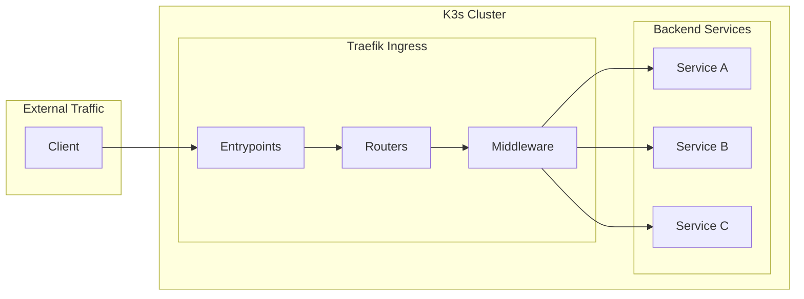
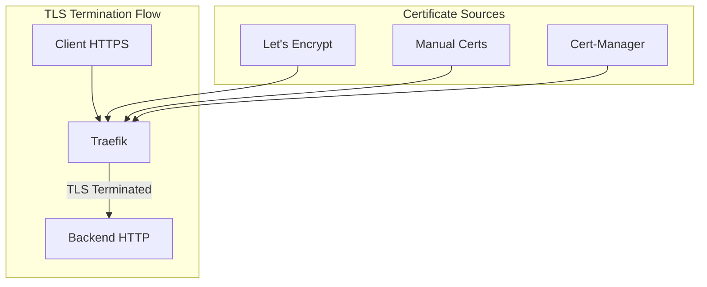
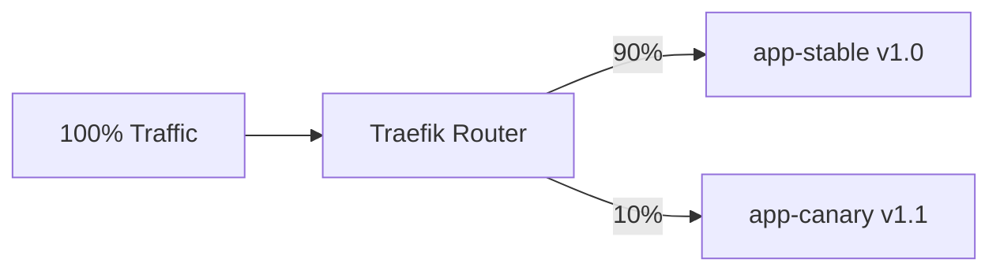
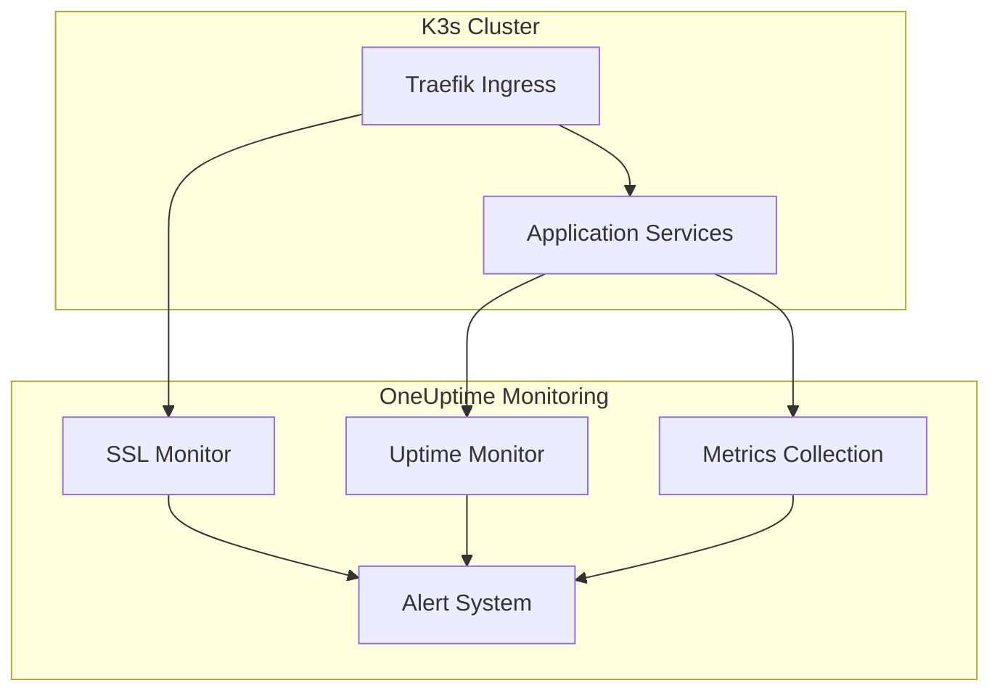

# How to Use K3s with Traefik

By [Nawaz Dhandala](https://github.com/nawazdhandala)

Tags: K3s, Traefik, Kubernetes, Ingress, TLS, DevOps, Load Balancing, Middleware

Description: A comprehensive guide to using Traefik as the default ingress controller in K3s, covering IngressRoutes, TLS configuration, middleware, and advanced routing patterns.

---

> "Simplicity is the ultimate sophistication." - Leonardo da Vinci

K3s ships with Traefik as its default ingress controller, making it incredibly easy to expose your services to the outside world. This guide covers everything from basic configuration to advanced routing patterns with TLS and middleware.

## Understanding K3s and Traefik Integration

K3s is a lightweight Kubernetes distribution that includes Traefik v2 by default. When you install K3s, Traefik is automatically deployed as a DaemonSet, ready to handle ingress traffic.



### Verifying Traefik Installation

After installing K3s, verify that Traefik is running:

```bash
# Check Traefik pods in the kube-system namespace
kubectl get pods -n kube-system | grep traefik

# Expected output:
# traefik-7cd4fcff68-xxxxx   1/1     Running   0   5m

# Check Traefik service
kubectl get svc -n kube-system traefik
```

### Traefik Dashboard Access

Traefik includes a dashboard for monitoring. Enable it by port-forwarding:

```bash
# Port forward to access the Traefik dashboard
kubectl port-forward -n kube-system \
  $(kubectl get pods -n kube-system -l app.kubernetes.io/name=traefik -o jsonpath='{.items[0].metadata.name}') \
  9000:9000

# Access dashboard at http://localhost:9000/dashboard/
```

## Configuring the Built-in Traefik

K3s configures Traefik using a HelmChartConfig resource. You can customize Traefik by creating a configuration file.

### Basic Traefik Configuration

```yaml
# /var/lib/rancher/k3s/server/manifests/traefik-config.yaml
# This file customizes the default Traefik installation in K3s

apiVersion: helm.cattle.io/v1
kind: HelmChartConfig
metadata:
  name: traefik
  namespace: kube-system
spec:
  valuesContent: |-
    # Enable access logs for debugging and monitoring
    logs:
      access:
        enabled: true
        format: json

    # Configure entrypoints (ports Traefik listens on)
    ports:
      web:
        port: 8000
        exposedPort: 80
        protocol: TCP
      websecure:
        port: 8443
        exposedPort: 443
        protocol: TCP
        tls:
          enabled: true

    # Enable Traefik dashboard (for development only)
    ingressRoute:
      dashboard:
        enabled: true
```

### Enabling Additional Entrypoints

```yaml
# traefik-custom-entrypoints.yaml
# Add custom entrypoints for specific protocols

apiVersion: helm.cattle.io/v1
kind: HelmChartConfig
metadata:
  name: traefik
  namespace: kube-system
spec:
  valuesContent: |-
    # Add a custom TCP entrypoint for database connections
    ports:
      postgres:
        port: 5432
        exposedPort: 5432
        protocol: TCP

      # Add a UDP entrypoint for DNS or game servers
      dns:
        port: 53
        exposedPort: 53
        protocol: UDP

    # Increase resources for production workloads
    resources:
      requests:
        cpu: "100m"
        memory: "128Mi"
      limits:
        cpu: "500m"
        memory: "512Mi"
```

## Using IngressRoutes

Traefik's IngressRoute CRD provides more powerful routing capabilities than standard Kubernetes Ingress resources.

### Basic IngressRoute

```yaml
# basic-ingressroute.yaml
# Route traffic to a simple web application

apiVersion: traefik.containo.us/v1alpha1
kind: IngressRoute
metadata:
  name: webapp-route
  namespace: default
spec:
  # Define which entrypoint to use
  entryPoints:
    - web  # HTTP on port 80

  # Define routing rules
  routes:
    - match: Host(`webapp.example.com`)
      kind: Rule
      services:
        - name: webapp-service
          port: 80
```

### Path-Based Routing

```yaml
# path-routing.yaml
# Route different paths to different services

apiVersion: traefik.containo.us/v1alpha1
kind: IngressRoute
metadata:
  name: api-routes
  namespace: default
spec:
  entryPoints:
    - web
  routes:
    # Route /api/users to users service
    - match: Host(`api.example.com`) && PathPrefix(`/api/users`)
      kind: Rule
      services:
        - name: users-service
          port: 8080

    # Route /api/orders to orders service
    - match: Host(`api.example.com`) && PathPrefix(`/api/orders`)
      kind: Rule
      services:
        - name: orders-service
          port: 8080

    # Route /api/products to products service
    - match: Host(`api.example.com`) && PathPrefix(`/api/products`)
      kind: Rule
      services:
        - name: products-service
          port: 8080
```

### Header-Based Routing

```yaml
# header-routing.yaml
# Route based on request headers (useful for A/B testing or canary deployments)

apiVersion: traefik.containo.us/v1alpha1
kind: IngressRoute
metadata:
  name: canary-route
  namespace: default
spec:
  entryPoints:
    - web
  routes:
    # Route beta users to the new version
    - match: Host(`app.example.com`) && Headers(`X-Beta-User`, `true`)
      kind: Rule
      priority: 100  # Higher priority takes precedence
      services:
        - name: app-v2
          port: 80

    # Default route to stable version
    - match: Host(`app.example.com`)
      kind: Rule
      priority: 50
      services:
        - name: app-v1
          port: 80
```

## TLS Configuration

Securing your services with TLS is essential for production deployments.



### Manual TLS Certificate

```yaml
# tls-secret.yaml
# Create a Kubernetes secret containing your TLS certificate

apiVersion: v1
kind: Secret
metadata:
  name: webapp-tls
  namespace: default
type: kubernetes.io/tls
data:
  # Base64 encoded certificate and key
  tls.crt: LS0tLS1CRUdJTi... # Your certificate
  tls.key: LS0tLS1CRUdJTi... # Your private key
---
# tls-ingressroute.yaml
# IngressRoute with TLS enabled

apiVersion: traefik.containo.us/v1alpha1
kind: IngressRoute
metadata:
  name: webapp-secure
  namespace: default
spec:
  entryPoints:
    - websecure  # HTTPS on port 443
  routes:
    - match: Host(`webapp.example.com`)
      kind: Rule
      services:
        - name: webapp-service
          port: 80
  tls:
    secretName: webapp-tls  # Reference the TLS secret
```

### Let's Encrypt with Cert-Manager

```yaml
# cert-manager-issuer.yaml
# Configure cert-manager for automatic certificate management

apiVersion: cert-manager.io/v1
kind: ClusterIssuer
metadata:
  name: letsencrypt-prod
spec:
  acme:
    # Let's Encrypt production server
    server: https://acme-v02.api.letsencrypt.org/directory
    email: admin@example.com
    privateKeySecretRef:
      name: letsencrypt-prod-key
    solvers:
      - http01:
          ingress:
            class: traefik
---
# certificate.yaml
# Request a certificate for your domain

apiVersion: cert-manager.io/v1
kind: Certificate
metadata:
  name: webapp-cert
  namespace: default
spec:
  secretName: webapp-tls-auto
  issuerRef:
    name: letsencrypt-prod
    kind: ClusterIssuer
  dnsNames:
    - webapp.example.com
    - www.webapp.example.com
---
# secure-ingressroute.yaml
# Use the automatically managed certificate

apiVersion: traefik.containo.us/v1alpha1
kind: IngressRoute
metadata:
  name: webapp-auto-tls
  namespace: default
spec:
  entryPoints:
    - websecure
  routes:
    - match: Host(`webapp.example.com`) || Host(`www.webapp.example.com`)
      kind: Rule
      services:
        - name: webapp-service
          port: 80
  tls:
    secretName: webapp-tls-auto
```

### HTTP to HTTPS Redirect

```yaml
# http-redirect.yaml
# Redirect all HTTP traffic to HTTPS

apiVersion: traefik.containo.us/v1alpha1
kind: Middleware
metadata:
  name: redirect-https
  namespace: default
spec:
  redirectScheme:
    scheme: https
    permanent: true  # 301 redirect
---
apiVersion: traefik.containo.us/v1alpha1
kind: IngressRoute
metadata:
  name: webapp-http-redirect
  namespace: default
spec:
  entryPoints:
    - web
  routes:
    - match: Host(`webapp.example.com`)
      kind: Rule
      middlewares:
        - name: redirect-https
      services:
        - name: webapp-service  # Required but not used due to redirect
          port: 80
```

## Middleware Usage

Traefik middleware allows you to modify requests and responses as they pass through the proxy.


### Basic Authentication

```yaml
# basic-auth-middleware.yaml
# Protect routes with username/password authentication

apiVersion: v1
kind: Secret
metadata:
  name: basic-auth-secret
  namespace: default
type: Opaque
stringData:
  # Generate with: htpasswd -nb admin password123
  users: |
    admin:$apr1$xyz123$hashedpassword
    readonly:$apr1$abc456$anotherhashedpassword
---
apiVersion: traefik.containo.us/v1alpha1
kind: Middleware
metadata:
  name: basic-auth
  namespace: default
spec:
  basicAuth:
    secret: basic-auth-secret
    realm: "Protected Area"
    removeHeader: true  # Don't pass auth header to backend
```

### Rate Limiting

```yaml
# rate-limit-middleware.yaml
# Prevent abuse by limiting request rates

apiVersion: traefik.containo.us/v1alpha1
kind: Middleware
metadata:
  name: rate-limit
  namespace: default
spec:
  rateLimit:
    # Average rate of requests per second
    average: 100
    # Maximum burst of requests
    burst: 200
    # Time period for rate calculation
    period: 1m
    # Use client IP as the rate limit key
    sourceCriterion:
      ipStrategy:
        depth: 1  # Use first X-Forwarded-For IP
```

### Headers Middleware

```yaml
# security-headers.yaml
# Add security headers to all responses

apiVersion: traefik.containo.us/v1alpha1
kind: Middleware
metadata:
  name: security-headers
  namespace: default
spec:
  headers:
    # Prevent clickjacking
    frameDeny: true

    # Prevent MIME type sniffing
    contentTypeNosniff: true

    # Enable XSS filter
    browserXssFilter: true

    # Strict Transport Security
    stsSeconds: 31536000
    stsIncludeSubdomains: true
    stsPreload: true

    # Content Security Policy
    customResponseHeaders:
      X-Content-Type-Options: "nosniff"
      X-Frame-Options: "DENY"
      Referrer-Policy: "strict-origin-when-cross-origin"
```

### IP Whitelist

```yaml
# ip-whitelist.yaml
# Restrict access to specific IP addresses

apiVersion: traefik.containo.us/v1alpha1
kind: Middleware
metadata:
  name: ip-whitelist
  namespace: default
spec:
  ipWhiteList:
    # Only allow these IP ranges
    sourceRange:
      - "10.0.0.0/8"       # Internal network
      - "192.168.1.0/24"   # Office network
      - "203.0.113.50/32"  # Specific external IP
    ipStrategy:
      depth: 1  # Consider X-Forwarded-For header
```

### Retry Middleware

```yaml
# retry-middleware.yaml
# Automatically retry failed requests

apiVersion: traefik.containo.us/v1alpha1
kind: Middleware
metadata:
  name: retry-requests
  namespace: default
spec:
  retry:
    # Number of retry attempts
    attempts: 3
    # Initial wait time between retries
    initialInterval: 100ms
```

### Compression Middleware

```yaml
# compression-middleware.yaml
# Enable gzip/brotli compression for responses

apiVersion: traefik.containo.us/v1alpha1
kind: Middleware
metadata:
  name: compress-response
  namespace: default
spec:
  compress:
    # Minimum size to compress (bytes)
    minResponseBodyBytes: 1024
    # Exclude certain content types
    excludedContentTypes:
      - "image/png"
      - "image/jpeg"
      - "image/gif"
```

### Combining Multiple Middlewares

```yaml
# combined-ingressroute.yaml
# Apply multiple middlewares to a route

apiVersion: traefik.containo.us/v1alpha1
kind: IngressRoute
metadata:
  name: secure-api
  namespace: default
spec:
  entryPoints:
    - websecure
  routes:
    - match: Host(`api.example.com`)
      kind: Rule
      middlewares:
        # Middlewares are applied in order
        - name: ip-whitelist      # 1. Check IP whitelist
        - name: rate-limit        # 2. Apply rate limiting
        - name: basic-auth        # 3. Authenticate user
        - name: security-headers  # 4. Add security headers
        - name: compress-response # 5. Compress response
      services:
        - name: api-service
          port: 8080
  tls:
    secretName: api-tls
```

## Advanced Routing Patterns

### Weighted Load Balancing (Canary Deployments)

```yaml
# canary-deployment.yaml
# Gradually shift traffic between service versions

apiVersion: traefik.containo.us/v1alpha1
kind: IngressRoute
metadata:
  name: canary-release
  namespace: default
spec:
  entryPoints:
    - websecure
  routes:
    - match: Host(`app.example.com`)
      kind: Rule
      services:
        # 90% of traffic goes to stable version
        - name: app-stable
          port: 80
          weight: 90

        # 10% of traffic goes to canary version
        - name: app-canary
          port: 80
          weight: 10
  tls:
    secretName: app-tls
```



### Sticky Sessions

```yaml
# sticky-sessions.yaml
# Ensure users always hit the same backend pod

apiVersion: traefik.containo.us/v1alpha1
kind: IngressRoute
metadata:
  name: sticky-app
  namespace: default
spec:
  entryPoints:
    - websecure
  routes:
    - match: Host(`app.example.com`)
      kind: Rule
      services:
        - name: stateful-app
          port: 80
          sticky:
            cookie:
              name: server_id
              secure: true
              httpOnly: true
              sameSite: strict
  tls:
    secretName: app-tls
```

### TCP and UDP Routing

```yaml
# tcp-route.yaml
# Route raw TCP traffic (e.g., database connections)

apiVersion: traefik.containo.us/v1alpha1
kind: IngressRouteTCP
metadata:
  name: postgres-route
  namespace: default
spec:
  entryPoints:
    - postgres  # Custom entrypoint on port 5432
  routes:
    - match: HostSNI(`db.example.com`)
      services:
        - name: postgres-service
          port: 5432
  tls:
    secretName: postgres-tls
    passthrough: false  # Terminate TLS at Traefik
---
# udp-route.yaml
# Route UDP traffic

apiVersion: traefik.containo.us/v1alpha1
kind: IngressRouteUDP
metadata:
  name: dns-route
  namespace: default
spec:
  entryPoints:
    - dns  # Custom entrypoint on port 53
  routes:
    - services:
        - name: coredns
          port: 53
```

## Complete Production Example

Here's a complete example deploying a web application with all best practices:

```yaml
# production-app.yaml
# Complete production-ready deployment with K3s and Traefik

---
# Namespace for the application
apiVersion: v1
kind: Namespace
metadata:
  name: production
---
# Deployment for the web application
apiVersion: apps/v1
kind: Deployment
metadata:
  name: webapp
  namespace: production
spec:
  replicas: 3
  selector:
    matchLabels:
      app: webapp
  template:
    metadata:
      labels:
        app: webapp
    spec:
      containers:
        - name: webapp
          image: nginx:alpine
          ports:
            - containerPort: 80
          resources:
            requests:
              cpu: 100m
              memory: 128Mi
            limits:
              cpu: 500m
              memory: 256Mi
          livenessProbe:
            httpGet:
              path: /health
              port: 80
            initialDelaySeconds: 10
            periodSeconds: 10
          readinessProbe:
            httpGet:
              path: /ready
              port: 80
            initialDelaySeconds: 5
            periodSeconds: 5
---
# Service to expose the deployment
apiVersion: v1
kind: Service
metadata:
  name: webapp-service
  namespace: production
spec:
  selector:
    app: webapp
  ports:
    - port: 80
      targetPort: 80
---
# Rate limiting middleware
apiVersion: traefik.containo.us/v1alpha1
kind: Middleware
metadata:
  name: webapp-rate-limit
  namespace: production
spec:
  rateLimit:
    average: 100
    burst: 200
---
# Security headers middleware
apiVersion: traefik.containo.us/v1alpha1
kind: Middleware
metadata:
  name: webapp-security
  namespace: production
spec:
  headers:
    frameDeny: true
    contentTypeNosniff: true
    browserXssFilter: true
    stsSeconds: 31536000
    stsIncludeSubdomains: true
---
# Compression middleware
apiVersion: traefik.containo.us/v1alpha1
kind: Middleware
metadata:
  name: webapp-compress
  namespace: production
spec:
  compress: {}
---
# HTTP to HTTPS redirect
apiVersion: traefik.containo.us/v1alpha1
kind: Middleware
metadata:
  name: webapp-redirect
  namespace: production
spec:
  redirectScheme:
    scheme: https
    permanent: true
---
# HTTP IngressRoute (redirects to HTTPS)
apiVersion: traefik.containo.us/v1alpha1
kind: IngressRoute
metadata:
  name: webapp-http
  namespace: production
spec:
  entryPoints:
    - web
  routes:
    - match: Host(`webapp.example.com`)
      kind: Rule
      middlewares:
        - name: webapp-redirect
      services:
        - name: webapp-service
          port: 80
---
# HTTPS IngressRoute with all middlewares
apiVersion: traefik.containo.us/v1alpha1
kind: IngressRoute
metadata:
  name: webapp-https
  namespace: production
spec:
  entryPoints:
    - websecure
  routes:
    - match: Host(`webapp.example.com`)
      kind: Rule
      middlewares:
        - name: webapp-rate-limit
        - name: webapp-security
        - name: webapp-compress
      services:
        - name: webapp-service
          port: 80
  tls:
    secretName: webapp-tls
```

## Monitoring with OneUptime

After deploying your K3s cluster with Traefik, it's crucial to monitor your ingress traffic, SSL certificate expiration, and service health.

[OneUptime](https://oneuptime.com) provides comprehensive monitoring for your K3s and Traefik setup:

- **SSL Certificate Monitoring**: Get alerts before your certificates expire
- **Uptime Monitoring**: Track the availability of your services through Traefik
- **Response Time Tracking**: Monitor latency introduced by your ingress configuration
- **Status Pages**: Communicate service status to your users
- **Incident Management**: Respond quickly when routing issues occur



## Troubleshooting

### Common Issues and Solutions

**Issue: IngressRoute not working**
```bash
# Check if Traefik CRDs are installed
kubectl get crd | grep traefik

# Verify IngressRoute is created
kubectl get ingressroute -A

# Check Traefik logs for errors
kubectl logs -n kube-system -l app.kubernetes.io/name=traefik
```

**Issue: TLS certificate not loading**
```bash
# Verify secret exists and has correct format
kubectl get secret webapp-tls -o yaml

# Check certificate validity
kubectl get secret webapp-tls -o jsonpath='{.data.tls\.crt}' | base64 -d | openssl x509 -text -noout
```

**Issue: Middleware not applied**
```bash
# Ensure middleware is in the same namespace as IngressRoute
kubectl get middleware -A

# Or use namespace reference in IngressRoute
# middlewares:
#   - name: rate-limit
#     namespace: default
```

## Summary

K3s with Traefik provides a powerful, lightweight ingress solution that's production-ready out of the box. Key takeaways:

1. **Traefik comes built-in** - No extra installation needed with K3s
2. **Use IngressRoutes** - They provide more flexibility than standard Ingress resources
3. **Always enable TLS** - Use cert-manager for automatic certificate management
4. **Stack your middleware** - Combine rate limiting, authentication, and security headers
5. **Monitor everything** - Use OneUptime to track your ingress health and SSL certificates

The combination of K3s's simplicity and Traefik's powerful routing capabilities makes it an excellent choice for both development and production Kubernetes deployments.
