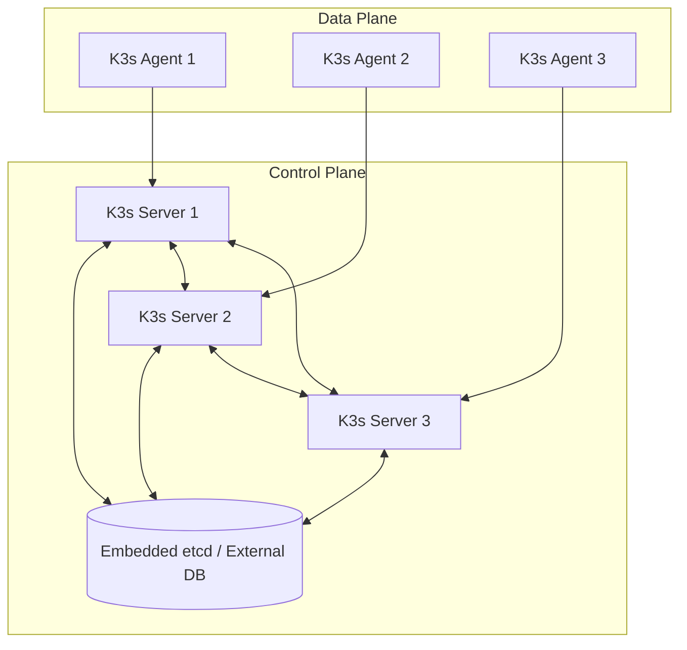
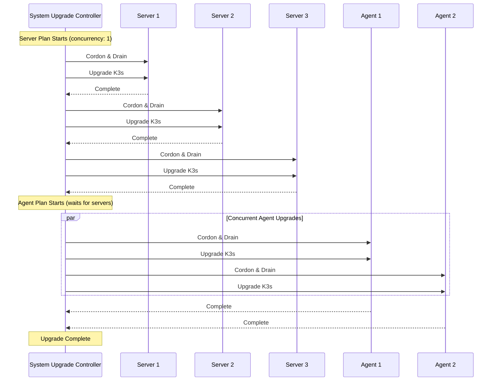
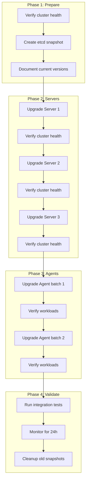
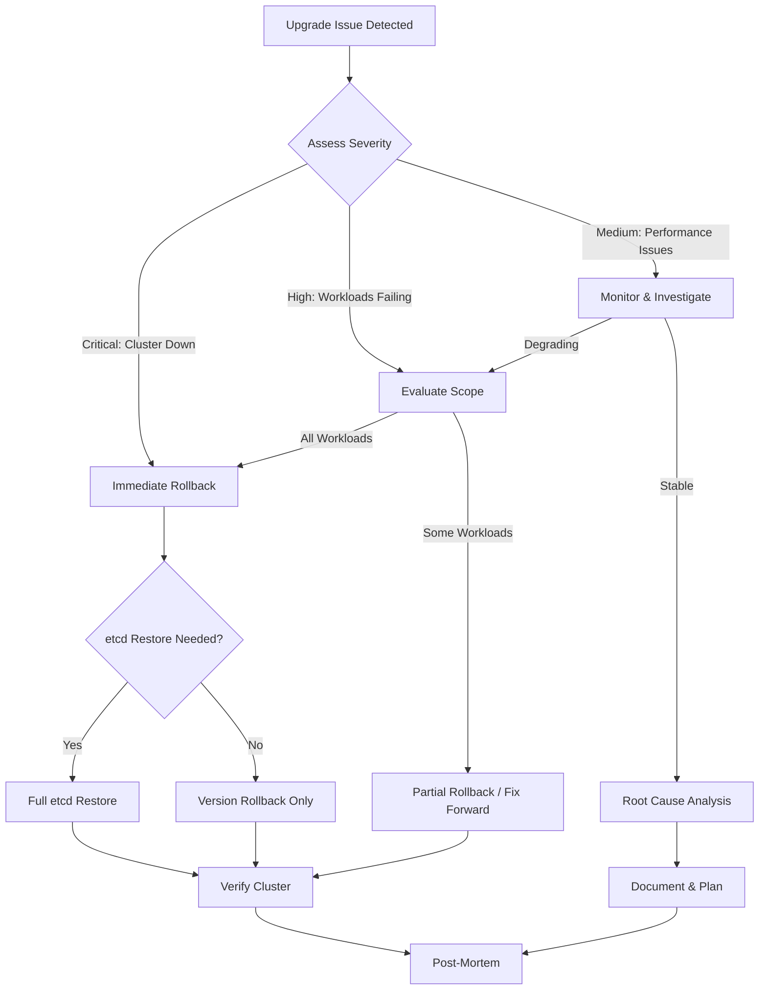

# How to Upgrade K3s Safely

By [Nawaz Dhandala](https://github.com/nawazdhandala)

Tags: K3s, Kubernetes, Upgrade, High Availability, DevOps, Rolling Updates, System Upgrade Controller

Description: A comprehensive guide to safely upgrading K3s clusters, including the System Upgrade Controller, manual upgrade procedures, rolling upgrades for high availability, and rollback strategies.

---

> "The best upgrade is the one your users never notice." - Site Reliability Engineering Wisdom

K3s is a lightweight Kubernetes distribution that powers countless edge deployments, IoT clusters, and development environments. Upgrading K3s requires careful planning to avoid downtime. This guide covers every upgrade method, from automated controllers to manual procedures, ensuring your cluster stays healthy throughout the process.

## Understanding K3s Architecture

Before upgrading, understand what you're working with:



K3s upgrades must follow this order:
1. Control plane nodes (servers) first
2. Worker nodes (agents) second
3. Never upgrade agents ahead of servers

## Pre-Upgrade Checklist

Before any upgrade, verify your cluster state:

```bash
#!/bin/bash
# pre-upgrade-check.sh
# Run this script before upgrading K3s to verify cluster health

set -e

echo "=== K3s Pre-Upgrade Checklist ==="

# Check current K3s version
echo ""
echo "1. Current K3s version:"
k3s --version

# Check node status
echo ""
echo "2. Node status (all should be Ready):"
kubectl get nodes -o wide

# Check for pending pods
echo ""
echo "3. Checking for non-running pods:"
PENDING=$(kubectl get pods -A --field-selector=status.phase!=Running,status.phase!=Succeeded 2>/dev/null | grep -v "NAMESPACE" | wc -l)
if [ "$PENDING" -gt 0 ]; then
    echo "WARNING: Found $PENDING pods not in Running/Succeeded state:"
    kubectl get pods -A --field-selector=status.phase!=Running,status.phase!=Succeeded
else
    echo "OK: All pods are healthy"
fi

# Check etcd health (for embedded etcd)
echo ""
echo "4. Checking etcd health (if using embedded etcd):"
if k3s etcd-snapshot list &>/dev/null; then
    echo "etcd is accessible"
    # Create a pre-upgrade snapshot
    SNAPSHOT_NAME="pre-upgrade-$(date +%Y%m%d-%H%M%S)"
    k3s etcd-snapshot save --name "$SNAPSHOT_NAME"
    echo "Created etcd snapshot: $SNAPSHOT_NAME"
else
    echo "External datastore or etcd not accessible from this node"
fi

# Check available disk space
echo ""
echo "5. Disk space on /var/lib/rancher:"
df -h /var/lib/rancher 2>/dev/null || df -h /

# Check K3s service status
echo ""
echo "6. K3s service status:"
systemctl is-active k3s || systemctl is-active k3s-agent

echo ""
echo "=== Pre-upgrade checks complete ==="
```

## Method 1: System Upgrade Controller (Recommended)

The System Upgrade Controller (SUC) is the recommended way to upgrade K3s clusters. It provides automated, controlled upgrades with proper draining and health checks.

### Installing the System Upgrade Controller

```yaml
# system-upgrade-controller.yaml
# Installs the Rancher System Upgrade Controller for automated K3s upgrades

apiVersion: v1
kind: Namespace
metadata:
  name: system-upgrade
---
apiVersion: v1
kind: ServiceAccount
metadata:
  name: system-upgrade
  namespace: system-upgrade
---
apiVersion: rbac.authorization.k8s.io/v1
kind: ClusterRoleBinding
metadata:
  name: system-upgrade
roleRef:
  apiGroup: rbac.authorization.k8s.io
  kind: ClusterRole
  name: cluster-admin
subjects:
  - kind: ServiceAccount
    name: system-upgrade
    namespace: system-upgrade
---
apiVersion: v1
kind: ConfigMap
metadata:
  name: default-controller-env
  namespace: system-upgrade
data:
  # Controller configuration
  SYSTEM_UPGRADE_CONTROLLER_DEBUG: "false"
  SYSTEM_UPGRADE_CONTROLLER_THREADS: "2"
  SYSTEM_UPGRADE_JOB_ACTIVE_DEADLINE_SECONDS: "900"
  SYSTEM_UPGRADE_JOB_BACKOFF_LIMIT: "99"
  SYSTEM_UPGRADE_JOB_IMAGE_PULL_POLICY: "Always"
  SYSTEM_UPGRADE_JOB_KUBECTL_IMAGE: "rancher/kubectl:v1.28.0"
  SYSTEM_UPGRADE_JOB_PRIVILEGED: "true"
  SYSTEM_UPGRADE_JOB_TTL_SECONDS_AFTER_FINISH: "900"
  SYSTEM_UPGRADE_PLAN_POLLING_INTERVAL: "15m"
---
apiVersion: apps/v1
kind: Deployment
metadata:
  name: system-upgrade-controller
  namespace: system-upgrade
spec:
  selector:
    matchLabels:
      upgrade.cattle.io/controller: system-upgrade-controller
  template:
    metadata:
      labels:
        upgrade.cattle.io/controller: system-upgrade-controller
    spec:
      affinity:
        nodeAffinity:
          # Prefer running on control plane nodes
          preferredDuringSchedulingIgnoredDuringExecution:
            - weight: 100
              preference:
                matchExpressions:
                  - key: node-role.kubernetes.io/control-plane
                    operator: Exists
      serviceAccountName: system-upgrade
      tolerations:
        - key: "CriticalAddonsOnly"
          operator: "Exists"
        - key: "node-role.kubernetes.io/master"
          operator: "Exists"
          effect: "NoSchedule"
        - key: "node-role.kubernetes.io/control-plane"
          operator: "Exists"
          effect: "NoSchedule"
      containers:
        - name: system-upgrade-controller
          image: rancher/system-upgrade-controller:v0.13.4
          imagePullPolicy: IfNotPresent
          envFrom:
            - configMapRef:
                name: default-controller-env
          env:
            - name: SYSTEM_UPGRADE_CONTROLLER_NAME
              valueFrom:
                fieldRef:
                  fieldPath: metadata.labels['upgrade.cattle.io/controller']
            - name: SYSTEM_UPGRADE_CONTROLLER_NAMESPACE
              valueFrom:
                fieldRef:
                  fieldPath: metadata.namespace
          volumeMounts:
            - name: etc-ssl
              mountPath: /etc/ssl
              readOnly: true
            - name: etc-pki
              mountPath: /etc/pki
              readOnly: true
            - name: etc-ca-certificates
              mountPath: /etc/ca-certificates
              readOnly: true
            - name: tmp
              mountPath: /tmp
      volumes:
        - name: etc-ssl
          hostPath:
            path: /etc/ssl
            type: DirectoryOrCreate
        - name: etc-pki
          hostPath:
            path: /etc/pki
            type: DirectoryOrCreate
        - name: etc-ca-certificates
          hostPath:
            path: /etc/ca-certificates
            type: DirectoryOrCreate
        - name: tmp
          emptyDir: {}
```

Apply the controller:

```bash
# Install the System Upgrade Controller
kubectl apply -f system-upgrade-controller.yaml

# Verify the controller is running
kubectl -n system-upgrade get pods -w
```

### Creating Upgrade Plans

Create separate plans for servers and agents to ensure proper upgrade order:

```yaml
# k3s-upgrade-plans.yaml
# Defines upgrade plans for K3s server and agent nodes
# Servers upgrade first, then agents follow

apiVersion: upgrade.cattle.io/v1
kind: Plan
metadata:
  name: k3s-server
  namespace: system-upgrade
  labels:
    k3s-upgrade: server
spec:
  # Upgrade to this K3s version (use channel or specific version)
  # Channel options: stable, latest, v1.28, v1.29, etc.
  channel: https://update.k3s.io/v1-release/channels/stable
  # Or use a specific version:
  # version: v1.29.0+k3s1

  # Concurrency: how many nodes to upgrade simultaneously
  concurrency: 1

  # Only select server nodes (control plane)
  nodeSelector:
    matchExpressions:
      - key: node-role.kubernetes.io/control-plane
        operator: Exists

  # Tolerate control plane taints
  tolerations:
    - key: "node-role.kubernetes.io/control-plane"
      operator: "Exists"
      effect: "NoSchedule"
    - key: "node-role.kubernetes.io/master"
      operator: "Exists"
      effect: "NoSchedule"

  # Service account with permissions to perform upgrade
  serviceAccountName: system-upgrade

  # Cordon node before upgrade (prevent new workloads)
  cordon: true

  # Drain configuration
  drain:
    force: true
    skipWaitForDeleteTimeout: 60
    ignoreDaemonSets: true
    deleteEmptyDirData: true

  # Upgrade container configuration
  upgrade:
    image: rancher/k3s-upgrade

---
apiVersion: upgrade.cattle.io/v1
kind: Plan
metadata:
  name: k3s-agent
  namespace: system-upgrade
  labels:
    k3s-upgrade: agent
spec:
  # Same channel/version as server plan
  channel: https://update.k3s.io/v1-release/channels/stable

  # Can upgrade multiple agents in parallel
  concurrency: 2

  # Only select agent nodes (not control plane)
  nodeSelector:
    matchExpressions:
      - key: node-role.kubernetes.io/control-plane
        operator: DoesNotExist

  serviceAccountName: system-upgrade

  cordon: true

  drain:
    force: true
    skipWaitForDeleteTimeout: 60
    ignoreDaemonSets: true
    deleteEmptyDirData: true

  # IMPORTANT: Wait for all servers to complete before upgrading agents
  prepare:
    image: rancher/k3s-upgrade
    args:
      - prepare
      - k3s-server  # References the server plan name

  upgrade:
    image: rancher/k3s-upgrade
```

Apply the plans:

```bash
# Apply the upgrade plans
kubectl apply -f k3s-upgrade-plans.yaml

# Monitor upgrade progress
watch kubectl -n system-upgrade get plans,jobs,pods
```

### Upgrade Flow Visualization



## Method 2: Manual Upgrade Process

For more control or when the System Upgrade Controller is not suitable, use manual upgrades.

### Manual Server Upgrade

```bash
#!/bin/bash
# manual-server-upgrade.sh
# Manually upgrade a K3s server node
# Usage: ./manual-server-upgrade.sh [version]

set -e

TARGET_VERSION=${1:-"stable"}
NODE_NAME=$(hostname)

echo "=== K3s Server Manual Upgrade ==="
echo "Node: $NODE_NAME"
echo "Target: $TARGET_VERSION"

# Step 1: Create etcd snapshot (if embedded etcd)
echo ""
echo "Step 1: Creating etcd snapshot..."
if k3s etcd-snapshot list &>/dev/null; then
    SNAPSHOT_NAME="pre-upgrade-$NODE_NAME-$(date +%Y%m%d-%H%M%S)"
    k3s etcd-snapshot save --name "$SNAPSHOT_NAME"
    echo "Snapshot created: $SNAPSHOT_NAME"
fi

# Step 2: Cordon the node (prevent new workloads)
echo ""
echo "Step 2: Cordoning node..."
kubectl cordon "$NODE_NAME"

# Step 3: Drain the node (evict existing workloads)
echo ""
echo "Step 3: Draining node..."
kubectl drain "$NODE_NAME" \
    --ignore-daemonsets \
    --delete-emptydir-data \
    --force \
    --timeout=300s

# Step 4: Stop K3s service
echo ""
echo "Step 4: Stopping K3s..."
systemctl stop k3s

# Step 5: Download and install new version
echo ""
echo "Step 5: Installing K3s $TARGET_VERSION..."
if [ "$TARGET_VERSION" = "stable" ] || [ "$TARGET_VERSION" = "latest" ]; then
    curl -sfL https://get.k3s.io | INSTALL_K3S_CHANNEL="$TARGET_VERSION" sh -s - server
else
    curl -sfL https://get.k3s.io | INSTALL_K3S_VERSION="$TARGET_VERSION" sh -s - server
fi

# Step 6: Wait for K3s to be ready
echo ""
echo "Step 6: Waiting for K3s to start..."
sleep 30

# Check if K3s is running
for i in {1..60}; do
    if kubectl get nodes &>/dev/null; then
        break
    fi
    echo "Waiting for K3s API... ($i/60)"
    sleep 5
done

# Step 7: Uncordon the node
echo ""
echo "Step 7: Uncordoning node..."
kubectl uncordon "$NODE_NAME"

# Step 8: Verify
echo ""
echo "Step 8: Verification..."
k3s --version
kubectl get nodes

echo ""
echo "=== Server upgrade complete ==="
```

### Manual Agent Upgrade

```bash
#!/bin/bash
# manual-agent-upgrade.sh
# Manually upgrade a K3s agent node
# Usage: ./manual-agent-upgrade.sh <server-url> <token> [version]

set -e

K3S_URL=${1:?"Usage: $0 <server-url> <token> [version]"}
K3S_TOKEN=${2:?"Usage: $0 <server-url> <token> [version]"}
TARGET_VERSION=${3:-"stable"}
NODE_NAME=$(hostname)

echo "=== K3s Agent Manual Upgrade ==="
echo "Node: $NODE_NAME"
echo "Server: $K3S_URL"
echo "Target: $TARGET_VERSION"

# Step 1: Cordon the node
echo ""
echo "Step 1: Cordoning node..."
# Note: This requires kubectl configured to talk to the server
kubectl cordon "$NODE_NAME" || echo "Could not cordon (maybe kubectl not configured)"

# Step 2: Drain the node
echo ""
echo "Step 2: Draining node..."
kubectl drain "$NODE_NAME" \
    --ignore-daemonsets \
    --delete-emptydir-data \
    --force \
    --timeout=300s || echo "Could not drain (maybe kubectl not configured)"

# Step 3: Stop K3s agent
echo ""
echo "Step 3: Stopping K3s agent..."
systemctl stop k3s-agent

# Step 4: Install new version
echo ""
echo "Step 4: Installing K3s agent $TARGET_VERSION..."
if [ "$TARGET_VERSION" = "stable" ] || [ "$TARGET_VERSION" = "latest" ]; then
    curl -sfL https://get.k3s.io | \
        INSTALL_K3S_CHANNEL="$TARGET_VERSION" \
        K3S_URL="$K3S_URL" \
        K3S_TOKEN="$K3S_TOKEN" \
        sh -s - agent
else
    curl -sfL https://get.k3s.io | \
        INSTALL_K3S_VERSION="$TARGET_VERSION" \
        K3S_URL="$K3S_URL" \
        K3S_TOKEN="$K3S_TOKEN" \
        sh -s - agent
fi

# Step 5: Wait for agent to join
echo ""
echo "Step 5: Waiting for agent to start..."
sleep 20

# Step 6: Uncordon
echo ""
echo "Step 6: Uncordoning node..."
kubectl uncordon "$NODE_NAME" || echo "Could not uncordon"

# Step 7: Verify
echo ""
echo "Step 7: Verification..."
systemctl is-active k3s-agent

echo ""
echo "=== Agent upgrade complete ==="
```

## Rolling Upgrades for High Availability

For HA clusters with multiple control plane nodes, coordinate the upgrade carefully:



### HA Upgrade Script

```bash
#!/bin/bash
# ha-rolling-upgrade.sh
# Perform rolling upgrade on HA K3s cluster
# Run this from a machine with kubectl access to the cluster

set -e

TARGET_VERSION=${1:-"stable"}

echo "=== K3s HA Rolling Upgrade ==="
echo "Target version: $TARGET_VERSION"

# Get all server nodes
SERVERS=$(kubectl get nodes -l node-role.kubernetes.io/control-plane -o jsonpath='{.items[*].metadata.name}')
# Get all agent nodes
AGENTS=$(kubectl get nodes -l '!node-role.kubernetes.io/control-plane' -o jsonpath='{.items[*].metadata.name}')

echo ""
echo "Server nodes: $SERVERS"
echo "Agent nodes: $AGENTS"

# Function to wait for node to be ready
wait_for_node_ready() {
    local node=$1
    local timeout=300
    local elapsed=0

    echo "Waiting for node $node to be Ready..."
    while [ $elapsed -lt $timeout ]; do
        STATUS=$(kubectl get node "$node" -o jsonpath='{.status.conditions[?(@.type=="Ready")].status}' 2>/dev/null || echo "Unknown")
        if [ "$STATUS" = "True" ]; then
            echo "Node $node is Ready"
            return 0
        fi
        sleep 10
        elapsed=$((elapsed + 10))
        echo "  Still waiting... ($elapsed/$timeout seconds)"
    done
    echo "ERROR: Node $node did not become Ready in $timeout seconds"
    return 1
}

# Function to verify cluster health
verify_cluster_health() {
    echo ""
    echo "=== Verifying cluster health ==="

    # Check all nodes are Ready
    NOT_READY=$(kubectl get nodes --no-headers | grep -v " Ready" | wc -l)
    if [ "$NOT_READY" -gt 0 ]; then
        echo "ERROR: $NOT_READY nodes are not Ready"
        kubectl get nodes
        return 1
    fi

    # Check system pods
    FAILING=$(kubectl get pods -n kube-system --no-headers | grep -v "Running\|Completed" | wc -l)
    if [ "$FAILING" -gt 0 ]; then
        echo "WARNING: $FAILING system pods are not Running"
        kubectl get pods -n kube-system | grep -v "Running\|Completed"
    fi

    echo "Cluster health check passed"
    return 0
}

# Phase 1: Pre-upgrade checks
echo ""
echo "=== Phase 1: Pre-upgrade checks ==="
verify_cluster_health

# Create etcd snapshot
echo "Creating etcd snapshot on first server..."
FIRST_SERVER=$(echo $SERVERS | awk '{print $1}')
# This assumes SSH access to nodes - adjust as needed for your environment
# ssh "$FIRST_SERVER" "k3s etcd-snapshot save --name pre-upgrade-$(date +%Y%m%d-%H%M%S)"

# Phase 2: Upgrade servers one by one
echo ""
echo "=== Phase 2: Upgrading servers ==="
for server in $SERVERS; do
    echo ""
    echo "--- Upgrading server: $server ---"

    # Cordon
    kubectl cordon "$server"

    # Drain (but keep critical pods)
    kubectl drain "$server" \
        --ignore-daemonsets \
        --delete-emptydir-data \
        --force \
        --timeout=300s

    # SSH to server and upgrade (adjust for your environment)
    echo "SSH to $server and run the upgrade command:"
    echo "  curl -sfL https://get.k3s.io | INSTALL_K3S_CHANNEL=$TARGET_VERSION sh -s - server"
    echo ""
    echo "Press Enter when upgrade is complete on $server..."
    read -r

    # Wait for node to be ready
    wait_for_node_ready "$server"

    # Uncordon
    kubectl uncordon "$server"

    # Verify cluster health before proceeding
    verify_cluster_health

    echo "Server $server upgraded successfully"
    sleep 30  # Brief pause before next server
done

# Phase 3: Upgrade agents in batches
echo ""
echo "=== Phase 3: Upgrading agents ==="
BATCH_SIZE=2
AGENT_ARRAY=($AGENTS)
TOTAL_AGENTS=${#AGENT_ARRAY[@]}

for ((i=0; i<TOTAL_AGENTS; i+=BATCH_SIZE)); do
    BATCH="${AGENT_ARRAY[@]:i:BATCH_SIZE}"
    echo ""
    echo "--- Upgrading agent batch: $BATCH ---"

    for agent in $BATCH; do
        # Cordon
        kubectl cordon "$agent"

        # Drain
        kubectl drain "$agent" \
            --ignore-daemonsets \
            --delete-emptydir-data \
            --force \
            --timeout=300s &
    done
    wait

    echo "SSH to agents and run the upgrade command:"
    echo "  curl -sfL https://get.k3s.io | INSTALL_K3S_CHANNEL=$TARGET_VERSION K3S_URL=<server-url> K3S_TOKEN=<token> sh -s - agent"
    echo ""
    echo "Press Enter when upgrades are complete on: $BATCH..."
    read -r

    for agent in $BATCH; do
        wait_for_node_ready "$agent"
        kubectl uncordon "$agent"
    done

    verify_cluster_health
done

# Phase 4: Final verification
echo ""
echo "=== Phase 4: Final verification ==="
echo ""
echo "Node versions:"
kubectl get nodes -o wide

echo ""
echo "K3s versions on nodes:"
for node in $SERVERS $AGENTS; do
    echo -n "$node: "
    kubectl get node "$node" -o jsonpath='{.status.nodeInfo.kubeletVersion}'
    echo ""
done

echo ""
echo "=== Rolling upgrade complete ==="
```

## Rollback Procedures

When an upgrade goes wrong, you need to roll back quickly.

### Rollback Decision Flow



### Version Rollback (No Data Loss)

If the cluster is functional but the new version has issues:

```bash
#!/bin/bash
# version-rollback.sh
# Roll back K3s to a previous version
# Usage: ./version-rollback.sh <previous-version>

set -e

ROLLBACK_VERSION=${1:?"Usage: $0 <previous-version> (e.g., v1.28.5+k3s1)"}
NODE_NAME=$(hostname)

echo "=== K3s Version Rollback ==="
echo "Node: $NODE_NAME"
echo "Rollback to: $ROLLBACK_VERSION"

# Determine if this is a server or agent
if systemctl is-active k3s &>/dev/null; then
    NODE_TYPE="server"
    SERVICE_NAME="k3s"
elif systemctl is-active k3s-agent &>/dev/null; then
    NODE_TYPE="agent"
    SERVICE_NAME="k3s-agent"
else
    echo "ERROR: Could not determine node type"
    exit 1
fi

echo "Node type: $NODE_TYPE"

# Step 1: Cordon the node
echo ""
echo "Step 1: Cordoning node..."
kubectl cordon "$NODE_NAME" 2>/dev/null || true

# Step 2: Drain if possible
echo ""
echo "Step 2: Draining node..."
kubectl drain "$NODE_NAME" \
    --ignore-daemonsets \
    --delete-emptydir-data \
    --force \
    --timeout=120s 2>/dev/null || true

# Step 3: Stop K3s
echo ""
echo "Step 3: Stopping K3s..."
systemctl stop "$SERVICE_NAME"

# Step 4: Install previous version
echo ""
echo "Step 4: Installing K3s $ROLLBACK_VERSION..."
if [ "$NODE_TYPE" = "server" ]; then
    curl -sfL https://get.k3s.io | INSTALL_K3S_VERSION="$ROLLBACK_VERSION" sh -s - server
else
    # For agents, you need to preserve the token and URL
    # These should be in the systemd unit file or environment
    curl -sfL https://get.k3s.io | INSTALL_K3S_VERSION="$ROLLBACK_VERSION" sh -s - agent
fi

# Step 5: Wait for service to start
echo ""
echo "Step 5: Waiting for K3s to start..."
sleep 30

# Step 6: Uncordon
echo ""
echo "Step 6: Uncordoning node..."
kubectl uncordon "$NODE_NAME" 2>/dev/null || true

# Step 7: Verify
echo ""
echo "Step 7: Verification..."
k3s --version
systemctl is-active "$SERVICE_NAME"

echo ""
echo "=== Version rollback complete ==="
```

### Full etcd Restore (Disaster Recovery)

If the cluster state is corrupted, restore from an etcd snapshot:

```bash
#!/bin/bash
# etcd-restore.sh
# Restore K3s cluster from etcd snapshot
# Usage: ./etcd-restore.sh <snapshot-name>

set -e

SNAPSHOT_NAME=${1:?"Usage: $0 <snapshot-name>"}

echo "=== K3s etcd Restore ==="
echo "Snapshot: $SNAPSHOT_NAME"

# This is a DESTRUCTIVE operation
echo ""
echo "WARNING: This will restore the cluster to the snapshot state."
echo "All changes after the snapshot will be LOST."
echo ""
read -p "Are you sure you want to continue? (yes/no): " CONFIRM
if [ "$CONFIRM" != "yes" ]; then
    echo "Aborted"
    exit 1
fi

# Step 1: Stop K3s on ALL servers
echo ""
echo "Step 1: Stop K3s on ALL server nodes before proceeding"
echo "Run on each server: systemctl stop k3s"
echo ""
read -p "Press Enter when K3s is stopped on all servers..."

# Step 2: Restore on this node
echo ""
echo "Step 2: Restoring etcd snapshot..."
k3s server \
    --cluster-reset \
    --cluster-reset-restore-path="/var/lib/rancher/k3s/server/db/snapshots/$SNAPSHOT_NAME"

# The above command will start K3s in a restored state
# Wait for it to stabilize
echo ""
echo "Step 3: Waiting for restore to complete..."
sleep 60

# Step 4: Verify
echo ""
echo "Step 4: Verification..."
kubectl get nodes
kubectl get pods -A

echo ""
echo "=== etcd restore complete ==="
echo ""
echo "IMPORTANT: Other server nodes need to rejoin the cluster."
echo "On other servers, delete /var/lib/rancher/k3s/server/db and restart K3s"
```

### Automated Rollback with System Upgrade Controller

You can also use SUC to roll back by creating a plan with the previous version:

```yaml
# k3s-rollback-plans.yaml
# Emergency rollback plans for K3s
# Apply these when you need to roll back to a specific version

apiVersion: upgrade.cattle.io/v1
kind: Plan
metadata:
  name: k3s-server-rollback
  namespace: system-upgrade
spec:
  # Specify the exact version to roll back to
  version: v1.28.5+k3s1  # <-- Change this to your target version

  concurrency: 1

  nodeSelector:
    matchExpressions:
      - key: node-role.kubernetes.io/control-plane
        operator: Exists

  tolerations:
    - key: "node-role.kubernetes.io/control-plane"
      operator: "Exists"
      effect: "NoSchedule"

  serviceAccountName: system-upgrade
  cordon: true

  drain:
    force: true
    skipWaitForDeleteTimeout: 60
    ignoreDaemonSets: true
    deleteEmptyDirData: true

  upgrade:
    image: rancher/k3s-upgrade
---
apiVersion: upgrade.cattle.io/v1
kind: Plan
metadata:
  name: k3s-agent-rollback
  namespace: system-upgrade
spec:
  version: v1.28.5+k3s1  # <-- Same version as server

  concurrency: 2

  nodeSelector:
    matchExpressions:
      - key: node-role.kubernetes.io/control-plane
        operator: DoesNotExist

  serviceAccountName: system-upgrade
  cordon: true

  drain:
    force: true
    skipWaitForDeleteTimeout: 60
    ignoreDaemonSets: true
    deleteEmptyDirData: true

  prepare:
    image: rancher/k3s-upgrade
    args:
      - prepare
      - k3s-server-rollback

  upgrade:
    image: rancher/k3s-upgrade
```

## Monitoring Upgrades with OneUptime

Track your K3s upgrade process with [OneUptime](https://oneuptime.com) for real-time visibility:

```yaml
# oneuptime-upgrade-monitor.yaml
# Deploy alongside upgrades to track cluster health

apiVersion: v1
kind: ConfigMap
metadata:
  name: upgrade-health-check
  namespace: monitoring
data:
  check.sh: |
    #!/bin/bash
    # Health check script for OneUptime monitoring

    # Check node readiness
    NOT_READY=$(kubectl get nodes --no-headers 2>/dev/null | grep -v " Ready" | wc -l)

    # Check critical pods
    FAILING_PODS=$(kubectl get pods -n kube-system --no-headers 2>/dev/null | grep -v "Running\|Completed" | wc -l)

    # Check K3s API latency
    API_LATENCY=$(kubectl get --raw /healthz 2>/dev/null && echo "OK" || echo "FAIL")

    if [ "$NOT_READY" -gt 0 ] || [ "$FAILING_PODS" -gt 2 ] || [ "$API_LATENCY" = "FAIL" ]; then
        echo "UNHEALTHY: nodes_not_ready=$NOT_READY, failing_pods=$FAILING_PODS, api=$API_LATENCY"
        exit 1
    fi

    echo "HEALTHY: All systems operational"
    exit 0
```

Set up the following monitors in OneUptime:

1. **K3s API Health** - Monitor the Kubernetes API endpoint
2. **Node Count** - Alert if nodes drop unexpectedly during upgrade
3. **Pod Restart Rate** - Detect crash loops from version incompatibilities
4. **etcd Latency** - Track database performance during upgrade

## Best Practices Summary

1. **Always back up before upgrading** - etcd snapshots are your safety net
2. **Test in staging first** - Never upgrade production without testing
3. **Upgrade one node at a time** - Use `concurrency: 1` for servers
4. **Monitor throughout** - Watch logs and metrics during the upgrade
5. **Have a rollback plan** - Know the exact commands before you start
6. **Document the process** - Record what version you upgraded from and to
7. **Schedule upgrades during low traffic** - Minimize impact on users
8. **Keep version skew minimal** - Don't skip more than one minor version

## Troubleshooting Common Issues

### Node Stuck in NotReady After Upgrade

```bash
# Check kubelet logs
journalctl -u k3s -f  # for servers
journalctl -u k3s-agent -f  # for agents

# Common fixes:
# 1. Restart K3s service
systemctl restart k3s

# 2. Check for certificate issues
ls -la /var/lib/rancher/k3s/server/tls/

# 3. Clear CNI state and restart
rm -rf /var/lib/cni/
systemctl restart k3s
```

### Pods Failing to Schedule After Upgrade

```bash
# Check for taints
kubectl describe node <node-name> | grep -A5 Taints

# Remove upgrade-related taints
kubectl taint nodes <node-name> node.kubernetes.io/unschedulable-

# Check for resource pressure
kubectl describe node <node-name> | grep -A10 Conditions
```

### etcd Cluster Health Issues

```bash
# Check etcd member list
k3s etcd-snapshot list

# Check cluster health
kubectl get endpoints kubernetes -n default

# Force etcd leader election (last resort)
# This is disruptive - only use if cluster is already unhealthy
```

---

Upgrading K3s safely requires planning, monitoring, and the ability to roll back when things go wrong. Whether you use the System Upgrade Controller for automation or prefer manual control, always have backups and a tested rollback procedure. Monitor your cluster throughout the process with [OneUptime](https://oneuptime.com) to catch issues early and minimize impact on your users.
