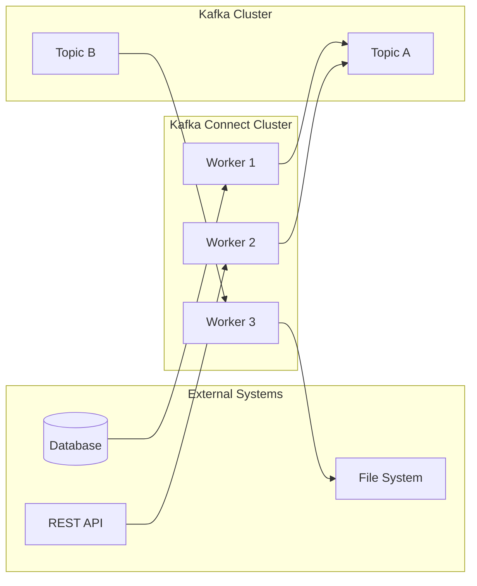
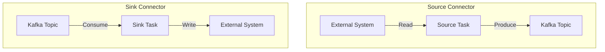
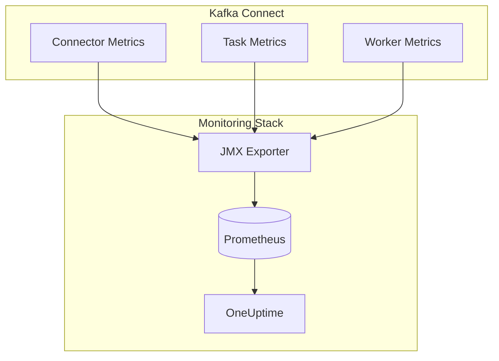

# How to Build Kafka Connect Custom Connectors

Author: [nawazdhandala](https://www.github.com/nawazdhandala)

Tags: Kafka, Kafka Connect, Java, Data Integration, Streaming, ETL, Connectors, Apache Kafka

Description: A comprehensive guide to building custom Kafka Connect connectors in Java, covering source and sink connectors, configuration, schemas, Single Message Transforms (SMTs), and production deployment patterns.

---

> "The best data pipelines are invisible. They move data reliably, transform it correctly, and never wake you up at 3 AM." - Every Data Engineer

Kafka Connect is the integration framework of Apache Kafka. It standardizes how data moves between Kafka and external systems-databases, search indexes, file systems, cloud services. While hundreds of connectors exist, sometimes you need to build your own. This guide walks you through creating production-ready custom connectors from scratch.

## Understanding Kafka Connect Architecture

Before writing code, understand how the pieces fit together.



### Key Components

| Component | Role |
|-----------|------|
| **Worker** | JVM process that hosts connectors and tasks |
| **Connector** | Manages configuration and task lifecycle |
| **Task** | Does the actual data movement work |
| **Converter** | Serializes/deserializes data (JSON, Avro, Protobuf) |
| **Transform** | Modifies records in-flight (SMTs) |

## Source vs Sink Connectors

Kafka Connect has two connector types, each serving a different direction of data flow.



### Source Connectors

Source connectors pull data from external systems into Kafka. They are responsible for:

- Polling or subscribing to external data sources
- Converting external data formats to Kafka Connect records
- Tracking offsets to enable exactly-once delivery

### Sink Connectors

Sink connectors push data from Kafka to external systems. They handle:

- Consuming records from Kafka topics
- Converting Kafka Connect records to external formats
- Managing delivery guarantees and error handling

## Setting Up Your Development Environment

### Project Structure

```bash
# Create Maven project structure
mkdir -p kafka-custom-connector/src/main/java/com/example/connect
mkdir -p kafka-custom-connector/src/main/resources
mkdir -p kafka-custom-connector/src/test/java/com/example/connect
cd kafka-custom-connector
```

### Maven Dependencies

Create `pom.xml` with the essential dependencies:

```xml
<?xml version="1.0" encoding="UTF-8"?>
<project xmlns="http://maven.apache.org/POM/4.0.0"
         xmlns:xsi="http://www.w3.org/2001/XMLSchema-instance"
         xsi:schemaLocation="http://maven.apache.org/POM/4.0.0
                             http://maven.apache.org/xsd/maven-4.0.0.xsd">
    <modelVersion>4.0.0</modelVersion>

    <groupId>com.example</groupId>
    <artifactId>kafka-custom-connector</artifactId>
    <version>1.0.0</version>
    <packaging>jar</packaging>

    <properties>
        <kafka.version>3.6.0</kafka.version>
        <java.version>17</java.version>
        <maven.compiler.source>${java.version}</maven.compiler.source>
        <maven.compiler.target>${java.version}</maven.compiler.target>
    </properties>

    <dependencies>
        <!-- Kafka Connect API - provided by the runtime -->
        <dependency>
            <groupId>org.apache.kafka</groupId>
            <artifactId>connect-api</artifactId>
            <version>${kafka.version}</version>
            <scope>provided</scope>
        </dependency>

        <!-- JSON processing for our example connector -->
        <dependency>
            <groupId>com.fasterxml.jackson.core</groupId>
            <artifactId>jackson-databind</artifactId>
            <version>2.15.2</version>
        </dependency>

        <!-- HTTP client for REST API connector -->
        <dependency>
            <groupId>com.squareup.okhttp3</groupId>
            <artifactId>okhttp</artifactId>
            <version>4.12.0</version>
        </dependency>

        <!-- Testing dependencies -->
        <dependency>
            <groupId>org.apache.kafka</groupId>
            <artifactId>connect-runtime</artifactId>
            <version>${kafka.version}</version>
            <scope>test</scope>
        </dependency>
        <dependency>
            <groupId>junit</groupId>
            <artifactId>junit</artifactId>
            <version>4.13.2</version>
            <scope>test</scope>
        </dependency>
    </dependencies>

    <build>
        <plugins>
            <!-- Build a fat JAR with all dependencies -->
            <plugin>
                <groupId>org.apache.maven.plugins</groupId>
                <artifactId>maven-assembly-plugin</artifactId>
                <version>3.6.0</version>
                <configuration>
                    <descriptorRefs>
                        <descriptorRef>jar-with-dependencies</descriptorRef>
                    </descriptorRefs>
                </configuration>
                <executions>
                    <execution>
                        <id>make-assembly</id>
                        <phase>package</phase>
                        <goals>
                            <goal>single</goal>
                        </goals>
                    </execution>
                </executions>
            </plugin>
        </plugins>
    </build>
</project>
```

## Building a Source Connector

Let us build a source connector that polls a REST API and streams data into Kafka. This pattern applies to any external system you need to ingest from.

### The Connector Class

The connector class manages configuration validation and task instantiation:

```java
package com.example.connect;

import org.apache.kafka.common.config.ConfigDef;
import org.apache.kafka.common.config.ConfigDef.Importance;
import org.apache.kafka.common.config.ConfigDef.Type;
import org.apache.kafka.connect.connector.Task;
import org.apache.kafka.connect.source.SourceConnector;

import java.util.ArrayList;
import java.util.HashMap;
import java.util.List;
import java.util.Map;

/**
 * RestApiSourceConnector polls a REST API endpoint and streams
 * the response data into Kafka topics.
 *
 * This connector supports multiple tasks for parallel ingestion
 * when the API supports pagination or partitioning.
 */
public class RestApiSourceConnector extends SourceConnector {

    // Configuration key constants - use these throughout the connector
    public static final String API_URL_CONFIG = "api.url";
    public static final String API_KEY_CONFIG = "api.key";
    public static final String TOPIC_CONFIG = "topic";
    public static final String POLL_INTERVAL_MS_CONFIG = "poll.interval.ms";
    public static final String TASKS_MAX_CONFIG = "tasks.max";

    // Default values for optional configuration
    private static final long DEFAULT_POLL_INTERVAL_MS = 60000L;

    // Store the configuration for task creation
    private Map<String, String> configProps;

    /**
     * Define the configuration schema.
     * This enables validation, documentation, and default values.
     */
    @Override
    public ConfigDef config() {
        return new ConfigDef()
            .define(
                API_URL_CONFIG,
                Type.STRING,
                ConfigDef.NO_DEFAULT_VALUE,
                Importance.HIGH,
                "The REST API endpoint URL to poll for data"
            )
            .define(
                API_KEY_CONFIG,
                Type.PASSWORD,  // PASSWORD type masks the value in logs
                "",
                Importance.MEDIUM,
                "API key for authentication (optional)"
            )
            .define(
                TOPIC_CONFIG,
                Type.STRING,
                ConfigDef.NO_DEFAULT_VALUE,
                Importance.HIGH,
                "The Kafka topic to write records to"
            )
            .define(
                POLL_INTERVAL_MS_CONFIG,
                Type.LONG,
                DEFAULT_POLL_INTERVAL_MS,
                Importance.MEDIUM,
                "How often to poll the API in milliseconds"
            );
    }

    /**
     * Start the connector with the provided configuration.
     * Validate and store config for later use when creating tasks.
     */
    @Override
    public void start(Map<String, String> props) {
        // Store configuration - tasks will receive a copy
        this.configProps = new HashMap<>(props);

        // Perform any one-time initialization here
        // For example: validate API connectivity, check permissions
    }

    /**
     * Return the Task implementation class.
     * The framework instantiates tasks based on this.
     */
    @Override
    public Class<? extends Task> taskClass() {
        return RestApiSourceTask.class;
    }

    /**
     * Generate configuration for each task.
     *
     * For APIs that support partitioning (e.g., by date range or ID range),
     * you can distribute work across tasks here.
     */
    @Override
    public List<Map<String, String>> taskConfigs(int maxTasks) {
        List<Map<String, String>> taskConfigs = new ArrayList<>();

        // For a simple single-endpoint API, all tasks get the same config
        // For partitioned APIs, you would divide work here
        for (int i = 0; i < maxTasks; i++) {
            Map<String, String> taskConfig = new HashMap<>(configProps);
            taskConfig.put("task.id", String.valueOf(i));
            taskConfigs.add(taskConfig);
        }

        return taskConfigs;
    }

    /**
     * Stop the connector. Release any resources.
     */
    @Override
    public void stop() {
        // Clean up resources if needed
        // Close connection pools, cancel scheduled tasks, etc.
    }

    /**
     * Return the connector version for debugging and compatibility checks.
     */
    @Override
    public String version() {
        return "1.0.0";
    }
}
```

### The Source Task Class

The task class does the actual work of fetching data and producing records:

```java
package com.example.connect;

import com.fasterxml.jackson.databind.JsonNode;
import com.fasterxml.jackson.databind.ObjectMapper;
import okhttp3.OkHttpClient;
import okhttp3.Request;
import okhttp3.Response;
import org.apache.kafka.connect.data.Schema;
import org.apache.kafka.connect.data.SchemaBuilder;
import org.apache.kafka.connect.data.Struct;
import org.apache.kafka.connect.source.SourceRecord;
import org.apache.kafka.connect.source.SourceTask;
import org.slf4j.Logger;
import org.slf4j.LoggerFactory;

import java.io.IOException;
import java.util.*;
import java.util.concurrent.TimeUnit;

/**
 * RestApiSourceTask polls a REST API and converts responses
 * to Kafka Connect SourceRecords.
 *
 * Key responsibilities:
 * - Poll external system at configured intervals
 * - Track offsets for resumable processing
 * - Handle errors gracefully without crashing the task
 */
public class RestApiSourceTask extends SourceTask {

    private static final Logger log = LoggerFactory.getLogger(RestApiSourceTask.class);

    // Configuration values
    private String apiUrl;
    private String apiKey;
    private String topic;
    private long pollIntervalMs;

    // HTTP client with connection pooling
    private OkHttpClient httpClient;
    private ObjectMapper objectMapper;

    // Offset tracking - enables exactly-once delivery
    private Long lastProcessedTimestamp;

    // Define the schema for our records
    // Using explicit schemas enables schema evolution and type safety
    private static final Schema VALUE_SCHEMA = SchemaBuilder.struct()
        .name("com.example.ApiRecord")
        .version(1)
        .field("id", Schema.STRING_SCHEMA)
        .field("timestamp", Schema.INT64_SCHEMA)
        .field("data", Schema.STRING_SCHEMA)
        .field("source", Schema.STRING_SCHEMA)
        .build();

    @Override
    public String version() {
        return "1.0.0";
    }

    /**
     * Initialize the task with configuration.
     * Set up HTTP client, restore offsets, prepare for polling.
     */
    @Override
    public void start(Map<String, String> props) {
        // Extract configuration
        this.apiUrl = props.get(RestApiSourceConnector.API_URL_CONFIG);
        this.apiKey = props.get(RestApiSourceConnector.API_KEY_CONFIG);
        this.topic = props.get(RestApiSourceConnector.TOPIC_CONFIG);
        this.pollIntervalMs = Long.parseLong(
            props.getOrDefault(RestApiSourceConnector.POLL_INTERVAL_MS_CONFIG, "60000")
        );

        // Initialize HTTP client with reasonable timeouts
        this.httpClient = new OkHttpClient.Builder()
            .connectTimeout(30, TimeUnit.SECONDS)
            .readTimeout(30, TimeUnit.SECONDS)
            .writeTimeout(30, TimeUnit.SECONDS)
            .build();

        this.objectMapper = new ObjectMapper();

        // Restore offset from Kafka Connect's offset storage
        // This enables resuming from where we left off after restarts
        Map<String, Object> sourcePartition = Collections.singletonMap("api", apiUrl);
        Map<String, Object> storedOffset = context.offsetStorageReader()
            .offset(sourcePartition);

        if (storedOffset != null && storedOffset.containsKey("timestamp")) {
            this.lastProcessedTimestamp = (Long) storedOffset.get("timestamp");
            log.info("Restored offset: lastProcessedTimestamp={}", lastProcessedTimestamp);
        } else {
            this.lastProcessedTimestamp = 0L;
            log.info("No stored offset found, starting from beginning");
        }
    }

    /**
     * Poll for new data from the external system.
     *
     * This method is called repeatedly by the framework.
     * Return null or empty list when there is no new data.
     * The framework handles backoff automatically.
     */
    @Override
    public List<SourceRecord> poll() throws InterruptedException {
        // Respect the configured poll interval
        Thread.sleep(pollIntervalMs);

        try {
            // Build the API request
            Request.Builder requestBuilder = new Request.Builder()
                .url(apiUrl + "?since=" + lastProcessedTimestamp)
                .get();

            // Add authentication if configured
            if (apiKey != null && !apiKey.isEmpty()) {
                requestBuilder.addHeader("Authorization", "Bearer " + apiKey);
            }

            // Execute the request
            try (Response response = httpClient.newCall(requestBuilder.build()).execute()) {
                if (!response.isSuccessful()) {
                    log.error("API request failed: {} {}", response.code(), response.message());
                    return Collections.emptyList();
                }

                String responseBody = response.body().string();
                return parseResponse(responseBody);
            }

        } catch (IOException e) {
            log.error("Error polling API: {}", e.getMessage(), e);
            // Return empty list rather than throwing - let the framework retry
            return Collections.emptyList();
        }
    }

    /**
     * Parse the API response and convert to SourceRecords.
     */
    private List<SourceRecord> parseResponse(String responseBody) throws IOException {
        List<SourceRecord> records = new ArrayList<>();

        JsonNode root = objectMapper.readTree(responseBody);
        JsonNode items = root.path("items");

        if (!items.isArray()) {
            log.warn("Unexpected response format: 'items' is not an array");
            return records;
        }

        for (JsonNode item : items) {
            // Extract fields from the JSON response
            String id = item.path("id").asText();
            long timestamp = item.path("timestamp").asLong();
            String data = item.path("data").toString();

            // Skip already-processed records (idempotency)
            if (timestamp <= lastProcessedTimestamp) {
                continue;
            }

            // Build the Kafka Connect Struct with schema
            Struct value = new Struct(VALUE_SCHEMA)
                .put("id", id)
                .put("timestamp", timestamp)
                .put("data", data)
                .put("source", apiUrl);

            // Create the SourceRecord
            // - sourcePartition: identifies this data source
            // - sourceOffset: tracks progress for resumability
            // - topic: destination Kafka topic
            // - key: used for partitioning (null = round-robin)
            // - valueSchema + value: the actual data
            SourceRecord record = new SourceRecord(
                Collections.singletonMap("api", apiUrl),      // sourcePartition
                Collections.singletonMap("timestamp", timestamp), // sourceOffset
                topic,                                         // topic
                null,                                          // partition (null = default)
                Schema.STRING_SCHEMA,                          // keySchema
                id,                                            // key
                VALUE_SCHEMA,                                  // valueSchema
                value                                          // value
            );

            records.add(record);

            // Update our tracking timestamp
            if (timestamp > lastProcessedTimestamp) {
                lastProcessedTimestamp = timestamp;
            }
        }

        log.info("Polled {} new records from API", records.size());
        return records;
    }

    /**
     * Stop the task. Clean up resources.
     */
    @Override
    public void stop() {
        // OkHttpClient does not need explicit shutdown
        // but close any other resources here
        log.info("Stopping RestApiSourceTask");
    }
}
```

## Building a Sink Connector

Sink connectors consume from Kafka and write to external systems. Here is a connector that writes to a REST API.

### The Sink Connector Class

```java
package com.example.connect;

import org.apache.kafka.common.config.ConfigDef;
import org.apache.kafka.common.config.ConfigDef.Importance;
import org.apache.kafka.common.config.ConfigDef.Type;
import org.apache.kafka.connect.connector.Task;
import org.apache.kafka.connect.sink.SinkConnector;

import java.util.ArrayList;
import java.util.HashMap;
import java.util.List;
import java.util.Map;

/**
 * RestApiSinkConnector writes Kafka records to a REST API endpoint.
 *
 * Supports batching for efficiency and configurable retry behavior.
 */
public class RestApiSinkConnector extends SinkConnector {

    public static final String API_URL_CONFIG = "api.url";
    public static final String API_KEY_CONFIG = "api.key";
    public static final String BATCH_SIZE_CONFIG = "batch.size";
    public static final String RETRY_MAX_CONFIG = "retry.max";

    private Map<String, String> configProps;

    @Override
    public ConfigDef config() {
        return new ConfigDef()
            .define(
                API_URL_CONFIG,
                Type.STRING,
                ConfigDef.NO_DEFAULT_VALUE,
                Importance.HIGH,
                "The REST API endpoint URL to send data to"
            )
            .define(
                API_KEY_CONFIG,
                Type.PASSWORD,
                "",
                Importance.MEDIUM,
                "API key for authentication"
            )
            .define(
                BATCH_SIZE_CONFIG,
                Type.INT,
                100,
                Importance.MEDIUM,
                "Number of records to batch before sending"
            )
            .define(
                RETRY_MAX_CONFIG,
                Type.INT,
                3,
                Importance.LOW,
                "Maximum number of retry attempts on failure"
            );
    }

    @Override
    public void start(Map<String, String> props) {
        this.configProps = new HashMap<>(props);
    }

    @Override
    public Class<? extends Task> taskClass() {
        return RestApiSinkTask.class;
    }

    @Override
    public List<Map<String, String>> taskConfigs(int maxTasks) {
        List<Map<String, String>> taskConfigs = new ArrayList<>();
        for (int i = 0; i < maxTasks; i++) {
            taskConfigs.add(new HashMap<>(configProps));
        }
        return taskConfigs;
    }

    @Override
    public void stop() {
        // Clean up resources
    }

    @Override
    public String version() {
        return "1.0.0";
    }
}
```

### The Sink Task Class

```java
package com.example.connect;

import com.fasterxml.jackson.databind.ObjectMapper;
import com.fasterxml.jackson.databind.node.ArrayNode;
import com.fasterxml.jackson.databind.node.ObjectNode;
import okhttp3.*;
import org.apache.kafka.connect.sink.SinkRecord;
import org.apache.kafka.connect.sink.SinkTask;
import org.apache.kafka.connect.data.Struct;
import org.slf4j.Logger;
import org.slf4j.LoggerFactory;

import java.io.IOException;
import java.util.Collection;
import java.util.Map;
import java.util.concurrent.TimeUnit;

/**
 * RestApiSinkTask consumes Kafka records and sends them to a REST API.
 *
 * Features:
 * - Batches records for efficient network usage
 * - Retries failed requests with exponential backoff
 * - Converts Kafka Connect Structs to JSON
 */
public class RestApiSinkTask extends SinkTask {

    private static final Logger log = LoggerFactory.getLogger(RestApiSinkTask.class);
    private static final MediaType JSON = MediaType.get("application/json; charset=utf-8");

    private String apiUrl;
    private String apiKey;
    private int batchSize;
    private int maxRetries;

    private OkHttpClient httpClient;
    private ObjectMapper objectMapper;

    @Override
    public String version() {
        return "1.0.0";
    }

    @Override
    public void start(Map<String, String> props) {
        this.apiUrl = props.get(RestApiSinkConnector.API_URL_CONFIG);
        this.apiKey = props.get(RestApiSinkConnector.API_KEY_CONFIG);
        this.batchSize = Integer.parseInt(
            props.getOrDefault(RestApiSinkConnector.BATCH_SIZE_CONFIG, "100")
        );
        this.maxRetries = Integer.parseInt(
            props.getOrDefault(RestApiSinkConnector.RETRY_MAX_CONFIG, "3")
        );

        this.httpClient = new OkHttpClient.Builder()
            .connectTimeout(30, TimeUnit.SECONDS)
            .readTimeout(60, TimeUnit.SECONDS)
            .writeTimeout(60, TimeUnit.SECONDS)
            .build();

        this.objectMapper = new ObjectMapper();

        log.info("Started RestApiSinkTask with url={}, batchSize={}", apiUrl, batchSize);
    }

    /**
     * Process a batch of records from Kafka.
     *
     * This method is called by the framework with records from
     * all assigned partitions. Handle them atomically if possible.
     */
    @Override
    public void put(Collection<SinkRecord> records) {
        if (records.isEmpty()) {
            return;
        }

        log.debug("Received {} records to process", records.size());

        // Convert records to JSON array
        ArrayNode batch = objectMapper.createArrayNode();

        for (SinkRecord record : records) {
            ObjectNode jsonRecord = convertToJson(record);
            batch.add(jsonRecord);

            // Send batch when it reaches configured size
            if (batch.size() >= batchSize) {
                sendBatch(batch);
                batch = objectMapper.createArrayNode();
            }
        }

        // Send any remaining records
        if (batch.size() > 0) {
            sendBatch(batch);
        }
    }

    /**
     * Convert a SinkRecord to JSON format.
     * Handles both Struct and Map value types.
     */
    private ObjectNode convertToJson(SinkRecord record) {
        ObjectNode json = objectMapper.createObjectNode();

        // Add metadata
        json.put("topic", record.topic());
        json.put("partition", record.kafkaPartition());
        json.put("offset", record.kafkaOffset());
        json.put("timestamp", record.timestamp());

        // Add key if present
        if (record.key() != null) {
            json.put("key", record.key().toString());
        }

        // Convert value based on type
        Object value = record.value();
        if (value instanceof Struct) {
            // Handle Kafka Connect Struct
            Struct struct = (Struct) value;
            ObjectNode valueNode = objectMapper.createObjectNode();
            for (org.apache.kafka.connect.data.Field field : struct.schema().fields()) {
                Object fieldValue = struct.get(field);
                if (fieldValue != null) {
                    valueNode.put(field.name(), fieldValue.toString());
                }
            }
            json.set("value", valueNode);
        } else if (value instanceof Map) {
            // Handle Map (schemaless)
            json.set("value", objectMapper.valueToTree(value));
        } else if (value != null) {
            // Handle primitives
            json.put("value", value.toString());
        }

        return json;
    }

    /**
     * Send a batch of records to the REST API with retry logic.
     */
    private void sendBatch(ArrayNode batch) {
        String jsonBody;
        try {
            jsonBody = objectMapper.writeValueAsString(batch);
        } catch (IOException e) {
            log.error("Failed to serialize batch to JSON", e);
            throw new RuntimeException("Serialization failed", e);
        }

        int attempt = 0;
        while (attempt < maxRetries) {
            attempt++;

            try {
                Request.Builder requestBuilder = new Request.Builder()
                    .url(apiUrl)
                    .post(RequestBody.create(jsonBody, JSON));

                if (apiKey != null && !apiKey.isEmpty()) {
                    requestBuilder.addHeader("Authorization", "Bearer " + apiKey);
                }

                try (Response response = httpClient.newCall(requestBuilder.build()).execute()) {
                    if (response.isSuccessful()) {
                        log.debug("Successfully sent batch of {} records", batch.size());
                        return;
                    }

                    // Handle specific error codes
                    if (response.code() >= 400 && response.code() < 500) {
                        // Client error - don't retry
                        log.error("Client error sending batch: {} {}",
                            response.code(), response.message());
                        throw new RuntimeException("Client error: " + response.code());
                    }

                    // Server error - retry
                    log.warn("Server error on attempt {}/{}: {} {}",
                        attempt, maxRetries, response.code(), response.message());
                }

            } catch (IOException e) {
                log.warn("Network error on attempt {}/{}: {}",
                    attempt, maxRetries, e.getMessage());
            }

            // Exponential backoff before retry
            if (attempt < maxRetries) {
                try {
                    long backoffMs = (long) Math.pow(2, attempt) * 1000;
                    Thread.sleep(backoffMs);
                } catch (InterruptedException e) {
                    Thread.currentThread().interrupt();
                    throw new RuntimeException("Interrupted during retry backoff", e);
                }
            }
        }

        // All retries exhausted
        throw new RuntimeException("Failed to send batch after " + maxRetries + " attempts");
    }

    @Override
    public void stop() {
        log.info("Stopping RestApiSinkTask");
    }
}
```

## Configuration and Schemas

### Advanced Configuration Patterns

Kafka Connect provides powerful configuration features. Here is how to use them effectively:

```java
package com.example.connect;

import org.apache.kafka.common.config.AbstractConfig;
import org.apache.kafka.common.config.ConfigDef;
import org.apache.kafka.common.config.ConfigDef.*;
import org.apache.kafka.common.config.ConfigException;

import java.util.Map;

/**
 * Strongly-typed configuration class with validation.
 *
 * Benefits:
 * - Type safety at compile time
 * - Built-in validation
 * - Documentation generation
 * - Default value handling
 */
public class ConnectorConfig extends AbstractConfig {

    // Group configurations logically for better documentation
    public static final String CONNECTION_GROUP = "Connection";
    public static final String DATA_GROUP = "Data";
    public static final String ERROR_GROUP = "Error Handling";

    // Connection settings
    public static final String API_URL_CONFIG = "api.url";
    private static final String API_URL_DOC = "The REST API endpoint URL";

    public static final String API_KEY_CONFIG = "api.key";
    private static final String API_KEY_DOC = "API key for authentication";

    public static final String CONNECTION_TIMEOUT_CONFIG = "connection.timeout.ms";
    private static final String CONNECTION_TIMEOUT_DOC =
        "Connection timeout in milliseconds";
    private static final int CONNECTION_TIMEOUT_DEFAULT = 30000;

    // Data settings
    public static final String TOPIC_CONFIG = "topic";
    private static final String TOPIC_DOC = "Kafka topic for data";

    public static final String BATCH_SIZE_CONFIG = "batch.size";
    private static final String BATCH_SIZE_DOC = "Number of records per batch";
    private static final int BATCH_SIZE_DEFAULT = 100;

    // Error handling
    public static final String RETRY_MAX_CONFIG = "retry.max";
    private static final String RETRY_MAX_DOC = "Maximum retry attempts";
    private static final int RETRY_MAX_DEFAULT = 3;

    public static final String RETRY_BACKOFF_CONFIG = "retry.backoff.ms";
    private static final String RETRY_BACKOFF_DOC = "Initial backoff between retries";
    private static final long RETRY_BACKOFF_DEFAULT = 1000L;

    /**
     * Define the complete configuration schema.
     */
    public static ConfigDef configDef() {
        return new ConfigDef()
            // Connection group
            .define(
                API_URL_CONFIG,
                Type.STRING,
                NO_DEFAULT_VALUE,
                new UrlValidator(),  // Custom validator
                Importance.HIGH,
                API_URL_DOC,
                CONNECTION_GROUP,
                1,
                Width.LONG,
                "API URL"
            )
            .define(
                API_KEY_CONFIG,
                Type.PASSWORD,
                "",
                Importance.MEDIUM,
                API_KEY_DOC,
                CONNECTION_GROUP,
                2,
                Width.MEDIUM,
                "API Key"
            )
            .define(
                CONNECTION_TIMEOUT_CONFIG,
                Type.INT,
                CONNECTION_TIMEOUT_DEFAULT,
                Range.atLeast(1000),
                Importance.LOW,
                CONNECTION_TIMEOUT_DOC,
                CONNECTION_GROUP,
                3,
                Width.SHORT,
                "Connection Timeout"
            )
            // Data group
            .define(
                TOPIC_CONFIG,
                Type.STRING,
                NO_DEFAULT_VALUE,
                Importance.HIGH,
                TOPIC_DOC,
                DATA_GROUP,
                1,
                Width.LONG,
                "Topic"
            )
            .define(
                BATCH_SIZE_CONFIG,
                Type.INT,
                BATCH_SIZE_DEFAULT,
                Range.between(1, 10000),
                Importance.MEDIUM,
                BATCH_SIZE_DOC,
                DATA_GROUP,
                2,
                Width.SHORT,
                "Batch Size"
            )
            // Error handling group
            .define(
                RETRY_MAX_CONFIG,
                Type.INT,
                RETRY_MAX_DEFAULT,
                Range.between(0, 10),
                Importance.LOW,
                RETRY_MAX_DOC,
                ERROR_GROUP,
                1,
                Width.SHORT,
                "Max Retries"
            )
            .define(
                RETRY_BACKOFF_CONFIG,
                Type.LONG,
                RETRY_BACKOFF_DEFAULT,
                Range.atLeast(0),
                Importance.LOW,
                RETRY_BACKOFF_DOC,
                ERROR_GROUP,
                2,
                Width.SHORT,
                "Retry Backoff"
            );
    }

    public ConnectorConfig(Map<String, String> props) {
        super(configDef(), props);
    }

    // Type-safe accessor methods
    public String getApiUrl() {
        return getString(API_URL_CONFIG);
    }

    public String getApiKey() {
        return getPassword(API_KEY_CONFIG).value();
    }

    public int getConnectionTimeout() {
        return getInt(CONNECTION_TIMEOUT_CONFIG);
    }

    public String getTopic() {
        return getString(TOPIC_CONFIG);
    }

    public int getBatchSize() {
        return getInt(BATCH_SIZE_CONFIG);
    }

    public int getMaxRetries() {
        return getInt(RETRY_MAX_CONFIG);
    }

    public long getRetryBackoff() {
        return getLong(RETRY_BACKOFF_CONFIG);
    }

    /**
     * Custom validator for URL format.
     */
    static class UrlValidator implements Validator {
        @Override
        public void ensureValid(String name, Object value) {
            String url = (String) value;
            if (!url.startsWith("http://") && !url.startsWith("https://")) {
                throw new ConfigException(name, value,
                    "URL must start with http:// or https://");
            }
        }

        @Override
        public String toString() {
            return "Valid HTTP or HTTPS URL";
        }
    }
}
```

### Working with Schemas

Kafka Connect schemas enable type safety and schema evolution:

```java
package com.example.connect;

import org.apache.kafka.connect.data.Schema;
import org.apache.kafka.connect.data.SchemaBuilder;
import org.apache.kafka.connect.data.Struct;
import org.apache.kafka.connect.data.Timestamp;

import java.util.Date;

/**
 * Schema definitions and utilities for the connector.
 *
 * Well-designed schemas:
 * - Enable schema evolution (adding fields without breaking consumers)
 * - Provide documentation
 * - Support multiple serialization formats (JSON, Avro, Protobuf)
 */
public class SchemaDefinitions {

    /**
     * Schema for user events with nested address structure.
     */
    public static final Schema ADDRESS_SCHEMA = SchemaBuilder.struct()
        .name("com.example.Address")
        .version(1)
        .doc("Physical address")
        .field("street", Schema.STRING_SCHEMA)
        .field("city", Schema.STRING_SCHEMA)
        .field("country", Schema.STRING_SCHEMA)
        .field("postal_code", Schema.OPTIONAL_STRING_SCHEMA)
        .build();

    public static final Schema USER_EVENT_SCHEMA = SchemaBuilder.struct()
        .name("com.example.UserEvent")
        .version(2)  // Version 2 added 'address' field
        .doc("User activity event")
        .field("event_id", Schema.STRING_SCHEMA)
        .field("user_id", Schema.STRING_SCHEMA)
        .field("event_type", Schema.STRING_SCHEMA)
        .field("timestamp", Timestamp.SCHEMA)
        .field("properties", Schema.OPTIONAL_STRING_SCHEMA)  // JSON blob
        .field("address", ADDRESS_SCHEMA)  // Nested struct
        .build();

    /**
     * Schema for metrics with arrays and maps.
     */
    public static final Schema METRIC_SCHEMA = SchemaBuilder.struct()
        .name("com.example.Metric")
        .version(1)
        .field("name", Schema.STRING_SCHEMA)
        .field("value", Schema.FLOAT64_SCHEMA)
        .field("timestamp", Schema.INT64_SCHEMA)
        .field("tags", SchemaBuilder.map(
            Schema.STRING_SCHEMA,
            Schema.STRING_SCHEMA
        ).build())
        .field("dimensions", SchemaBuilder.array(
            Schema.STRING_SCHEMA
        ).build())
        .build();

    /**
     * Build a UserEvent struct from raw data.
     */
    public static Struct buildUserEvent(
            String eventId,
            String userId,
            String eventType,
            Date timestamp,
            String properties,
            String street,
            String city,
            String country,
            String postalCode) {

        // Build nested address struct
        Struct address = new Struct(ADDRESS_SCHEMA)
            .put("street", street)
            .put("city", city)
            .put("country", country)
            .put("postal_code", postalCode);

        // Build the main event struct
        return new Struct(USER_EVENT_SCHEMA)
            .put("event_id", eventId)
            .put("user_id", userId)
            .put("event_type", eventType)
            .put("timestamp", timestamp)
            .put("properties", properties)
            .put("address", address);
    }
}
```

## Single Message Transforms (SMTs)

SMTs modify records in-flight without changing connector code. They are composable and reusable.

### Built-in SMTs

Common built-in transforms:

```properties
# Add a field with the current timestamp
transforms=AddTimestamp
transforms.AddTimestamp.type=org.apache.kafka.connect.transforms.InsertField$Value
transforms.AddTimestamp.timestamp.field=processed_at

# Rename a field
transforms=RenameField
transforms.RenameField.type=org.apache.kafka.connect.transforms.ReplaceField$Value
transforms.RenameField.renames=old_name:new_name

# Route to different topics based on a field
transforms=RouteByField
transforms.RouteByField.type=org.apache.kafka.connect.transforms.RegexRouter
transforms.RouteByField.regex=.*
transforms.RouteByField.replacement=prefix-$0

# Mask sensitive fields
transforms=MaskSensitive
transforms.MaskSensitive.type=org.apache.kafka.connect.transforms.MaskField$Value
transforms.MaskSensitive.fields=credit_card,ssn
transforms.MaskSensitive.replacement=***MASKED***

# Filter records (drop nulls)
transforms=DropNull
transforms.DropNull.type=org.apache.kafka.connect.transforms.Filter
transforms.DropNull.predicate=isNull
predicates=isNull
predicates.isNull.type=org.apache.kafka.connect.transforms.predicates.RecordIsTombstone
```

### Building a Custom SMT

When built-in SMTs are not enough, create your own:

```java
package com.example.connect.transforms;

import org.apache.kafka.common.config.ConfigDef;
import org.apache.kafka.connect.connector.ConnectRecord;
import org.apache.kafka.connect.data.Field;
import org.apache.kafka.connect.data.Schema;
import org.apache.kafka.connect.data.SchemaBuilder;
import org.apache.kafka.connect.data.Struct;
import org.apache.kafka.connect.transforms.Transformation;
import org.apache.kafka.connect.transforms.util.SimpleConfig;
import org.slf4j.Logger;
import org.slf4j.LoggerFactory;

import java.security.MessageDigest;
import java.security.NoSuchAlgorithmException;
import java.util.HexFormat;
import java.util.Map;

/**
 * Custom SMT that hashes specified fields for privacy compliance.
 *
 * Usage:
 * transforms=HashPII
 * transforms.HashPII.type=com.example.connect.transforms.HashFields$Value
 * transforms.HashPII.fields=email,phone
 * transforms.HashPII.algorithm=SHA-256
 */
public abstract class HashFields<R extends ConnectRecord<R>> implements Transformation<R> {

    private static final Logger log = LoggerFactory.getLogger(HashFields.class);

    public static final String FIELDS_CONFIG = "fields";
    public static final String ALGORITHM_CONFIG = "algorithm";

    private static final ConfigDef CONFIG_DEF = new ConfigDef()
        .define(
            FIELDS_CONFIG,
            ConfigDef.Type.LIST,
            ConfigDef.NO_DEFAULT_VALUE,
            ConfigDef.Importance.HIGH,
            "Comma-separated list of fields to hash"
        )
        .define(
            ALGORITHM_CONFIG,
            ConfigDef.Type.STRING,
            "SHA-256",
            ConfigDef.Importance.MEDIUM,
            "Hash algorithm (SHA-256, SHA-512, MD5)"
        );

    private java.util.List<String> fieldsToHash;
    private String algorithm;
    private MessageDigest digest;

    @Override
    public void configure(Map<String, ?> configs) {
        SimpleConfig config = new SimpleConfig(CONFIG_DEF, configs);
        this.fieldsToHash = config.getList(FIELDS_CONFIG);
        this.algorithm = config.getString(ALGORITHM_CONFIG);

        try {
            this.digest = MessageDigest.getInstance(algorithm);
        } catch (NoSuchAlgorithmException e) {
            throw new RuntimeException("Invalid hash algorithm: " + algorithm, e);
        }

        log.info("Configured HashFields transform for fields: {}", fieldsToHash);
    }

    @Override
    public R apply(R record) {
        if (operatingSchema(record) == null) {
            // Schemaless - handle as Map
            return applySchemaless(record);
        } else {
            // With schema - handle as Struct
            return applyWithSchema(record);
        }
    }

    private R applyWithSchema(R record) {
        Struct value = (Struct) operatingValue(record);
        Schema originalSchema = operatingSchema(record);

        // Build new schema with same fields (types unchanged for hashing)
        SchemaBuilder newSchemaBuilder = SchemaBuilder.struct()
            .name(originalSchema.name())
            .version(originalSchema.version())
            .doc(originalSchema.doc());

        for (Field field : originalSchema.fields()) {
            newSchemaBuilder.field(field.name(), field.schema());
        }
        Schema newSchema = newSchemaBuilder.build();

        // Build new struct with hashed values
        Struct newValue = new Struct(newSchema);
        for (Field field : originalSchema.fields()) {
            Object fieldValue = value.get(field);

            if (fieldsToHash.contains(field.name()) && fieldValue != null) {
                // Hash this field
                String hashed = hashValue(fieldValue.toString());
                newValue.put(field.name(), hashed);
            } else {
                newValue.put(field.name(), fieldValue);
            }
        }

        return newRecord(record, newSchema, newValue);
    }

    @SuppressWarnings("unchecked")
    private R applySchemaless(R record) {
        Map<String, Object> value = (Map<String, Object>) operatingValue(record);
        Map<String, Object> newValue = new java.util.HashMap<>(value);

        for (String field : fieldsToHash) {
            if (newValue.containsKey(field) && newValue.get(field) != null) {
                String hashed = hashValue(newValue.get(field).toString());
                newValue.put(field, hashed);
            }
        }

        return newRecord(record, null, newValue);
    }

    private String hashValue(String input) {
        byte[] hashBytes = digest.digest(input.getBytes());
        return HexFormat.of().formatHex(hashBytes);
    }

    @Override
    public ConfigDef config() {
        return CONFIG_DEF;
    }

    @Override
    public void close() {
        // No resources to clean up
    }

    protected abstract Schema operatingSchema(R record);
    protected abstract Object operatingValue(R record);
    protected abstract R newRecord(R record, Schema updatedSchema, Object updatedValue);

    /**
     * Apply to record values.
     */
    public static class Value<R extends ConnectRecord<R>> extends HashFields<R> {
        @Override
        protected Schema operatingSchema(R record) {
            return record.valueSchema();
        }

        @Override
        protected Object operatingValue(R record) {
            return record.value();
        }

        @Override
        protected R newRecord(R record, Schema updatedSchema, Object updatedValue) {
            return record.newRecord(
                record.topic(),
                record.kafkaPartition(),
                record.keySchema(),
                record.key(),
                updatedSchema,
                updatedValue,
                record.timestamp()
            );
        }
    }

    /**
     * Apply to record keys.
     */
    public static class Key<R extends ConnectRecord<R>> extends HashFields<R> {
        @Override
        protected Schema operatingSchema(R record) {
            return record.keySchema();
        }

        @Override
        protected Object operatingValue(R record) {
            return record.key();
        }

        @Override
        protected R newRecord(R record, Schema updatedSchema, Object updatedValue) {
            return record.newRecord(
                record.topic(),
                record.kafkaPartition(),
                updatedSchema,
                updatedValue,
                record.valueSchema(),
                record.value(),
                record.timestamp()
            );
        }
    }
}
```

## Deployment and Operations

### Connector Packaging

Register your connector with the plugin discovery mechanism:

```bash
# Create the plugin directory structure
mkdir -p /opt/kafka-connect-plugins/rest-api-connector

# Copy the JAR and dependencies
cp target/kafka-custom-connector-1.0.0-jar-with-dependencies.jar \
   /opt/kafka-connect-plugins/rest-api-connector/

# Update connect-distributed.properties
echo "plugin.path=/opt/kafka-connect-plugins" >> config/connect-distributed.properties
```

### Connector Configuration

Deploy connectors via the REST API:

```bash
# Create a source connector
curl -X POST http://localhost:8083/connectors \
  -H "Content-Type: application/json" \
  -d '{
    "name": "rest-api-source",
    "config": {
      "connector.class": "com.example.connect.RestApiSourceConnector",
      "tasks.max": "2",
      "api.url": "https://api.example.com/events",
      "api.key": "${secrets:api-key}",
      "topic": "api-events",
      "poll.interval.ms": "30000",
      "key.converter": "org.apache.kafka.connect.storage.StringConverter",
      "value.converter": "org.apache.kafka.connect.json.JsonConverter",
      "value.converter.schemas.enable": "true",
      "transforms": "HashPII",
      "transforms.HashPII.type": "com.example.connect.transforms.HashFields$Value",
      "transforms.HashPII.fields": "email,phone"
    }
  }'

# Check connector status
curl http://localhost:8083/connectors/rest-api-source/status | jq

# Update connector configuration
curl -X PUT http://localhost:8083/connectors/rest-api-source/config \
  -H "Content-Type: application/json" \
  -d '{
    "connector.class": "com.example.connect.RestApiSourceConnector",
    "tasks.max": "4",
    ...
  }'

# Restart failed tasks
curl -X POST http://localhost:8083/connectors/rest-api-source/tasks/0/restart
```

### Kubernetes Deployment

Deploy Kafka Connect on Kubernetes with Strimzi:

```yaml
apiVersion: kafka.strimzi.io/v1beta2
kind: KafkaConnect
metadata:
  name: kafka-connect-cluster
  annotations:
    strimzi.io/use-connector-resources: "true"
spec:
  version: 3.6.0
  replicas: 3
  bootstrapServers: kafka-cluster-kafka-bootstrap:9092
  config:
    group.id: connect-cluster
    offset.storage.topic: connect-cluster-offsets
    config.storage.topic: connect-cluster-configs
    status.storage.topic: connect-cluster-status
    key.converter: org.apache.kafka.connect.json.JsonConverter
    value.converter: org.apache.kafka.connect.json.JsonConverter
  build:
    output:
      type: docker
      image: my-registry/kafka-connect-custom:latest
    plugins:
      - name: rest-api-connector
        artifacts:
          - type: jar
            url: https://artifacts.example.com/rest-api-connector-1.0.0.jar
  resources:
    requests:
      memory: 2Gi
      cpu: 500m
    limits:
      memory: 4Gi
      cpu: 2000m
  readinessProbe:
    initialDelaySeconds: 60
    timeoutSeconds: 5
  livenessProbe:
    initialDelaySeconds: 60
    timeoutSeconds: 5
---
apiVersion: kafka.strimzi.io/v1beta2
kind: KafkaConnector
metadata:
  name: rest-api-source
  labels:
    strimzi.io/cluster: kafka-connect-cluster
spec:
  class: com.example.connect.RestApiSourceConnector
  tasksMax: 2
  config:
    api.url: "https://api.example.com/events"
    topic: "api-events"
    poll.interval.ms: "30000"
```

## Monitoring Your Connectors

Kafka Connect exposes JMX metrics that you should monitor in production.



### Key Metrics to Track

| Metric | Description | Alert Threshold |
|--------|-------------|-----------------|
| `connector-count` | Number of connectors | Expected count |
| `task-count` | Number of running tasks | Expected count |
| `connector-failed-task-count` | Failed tasks per connector | > 0 |
| `source-record-poll-rate` | Records polled per second | Depends on source |
| `sink-record-send-rate` | Records sent per second | Depends on sink |
| `offset-commit-failure-percentage` | Failed offset commits | > 1% |
| `rebalance-rate` | Worker rebalances per minute | > 0.1 |

### Prometheus JMX Exporter Configuration

```yaml
# jmx-exporter-config.yaml
rules:
  # Connector metrics
  - pattern: 'kafka.connect<type=connector-metrics, connector=(.+)><>(.+):'
    name: kafka_connect_connector_$2
    labels:
      connector: $1

  # Task metrics
  - pattern: 'kafka.connect<type=connector-task-metrics, connector=(.+), task=(.+)><>(.+):'
    name: kafka_connect_task_$3
    labels:
      connector: $1
      task: $2

  # Source task metrics
  - pattern: 'kafka.connect<type=source-task-metrics, connector=(.+), task=(.+)><>(.+):'
    name: kafka_connect_source_task_$3
    labels:
      connector: $1
      task: $2

  # Sink task metrics
  - pattern: 'kafka.connect<type=sink-task-metrics, connector=(.+), task=(.+)><>(.+):'
    name: kafka_connect_sink_task_$3
    labels:
      connector: $1
      task: $2
```

For comprehensive monitoring of your Kafka Connect deployment, including alerting on connector failures, task restarts, and lag accumulation, [OneUptime](https://oneuptime.com) provides unified observability with built-in Kafka integration. It correlates connector metrics with your broader infrastructure health, making it easier to diagnose issues that span multiple systems.

## Best Practices Summary

1. **Use schemas** - They enable evolution and type safety across your pipeline
2. **Implement idempotency** - Track offsets properly for exactly-once semantics
3. **Handle errors gracefully** - Log, retry with backoff, and fail loud when unrecoverable
4. **Batch when possible** - Reduce network overhead in sink connectors
5. **Validate configuration** - Use custom validators to catch errors early
6. **Test thoroughly** - Unit test transformations, integration test with embedded Kafka
7. **Monitor everything** - Export metrics to catch issues before users do
8. **Version your schemas** - Plan for backward and forward compatibility
9. **Secure credentials** - Use Kafka Connect's secret provider interface
10. **Document your connector** - ConfigDef generates documentation automatically

---

Custom Kafka Connect connectors unlock integration possibilities beyond what off-the-shelf connectors provide. Start with the simpler source or sink pattern, get comfortable with schemas and configuration, then graduate to SMTs for reusable transformations. The framework handles the hard parts-offset management, parallelism, fault tolerance-so you can focus on your data integration logic.
