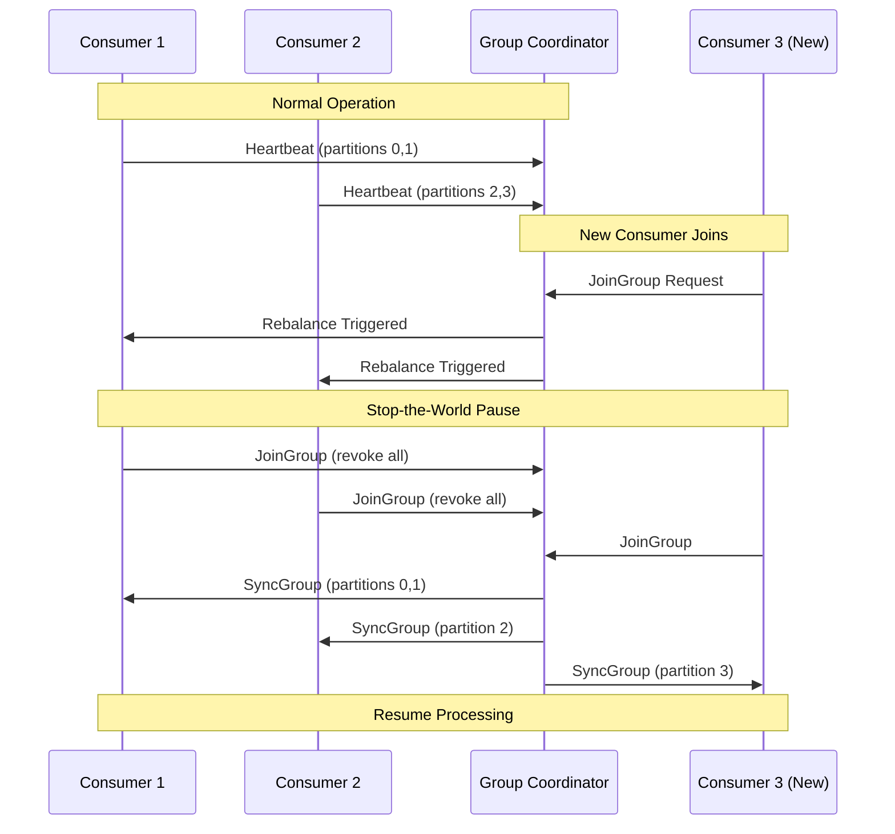
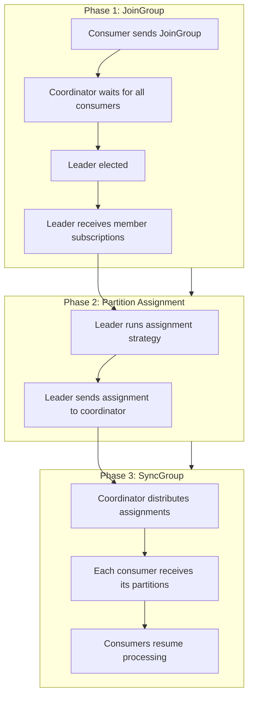
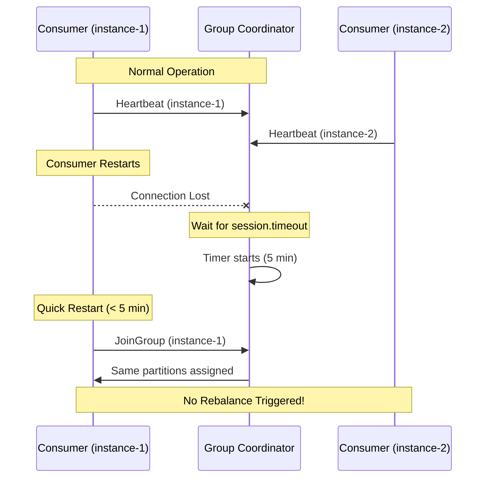
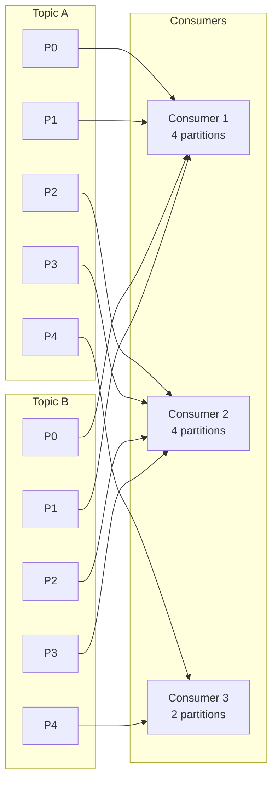
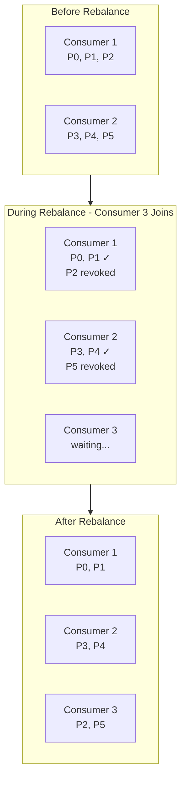
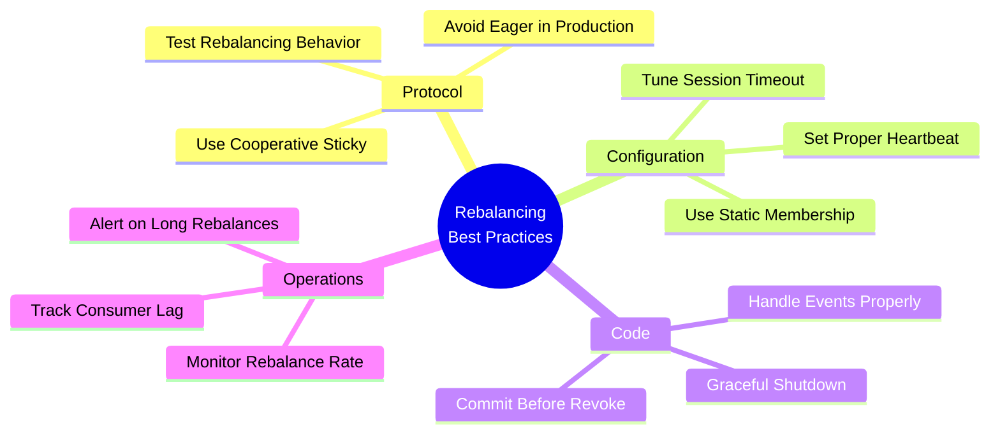

# How to Implement Kafka Consumer Group Rebalancing

By [Nawaz Dhandala](https://github.com/nawazdhandala)

Tags: Kafka, Consumer Groups, Rebalancing, Distributed Systems, Event Streaming, Microservices, Java, Node.js

Description: A comprehensive guide to implementing Kafka consumer group rebalancing strategies, covering cooperative vs eager rebalancing, static membership, partition assignment algorithms, and best practices for minimizing downtime during consumer group changes.

---

> "The key to building reliable distributed systems is understanding how they behave when things change - and in Kafka, rebalancing is when everything changes."

## Understanding Consumer Group Rebalancing

Consumer group rebalancing is one of the most critical operations in Apache Kafka. When consumers join or leave a group, Kafka must redistribute partitions among the remaining consumers. Understanding this process is essential for building resilient event-driven applications.



### Why Rebalancing Happens

Rebalancing is triggered by several events:

```java
// Common rebalancing triggers in Kafka consumers

// 1. Consumer joins the group
// When a new consumer instance starts and subscribes to a topic
KafkaConsumer<String, String> consumer = new KafkaConsumer<>(props);
consumer.subscribe(Arrays.asList("orders")); // Triggers rebalance

// 2. Consumer leaves the group (graceful shutdown)
consumer.close(); // Triggers rebalance

// 3. Consumer crashes or becomes unresponsive
// If heartbeat is not sent within session.timeout.ms, the consumer is considered dead

// 4. Topic partition count changes
// Adding partitions to a topic triggers rebalance to distribute new partitions

// 5. Subscription pattern matches new topics
consumer.subscribe(Pattern.compile("order.*")); // New matching topics trigger rebalance
```

### The Rebalancing Protocol

The rebalancing process involves several phases:



## Cooperative vs Eager Rebalancing

Kafka supports two rebalancing protocols: Eager (stop-the-world) and Cooperative (incremental). Understanding the difference is crucial for minimizing downtime.

### Eager Rebalancing (Legacy)

In eager rebalancing, all consumers stop processing and revoke all partitions before reassignment:

```java
// Eager rebalancing configuration (default in older Kafka versions)
Properties props = new Properties();
props.put(ConsumerConfig.BOOTSTRAP_SERVERS_CONFIG, "localhost:9092");
props.put(ConsumerConfig.GROUP_ID_CONFIG, "order-processor");

// Default assignor uses eager protocol
props.put(ConsumerConfig.PARTITION_ASSIGNMENT_STRATEGY_CONFIG,
    "org.apache.kafka.clients.consumer.RangeAssignor");

KafkaConsumer<String, String> consumer = new KafkaConsumer<>(props);

// With eager rebalancing, this listener sees ALL partitions revoked at once
consumer.subscribe(Arrays.asList("orders"), new ConsumerRebalanceListener() {

    @Override
    public void onPartitionsRevoked(Collection<TopicPartition> partitions) {
        // ALL partitions are revoked during rebalance
        // This causes a complete stop in processing
        System.out.println("Revoked all partitions: " + partitions);

        // Commit any pending offsets before partitions are reassigned
        commitPendingOffsets(partitions);
    }

    @Override
    public void onPartitionsAssigned(Collection<TopicPartition> partitions) {
        // New assignment received after rebalance completes
        System.out.println("Assigned partitions: " + partitions);

        // Initialize state for newly assigned partitions
        initializePartitionState(partitions);
    }
});
```



```mermaid
gantt
    title Eager Rebalancing Timeline
    dateFormat X
    axisFormat %s

    section Consumer 1
    Processing P0,P1    :done, c1a, 0, 10
    Stopped (Rebalance) :crit, c1b, 10, 15
    Processing P0       :done, c1c, 15, 25

    section Consumer 2
    Processing P2,P3    :done, c2a, 0, 10
    Stopped (Rebalance) :crit, c2b, 10, 15
    Processing P1,P2    :done, c2c, 15, 25

    section Consumer 3
    Not Started         :c3a, 0, 10
    Joining (Rebalance) :crit, c3b, 10, 15
    Processing P3       :done, c3c, 15, 25
```

### Cooperative Rebalancing (Incremental)

Cooperative rebalancing minimizes downtime by only revoking partitions that need to move:

```java
// Cooperative rebalancing configuration (recommended)
Properties props = new Properties();
props.put(ConsumerConfig.BOOTSTRAP_SERVERS_CONFIG, "localhost:9092");
props.put(ConsumerConfig.GROUP_ID_CONFIG, "order-processor");

// Use CooperativeStickyAssignor for incremental rebalancing
props.put(ConsumerConfig.PARTITION_ASSIGNMENT_STRATEGY_CONFIG,
    "org.apache.kafka.clients.consumer.CooperativeStickyAssignor");

KafkaConsumer<String, String> consumer = new KafkaConsumer<>(props);

// With cooperative rebalancing, the listener interface is extended
consumer.subscribe(Arrays.asList("orders"), new ConsumerRebalanceListener() {

    @Override
    public void onPartitionsRevoked(Collection<TopicPartition> partitions) {
        // Only partitions that are moving to another consumer are revoked
        // Other partitions continue processing during rebalance
        System.out.println("Revoked partitions (moving away): " + partitions);
        commitPendingOffsets(partitions);
    }

    @Override
    public void onPartitionsAssigned(Collection<TopicPartition> partitions) {
        // Newly assigned partitions
        System.out.println("Assigned new partitions: " + partitions);
        initializePartitionState(partitions);
    }

    // Cooperative protocol adds this callback
    // Called for partitions that are NOT being revoked (continue processing)
    public void onPartitionsLost(Collection<TopicPartition> partitions) {
        // Partitions lost due to consumer failure (not graceful revocation)
        // State may be inconsistent - handle carefully
        System.out.println("Lost partitions unexpectedly: " + partitions);
        cleanupLostPartitionState(partitions);
    }
});
```



```mermaid
gantt
    title Cooperative Rebalancing Timeline
    dateFormat X
    axisFormat %s

    section Consumer 1
    Processing P0,P1    :done, c1a, 0, 10
    Processing P0 (P1 revoked) :done, c1b, 10, 15
    Processing P0       :done, c1c, 15, 25

    section Consumer 2
    Processing P2,P3    :done, c2a, 0, 10
    Processing P2 (P3 revoked) :done, c2b, 10, 15
    Processing P1,P2    :done, c2c, 15, 25

    section Consumer 3
    Not Started         :c3a, 0, 10
    Waiting for assignment :c3b, 10, 15
    Processing P3       :done, c3c, 15, 25
```

### Comparison of Rebalancing Strategies

```java
// Helper class to demonstrate the differences
public class RebalancingComparison {

    public static void main(String[] args) {
        // Eager Rebalancing Characteristics:
        // - All partitions revoked before reassignment
        // - Complete stop in processing during rebalance
        // - Simpler protocol, fewer edge cases
        // - Rebalance duration: O(total partitions)

        // Cooperative Rebalancing Characteristics:
        // - Only moved partitions are revoked
        // - Continuous processing for stable partitions
        // - More complex protocol, requires careful state management
        // - Rebalance duration: O(moved partitions)

        // Choose cooperative for:
        // - High-throughput applications
        // - Stateful stream processing
        // - Large consumer groups
        // - Frequent scaling events
    }
}
```

## Static Membership

Static membership prevents unnecessary rebalances when consumers restart by preserving their identity across sessions.

### Configuring Static Membership

```java
// Static membership configuration
Properties props = new Properties();
props.put(ConsumerConfig.BOOTSTRAP_SERVERS_CONFIG, "localhost:9092");
props.put(ConsumerConfig.GROUP_ID_CONFIG, "order-processor");

// Assign a unique, persistent instance ID
// This ID should survive consumer restarts (e.g., from environment variable or config)
props.put(ConsumerConfig.GROUP_INSTANCE_ID_CONFIG, "order-processor-instance-1");

// Increase session timeout for static members
// Allows time for restarts without triggering rebalance
props.put(ConsumerConfig.SESSION_TIMEOUT_MS_CONFIG, "300000"); // 5 minutes

// Heartbeat interval should be much less than session timeout
props.put(ConsumerConfig.HEARTBEAT_INTERVAL_MS_CONFIG, "10000"); // 10 seconds

KafkaConsumer<String, String> consumer = new KafkaConsumer<>(props);
```

### How Static Membership Works



### Static Membership in Kubernetes

```yaml
# Kubernetes StatefulSet for Kafka consumers with static membership
apiVersion: apps/v1
kind: StatefulSet
metadata:
  name: order-processor
spec:
  serviceName: order-processor
  replicas: 3
  selector:
    matchLabels:
      app: order-processor
  template:
    metadata:
      labels:
        app: order-processor
    spec:
      containers:
        - name: consumer
          image: myapp/order-processor:latest
          env:
            # Use pod name as static group instance ID
            # StatefulSet ensures consistent naming: order-processor-0, order-processor-1, etc.
            - name: KAFKA_GROUP_INSTANCE_ID
              valueFrom:
                fieldRef:
                  fieldPath: metadata.name
            - name: KAFKA_SESSION_TIMEOUT_MS
              value: "300000"
          resources:
            requests:
              memory: "512Mi"
              cpu: "500m"
            limits:
              memory: "1Gi"
              cpu: "1000m"
```

```java
// Java consumer using Kubernetes pod name as instance ID
public class KubernetesConsumer {

    public static void main(String[] args) {
        Properties props = new Properties();
        props.put(ConsumerConfig.BOOTSTRAP_SERVERS_CONFIG,
            System.getenv("KAFKA_BOOTSTRAP_SERVERS"));
        props.put(ConsumerConfig.GROUP_ID_CONFIG, "order-processor");

        // Use pod name as instance ID (set via Kubernetes downward API)
        String instanceId = System.getenv("KAFKA_GROUP_INSTANCE_ID");
        if (instanceId != null && !instanceId.isEmpty()) {
            props.put(ConsumerConfig.GROUP_INSTANCE_ID_CONFIG, instanceId);

            // With static membership, use longer session timeout
            props.put(ConsumerConfig.SESSION_TIMEOUT_MS_CONFIG,
                System.getenv().getOrDefault("KAFKA_SESSION_TIMEOUT_MS", "300000"));
        }

        // Use cooperative assignor with static membership
        props.put(ConsumerConfig.PARTITION_ASSIGNMENT_STRATEGY_CONFIG,
            "org.apache.kafka.clients.consumer.CooperativeStickyAssignor");

        KafkaConsumer<String, String> consumer = new KafkaConsumer<>(props);
        consumer.subscribe(Arrays.asList("orders"));

        // Consumer poll loop
        while (true) {
            ConsumerRecords<String, String> records = consumer.poll(Duration.ofMillis(100));
            processRecords(records);
        }
    }
}
```

## Partition Assignment Strategies

Kafka provides several built-in partition assignment strategies. Choosing the right one impacts load distribution and rebalancing behavior.

### Range Assignor

The Range Assignor divides partitions by topic, which can lead to uneven distribution:

```java
// Range Assignor configuration
props.put(ConsumerConfig.PARTITION_ASSIGNMENT_STRATEGY_CONFIG,
    "org.apache.kafka.clients.consumer.RangeAssignor");

// How Range Assignor works:
// For each topic, partitions are sorted and consumers are sorted by member ID
// Partitions are assigned in ranges: partitions / consumers (plus remainder to first consumers)

// Example: 3 consumers, 2 topics with 5 partitions each
// Topic A: [P0, P1, P2, P3, P4]
// Topic B: [P0, P1, P2, P3, P4]

// Consumer 1: Topic A [P0, P1], Topic B [P0, P1]  -> 4 partitions
// Consumer 2: Topic A [P2, P3], Topic B [P2, P3]  -> 4 partitions
// Consumer 3: Topic A [P4],     Topic B [P4]      -> 2 partitions

// Problem: Consumer 3 has fewer partitions, especially with many topics
```



### Round Robin Assignor

The Round Robin Assignor distributes partitions more evenly across consumers:

```java
// Round Robin Assignor configuration
props.put(ConsumerConfig.PARTITION_ASSIGNMENT_STRATEGY_CONFIG,
    "org.apache.kafka.clients.consumer.RoundRobinAssignor");

// How Round Robin Assignor works:
// All partitions from all subscribed topics are sorted
// Partitions are assigned to consumers in round-robin fashion

// Example: 3 consumers, 2 topics with 5 partitions each
// All partitions: [A-P0, A-P1, A-P2, A-P3, A-P4, B-P0, B-P1, B-P2, B-P3, B-P4]

// Consumer 1: A-P0, A-P3, B-P1, B-P4  -> 4 partitions
// Consumer 2: A-P1, A-P4, B-P2        -> 3 partitions
// Consumer 3: A-P2, B-P0, B-P3        -> 3 partitions

// Better distribution, but doesn't preserve locality
```

### Sticky Assignor

The Sticky Assignor maintains previous assignments during rebalancing:

```java
// Sticky Assignor configuration (eager protocol)
props.put(ConsumerConfig.PARTITION_ASSIGNMENT_STRATEGY_CONFIG,
    "org.apache.kafka.clients.consumer.StickyAssignor");

// Benefits of Sticky Assignor:
// 1. Balanced distribution (like Round Robin)
// 2. Minimal partition movement during rebalance
// 3. Preserves consumer affinity to partitions

// Example: Consumer 3 leaves the group
// Before: C1 [A-P0, A-P3], C2 [A-P1, A-P4], C3 [A-P2, B-P0]
// After:  C1 [A-P0, A-P3, A-P2], C2 [A-P1, A-P4, B-P0]
//         Only C3's partitions are redistributed!
```

### Cooperative Sticky Assignor (Recommended)

The Cooperative Sticky Assignor combines sticky assignment with cooperative rebalancing:

```java
// Cooperative Sticky Assignor configuration (recommended for most use cases)
props.put(ConsumerConfig.PARTITION_ASSIGNMENT_STRATEGY_CONFIG,
    "org.apache.kafka.clients.consumer.CooperativeStickyAssignor");

// Best of both worlds:
// 1. Sticky assignment: minimal partition movement
// 2. Cooperative protocol: no stop-the-world pause
// 3. Incremental rebalancing: partitions move one at a time
```



### Implementing Custom Partition Assignor

For advanced use cases, you can implement a custom assignor:

```java
// Custom partition assignor for locality-aware assignment
public class LocalityAwareAssignor extends AbstractPartitionAssignor {

    @Override
    public String name() {
        return "locality-aware";
    }

    @Override
    public Map<String, List<TopicPartition>> assign(
            Map<String, Integer> partitionsPerTopic,
            Map<String, Subscription> subscriptions) {

        // Initialize result map
        Map<String, List<TopicPartition>> assignment = new HashMap<>();
        for (String memberId : subscriptions.keySet()) {
            assignment.put(memberId, new ArrayList<>());
        }

        // Get consumer metadata (e.g., datacenter, rack)
        Map<String, String> consumerLocations = extractLocations(subscriptions);

        // Get partition metadata (leader broker locations)
        Map<TopicPartition, String> partitionLocations = getPartitionLocations(partitionsPerTopic);

        // Assign partitions preferring local consumers
        for (Map.Entry<TopicPartition, String> partition : partitionLocations.entrySet()) {
            TopicPartition tp = partition.getKey();
            String partitionLocation = partition.getValue();

            // Find consumers in the same location
            List<String> localConsumers = consumerLocations.entrySet().stream()
                .filter(e -> e.getValue().equals(partitionLocation))
                .map(Map.Entry::getKey)
                .collect(Collectors.toList());

            // Assign to local consumer with fewest partitions, or any consumer if none local
            String targetConsumer = findLeastLoadedConsumer(
                localConsumers.isEmpty() ? subscriptions.keySet() : localConsumers,
                assignment
            );

            assignment.get(targetConsumer).add(tp);
        }

        return assignment;
    }

    private String findLeastLoadedConsumer(
            Collection<String> candidates,
            Map<String, List<TopicPartition>> assignment) {
        return candidates.stream()
            .min(Comparator.comparingInt(c -> assignment.get(c).size()))
            .orElseThrow();
    }
}
```

## Handling Rebalancing Events

Proper handling of rebalancing events is crucial for maintaining data consistency and minimizing duplicate processing.

### Commit Strategies During Rebalance

```java
// Robust rebalance listener with proper offset management
public class RobustRebalanceListener implements ConsumerRebalanceListener {

    private final KafkaConsumer<String, String> consumer;
    private final Map<TopicPartition, OffsetAndMetadata> pendingOffsets;
    private final Map<TopicPartition, ProcessingState> partitionStates;

    public RobustRebalanceListener(KafkaConsumer<String, String> consumer) {
        this.consumer = consumer;
        this.pendingOffsets = new ConcurrentHashMap<>();
        this.partitionStates = new ConcurrentHashMap<>();
    }

    @Override
    public void onPartitionsRevoked(Collection<TopicPartition> partitions) {
        // This is called BEFORE partitions are reassigned
        // Critical: Commit offsets and clean up state

        System.out.println("Partitions being revoked: " + partitions);

        for (TopicPartition partition : partitions) {
            // 1. Complete any in-flight processing
            ProcessingState state = partitionStates.get(partition);
            if (state != null) {
                state.waitForCompletion(Duration.ofSeconds(30));
            }

            // 2. Commit pending offsets for this partition
            OffsetAndMetadata offset = pendingOffsets.remove(partition);
            if (offset != null) {
                try {
                    consumer.commitSync(
                        Collections.singletonMap(partition, offset),
                        Duration.ofSeconds(10)
                    );
                    System.out.println("Committed offset " + offset.offset() +
                        " for " + partition);
                } catch (Exception e) {
                    System.err.println("Failed to commit offset for " + partition +
                        ": " + e.getMessage());
                    // Log for potential duplicate processing
                }
            }

            // 3. Clean up partition state
            partitionStates.remove(partition);
        }
    }

    @Override
    public void onPartitionsAssigned(Collection<TopicPartition> partitions) {
        // This is called AFTER new assignment is received

        System.out.println("Partitions assigned: " + partitions);

        for (TopicPartition partition : partitions) {
            // 1. Initialize processing state
            partitionStates.put(partition, new ProcessingState());

            // 2. Optionally seek to specific offset
            // For exactly-once, you might seek to last committed position in external store
            // long lastProcessedOffset = getLastProcessedOffset(partition);
            // consumer.seek(partition, lastProcessedOffset + 1);
        }
    }

    // Track pending offsets for commit during rebalance
    public void trackOffset(TopicPartition partition, long offset) {
        pendingOffsets.put(partition, new OffsetAndMetadata(offset + 1));
    }
}
```

### Graceful Shutdown with Rebalancing

```java
// Graceful shutdown handler
public class GracefulConsumer {

    private final KafkaConsumer<String, String> consumer;
    private final AtomicBoolean running = new AtomicBoolean(true);
    private final CountDownLatch shutdownLatch = new CountDownLatch(1);

    public GracefulConsumer(Properties props) {
        this.consumer = new KafkaConsumer<>(props);
    }

    public void start() {
        // Register shutdown hook
        Runtime.getRuntime().addShutdownHook(new Thread(this::shutdown));

        RobustRebalanceListener listener = new RobustRebalanceListener(consumer);
        consumer.subscribe(Arrays.asList("orders"), listener);

        try {
            while (running.get()) {
                ConsumerRecords<String, String> records = consumer.poll(Duration.ofMillis(100));

                for (ConsumerRecord<String, String> record : records) {
                    // Process record
                    processRecord(record);

                    // Track offset for commit during rebalance
                    listener.trackOffset(
                        new TopicPartition(record.topic(), record.partition()),
                        record.offset()
                    );
                }

                // Periodic async commit
                consumer.commitAsync();
            }
        } catch (WakeupException e) {
            // Expected during shutdown
            if (running.get()) {
                throw e;
            }
        } finally {
            try {
                // Final synchronous commit
                consumer.commitSync(Duration.ofSeconds(30));
            } finally {
                consumer.close(Duration.ofSeconds(30));
                shutdownLatch.countDown();
            }
        }
    }

    public void shutdown() {
        System.out.println("Initiating graceful shutdown...");
        running.set(false);
        consumer.wakeup(); // Interrupt poll()

        try {
            // Wait for consumer loop to finish
            shutdownLatch.await(60, TimeUnit.SECONDS);
        } catch (InterruptedException e) {
            Thread.currentThread().interrupt();
        }
        System.out.println("Shutdown complete");
    }
}
```

## Node.js Implementation

Here is how to implement rebalancing handlers in Node.js using kafkajs:

```javascript
// kafkajs consumer with rebalancing handlers
const { Kafka } = require('kafkajs');

// Initialize Kafka client
const kafka = new Kafka({
  clientId: 'order-processor',
  brokers: ['localhost:9092'],
});

// Create consumer with cooperative sticky assignment
const consumer = kafka.consumer({
  groupId: 'order-processor-group',

  // Session and heartbeat configuration
  sessionTimeout: 30000,        // 30 seconds
  heartbeatInterval: 3000,      // 3 seconds

  // Rebalance timeout - time to complete rebalance
  rebalanceTimeout: 60000,      // 60 seconds

  // Use cooperative sticky assignment (KafkaJS default)
  partitionAssigners: [
    // KafkaJS uses its own cooperative sticky assignor by default
  ],
});

// Track partition state
const partitionState = new Map();

// Rebalancing event handlers
consumer.on(consumer.events.GROUP_JOIN, async ({ payload }) => {
  console.log('Consumer joined group:', {
    groupId: payload.groupId,
    memberId: payload.memberId,
    leaderId: payload.leaderId,
    isLeader: payload.memberId === payload.leaderId,
    memberAssignment: payload.memberAssignment,
  });
});

consumer.on(consumer.events.REBALANCING, async ({ payload }) => {
  console.log('Rebalancing started:', {
    groupId: payload.groupId,
    memberId: payload.memberId,
  });

  // Pause processing during rebalance if needed
  // This is optional with cooperative rebalancing
});

// Run consumer with partition-aware processing
const run = async () => {
  await consumer.connect();

  await consumer.subscribe({
    topic: 'orders',
    fromBeginning: false,
  });

  await consumer.run({
    // Control concurrent partition processing
    partitionsConsumedConcurrently: 3,

    // Enable auto-commit or handle manually
    autoCommit: true,
    autoCommitInterval: 5000,
    autoCommitThreshold: 100,

    // Message handler
    eachMessage: async ({ topic, partition, message }) => {
      // Initialize partition state if new
      if (!partitionState.has(partition)) {
        partitionState.set(partition, {
          lastOffset: null,
          messagesProcessed: 0,
        });
        console.log(`Initialized state for partition ${partition}`);
      }

      const state = partitionState.get(partition);

      try {
        // Process message
        const order = JSON.parse(message.value.toString());
        await processOrder(order);

        // Update state
        state.lastOffset = message.offset;
        state.messagesProcessed++;

      } catch (error) {
        console.error(`Error processing message from partition ${partition}:`, error);
        // Handle error - retry, dead letter queue, etc.
      }
    },

    // Batch processing alternative
    // eachBatch: async ({ batch, resolveOffset, heartbeat, isRunning }) => {
    //   for (const message of batch.messages) {
    //     if (!isRunning()) break;
    //     await processMessage(message);
    //     resolveOffset(message.offset);
    //     await heartbeat();
    //   }
    // },
  });
};

// Graceful shutdown
const shutdown = async () => {
  console.log('Shutting down consumer...');

  try {
    // Disconnect triggers proper leave-group and offset commit
    await consumer.disconnect();
    console.log('Consumer disconnected successfully');
  } catch (error) {
    console.error('Error during shutdown:', error);
  }

  process.exit(0);
};

process.on('SIGTERM', shutdown);
process.on('SIGINT', shutdown);

// Start consumer
run().catch(console.error);

// Helper function
async function processOrder(order) {
  // Process the order
  console.log('Processing order:', order.id);
  // ... business logic
}
```

### Static Group Membership in Node.js

```javascript
// Static membership configuration for KafkaJS
const consumer = kafka.consumer({
  groupId: 'order-processor-group',

  // Static membership: provide consistent instance ID
  // This should be unique per consumer instance and persist across restarts
  // In Kubernetes, use the pod name from the downward API
  groupInstance: process.env.KAFKA_GROUP_INSTANCE_ID || `instance-${process.env.HOSTNAME}`,

  // Longer session timeout for static members
  // Consumer can restart within this window without triggering rebalance
  sessionTimeout: 300000,  // 5 minutes

  // Heartbeat should be much shorter than session timeout
  heartbeatInterval: 10000, // 10 seconds
});

console.log(`Consumer starting with static instance ID: ${consumer.groupInstance}`);
```

## Monitoring Rebalancing

Monitoring rebalancing events is critical for understanding consumer group health.

### Key Metrics to Track

```java
// Metrics to monitor for rebalancing health
public class RebalanceMetrics {

    // 1. Rebalance frequency
    // High frequency indicates instability (consumer crashes, network issues)
    // Metric: kafka.consumer.coordinator-rebalance-rate

    // 2. Rebalance latency
    // Time spent in rebalancing state
    // Metric: kafka.consumer.coordinator-rebalance-latency-avg/max

    // 3. Assigned partitions
    // Monitor for balanced distribution
    // Metric: kafka.consumer.assigned-partitions

    // 4. Commit latency
    // Slow commits can delay rebalancing
    // Metric: kafka.consumer.commit-latency-avg/max

    // 5. Consumer lag during rebalance
    // Lag increases during stop-the-world rebalance
    // Metric: kafka.consumer.records-lag-max
}
```

### Prometheus Metrics Collection

```yaml
# Prometheus scrape config for Kafka consumer metrics
scrape_configs:
  - job_name: 'kafka-consumers'
    static_configs:
      - targets: ['consumer-1:9090', 'consumer-2:9090', 'consumer-3:9090']
    metrics_path: /metrics

# Alert rules for rebalancing issues
groups:
  - name: kafka-consumer-rebalancing
    rules:
      - alert: HighRebalanceFrequency
        expr: rate(kafka_consumer_rebalance_total[5m]) > 0.1
        for: 10m
        labels:
          severity: warning
        annotations:
          summary: "High Kafka consumer rebalance frequency"
          description: "Consumer group {{ $labels.group }} is rebalancing more than 6 times per hour"

      - alert: LongRebalanceDuration
        expr: kafka_consumer_rebalance_latency_seconds > 60
        for: 5m
        labels:
          severity: warning
        annotations:
          summary: "Long Kafka consumer rebalance duration"
          description: "Consumer group {{ $labels.group }} rebalance taking more than 60 seconds"

      - alert: UnbalancedPartitionAssignment
        expr: |
          stddev by (group) (kafka_consumer_assigned_partitions)
          / avg by (group) (kafka_consumer_assigned_partitions) > 0.5
        for: 15m
        labels:
          severity: warning
        annotations:
          summary: "Unbalanced Kafka partition assignment"
          description: "Consumer group {{ $labels.group }} has uneven partition distribution"
```

### Integration with OneUptime

For comprehensive monitoring of your Kafka consumer groups and rebalancing events, integrate with [OneUptime](https://oneuptime.com). OneUptime provides:

- Real-time alerting when rebalancing takes too long
- Consumer lag monitoring during and after rebalances
- Historical analysis of rebalancing patterns
- Correlation with other infrastructure events

```javascript
// Example: Send rebalancing metrics to OneUptime
const { OneUptime } = require('@oneuptime/sdk');

const oneuptime = new OneUptime({
  apiKey: process.env.ONEUPTIME_API_KEY,
});

consumer.on(consumer.events.REBALANCING, async ({ payload }) => {
  // Track rebalancing event
  await oneuptime.trackEvent({
    name: 'kafka.consumer.rebalancing',
    properties: {
      groupId: payload.groupId,
      memberId: payload.memberId,
      timestamp: new Date().toISOString(),
    },
  });
});

consumer.on(consumer.events.GROUP_JOIN, async ({ payload }) => {
  // Track successful group join
  await oneuptime.trackEvent({
    name: 'kafka.consumer.group_join',
    properties: {
      groupId: payload.groupId,
      memberId: payload.memberId,
      partitionsAssigned: payload.memberAssignment.length,
      timestamp: new Date().toISOString(),
    },
  });
});
```

## Best Practices Summary



1. **Use Cooperative Sticky Assignor** - Minimizes partition movement and avoids stop-the-world pauses
2. **Enable Static Membership** - Prevents unnecessary rebalances during rolling restarts
3. **Handle Rebalance Events** - Always commit offsets before partitions are revoked
4. **Configure Timeouts Appropriately** - Balance between quick failure detection and avoiding false positives
5. **Implement Graceful Shutdown** - Ensure clean consumer leave and offset commits
6. **Monitor Rebalancing Metrics** - Track frequency, duration, and partition distribution
7. **Test Rebalancing Scenarios** - Simulate consumer failures and scaling in staging environments

---

Consumer group rebalancing is fundamental to Kafka's scalability and fault tolerance. By understanding the protocol, choosing the right assignment strategy, and implementing proper event handling, you can build resilient event-driven applications that gracefully handle membership changes. The shift from eager to cooperative rebalancing represents a significant improvement in consumer group stability - make sure your applications take advantage of it.
