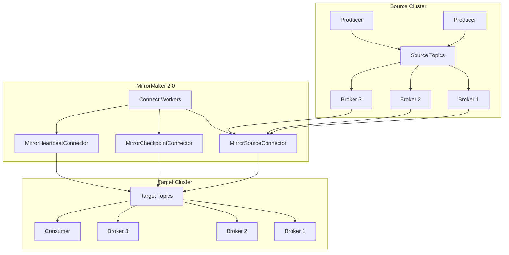
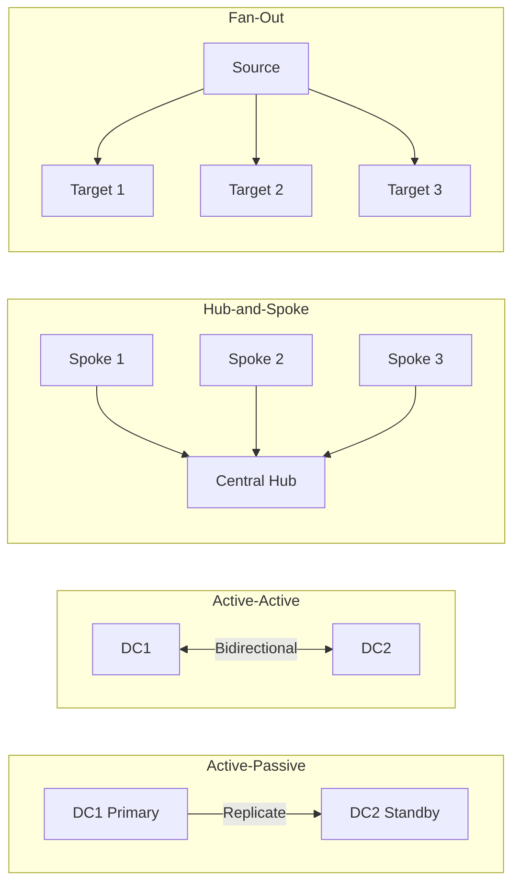
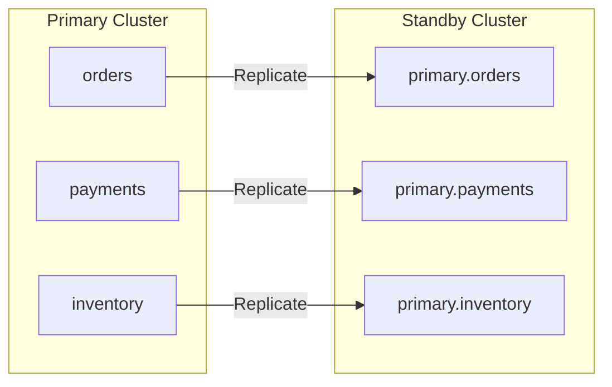
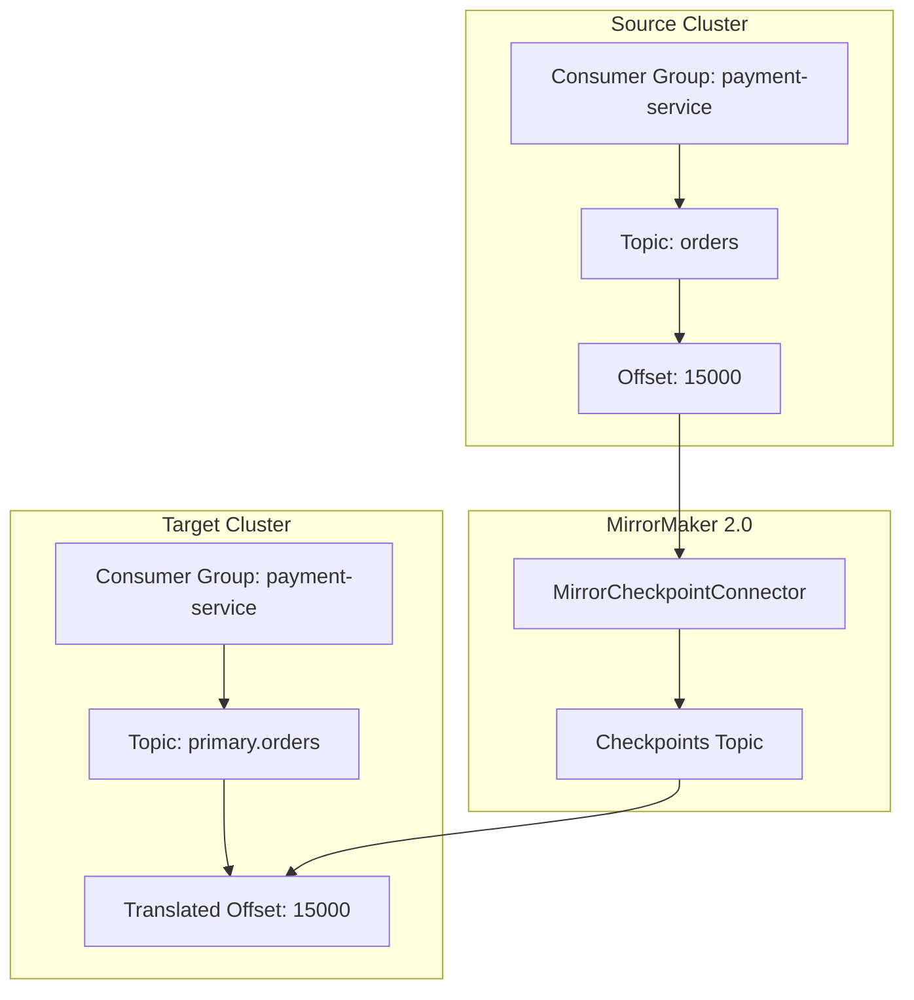
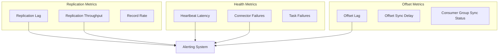
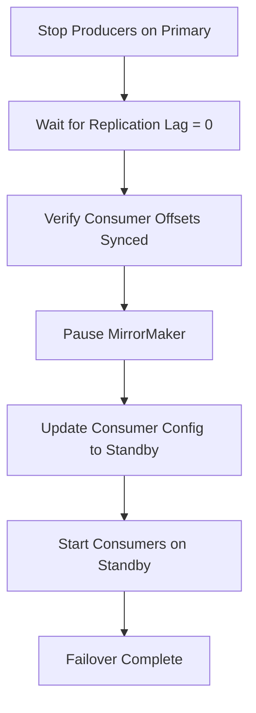

# How to Use Kafka MirrorMaker for Replication

By [Nawaz Dhandala](https://github.com/nawazdhandala)

Tags: Kafka, MirrorMaker, Replication, Cross-Datacenter, Event Streaming, Disaster Recovery, High Availability

Description: A comprehensive guide to setting up Kafka MirrorMaker 2.0 for cross-datacenter replication, including topic and consumer group synchronization, configuration best practices, and monitoring strategies.

---

> "Data is the new oil, but unlike oil, it needs to flow continuously across your infrastructure to power your business."

Kafka MirrorMaker 2.0 (MM2) is the official tool for replicating data between Kafka clusters. Whether you need disaster recovery, geographic distribution, or data aggregation, MirrorMaker 2.0 provides robust, configurable replication with automatic topic and consumer group synchronization.

## Understanding MirrorMaker 2.0 Architecture

MirrorMaker 2.0, introduced in Kafka 2.4, is built on the Kafka Connect framework. It replaces the legacy MirrorMaker 1.0 with a more powerful and flexible architecture.



### Key Components

MirrorMaker 2.0 consists of three main connectors that work together:

- **MirrorSourceConnector**: Replicates topic data from source to target cluster
- **MirrorCheckpointConnector**: Synchronizes consumer group offsets for seamless failover
- **MirrorHeartbeatConnector**: Monitors replication health and measures latency

## Cross-Datacenter Replication Topologies

MirrorMaker 2.0 supports various replication topologies depending on your requirements.



### Active-Passive (Disaster Recovery)

The most common pattern for disaster recovery. Data flows from primary to standby cluster.

```properties
# mm2.properties - Active-Passive Configuration
# This configuration replicates data from primary to standby cluster

# Define clusters - these aliases are used throughout the configuration
clusters = primary, standby

# Primary cluster connection - source of truth for data
primary.bootstrap.servers = primary-kafka-1:9092,primary-kafka-2:9092,primary-kafka-3:9092

# Standby cluster connection - disaster recovery target
standby.bootstrap.servers = standby-kafka-1:9092,standby-kafka-2:9092,standby-kafka-3:9092

# Enable replication from primary to standby
# This creates the unidirectional flow for disaster recovery
primary->standby.enabled = true

# Disable reverse replication (active-passive mode)
# Set to true for active-active bidirectional replication
standby->primary.enabled = false

# Topics to replicate (regex pattern)
# The .* pattern matches all topics - be specific in production
primary->standby.topics = .*

# Exclude internal topics from replication
# These patterns prevent replicating Kafka internal topics
primary->standby.topics.exclude = .*[\-\.]internal, .*\.replica, __.*
```

### Active-Active (Bidirectional Replication)

Both clusters can produce and consume, with changes replicated in both directions.

```properties
# mm2-active-active.properties
# Bidirectional replication for active-active deployments

# Define clusters with geographic aliases
clusters = east, west

# East cluster - US East region
east.bootstrap.servers = east-kafka-1:9092,east-kafka-2:9092,east-kafka-3:9092

# West cluster - US West region
west.bootstrap.servers = west-kafka-1:9092,west-kafka-2:9092,west-kafka-3:9092

# Enable bidirectional replication
# Both directions must be enabled for active-active
east->west.enabled = true
west->east.enabled = true

# Topics to replicate - use specific patterns in production
east->west.topics = orders.*, inventory.*, customers.*
west->east.topics = orders.*, inventory.*, customers.*

# CRITICAL: Prevent replication loops
# MirrorMaker automatically prefixes topics with source cluster alias
# east.orders on west cluster will NOT be replicated back to east
replication.policy.class = org.apache.kafka.connect.mirror.DefaultReplicationPolicy

# Sync consumer groups for failover capability
# Enables consumers to resume from correct offset after failover
sync.group.offsets.enabled = true
```

## Setting Up MirrorMaker 2.0

### Standalone Mode

For simple setups or testing, run MirrorMaker in standalone mode.

```bash
#!/bin/bash
# start-mm2-standalone.sh
# Quick start script for MirrorMaker 2.0 in standalone mode

# Download and extract Kafka (includes MirrorMaker 2.0)
KAFKA_VERSION="3.6.1"
wget https://downloads.apache.org/kafka/${KAFKA_VERSION}/kafka_2.13-${KAFKA_VERSION}.tgz
tar -xzf kafka_2.13-${KAFKA_VERSION}.tgz
cd kafka_2.13-${KAFKA_VERSION}

# Start MirrorMaker 2.0 with configuration file
# The connect-mirror-maker.sh script handles all three connectors
bin/connect-mirror-maker.sh config/mm2.properties
```

### Distributed Mode (Production)

For production, run MirrorMaker as a distributed Kafka Connect cluster.

```yaml
# docker-compose-mm2.yaml
# Production-ready MirrorMaker 2.0 deployment with Docker Compose

version: '3.8'

services:
  mirrormaker:
    image: confluentinc/cp-kafka-connect:7.5.0
    hostname: mirrormaker
    container_name: mirrormaker
    ports:
      - "8083:8083"  # REST API port for connector management
    environment:
      # Connect worker configuration
      # Bootstrap servers should point to the TARGET cluster
      CONNECT_BOOTSTRAP_SERVERS: "target-kafka-1:9092,target-kafka-2:9092"
      CONNECT_REST_PORT: 8083
      CONNECT_GROUP_ID: "mirrormaker-cluster"

      # Storage topics for Connect internal state
      # These topics store connector configs, offsets, and status
      CONNECT_CONFIG_STORAGE_TOPIC: "mm2-configs"
      CONNECT_OFFSET_STORAGE_TOPIC: "mm2-offsets"
      CONNECT_STATUS_STORAGE_TOPIC: "mm2-status"

      # Replication factor for storage topics
      # Use 3 for production high availability
      CONNECT_CONFIG_STORAGE_REPLICATION_FACTOR: 3
      CONNECT_OFFSET_STORAGE_REPLICATION_FACTOR: 3
      CONNECT_STATUS_STORAGE_REPLICATION_FACTOR: 3

      # Converter configuration
      # ByteArrayConverter preserves original message format
      CONNECT_KEY_CONVERTER: "org.apache.kafka.connect.converters.ByteArrayConverter"
      CONNECT_VALUE_CONVERTER: "org.apache.kafka.connect.converters.ByteArrayConverter"

      # Plugin path for connector JARs
      CONNECT_PLUGIN_PATH: "/usr/share/java,/usr/share/confluent-hub-components"
    volumes:
      - ./mm2-connectors:/etc/kafka-connect/connectors
    deploy:
      replicas: 3  # Run 3 workers for high availability
      resources:
        limits:
          memory: 4G
        reservations:
          memory: 2G
```

### Connector Configuration via REST API

Deploy connectors using the Kafka Connect REST API.

```bash
#!/bin/bash
# deploy-mm2-connectors.sh
# Script to deploy all three MirrorMaker 2.0 connectors

CONNECT_URL="http://localhost:8083"

# Deploy MirrorSourceConnector - handles actual data replication
curl -X POST "${CONNECT_URL}/connectors" \
  -H "Content-Type: application/json" \
  -d '{
    "name": "mirror-source-connector",
    "config": {
      "connector.class": "org.apache.kafka.connect.mirror.MirrorSourceConnector",
      "tasks.max": "10",
      "source.cluster.alias": "primary",
      "target.cluster.alias": "standby",
      "source.cluster.bootstrap.servers": "primary-kafka-1:9092,primary-kafka-2:9092",
      "target.cluster.bootstrap.servers": "standby-kafka-1:9092,standby-kafka-2:9092",
      "topics": "orders.*,payments.*,inventory.*",
      "topics.exclude": ".*-internal,__.*",
      "replication.factor": "3",
      "offset-syncs.topic.replication.factor": "3",
      "sync.topic.acls.enabled": "false",
      "sync.topic.configs.enabled": "true",
      "refresh.topics.interval.seconds": "60",
      "producer.override.compression.type": "lz4",
      "producer.override.batch.size": "524288",
      "producer.override.linger.ms": "100"
    }
  }'

# Deploy MirrorCheckpointConnector - syncs consumer group offsets
curl -X POST "${CONNECT_URL}/connectors" \
  -H "Content-Type: application/json" \
  -d '{
    "name": "mirror-checkpoint-connector",
    "config": {
      "connector.class": "org.apache.kafka.connect.mirror.MirrorCheckpointConnector",
      "tasks.max": "1",
      "source.cluster.alias": "primary",
      "target.cluster.alias": "standby",
      "source.cluster.bootstrap.servers": "primary-kafka-1:9092,primary-kafka-2:9092",
      "target.cluster.bootstrap.servers": "standby-kafka-1:9092,standby-kafka-2:9092",
      "groups": ".*",
      "groups.exclude": "console-consumer.*,connect-.*",
      "sync.group.offsets.enabled": "true",
      "sync.group.offsets.interval.seconds": "60",
      "emit.checkpoints.interval.seconds": "60",
      "checkpoints.topic.replication.factor": "3"
    }
  }'

# Deploy MirrorHeartbeatConnector - monitors replication health
curl -X POST "${CONNECT_URL}/connectors" \
  -H "Content-Type: application/json" \
  -d '{
    "name": "mirror-heartbeat-connector",
    "config": {
      "connector.class": "org.apache.kafka.connect.mirror.MirrorHeartbeatConnector",
      "tasks.max": "1",
      "source.cluster.alias": "primary",
      "target.cluster.alias": "standby",
      "source.cluster.bootstrap.servers": "primary-kafka-1:9092,primary-kafka-2:9092",
      "target.cluster.bootstrap.servers": "standby-kafka-1:9092,standby-kafka-2:9092",
      "emit.heartbeats.interval.seconds": "5",
      "heartbeats.topic.replication.factor": "3"
    }
  }'

echo "MirrorMaker 2.0 connectors deployed successfully"
```

## Topic and Consumer Group Synchronization

### Topic Naming Convention

MirrorMaker 2.0 prefixes replicated topics with the source cluster alias to prevent conflicts and replication loops.



### Custom Replication Policy

Implement a custom policy if you need different naming behavior.

```java
// IdentityReplicationPolicy.java
// Custom policy that keeps topic names unchanged
// WARNING: Use with caution in active-active setups to avoid loops

package com.example.kafka.mirror;

import org.apache.kafka.connect.mirror.ReplicationPolicy;
import java.util.Map;

public class IdentityReplicationPolicy implements ReplicationPolicy {

    @Override
    public void configure(Map<String, ?> props) {
        // No configuration needed for identity policy
        // Topic names pass through unchanged
    }

    @Override
    public String formatRemoteTopic(String sourceClusterAlias, String topic) {
        // Return topic name unchanged (no prefix added)
        // This means "orders" on source becomes "orders" on target
        return topic;
    }

    @Override
    public String topicSource(String topic) {
        // Cannot determine source without prefix
        // Returns null since we don't add source info to topic name
        return null;
    }

    @Override
    public String upstreamTopic(String topic) {
        // No transformation needed for identity policy
        return null;
    }

    @Override
    public boolean isInternalTopic(String topic) {
        // Mark MirrorMaker internal topics to exclude from replication
        return topic.endsWith(".internal") ||
               topic.contains("heartbeats") ||
               topic.contains("checkpoints");
    }
}
```

### Consumer Group Offset Translation

MirrorMaker 2.0 translates consumer offsets between clusters for seamless failover.



```bash
#!/bin/bash
# check-consumer-offset-sync.sh
# Script to verify consumer offset synchronization

# View translated offsets on standby cluster
# The checkpoints topic contains offset mappings
kafka-console-consumer.sh \
  --bootstrap-server standby-kafka-1:9092 \
  --topic primary.checkpoints.internal \
  --from-beginning \
  --property print.key=true \
  --property key.separator=" | " \
  --max-messages 10

# Check consumer group offset on target cluster
# Verify that offsets have been synced correctly
kafka-consumer-groups.sh \
  --bootstrap-server standby-kafka-1:9092 \
  --group my-consumer-group \
  --describe

# Manually sync offsets during planned failover
# Use this when you need precise control over offset position
kafka-consumer-groups.sh \
  --bootstrap-server standby-kafka-1:9092 \
  --group my-consumer-group \
  --topic primary.orders \
  --reset-offsets \
  --to-latest \
  --execute
```

## Configuration Best Practices

### Performance Tuning

```properties
# mm2-performance.properties
# Performance-optimized configuration for high-throughput replication

# Increase parallelism for high-throughput replication
# Each task handles a subset of partitions - more tasks = more parallelism
tasks.max = 20

# Producer tuning for throughput
# These settings optimize batching and compression
producer.override.acks = all
producer.override.batch.size = 524288
producer.override.linger.ms = 100
producer.override.buffer.memory = 67108864
producer.override.compression.type = lz4
producer.override.max.in.flight.requests.per.connection = 5

# Consumer tuning for throughput
# Larger fetch sizes reduce network round trips
consumer.override.fetch.min.bytes = 52428800
consumer.override.fetch.max.wait.ms = 500
consumer.override.max.poll.records = 10000
consumer.override.receive.buffer.bytes = 1048576

# Offset sync frequency
# Balance between accuracy and overhead
offset.lag.max = 100
sync.group.offsets.interval.seconds = 30
emit.checkpoints.interval.seconds = 30

# Topic refresh interval
# How often MM2 checks for new topics matching patterns
refresh.topics.interval.seconds = 60
refresh.groups.interval.seconds = 60
```

### Security Configuration

```properties
# mm2-security.properties
# Secure configuration with SASL/SSL authentication

# Source cluster security (SASL/SSL)
# Configure authentication and encryption for source cluster
source.cluster.security.protocol = SASL_SSL
source.cluster.sasl.mechanism = SCRAM-SHA-512
source.cluster.sasl.jaas.config = org.apache.kafka.common.security.scram.ScramLoginModule required \
    username="mm2-user" \
    password="source-cluster-password";
source.cluster.ssl.truststore.location = /etc/kafka/secrets/source-truststore.jks
source.cluster.ssl.truststore.password = truststore-password

# Target cluster security (SASL/SSL)
# Configure authentication and encryption for target cluster
target.cluster.security.protocol = SASL_SSL
target.cluster.sasl.mechanism = SCRAM-SHA-512
target.cluster.sasl.jaas.config = org.apache.kafka.common.security.scram.ScramLoginModule required \
    username="mm2-user" \
    password="target-cluster-password";
target.cluster.ssl.truststore.location = /etc/kafka/secrets/target-truststore.jks
target.cluster.ssl.truststore.password = truststore-password

# Sync ACLs between clusters
# Requires admin permissions on both clusters
sync.topic.acls.enabled = true
```

### High Availability Configuration

```properties
# mm2-ha.properties
# High availability configuration for production deployments

# Run multiple MirrorMaker instances
# Connect workers automatically distribute tasks across instances

# Exactly-once semantics (Kafka 3.0+)
# Ensures no duplicate records during replication
exactly.once.source.support = enabled

# Configure heartbeat for faster failure detection
heartbeats.topic.replication.factor = 3
emit.heartbeats.interval.seconds = 5

# Offset storage with high durability
# Replication factor of 3 ensures no data loss
offset.storage.replication.factor = 3
config.storage.replication.factor = 3
status.storage.replication.factor = 3

# Topic replication settings
# All MM2 internal topics use replication factor 3
replication.factor = 3
checkpoints.topic.replication.factor = 3
offset-syncs.topic.replication.factor = 3

# Error handling configuration
# tolerates errors and sends failed records to DLQ
errors.tolerance = all
errors.deadletterqueue.topic.name = mm2-dead-letter-queue
errors.deadletterqueue.topic.replication.factor = 3
errors.deadletterqueue.context.headers.enable = true
```

## Monitoring MirrorMaker 2.0

### Key Metrics to Track



### Prometheus JMX Exporter Configuration

```yaml
# jmx-exporter-mm2.yaml
# Configuration for exposing MM2 metrics to Prometheus

---
startDelaySeconds: 0
ssl: false
lowercaseOutputName: true
lowercaseOutputLabelNames: true

rules:
  # MirrorMaker Source Connector metrics
  # Captures per-partition replication statistics
  - pattern: 'kafka.connect.mirror<type=MirrorSourceConnector, target=(.+), topic=(.+), partition=(.+)><>(.+)'
    name: kafka_connect_mirror_source_connector_$4
    labels:
      target: $1
      topic: $2
      partition: $3
    type: GAUGE

  # Replication latency - critical for monitoring data freshness
  - pattern: 'kafka.connect.mirror<type=MirrorSourceConnector, target=(.+), topic=(.+), partition=(.+)><>replication-latency-ms-avg'
    name: kafka_connect_mirror_replication_latency_ms_avg
    labels:
      target: $1
      topic: $2
      partition: $3
    type: GAUGE

  # Record rate - monitors replication throughput
  - pattern: 'kafka.connect.mirror<type=MirrorSourceConnector, target=(.+), topic=(.+), partition=(.+)><>record-rate'
    name: kafka_connect_mirror_record_rate
    labels:
      target: $1
      topic: $2
      partition: $3
    type: GAUGE

  # Checkpoint connector metrics - tracks offset synchronization
  - pattern: 'kafka.connect.mirror<type=MirrorCheckpointConnector, source=(.+), target=(.+)><>(.+)'
    name: kafka_connect_mirror_checkpoint_$3
    labels:
      source: $1
      target: $2
    type: GAUGE

  # Heartbeat metrics - monitors connectivity health
  - pattern: 'kafka.connect.mirror<type=MirrorHeartbeatConnector, source=(.+), target=(.+)><>(.+)'
    name: kafka_connect_mirror_heartbeat_$3
    labels:
      source: $1
      target: $2
    type: GAUGE

  # Connect worker metrics - overall worker health
  - pattern: 'kafka.connect<type=connect-worker-metrics><>(.+)'
    name: kafka_connect_worker_$1
    type: GAUGE

  # Connector task metrics - per-task statistics
  - pattern: 'kafka.connect<type=connector-task-metrics, connector=(.+), task=(.+)><>(.+)'
    name: kafka_connect_task_$3
    labels:
      connector: $1
      task: $2
    type: GAUGE
```

### Grafana Dashboard Queries

```promql
# Replication lag in seconds - primary alert metric
avg(kafka_connect_mirror_replication_latency_ms_avg{target="standby"}) / 1000

# Records replicated per second - throughput monitoring
sum(rate(kafka_connect_mirror_record_rate{target="standby"}[5m]))

# Connector status - 1 = running, 0 = failed
kafka_connect_connector_status{connector=~"mirror.*"}

# Consumer group offset lag on target cluster
kafka_consumer_group_lag{group=~".*", topic=~"primary.*"}

# Heartbeat latency - end-to-end connectivity check
kafka_connect_mirror_heartbeat_replication_latency_ms_avg

# Task failure rate - operational health indicator
rate(kafka_connect_task_status{status="failed"}[5m])
```

### Alerting Rules

```yaml
# prometheus-alerts-mm2.yaml
# Alerting rules for MirrorMaker 2.0 monitoring

groups:
  - name: mirrormaker-alerts
    rules:
      # Warning: Replication lag exceeds 60 seconds
      - alert: MirrorMakerHighReplicationLag
        expr: kafka_connect_mirror_replication_latency_ms_avg > 60000
        for: 5m
        labels:
          severity: warning
        annotations:
          summary: "MirrorMaker replication lag is high"
          description: "Replication lag is {{ $value }}ms, exceeding 60s threshold"

      # Critical: Replication lag exceeds 5 minutes
      - alert: MirrorMakerCriticalReplicationLag
        expr: kafka_connect_mirror_replication_latency_ms_avg > 300000
        for: 2m
        labels:
          severity: critical
        annotations:
          summary: "MirrorMaker replication lag is critical"
          description: "Replication lag is {{ $value }}ms, exceeding 5min threshold"

      # Critical: Connector is not running
      - alert: MirrorMakerConnectorDown
        expr: kafka_connect_connector_status{connector=~"mirror.*"} == 0
        for: 1m
        labels:
          severity: critical
        annotations:
          summary: "MirrorMaker connector is down"
          description: "Connector {{ $labels.connector }} is not running"

      # Warning: No heartbeat received
      - alert: MirrorMakerNoHeartbeat
        expr: time() - kafka_connect_mirror_heartbeat_timestamp > 60
        for: 2m
        labels:
          severity: warning
        annotations:
          summary: "No heartbeat from MirrorMaker"
          description: "No heartbeat received for over 60 seconds"

      # Critical: Task has failed
      - alert: MirrorMakerTaskFailure
        expr: kafka_connect_task_status{connector=~"mirror.*", status="failed"} > 0
        for: 1m
        labels:
          severity: critical
        annotations:
          summary: "MirrorMaker task has failed"
          description: "Task {{ $labels.task }} in connector {{ $labels.connector }} has failed"
```

## Failover Procedures

### Planned Failover Workflow



### Planned Failover Script

```bash
#!/bin/bash
# planned-failover.sh
# Script for graceful failover to standby cluster

echo "=== Starting Planned Failover ==="

# Step 1: Stop producers on primary cluster
# This must be done at the application level
echo "Step 1: Signal producers to stop (application-level)"

# Step 2: Wait for replication to catch up
# Monitor lag until it reaches zero
echo "Step 2: Waiting for replication lag to reach zero..."
while true; do
    LAG=$(curl -s http://mirrormaker:8083/connectors/mirror-source-connector/status | \
          jq '.tasks[0].trace' | grep -o 'lag=[0-9]*' | cut -d= -f2)

    if [ "$LAG" -eq 0 ] 2>/dev/null; then
        echo "Replication caught up (lag: 0)"
        break
    fi
    echo "Current lag: $LAG records, waiting..."
    sleep 5
done

# Step 3: Verify consumer group offsets are synced
echo "Step 3: Verifying consumer group offset sync..."
kafka-consumer-groups.sh \
  --bootstrap-server standby-kafka-1:9092 \
  --group my-consumer-group \
  --describe

# Step 4: Stop MirrorMaker
# Pause connectors to prevent further replication
echo "Step 4: Stopping MirrorMaker..."
curl -X PUT "http://mirrormaker:8083/connectors/mirror-source-connector/pause"
curl -X PUT "http://mirrormaker:8083/connectors/mirror-checkpoint-connector/pause"

# Step 5: Update consumer configuration
echo "Step 5: Consumers should now connect to standby cluster"
echo "Update bootstrap.servers to: standby-kafka-1:9092,standby-kafka-2:9092"
echo "Update topic names from 'orders' to 'primary.orders'"

# Step 6: Start consumers on standby
echo "Step 6: Start consumers on standby cluster"

echo "=== Failover Complete ==="
```

### Emergency Failover Script

```bash
#!/bin/bash
# emergency-failover.sh
# Script for emergency failover when primary is unavailable

echo "=== Emergency Failover - Primary cluster unavailable ==="

# Step 1: Check last successful checkpoint
# This shows when offsets were last synced
echo "Step 1: Checking last checkpoint timestamp..."
kafka-console-consumer.sh \
  --bootstrap-server standby-kafka-1:9092 \
  --topic primary.checkpoints.internal \
  --from-beginning \
  --property print.timestamp=true \
  --timeout-ms 5000 | tail -5

# Step 2: Check consumer group offsets on standby
echo "Step 2: Current consumer group offsets on standby..."
kafka-consumer-groups.sh \
  --bootstrap-server standby-kafka-1:9092 \
  --all-groups \
  --describe

# Step 3: Calculate potential data loss window
echo "Step 3: Potential data loss = time since last checkpoint"
echo "Review checkpoint timestamps above"

# Step 4: Decision point - confirm failover
read -p "Proceed with failover? This may result in data loss. (yes/no): " CONFIRM
if [ "$CONFIRM" != "yes" ]; then
    echo "Failover aborted"
    exit 1
fi

# Step 5: Redirect traffic to standby
echo "Step 5: Update DNS/Load balancer to point to standby cluster"
echo "Standby brokers: standby-kafka-1:9092,standby-kafka-2:9092,standby-kafka-3:9092"

# Step 6: Reset consumer offsets if needed
# Uncomment and adjust if reprocessing is required
echo "Step 6: Reset consumer offsets if reprocessing is needed..."
# kafka-consumer-groups.sh \
#   --bootstrap-server standby-kafka-1:9092 \
#   --group my-consumer-group \
#   --topic primary.orders \
#   --reset-offsets \
#   --to-offset <safe-offset> \
#   --execute

echo "=== Emergency Failover Complete ==="
echo "WARNING: Audit for duplicate/missing messages after recovery"
```

## Monitoring with OneUptime

For comprehensive monitoring of your Kafka MirrorMaker 2.0 replication, [OneUptime](https://oneuptime.com) provides real-time observability and alerting capabilities.

OneUptime can help you:

- **Monitor replication lag** in real-time across all your Kafka clusters
- **Track consumer group synchronization** status and alert on sync failures
- **Visualize throughput metrics** with customizable dashboards
- **Set up intelligent alerts** for replication failures, connector issues, and lag thresholds
- **Correlate events** across your distributed Kafka infrastructure
- **Create status pages** to communicate replication health to stakeholders

Integrate your MirrorMaker metrics with OneUptime's OpenTelemetry collector for unified observability across your entire event streaming platform.

## Troubleshooting Common Issues

### Connector Fails to Start

```bash
#!/bin/bash
# troubleshoot-connector.sh
# Diagnose connector startup failures

# Check connector status via REST API
curl -s http://mirrormaker:8083/connectors/mirror-source-connector/status | jq

# View connector logs for error details
docker logs mirrormaker 2>&1 | grep -i error

# Common issues and solutions:
# 1. Cannot connect to source/target cluster
#    - Check network connectivity and firewall rules
#    - Verify bootstrap.servers configuration
#    - Check security settings (SASL, SSL)
#
# 2. Topic not found
#    - Verify topics.* pattern matches existing topics
#    - Check for typos in topic names
#
# 3. Authorization failed
#    - Verify SASL credentials are correct
#    - Ensure MM2 user has required permissions
```

### High Replication Lag

```bash
#!/bin/bash
# troubleshoot-lag.sh
# Diagnose high replication lag

# Check if lag is topic-specific
# Identify which topics have the highest lag
kafka-consumer-groups.sh \
  --bootstrap-server standby-kafka-1:9092 \
  --group connect-mirror-source-connector \
  --describe

# Increase tasks for more parallelism
# More tasks = more partitions processed in parallel
curl -X PUT "http://mirrormaker:8083/connectors/mirror-source-connector/config" \
  -H "Content-Type: application/json" \
  -d '{
    "tasks.max": "30"
  }'

# Check source cluster consumer metrics
# Verify MM2 is keeping up with source
kafka-consumer-groups.sh \
  --bootstrap-server primary-kafka-1:9092 \
  --group connect-mirror-source-connector \
  --describe
```

### Consumer Groups Not Syncing

```bash
#!/bin/bash
# troubleshoot-offset-sync.sh
# Diagnose consumer group offset synchronization issues

# Verify checkpoint connector is running
curl -s http://mirrormaker:8083/connectors/mirror-checkpoint-connector/status

# Check checkpoints topic for recent entries
kafka-console-consumer.sh \
  --bootstrap-server standby-kafka-1:9092 \
  --topic primary.checkpoints.internal \
  --from-beginning \
  --max-messages 10

# Verify group pattern matches your consumer groups
# Common issues:
# - groups = .* should match all groups
# - groups.exclude = connect-.* excludes Connect internal groups
# - Check if your consumer group is accidentally excluded
```

---

Kafka MirrorMaker 2.0 is a powerful tool for building resilient, geo-distributed Kafka architectures. With proper configuration, monitoring, and failover procedures, you can achieve near-zero RPO (Recovery Point Objective) and minimal RTO (Recovery Time Objective) for your event streaming infrastructure. Start with a simple active-passive setup, thoroughly test your failover procedures, and gradually evolve to more complex topologies as your needs grow.
