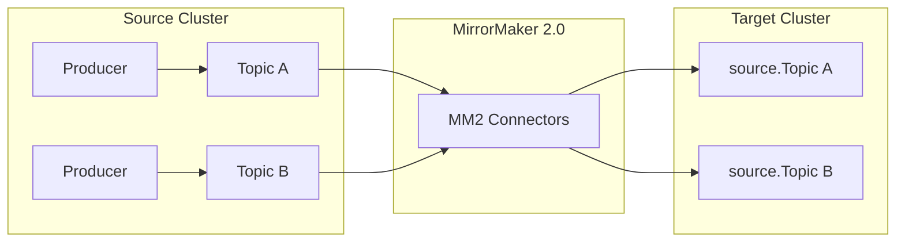
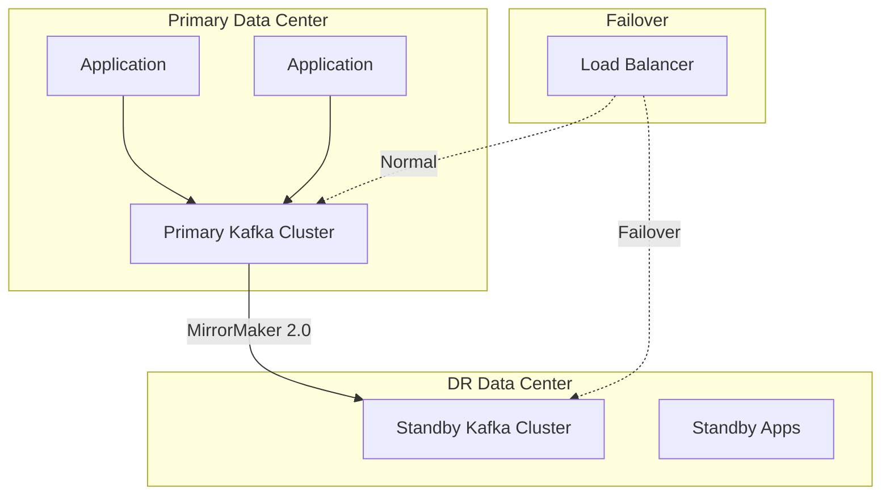
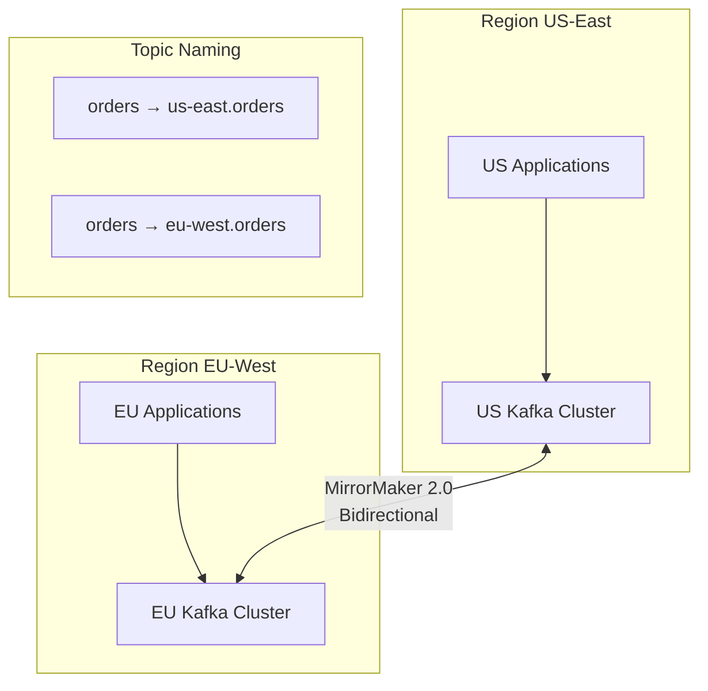
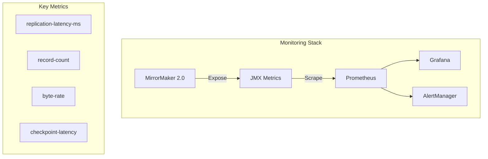

# How to Use Kafka MirrorMaker for Replication

Author: [nawazdhandala](https://www.github.com/nawazdhandala)

Tags: Kafka, MirrorMaker, Replication, Data Streaming, Disaster Recovery, High Availability, Event Streaming, DevOps

Description: A comprehensive guide to setting up Kafka MirrorMaker 2.0 for cross-cluster replication, covering active-passive and active-active configurations, topic filtering, transformation, and monitoring strategies.

---

> "Data replication is not just about copying bytes - it is about ensuring business continuity when the unexpected happens. MirrorMaker 2.0 transforms Kafka from a single-cluster solution into a globally distributed data backbone."

## What is Kafka MirrorMaker?

Kafka MirrorMaker is Apache Kafka's built-in tool for replicating data between Kafka clusters. MirrorMaker 2.0 (MM2), introduced in Kafka 2.4, is a complete rewrite based on the Kafka Connect framework that offers significant improvements over the original MirrorMaker.



### Key Features of MirrorMaker 2.0

| Feature | MirrorMaker 1.x | MirrorMaker 2.0 |
|---------|-----------------|-----------------|
| Architecture | Standalone consumer/producer | Kafka Connect based |
| Offset Translation | Manual | Automatic |
| Consumer Group Sync | No | Yes |
| Active-Active | Complex | Native support |
| Configuration | Properties files | Connect configs |
| Exactly-Once | No | Yes (with transactions) |

## MirrorMaker 2.0 Setup

### Prerequisites

Before setting up MirrorMaker 2.0, ensure you have:

- Two or more Kafka clusters (version 2.4+)
- Network connectivity between clusters
- Appropriate ACLs configured for cross-cluster access

### Basic Configuration

```properties
# mm2.properties - MirrorMaker 2.0 configuration file

# Define the cluster aliases
clusters = source, target

# Source cluster connection settings
source.bootstrap.servers = source-kafka-1:9092,source-kafka-2:9092,source-kafka-3:9092
source.security.protocol = SASL_SSL
source.sasl.mechanism = PLAIN
source.sasl.jaas.config = org.apache.kafka.common.security.plain.PlainLoginModule required \
    username="source-user" \
    password="source-password";

# Target cluster connection settings
target.bootstrap.servers = target-kafka-1:9092,target-kafka-2:9092,target-kafka-3:9092
target.security.protocol = SASL_SSL
target.sasl.mechanism = PLAIN
target.sasl.jaas.config = org.apache.kafka.common.security.plain.PlainLoginModule required \
    username="target-user" \
    password="target-password";

# Enable replication from source to target
source->target.enabled = true

# Topics to replicate (regex pattern)
source->target.topics = .*

# Replication factor for mirrored topics
replication.factor = 3

# Sync consumer group offsets
sync.group.offsets.enabled = true
sync.group.offsets.interval.seconds = 60

# Heartbeat and checkpoint settings
heartbeats.topic.replication.factor = 3
checkpoints.topic.replication.factor = 3
offset-syncs.topic.replication.factor = 3

# Refresh interval for topic discovery
refresh.topics.interval.seconds = 30

# Number of tasks for parallelism
tasks.max = 10
```

### Running MirrorMaker 2.0

```bash
# Start MirrorMaker 2.0 with the configuration file
# This command launches MM2 as a dedicated Connect cluster
bin/connect-mirror-maker.sh mm2.properties

# Alternatively, run as distributed Kafka Connect workers
# First, configure connect-distributed.properties with MM2 connectors
bin/connect-distributed.sh connect-distributed.properties
```

### Docker Compose Setup

```yaml
# docker-compose.yml - Complete MirrorMaker 2.0 setup
version: '3.8'

services:
  # Source Kafka cluster
  source-zookeeper:
    image: confluentinc/cp-zookeeper:7.5.0
    environment:
      ZOOKEEPER_CLIENT_PORT: 2181
    networks:
      - kafka-network

  source-kafka:
    image: confluentinc/cp-kafka:7.5.0
    depends_on:
      - source-zookeeper
    environment:
      KAFKA_BROKER_ID: 1
      KAFKA_ZOOKEEPER_CONNECT: source-zookeeper:2181
      KAFKA_ADVERTISED_LISTENERS: PLAINTEXT://source-kafka:9092
      KAFKA_OFFSETS_TOPIC_REPLICATION_FACTOR: 1
    networks:
      - kafka-network

  # Target Kafka cluster
  target-zookeeper:
    image: confluentinc/cp-zookeeper:7.5.0
    environment:
      ZOOKEEPER_CLIENT_PORT: 2181
    networks:
      - kafka-network

  target-kafka:
    image: confluentinc/cp-kafka:7.5.0
    depends_on:
      - target-zookeeper
    environment:
      KAFKA_BROKER_ID: 1
      KAFKA_ZOOKEEPER_CONNECT: target-zookeeper:2181
      KAFKA_ADVERTISED_LISTENERS: PLAINTEXT://target-kafka:9092
      KAFKA_OFFSETS_TOPIC_REPLICATION_FACTOR: 1
    networks:
      - kafka-network

  # MirrorMaker 2.0
  mirrormaker:
    image: confluentinc/cp-kafka:7.5.0
    depends_on:
      - source-kafka
      - target-kafka
    volumes:
      - ./mm2.properties:/etc/kafka/mm2.properties
    command: >
      bash -c "
        echo 'Waiting for Kafka clusters...' &&
        sleep 30 &&
        /usr/bin/connect-mirror-maker /etc/kafka/mm2.properties
      "
    networks:
      - kafka-network

networks:
  kafka-network:
    driver: bridge
```

## Active-Passive Replication

Active-passive replication is the most common pattern for disaster recovery. One cluster handles all production traffic while the other serves as a standby.



### Active-Passive Configuration

```properties
# mm2-active-passive.properties

# Cluster definitions
clusters = primary, dr

# Primary cluster (active)
primary.bootstrap.servers = primary-kafka-1:9092,primary-kafka-2:9092,primary-kafka-3:9092

# DR cluster (passive)
dr.bootstrap.servers = dr-kafka-1:9092,dr-kafka-2:9092,dr-kafka-3:9092

# One-way replication: primary -> dr
primary->dr.enabled = true
dr->primary.enabled = false

# Replicate all topics except internal ones
primary->dr.topics = ^(?!__.*).*

# Sync consumer group offsets for seamless failover
# This allows consumers to resume from the correct position after failover
sync.group.offsets.enabled = true
sync.group.offsets.interval.seconds = 10
emit.checkpoints.enabled = true
emit.checkpoints.interval.seconds = 10

# Preserve topic configurations
sync.topic.configs.enabled = true
sync.topic.acls.enabled = true

# Replication settings
replication.factor = 3
offset-syncs.topic.replication.factor = 3
heartbeats.topic.replication.factor = 3
checkpoints.topic.replication.factor = 3

# Performance tuning
tasks.max = 20
consumer.max.poll.records = 1000
producer.batch.size = 65536
producer.linger.ms = 5
```

### Failover Procedure Script

```bash
#!/bin/bash
# failover.sh - Automated failover script for Kafka MirrorMaker

set -e

# Configuration
PRIMARY_BOOTSTRAP="primary-kafka-1:9092,primary-kafka-2:9092"
DR_BOOTSTRAP="dr-kafka-1:9092,dr-kafka-2:9092"
CONSUMER_GROUPS=("order-processor" "payment-service" "notification-service")

echo "Starting failover procedure..."

# Step 1: Verify DR cluster health
echo "Checking DR cluster health..."
kafka-broker-api-versions.sh --bootstrap-server $DR_BOOTSTRAP > /dev/null 2>&1
if [ $? -ne 0 ]; then
    echo "ERROR: DR cluster is not healthy. Aborting failover."
    exit 1
fi

# Step 2: Stop MirrorMaker to prevent split-brain
echo "Stopping MirrorMaker..."
# Using systemd or docker
systemctl stop mirrormaker || docker stop mirrormaker

# Step 3: Wait for final offset sync
echo "Waiting for final offset synchronization..."
sleep 30

# Step 4: Translate consumer group offsets
echo "Translating consumer group offsets..."
for group in "${CONSUMER_GROUPS[@]}"; do
    echo "Processing consumer group: $group"

    # Get the translated offsets from checkpoint topic
    kafka-console-consumer.sh \
        --bootstrap-server $DR_BOOTSTRAP \
        --topic primary.checkpoints.internal \
        --from-beginning \
        --timeout-ms 10000 \
        --property print.key=true | \
        grep "$group" | tail -1 > /tmp/offsets-$group.txt

    # Reset consumer group to translated offset
    # This uses the offset translation from MM2 checkpoints
    kafka-consumer-groups.sh \
        --bootstrap-server $DR_BOOTSTRAP \
        --group $group \
        --reset-offsets \
        --to-earliest \
        --topic "primary.*" \
        --execute
done

# Step 5: Update DNS or load balancer
echo "Updating DNS records..."
# Example: Update Route53 or your DNS provider
aws route53 change-resource-record-sets \
    --hosted-zone-id Z1234567890 \
    --change-batch '{
        "Changes": [{
            "Action": "UPSERT",
            "ResourceRecordSet": {
                "Name": "kafka.example.com",
                "Type": "CNAME",
                "TTL": 60,
                "ResourceRecords": [{"Value": "dr-kafka.example.com"}]
            }
        }]
    }'

# Step 6: Start applications pointing to DR
echo "Updating application configurations..."
kubectl set env deployment/order-processor KAFKA_BOOTSTRAP_SERVERS=$DR_BOOTSTRAP
kubectl set env deployment/payment-service KAFKA_BOOTSTRAP_SERVERS=$DR_BOOTSTRAP

echo "Failover complete. DR cluster is now active."
echo "Remember to:"
echo "  1. Monitor consumer lag"
echo "  2. Verify data integrity"
echo "  3. Plan failback procedure"
```

## Active-Active Replication

Active-active replication allows both clusters to handle read and write traffic simultaneously, providing better resource utilization and lower latency for geographically distributed users.



### Active-Active Configuration

```properties
# mm2-active-active.properties

# Define both clusters
clusters = us-east, eu-west

# US-East cluster
us-east.bootstrap.servers = us-kafka-1:9092,us-kafka-2:9092,us-kafka-3:9092

# EU-West cluster
eu-west.bootstrap.servers = eu-kafka-1:9092,eu-kafka-2:9092,eu-kafka-3:9092

# Bidirectional replication
us-east->eu-west.enabled = true
eu-west->us-east.enabled = true

# Topic patterns - replicate all non-internal topics
us-east->eu-west.topics = ^(?!__.*)(?!.*\.internal).*
eu-west->us-east.topics = ^(?!__.*)(?!.*\.internal).*

# CRITICAL: Prevent replication loops
# MM2 automatically prefixes topics with source cluster name
# This regex excludes already-replicated topics
us-east->eu-west.topics.exclude = ^eu-west\..*
eu-west->us-east.topics.exclude = ^us-east\..*

# Consumer group offset sync (bidirectional)
sync.group.offsets.enabled = true
emit.checkpoints.enabled = true

# Replication settings
replication.factor = 3
tasks.max = 30

# Offset sync for both directions
us-east->eu-west.offset-syncs.topic.location = target
eu-west->us-east.offset-syncs.topic.location = target
```

### Handling Conflicts in Active-Active

```java
// ConflictResolver.java - Custom conflict resolution for active-active Kafka

import org.apache.kafka.clients.consumer.*;
import org.apache.kafka.clients.producer.*;
import java.time.Duration;
import java.util.*;

public class ConflictResolver {

    private final KafkaConsumer<String, String> consumer;
    private final KafkaProducer<String, String> producer;
    private final String localCluster;

    public ConflictResolver(String bootstrapServers, String localCluster) {
        this.localCluster = localCluster;

        // Consumer configuration
        Properties consumerProps = new Properties();
        consumerProps.put(ConsumerConfig.BOOTSTRAP_SERVERS_CONFIG, bootstrapServers);
        consumerProps.put(ConsumerConfig.GROUP_ID_CONFIG, "conflict-resolver");
        consumerProps.put(ConsumerConfig.KEY_DESERIALIZER_CLASS_CONFIG,
            "org.apache.kafka.common.serialization.StringDeserializer");
        consumerProps.put(ConsumerConfig.VALUE_DESERIALIZER_CLASS_CONFIG,
            "org.apache.kafka.common.serialization.StringDeserializer");
        this.consumer = new KafkaConsumer<>(consumerProps);

        // Producer configuration
        Properties producerProps = new Properties();
        producerProps.put(ProducerConfig.BOOTSTRAP_SERVERS_CONFIG, bootstrapServers);
        producerProps.put(ProducerConfig.KEY_SERIALIZER_CLASS_CONFIG,
            "org.apache.kafka.common.serialization.StringSerializer");
        producerProps.put(ProducerConfig.VALUE_SERIALIZER_CLASS_CONFIG,
            "org.apache.kafka.common.serialization.StringSerializer");
        this.producer = new KafkaProducer<>(producerProps);
    }

    /**
     * Subscribe to both local and remote topics to detect conflicts
     * In active-active, the same logical entity might be updated in both clusters
     */
    public void startConflictDetection(String topicName) {
        // Subscribe to local topic and all remote replicas
        List<String> topics = Arrays.asList(
            topicName,                    // Local topic
            "us-east." + topicName,       // Replica from US-East
            "eu-west." + topicName        // Replica from EU-West
        );

        consumer.subscribe(topics);

        // Track last seen version per key
        Map<String, VersionedRecord> lastSeen = new HashMap<>();

        while (true) {
            ConsumerRecords<String, String> records = consumer.poll(Duration.ofMillis(100));

            for (ConsumerRecord<String, String> record : records) {
                String key = record.key();
                long timestamp = record.timestamp();
                String sourceTopic = record.topic();

                VersionedRecord existing = lastSeen.get(key);

                if (existing != null && !existing.topic.equals(sourceTopic)) {
                    // Potential conflict detected - same key from different sources
                    if (Math.abs(existing.timestamp - timestamp) < 5000) {
                        // Records within 5 seconds - likely a conflict
                        resolveConflict(key, existing,
                            new VersionedRecord(sourceTopic, timestamp, record.value()));
                    }
                }

                // Update last seen (keep the latest)
                if (existing == null || timestamp > existing.timestamp) {
                    lastSeen.put(key, new VersionedRecord(sourceTopic, timestamp, record.value()));
                }
            }
        }
    }

    /**
     * Resolve conflicts using Last-Writer-Wins (LWW) strategy
     * Other strategies: vector clocks, CRDTs, application-specific logic
     */
    private void resolveConflict(String key, VersionedRecord record1, VersionedRecord record2) {
        System.out.println("Conflict detected for key: " + key);
        System.out.println("  Record 1: " + record1.topic + " @ " + record1.timestamp);
        System.out.println("  Record 2: " + record2.topic + " @ " + record2.timestamp);

        // Last-Writer-Wins: use the record with the latest timestamp
        VersionedRecord winner = record1.timestamp > record2.timestamp ? record1 : record2;

        System.out.println("  Winner: " + winner.topic);

        // Publish resolved record to conflict-resolution topic for audit
        producer.send(new ProducerRecord<>(
            "conflict-resolutions",
            key,
            String.format("{\"winner\":\"%s\",\"timestamp\":%d,\"value\":\"%s\"}",
                winner.topic, winner.timestamp, winner.value)
        ));
    }

    private static class VersionedRecord {
        final String topic;
        final long timestamp;
        final String value;

        VersionedRecord(String topic, long timestamp, String value) {
            this.topic = topic;
            this.timestamp = timestamp;
            this.value = value;
        }
    }
}
```

## Topic Filtering and Transformation

MirrorMaker 2.0 provides powerful filtering and transformation capabilities to control exactly what data gets replicated and how.

### Topic Filtering

```properties
# mm2-filtering.properties

clusters = source, target
source.bootstrap.servers = source:9092
target.bootstrap.servers = target:9092

source->target.enabled = true

# Include specific topics using regex
# Only replicate topics starting with 'prod-' or 'orders'
source->target.topics = prod-.*|orders.*

# Exclude topics - takes precedence over include
# Don't replicate internal topics or test data
source->target.topics.exclude = .*\.internal|test-.*|__.*

# Example patterns:
# - ".*" : All topics
# - "orders|payments|users" : Specific topics
# - "team-a\..*" : All topics from team-a
# - "^(?!test-).*" : All except those starting with test-
```

### Custom Replication Policy

```java
// CustomReplicationPolicy.java - Control topic naming and filtering

import org.apache.kafka.connect.mirror.ReplicationPolicy;
import java.util.Map;

/**
 * Custom replication policy that:
 * 1. Uses a different naming convention for replicated topics
 * 2. Filters out topics based on custom logic
 * 3. Handles topic name transformations
 */
public class CustomReplicationPolicy implements ReplicationPolicy {

    private String separator = ".";
    private String replicaSuffix = "-replica";

    @Override
    public void configure(Map<String, ?> configs) {
        // Custom configuration options
        if (configs.containsKey("replication.policy.separator")) {
            separator = (String) configs.get("replication.policy.separator");
        }
    }

    /**
     * Format the replicated topic name
     * Default MM2 behavior: source.topicName
     * Custom behavior: topicName-replica-source
     */
    @Override
    public String formatRemoteTopic(String sourceClusterAlias, String topic) {
        // Skip internal topics
        if (topic.startsWith("__") || topic.startsWith("mm2-")) {
            return null;
        }

        // Custom naming: orders -> orders-replica-us-east
        return topic + replicaSuffix + separator + sourceClusterAlias;
    }

    /**
     * Extract the source topic name from a replicated topic
     */
    @Override
    public String topicSource(String topic) {
        if (topic.contains(replicaSuffix)) {
            int idx = topic.indexOf(replicaSuffix);
            return topic.substring(0, idx);
        }
        return null;
    }

    /**
     * Extract the source cluster from a replicated topic name
     */
    @Override
    public String upstreamCluster(String topic) {
        if (topic.contains(replicaSuffix + separator)) {
            int idx = topic.lastIndexOf(separator);
            return topic.substring(idx + 1);
        }
        return null;
    }

    /**
     * Check if a topic is an internal MirrorMaker topic
     */
    @Override
    public boolean isInternalTopic(String topic) {
        return topic.startsWith("mm2-") ||
               topic.endsWith(".internal") ||
               topic.contains("heartbeats") ||
               topic.contains("checkpoints");
    }

    /**
     * Determine if a topic should be replicated
     * Return true to replicate, false to skip
     */
    public boolean shouldReplicateTopic(String topic) {
        // Skip topics with 'local' in the name
        if (topic.contains("local")) {
            return false;
        }

        // Skip already-replicated topics to prevent loops
        if (topic.contains(replicaSuffix)) {
            return false;
        }

        return true;
    }
}
```

### Message Transformation with SMTs

```properties
# mm2-transforms.properties

clusters = source, target
source.bootstrap.servers = source:9092
target.bootstrap.servers = target:9092

source->target.enabled = true
source->target.topics = .*

# Apply Single Message Transforms (SMTs)
# These transform messages during replication

# Transform 1: Add metadata headers
source->target.transforms = addHeaders,maskPII

source->target.transforms.addHeaders.type = org.apache.kafka.connect.transforms.InsertHeader
source->target.transforms.addHeaders.header = X-Replicated-From
source->target.transforms.addHeaders.value.literal = source-cluster

# Transform 2: Mask PII fields (requires custom SMT)
source->target.transforms.maskPII.type = com.example.transforms.MaskPIITransform
source->target.transforms.maskPII.fields = email,phone,ssn
source->target.transforms.maskPII.mask.char = *

# Transform 3: Filter records based on content
source->target.predicates = isProduction
source->target.predicates.isProduction.type = org.apache.kafka.connect.transforms.predicates.RecordIsTombstone
source->target.transforms.addHeaders.predicate = isProduction
source->target.transforms.addHeaders.negate = true
```

### Custom SMT for PII Masking

```java
// MaskPIITransform.java - Custom SMT for masking sensitive data

import org.apache.kafka.common.config.ConfigDef;
import org.apache.kafka.connect.connector.ConnectRecord;
import org.apache.kafka.connect.data.*;
import org.apache.kafka.connect.transforms.Transformation;
import java.util.*;

/**
 * Single Message Transform that masks PII fields during replication
 * Useful for replicating to less secure environments or for compliance
 */
public class MaskPIITransform<R extends ConnectRecord<R>> implements Transformation<R> {

    private List<String> fieldsToMask;
    private char maskChar;

    @Override
    public void configure(Map<String, ?> configs) {
        String fields = (String) configs.getOrDefault("fields", "");
        fieldsToMask = Arrays.asList(fields.split(","));
        maskChar = ((String) configs.getOrDefault("mask.char", "*")).charAt(0);
    }

    @Override
    public R apply(R record) {
        if (record.value() == null) {
            return record;
        }

        Schema schema = record.valueSchema();

        if (schema == null) {
            // Schemaless - assume JSON/Map
            @SuppressWarnings("unchecked")
            Map<String, Object> value = (Map<String, Object>) record.value();
            Map<String, Object> maskedValue = maskMapFields(value);
            return record.newRecord(
                record.topic(), record.kafkaPartition(),
                record.keySchema(), record.key(),
                null, maskedValue,
                record.timestamp()
            );
        } else {
            // With schema - use Struct
            Struct value = (Struct) record.value();
            Struct maskedValue = maskStructFields(value, schema);
            return record.newRecord(
                record.topic(), record.kafkaPartition(),
                record.keySchema(), record.key(),
                schema, maskedValue,
                record.timestamp()
            );
        }
    }

    private Map<String, Object> maskMapFields(Map<String, Object> original) {
        Map<String, Object> masked = new HashMap<>(original);

        for (String field : fieldsToMask) {
            if (masked.containsKey(field) && masked.get(field) != null) {
                String value = masked.get(field).toString();
                masked.put(field, maskString(value));
            }
        }

        return masked;
    }

    private Struct maskStructFields(Struct original, Schema schema) {
        Struct masked = new Struct(schema);

        for (Field field : schema.fields()) {
            Object value = original.get(field);

            if (fieldsToMask.contains(field.name()) && value != null) {
                masked.put(field, maskString(value.toString()));
            } else {
                masked.put(field, value);
            }
        }

        return masked;
    }

    private String maskString(String value) {
        if (value.length() <= 4) {
            return String.valueOf(maskChar).repeat(value.length());
        }
        // Keep first and last 2 characters, mask the rest
        return value.substring(0, 2) +
               String.valueOf(maskChar).repeat(value.length() - 4) +
               value.substring(value.length() - 2);
    }

    @Override
    public ConfigDef config() {
        return new ConfigDef()
            .define("fields", ConfigDef.Type.STRING, "",
                ConfigDef.Importance.HIGH, "Comma-separated list of fields to mask")
            .define("mask.char", ConfigDef.Type.STRING, "*",
                ConfigDef.Importance.LOW, "Character to use for masking");
    }

    @Override
    public void close() {
        // Cleanup if needed
    }
}
```

## Monitoring Replication Lag

Monitoring replication lag is critical to ensure data consistency and detect issues before they impact business operations.



### JMX Metrics Configuration

```properties
# mm2-monitoring.properties

# Enable JMX metrics
metric.reporters = org.apache.kafka.common.metrics.JmxReporter

# JMX configuration
jmx.port = 9999

# Key MirrorMaker 2.0 metrics to monitor:
# kafka.connect.mirror:type=MirrorSourceConnector,target=*,topic=*,partition=*
#   - replication-latency-ms-avg  : Average replication latency
#   - replication-latency-ms-max  : Maximum replication latency
#   - record-count                : Total records replicated
#   - record-age-ms-avg           : Average age of replicated records
#   - byte-rate                   : Bytes per second replicated

# kafka.connect.mirror:type=MirrorCheckpointConnector,source=*,target=*
#   - checkpoint-latency-ms       : Time to sync checkpoints
#   - group-count                 : Number of consumer groups synced
```

### Prometheus JMX Exporter Configuration

```yaml
# jmx-exporter-config.yaml

lowercaseOutputName: true
lowercaseOutputLabelNames: true

rules:
  # MirrorMaker source connector metrics
  - pattern: kafka.connect.mirror<type=MirrorSourceConnector, target=(.+), topic=(.+), partition=(.+)><>(.+)
    name: kafka_connect_mirror_source_connector_$4
    labels:
      target: "$1"
      topic: "$2"
      partition: "$3"
    type: GAUGE

  # MirrorMaker checkpoint connector metrics
  - pattern: kafka.connect.mirror<type=MirrorCheckpointConnector, source=(.+), target=(.+)><>(.+)
    name: kafka_connect_mirror_checkpoint_connector_$3
    labels:
      source: "$1"
      target: "$2"
    type: GAUGE

  # MirrorMaker heartbeat connector metrics
  - pattern: kafka.connect.mirror<type=MirrorHeartbeatConnector, source=(.+), target=(.+)><>(.+)
    name: kafka_connect_mirror_heartbeat_connector_$3
    labels:
      source: "$1"
      target: "$2"
    type: GAUGE

  # Connect worker metrics
  - pattern: kafka.connect<type=connect-worker-metrics><>(.+)
    name: kafka_connect_worker_$1
    type: GAUGE
```

### Custom Lag Monitor Script

```python
#!/usr/bin/env python3
# monitor_replication_lag.py - Monitor MirrorMaker 2.0 replication lag

import json
import time
import subprocess
from datetime import datetime
from kafka import KafkaConsumer, KafkaAdminClient
from kafka.admin import TopicDescription
import requests

class ReplicationLagMonitor:
    """
    Monitor replication lag between source and target Kafka clusters.
    Calculates lag based on:
    1. Offset lag: Difference in offsets between source and target
    2. Time lag: Age of the most recent replicated message
    """

    def __init__(self, source_bootstrap: str, target_bootstrap: str,
                 source_alias: str = "source"):
        self.source_bootstrap = source_bootstrap
        self.target_bootstrap = target_bootstrap
        self.source_alias = source_alias

        # Initialize admin clients
        self.source_admin = KafkaAdminClient(bootstrap_servers=source_bootstrap)
        self.target_admin = KafkaAdminClient(bootstrap_servers=target_bootstrap)

    def get_topic_offsets(self, bootstrap_servers: str, topics: list) -> dict:
        """Get the latest offsets for all partitions of specified topics."""
        consumer = KafkaConsumer(
            bootstrap_servers=bootstrap_servers,
            consumer_timeout_ms=5000
        )

        offsets = {}
        for topic in topics:
            partitions = consumer.partitions_for_topic(topic)
            if partitions:
                for partition in partitions:
                    tp = (topic, partition)
                    consumer.assign([tp])
                    consumer.seek_to_end(tp)
                    offsets[tp] = consumer.position(tp)

        consumer.close()
        return offsets

    def calculate_offset_lag(self, topic: str) -> dict:
        """
        Calculate offset lag for a topic between source and target.
        Target topic is named: {source_alias}.{topic}
        """
        target_topic = f"{self.source_alias}.{topic}"

        # Get source offsets
        source_offsets = self.get_topic_offsets(
            self.source_bootstrap, [topic]
        )

        # Get target offsets (replicated topic)
        target_offsets = self.get_topic_offsets(
            self.target_bootstrap, [target_topic]
        )

        lag_by_partition = {}
        total_lag = 0

        for (src_topic, partition), src_offset in source_offsets.items():
            tgt_key = (target_topic, partition)
            tgt_offset = target_offsets.get(tgt_key, 0)

            partition_lag = src_offset - tgt_offset
            lag_by_partition[partition] = {
                "source_offset": src_offset,
                "target_offset": tgt_offset,
                "lag": partition_lag
            }
            total_lag += partition_lag

        return {
            "topic": topic,
            "total_lag": total_lag,
            "partitions": lag_by_partition
        }

    def get_replication_latency_from_heartbeats(self) -> float:
        """
        Calculate replication latency using MirrorMaker heartbeat topic.
        Heartbeats contain timestamps that show end-to-end latency.
        """
        heartbeat_topic = f"{self.source_alias}.heartbeats"

        consumer = KafkaConsumer(
            heartbeat_topic,
            bootstrap_servers=self.target_bootstrap,
            auto_offset_reset='latest',
            consumer_timeout_ms=10000,
            value_deserializer=lambda x: json.loads(x.decode('utf-8'))
        )

        latencies = []

        for message in consumer:
            # Heartbeat contains source timestamp
            source_timestamp = message.value.get('timestamp', 0)
            receive_timestamp = message.timestamp

            latency_ms = receive_timestamp - source_timestamp
            latencies.append(latency_ms)

            if len(latencies) >= 10:
                break

        consumer.close()

        if latencies:
            return sum(latencies) / len(latencies)
        return -1

    def send_metrics_to_prometheus(self, metrics: dict, pushgateway_url: str):
        """Push metrics to Prometheus Pushgateway."""

        prometheus_metrics = []

        # Offset lag metric
        prometheus_metrics.append(
            f'mirrormaker_offset_lag{{topic="{metrics["topic"]}"}} {metrics["total_lag"]}'
        )

        # Per-partition lag
        for partition, data in metrics["partitions"].items():
            prometheus_metrics.append(
                f'mirrormaker_partition_lag{{topic="{metrics["topic"]}",partition="{partition}"}} {data["lag"]}'
            )

        # Latency metric
        if "latency_ms" in metrics:
            prometheus_metrics.append(
                f'mirrormaker_replication_latency_ms {metrics["latency_ms"]}'
            )

        payload = "\n".join(prometheus_metrics)

        requests.post(
            f"{pushgateway_url}/metrics/job/mirrormaker_monitor",
            data=payload,
            headers={"Content-Type": "text/plain"}
        )

    def alert_on_lag(self, lag: int, threshold: int,
                     alert_webhook: str, topic: str):
        """Send alert if lag exceeds threshold."""
        if lag > threshold:
            alert_payload = {
                "severity": "critical" if lag > threshold * 2 else "warning",
                "title": f"MirrorMaker Replication Lag Alert",
                "message": f"Topic {topic} has replication lag of {lag} messages",
                "timestamp": datetime.utcnow().isoformat(),
                "labels": {
                    "topic": topic,
                    "lag": lag,
                    "threshold": threshold
                }
            }

            requests.post(alert_webhook, json=alert_payload)
            print(f"ALERT: Lag {lag} exceeds threshold {threshold} for {topic}")

def main():
    """Main monitoring loop."""
    monitor = ReplicationLagMonitor(
        source_bootstrap="source-kafka:9092",
        target_bootstrap="target-kafka:9092",
        source_alias="source"
    )

    topics_to_monitor = ["orders", "payments", "users", "events"]
    lag_threshold = 10000  # Alert if lag exceeds 10k messages

    while True:
        print(f"\n=== Replication Lag Check: {datetime.now()} ===")

        for topic in topics_to_monitor:
            try:
                lag_info = monitor.calculate_offset_lag(topic)
                print(f"Topic: {topic}")
                print(f"  Total Lag: {lag_info['total_lag']} messages")

                # Send to monitoring system
                monitor.send_metrics_to_prometheus(
                    lag_info,
                    "http://pushgateway:9091"
                )

                # Check for alerts
                monitor.alert_on_lag(
                    lag_info['total_lag'],
                    lag_threshold,
                    "http://alertmanager:9093/api/v1/alerts",
                    topic
                )

            except Exception as e:
                print(f"Error monitoring {topic}: {e}")

        # Check heartbeat latency
        latency = monitor.get_replication_latency_from_heartbeats()
        print(f"\nAverage Replication Latency: {latency:.2f} ms")

        # Sleep before next check
        time.sleep(30)

if __name__ == "__main__":
    main()
```

### Grafana Dashboard JSON

```json
{
  "title": "MirrorMaker 2.0 Monitoring",
  "panels": [
    {
      "title": "Replication Lag by Topic",
      "type": "timeseries",
      "targets": [
        {
          "expr": "sum by (topic) (mirrormaker_offset_lag)",
          "legendFormat": "{{topic}}"
        }
      ],
      "fieldConfig": {
        "defaults": {
          "unit": "short",
          "thresholds": {
            "steps": [
              {"color": "green", "value": 0},
              {"color": "yellow", "value": 1000},
              {"color": "red", "value": 10000}
            ]
          }
        }
      }
    },
    {
      "title": "Replication Latency",
      "type": "gauge",
      "targets": [
        {
          "expr": "kafka_connect_mirror_source_connector_replication_latency_ms_avg"
        }
      ],
      "fieldConfig": {
        "defaults": {
          "unit": "ms",
          "thresholds": {
            "steps": [
              {"color": "green", "value": 0},
              {"color": "yellow", "value": 1000},
              {"color": "red", "value": 5000}
            ]
          }
        }
      }
    },
    {
      "title": "Records Replicated per Second",
      "type": "stat",
      "targets": [
        {
          "expr": "sum(rate(kafka_connect_mirror_source_connector_record_count[5m]))"
        }
      ]
    },
    {
      "title": "Bytes Replicated per Second",
      "type": "timeseries",
      "targets": [
        {
          "expr": "sum by (topic) (kafka_connect_mirror_source_connector_byte_rate)",
          "legendFormat": "{{topic}}"
        }
      ],
      "fieldConfig": {
        "defaults": {
          "unit": "Bps"
        }
      }
    }
  ]
}
```

## Best Practices Summary

| Category | Best Practice | Rationale |
|----------|---------------|-----------|
| **Architecture** | Use MirrorMaker 2.0 over 1.x | Better offset management, native active-active support |
| **Networking** | Deploy MM2 close to target cluster | Reduces network latency, improves throughput |
| **Security** | Use TLS and SASL authentication | Protect data in transit between clusters |
| **Topics** | Use explicit topic patterns | Avoid replicating unnecessary data |
| **Offsets** | Enable checkpoint and offset sync | Enables seamless consumer failover |
| **Monitoring** | Track lag, latency, and throughput | Early detection of replication issues |
| **Testing** | Regular DR drills | Validate failover procedures work |
| **Capacity** | Size for peak load + 30% buffer | Handle traffic spikes during incidents |
| **Naming** | Use consistent cluster aliases | Simplifies topic management and routing |
| **Documentation** | Document failover runbooks | Reduce MTTR during incidents |

### Quick Reference Commands

```bash
# Check MirrorMaker status
curl -s http://localhost:8083/connectors | jq

# View connector configuration
curl -s http://localhost:8083/connectors/MirrorSourceConnector/config | jq

# Check connector status
curl -s http://localhost:8083/connectors/MirrorSourceConnector/status | jq

# Pause replication
curl -X PUT http://localhost:8083/connectors/MirrorSourceConnector/pause

# Resume replication
curl -X PUT http://localhost:8083/connectors/MirrorSourceConnector/resume

# View replicated topics on target
kafka-topics.sh --bootstrap-server target:9092 --list | grep "source\."

# Check consumer group offsets on target
kafka-consumer-groups.sh --bootstrap-server target:9092 --describe --group my-consumer-group

# View checkpoint topic (offset translation)
kafka-console-consumer.sh --bootstrap-server target:9092 \
  --topic source.checkpoints.internal --from-beginning
```

---

Kafka MirrorMaker 2.0 is an essential tool for building resilient, globally distributed Kafka deployments. Whether you need disaster recovery with active-passive replication or true multi-region active-active setups, MM2 provides the foundation. Remember to thoroughly test your replication setup, monitor lag continuously, and practice failover procedures regularly. For comprehensive monitoring of your Kafka infrastructure and MirrorMaker replication, consider using [OneUptime](https://oneuptime.com) - an open-source observability platform that helps you track replication lag, alert on anomalies, and ensure your data pipelines remain healthy.
