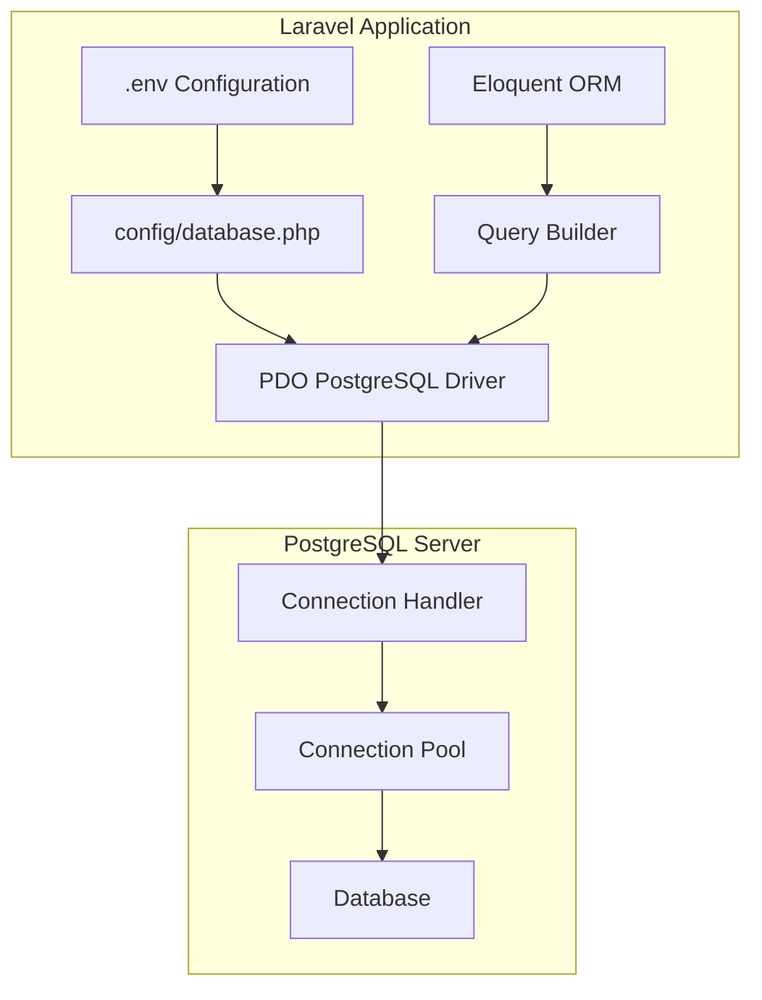
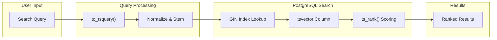
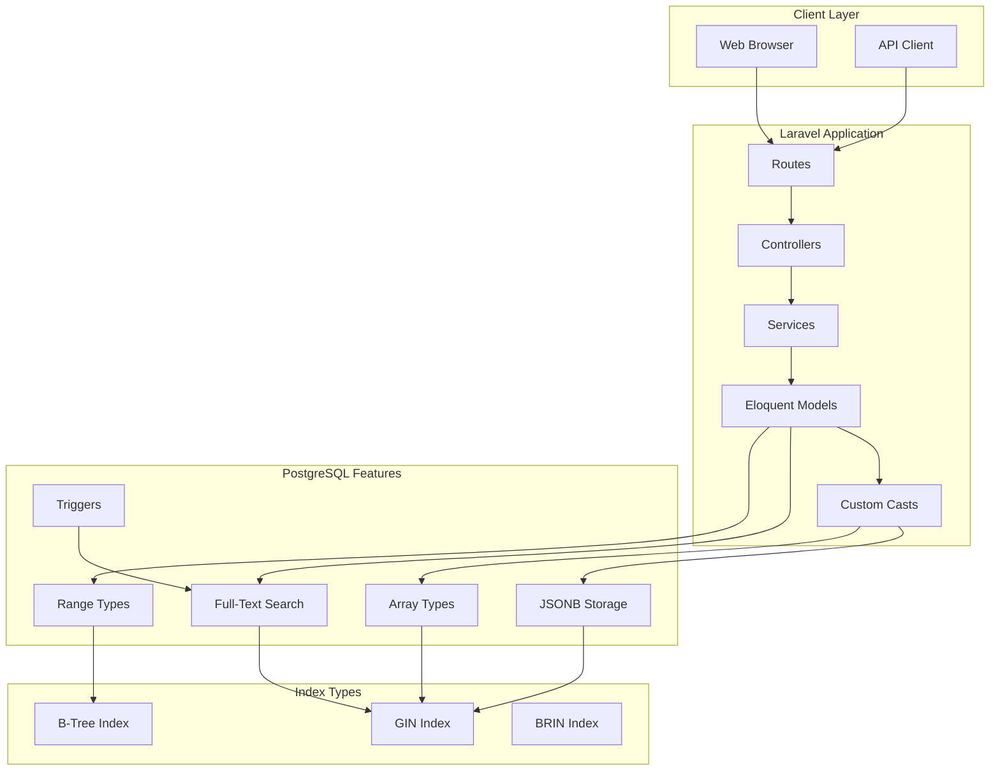

# How to Use Laravel with PostgreSQL

Author: [nawazdhandala](https://www.github.com/nawazdhandala)

Tags: Laravel, PostgreSQL, PHP, Database, Backend, Full-Text Search, JSONB

Description: A comprehensive guide to using Laravel with PostgreSQL, covering database configuration, PostgreSQL-specific features like JSONB and arrays, full-text search implementation, and migrations with native PostgreSQL types.

---

> "PostgreSQL is the world's most advanced open source database, and Laravel makes working with it a joy."

Building modern web applications requires a robust database that can handle complex data types, efficient full-text search, and advanced querying capabilities. PostgreSQL excels at all of these, and Laravel provides excellent support for leveraging PostgreSQL's unique features. This guide walks you through everything from basic configuration to advanced PostgreSQL-specific implementations.

## Database Configuration

### Basic Setup

Configure your PostgreSQL connection in Laravel's `.env` file. These environment variables control how Laravel connects to your database.

```env
# Database connection type - tells Laravel to use PostgreSQL driver
DB_CONNECTION=pgsql

# PostgreSQL server hostname (use localhost for local dev)
DB_HOST=127.0.0.1

# Default PostgreSQL port (change if using non-standard port)
DB_PORT=5432

# Database name to connect to
DB_DATABASE=your_database_name

# PostgreSQL user credentials
DB_USERNAME=your_username
DB_PASSWORD=your_secret_password
```

### Advanced Configuration

For production environments, configure additional PostgreSQL-specific options in `config/database.php`. These settings optimize connection handling and enable SSL for secure communications.

```php
<?php

// config/database.php

return [
    'default' => env('DB_CONNECTION', 'pgsql'),

    'connections' => [
        'pgsql' => [
            // Use PostgreSQL PDO driver
            'driver' => 'pgsql',
            'url' => env('DATABASE_URL'),
            'host' => env('DB_HOST', '127.0.0.1'),
            'port' => env('DB_PORT', '5432'),
            'database' => env('DB_DATABASE', 'forge'),
            'username' => env('DB_USERNAME', 'forge'),
            'password' => env('DB_PASSWORD', ''),

            // Character encoding for the connection
            'charset' => 'utf8',

            // Prefix for all table names (useful for shared databases)
            'prefix' => '',

            // Prefix indexes with table name to avoid collisions
            'prefix_indexes' => true,

            // Use 'public' schema by default (PostgreSQL concept)
            'search_path' => 'public',

            // Enable SSL for production connections
            'sslmode' => env('DB_SSLMODE', 'prefer'),

            // Path to SSL certificate for secure connections
            'sslcert' => env('DB_SSLCERT'),
            'sslkey' => env('DB_SSLKEY'),
            'sslrootcert' => env('DB_SSLROOTCERT'),
        ],
    ],
];
```

### Connection Architecture

The following diagram illustrates how Laravel connects to PostgreSQL through its database abstraction layer.



## Working with JSONB Columns

PostgreSQL's JSONB type stores JSON data in a binary format optimized for querying. Unlike regular JSON, JSONB is decomposed into a binary structure that allows efficient indexing and faster query operations.

### Creating JSONB Columns

Use Laravel's migration builder to create JSONB columns. The `jsonb` method maps directly to PostgreSQL's native JSONB type.

```php
<?php

use Illuminate\Database\Migrations\Migration;
use Illuminate\Database\Schema\Blueprint;
use Illuminate\Support\Facades\Schema;

return new class extends Migration
{
    public function up(): void
    {
        Schema::create('products', function (Blueprint $table) {
            // Standard primary key
            $table->id();

            // Regular string columns
            $table->string('name');
            $table->decimal('price', 10, 2);

            // JSONB column for flexible attribute storage
            // Stores product specifications that vary by category
            $table->jsonb('attributes')->nullable();

            // JSONB column for metadata with a default empty object
            // Useful for storing dynamic key-value pairs
            $table->jsonb('metadata')->default('{}');

            // JSONB array for storing multiple tags
            $table->jsonb('tags')->default('[]');

            $table->timestamps();
        });
    }
};
```

### Querying JSONB Data

Laravel provides fluent methods for querying JSONB columns using PostgreSQL's arrow operators. The `->` operator extracts JSON as text, while `->>` extracts as JSON.

```php
<?php

namespace App\Http\Controllers;

use App\Models\Product;
use Illuminate\Http\Request;

class ProductController extends Controller
{
    /**
     * Find products by a specific attribute value.
     * Uses PostgreSQL's -> operator via Laravel's arrow syntax.
     */
    public function findByAttribute(string $key, string $value)
    {
        // Query JSONB field using arrow notation
        // This translates to: attributes->>'color' = 'red'
        return Product::where("attributes->{$key}", $value)->get();
    }

    /**
     * Find products where a nested JSONB value matches.
     * Supports deeply nested JSON structures.
     */
    public function findByNestedAttribute()
    {
        // Query nested JSONB: attributes->'dimensions'->>'width'
        return Product::where('attributes->dimensions->width', '>', 10)
            ->get();
    }

    /**
     * Check if a JSONB array contains a specific value.
     * Uses PostgreSQL's @> containment operator.
     */
    public function findByTag(string $tag)
    {
        // Uses PostgreSQL's @> operator for JSONB containment
        return Product::whereJsonContains('tags', $tag)->get();
    }

    /**
     * Find products that have any of the specified tags.
     * Combines multiple containment checks with OR logic.
     */
    public function findByAnyTag(array $tags)
    {
        return Product::where(function ($query) use ($tags) {
            foreach ($tags as $tag) {
                // OR condition: product has this tag
                $query->orWhereJsonContains('tags', $tag);
            }
        })->get();
    }

    /**
     * Find products where JSONB key exists.
     * Useful for sparse data where not all products have all attributes.
     */
    public function findWithAttribute(string $key)
    {
        // Check if the JSONB object has a specific key
        return Product::whereNotNull("attributes->{$key}")->get();
    }
}
```

### Indexing JSONB for Performance

Create GIN (Generalized Inverted Index) indexes on JSONB columns for efficient querying. GIN indexes are particularly effective for containment queries and key existence checks.

```php
<?php

use Illuminate\Database\Migrations\Migration;
use Illuminate\Support\Facades\DB;

return new class extends Migration
{
    public function up(): void
    {
        // GIN index for full JSONB containment queries
        // Optimizes: WHERE attributes @> '{"color": "red"}'
        DB::statement('
            CREATE INDEX products_attributes_gin
            ON products USING GIN (attributes)
        ');

        // GIN index with jsonb_path_ops for specific path queries
        // Smaller index, faster for path queries like @>
        DB::statement('
            CREATE INDEX products_attributes_path_gin
            ON products USING GIN (attributes jsonb_path_ops)
        ');

        // B-tree index on a specific JSONB path
        // Optimizes: WHERE attributes->>'category' = 'electronics'
        DB::statement('
            CREATE INDEX products_category_idx
            ON products ((attributes->>\'category\'))
        ');

        // GIN index on tags array for containment queries
        DB::statement('
            CREATE INDEX products_tags_gin
            ON products USING GIN (tags)
        ');
    }

    public function down(): void
    {
        DB::statement('DROP INDEX IF EXISTS products_attributes_gin');
        DB::statement('DROP INDEX IF EXISTS products_attributes_path_gin');
        DB::statement('DROP INDEX IF EXISTS products_category_idx');
        DB::statement('DROP INDEX IF EXISTS products_tags_gin');
    }
};
```

## PostgreSQL Arrays

PostgreSQL supports native array types, which are more efficient than JSONB for simple lists of values. Laravel can work with these through raw expressions and custom casts.

### Creating Array Columns

Use raw SQL in migrations to create PostgreSQL array columns, as Laravel's schema builder doesn't have native array support.

```php
<?php

use Illuminate\Database\Migrations\Migration;
use Illuminate\Database\Schema\Blueprint;
use Illuminate\Support\Facades\Schema;
use Illuminate\Support\Facades\DB;

return new class extends Migration
{
    public function up(): void
    {
        Schema::create('articles', function (Blueprint $table) {
            $table->id();
            $table->string('title');
            $table->text('content');
            $table->timestamps();
        });

        // Add PostgreSQL array columns using raw SQL
        // TEXT[] creates an array of text values
        DB::statement('
            ALTER TABLE articles
            ADD COLUMN categories TEXT[] DEFAULT \'{}\'
        ');

        // INTEGER[] for numeric arrays (e.g., related article IDs)
        DB::statement('
            ALTER TABLE articles
            ADD COLUMN related_ids INTEGER[] DEFAULT \'{}\'
        ');
    }

    public function down(): void
    {
        Schema::dropIfExists('articles');
    }
};
```

### Array Attribute Casting

Create a custom cast to handle PostgreSQL arrays in Eloquent models. This automatically converts between PHP arrays and PostgreSQL array syntax.

```php
<?php

namespace App\Casts;

use Illuminate\Contracts\Database\Eloquent\CastsAttributes;
use Illuminate\Database\Eloquent\Model;

/**
 * Cast PostgreSQL arrays to/from PHP arrays.
 * Handles the {value1,value2} PostgreSQL array format.
 */
class PostgresArray implements CastsAttributes
{
    /**
     * Convert PostgreSQL array string to PHP array.
     * Input format: {value1,value2,value3}
     */
    public function get(
        Model $model,
        string $key,
        mixed $value,
        array $attributes
    ): array {
        if (is_null($value)) {
            return [];
        }

        // Handle already-decoded arrays (from some PDO configurations)
        if (is_array($value)) {
            return $value;
        }

        // Remove curly braces and split by comma
        // PostgreSQL format: {item1,item2,item3}
        $value = trim($value, '{}');

        if (empty($value)) {
            return [];
        }

        // Parse PostgreSQL array format, handling quoted strings
        return str_getcsv($value);
    }

    /**
     * Convert PHP array to PostgreSQL array string.
     * Output format: {value1,value2,value3}
     */
    public function set(
        Model $model,
        string $key,
        mixed $value,
        array $attributes
    ): string {
        if (is_null($value) || empty($value)) {
            return '{}';
        }

        // Escape values and format as PostgreSQL array
        $escaped = array_map(function ($item) {
            // Escape quotes and wrap in quotes if contains special chars
            if (str_contains($item, ',') || str_contains($item, '"')) {
                return '"' . str_replace('"', '\\"', $item) . '"';
            }
            return $item;
        }, $value);

        return '{' . implode(',', $escaped) . '}';
    }
}
```

### Using Array Casts in Models

Apply the custom cast to your Eloquent model to seamlessly work with PostgreSQL arrays.

```php
<?php

namespace App\Models;

use App\Casts\PostgresArray;
use Illuminate\Database\Eloquent\Model;

class Article extends Model
{
    protected $fillable = [
        'title',
        'content',
        'categories',
        'related_ids',
    ];

    /**
     * Cast PostgreSQL array columns to PHP arrays.
     */
    protected $casts = [
        'categories' => PostgresArray::class,
        'related_ids' => PostgresArray::class,
    ];
}
```

### Querying Array Columns

PostgreSQL provides powerful array operators for querying. Use raw expressions to leverage these in Laravel.

```php
<?php

namespace App\Http\Controllers;

use App\Models\Article;
use Illuminate\Support\Facades\DB;

class ArticleController extends Controller
{
    /**
     * Find articles containing a specific category.
     * Uses PostgreSQL's @> (contains) operator.
     */
    public function findByCategory(string $category)
    {
        // @> checks if array contains the element
        return Article::whereRaw(
            'categories @> ARRAY[?]::TEXT[]',
            [$category]
        )->get();
    }

    /**
     * Find articles with any of the specified categories.
     * Uses PostgreSQL's && (overlap) operator.
     */
    public function findByAnyCategory(array $categories)
    {
        // && checks if arrays have any elements in common
        $placeholders = implode(',', array_fill(0, count($categories), '?'));

        return Article::whereRaw(
            "categories && ARRAY[{$placeholders}]::TEXT[]",
            $categories
        )->get();
    }

    /**
     * Find articles with all specified categories.
     * Uses PostgreSQL's @> (contains) with array parameter.
     */
    public function findWithAllCategories(array $categories)
    {
        $placeholders = implode(',', array_fill(0, count($categories), '?'));

        return Article::whereRaw(
            "categories @> ARRAY[{$placeholders}]::TEXT[]",
            $categories
        )->get();
    }
}
```

## Full-Text Search

PostgreSQL's built-in full-text search provides powerful text searching capabilities without external services. It supports stemming, ranking, and complex search queries.

### Setting Up Full-Text Search

Create a migration to add a tsvector column and GIN index for efficient full-text search.

```php
<?php

use Illuminate\Database\Migrations\Migration;
use Illuminate\Database\Schema\Blueprint;
use Illuminate\Support\Facades\Schema;
use Illuminate\Support\Facades\DB;

return new class extends Migration
{
    public function up(): void
    {
        Schema::create('posts', function (Blueprint $table) {
            $table->id();
            $table->string('title');
            $table->text('body');
            $table->string('author');
            $table->timestamps();
        });

        // Add tsvector column for full-text search
        // tsvector stores preprocessed text for efficient searching
        DB::statement('
            ALTER TABLE posts
            ADD COLUMN search_vector TSVECTOR
        ');

        // Create GIN index on tsvector for fast full-text queries
        DB::statement('
            CREATE INDEX posts_search_idx
            ON posts USING GIN (search_vector)
        ');

        // Create trigger to automatically update search_vector
        // Combines title (weight A - highest) and body (weight B)
        // 'english' specifies the text search configuration for stemming
        DB::statement("
            CREATE OR REPLACE FUNCTION posts_search_update()
            RETURNS TRIGGER AS \$\$
            BEGIN
                NEW.search_vector :=
                    setweight(to_tsvector('english', COALESCE(NEW.title, '')), 'A') ||
                    setweight(to_tsvector('english', COALESCE(NEW.body, '')), 'B');
                RETURN NEW;
            END;
            \$\$ LANGUAGE plpgsql;
        ");

        DB::statement('
            CREATE TRIGGER posts_search_update_trigger
            BEFORE INSERT OR UPDATE ON posts
            FOR EACH ROW EXECUTE FUNCTION posts_search_update()
        ');
    }

    public function down(): void
    {
        DB::statement('DROP TRIGGER IF EXISTS posts_search_update_trigger ON posts');
        DB::statement('DROP FUNCTION IF EXISTS posts_search_update()');
        Schema::dropIfExists('posts');
    }
};
```

### Full-Text Search Flow

The following diagram shows how full-text search processes queries in PostgreSQL.



### Implementing Search in Laravel

Create a search service that leverages PostgreSQL's full-text search capabilities with ranking and highlighting.

```php
<?php

namespace App\Services;

use App\Models\Post;
use Illuminate\Support\Facades\DB;
use Illuminate\Database\Eloquent\Collection;

class SearchService
{
    /**
     * Perform full-text search with ranking.
     *
     * @param string $query User's search query
     * @return Collection Matching posts ordered by relevance
     */
    public function search(string $query): Collection
    {
        // Sanitize and prepare search query
        $tsQuery = $this->prepareSearchQuery($query);

        return Post::select([
                'posts.*',
                // Calculate relevance score using ts_rank
                // Higher scores indicate better matches
                DB::raw("ts_rank(search_vector, to_tsquery('english', ?)) as relevance")
            ])
            ->addBinding($tsQuery, 'select')
            // @@ operator matches tsvector against tsquery
            ->whereRaw("search_vector @@ to_tsquery('english', ?)", [$tsQuery])
            // Order by relevance score descending
            ->orderByDesc('relevance')
            ->get();
    }

    /**
     * Search with highlighted snippets.
     * Returns matching text with search terms highlighted.
     */
    public function searchWithHighlights(string $query): Collection
    {
        $tsQuery = $this->prepareSearchQuery($query);

        return Post::select([
                'posts.*',
                DB::raw("ts_rank(search_vector, to_tsquery('english', ?)) as relevance"),
                // ts_headline generates highlighted snippets
                // Wraps matching terms in <b> tags by default
                DB::raw("ts_headline('english', body, to_tsquery('english', ?),
                    'StartSel=<mark>, StopSel=</mark>, MaxWords=50, MinWords=25'
                ) as snippet")
            ])
            ->addBinding($tsQuery, 'select')
            ->addBinding($tsQuery, 'select')
            ->whereRaw("search_vector @@ to_tsquery('english', ?)", [$tsQuery])
            ->orderByDesc('relevance')
            ->get();
    }

    /**
     * Prepare search query for PostgreSQL.
     * Converts user input to proper tsquery format.
     */
    private function prepareSearchQuery(string $query): string
    {
        // Remove special characters that could break the query
        $query = preg_replace('/[^\w\s]/', '', $query);

        // Split into words and join with & for AND logic
        $words = array_filter(explode(' ', $query));

        // Add :* suffix for prefix matching (partial words)
        return implode(' & ', array_map(fn($word) => $word . ':*', $words));
    }

    /**
     * Advanced search with phrase matching.
     * Finds exact phrases using <-> (followed by) operator.
     */
    public function phraseSearch(string $phrase): Collection
    {
        // Use phraseto_tsquery for exact phrase matching
        return Post::whereRaw(
            "search_vector @@ phraseto_tsquery('english', ?)",
            [$phrase]
        )
        ->orderByDesc('updated_at')
        ->get();
    }
}
```

### Search Query Syntax

Provide a model method for flexible search query construction.

```php
<?php

namespace App\Models;

use Illuminate\Database\Eloquent\Model;
use Illuminate\Database\Eloquent\Builder;
use Illuminate\Support\Facades\DB;

class Post extends Model
{
    protected $fillable = ['title', 'body', 'author'];

    /**
     * Scope for full-text search.
     * Can be chained with other query conditions.
     */
    public function scopeSearch(Builder $query, string $search): Builder
    {
        if (empty($search)) {
            return $query;
        }

        // Prepare search terms
        $terms = collect(explode(' ', $search))
            ->filter()
            ->map(fn($term) => $term . ':*')
            ->implode(' & ');

        return $query
            ->whereRaw("search_vector @@ to_tsquery('english', ?)", [$terms])
            ->orderByRaw("ts_rank(search_vector, to_tsquery('english', ?)) DESC", [$terms]);
    }

    /**
     * Scope for searching within specific columns.
     * Bypasses the pre-built tsvector for ad-hoc searches.
     */
    public function scopeSearchIn(
        Builder $query,
        string $search,
        array $columns
    ): Builder {
        $vectors = collect($columns)
            ->map(fn($col) => "COALESCE({$col}, '')")
            ->implode(" || ' ' || ");

        $terms = collect(explode(' ', $search))
            ->filter()
            ->map(fn($term) => $term . ':*')
            ->implode(' & ');

        return $query->whereRaw(
            "to_tsvector('english', {$vectors}) @@ to_tsquery('english', ?)",
            [$terms]
        );
    }
}
```

## Migrations with PostgreSQL Types

Leverage PostgreSQL-specific data types for more precise data modeling.

### Common PostgreSQL Types

```php
<?php

use Illuminate\Database\Migrations\Migration;
use Illuminate\Database\Schema\Blueprint;
use Illuminate\Support\Facades\Schema;
use Illuminate\Support\Facades\DB;

return new class extends Migration
{
    public function up(): void
    {
        Schema::create('events', function (Blueprint $table) {
            $table->id();

            // UUID primary key (alternative to auto-increment)
            // More suitable for distributed systems
            $table->uuid('public_id')->unique();

            $table->string('name');

            // Native timestamp with timezone support
            // Stores timezone info unlike regular timestamp
            $table->timestampTz('starts_at');
            $table->timestampTz('ends_at');

            // IP address type - validates and stores IPv4/IPv6
            $table->ipAddress('created_from_ip')->nullable();

            // MAC address type for hardware identification
            $table->macAddress('device_mac')->nullable();

            $table->timestamps();
        });

        // Add PostgreSQL-specific types via raw SQL

        // CIDR type for network addresses
        // Stores network/prefix like 192.168.1.0/24
        DB::statement('
            ALTER TABLE events
            ADD COLUMN allowed_networks CIDR[]
        ');

        // Numeric range type for ticket pricing
        // Stores ranges like [10.00, 50.00)
        DB::statement('
            ALTER TABLE events
            ADD COLUMN price_range NUMRANGE
        ');

        // Date range for event duration
        DB::statement('
            ALTER TABLE events
            ADD COLUMN date_range DATERANGE
        ');

        // Create enum type for event status
        DB::statement("
            CREATE TYPE event_status AS ENUM (
                'draft',
                'published',
                'cancelled',
                'completed'
            )
        ");

        DB::statement('
            ALTER TABLE events
            ADD COLUMN status event_status DEFAULT \'draft\'
        ');
    }

    public function down(): void
    {
        Schema::dropIfExists('events');
        DB::statement('DROP TYPE IF EXISTS event_status');
    }
};
```

### Working with Range Types

Range types in PostgreSQL allow efficient storage and querying of continuous value ranges.

```php
<?php

namespace App\Models;

use Illuminate\Database\Eloquent\Model;
use Illuminate\Database\Eloquent\Builder;
use Illuminate\Support\Facades\DB;

class Event extends Model
{
    protected $fillable = [
        'name',
        'public_id',
        'starts_at',
        'ends_at',
        'status'
    ];

    protected $casts = [
        'starts_at' => 'datetime',
        'ends_at' => 'datetime',
    ];

    /**
     * Find events within a price range.
     * Uses PostgreSQL's && (overlap) operator for ranges.
     */
    public function scopeInPriceRange(
        Builder $query,
        float $min,
        float $max
    ): Builder {
        // && checks if ranges overlap
        // numrange() creates a range value
        return $query->whereRaw(
            'price_range && numrange(?, ?)',
            [$min, $max]
        );
    }

    /**
     * Find events on a specific date.
     * Uses @> (contains) operator for date ranges.
     */
    public function scopeOnDate(Builder $query, string $date): Builder
    {
        // @> checks if range contains the value
        return $query->whereRaw(
            'date_range @> ?::DATE',
            [$date]
        );
    }

    /**
     * Set price range using PostgreSQL range syntax.
     */
    public function setPriceRange(float $min, float $max): void
    {
        // '[' means inclusive, ')' means exclusive
        // Standard mathematical interval notation
        DB::table('events')
            ->where('id', $this->id)
            ->update([
                'price_range' => DB::raw("numrange({$min}, {$max}, '[]')")
            ]);
    }
}
```

### Custom PostgreSQL Types

Create and use custom PostgreSQL composite types for complex data structures.

```php
<?php

use Illuminate\Database\Migrations\Migration;
use Illuminate\Support\Facades\DB;

return new class extends Migration
{
    public function up(): void
    {
        // Create composite type for address data
        // More structured than JSONB, with type safety
        DB::statement("
            CREATE TYPE address AS (
                street VARCHAR(255),
                city VARCHAR(100),
                state VARCHAR(50),
                postal_code VARCHAR(20),
                country VARCHAR(100)
            )
        ");

        // Create composite type for money with currency
        DB::statement("
            CREATE TYPE money_with_currency AS (
                amount NUMERIC(15, 2),
                currency CHAR(3)
            )
        ");

        // Use composite types in table
        DB::statement('
            ALTER TABLE events
            ADD COLUMN venue_address address,
            ADD COLUMN ticket_price money_with_currency
        ');
    }

    public function down(): void
    {
        DB::statement('ALTER TABLE events DROP COLUMN IF EXISTS venue_address');
        DB::statement('ALTER TABLE events DROP COLUMN IF EXISTS ticket_price');
        DB::statement('DROP TYPE IF EXISTS address');
        DB::statement('DROP TYPE IF EXISTS money_with_currency');
    }
};
```

## Query Performance Optimization

Optimize your PostgreSQL queries with proper indexing and query analysis.

### Creating Effective Indexes

```php
<?php

use Illuminate\Database\Migrations\Migration;
use Illuminate\Support\Facades\DB;

return new class extends Migration
{
    public function up(): void
    {
        // Partial index - only indexes rows matching condition
        // Smaller index, faster for common queries
        DB::statement('
            CREATE INDEX events_published_idx
            ON events (starts_at)
            WHERE status = \'published\'
        ');

        // Composite index for common query patterns
        // Order matters: put most selective column first
        DB::statement('
            CREATE INDEX events_status_date_idx
            ON events (status, starts_at DESC)
        ');

        // Expression index for case-insensitive search
        DB::statement('
            CREATE INDEX events_name_lower_idx
            ON events (LOWER(name))
        ');

        // BRIN index for time-series data
        // Very small index for naturally ordered data
        DB::statement('
            CREATE INDEX events_created_brin_idx
            ON events USING BRIN (created_at)
        ');
    }
};
```

### Query Analysis

Use EXPLAIN ANALYZE to understand and optimize query performance.

```php
<?php

namespace App\Services;

use Illuminate\Support\Facades\DB;

class QueryAnalyzer
{
    /**
     * Analyze a query and return execution plan.
     * Useful for debugging slow queries.
     */
    public function explain(string $sql, array $bindings = []): array
    {
        // EXPLAIN ANALYZE actually runs the query
        // BUFFERS shows cache hit/miss statistics
        // FORMAT JSON returns structured data
        $result = DB::select(
            "EXPLAIN (ANALYZE, BUFFERS, FORMAT JSON) " . $sql,
            $bindings
        );

        return json_decode($result[0]->{'QUERY PLAN'}, true);
    }

    /**
     * Get slow query recommendations.
     */
    public function getSlowQueries(): array
    {
        // Requires pg_stat_statements extension
        return DB::select("
            SELECT
                query,
                calls,
                mean_exec_time,
                total_exec_time
            FROM pg_stat_statements
            ORDER BY total_exec_time DESC
            LIMIT 10
        ");
    }
}
```

## Laravel and PostgreSQL Architecture

The following diagram shows the complete architecture of a Laravel application using PostgreSQL with its advanced features.



## Monitoring Your Laravel PostgreSQL Application

Monitoring database performance is crucial for production applications. [OneUptime](https://oneuptime.com) provides comprehensive monitoring for your Laravel and PostgreSQL stack, including:

- **Database Query Monitoring**: Track slow queries, connection pool usage, and query patterns
- **Application Performance Monitoring**: Monitor Laravel request latency, error rates, and throughput
- **Custom Metrics**: Send PostgreSQL-specific metrics like index usage, table bloat, and replication lag
- **Alerting**: Get notified when database performance degrades or errors spike
- **Distributed Tracing**: Trace requests from Laravel through PostgreSQL queries

Set up OpenTelemetry in your Laravel application to send telemetry data to OneUptime for complete observability of your database-driven application.

## Summary

PostgreSQL provides powerful features that go beyond traditional relational databases:

| Feature | Use Case | Laravel Support |
|---------|----------|-----------------|
| **JSONB** | Flexible schema, document storage | Native `jsonb()` method, arrow syntax queries |
| **Arrays** | Lists, tags, multi-value fields | Custom casts, raw queries |
| **Full-Text Search** | Content search, relevance ranking | Raw queries, tsvector triggers |
| **Range Types** | Scheduling, pricing tiers | Raw queries, custom methods |
| **Custom Types** | Domain-specific data | Raw SQL migrations |

By combining Laravel's elegant ORM with PostgreSQL's advanced features, you can build sophisticated applications that leverage the best of both worlds: clean, maintainable code with powerful database capabilities.
