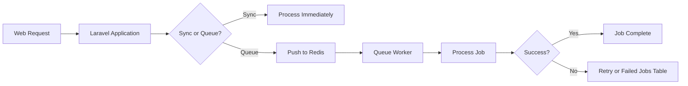
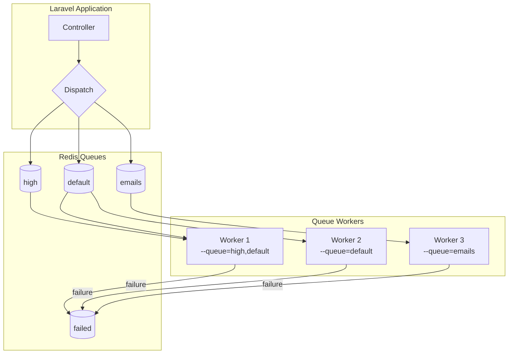
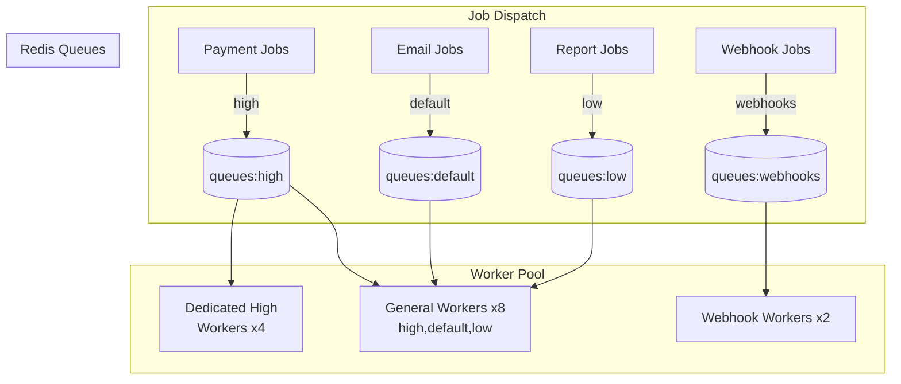
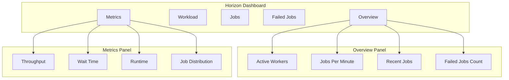

# How to Use Laravel Queues with Redis

Author: [nawazdhandala](https://www.github.com/nawazdhandala)

Tags: Laravel, Redis, Queues, PHP, Background Jobs, Performance, Horizon

Description: A comprehensive guide to implementing Laravel queues with Redis for efficient background job processing, including Horizon dashboard setup, retry logic, and production best practices.

---

> "The secret to building scalable applications is not doing everything at once, but knowing what can wait." - Unknown

Background job processing is essential for building responsive web applications. Instead of making users wait for time-consuming operations like sending emails, processing images, or generating reports, you can push these tasks to a queue and process them asynchronously. Laravel's queue system, combined with Redis as the queue driver, provides a robust and performant solution for handling background jobs at scale.

## Why Redis for Laravel Queues?

Redis is an in-memory data structure store that excels at queue operations. Here's why it's the preferred choice for Laravel queues:



**Benefits of Redis over database queues:**

- **Speed**: In-memory operations are orders of magnitude faster than database queries
- **Atomic operations**: Redis provides atomic list operations perfect for queue semantics
- **Built-in TTL**: Automatic expiration for temporary data
- **Pub/Sub support**: Real-time notifications when jobs complete
- **Horizontal scaling**: Easy to cluster and scale

## Redis Queue Driver Configuration

### Installing Dependencies

First, install the Redis PHP extension and the Predis package:

```bash
# Install PHP Redis extension (recommended for performance)
pecl install redis

# Or use Predis as a pure PHP alternative
composer require predis/predis
```

### Environment Configuration

Configure your `.env` file with Redis connection details:

```bash
# Queue driver configuration
QUEUE_CONNECTION=redis

# Redis connection settings
REDIS_HOST=127.0.0.1
REDIS_PASSWORD=null
REDIS_PORT=6379

# Optional: Redis database number for queues (isolate from cache)
REDIS_QUEUE_DB=1
```

### Config File Setup

Update `config/database.php` to configure the Redis connection:

```php
<?php

return [
    // ... other configuration

    'redis' => [
        // Use phpredis extension for better performance
        'client' => env('REDIS_CLIENT', 'phpredis'),

        'options' => [
            // Cluster configuration (if using Redis Cluster)
            'cluster' => env('REDIS_CLUSTER', 'redis'),

            // Key prefix to avoid collisions with other applications
            'prefix' => env('REDIS_PREFIX', 'laravel_'),
        ],

        // Default connection for cache and sessions
        'default' => [
            'url' => env('REDIS_URL'),
            'host' => env('REDIS_HOST', '127.0.0.1'),
            'username' => env('REDIS_USERNAME'),
            'password' => env('REDIS_PASSWORD'),
            'port' => env('REDIS_PORT', '6379'),
            'database' => env('REDIS_DB', '0'),
        ],

        // Dedicated connection for queues (recommended)
        'queue' => [
            'url' => env('REDIS_URL'),
            'host' => env('REDIS_HOST', '127.0.0.1'),
            'username' => env('REDIS_USERNAME'),
            'password' => env('REDIS_PASSWORD'),
            'port' => env('REDIS_PORT', '6379'),
            'database' => env('REDIS_QUEUE_DB', '1'),
        ],
    ],
];
```

Configure the queue connection in `config/queue.php`:

```php
<?php

return [
    // Default queue connection
    'default' => env('QUEUE_CONNECTION', 'redis'),

    'connections' => [
        // Redis queue configuration
        'redis' => [
            'driver' => 'redis',

            // Use the dedicated queue Redis connection
            'connection' => 'queue',

            // Default queue name
            'queue' => env('REDIS_QUEUE', 'default'),

            // Retry failed jobs after this many seconds
            'retry_after' => 90,

            // Enable blocking pop for efficient polling
            // Workers will wait for jobs instead of polling
            'block_for' => 5,

            // Keep failed jobs data for debugging
            'after_commit' => false,
        ],

        // Sync driver for local development/testing
        'sync' => [
            'driver' => 'sync',
        ],
    ],

    // Table for storing failed jobs (for debugging)
    'failed' => [
        'driver' => env('QUEUE_FAILED_DRIVER', 'database-uuids'),
        'database' => env('DB_CONNECTION', 'mysql'),
        'table' => 'failed_jobs',
    ],
];
```

## Creating Job Classes

### Basic Job Structure

Generate a new job class using Artisan:

```bash
php artisan make:job ProcessPayment
```

Here's a complete job class with best practices:

```php
<?php

namespace App\Jobs;

use App\Models\Order;
use App\Services\PaymentGateway;
use Illuminate\Bus\Queueable;
use Illuminate\Contracts\Queue\ShouldQueue;
use Illuminate\Foundation\Bus\Dispatchable;
use Illuminate\Queue\InteractsWithQueue;
use Illuminate\Queue\SerializesModels;
use Illuminate\Support\Facades\Log;

class ProcessPayment implements ShouldQueue
{
    use Dispatchable, InteractsWithQueue, Queueable, SerializesModels;

    // Number of times to retry the job before marking as failed
    public int $tries = 3;

    // Maximum number of seconds the job can run
    public int $timeout = 120;

    // Number of seconds to wait before retrying
    public int $backoff = 30;

    // Maximum number of unhandled exceptions before failing
    public int $maxExceptions = 2;

    /**
     * Create a new job instance.
     *
     * SerializesModels trait ensures the Order model is properly
     * serialized/deserialized when the job is pushed to Redis
     */
    public function __construct(
        public Order $order,
        public string $paymentMethod
    ) {
        // Specify which queue this job should be dispatched to
        $this->onQueue('payments');

        // Optional: delay job execution
        // $this->delay(now()->addMinutes(5));
    }

    /**
     * Execute the job.
     *
     * This method is called when a queue worker picks up the job.
     * Any exception thrown here will cause the job to be retried.
     */
    public function handle(PaymentGateway $gateway): void
    {
        Log::info('Processing payment', [
            'order_id' => $this->order->id,
            'amount' => $this->order->total,
            'method' => $this->paymentMethod,
        ]);

        // Process the payment through the gateway
        $result = $gateway->charge(
            amount: $this->order->total,
            method: $this->paymentMethod,
            metadata: ['order_id' => $this->order->id]
        );

        // Update order status
        $this->order->update([
            'payment_status' => 'completed',
            'transaction_id' => $result->transactionId,
        ]);

        Log::info('Payment processed successfully', [
            'order_id' => $this->order->id,
            'transaction_id' => $result->transactionId,
        ]);
    }

    /**
     * Handle a job failure.
     *
     * Called when all retry attempts have been exhausted.
     */
    public function failed(\Throwable $exception): void
    {
        Log::error('Payment processing failed permanently', [
            'order_id' => $this->order->id,
            'error' => $exception->getMessage(),
            'trace' => $exception->getTraceAsString(),
        ]);

        // Update order status
        $this->order->update(['payment_status' => 'failed']);

        // Notify administrators
        // Notification::send($admins, new PaymentFailedNotification($this->order));
    }

    /**
     * Calculate the number of seconds to wait before retrying.
     *
     * Returns an array for exponential backoff.
     */
    public function backoff(): array
    {
        // Wait 10s, then 30s, then 60s between retries
        return [10, 30, 60];
    }

    /**
     * Determine if the job should be retried based on the exception.
     */
    public function retryUntil(): \DateTime
    {
        // Keep retrying for up to 5 minutes
        return now()->addMinutes(5);
    }
}
```

### Dispatching Jobs

```php
<?php

namespace App\Http\Controllers;

use App\Jobs\ProcessPayment;
use App\Models\Order;
use Illuminate\Http\Request;

class OrderController extends Controller
{
    public function checkout(Request $request)
    {
        $order = Order::create($request->validated());

        // Dispatch job to the queue immediately
        ProcessPayment::dispatch($order, $request->payment_method);

        // Or with explicit queue specification
        ProcessPayment::dispatch($order, $request->payment_method)
            ->onQueue('payments');

        // Dispatch with delay
        ProcessPayment::dispatch($order, $request->payment_method)
            ->delay(now()->addMinutes(5));

        // Dispatch after database transaction commits
        ProcessPayment::dispatch($order, $request->payment_method)
            ->afterCommit();

        // Dispatch synchronously (bypass queue for testing)
        // ProcessPayment::dispatchSync($order, $request->payment_method);

        return response()->json([
            'message' => 'Order placed successfully',
            'order_id' => $order->id,
        ]);
    }
}
```

### Job Batching

For processing multiple related jobs together:

```php
<?php

namespace App\Jobs;

use Illuminate\Bus\Batchable;
use Illuminate\Bus\Queueable;
use Illuminate\Contracts\Queue\ShouldQueue;
use Illuminate\Foundation\Bus\Dispatchable;
use Illuminate\Queue\InteractsWithQueue;
use Illuminate\Queue\SerializesModels;

class ProcessPodcastEpisode implements ShouldQueue
{
    use Batchable, Dispatchable, InteractsWithQueue, Queueable, SerializesModels;

    public function __construct(
        public int $episodeId
    ) {}

    public function handle(): void
    {
        // Check if batch has been cancelled
        if ($this->batch()->cancelled()) {
            return;
        }

        // Process the episode...
    }
}
```

Dispatch a batch of jobs:

```php
<?php

use App\Jobs\ProcessPodcastEpisode;
use Illuminate\Bus\Batch;
use Illuminate\Support\Facades\Bus;

$episodes = [1, 2, 3, 4, 5];

$batch = Bus::batch(
    collect($episodes)->map(fn ($id) => new ProcessPodcastEpisode($id))
)->then(function (Batch $batch) {
    // All jobs completed successfully
    Log::info('Batch completed', ['batch_id' => $batch->id]);
})->catch(function (Batch $batch, \Throwable $e) {
    // First batch job failure detected
    Log::error('Batch failed', ['error' => $e->getMessage()]);
})->finally(function (Batch $batch) {
    // Batch has finished executing (success or failure)
})->onQueue('podcasts')
  ->name('Process Podcast Episodes')
  ->dispatch();

// Check batch status later
$batch = Bus::findBatch($batchId);
echo "Progress: {$batch->progress()}%";
```

## Running Queue Workers

### Basic Worker Command

Start a queue worker to process jobs:

```bash
# Process jobs from the default queue
php artisan queue:work

# Process jobs from specific queues (priority order: high first)
php artisan queue:work --queue=high,default,low

# Use a specific connection
php artisan queue:work redis

# Process a single job and exit (useful for testing)
php artisan queue:work --once

# Stop after processing current job (for graceful restarts)
php artisan queue:work --stop-when-empty

# Set memory limit (MB) - worker restarts when exceeded
php artisan queue:work --memory=512

# Set job timeout (seconds)
php artisan queue:work --timeout=60

# Number of seconds to sleep when no jobs available
php artisan queue:work --sleep=3

# Maximum number of jobs to process before stopping
php artisan queue:work --max-jobs=1000

# Maximum time (seconds) to run before stopping
php artisan queue:work --max-time=3600
```

### Worker Architecture



### Supervisor Configuration

Use Supervisor to keep workers running in production. Create `/etc/supervisor/conf.d/laravel-worker.conf`:

```ini
; Laravel Queue Worker Configuration
; This ensures workers are always running and automatically restarted

[program:laravel-worker]
; Path to the artisan command
process_name=%(program_name)s_%(process_num)02d

; Command to run - adjust path to your application
command=php /var/www/app/artisan queue:work redis --sleep=3 --tries=3 --max-time=3600

; Automatically start when supervisor starts
autostart=true

; Automatically restart if the process exits
autorestart=true

; Don't start during boot until manually started
; startsecs=0

; Run as the www-data user (adjust for your setup)
user=www-data

; Number of worker processes to run
numprocs=8

; Redirect stderr to stdout for unified logging
redirect_stderr=true

; Log file location
stdout_logfile=/var/www/app/storage/logs/worker.log

; Stop the process gracefully (SIGTERM)
stopwaitsecs=3600

; Environment variables
environment=QUEUE_CONNECTION=redis
```

Update and start Supervisor:

```bash
# Reload supervisor configuration
sudo supervisorctl reread
sudo supervisorctl update

# Start workers
sudo supervisorctl start laravel-worker:*

# Check status
sudo supervisorctl status

# Restart workers after deployment
sudo supervisorctl restart laravel-worker:*
```

## Failed Job Handling

### Database Setup

Create the failed jobs table:

```bash
php artisan queue:failed-table
php artisan migrate
```

### Monitoring Failed Jobs

```bash
# List all failed jobs
php artisan queue:failed

# View a specific failed job
php artisan queue:failed 5

# Retry a specific failed job
php artisan queue:retry 5

# Retry all failed jobs
php artisan queue:retry all

# Retry jobs that failed within the last hour
php artisan queue:retry --range=1..100

# Delete a failed job
php artisan queue:forget 5

# Delete all failed jobs
php artisan queue:flush
```

### Custom Failure Handling

```php
<?php

namespace App\Jobs;

use App\Events\JobFailed;
use App\Models\JobFailure;
use Illuminate\Bus\Queueable;
use Illuminate\Contracts\Queue\ShouldQueue;
use Illuminate\Foundation\Bus\Dispatchable;
use Illuminate\Queue\InteractsWithQueue;
use Illuminate\Queue\SerializesModels;
use Illuminate\Support\Facades\Log;

class ImportUsers implements ShouldQueue
{
    use Dispatchable, InteractsWithQueue, Queueable, SerializesModels;

    public int $tries = 3;
    public int $maxExceptions = 1;

    public function __construct(
        public string $filePath,
        public int $userId
    ) {}

    public function handle(): void
    {
        // Import logic...
    }

    /**
     * Handle job failure with comprehensive logging and notification.
     */
    public function failed(\Throwable $exception): void
    {
        // Log detailed failure information
        Log::error('User import job failed', [
            'file_path' => $this->filePath,
            'user_id' => $this->userId,
            'exception' => $exception->getMessage(),
            'trace' => $exception->getTraceAsString(),
            'attempts' => $this->attempts(),
        ]);

        // Store failure in database for reporting
        JobFailure::create([
            'job_type' => self::class,
            'payload' => json_encode([
                'file_path' => $this->filePath,
                'user_id' => $this->userId,
            ]),
            'exception' => $exception->getMessage(),
            'failed_at' => now(),
        ]);

        // Dispatch event for notifications
        event(new JobFailed(
            jobType: self::class,
            userId: $this->userId,
            error: $exception->getMessage()
        ));
    }

    /**
     * Determine if the job should fail based on exception type.
     */
    public function shouldFailOnException(\Throwable $exception): bool
    {
        // Don't retry on validation errors
        return $exception instanceof \InvalidArgumentException;
    }
}
```

### Global Failed Job Handler

Register a global handler in `AppServiceProvider`:

```php
<?php

namespace App\Providers;

use Illuminate\Queue\Events\JobFailed;
use Illuminate\Support\Facades\Event;
use Illuminate\Support\Facades\Log;
use Illuminate\Support\Facades\Notification;
use Illuminate\Support\ServiceProvider;

class AppServiceProvider extends ServiceProvider
{
    public function boot(): void
    {
        // Listen for all failed jobs
        Event::listen(JobFailed::class, function (JobFailed $event) {
            Log::error('Queue job failed globally', [
                'connection' => $event->connectionName,
                'queue' => $event->job->getQueue(),
                'job_class' => $event->job->resolveName(),
                'exception' => $event->exception->getMessage(),
            ]);

            // Send alert to ops team for critical failures
            if ($this->isCriticalJob($event->job->resolveName())) {
                Notification::route('slack', config('services.slack.webhook'))
                    ->notify(new \App\Notifications\CriticalJobFailed($event));
            }
        });
    }

    private function isCriticalJob(string $jobClass): bool
    {
        return in_array($jobClass, [
            \App\Jobs\ProcessPayment::class,
            \App\Jobs\SendCriticalAlert::class,
        ]);
    }
}
```

## Queue Priorities

### Priority Queue Configuration

Configure multiple queues with different priorities:

```php
<?php

// In your job classes, specify the queue

class ProcessPayment implements ShouldQueue
{
    public function __construct(public Order $order)
    {
        // High priority - process payments first
        $this->onQueue('high');
    }
}

class SendWelcomeEmail implements ShouldQueue
{
    public function __construct(public User $user)
    {
        // Default priority
        $this->onQueue('default');
    }
}

class GenerateReport implements ShouldQueue
{
    public function __construct(public array $params)
    {
        // Low priority - reports can wait
        $this->onQueue('low');
    }
}
```

### Running Priority Workers

```bash
# Worker processes high queue first, then default, then low
php artisan queue:work --queue=high,default,low
```

### Advanced Priority Patterns



Supervisor configuration for priority workers:

```ini
; High priority workers - dedicated to critical jobs
[program:laravel-worker-high]
process_name=%(program_name)s_%(process_num)02d
command=php /var/www/app/artisan queue:work redis --queue=high --sleep=1 --tries=3
numprocs=4
autostart=true
autorestart=true
user=www-data
stdout_logfile=/var/www/app/storage/logs/worker-high.log

; General workers - process all queues with priority
[program:laravel-worker-general]
process_name=%(program_name)s_%(process_num)02d
command=php /var/www/app/artisan queue:work redis --queue=high,default,low --sleep=3 --tries=3
numprocs=8
autostart=true
autorestart=true
user=www-data
stdout_logfile=/var/www/app/storage/logs/worker-general.log

; Low priority workers - only process low priority jobs
[program:laravel-worker-low]
process_name=%(program_name)s_%(process_num)02d
command=php /var/www/app/artisan queue:work redis --queue=low --sleep=10 --tries=5
numprocs=2
autostart=true
autorestart=true
user=www-data
stdout_logfile=/var/www/app/storage/logs/worker-low.log
```

## Horizon for Monitoring

Laravel Horizon provides a beautiful dashboard and code-driven configuration for your Redis queues.

### Installation

```bash
# Install Horizon
composer require laravel/horizon

# Publish configuration and assets
php artisan horizon:install
```

### Horizon Configuration

Configure `config/horizon.php`:

```php
<?php

return [
    // Domain for the Horizon dashboard
    'domain' => env('HORIZON_DOMAIN'),

    // Path for the Horizon dashboard
    'path' => 'horizon',

    // Redis connection to use
    'use' => 'default',

    // Dashboard route middleware
    'middleware' => ['web', 'auth.admin'],

    // Queue worker configuration per environment
    'environments' => [
        'production' => [
            // High priority supervisor
            'supervisor-high' => [
                'connection' => 'redis',
                'queue' => ['high'],
                'balance' => 'auto',
                'minProcesses' => 2,
                'maxProcesses' => 10,
                'balanceMaxShift' => 5,
                'balanceCooldown' => 3,
                'tries' => 3,
                'timeout' => 60,
                'nice' => 0,
            ],

            // Default priority supervisor
            'supervisor-default' => [
                'connection' => 'redis',
                'queue' => ['default'],
                'balance' => 'auto',
                'minProcesses' => 4,
                'maxProcesses' => 20,
                'balanceMaxShift' => 5,
                'balanceCooldown' => 3,
                'tries' => 3,
                'timeout' => 90,
                'nice' => 0,
            ],

            // Low priority supervisor
            'supervisor-low' => [
                'connection' => 'redis',
                'queue' => ['low', 'notifications'],
                'balance' => 'simple',
                'minProcesses' => 1,
                'maxProcesses' => 5,
                'tries' => 5,
                'timeout' => 300,
                'nice' => 10,
            ],
        ],

        'local' => [
            'supervisor-1' => [
                'connection' => 'redis',
                'queue' => ['high', 'default', 'low'],
                'balance' => 'simple',
                'processes' => 3,
                'tries' => 3,
            ],
        ],
    ],
];
```

### Dashboard Authorization

Protect the Horizon dashboard in `app/Providers/HorizonServiceProvider.php`:

```php
<?php

namespace App\Providers;

use Illuminate\Support\Facades\Gate;
use Laravel\Horizon\Horizon;
use Laravel\Horizon\HorizonApplicationServiceProvider;

class HorizonServiceProvider extends HorizonApplicationServiceProvider
{
    public function boot(): void
    {
        parent::boot();

        // Customize Horizon's appearance
        Horizon::night(); // Dark theme

        // Configure job retention
        Horizon::trimFailedJobs('-1 week');
        Horizon::trimRecentJobs('-1 hour');

        // Tag jobs for filtering in the dashboard
        Horizon::tag(function ($job) {
            if ($job instanceof \App\Jobs\ProcessPayment) {
                return ['payment', 'order:' . $job->order->id];
            }

            return [];
        });
    }

    /**
     * Register the Horizon gate.
     *
     * This determines who can access the Horizon dashboard.
     */
    protected function gate(): void
    {
        Gate::define('viewHorizon', function ($user) {
            return in_array($user->email, [
                'admin@example.com',
            ]) || $user->hasRole('admin');
        });
    }
}
```

### Running Horizon

```bash
# Start Horizon (development)
php artisan horizon

# Start Horizon in production (with Supervisor)
php artisan horizon:supervisor

# Pause/continue processing
php artisan horizon:pause
php artisan horizon:continue

# Terminate Horizon gracefully
php artisan horizon:terminate

# Check Horizon status
php artisan horizon:status

# Clear all pending jobs
php artisan horizon:clear
```

### Supervisor Configuration for Horizon

```ini
[program:horizon]
process_name=%(program_name)s
command=php /var/www/app/artisan horizon
autostart=true
autorestart=true
user=www-data
redirect_stderr=true
stdout_logfile=/var/www/app/storage/logs/horizon.log
stopwaitsecs=3600
```

### Horizon Metrics and Notifications

```php
<?php

namespace App\Providers;

use Laravel\Horizon\Horizon;
use Laravel\Horizon\HorizonApplicationServiceProvider;

class HorizonServiceProvider extends HorizonApplicationServiceProvider
{
    public function boot(): void
    {
        parent::boot();

        // Notify when wait time exceeds threshold
        Horizon::routeSlackNotificationsTo(
            config('services.slack.horizon_webhook'),
            '#ops-alerts'
        );

        // Configure which events trigger notifications
        Horizon::routeMailNotificationsTo('ops@example.com');

        // Long wait time notification threshold (seconds)
        Horizon::longWaitTime(60);
    }
}
```

### Horizon Dashboard



## Best Practices

### 1. Keep Jobs Small and Focused

```php
<?php

// Good: Single responsibility
class SendOrderConfirmation implements ShouldQueue
{
    public function handle(): void
    {
        Mail::to($this->order->user)->send(new OrderConfirmation($this->order));
    }
}

class UpdateInventory implements ShouldQueue
{
    public function handle(): void
    {
        foreach ($this->order->items as $item) {
            $item->product->decrement('stock', $item->quantity);
        }
    }
}

// Bad: Job doing too many things
class ProcessOrder implements ShouldQueue
{
    public function handle(): void
    {
        // Send email
        // Update inventory
        // Charge payment
        // Generate invoice
        // Update analytics
        // This is too much!
    }
}
```

### 2. Use Job Chaining for Sequential Operations

```php
<?php

use Illuminate\Support\Facades\Bus;

Bus::chain([
    new ProcessPayment($order),
    new UpdateInventory($order),
    new SendOrderConfirmation($order),
    new NotifyWarehouse($order),
])->onQueue('orders')
  ->catch(function (\Throwable $e) {
      Log::error('Order processing chain failed', [
          'error' => $e->getMessage(),
      ]);
  })
  ->dispatch();
```

### 3. Implement Idempotency

```php
<?php

class ProcessPayment implements ShouldQueue
{
    public function handle(PaymentGateway $gateway): void
    {
        // Check if already processed using idempotency key
        $idempotencyKey = "payment:{$this->order->id}";

        if (Cache::has($idempotencyKey)) {
            Log::info('Payment already processed', ['order_id' => $this->order->id]);
            return;
        }

        $result = $gateway->charge($this->order);

        // Mark as processed with TTL
        Cache::put($idempotencyKey, $result->transactionId, now()->addDay());

        $this->order->update(['transaction_id' => $result->transactionId]);
    }
}
```

### 4. Monitor Your Queues

Integrate with [OneUptime](https://oneuptime.com) for comprehensive monitoring of your Laravel queue infrastructure. Track key metrics like:

- Job throughput and processing times
- Queue wait times
- Failed job rates
- Worker health and resource utilization
- Redis connection status

```php
<?php

// Send queue metrics to OneUptime
use Illuminate\Queue\Events\JobProcessed;
use Illuminate\Queue\Events\JobProcessing;
use Illuminate\Support\Facades\Event;

Event::listen(JobProcessing::class, function ($event) {
    // Track job start time
    Cache::put("job_start:{$event->job->uuid()}", microtime(true), 300);
});

Event::listen(JobProcessed::class, function ($event) {
    $startTime = Cache::pull("job_start:{$event->job->uuid()}");
    $duration = microtime(true) - $startTime;

    // Send metric to OneUptime
    Http::post(config('services.oneuptime.metrics_endpoint'), [
        'metric' => 'queue.job.duration',
        'value' => $duration * 1000, // Convert to ms
        'tags' => [
            'job' => $event->job->resolveName(),
            'queue' => $event->job->getQueue(),
        ],
    ]);
});
```

## Summary

| Component | Purpose |
|-----------|---------|
| **Redis Driver** | Fast, reliable queue storage with atomic operations |
| **Job Classes** | Encapsulate background work with retry logic |
| **Queue Workers** | Process jobs from Redis queues |
| **Failed Jobs** | Capture and retry failed jobs |
| **Queue Priorities** | Process critical jobs first |
| **Horizon** | Beautiful dashboard and auto-scaling workers |

Laravel's queue system with Redis provides a powerful foundation for building scalable applications. By offloading time-consuming tasks to background workers, you can keep your application responsive while reliably processing work asynchronously. Combined with Horizon for monitoring and management, you have a complete solution for handling background jobs at any scale.

For production deployments, consider setting up comprehensive monitoring with [OneUptime](https://oneuptime.com) to track queue health, job performance, and worker status, ensuring your background processing runs smoothly.
