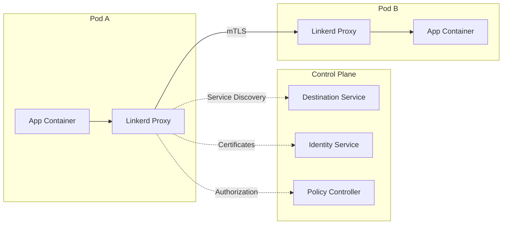
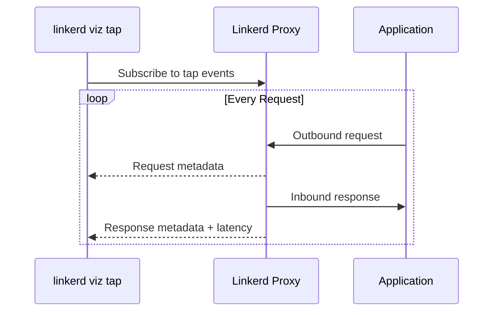
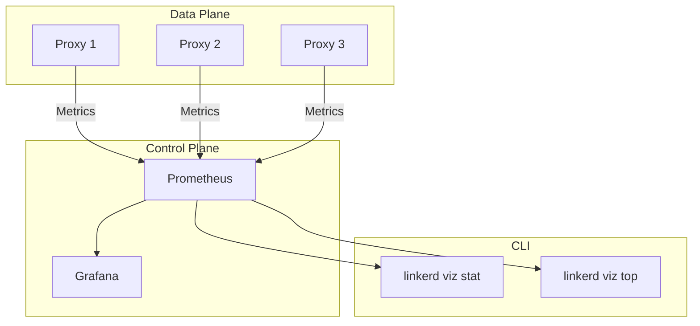
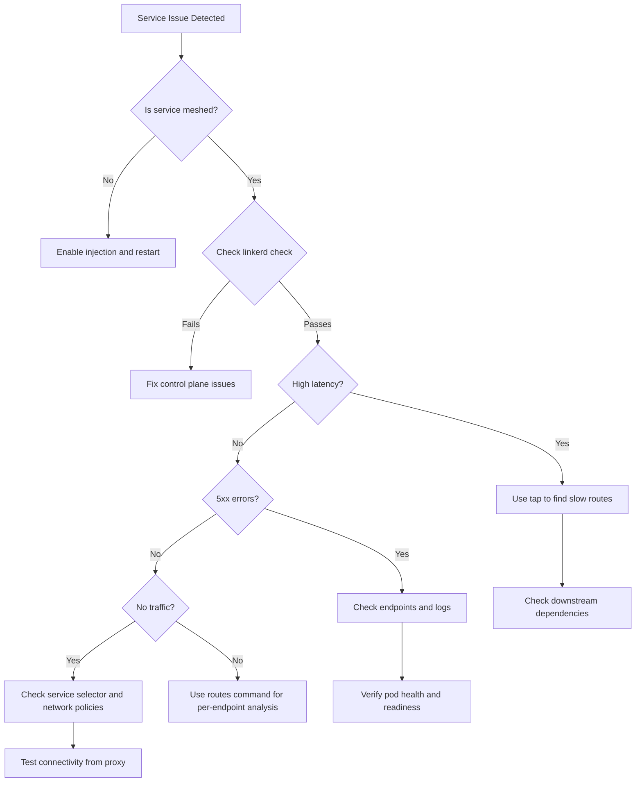

# How to Debug Services with Linkerd

Author: [nawazdhandala](https://github.com/nawazdhandala)

Tags: Linkerd, Service Mesh, Kubernetes, Debugging, Observability, Microservices, DevOps, SRE

Description: A comprehensive guide to debugging services in Kubernetes using Linkerd's powerful diagnostic tools. Learn to use tap, stat, profile analysis, and CLI commands to identify and resolve service mesh issues quickly.

---

> When your microservices misbehave, Linkerd transforms debugging from guesswork into precision diagnostics. Its zero-config observability gives you instant visibility into every request flowing through your mesh.

Linkerd is a lightweight, security-first service mesh that provides observability, reliability, and security features without the complexity of heavier alternatives. One of its greatest strengths is the debugging toolkit it provides out of the box.

This guide walks through Linkerd's diagnostic capabilities: from basic health checks to live traffic inspection, metrics analysis, and service profile debugging. Whether you're troubleshooting latency spikes, tracking down 5xx errors, or understanding traffic patterns, Linkerd has you covered.

---

## Table of Contents

1. Prerequisites and Setup Verification
2. Understanding Linkerd's Architecture
3. Linkerd CLI Diagnostic Commands
4. Tap for Live Traffic Inspection
5. Stat Commands for Metrics Analysis
6. Profile Analysis and Traffic Debugging
7. Common Issues and Solutions
8. Best Practices Summary

---

## 1. Prerequisites and Setup Verification

Before diving into debugging, ensure your Linkerd installation is healthy.

### Check Linkerd Installation Status

```bash
# Verify the Linkerd control plane is running correctly
# This command validates all control plane components and their configurations
linkerd check

# Expected output shows all checks passing:
# kubernetes-api
# ---------------------
# can initialize the client................................[ok]
# can query the Kubernetes API...........................[ok]
# ...
# Status check results are [ok]
```

### Verify Linkerd Version

```bash
# Display both CLI and control plane versions
# Version mismatch can cause unexpected behavior
linkerd version

# Output:
# Client version: stable-2.14.0
# Server version: stable-2.14.0
```

### Check Data Plane Proxy Status

```bash
# List all meshed pods and their proxy status
# Look for pods where the proxy isn't running or is unhealthy
linkerd stat deploy -n your-namespace

# Verify a specific deployment is properly injected
kubectl get pods -n your-namespace -l app=your-service -o jsonpath='{.items[*].spec.containers[*].name}' | tr ' ' '\n' | grep linkerd-proxy
```

---

## 2. Understanding Linkerd's Architecture

Before debugging, it helps to understand how requests flow through Linkerd.



Key components to understand:

- **Linkerd Proxy (linkerd2-proxy)**: A Rust-based sidecar that handles all traffic in/out of your pods
- **Destination Service**: Provides service discovery and load balancing information
- **Identity Service**: Issues TLS certificates for mTLS between proxies
- **Policy Controller**: Enforces authorization policies

---

## 3. Linkerd CLI Diagnostic Commands

### Check Overall Health

```bash
# Run comprehensive checks on your Linkerd installation
# The --pre flag checks prerequisites before installation
# The --proxy flag additionally checks data plane proxies
linkerd check --proxy

# Check a specific namespace for issues
linkerd check --proxy --namespace production

# Output includes:
# - Kubernetes API connectivity
# - Linkerd version compatibility
# - Control plane health
# - Data plane proxy status
# - Certificate validity
```

### Inspect Control Plane Logs

```bash
# View logs from the destination controller
# Useful for debugging service discovery issues
kubectl logs -n linkerd deploy/linkerd-destination -c destination --tail=100

# View logs from the identity service
# Useful for debugging mTLS certificate issues
kubectl logs -n linkerd deploy/linkerd-identity --tail=100

# View logs from a specific proxy sidecar
# Replace <pod-name> with your actual pod name
kubectl logs -n your-namespace <pod-name> -c linkerd-proxy --tail=100

# Stream proxy logs in real-time for active debugging
kubectl logs -n your-namespace <pod-name> -c linkerd-proxy -f
```

### Diagnose Proxy Configuration

```bash
# View the endpoints the proxy is aware of for a service
# Helps debug service discovery and load balancing issues
linkerd diagnostics endpoints your-service.your-namespace.svc.cluster.local:8080

# Example output:
# NAMESPACE     IP            PORT  POD
# production    10.0.0.15     8080  your-service-abc123
# production    10.0.0.16     8080  your-service-def456

# Check proxy metrics for a specific pod
linkerd diagnostics proxy-metrics -n your-namespace pod/your-pod-name
```

### View Linkerd Dashboard

```bash
# Launch the Linkerd dashboard in your browser
# Provides a visual overview of mesh health and traffic
linkerd viz dashboard &

# Or access specific visualization components
linkerd viz stat deploy -n your-namespace
```

---

## 4. Tap for Live Traffic Inspection

The `tap` command is Linkerd's most powerful debugging tool. It lets you watch live request/response traffic flowing through the mesh.

### Basic Tap Usage

```bash
# Tap all traffic to a deployment
# Shows real-time requests including method, path, response code, and latency
linkerd viz tap deploy/your-service -n your-namespace

# Example output:
# req id=0:0 proxy=in  src=10.0.0.5:54321 dst=10.0.0.10:8080 tls=true :method=GET :authority=your-service:8080 :path=/api/users
# rsp id=0:0 proxy=in  src=10.0.0.5:54321 dst=10.0.0.10:8080 tls=true :status=200 latency=12ms
```

### Filter Traffic by Path

```bash
# Tap only requests to a specific API endpoint
# The --path flag supports regex patterns
linkerd viz tap deploy/api-gateway -n production --path="/api/v1/orders.*"

# Tap requests matching multiple criteria
linkerd viz tap deploy/api-gateway -n production \
  --path="/api/v1/users" \
  --method=POST
```

### Filter by Response Status

```bash
# Find all failing requests (5xx errors)
# Critical for debugging service errors in production
linkerd viz tap deploy/payment-service -n production \
  --path=".*" \
  | grep ":status=5"

# Tap only requests with specific status codes
# Useful for tracking down 404s or 503s
linkerd viz tap deploy/your-service -n your-namespace --to deploy/backend-service
```

### Tap Traffic Between Specific Services

```bash
# Watch traffic from frontend to backend
# Helps understand inter-service communication patterns
linkerd viz tap deploy/frontend -n production --to deploy/backend

# Watch traffic from a specific source namespace
linkerd viz tap deploy/backend -n production --from ns/staging
```

### Output Tap Data as JSON

```bash
# Get structured JSON output for parsing or logging
# Useful for feeding into log aggregation systems
linkerd viz tap deploy/your-service -n your-namespace -o json | jq '.'

# Example: Extract slow requests (>100ms) using jq
linkerd viz tap deploy/your-service -n your-namespace -o json \
  | jq 'select(.responseEnd.sinceRequestInit.nanos > 100000000)'
```

### Tap Request Flow Diagram



---

## 5. Stat Commands for Metrics Analysis

While `tap` shows individual requests, `stat` aggregates metrics over time windows for broader analysis.

### Basic Stat Commands

```bash
# View success rate, RPS, and latency for all deployments
# The default time window is 1 minute
linkerd viz stat deploy -n your-namespace

# Example output:
# NAME            MESHED   SUCCESS   RPS   LATENCY_P50   LATENCY_P95   LATENCY_P99
# api-gateway     1/1      99.85%    150   5ms           25ms          100ms
# user-service    3/3      100.00%   50    3ms           10ms          45ms
# order-service   2/2      98.50%    75    15ms          80ms          250ms
```

### Stat with Custom Time Window

```bash
# View stats over the last 5 minutes
# Longer windows smooth out spikes and show trends
linkerd viz stat deploy -n production -t 5m

# View stats over the last 30 seconds for more immediate data
linkerd viz stat deploy -n production -t 30s
```

### Stat for Specific Resources

```bash
# Stats for a specific deployment
linkerd viz stat deploy/order-service -n production

# Stats for all pods in a deployment
linkerd viz stat pod -n production -l app=order-service

# Stats for traffic to a specific service
linkerd viz stat deploy -n production --to svc/database

# Stats for traffic from a specific namespace
linkerd viz stat deploy -n production --from ns/frontend
```

### Identify Traffic Sources (Top Command)

```bash
# Show top traffic sources to a deployment
# Helps identify which services are calling yours most frequently
linkerd viz top deploy/backend-service -n production

# Example output:
# Source                      Destination             Method   Path          Count   Best    Worst   Last
# frontend-abc123             backend-service-xyz     GET      /api/data     1523    2ms     150ms   5ms
# batch-processor-def456      backend-service-xyz     POST     /api/process  342     10ms    500ms   25ms
```

### Stat Routes (Per-Endpoint Metrics)

```bash
# View per-route metrics (requires ServiceProfile)
# Shows success rate and latency broken down by API endpoint
linkerd viz routes deploy/api-service -n production

# Example output:
# ROUTE                       SERVICE      SUCCESS   RPS   LATENCY_P50   LATENCY_P95   LATENCY_P99
# GET /api/v1/users           api-service  100.00%   45    5ms           15ms          30ms
# POST /api/v1/users          api-service  99.50%    10    20ms          50ms          100ms
# GET /api/v1/orders/{id}     api-service  98.00%    30    25ms          100ms         500ms
# [DEFAULT]                   api-service  100.00%   5     3ms           8ms           15ms
```

### Metrics Flow



---

## 6. Profile Analysis and Traffic Debugging

Service Profiles define route-level behavior and enable advanced debugging features.

### Create a Service Profile

```yaml
# service-profile.yaml
# Service Profiles enable per-route metrics, retries, and timeouts
apiVersion: linkerd.io/v1alpha2
kind: ServiceProfile
metadata:
  name: api-service.production.svc.cluster.local
  namespace: production
spec:
  routes:
    # Define routes with regex patterns for path matching
    - name: GET /api/v1/users
      condition:
        method: GET
        pathRegex: /api/v1/users
      # Mark this route as retriable (safe for automatic retries)
      isRetryable: true
      # Set timeout for this specific route
      timeout: 5s

    - name: GET /api/v1/users/{id}
      condition:
        method: GET
        pathRegex: /api/v1/users/[^/]+
      isRetryable: true
      timeout: 3s

    - name: POST /api/v1/orders
      condition:
        method: POST
        pathRegex: /api/v1/orders
      # Don't retry POST requests (not idempotent)
      isRetryable: false
      timeout: 10s
```

```bash
# Apply the service profile
kubectl apply -f service-profile.yaml

# Generate a service profile from OpenAPI spec
linkerd profile --open-api swagger.json api-service -n production > service-profile.yaml

# Generate a service profile by observing live traffic
# Watches traffic for 30 seconds and infers routes
linkerd viz profile --tap deploy/api-service -n production --tap-duration 30s api-service
```

### Debug Route Configuration

```bash
# Verify service profile is correctly applied
kubectl get serviceprofiles -n production

# View detailed route configuration
kubectl describe serviceprofile api-service.production.svc.cluster.local -n production

# Check if routes are being matched correctly
# Routes that don't match any pattern show as [DEFAULT]
linkerd viz routes deploy/api-service -n production

# If many requests hit [DEFAULT], your route patterns may need adjustment
```

### Configure Retries

```yaml
# retry-profile.yaml
# Configure automatic retries for transient failures
apiVersion: linkerd.io/v1alpha2
kind: ServiceProfile
metadata:
  name: backend-service.production.svc.cluster.local
  namespace: production
spec:
  # Global retry budget (max 20% additional load from retries)
  retryBudget:
    retryRatio: 0.2
    minRetriesPerSecond: 10
    ttl: 10s
  routes:
    - name: GET /api/data
      condition:
        method: GET
        pathRegex: /api/data
      isRetryable: true
      # Retries happen automatically on 5xx errors and connection failures
```

### Configure Timeouts

```yaml
# timeout-profile.yaml
# Set per-route timeouts to prevent slow requests from blocking
apiVersion: linkerd.io/v1alpha2
kind: ServiceProfile
metadata:
  name: slow-service.production.svc.cluster.local
  namespace: production
spec:
  routes:
    - name: GET /api/reports
      condition:
        method: GET
        pathRegex: /api/reports.*
      # Allow longer timeout for report generation
      timeout: 60s

    - name: GET /api/health
      condition:
        method: GET
        pathRegex: /api/health
      # Health checks should be fast
      timeout: 1s
```

### Debug Traffic Splits (Canary Deployments)

```yaml
# traffic-split.yaml
# Split traffic between canary and stable versions
apiVersion: split.smi-spec.io/v1alpha1
kind: TrafficSplit
metadata:
  name: api-service-split
  namespace: production
spec:
  service: api-service
  backends:
    - service: api-service-stable
      weight: 900   # 90% to stable
    - service: api-service-canary
      weight: 100   # 10% to canary
```

```bash
# Monitor traffic split effectiveness
linkerd viz stat deploy -n production | grep api-service

# Compare metrics between canary and stable
linkerd viz stat deploy/api-service-canary -n production -t 5m
linkerd viz stat deploy/api-service-stable -n production -t 5m

# Tap canary traffic to watch for errors
linkerd viz tap deploy/api-service-canary -n production
```

---

## 7. Common Issues and Solutions

### Issue: Service Not Meshed

**Symptoms**: No metrics in `linkerd viz stat`, tap shows no traffic

```bash
# Check if the deployment has the Linkerd proxy injected
kubectl get pods -n your-namespace -o jsonpath='{range .items[*]}{.metadata.name}{"\t"}{.spec.containers[*].name}{"\n"}{end}'

# Look for 'linkerd-proxy' in the container list
# If missing, annotate the namespace or deployment for injection

# Option 1: Annotate namespace for automatic injection
kubectl annotate namespace your-namespace linkerd.io/inject=enabled

# Option 2: Annotate specific deployment
kubectl patch deploy your-service -n your-namespace -p '{"spec":{"template":{"metadata":{"annotations":{"linkerd.io/inject":"enabled"}}}}}'

# Restart pods to trigger injection
kubectl rollout restart deploy/your-service -n your-namespace
```

### Issue: High Latency (P99 Spikes)

**Symptoms**: Latency percentiles are elevated, especially P99

```bash
# Identify which route has high latency
linkerd viz routes deploy/your-service -n production

# Tap slow requests to see details
linkerd viz tap deploy/your-service -n production -o json \
  | jq 'select(.responseEnd.sinceRequestInit.nanos > 500000000)' \
  | jq '{method: .requestInit.method.registered, path: .requestInit.path, latency_ms: (.responseEnd.sinceRequestInit.nanos / 1000000)}'

# Check if downstream dependencies are slow
linkerd viz stat deploy/your-service -n production --to svc/database
linkerd viz stat deploy/your-service -n production --to svc/external-api

# Check proxy resource usage (CPU/memory pressure causes latency)
kubectl top pod -n your-namespace -l app=your-service
```

### Issue: Connection Failures (5xx Errors)

**Symptoms**: Success rate below 100%, seeing 502/503/504 errors

```bash
# Find which endpoints are failing
linkerd viz tap deploy/your-service -n production --path=".*" | grep ":status=5"

# Check endpoint availability
linkerd diagnostics endpoints your-service.your-namespace.svc.cluster.local:8080

# If endpoints are empty, check service selectors
kubectl get endpoints your-service -n your-namespace

# Check if pods are ready
kubectl get pods -n your-namespace -l app=your-service -o wide

# View proxy error logs
kubectl logs -n your-namespace deploy/your-service -c linkerd-proxy | grep -i error
```

### Issue: mTLS Certificate Errors

**Symptoms**: Connections failing, logs show TLS errors

```bash
# Check identity service health
linkerd check --proxy

# Verify certificates are valid
linkerd identity -n your-namespace

# Check certificate expiry
kubectl get pods -n your-namespace -o jsonpath='{range .items[*]}{.metadata.name}{"\n"}{end}' | \
  xargs -I {} kubectl exec {} -n your-namespace -c linkerd-proxy -- \
  cat /var/run/linkerd/identity/end-entity/certificate.crt | \
  openssl x509 -noout -dates

# If certificates are expired, restart the identity service
kubectl rollout restart deploy/linkerd-identity -n linkerd
```

### Issue: Traffic Not Reaching Service

**Symptoms**: Requests timing out, no traffic visible in tap

```bash
# Check if service is correctly configured
kubectl describe svc your-service -n your-namespace

# Verify pod labels match service selector
kubectl get pods -n your-namespace --show-labels | grep your-service

# Check network policies that might block traffic
kubectl get networkpolicies -n your-namespace

# Test connectivity from proxy
kubectl exec -it deploy/your-service -n your-namespace -c linkerd-proxy -- \
  wget -qO- http://target-service:8080/health
```

### Debugging Decision Tree



---

## 8. Best Practices Summary

### Debugging Workflow

1. **Start with `linkerd check --proxy`** - Ensure your mesh is healthy before debugging application issues

2. **Use `stat` for the big picture** - Identify which services have problems (low success rate, high latency)

3. **Use `routes` to narrow down** - Find which specific endpoints are problematic

4. **Use `tap` for details** - Watch live traffic to understand request patterns and failures

5. **Check logs when needed** - Proxy logs reveal low-level connection and protocol issues

### Performance Tips

- Keep service profiles simple (10-20 routes max)
- Use specific path patterns to avoid regex overhead
- Set appropriate timeouts to prevent resource exhaustion
- Configure retry budgets to avoid cascade failures

### Monitoring Recommendations

- Set up alerts for success rate dropping below 99.9%
- Monitor P99 latency, not just averages
- Track retry rates to detect transient failures
- Watch proxy resource usage (CPU > 80% causes latency)

### Security Considerations

- Always verify mTLS is enabled (`linkerd check` confirms this)
- Use authorization policies to restrict service-to-service communication
- Rotate credentials if you see authentication failures

---

## Conclusion

Linkerd's debugging toolkit transforms distributed systems troubleshooting from guesswork into precise, data-driven analysis. By combining `check`, `stat`, `routes`, and `tap`, you can quickly identify and resolve issues in your service mesh.

Remember: start broad with aggregate metrics, then narrow down to specific requests. The mesh sees all traffic, use that visibility to your advantage.

---

*Need comprehensive observability for your Kubernetes services? [OneUptime](https://oneuptime.com) integrates with Linkerd metrics to provide unified monitoring, alerting, and incident management for your entire infrastructure.*

---

### See Also

- [Kubernetes Network Policies for Zero Trust Security](/blog/post/2026-01-06-kubernetes-network-policies-zero-trust/)
- [Cilium Service Mesh Implementation Guide](/blog/post/2026-01-27-cilium-service-mesh/)
- [The Three Pillars of Observability](/blog/post/2025-08-20-three-pillars-of-observability-logs-metrics-traces/)
