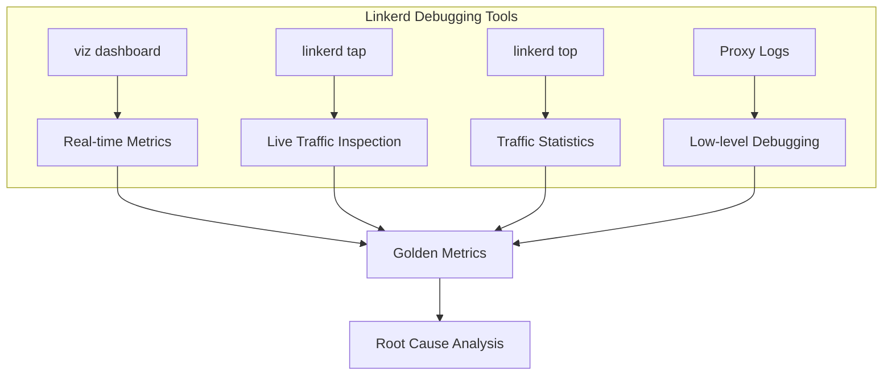
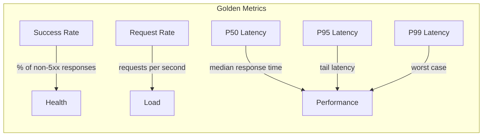
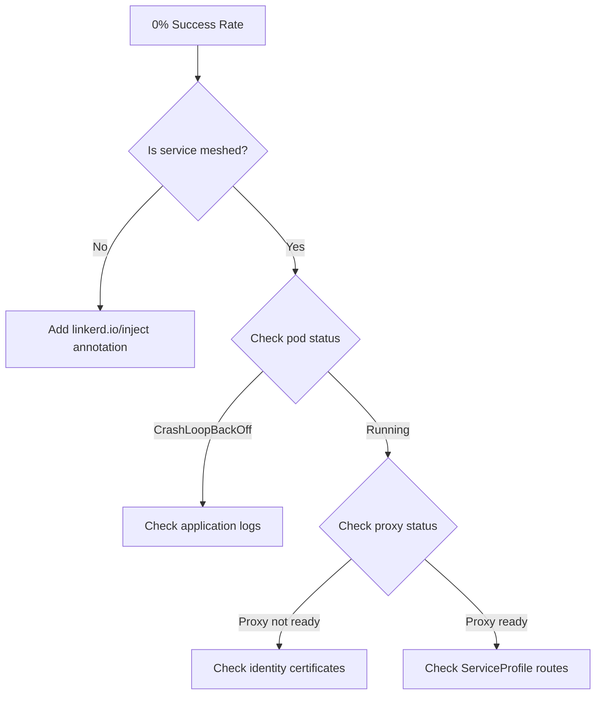
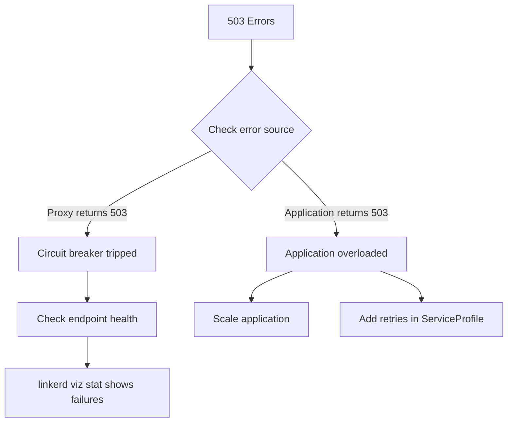
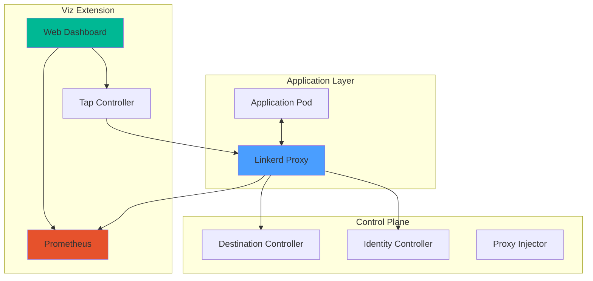
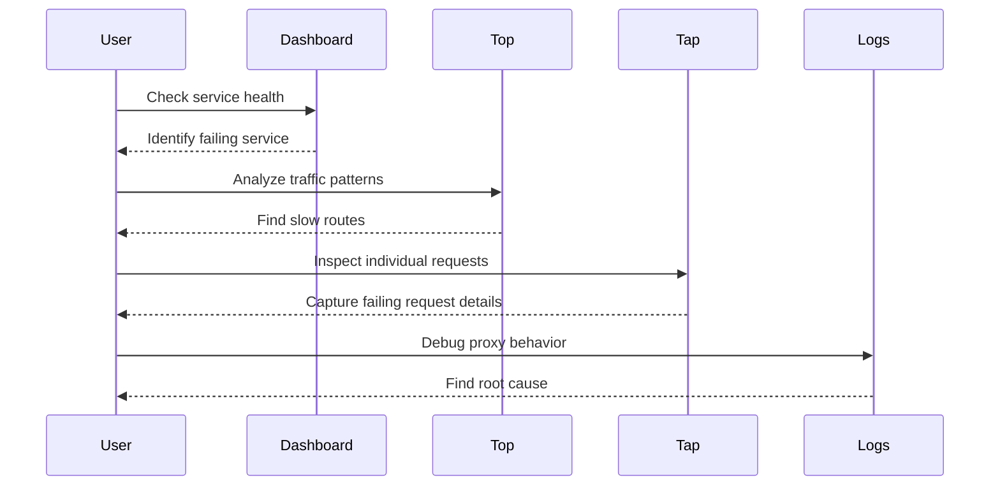

# How to Debug Services with Linkerd

Author: [nawazdhandala](https://www.github.com/nawazdhandala)

Tags: Linkerd, Service Mesh, Debugging, Kubernetes, Observability, DevOps, Microservices

Description: A comprehensive guide to debugging services in a Linkerd service mesh, covering the viz dashboard, tap and top commands, proxy logs, and common troubleshooting scenarios.

---

> "The best way to debug a distributed system is to observe it without changing it. Linkerd's observability tools let you see exactly what's happening in production without deploying new code." - William Morgan, Linkerd Creator

## Introduction to Linkerd Debugging

Linkerd is a lightweight service mesh that provides observability, reliability, and security for Kubernetes applications. When services misbehave, Linkerd offers powerful debugging tools that let you inspect traffic in real-time without modifying your application code.

This guide covers the essential debugging techniques you need to troubleshoot services running in a Linkerd mesh.



## Prerequisites

Before you begin debugging, ensure you have:

```bash
# Verify Linkerd CLI is installed
linkerd version

# Check that Linkerd control plane is healthy
linkerd check

# Install the viz extension (required for observability)
linkerd viz install | kubectl apply -f -

# Verify viz extension is running
linkerd viz check
```

## Using the Linkerd Viz Dashboard

The Linkerd dashboard provides a real-time view of your service mesh, displaying success rates, request rates, and latencies for all meshed services.

### Starting the Dashboard

```bash
# Open the dashboard in your default browser
# This command port-forwards the web UI to localhost
linkerd viz dashboard

# Alternative: specify a port
linkerd viz dashboard --port 8084

# Run in background and get the URL
linkerd viz dashboard &
# Dashboard available at http://localhost:50750
```

### Understanding Dashboard Metrics

The dashboard displays the "golden metrics" for each service:



### Dashboard Navigation Tips

```bash
# View namespace-specific metrics
# Navigate to: Namespaces > your-namespace

# Drill down into a specific deployment
# Click on deployment name to see:
# - Inbound traffic (who's calling this service)
# - Outbound traffic (who this service calls)
# - Live traffic samples via tap

# Check route-level metrics (if ServiceProfiles defined)
# Routes show per-endpoint success rates and latencies
```

### Creating ServiceProfiles for Route Metrics

ServiceProfiles enable per-route metrics and retries:

```yaml
# service-profile.yaml
# Defines routes for the orders service to get per-endpoint metrics
apiVersion: linkerd.io/v1alpha2
kind: ServiceProfile
metadata:
  name: orders.default.svc.cluster.local
  namespace: default
spec:
  routes:
  # Match GET requests to /orders/{id}
  - name: GET /orders/{id}
    condition:
      method: GET
      pathRegex: /orders/[^/]+
  # Match POST requests to create orders
  - name: POST /orders
    condition:
      method: POST
      pathRegex: /orders
  # Match health check endpoint
  - name: GET /health
    condition:
      method: GET
      pathRegex: /health
```

Apply and verify:

```bash
# Apply the ServiceProfile
kubectl apply -f service-profile.yaml

# Verify routes appear in dashboard
linkerd viz routes deploy/orders

# Example output shows per-route metrics:
# ROUTE                    SERVICE   SUCCESS   RPS   LATENCY_P50   LATENCY_P95
# GET /orders/{id}         orders    100.00%   12.3  5ms           15ms
# POST /orders             orders    98.50%    4.2   25ms          120ms
# GET /health              orders    100.00%   1.0   1ms           2ms
```

## The linkerd tap Command

`linkerd tap` is one of the most powerful debugging tools in Linkerd. It lets you watch live requests and responses flowing through the mesh.

### Basic Tap Usage

```bash
# Tap all traffic to a deployment
# Shows real-time requests with method, path, and response codes
linkerd viz tap deploy/orders

# Example output:
# req id=0:0 proxy=in  src=10.244.1.5:48234 dst=10.244.2.3:8080 :method=GET :path=/orders/123
# rsp id=0:0 proxy=in  src=10.244.1.5:48234 dst=10.244.2.3:8080 :status=200 latency=5ms
# end id=0:0 proxy=in  src=10.244.1.5:48234 dst=10.244.2.3:8080 grpc-status=OK duration=5ms

# Tap all traffic in a namespace
linkerd viz tap ns/production

# Tap a specific pod
linkerd viz tap pod/orders-7d8f9c6b5-x2k4j
```

### Filtering Tap Output

```bash
# Filter by HTTP method - only show POST requests
linkerd viz tap deploy/orders --method POST

# Filter by path - watch specific endpoints
linkerd viz tap deploy/orders --path /orders

# Filter by authority (Host header)
linkerd viz tap deploy/orders --authority orders.default.svc.cluster.local

# Filter by source - see who's calling your service
linkerd viz tap deploy/orders --from deploy/api-gateway

# Filter by destination - see outbound calls
linkerd viz tap deploy/api-gateway --to deploy/orders

# Combine filters - POST requests from api-gateway
linkerd viz tap deploy/orders --method POST --from deploy/api-gateway
```

### Tap Output Formats

```bash
# Default format shows request/response pairs
linkerd viz tap deploy/orders

# JSON output for parsing and analysis
linkerd viz tap deploy/orders -o json | jq '.'

# Wide output includes more details
linkerd viz tap deploy/orders -o wide
```

### Debugging Specific Issues with Tap

```bash
# Find failing requests - tap and grep for non-2xx status
linkerd viz tap deploy/orders | grep -v ":status=2"

# Watch for slow requests - look at latency values
linkerd viz tap deploy/orders -o json | jq 'select(.responseEnd.latencyMs > 1000)'

# Debug gRPC errors - filter by grpc-status
linkerd viz tap deploy/orders | grep "grpc-status=" | grep -v "grpc-status=OK"

# Watch traffic between two specific services
linkerd viz tap deploy/api-gateway --to deploy/orders --to deploy/inventory
```

## The linkerd top Command

While `tap` shows individual requests, `top` aggregates traffic statistics in real-time, similar to the Unix `top` command.

### Basic Top Usage

```bash
# Show top routes for a deployment
# Displays aggregated success rate, RPS, and latencies
linkerd viz top deploy/orders

# Example output (refreshes every second):
# Source            Destination   Method   Path             Count   Best    Worst   Last   Success
# api-gateway       orders        GET      /orders/{id}     156     2ms     45ms    5ms    100.00%
# api-gateway       orders        POST     /orders          23      15ms    230ms   18ms   95.65%
# checkout          orders        GET      /orders/{id}     89      3ms     22ms    4ms    100.00%

# Top for a namespace
linkerd viz top ns/production

# Top for a specific pod
linkerd viz top pod/orders-7d8f9c6b5-x2k4j
```

### Filtering Top Output

```bash
# Show only traffic from a specific source
linkerd viz top deploy/orders --from deploy/api-gateway

# Show only traffic to a specific destination
linkerd viz top deploy/api-gateway --to deploy/orders

# Filter by namespace
linkerd viz top deploy/orders --from ns/frontend
```

### Using Top for Performance Analysis

```bash
# Watch for routes with poor success rates
# Look for success rates below 100%
linkerd viz top deploy/orders --hide-sources

# Identify slow endpoints
# Watch the "Worst" column for high latencies
linkerd viz top deploy/orders

# Compare traffic patterns across deployments
# Run in multiple terminals
linkerd viz top deploy/orders
linkerd viz top deploy/inventory
linkerd viz top deploy/payments
```

## Analyzing Proxy Logs

When dashboard and tap don't provide enough detail, Linkerd proxy logs offer low-level debugging information.

### Enabling Proxy Debug Logging

```bash
# Set proxy log level to debug for a deployment
# This increases verbosity significantly
kubectl annotate deploy/orders config.linkerd.io/proxy-log-level=linkerd=debug,warn

# More granular control - debug specific components
kubectl annotate deploy/orders \
  config.linkerd.io/proxy-log-level="linkerd=info,linkerd::proxy::http=debug"

# Reset to default logging
kubectl annotate deploy/orders config.linkerd.io/proxy-log-level-
```

### Viewing Proxy Logs

```bash
# View proxy logs for a specific pod
# The proxy container is named 'linkerd-proxy'
kubectl logs deploy/orders -c linkerd-proxy

# Follow logs in real-time
kubectl logs -f deploy/orders -c linkerd-proxy

# Show logs with timestamps
kubectl logs deploy/orders -c linkerd-proxy --timestamps

# Get logs from the last hour
kubectl logs deploy/orders -c linkerd-proxy --since=1h
```

### Understanding Proxy Log Format

```bash
# Example proxy log entries and what they mean:

# Connection established
# INFO proxy: Accepted connection from 10.244.1.5:48234

# Request processed successfully
# DEBUG proxy::http: Processing request method=GET path=/orders/123 version=HTTP/1.1

# Connection error
# WARN proxy: Connection to 10.244.2.3:8080 failed: connection refused

# TLS handshake
# DEBUG proxy::transport::tls: TLS handshake complete peer_id=orders.default.serviceaccount.identity.linkerd.cluster.local
```

### Parsing Proxy Logs for Debugging

```bash
# Find connection errors
kubectl logs deploy/orders -c linkerd-proxy | grep -i "error\|warn\|fail"

# Track specific request IDs through the mesh
kubectl logs deploy/orders -c linkerd-proxy | grep "request_id=abc123"

# Monitor TLS issues
kubectl logs deploy/orders -c linkerd-proxy | grep -i "tls\|certificate\|identity"

# Check for resource exhaustion
kubectl logs deploy/orders -c linkerd-proxy | grep -i "exhausted\|limit\|queue"
```

## Common Issues and Solutions

### Issue 1: Service Shows 0% Success Rate



**Diagnosis:**

```bash
# Check if the service is meshed
linkerd viz stat deploy/orders

# If MESHED column shows 0/1, inject the proxy
kubectl get deploy orders -o yaml | linkerd inject - | kubectl apply -f -

# Verify injection
kubectl get pods -l app=orders -o jsonpath='{.items[*].spec.containers[*].name}'
# Should include: linkerd-proxy

# Check proxy readiness
kubectl get pods -l app=orders -o jsonpath='{.items[*].status.containerStatuses[?(@.name=="linkerd-proxy")].ready}'
```

### Issue 2: High Latency Between Services

**Diagnosis:**

```bash
# Check current latencies
linkerd viz stat deploy/orders -t deploy/inventory

# Watch live latencies with top
linkerd viz top deploy/orders --to deploy/inventory

# Tap to see individual slow requests
linkerd viz tap deploy/orders --to deploy/inventory -o json | \
  jq 'select(.responseEnd.latencyMs > 100)'
```

**Common Causes and Fixes:**

```yaml
# 1. Resource constraints - increase proxy resources
# deployment-patch.yaml
apiVersion: apps/v1
kind: Deployment
metadata:
  name: orders
spec:
  template:
    metadata:
      annotations:
        # Increase proxy CPU and memory
        config.linkerd.io/proxy-cpu-request: "100m"
        config.linkerd.io/proxy-cpu-limit: "500m"
        config.linkerd.io/proxy-memory-request: "128Mi"
        config.linkerd.io/proxy-memory-limit: "256Mi"
```

```bash
# 2. Check for connection pool exhaustion
kubectl logs deploy/orders -c linkerd-proxy | grep -i "pool\|queue\|pending"

# 3. Verify network policies aren't blocking traffic
kubectl get networkpolicies -n default
```

### Issue 3: Requests Timing Out

**Diagnosis:**

```bash
# Check if destination is reachable
linkerd viz tap deploy/orders --to svc/database

# Look for connection errors in proxy logs
kubectl logs deploy/orders -c linkerd-proxy | grep -i "timeout\|refused\|unreachable"

# Verify DNS resolution
kubectl exec deploy/orders -c linkerd-proxy -- \
  /bin/sh -c "nslookup database.default.svc.cluster.local"
```

**Solution - Configure Timeouts:**

```yaml
# service-profile.yaml
# Configure per-route timeouts
apiVersion: linkerd.io/v1alpha2
kind: ServiceProfile
metadata:
  name: database.default.svc.cluster.local
  namespace: default
spec:
  routes:
  - name: POST /query
    condition:
      method: POST
      pathRegex: /query
    timeout: 30s  # Allow longer timeout for queries
  - name: GET /health
    condition:
      method: GET
      pathRegex: /health
    timeout: 5s   # Short timeout for health checks
```

### Issue 4: Intermittent 503 Errors



**Diagnosis:**

```bash
# Tap to find 503 responses
linkerd viz tap deploy/orders | grep ":status=503"

# Check if retries are configured
linkerd viz routes deploy/orders

# Look at endpoint health
linkerd viz endpoints svc/orders
```

**Solution - Configure Retries:**

```yaml
# service-profile.yaml
# Add retry configuration for transient failures
apiVersion: linkerd.io/v1alpha2
kind: ServiceProfile
metadata:
  name: orders.default.svc.cluster.local
  namespace: default
spec:
  routes:
  - name: GET /orders/{id}
    condition:
      method: GET
      pathRegex: /orders/[^/]+
    isRetryable: true  # Enable retries for GET requests
  retryBudget:
    retryRatio: 0.2     # Allow 20% extra load for retries
    minRetriesPerSecond: 10
    ttl: 10s
```

### Issue 5: mTLS Not Working

**Diagnosis:**

```bash
# Check mTLS status between services
linkerd viz edges deploy

# Verify identity certificates are valid
linkerd viz tap deploy/orders -o json | jq '.source.tlsStatus, .destination.tlsStatus'

# Check identity controller
linkerd check --proxy

# Verify certificates
kubectl get pods -l app=orders -o jsonpath='{.items[0].metadata.name}' | \
  xargs -I {} kubectl exec {} -c linkerd-proxy -- \
  cat /var/run/linkerd/identity/end-entity-crt.pem | openssl x509 -text -noout
```

**Common Fixes:**

```bash
# 1. Ensure identity controller is healthy
kubectl rollout restart deploy/linkerd-identity -n linkerd

# 2. Restart proxies to get new certificates
kubectl rollout restart deploy/orders

# 3. Check for clock skew
kubectl get nodes -o jsonpath='{.items[*].status.conditions[?(@.type=="Ready")].lastHeartbeatTime}'
```

## Debugging Architecture Overview



## Performance Debugging Workflow



## Best Practices for Linkerd Debugging

### 1. Start with the Dashboard

```bash
# Always start debugging by checking overall health
linkerd viz dashboard

# Look for:
# - Services with low success rates
# - Unusual latency patterns
# - Traffic imbalances
```

### 2. Use ServiceProfiles for Better Visibility

```bash
# Generate ServiceProfile from OpenAPI spec
linkerd profile --open-api orders-api.yaml orders > service-profile.yaml

# Or auto-generate from live traffic (requires tap)
linkerd viz profile --tap deploy/orders --tap-duration 60s orders > service-profile.yaml
```

### 3. Correlate with Application Metrics

Linkerd provides network-level metrics, but combining them with application metrics gives the full picture. Use [OneUptime](https://oneuptime.com) to correlate Linkerd's golden metrics with your application's custom metrics, logs, and traces for comprehensive observability.

```bash
# Export Linkerd metrics to your observability platform
# Linkerd exposes Prometheus metrics at :4191/metrics on each proxy

# Example: Query success rate via Prometheus
# sum(rate(response_total{classification="success"}[1m])) by (deployment)
# /
# sum(rate(response_total[1m])) by (deployment)
```

### 4. Set Up Alerts

```yaml
# prometheus-alert.yaml
# Alert when success rate drops below threshold
apiVersion: monitoring.coreos.com/v1
kind: PrometheusRule
metadata:
  name: linkerd-alerts
spec:
  groups:
  - name: linkerd
    rules:
    - alert: LinkerdHighErrorRate
      expr: |
        sum(rate(response_total{classification="failure"}[5m])) by (deployment)
        /
        sum(rate(response_total[5m])) by (deployment)
        > 0.05
      for: 2m
      labels:
        severity: warning
      annotations:
        summary: "High error rate on {{ $labels.deployment }}"
```

## Summary

Linkerd provides a comprehensive debugging toolkit for microservices:

| Tool | Use Case | Best For |
|------|----------|----------|
| `viz dashboard` | Overall health monitoring | Quick health checks, identifying problem areas |
| `linkerd tap` | Live traffic inspection | Debugging specific requests, finding error patterns |
| `linkerd top` | Aggregated statistics | Performance analysis, identifying slow routes |
| Proxy logs | Low-level debugging | Connection issues, TLS problems, edge cases |

The key to effective debugging with Linkerd is starting broad (dashboard), narrowing down (top), inspecting specifics (tap), and diving deep when needed (logs).

---

Debugging distributed systems is challenging, but Linkerd's observability tools make it manageable. By mastering these techniques, you can quickly identify and resolve issues in your service mesh. For comprehensive monitoring that combines Linkerd metrics with logs, traces, and alerts, check out [OneUptime](https://oneuptime.com) - the open-source observability platform that helps you stay on top of your infrastructure.
