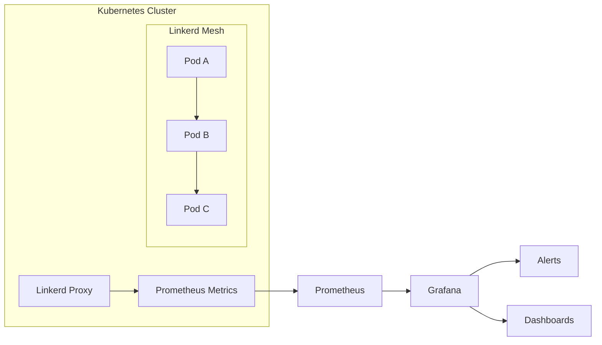
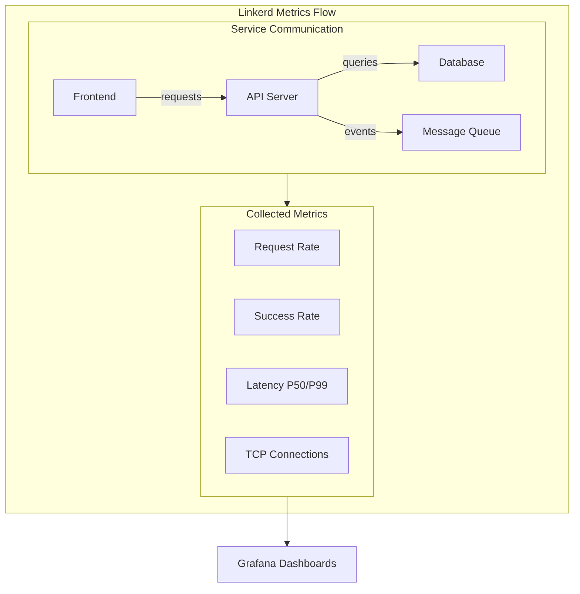
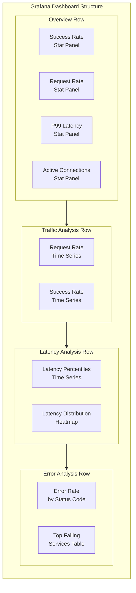
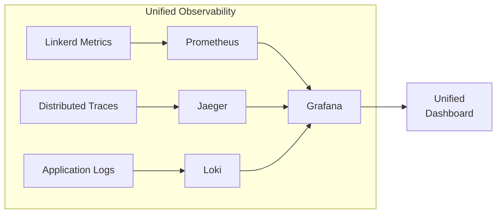

# How to Monitor Linkerd with Grafana

Author: [nawazdhandala](https://www.github.com/nawazdhandala)

Tags: Linkerd, Grafana, Service Mesh, Kubernetes, Monitoring, Observability, Prometheus, Metrics, SRE

Description: A comprehensive guide to monitoring Linkerd service mesh with Grafana dashboards, covering metrics collection, dashboard setup, alerting configuration, and custom visualization strategies for production environments.

---

> "You can't improve what you can't measure. In a service mesh, metrics are the difference between flying blind and having complete visibility into every request flowing through your system."

## Why Monitor Linkerd with Grafana?

Linkerd is a lightweight, security-first service mesh that provides observability, reliability, and security for Kubernetes workloads. While Linkerd includes its own dashboard, Grafana offers superior visualization capabilities, alerting, and the ability to correlate service mesh metrics with your broader infrastructure data.



## Understanding Linkerd Metrics

Linkerd proxies emit detailed metrics for every request. Understanding these metrics is essential for effective monitoring.

### Core Metric Types

Linkerd exposes metrics in Prometheus format through its proxy sidecars:

```bash
# Check if Linkerd is exposing metrics
kubectl -n linkerd port-forward svc/linkerd-prometheus 9090:9090

# Query available metrics
curl -s localhost:9090/api/v1/label/__name__/values | jq '.data[]' | grep linkerd
```

### Key Linkerd Metrics

```yaml
# The four golden signals captured by Linkerd
#
# 1. REQUEST RATE - requests per second
#    Metric: request_total
#    Labels: direction (inbound/outbound), authority, target_addr
#
# 2. SUCCESS RATE - percentage of successful requests
#    Metric: response_total with classification label
#    Labels: classification (success/failure), status_code
#
# 3. LATENCY - response time distribution
#    Metric: response_latency_ms_bucket (histogram)
#    Labels: direction, authority, status_code
#
# 4. CONCURRENT CONNECTIONS - active TCP connections
#    Metric: tcp_open_connections
#    Labels: direction, peer

# Example PromQL queries for each signal:
#
# Request rate per deployment:
# sum(rate(request_total{namespace="production"}[5m])) by (deployment)
#
# Success rate:
# sum(rate(response_total{classification="success"}[5m]))
#   / sum(rate(response_total[5m])) * 100
#
# P99 latency:
# histogram_quantile(0.99,
#   sum(rate(response_latency_ms_bucket[5m])) by (le, deployment))
```

### Metric Labels Reference

| Label | Description | Example Values |
|-------|-------------|----------------|
| `namespace` | Kubernetes namespace | `production`, `staging` |
| `deployment` | Deployment name | `api-server`, `web-frontend` |
| `direction` | Traffic direction | `inbound`, `outbound` |
| `authority` | Target service authority | `api.default.svc.cluster.local:8080` |
| `classification` | Response classification | `success`, `failure` |
| `status_code` | HTTP status code | `200`, `500`, `503` |
| `tls` | mTLS status | `true`, `false` |

## Setting Up Prometheus for Linkerd

Before configuring Grafana, ensure Prometheus is properly scraping Linkerd metrics.

### Option 1: Use Linkerd-Viz Extension

```bash
# Install linkerd-viz which includes Prometheus
linkerd viz install | kubectl apply -f -

# Verify installation
linkerd viz check

# Access the built-in dashboard
linkerd viz dashboard
```

### Option 2: Configure Existing Prometheus

```yaml
# prometheus-config.yaml
# Add these scrape configs to your existing Prometheus
apiVersion: v1
kind: ConfigMap
metadata:
  name: prometheus-config
  namespace: monitoring
data:
  prometheus.yml: |
    global:
      scrape_interval: 15s
      evaluation_interval: 15s

    scrape_configs:
      # Scrape Linkerd control plane
      - job_name: 'linkerd-controller'
        kubernetes_sd_configs:
          - role: pod
            namespaces:
              names: ['linkerd']
        relabel_configs:
          - source_labels: [__meta_kubernetes_pod_container_name]
            action: keep
            regex: linkerd-proxy
          - source_labels: [__meta_kubernetes_pod_container_port_name]
            action: keep
            regex: linkerd-admin
          - source_labels: [__meta_kubernetes_namespace]
            action: replace
            target_label: namespace
          - source_labels: [__meta_kubernetes_pod_name]
            action: replace
            target_label: pod

      # Scrape Linkerd proxies in all namespaces
      - job_name: 'linkerd-proxy'
        kubernetes_sd_configs:
          - role: pod
        relabel_configs:
          - source_labels: [__meta_kubernetes_pod_container_name]
            action: keep
            regex: linkerd-proxy
          - source_labels: [__meta_kubernetes_pod_container_port_name]
            action: keep
            regex: linkerd-admin
          - source_labels: [__meta_kubernetes_namespace]
            action: replace
            target_label: namespace
          - source_labels: [__meta_kubernetes_pod_name]
            action: replace
            target_label: pod
          - source_labels: [__meta_kubernetes_pod_label_app]
            action: replace
            target_label: app
          - source_labels: [__meta_kubernetes_pod_label_linkerd_io_proxy_deployment]
            action: replace
            target_label: deployment
```

### Verify Metrics Collection

```bash
# Port-forward to Prometheus
kubectl -n monitoring port-forward svc/prometheus 9090:9090

# Check that Linkerd metrics are being scraped
curl -s 'http://localhost:9090/api/v1/query?query=request_total' | jq '.data.result | length'

# Should return a number greater than 0 if metrics are flowing
```

## Grafana Dashboard Setup

### Adding Prometheus Data Source

```yaml
# grafana-datasource.yaml
# Configure Grafana to connect to Prometheus
apiVersion: 1
datasources:
  - name: Prometheus-Linkerd
    type: prometheus
    access: proxy
    # URL depends on your Prometheus deployment
    # Using linkerd-viz Prometheus:
    url: http://prometheus.linkerd-viz.svc.cluster.local:9090
    # Or using your own Prometheus:
    # url: http://prometheus.monitoring.svc.cluster.local:9090
    isDefault: false
    jsonData:
      timeInterval: "15s"
      httpMethod: POST
    editable: true
```

### Installing Pre-built Linkerd Dashboards

```bash
# Linkerd provides official Grafana dashboards
# Dashboard IDs for grafana.com:

# Linkerd Top Line Dashboard: 15474
# Linkerd Health Dashboard: 15475
# Linkerd Deployment Dashboard: 15476
# Linkerd Pod Dashboard: 15477
# Linkerd Authority Dashboard: 15478
# Linkerd Route Dashboard: 15479

# Import via Grafana UI:
# 1. Go to Dashboards > Import
# 2. Enter dashboard ID (e.g., 15474)
# 3. Select your Prometheus data source
# 4. Click Import

# Or import via API:
curl -X POST \
  -H "Content-Type: application/json" \
  -H "Authorization: Bearer $GRAFANA_API_KEY" \
  -d '{
    "dashboard": {
      "id": null,
      "uid": null,
      "title": "Linkerd Top Line",
      "tags": ["linkerd", "service-mesh"],
      "timezone": "browser",
      "schemaVersion": 16,
      "version": 0
    },
    "folderId": 0,
    "overwrite": false,
    "inputs": [
      {
        "name": "DS_PROMETHEUS",
        "type": "datasource",
        "pluginId": "prometheus",
        "value": "Prometheus-Linkerd"
      }
    ]
  }' \
  http://localhost:3000/api/dashboards/import
```

## Key Metrics to Monitor

### Service Health Dashboard Panels

```json
{
  "// Panel 1: Global Success Rate": "",
  "title": "Global Success Rate",
  "type": "gauge",
  "targets": [
    {
      "expr": "sum(rate(response_total{classification=\"success\", direction=\"inbound\"}[5m])) / sum(rate(response_total{direction=\"inbound\"}[5m])) * 100",
      "legendFormat": "Success Rate %"
    }
  ],
  "fieldConfig": {
    "defaults": {
      "thresholds": {
        "mode": "absolute",
        "steps": [
          { "color": "red", "value": 0 },
          { "color": "orange", "value": 95 },
          { "color": "yellow", "value": 99 },
          { "color": "green", "value": 99.9 }
        ]
      },
      "unit": "percent",
      "min": 0,
      "max": 100
    }
  }
}
```

```json
{
  "// Panel 2: Request Rate by Service": "",
  "title": "Request Rate by Service",
  "type": "timeseries",
  "targets": [
    {
      "expr": "sum(rate(request_total{direction=\"inbound\"}[5m])) by (deployment)",
      "legendFormat": "{{deployment}}"
    }
  ],
  "fieldConfig": {
    "defaults": {
      "unit": "reqps",
      "custom": {
        "drawStyle": "line",
        "lineInterpolation": "smooth",
        "fillOpacity": 10
      }
    }
  }
}
```

```json
{
  "// Panel 3: P99 Latency by Service": "",
  "title": "P99 Latency by Service",
  "type": "timeseries",
  "targets": [
    {
      "expr": "histogram_quantile(0.99, sum(rate(response_latency_ms_bucket{direction=\"inbound\"}[5m])) by (le, deployment))",
      "legendFormat": "{{deployment}}"
    }
  ],
  "fieldConfig": {
    "defaults": {
      "unit": "ms",
      "custom": {
        "drawStyle": "line",
        "lineInterpolation": "smooth"
      },
      "thresholds": {
        "mode": "absolute",
        "steps": [
          { "color": "green", "value": 0 },
          { "color": "yellow", "value": 100 },
          { "color": "red", "value": 500 }
        ]
      }
    }
  }
}
```

### Service-to-Service Communication Map



### Traffic Flow Visualization

```json
{
  "// Panel 4: Service Dependency Graph": "",
  "title": "Service Traffic Flow",
  "type": "nodeGraph",
  "targets": [
    {
      "// Edges - connections between services": "",
      "expr": "sum(rate(request_total{direction=\"outbound\"}[5m])) by (deployment, authority)",
      "format": "table",
      "instant": true
    }
  ],
  "// Note: Node Graph requires transformations": "",
  "transformations": [
    {
      "id": "configFromData",
      "options": {
        "configRefId": "A",
        "mappings": [
          { "fieldName": "deployment", "handlerKey": "source" },
          { "fieldName": "authority", "handlerKey": "target" },
          { "fieldName": "Value", "handlerKey": "mainStat" }
        ]
      }
    }
  ]
}
```

## Alerting Configuration

### Grafana Alert Rules

```yaml
# linkerd-alert-rules.yaml
# Grafana alerting rules for Linkerd monitoring
apiVersion: 1

groups:
  - name: linkerd-alerts
    folder: Service Mesh
    interval: 1m
    rules:
      # Alert: Low Success Rate
      - uid: linkerd-success-rate
        title: Linkerd Service Success Rate Low
        condition: C
        data:
          - refId: A
            relativeTimeRange:
              from: 300
              to: 0
            datasourceUid: prometheus-linkerd
            model:
              expr: |
                sum(rate(response_total{classification="success", direction="inbound"}[5m])) by (deployment, namespace)
                /
                sum(rate(response_total{direction="inbound"}[5m])) by (deployment, namespace) * 100
              instant: false
              intervalMs: 1000
              maxDataPoints: 43200
              refId: A
          - refId: B
            relativeTimeRange:
              from: 300
              to: 0
            datasourceUid: __expr__
            model:
              conditions:
                - evaluator:
                    params: []
                    type: gt
                  operator:
                    type: and
                  query:
                    params:
                      - B
                  reducer:
                    params: []
                    type: last
              expression: A
              reducer: last
              refId: B
              type: reduce
          - refId: C
            relativeTimeRange:
              from: 300
              to: 0
            datasourceUid: __expr__
            model:
              conditions:
                - evaluator:
                    params:
                      - 99
                    type: lt
                  operator:
                    type: and
                  query:
                    params:
                      - C
              expression: B
              refId: C
              type: threshold
        noDataState: NoData
        execErrState: Error
        for: 5m
        annotations:
          summary: "Service {{ $labels.deployment }} success rate below 99%"
          description: "Success rate is {{ $values.B.Value | printf \"%.2f\" }}%"
        labels:
          severity: warning

      # Alert: High P99 Latency
      - uid: linkerd-latency-high
        title: Linkerd Service P99 Latency High
        condition: C
        data:
          - refId: A
            datasourceUid: prometheus-linkerd
            model:
              expr: |
                histogram_quantile(0.99,
                  sum(rate(response_latency_ms_bucket{direction="inbound"}[5m]))
                  by (le, deployment, namespace)
                )
          - refId: B
            datasourceUid: __expr__
            model:
              expression: A
              reducer: last
              refId: B
              type: reduce
          - refId: C
            datasourceUid: __expr__
            model:
              conditions:
                - evaluator:
                    params:
                      - 500
                    type: gt
              expression: B
              refId: C
              type: threshold
        for: 5m
        annotations:
          summary: "Service {{ $labels.deployment }} P99 latency above 500ms"
          description: "P99 latency is {{ $values.B.Value | printf \"%.0f\" }}ms"
        labels:
          severity: warning

      # Alert: No Traffic
      - uid: linkerd-no-traffic
        title: Linkerd Service No Traffic
        condition: C
        data:
          - refId: A
            datasourceUid: prometheus-linkerd
            model:
              expr: |
                sum(rate(request_total{direction="inbound"}[5m])) by (deployment, namespace)
          - refId: B
            datasourceUid: __expr__
            model:
              expression: A
              reducer: last
              refId: B
              type: reduce
          - refId: C
            datasourceUid: __expr__
            model:
              conditions:
                - evaluator:
                    params:
                      - 0.001
                    type: lt
              expression: B
              refId: C
              type: threshold
        for: 10m
        annotations:
          summary: "Service {{ $labels.deployment }} receiving no traffic"
          description: "No requests in the last 10 minutes"
        labels:
          severity: critical

      # Alert: mTLS Not Enabled
      - uid: linkerd-mtls-disabled
        title: Linkerd mTLS Not Enabled
        condition: C
        data:
          - refId: A
            datasourceUid: prometheus-linkerd
            model:
              expr: |
                sum(rate(request_total{tls="false", direction="inbound"}[5m]))
                by (deployment, namespace) > 0
          - refId: B
            datasourceUid: __expr__
            model:
              expression: A
              reducer: last
              refId: B
              type: reduce
          - refId: C
            datasourceUid: __expr__
            model:
              conditions:
                - evaluator:
                    params:
                      - 0
                    type: gt
              expression: B
              refId: C
              type: threshold
        for: 5m
        annotations:
          summary: "Service {{ $labels.deployment }} receiving non-mTLS traffic"
          description: "Unencrypted traffic detected - security risk"
        labels:
          severity: critical
```

### Notification Channels

```yaml
# Configure notification channels for alerts
apiVersion: 1

notifiers:
  - name: slack-alerts
    type: slack
    uid: slack-linkerd
    org_id: 1
    is_default: true
    settings:
      url: "${SLACK_WEBHOOK_URL}"
      recipient: "#service-mesh-alerts"
      mentionUsers: ""
      mentionGroups: ""
      mentionChannel: "here"
      token: ""
      uploadImage: true
    secureSettings:
      url: "${SLACK_WEBHOOK_URL}"

  - name: pagerduty-critical
    type: pagerduty
    uid: pagerduty-linkerd
    settings:
      integrationKey: "${PAGERDUTY_KEY}"
      severity: critical
      class: service-mesh
      component: linkerd
```

## Custom Dashboard Creation

### Complete Dashboard JSON

```json
{
  "// Linkerd Service Mesh Dashboard": "",
  "// Complete Grafana dashboard configuration": "",

  "dashboard": {
    "id": null,
    "uid": "linkerd-service-mesh",
    "title": "Linkerd Service Mesh Overview",
    "tags": ["linkerd", "service-mesh", "kubernetes"],
    "timezone": "browser",
    "schemaVersion": 38,
    "version": 1,
    "refresh": "30s",

    "// Template variables for filtering": "",
    "templating": {
      "list": [
        {
          "name": "namespace",
          "type": "query",
          "datasource": "Prometheus-Linkerd",
          "query": "label_values(request_total, namespace)",
          "refresh": 2,
          "includeAll": true,
          "multi": true
        },
        {
          "name": "deployment",
          "type": "query",
          "datasource": "Prometheus-Linkerd",
          "query": "label_values(request_total{namespace=~\"$namespace\"}, deployment)",
          "refresh": 2,
          "includeAll": true,
          "multi": true
        }
      ]
    },

    "// Dashboard panels": "",
    "panels": [
      {
        "// Row: Overview Stats": "",
        "id": 1,
        "type": "row",
        "title": "Overview",
        "gridPos": { "h": 1, "w": 24, "x": 0, "y": 0 }
      },
      {
        "// Global Success Rate Stat": "",
        "id": 2,
        "type": "stat",
        "title": "Global Success Rate",
        "gridPos": { "h": 4, "w": 6, "x": 0, "y": 1 },
        "targets": [
          {
            "expr": "sum(rate(response_total{classification=\"success\", namespace=~\"$namespace\", deployment=~\"$deployment\"}[5m])) / sum(rate(response_total{namespace=~\"$namespace\", deployment=~\"$deployment\"}[5m])) * 100",
            "legendFormat": "Success Rate"
          }
        ],
        "fieldConfig": {
          "defaults": {
            "unit": "percent",
            "thresholds": {
              "mode": "absolute",
              "steps": [
                { "color": "red", "value": 0 },
                { "color": "orange", "value": 95 },
                { "color": "green", "value": 99 }
              ]
            }
          }
        }
      },
      {
        "// Total Request Rate Stat": "",
        "id": 3,
        "type": "stat",
        "title": "Total Request Rate",
        "gridPos": { "h": 4, "w": 6, "x": 6, "y": 1 },
        "targets": [
          {
            "expr": "sum(rate(request_total{namespace=~\"$namespace\", deployment=~\"$deployment\", direction=\"inbound\"}[5m]))",
            "legendFormat": "Requests/sec"
          }
        ],
        "fieldConfig": {
          "defaults": { "unit": "reqps" }
        }
      },
      {
        "// P99 Latency Stat": "",
        "id": 4,
        "type": "stat",
        "title": "P99 Latency",
        "gridPos": { "h": 4, "w": 6, "x": 12, "y": 1 },
        "targets": [
          {
            "expr": "histogram_quantile(0.99, sum(rate(response_latency_ms_bucket{namespace=~\"$namespace\", deployment=~\"$deployment\", direction=\"inbound\"}[5m])) by (le))",
            "legendFormat": "P99"
          }
        ],
        "fieldConfig": {
          "defaults": {
            "unit": "ms",
            "thresholds": {
              "mode": "absolute",
              "steps": [
                { "color": "green", "value": 0 },
                { "color": "yellow", "value": 100 },
                { "color": "red", "value": 500 }
              ]
            }
          }
        }
      },
      {
        "// Active Connections Stat": "",
        "id": 5,
        "type": "stat",
        "title": "Active Connections",
        "gridPos": { "h": 4, "w": 6, "x": 18, "y": 1 },
        "targets": [
          {
            "expr": "sum(tcp_open_connections{namespace=~\"$namespace\", deployment=~\"$deployment\"})",
            "legendFormat": "Connections"
          }
        ]
      },
      {
        "// Row: Traffic Analysis": "",
        "id": 10,
        "type": "row",
        "title": "Traffic Analysis",
        "gridPos": { "h": 1, "w": 24, "x": 0, "y": 5 }
      },
      {
        "// Request Rate Time Series": "",
        "id": 11,
        "type": "timeseries",
        "title": "Request Rate by Service",
        "gridPos": { "h": 8, "w": 12, "x": 0, "y": 6 },
        "targets": [
          {
            "expr": "sum(rate(request_total{namespace=~\"$namespace\", deployment=~\"$deployment\", direction=\"inbound\"}[5m])) by (deployment)",
            "legendFormat": "{{deployment}}"
          }
        ],
        "fieldConfig": {
          "defaults": {
            "unit": "reqps",
            "custom": {
              "drawStyle": "line",
              "lineInterpolation": "smooth",
              "fillOpacity": 10,
              "showPoints": "never"
            }
          }
        }
      },
      {
        "// Success Rate Time Series": "",
        "id": 12,
        "type": "timeseries",
        "title": "Success Rate by Service",
        "gridPos": { "h": 8, "w": 12, "x": 12, "y": 6 },
        "targets": [
          {
            "expr": "sum(rate(response_total{classification=\"success\", namespace=~\"$namespace\", deployment=~\"$deployment\", direction=\"inbound\"}[5m])) by (deployment) / sum(rate(response_total{namespace=~\"$namespace\", deployment=~\"$deployment\", direction=\"inbound\"}[5m])) by (deployment) * 100",
            "legendFormat": "{{deployment}}"
          }
        ],
        "fieldConfig": {
          "defaults": {
            "unit": "percent",
            "min": 0,
            "max": 100,
            "custom": {
              "drawStyle": "line",
              "lineInterpolation": "smooth"
            }
          }
        }
      },
      {
        "// Row: Latency Analysis": "",
        "id": 20,
        "type": "row",
        "title": "Latency Analysis",
        "gridPos": { "h": 1, "w": 24, "x": 0, "y": 14 }
      },
      {
        "// Latency Percentiles": "",
        "id": 21,
        "type": "timeseries",
        "title": "Latency Percentiles",
        "gridPos": { "h": 8, "w": 12, "x": 0, "y": 15 },
        "targets": [
          {
            "expr": "histogram_quantile(0.50, sum(rate(response_latency_ms_bucket{namespace=~\"$namespace\", deployment=~\"$deployment\", direction=\"inbound\"}[5m])) by (le))",
            "legendFormat": "P50"
          },
          {
            "expr": "histogram_quantile(0.95, sum(rate(response_latency_ms_bucket{namespace=~\"$namespace\", deployment=~\"$deployment\", direction=\"inbound\"}[5m])) by (le))",
            "legendFormat": "P95"
          },
          {
            "expr": "histogram_quantile(0.99, sum(rate(response_latency_ms_bucket{namespace=~\"$namespace\", deployment=~\"$deployment\", direction=\"inbound\"}[5m])) by (le))",
            "legendFormat": "P99"
          }
        ],
        "fieldConfig": {
          "defaults": {
            "unit": "ms",
            "custom": { "drawStyle": "line" }
          }
        }
      },
      {
        "// Latency Heatmap": "",
        "id": 22,
        "type": "heatmap",
        "title": "Latency Distribution",
        "gridPos": { "h": 8, "w": 12, "x": 12, "y": 15 },
        "targets": [
          {
            "expr": "sum(rate(response_latency_ms_bucket{namespace=~\"$namespace\", deployment=~\"$deployment\", direction=\"inbound\"}[5m])) by (le)",
            "format": "heatmap",
            "legendFormat": "{{le}}"
          }
        ],
        "options": {
          "calculate": false,
          "yAxis": { "unit": "ms" },
          "color": {
            "scheme": "Spectral",
            "mode": "spectrum"
          }
        }
      },
      {
        "// Row: Error Analysis": "",
        "id": 30,
        "type": "row",
        "title": "Error Analysis",
        "gridPos": { "h": 1, "w": 24, "x": 0, "y": 23 }
      },
      {
        "// Error Rate by Status Code": "",
        "id": 31,
        "type": "timeseries",
        "title": "Error Rate by Status Code",
        "gridPos": { "h": 8, "w": 12, "x": 0, "y": 24 },
        "targets": [
          {
            "expr": "sum(rate(response_total{classification=\"failure\", namespace=~\"$namespace\", deployment=~\"$deployment\"}[5m])) by (status_code)",
            "legendFormat": "{{status_code}}"
          }
        ],
        "fieldConfig": {
          "defaults": {
            "unit": "reqps",
            "custom": {
              "drawStyle": "bars",
              "stacking": { "mode": "normal" }
            }
          }
        }
      },
      {
        "// Top Failing Services Table": "",
        "id": 32,
        "type": "table",
        "title": "Top Failing Services",
        "gridPos": { "h": 8, "w": 12, "x": 12, "y": 24 },
        "targets": [
          {
            "expr": "topk(10, sum(rate(response_total{classification=\"failure\", namespace=~\"$namespace\"}[5m])) by (deployment))",
            "format": "table",
            "instant": true
          }
        ],
        "transformations": [
          {
            "id": "organize",
            "options": {
              "renameByName": {
                "deployment": "Service",
                "Value": "Errors/sec"
              }
            }
          }
        ]
      }
    ]
  }
}
```

### Dashboard Architecture



## Advanced Monitoring Patterns

### Multi-Cluster Monitoring

```yaml
# For multi-cluster setups, configure Prometheus federation
# or use Thanos/Cortex for cross-cluster queries

# prometheus-federation.yaml
# Federate Linkerd metrics from multiple clusters
scrape_configs:
  - job_name: 'linkerd-cluster-west'
    honor_labels: true
    metrics_path: '/federate'
    params:
      'match[]':
        - '{job=~"linkerd.*"}'
    static_configs:
      - targets:
          - 'prometheus-west.example.com:9090'
        labels:
          cluster: 'west'

  - job_name: 'linkerd-cluster-east'
    honor_labels: true
    metrics_path: '/federate'
    params:
      'match[]':
        - '{job=~"linkerd.*"}'
    static_configs:
      - targets:
          - 'prometheus-east.example.com:9090'
        labels:
          cluster: 'east'
```

### SLO-Based Monitoring

```yaml
# Define Service Level Objectives using Sloth
# sloth-linkerd-slo.yaml
apiVersion: sloth.slok.dev/v1
kind: PrometheusServiceLevel
metadata:
  name: api-server-slo
  namespace: production
spec:
  service: "api-server"
  labels:
    team: platform
    tier: critical

  slos:
    # Availability SLO: 99.9% success rate
    - name: "requests-availability"
      objective: 99.9
      description: "99.9% of requests should succeed"
      sli:
        events:
          errorQuery: |
            sum(rate(response_total{
              deployment="api-server",
              classification="failure",
              direction="inbound"
            }[{{.window}}]))
          totalQuery: |
            sum(rate(response_total{
              deployment="api-server",
              direction="inbound"
            }[{{.window}}]))
      alerting:
        name: APIServerHighErrorRate
        labels:
          severity: critical
        annotations:
          summary: "API Server error rate SLO breach"
        pageAlert:
          labels:
            severity: critical
        ticketAlert:
          labels:
            severity: warning

    # Latency SLO: 95% of requests under 200ms
    - name: "requests-latency"
      objective: 95
      description: "95% of requests should complete under 200ms"
      sli:
        events:
          errorQuery: |
            sum(rate(response_latency_ms_bucket{
              deployment="api-server",
              direction="inbound",
              le="200"
            }[{{.window}}]))
          totalQuery: |
            sum(rate(response_latency_ms_count{
              deployment="api-server",
              direction="inbound"
            }[{{.window}}]))
```

### Distributed Tracing Integration



```yaml
# Configure Grafana data sources for unified view
# grafana-unified-datasources.yaml
apiVersion: 1
datasources:
  - name: Prometheus-Linkerd
    type: prometheus
    url: http://prometheus.monitoring:9090

  - name: Jaeger
    type: jaeger
    url: http://jaeger-query.tracing:16686

  - name: Loki
    type: loki
    url: http://loki.logging:3100

  # Enable cross-data-source correlation
  # Click on a metric to jump to related traces/logs
```

## Best Practices Summary

### Metric Collection

1. **Use appropriate scrape intervals** - 15-30 seconds balances resolution with storage
2. **Apply label filtering** - Only collect metrics for namespaces you care about
3. **Set retention policies** - Keep detailed metrics for 15 days, aggregated for longer
4. **Use recording rules** - Pre-compute expensive queries for dashboard performance

### Dashboard Design

1. **Start with overview panels** - Show health at a glance
2. **Use template variables** - Enable filtering by namespace and service
3. **Include drill-down links** - Connect overview to detailed views
4. **Set meaningful thresholds** - Color code based on SLOs

### Alerting Strategy

1. **Alert on symptoms, not causes** - High error rate, not CPU usage
2. **Use multi-window alerts** - Short window for severity, long for persistence
3. **Include runbooks** - Link to documentation in alert annotations
4. **Test alerts regularly** - Fire test alerts during business hours

### Performance Optimization

1. **Use instant queries for stats** - Avoid range queries for current values
2. **Limit label cardinality** - High cardinality kills Prometheus performance
3. **Cache dashboard queries** - Enable query caching in Grafana
4. **Use appropriate panel types** - Tables for lists, graphs for trends

---

Effective monitoring transforms your service mesh from a black box into a transparent, manageable system. By combining Linkerd's rich metrics with Grafana's visualization power, you gain the observability needed to maintain reliable services. Start with the basics, add alerts incrementally, and evolve your dashboards as your understanding deepens.

For comprehensive monitoring beyond just the service mesh, consider [OneUptime](https://oneuptime.com) - a complete observability platform that integrates metrics, logs, traces, and incident management in one place.
