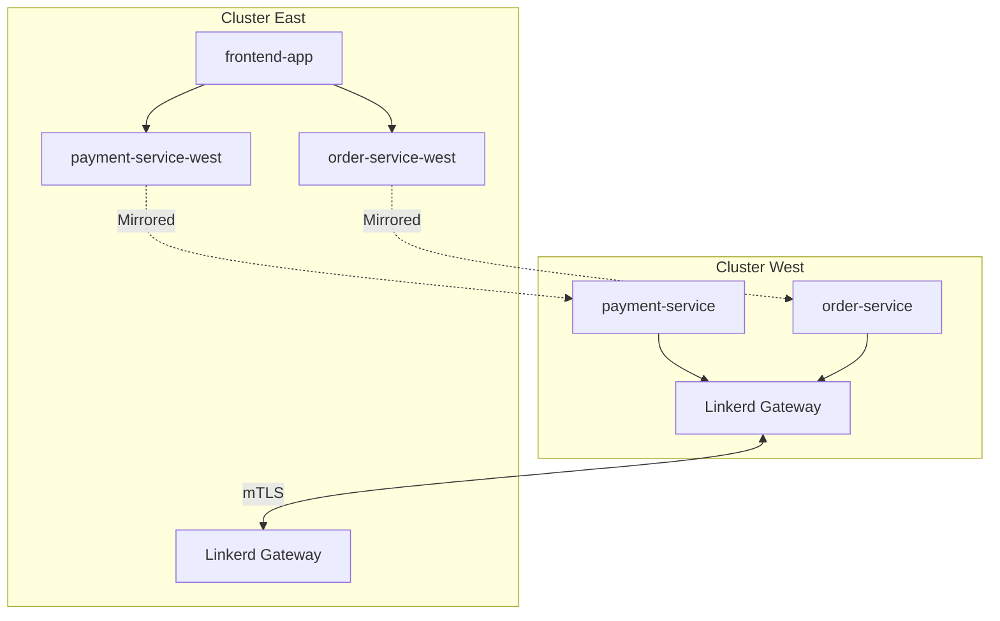
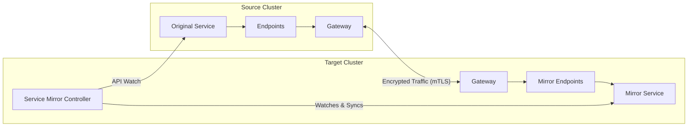
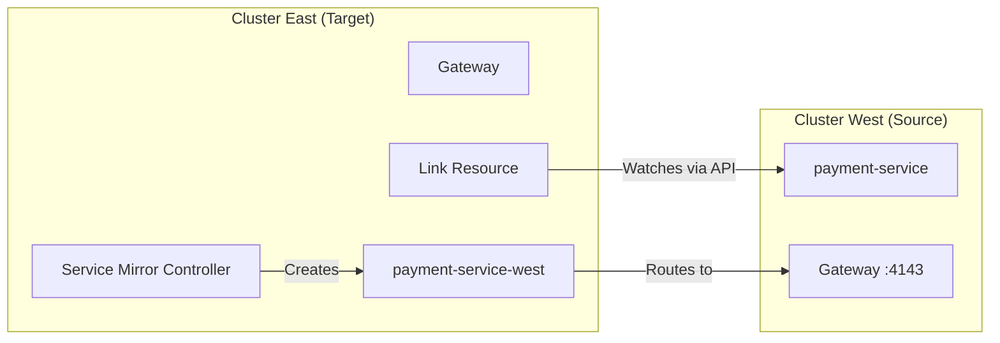
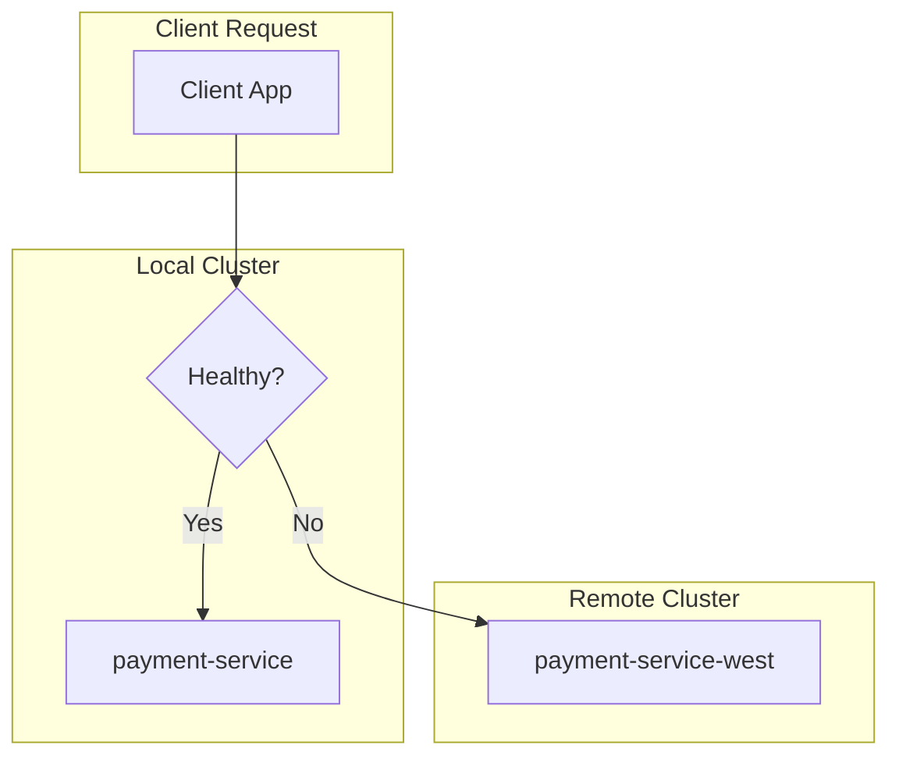

# How to Use Linkerd Multi-Cluster

Author: [nawazdhandala](https://www.github.com/nawazdhandala)

Tags: Linkerd, Kubernetes, Service Mesh, Multi-Cluster, High Availability, Failover, Service Mirroring

Description: A comprehensive guide to setting up Linkerd multi-cluster for cross-cluster service communication, including service mirroring, gateway configuration, and failover strategies for resilient microservices architectures.

---

> "The network is reliable" is the first of the eight fallacies of distributed computing. Multi-cluster service mesh acknowledges this reality and builds resilience into the fabric of your infrastructure.

## Why Linkerd Multi-Cluster?

Linkerd's multi-cluster feature enables secure, transparent communication between services running in different Kubernetes clusters. Unlike other service meshes that require complex configuration, Linkerd takes a pragmatic approach using service mirroring and gateways.



### Key Benefits

| Feature | Description |
|---------|-------------|
| Service Mirroring | Services appear as local endpoints in remote clusters |
| mTLS Everywhere | All cross-cluster traffic is encrypted |
| No Flat Network | Works across different networks and cloud providers |
| Hierarchical Trust | Each cluster maintains its own identity |

## Prerequisites

Before setting up multi-cluster, ensure you have:

```bash
# Verify Linkerd CLI version (2.14+ recommended)
linkerd version

# Check cluster connectivity
kubectl config get-contexts

# Ensure clusters can reach each other via gateways
# (public IPs or VPN connectivity required)
```

## Multi-Cluster Architecture



## Step 1: Install Linkerd on Both Clusters

First, install Linkerd with a shared trust anchor on both clusters. This enables cross-cluster mTLS.

```bash
# Generate a shared trust anchor certificate
# This certificate will be used by both clusters for mutual trust

# Create a certificate authority (valid for 10 years)
step certificate create root.linkerd.cluster.local ca.crt ca.key \
  --profile root-ca \
  --no-password \
  --insecure \
  --not-after=87600h

# Generate issuer credentials for cluster-west
step certificate create identity.linkerd.cluster.local issuer-west.crt issuer-west.key \
  --profile intermediate-ca \
  --not-after=8760h \
  --no-password \
  --insecure \
  --ca ca.crt \
  --ca-key ca.key

# Generate issuer credentials for cluster-east
step certificate create identity.linkerd.cluster.local issuer-east.crt issuer-east.key \
  --profile intermediate-ca \
  --not-after=8760h \
  --no-password \
  --insecure \
  --ca ca.crt \
  --ca-key ca.key
```

Install Linkerd CRDs and control plane on each cluster:

```bash
# Install on cluster-west
kubectl config use-context cluster-west

# Install CRDs first
linkerd install --crds | kubectl apply -f -

# Install control plane with the shared trust anchor
linkerd install \
  --identity-trust-anchors-file ca.crt \
  --identity-issuer-certificate-file issuer-west.crt \
  --identity-issuer-key-file issuer-west.key \
  | kubectl apply -f -

# Verify installation
linkerd check

# Repeat for cluster-east with its own issuer credentials
kubectl config use-context cluster-east

linkerd install --crds | kubectl apply -f -

linkerd install \
  --identity-trust-anchors-file ca.crt \
  --identity-issuer-certificate-file issuer-east.crt \
  --identity-issuer-key-file issuer-east.key \
  | kubectl apply -f -

linkerd check
```

## Step 2: Install the Multi-Cluster Extension

The multi-cluster extension provides the gateway and service mirror components.

```bash
# Install multi-cluster extension on cluster-west
kubectl config use-context cluster-west

# Install the multi-cluster components
# The gateway will handle incoming cross-cluster traffic
linkerd multicluster install | kubectl apply -f -

# Verify the installation
linkerd multicluster check

# Check that the gateway is running
kubectl -n linkerd-multicluster get pods

# Get the gateway address (you'll need this for linking)
kubectl -n linkerd-multicluster get svc linkerd-gateway
```

Repeat for cluster-east:

```bash
# Install multi-cluster extension on cluster-east
kubectl config use-context cluster-east

linkerd multicluster install | kubectl apply -f -

linkerd multicluster check

kubectl -n linkerd-multicluster get svc linkerd-gateway
```

## Step 3: Link the Clusters

Linking creates a unidirectional connection where one cluster can discover and call services in another.



```bash
# From cluster-west, generate link credentials for cluster-east
kubectl config use-context cluster-west

# Generate the link configuration
# This creates a secret with credentials to access cluster-west's API
linkerd multicluster link --cluster-name cluster-west | \
  kubectl --context=cluster-east apply -f -

# Verify the link from cluster-east
kubectl config use-context cluster-east

# Check that the link is established
linkerd multicluster check

# List linked clusters
linkerd multicluster gateways
```

For bidirectional communication, create the reverse link:

```bash
# From cluster-east, generate link credentials for cluster-west
kubectl config use-context cluster-east

linkerd multicluster link --cluster-name cluster-east | \
  kubectl --context=cluster-west apply -f -

# Verify from cluster-west
kubectl config use-context cluster-west
linkerd multicluster gateways
```

## Step 4: Export Services with Service Mirroring

Service mirroring is the core mechanism that makes remote services appear local. When you export a service, Linkerd creates a mirror service in linked clusters.

```yaml
# payment-service.yaml
# Deploy the payment service in cluster-west
apiVersion: v1
kind: Service
metadata:
  name: payment-service
  namespace: payments
  # This annotation tells Linkerd to mirror this service to linked clusters
  annotations:
    mirror.linkerd.io/exported: "true"
spec:
  selector:
    app: payment-service
  ports:
    - port: 8080
      targetPort: 8080
      name: http
---
apiVersion: apps/v1
kind: Deployment
metadata:
  name: payment-service
  namespace: payments
spec:
  replicas: 3
  selector:
    matchLabels:
      app: payment-service
  template:
    metadata:
      labels:
        app: payment-service
      annotations:
        # Inject the Linkerd proxy
        linkerd.io/inject: enabled
    spec:
      containers:
        - name: payment-service
          image: myregistry/payment-service:v1.2.0
          ports:
            - containerPort: 8080
          # Health checks for proper traffic management
          readinessProbe:
            httpGet:
              path: /health/ready
              port: 8080
            initialDelaySeconds: 5
            periodSeconds: 10
          livenessProbe:
            httpGet:
              path: /health/live
              port: 8080
            initialDelaySeconds: 15
            periodSeconds: 20
```

Apply and verify the mirror:

```bash
# Apply the service in cluster-west
kubectl config use-context cluster-west
kubectl apply -f payment-service.yaml

# Check that the mirror service appears in cluster-east
kubectl config use-context cluster-east

# The mirrored service will have the format: <service>-<cluster>
kubectl get svc -n payments payment-service-cluster-west

# You should see something like:
# NAME                          TYPE        CLUSTER-IP     PORT(S)
# payment-service-cluster-west  ClusterIP   10.96.45.123   8080/TCP
```

## Step 5: Gateway Configuration

The gateway is the entry point for cross-cluster traffic. Configure it for production use.

```yaml
# gateway-config.yaml
# Custom gateway configuration for production workloads
apiVersion: v1
kind: ConfigMap
metadata:
  name: linkerd-gateway-config
  namespace: linkerd-multicluster
data:
  # Gateway probe configuration
  probe-networks: "10.0.0.0/8,172.16.0.0/12,192.168.0.0/16"
---
# Customize gateway resources for high traffic
apiVersion: apps/v1
kind: Deployment
metadata:
  name: linkerd-gateway
  namespace: linkerd-multicluster
spec:
  replicas: 3  # High availability
  template:
    spec:
      containers:
        - name: linkerd-gateway
          resources:
            requests:
              cpu: 500m
              memory: 256Mi
            limits:
              cpu: 2000m
              memory: 1Gi
          # Gateway-specific environment variables
          env:
            - name: LINKERD2_PROXY_INBOUND_CONNECT_TIMEOUT
              value: "10s"
            - name: LINKERD2_PROXY_OUTBOUND_CONNECT_TIMEOUT
              value: "10s"
      # Spread across availability zones
      topologySpreadConstraints:
        - maxSkew: 1
          topologyKey: topology.kubernetes.io/zone
          whenUnsatisfiable: DoNotSchedule
          labelSelector:
            matchLabels:
              app: linkerd-gateway
```

Expose the gateway with appropriate networking:

```yaml
# gateway-service.yaml
# Production-ready gateway service configuration
apiVersion: v1
kind: Service
metadata:
  name: linkerd-gateway
  namespace: linkerd-multicluster
  annotations:
    # For AWS NLB
    service.beta.kubernetes.io/aws-load-balancer-type: "nlb"
    service.beta.kubernetes.io/aws-load-balancer-cross-zone-load-balancing-enabled: "true"
    # For GCP
    # cloud.google.com/neg: '{"ingress": true}'
spec:
  type: LoadBalancer
  selector:
    app: linkerd-gateway
  ports:
    # Gateway port for cross-cluster traffic
    - name: mc-gateway
      port: 4143
      targetPort: 4143
    # Probe port for health checks
    - name: mc-probe
      port: 4191
      targetPort: 4191
```

## Step 6: Implement Failover Strategies

Linkerd multi-cluster enables powerful failover patterns for high availability.



### Strategy 1: Traffic Split for Gradual Failover

```yaml
# traffic-split-failover.yaml
# Use TrafficSplit to distribute load between local and remote services
apiVersion: split.smi-spec.io/v1alpha2
kind: TrafficSplit
metadata:
  name: payment-service-split
  namespace: payments
spec:
  # The service that clients call
  service: payment-service
  backends:
    # Local service gets most traffic
    - service: payment-service
      weight: 900  # 90% to local
    # Remote mirror service as backup
    - service: payment-service-cluster-west
      weight: 100  # 10% to remote (warm standby)
```

### Strategy 2: Automatic Failover with ServiceProfile

```yaml
# service-profile-failover.yaml
# Configure retry and timeout behavior for failover
apiVersion: linkerd.io/v1alpha2
kind: ServiceProfile
metadata:
  name: payment-service.payments.svc.cluster.local
  namespace: payments
spec:
  routes:
    - name: POST /api/payments
      condition:
        method: POST
        pathRegex: /api/payments.*
      # Enable retries for failed requests
      isRetryable: true
      timeout: 5s
    - name: GET /api/payments
      condition:
        method: GET
        pathRegex: /api/payments.*
      isRetryable: true
      timeout: 3s
  # Retry budget to prevent retry storms
  retryBudget:
    retryRatio: 0.2       # Max 20% of requests can be retries
    minRetriesPerSecond: 10
    ttl: 10s
```

### Strategy 3: Active-Passive with External Health Checks

```yaml
# failover-controller.yaml
# Custom controller for automatic failover based on health
apiVersion: apps/v1
kind: Deployment
metadata:
  name: failover-controller
  namespace: linkerd-multicluster
spec:
  replicas: 1
  selector:
    matchLabels:
      app: failover-controller
  template:
    metadata:
      labels:
        app: failover-controller
    spec:
      serviceAccountName: failover-controller
      containers:
        - name: controller
          image: myregistry/failover-controller:v1.0.0
          env:
            - name: PRIMARY_SERVICE
              value: "payment-service"
            - name: BACKUP_SERVICE
              value: "payment-service-cluster-west"
            - name: HEALTH_CHECK_INTERVAL
              value: "10s"
            - name: FAILOVER_THRESHOLD
              value: "3"  # Consecutive failures before failover
            - name: NAMESPACE
              value: "payments"
---
# Failover script logic (pseudo-code for the controller)
# This would be implemented in your controller image
#
# while true:
#   primary_health = check_health(PRIMARY_SERVICE)
#   if primary_health.consecutive_failures >= FAILOVER_THRESHOLD:
#     update_traffic_split(PRIMARY_SERVICE, weight=0)
#     update_traffic_split(BACKUP_SERVICE, weight=1000)
#     send_alert("Failover activated")
#   elif primary_health.is_healthy and currently_failed_over:
#     update_traffic_split(PRIMARY_SERVICE, weight=1000)
#     update_traffic_split(BACKUP_SERVICE, weight=0)
#     send_alert("Failback completed")
#   sleep(HEALTH_CHECK_INTERVAL)
```

### Strategy 4: Geographic Load Balancing

```yaml
# geo-traffic-split.yaml
# Route traffic based on geographic proximity
apiVersion: split.smi-spec.io/v1alpha2
kind: TrafficSplit
metadata:
  name: payment-service-geo
  namespace: payments
  labels:
    region: us-east
spec:
  service: payment-service
  backends:
    # Prefer local region
    - service: payment-service
      weight: 800
    # Secondary region for overflow
    - service: payment-service-cluster-west
      weight: 150
    # Tertiary region for disaster recovery
    - service: payment-service-cluster-eu
      weight: 50
```

## Monitoring Multi-Cluster with OneUptime

For production multi-cluster deployments, comprehensive monitoring is essential. [OneUptime](https://oneuptime.com) provides unified observability across your entire multi-cluster infrastructure.

```yaml
# oneuptime-integration.yaml
# Configure Linkerd metrics export to OneUptime
apiVersion: v1
kind: ConfigMap
metadata:
  name: linkerd-prometheus-config
  namespace: linkerd-viz
data:
  prometheus.yml: |
    global:
      scrape_interval: 15s
      external_labels:
        cluster: cluster-west
        environment: production

    remote_write:
      # Send metrics to OneUptime for unified multi-cluster visibility
      - url: https://otlp.oneuptime.com/api/v1/metrics
        headers:
          X-OneUptime-Token: "${ONEUPTIME_TOKEN}"
        write_relabel_configs:
          - source_labels: [__name__]
            regex: 'linkerd.*|request.*|response.*'
            action: keep

    scrape_configs:
      - job_name: 'linkerd-controller'
        kubernetes_sd_configs:
          - role: pod
            namespaces:
              names: ['linkerd']
        relabel_configs:
          - source_labels: [__meta_kubernetes_pod_label_linkerd_io_control_plane_component]
            action: keep
            regex: (.+)

      - job_name: 'linkerd-proxy'
        kubernetes_sd_configs:
          - role: pod
        relabel_configs:
          - source_labels: [__meta_kubernetes_pod_container_name]
            action: keep
            regex: linkerd-proxy
          - source_labels: [__meta_kubernetes_pod_container_port_name]
            action: keep
            regex: linkerd-admin
```

Key metrics to monitor across clusters:

```yaml
# critical-alerts.yaml
# Alert rules for multi-cluster health
apiVersion: monitoring.coreos.com/v1
kind: PrometheusRule
metadata:
  name: linkerd-multicluster-alerts
  namespace: linkerd-viz
spec:
  groups:
    - name: linkerd-multicluster
      rules:
        # Alert when gateway is unreachable
        - alert: LinkerdGatewayDown
          expr: |
            sum(up{job="linkerd-gateway"}) by (cluster) == 0
          for: 2m
          labels:
            severity: critical
          annotations:
            summary: "Linkerd gateway is down in {{ $labels.cluster }}"
            description: "The multi-cluster gateway has been unreachable for 2 minutes"

        # Alert on high cross-cluster latency
        - alert: CrossClusterLatencyHigh
          expr: |
            histogram_quantile(0.99,
              sum(rate(response_latency_ms_bucket{
                dst_service=~".*-cluster-.*"
              }[5m])) by (le, dst_service)
            ) > 500
          for: 5m
          labels:
            severity: warning
          annotations:
            summary: "High latency to {{ $labels.dst_service }}"
            description: "P99 latency to remote service exceeds 500ms"

        # Alert when mirror service endpoints are unhealthy
        - alert: MirrorServiceEndpointsDown
          expr: |
            sum(linkerd_mirror_endpoints_total{alive="false"}) by (service) > 0
          for: 3m
          labels:
            severity: warning
          annotations:
            summary: "Mirror service {{ $labels.service }} has unhealthy endpoints"
```

## Troubleshooting Multi-Cluster Issues

### Common Issues and Solutions

```bash
# Check gateway connectivity
linkerd multicluster gateways

# Expected output:
# CLUSTER       ALIVE    NUM_SVC    LATENCY
# cluster-west  True     5          10ms
# cluster-east  True     3          15ms

# If a gateway shows as not alive, check:
# 1. Gateway pod health
kubectl -n linkerd-multicluster get pods -l app=linkerd-gateway

# 2. Gateway service external IP
kubectl -n linkerd-multicluster get svc linkerd-gateway

# 3. Network connectivity (firewall rules, security groups)
# The gateway needs port 4143 and 4191 accessible

# Debug service mirroring
kubectl get svc -A | grep -E "cluster-west|cluster-east"

# Check mirror controller logs
kubectl -n linkerd-multicluster logs -l component=linkerd-service-mirror -f

# Verify mTLS is working
linkerd viz edges pod -n payments

# Check cross-cluster traffic flow
linkerd viz stat deploy -n payments --from deploy/frontend
```

### Debugging Certificate Issues

```bash
# Verify trust anchor is consistent across clusters
kubectl config use-context cluster-west
kubectl -n linkerd get secret linkerd-identity-trust-roots -o jsonpath='{.data.ca-bundle\.crt}' | base64 -d | openssl x509 -noout -text | head -20

kubectl config use-context cluster-east
kubectl -n linkerd get secret linkerd-identity-trust-roots -o jsonpath='{.data.ca-bundle\.crt}' | base64 -d | openssl x509 -noout -text | head -20

# Both should show the same root certificate
```

## Best Practices

1. **Use Dedicated Namespaces**: Keep multi-cluster infrastructure in separate namespaces for easier management

2. **Implement Circuit Breakers**: Combine Linkerd retries with application-level circuit breakers to prevent cascade failures

3. **Monitor Gateway Latency**: Cross-cluster calls add network latency; ensure your SLOs account for this

4. **Plan for Split-Brain**: Have a strategy for handling network partitions between clusters

5. **Regular Failover Testing**: Schedule monthly failover drills to ensure your disaster recovery works

6. **Secure Gateway Access**: Use network policies and firewall rules to restrict gateway access

7. **Version Consistency**: Keep Linkerd versions consistent across all clusters

---

Linkerd multi-cluster provides a pragmatic approach to cross-cluster communication without requiring a flat network or complex configuration. By leveraging service mirroring and secure gateways, you can build resilient multi-cluster architectures that gracefully handle failures. Start with a simple two-cluster setup, test your failover procedures thoroughly, and gradually expand as your needs grow.

For comprehensive monitoring of your multi-cluster Linkerd deployment, consider [OneUptime](https://oneuptime.com) for unified observability across all your clusters, with built-in alerting and incident management.
