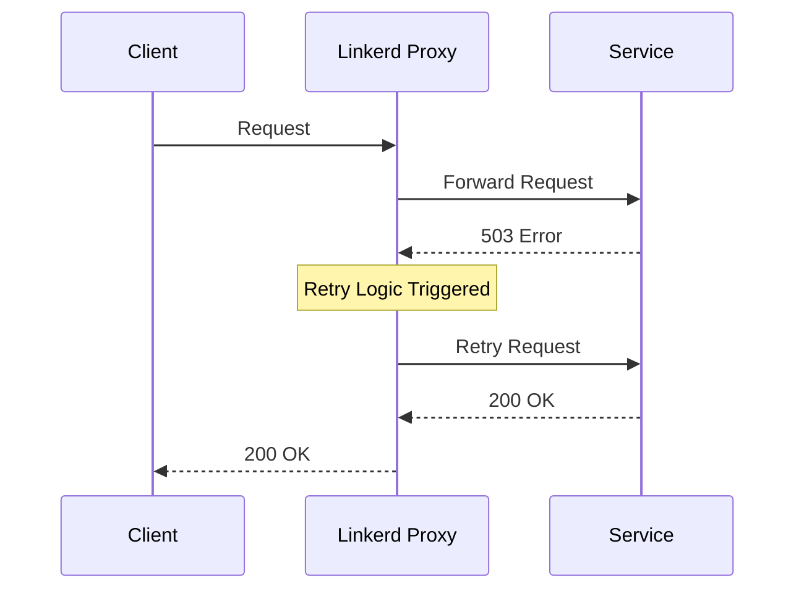
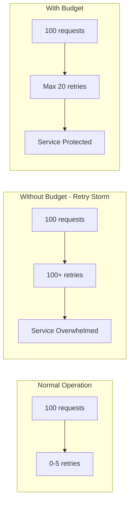
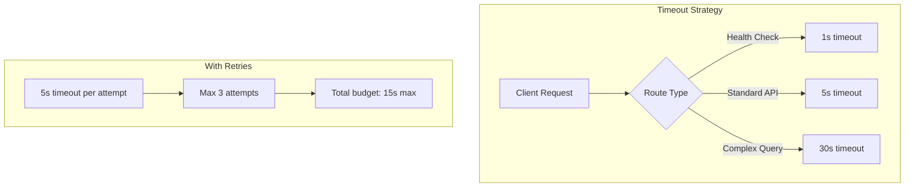
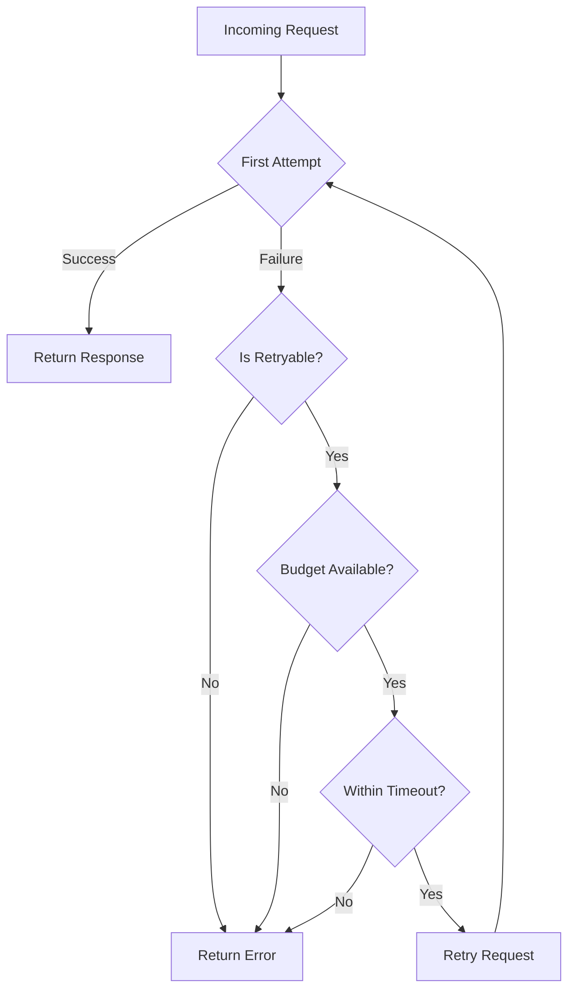
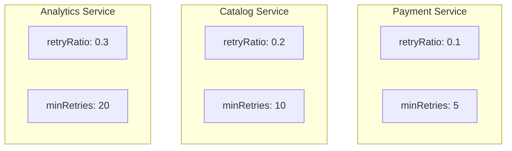
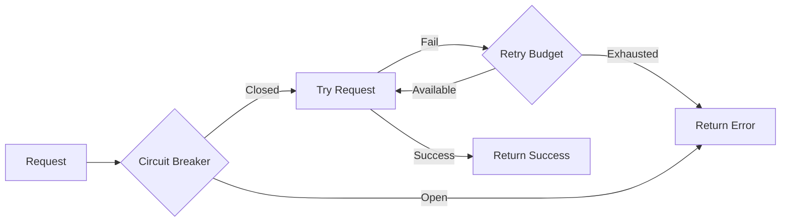

# How to Configure Linkerd Retries

By [Nawaz Dhandala](https://github.com/nawazdhandala)

Tags: Linkerd, Service Mesh, Kubernetes, Retries, Reliability, Microservices, DevOps, SRE

Description: A comprehensive guide to configuring Linkerd retries for improved service reliability, including retry budgets, timeout settings, and best practices for production environments.

---

> "The best way to handle failure is to expect it. Retries are not about avoiding failure - they're about gracefully recovering from it." - Site Reliability Engineering

Transient failures are inevitable in distributed systems. Network blips, temporary service overloads, and brief pod restarts happen constantly. Linkerd's retry mechanism automatically handles these failures, turning intermittent errors into successful requests without any application code changes.

## Understanding Linkerd Retries

Linkerd operates as a sidecar proxy, intercepting all traffic to and from your services. When a request fails, Linkerd can automatically retry it based on your configuration.



### What Gets Retried

Linkerd only retries requests that are safe to retry:

- **Idempotent HTTP methods**: GET, HEAD, OPTIONS, TRACE
- **Specific failure conditions**: Connection errors, 5xx responses (configurable)
- **Requests within budget**: Only if retry budget allows

POST, PUT, DELETE, and PATCH are not retried by default because they may not be idempotent.

## Basic Retry Configuration

Linkerd uses ServiceProfiles to configure retries. A ServiceProfile defines how Linkerd handles traffic for a specific service.

### Creating a ServiceProfile

```yaml
# serviceprofile.yaml
# Define retry behavior for the orders service
apiVersion: linkerd.io/v1alpha2
kind: ServiceProfile
metadata:
  name: orders.production.svc.cluster.local
  namespace: production
spec:
  routes:
    # GET requests for order details - safe to retry
    - name: GET /orders/{id}
      condition:
        method: GET
        pathRegex: /orders/[^/]+
      isRetryable: true

    # GET requests for listing orders - safe to retry
    - name: GET /orders
      condition:
        method: GET
        pathRegex: /orders
      isRetryable: true

    # POST requests - not safe to retry by default
    - name: POST /orders
      condition:
        method: POST
        pathRegex: /orders
      isRetryable: false
```

Apply the ServiceProfile:

```bash
# Apply the service profile to enable retries
kubectl apply -f serviceprofile.yaml

# Verify the service profile was created
kubectl get serviceprofile -n production
```

### Making Non-Idempotent Requests Retryable

If your POST endpoint is idempotent (e.g., uses idempotency keys), you can enable retries:

```yaml
# serviceprofile-idempotent.yaml
# Configure retries for an idempotent POST endpoint
apiVersion: linkerd.io/v1alpha2
kind: ServiceProfile
metadata:
  name: payments.production.svc.cluster.local
  namespace: production
spec:
  routes:
    # This POST endpoint uses idempotency keys, safe to retry
    - name: POST /payments
      condition:
        method: POST
        pathRegex: /payments
      isRetryable: true
      # Timeout for this specific route
      timeout: 10s
```

## Retry Budgets

Retry budgets prevent retry storms that can overwhelm failing services. They limit the additional load that retries can add to your system.



### Configuring Retry Budgets

Retry budgets are configured at the service level and apply across all routes:

```yaml
# serviceprofile-budget.yaml
# Configure retry budget to prevent overwhelming the service
apiVersion: linkerd.io/v1alpha2
kind: ServiceProfile
metadata:
  name: catalog.production.svc.cluster.local
  namespace: production
spec:
  # Retry budget configuration
  retryBudget:
    # Percentage of additional requests allowed for retries
    # 20% means if you have 100 requests/sec, max 20 retries/sec
    retryRatio: 0.2

    # Minimum retries per second, regardless of traffic
    # Helps during low-traffic periods
    minRetriesPerSecond: 10

    # Time window for calculating the budget
    ttl: 10s

  routes:
    - name: GET /products
      condition:
        method: GET
        pathRegex: /products.*
      isRetryable: true
```

### Understanding Retry Budget Parameters

| Parameter | Description | Recommended Value |
|-----------|-------------|-------------------|
| `retryRatio` | Max retries as percentage of original requests | 0.1 - 0.3 (10-30%) |
| `minRetriesPerSecond` | Minimum retry rate during low traffic | 5 - 20 |
| `ttl` | Time window for budget calculation | 10s - 30s |

### Calculating Your Retry Budget

```yaml
# Example calculation for a service handling 1000 req/sec
# with retryRatio: 0.2 and minRetriesPerSecond: 10
#
# At 1000 req/sec: max retries = 1000 * 0.2 = 200 retries/sec
# At 10 req/sec: max retries = max(10 * 0.2, 10) = 10 retries/sec
# At 0 req/sec: max retries = 10 retries/sec (minimum)
```

## Timeout Settings

Timeouts work hand-in-hand with retries. Without proper timeouts, retries can take too long and exhaust client patience.



### Per-Route Timeouts

```yaml
# serviceprofile-timeouts.yaml
# Configure different timeouts for different operations
apiVersion: linkerd.io/v1alpha2
kind: ServiceProfile
metadata:
  name: api.production.svc.cluster.local
  namespace: production
spec:
  retryBudget:
    retryRatio: 0.2
    minRetriesPerSecond: 10
    ttl: 10s

  routes:
    # Fast endpoint - short timeout
    - name: GET /health
      condition:
        method: GET
        pathRegex: /health
      timeout: 1s
      isRetryable: true

    # Standard API calls - moderate timeout
    - name: GET /users/{id}
      condition:
        method: GET
        pathRegex: /users/[^/]+
      timeout: 5s
      isRetryable: true

    # Complex aggregation - longer timeout
    - name: GET /reports
      condition:
        method: GET
        pathRegex: /reports.*
      timeout: 30s
      isRetryable: true

    # Async operation - extended timeout
    - name: POST /batch-process
      condition:
        method: POST
        pathRegex: /batch-process
      timeout: 60s
      isRetryable: false
```

### Timeout Best Practices

Set timeouts based on your service level objectives and expected latency:

```yaml
# Timeout guidelines by operation type
# Fast operations (health checks, cache lookups): 1-2s
# Standard CRUD operations: 5-10s
# Complex queries and aggregations: 15-30s
# Batch operations: 60s or consider async patterns
```

## Complete Production Configuration

Here is a complete ServiceProfile configuration for a production microservice:

```yaml
# serviceprofile-production.yaml
# Complete production configuration for the orders service
apiVersion: linkerd.io/v1alpha2
kind: ServiceProfile
metadata:
  name: orders.production.svc.cluster.local
  namespace: production
  labels:
    app: orders
    environment: production
spec:
  # Retry budget protects the service from retry storms
  retryBudget:
    retryRatio: 0.2        # 20% extra load max
    minRetriesPerSecond: 10 # Always allow some retries
    ttl: 10s               # 10-second rolling window

  routes:
    # Health endpoint - fast, always retryable
    - name: GET /health
      condition:
        method: GET
        pathRegex: /health
      timeout: 2s
      isRetryable: true

    # Readiness endpoint
    - name: GET /ready
      condition:
        method: GET
        pathRegex: /ready
      timeout: 2s
      isRetryable: true

    # List orders - read operation, safe to retry
    - name: GET /orders
      condition:
        method: GET
        pathRegex: /orders$
      timeout: 10s
      isRetryable: true

    # Get single order - read operation, safe to retry
    - name: GET /orders/{id}
      condition:
        method: GET
        pathRegex: /orders/[^/]+$
      timeout: 5s
      isRetryable: true

    # Create order - NOT retryable without idempotency keys
    - name: POST /orders
      condition:
        method: POST
        pathRegex: /orders$
      timeout: 15s
      isRetryable: false

    # Update order - PUT is idempotent, safe to retry
    - name: PUT /orders/{id}
      condition:
        method: PUT
        pathRegex: /orders/[^/]+$
      timeout: 10s
      isRetryable: true

    # Delete order - DELETE is idempotent, safe to retry
    - name: DELETE /orders/{id}
      condition:
        method: DELETE
        pathRegex: /orders/[^/]+$
      timeout: 5s
      isRetryable: true

    # Search orders - complex query, longer timeout
    - name: GET /orders/search
      condition:
        method: GET
        pathRegex: /orders/search.*
      timeout: 30s
      isRetryable: true
```

## Monitoring Retries

Effective monitoring is essential to understand if your retry configuration is working correctly.

### Key Metrics to Watch

```bash
# View retry metrics in Linkerd dashboard
linkerd viz stat deploy/orders -n production

# Get detailed route metrics including retries
linkerd viz routes deploy/orders -n production
```

### Prometheus Queries for Retry Monitoring

```promql
# Retry rate by deployment
sum(rate(response_total{classification="retry"}[5m])) by (deployment)

# Retry success rate
sum(rate(response_total{classification="retry", status_code=~"2.."}[5m]))
/
sum(rate(response_total{classification="retry"}[5m]))

# Percentage of requests that required retries
sum(rate(response_total{classification="retry"}[5m]))
/
sum(rate(response_total[5m])) * 100
```

### Retry Flow Visualization



### Setting Up Alerts

```yaml
# prometheus-alerts.yaml
# Alert when retry rate exceeds normal thresholds
apiVersion: monitoring.coreos.com/v1
kind: PrometheusRule
metadata:
  name: linkerd-retry-alerts
  namespace: monitoring
spec:
  groups:
    - name: linkerd-retries
      rules:
        # Alert if more than 10% of requests need retries
        - alert: HighRetryRate
          expr: |
            sum(rate(response_total{classification="retry"}[5m])) by (deployment)
            /
            sum(rate(response_total[5m])) by (deployment)
            > 0.1
          for: 5m
          labels:
            severity: warning
          annotations:
            summary: "High retry rate for {{ $labels.deployment }}"
            description: "Retry rate of {{ $value | humanizePercentage }}"

        # Alert if retries are consistently failing
        - alert: RetrySuccessRateLow
          expr: |
            sum(rate(response_total{classification="retry", status_code=~"2.."}[5m])) by (deployment)
            /
            sum(rate(response_total{classification="retry"}[5m])) by (deployment)
            < 0.5
          for: 5m
          labels:
            severity: critical
          annotations:
            summary: "Low retry success rate for {{ $labels.deployment }}"
            description: "Only {{ $value | humanizePercentage }} of retries succeed"
```

## Best Practices

### 1. Start Conservative

Begin with strict retry budgets and gradually loosen them based on observed behavior:

```yaml
# Conservative starting point
retryBudget:
  retryRatio: 0.1        # Only 10% additional load
  minRetriesPerSecond: 5
  ttl: 10s
```

### 2. Match Timeouts to SLOs

Set timeouts based on your service level objectives:

```yaml
# If your SLO is p99 latency < 500ms
# Set timeout slightly above that to catch outliers
timeout: 750ms
```

### 3. Use Different Budgets for Different Services

Critical services may need tighter budgets:



### 4. Make POST/PUT Idempotent

Design your APIs to be idempotent so they can safely use retries:

```yaml
# Use idempotency keys in your API design
# Then you can safely enable retries
- name: POST /payments
  condition:
    method: POST
    pathRegex: /payments
  isRetryable: true  # Safe because we use idempotency keys
```

### 5. Monitor and Iterate

Continuously monitor retry metrics and adjust:

```bash
# Regular health check
linkerd viz routes deploy/orders -n production --to deploy/payments

# Check if retries are helping
linkerd viz stat deploy/orders -n production -t 10m
```

### 6. Combine with Circuit Breakers

Retries work best when combined with circuit breakers to prevent cascading failures:



## Troubleshooting Common Issues

### Retries Not Working

```bash
# Verify ServiceProfile exists
kubectl get serviceprofile -n production

# Check if the service name matches exactly
kubectl get svc -n production

# Verify route conditions match your requests
linkerd viz routes deploy/your-app -n production
```

### Too Many Retries

```yaml
# Tighten the retry budget
retryBudget:
  retryRatio: 0.05      # Reduce to 5%
  minRetriesPerSecond: 3 # Lower minimum
  ttl: 5s               # Shorter window
```

### Retries Taking Too Long

```yaml
# Add per-attempt timeout
routes:
  - name: GET /slow-endpoint
    condition:
      method: GET
      pathRegex: /slow-endpoint
    timeout: 2s  # Each attempt times out at 2s
    isRetryable: true
```

## Conclusion

Linkerd retries are a powerful tool for improving reliability without changing application code. The key is to configure them thoughtfully:

1. Enable retries only for idempotent operations
2. Use retry budgets to prevent retry storms
3. Set appropriate timeouts for each route
4. Monitor retry metrics continuously
5. Iterate based on real-world observations

For comprehensive monitoring of your Linkerd service mesh and retry behavior, consider using [OneUptime](https://oneuptime.com). OneUptime provides unified observability for your Kubernetes infrastructure, helping you track retry rates, detect anomalies, and maintain service reliability.

---

Retries are your first line of defense against transient failures. Configure them wisely, monitor them closely, and your services will be significantly more resilient.
