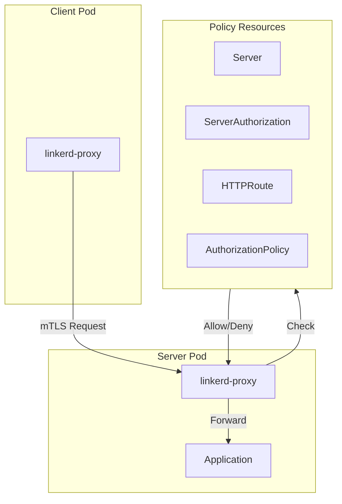
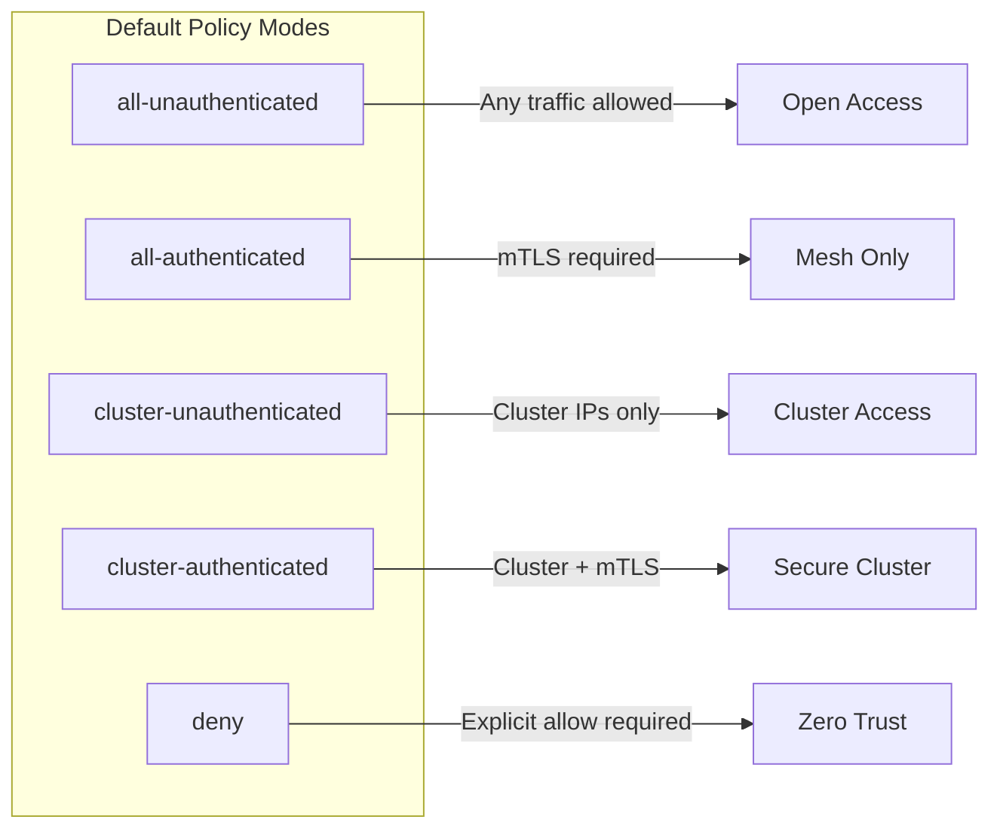
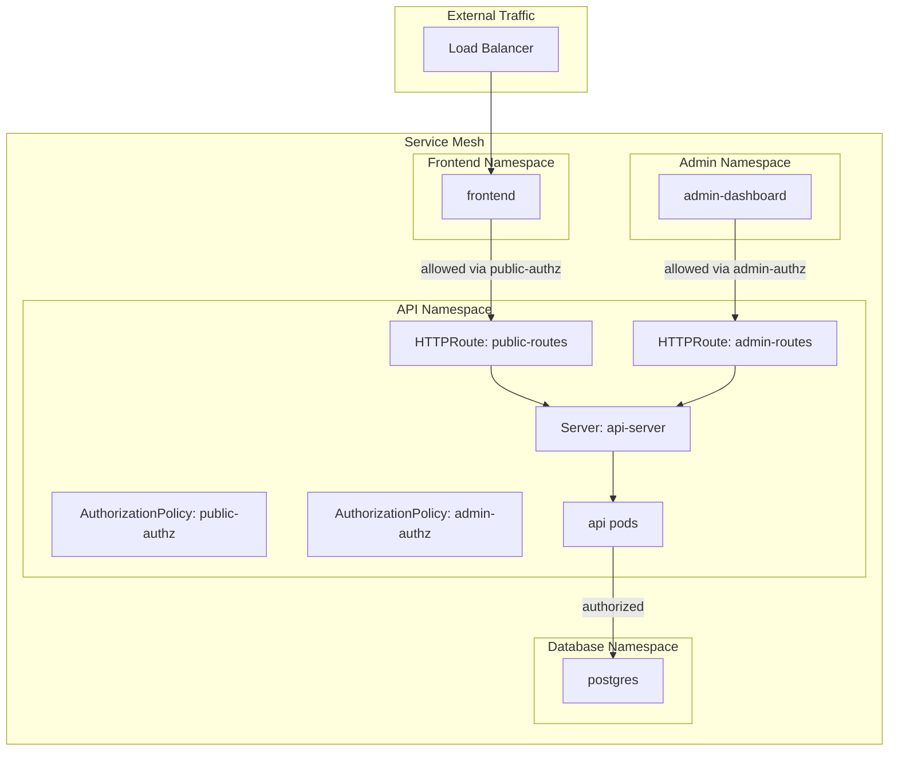
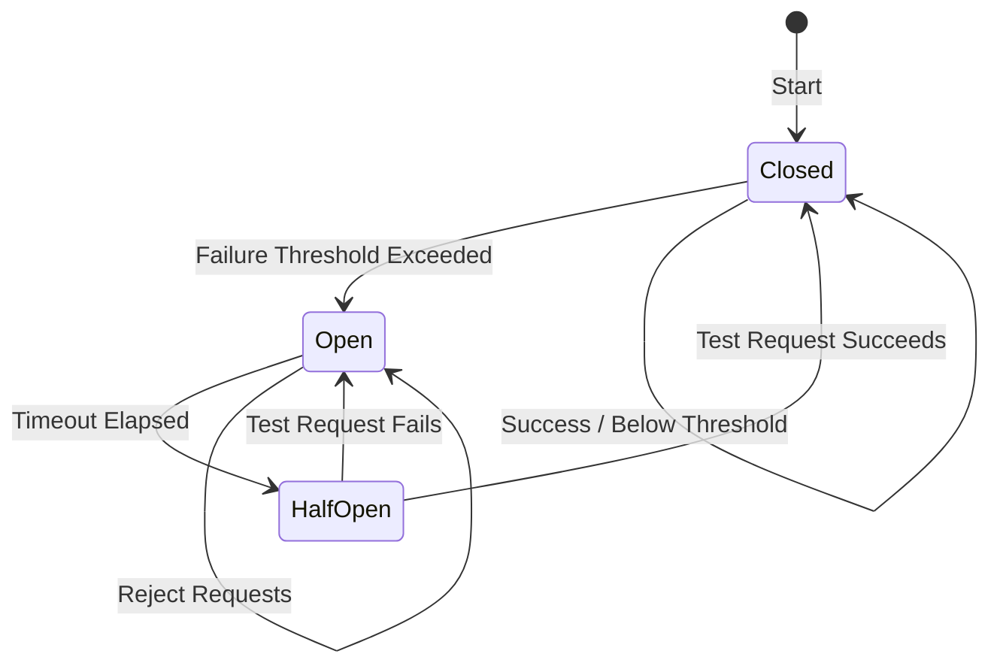

# How to Configure Linkerd Traffic Policies

By [Nawaz Dhandala](https://github.com/nawazdhandala)

Tags: Linkerd, Service Mesh, Kubernetes, Traffic Management, Authorization, HTTPRoute, Security, DevOps

Description: A comprehensive guide to configuring Linkerd traffic policies including server authorization, traffic splits, route-based policies, and HTTPRoute resources for fine-grained control over your service mesh traffic.

---

> "The best way to secure your microservices is to assume every request is potentially malicious until proven otherwise." - Zero Trust Networking Principles

Linkerd's policy system gives you fine-grained control over which services can communicate and how traffic flows through your mesh. Unlike traditional network policies that operate at Layer 3/4, Linkerd policies work at Layer 7, enabling HTTP-aware authorization and traffic management.

## Understanding Linkerd's Policy Architecture

Linkerd 2.12+ introduced a policy system built on Kubernetes Gateway API resources. This system lets you define who can access your services and how requests should be routed.



### Policy Components

- **Server**: Defines a port on a workload that accepts traffic
- **ServerAuthorization**: Specifies who can access a Server (deprecated, use AuthorizationPolicy)
- **AuthorizationPolicy**: Modern way to define access controls
- **HTTPRoute**: Defines route-based matching for HTTP traffic

## Prerequisites

Before configuring policies, ensure your cluster is ready:

```bash
# Check Linkerd version (need 2.12+ for policy CRDs)
linkerd version

# Verify policy controller is running
kubectl get pods -n linkerd -l linkerd.io/control-plane-component=destination

# Check if policy CRDs are installed
kubectl get crd | grep policy.linkerd.io
```

## Server Authorization

Server resources define which ports accept traffic and what protocols they speak. This is the foundation for all authorization decisions.

### Defining a Server

```yaml
# server.yaml
# Define a Server resource to mark port 8080 as accepting HTTP traffic
# This tells Linkerd's proxy to apply HTTP-aware policies
apiVersion: policy.linkerd.io/v1beta2
kind: Server
metadata:
  name: api-server
  namespace: production
spec:
  # Match pods with this label
  podSelector:
    matchLabels:
      app: api
  # Define the port this server listens on
  port: 8080
  # Protocol detection - http for L7 policies
  proxyProtocol: HTTP/2
```

### Creating an AuthorizationPolicy

AuthorizationPolicy defines who can access your Server. Without one, the default behavior depends on your cluster's policy mode.

```yaml
# authz-policy.yaml
# Allow only the frontend service to call the API
# All other traffic to the API will be denied
apiVersion: policy.linkerd.io/v1alpha1
kind: AuthorizationPolicy
metadata:
  name: api-authz
  namespace: production
spec:
  # Reference the Server this policy applies to
  targetRef:
    group: policy.linkerd.io
    kind: Server
    name: api-server
  # Define who can access this server
  requiredAuthenticationRefs:
    - name: frontend-identity
      kind: MeshTLSAuthentication
      group: policy.linkerd.io
---
# MeshTLSAuthentication defines valid client identities
apiVersion: policy.linkerd.io/v1alpha1
kind: MeshTLSAuthentication
metadata:
  name: frontend-identity
  namespace: production
spec:
  # Only allow requests from pods with this service account
  identities:
    - "frontend.production.serviceaccount.identity.linkerd.cluster.local"
```

### Default Policy Modes

Linkerd supports different default behaviors when no explicit policy exists:

```yaml
# Configure default policy during installation
# linkerd-values.yaml
proxy:
  # Options: all-unauthenticated, all-authenticated, cluster-unauthenticated,
  # cluster-authenticated, deny
  defaultInboundPolicy: all-authenticated
```



## Traffic Splits for Canary Deployments

Traffic splits let you gradually shift traffic between service versions, enabling canary deployments and A/B testing.

### Basic Traffic Split

```yaml
# traffic-split.yaml
# Split traffic between stable and canary versions
# Start with 90% to stable, 10% to canary
apiVersion: split.smi-spec.io/v1alpha2
kind: TrafficSplit
metadata:
  name: api-canary
  namespace: production
spec:
  # The root service that clients call
  service: api
  # Backend services to split traffic between
  backends:
    - service: api-stable
      weight: 900  # 90% of traffic
    - service: api-canary
      weight: 100  # 10% of traffic
```

### Progressive Canary Rollout

```yaml
# Start with minimal canary traffic
apiVersion: split.smi-spec.io/v1alpha2
kind: TrafficSplit
metadata:
  name: api-canary
  namespace: production
spec:
  service: api
  backends:
    - service: api-stable
      weight: 990  # 99%
    - service: api-canary
      weight: 10   # 1%
---
# After validation, increase canary traffic
# Apply this to shift to 50/50
apiVersion: split.smi-spec.io/v1alpha2
kind: TrafficSplit
metadata:
  name: api-canary
  namespace: production
spec:
  service: api
  backends:
    - service: api-stable
      weight: 500  # 50%
    - service: api-canary
      weight: 500  # 50%
---
# Final cutover - all traffic to canary
apiVersion: split.smi-spec.io/v1alpha2
kind: TrafficSplit
metadata:
  name: api-canary
  namespace: production
spec:
  service: api
  backends:
    - service: api-stable
      weight: 0    # 0%
    - service: api-canary
      weight: 1000 # 100%
```

### Automated Canary with Flagger

```yaml
# flagger-canary.yaml
# Flagger automates the canary progression based on metrics
apiVersion: flagger.app/v1beta1
kind: Canary
metadata:
  name: api
  namespace: production
spec:
  # Reference to the deployment to canary
  targetRef:
    apiVersion: apps/v1
    kind: Deployment
    name: api
  # Linkerd traffic management
  service:
    port: 8080
    targetPort: 8080
  analysis:
    # Check metrics every 60 seconds
    interval: 60s
    # Number of successful checks before promotion
    threshold: 10
    # Max traffic percentage to route to canary
    maxWeight: 50
    # Traffic increment per successful check
    stepWeight: 5
    # Prometheus metrics to evaluate
    metrics:
      - name: request-success-rate
        # Require 99% success rate
        thresholdRange:
          min: 99
        interval: 60s
      - name: request-duration
        # P99 latency under 500ms
        thresholdRange:
          max: 500
        interval: 60s
```

## Route-Based Policies with HTTPRoute

HTTPRoute resources let you define policies based on request attributes like path, headers, and methods.

### Basic HTTPRoute

```yaml
# httproute.yaml
# Define routing rules based on HTTP attributes
apiVersion: policy.linkerd.io/v1beta2
kind: HTTPRoute
metadata:
  name: api-routes
  namespace: production
spec:
  # Attach to the parent Server
  parentRefs:
    - name: api-server
      kind: Server
      group: policy.linkerd.io
  # Define matching rules
  rules:
    # Health check endpoint - allow all
    - matches:
        - path:
            type: Exact
            value: /health
      filters: []
    # API v1 endpoints
    - matches:
        - path:
            type: PathPrefix
            value: /api/v1/
          method: GET
      filters: []
    # Admin endpoints - restricted
    - matches:
        - path:
            type: PathPrefix
            value: /admin/
      filters: []
```

### HTTPRoute with Authorization

```yaml
# Combine HTTPRoute with AuthorizationPolicy for fine-grained control
apiVersion: policy.linkerd.io/v1beta2
kind: HTTPRoute
metadata:
  name: api-admin-routes
  namespace: production
spec:
  parentRefs:
    - name: api-server
      kind: Server
      group: policy.linkerd.io
  rules:
    - matches:
        - path:
            type: PathPrefix
            value: /admin/
---
# Only allow admin service to access admin routes
apiVersion: policy.linkerd.io/v1alpha1
kind: AuthorizationPolicy
metadata:
  name: admin-routes-authz
  namespace: production
spec:
  targetRef:
    group: policy.linkerd.io
    kind: HTTPRoute
    name: api-admin-routes
  requiredAuthenticationRefs:
    - name: admin-identity
      kind: MeshTLSAuthentication
      group: policy.linkerd.io
---
apiVersion: policy.linkerd.io/v1alpha1
kind: MeshTLSAuthentication
metadata:
  name: admin-identity
  namespace: production
spec:
  identities:
    - "admin-service.production.serviceaccount.identity.linkerd.cluster.local"
```

### Method-Based Routing

```yaml
# method-routing.yaml
# Different policies for different HTTP methods
apiVersion: policy.linkerd.io/v1beta2
kind: HTTPRoute
metadata:
  name: api-method-routes
  namespace: production
spec:
  parentRefs:
    - name: api-server
      kind: Server
      group: policy.linkerd.io
  rules:
    # GET requests - read access
    - matches:
        - path:
            type: PathPrefix
            value: /api/
          method: GET
    # POST/PUT/DELETE - write access
    - matches:
        - path:
            type: PathPrefix
            value: /api/
          method: POST
    - matches:
        - path:
            type: PathPrefix
            value: /api/
          method: PUT
    - matches:
        - path:
            type: PathPrefix
            value: /api/
          method: DELETE
---
# Separate authorization for read vs write
apiVersion: policy.linkerd.io/v1alpha1
kind: AuthorizationPolicy
metadata:
  name: api-write-authz
  namespace: production
spec:
  targetRef:
    group: policy.linkerd.io
    kind: HTTPRoute
    name: api-method-routes
  requiredAuthenticationRefs:
    - name: write-clients
      kind: MeshTLSAuthentication
      group: policy.linkerd.io
```

### Header-Based Routing

```yaml
# header-routing.yaml
# Route based on request headers
apiVersion: policy.linkerd.io/v1beta2
kind: HTTPRoute
metadata:
  name: api-header-routes
  namespace: production
spec:
  parentRefs:
    - name: api-server
      kind: Server
      group: policy.linkerd.io
  rules:
    # Internal API requests (with special header)
    - matches:
        - headers:
            - name: X-Internal-Request
              value: "true"
          path:
            type: PathPrefix
            value: /internal/
    # Tenant-specific routing
    - matches:
        - headers:
            - name: X-Tenant-ID
              type: RegularExpression
              value: "^tenant-[a-z0-9]+$"
          path:
            type: PathPrefix
            value: /api/
```

## Complete Policy Architecture Example

Here's a complete example showing how all policy components work together:



```yaml
# Complete policy configuration
---
# 1. Define the Server
apiVersion: policy.linkerd.io/v1beta2
kind: Server
metadata:
  name: api-server
  namespace: api
spec:
  podSelector:
    matchLabels:
      app: api
  port: 8080
  proxyProtocol: HTTP/2
---
# 2. Define public routes
apiVersion: policy.linkerd.io/v1beta2
kind: HTTPRoute
metadata:
  name: public-routes
  namespace: api
spec:
  parentRefs:
    - name: api-server
      kind: Server
      group: policy.linkerd.io
  rules:
    - matches:
        - path:
            type: PathPrefix
            value: /api/v1/public/
        - path:
            type: Exact
            value: /health
        - path:
            type: Exact
            value: /ready
---
# 3. Define admin routes
apiVersion: policy.linkerd.io/v1beta2
kind: HTTPRoute
metadata:
  name: admin-routes
  namespace: api
spec:
  parentRefs:
    - name: api-server
      kind: Server
      group: policy.linkerd.io
  rules:
    - matches:
        - path:
            type: PathPrefix
            value: /admin/
        - path:
            type: PathPrefix
            value: /api/v1/internal/
---
# 4. Public routes authorization - allow frontend
apiVersion: policy.linkerd.io/v1alpha1
kind: AuthorizationPolicy
metadata:
  name: public-authz
  namespace: api
spec:
  targetRef:
    group: policy.linkerd.io
    kind: HTTPRoute
    name: public-routes
  requiredAuthenticationRefs:
    - name: frontend-identity
      kind: MeshTLSAuthentication
      group: policy.linkerd.io
---
# 5. Admin routes authorization - allow admin dashboard only
apiVersion: policy.linkerd.io/v1alpha1
kind: AuthorizationPolicy
metadata:
  name: admin-authz
  namespace: api
spec:
  targetRef:
    group: policy.linkerd.io
    kind: HTTPRoute
    name: admin-routes
  requiredAuthenticationRefs:
    - name: admin-identity
      kind: MeshTLSAuthentication
      group: policy.linkerd.io
---
# 6. Define allowed identities
apiVersion: policy.linkerd.io/v1alpha1
kind: MeshTLSAuthentication
metadata:
  name: frontend-identity
  namespace: api
spec:
  identities:
    - "frontend.frontend.serviceaccount.identity.linkerd.cluster.local"
---
apiVersion: policy.linkerd.io/v1alpha1
kind: MeshTLSAuthentication
metadata:
  name: admin-identity
  namespace: api
spec:
  identities:
    - "admin-dashboard.admin.serviceaccount.identity.linkerd.cluster.local"
```

## Rate Limiting

Linkerd itself doesn't have built-in rate limiting, but you can implement it using ServiceProfiles or external solutions that integrate with the mesh.

### Rate Limiting with ServiceProfile Response Classes

```yaml
# rate-limit-handling.yaml
# Configure how the mesh handles rate-limited responses
apiVersion: linkerd.io/v1alpha2
kind: ServiceProfile
metadata:
  name: api.production.svc.cluster.local
  namespace: production
spec:
  routes:
    - name: POST /api/orders
      condition:
        method: POST
        pathRegex: /api/orders
      # Define response classes to handle rate limiting
      responseClasses:
        # Treat 429 Too Many Requests as retriable
        - condition:
            status:
              min: 429
              max: 429
          # Mark as failure for metrics
          isFailure: true
      # Don't retry rate-limited requests immediately
      isRetryable: false
      timeout: 10s
```

### Rate Limiting at Ingress Layer

```yaml
# ingress-rate-limit.yaml
# Implement rate limiting at the ingress level
# This works alongside Linkerd policies
apiVersion: networking.k8s.io/v1
kind: Ingress
metadata:
  name: api-ingress
  namespace: production
  annotations:
    # NGINX rate limiting
    nginx.ingress.kubernetes.io/limit-rps: "100"
    nginx.ingress.kubernetes.io/limit-connections: "10"
    nginx.ingress.kubernetes.io/limit-burst-multiplier: "5"
spec:
  ingressClassName: nginx
  rules:
    - host: api.example.com
      http:
        paths:
          - path: /api
            pathType: Prefix
            backend:
              service:
                name: api
                port:
                  number: 8080
```

### Application-Level Rate Limiting Pattern

```yaml
# rate-limit-sidecar.yaml
# Deploy a rate limiting sidecar alongside your service
apiVersion: apps/v1
kind: Deployment
metadata:
  name: api-with-ratelimit
  namespace: production
spec:
  replicas: 3
  selector:
    matchLabels:
      app: api
  template:
    metadata:
      labels:
        app: api
      annotations:
        # Enable Linkerd injection
        linkerd.io/inject: enabled
    spec:
      containers:
        # Main application
        - name: api
          image: myapp/api:v1.0.0
          ports:
            - containerPort: 8080
        # Rate limiting sidecar
        - name: rate-limiter
          image: envoyproxy/ratelimit:latest
          ports:
            - containerPort: 8081
          env:
            - name: REDIS_URL
              value: "redis://redis:6379"
          volumeMounts:
            - name: ratelimit-config
              mountPath: /data/ratelimit/config
      volumes:
        - name: ratelimit-config
          configMap:
            name: rate-limit-config
```

## Circuit Breaking

Circuit breaking prevents cascading failures by stopping requests to unhealthy services. Linkerd implements this through failure accrual in ServiceProfiles.

### Basic Circuit Breaking with ServiceProfile

```yaml
# circuit-breaker.yaml
# Configure circuit breaking using retry budgets
apiVersion: linkerd.io/v1alpha2
kind: ServiceProfile
metadata:
  name: payment.production.svc.cluster.local
  namespace: production
spec:
  # Retry budget acts as circuit breaking
  retryBudget:
    # Only retry 10% of requests - prevents retry storms
    retryRatio: 0.1
    # Minimum retries per second even during outages
    minRetriesPerSecond: 5
    # Time window for calculating budget
    ttl: 10s
  routes:
    - name: POST /payment/process
      condition:
        method: POST
        pathRegex: /payment/process
      # Short timeout triggers circuit breaking faster
      timeout: 5s
      # Non-idempotent - don't retry
      isRetryable: false
      # Response classes for failure detection
      responseClasses:
        # 5xx errors are failures
        - condition:
            status:
              min: 500
              max: 599
          isFailure: true
```

### Circuit Breaking with Outlier Detection

```yaml
# circuit-breaker-outlier.yaml
# Combine with Kubernetes readiness probes for outlier detection
apiVersion: apps/v1
kind: Deployment
metadata:
  name: api
  namespace: production
spec:
  replicas: 5
  selector:
    matchLabels:
      app: api
  template:
    metadata:
      labels:
        app: api
      annotations:
        linkerd.io/inject: enabled
        # Configure proxy timeouts
        config.linkerd.io/proxy-outbound-connect-timeout: "1000ms"
        config.linkerd.io/proxy-inbound-connect-timeout: "1000ms"
    spec:
      containers:
        - name: api
          image: myapp/api:v1.0.0
          ports:
            - containerPort: 8080
          # Readiness probe removes unhealthy pods from load balancing
          readinessProbe:
            httpGet:
              path: /health
              port: 8080
            initialDelaySeconds: 5
            periodSeconds: 5
            failureThreshold: 2  # Fast failure detection
          # Liveness probe restarts unhealthy pods
          livenessProbe:
            httpGet:
              path: /health
              port: 8080
            initialDelaySeconds: 10
            periodSeconds: 10
            failureThreshold: 3
```



### Circuit Breaking with Fallback

```yaml
# circuit-breaker-fallback.yaml
# Implement fallback using traffic split
apiVersion: split.smi-spec.io/v1alpha2
kind: TrafficSplit
metadata:
  name: recommendation-fallback
  namespace: production
spec:
  service: recommendation
  backends:
    # Primary recommendation service
    - service: recommendation-primary
      weight: 90
    # Fallback with cached/static recommendations
    # During outages, shift weight to fallback
    - service: recommendation-fallback
      weight: 10
```

## Debugging Traffic Policies

When policies don't work as expected, use these tools to diagnose issues:

### Check Policy Status

```bash
# List all servers in a namespace
kubectl get servers -n production

# Check server details
kubectl describe server api-server -n production

# List authorization policies
kubectl get authorizationpolicies -n production

# View HTTPRoutes
kubectl get httproutes -n production
```

### Use linkerd diagnostics

```bash
# Check proxy configuration for a pod
linkerd diagnostics proxy-metrics -n production deploy/api

# View authorization decisions
linkerd diagnostics policy -n production deploy/api

# Check if mTLS is working
linkerd edges -n production
```

### Audit Authorization Failures

```bash
# Watch for authorization failures in real-time
kubectl logs -n linkerd -l linkerd.io/control-plane-component=destination -f | grep -i "authz"

# Check proxy logs for a specific pod
kubectl logs -n production deploy/api -c linkerd-proxy | grep -i "forbidden"
```

## Monitoring Linkerd with OneUptime

Once you have policies configured, monitoring their effectiveness is critical. [OneUptime](https://oneuptime.com) provides comprehensive observability for your Linkerd service mesh:

- **Real-time traffic monitoring**: Track request rates, latencies, and error rates across your mesh
- **Authorization failure alerts**: Get notified when services are denied access
- **Traffic split analytics**: Monitor canary deployment metrics and success rates
- **Policy compliance dashboards**: Visualize which services are communicating and whether policies are being enforced

Integrate OneUptime with Linkerd's Prometheus metrics to gain visibility into your policy enforcement and traffic patterns.

## Best Practices

1. **Start with deny-all**: Set `defaultInboundPolicy: deny` and explicitly allow required traffic
2. **Use service accounts**: Base authorization on service account identities, not pod labels
3. **Test in staging**: Always validate policies in a non-production environment first
4. **Monitor authorization failures**: Set up alerts for unexpected denials
5. **Document policies**: Add annotations explaining why each policy exists
6. **Version control**: Store all policy YAML in git alongside your application code
7. **Gradual rollout**: Use traffic splits when introducing new policy configurations

---

Linkerd's traffic policies give you powerful tools to implement zero-trust networking in Kubernetes. By combining Server definitions, AuthorizationPolicies, and HTTPRoutes, you can enforce fine-grained access control at the application layer. Start with simple policies and gradually add complexity as you understand your traffic patterns.
