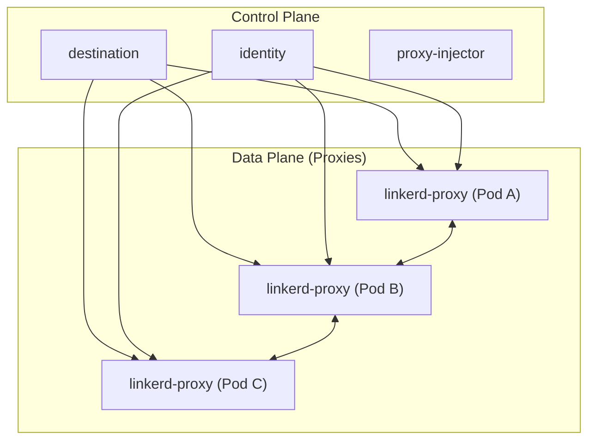
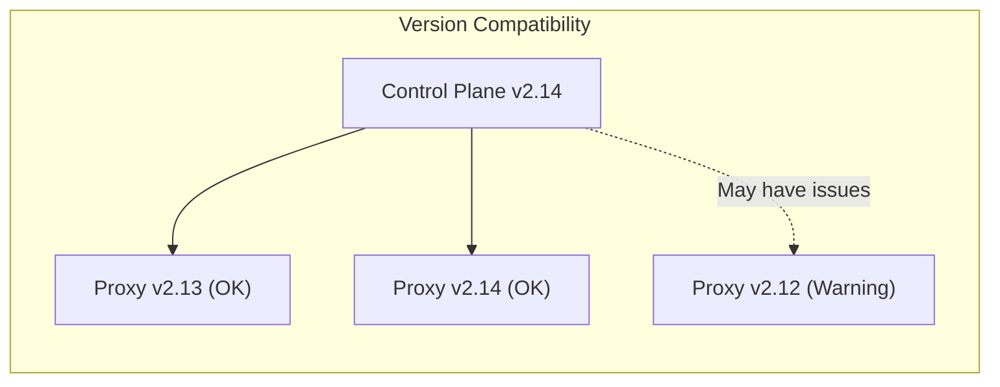
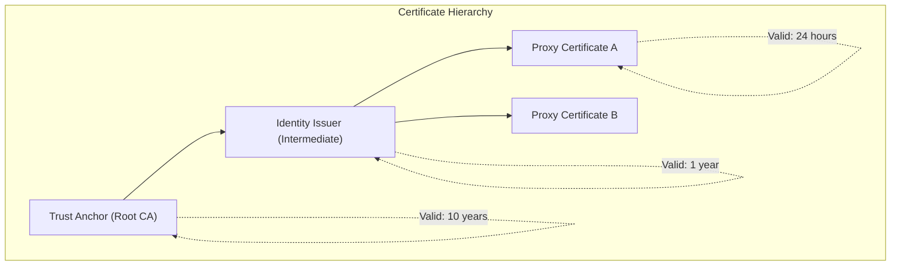
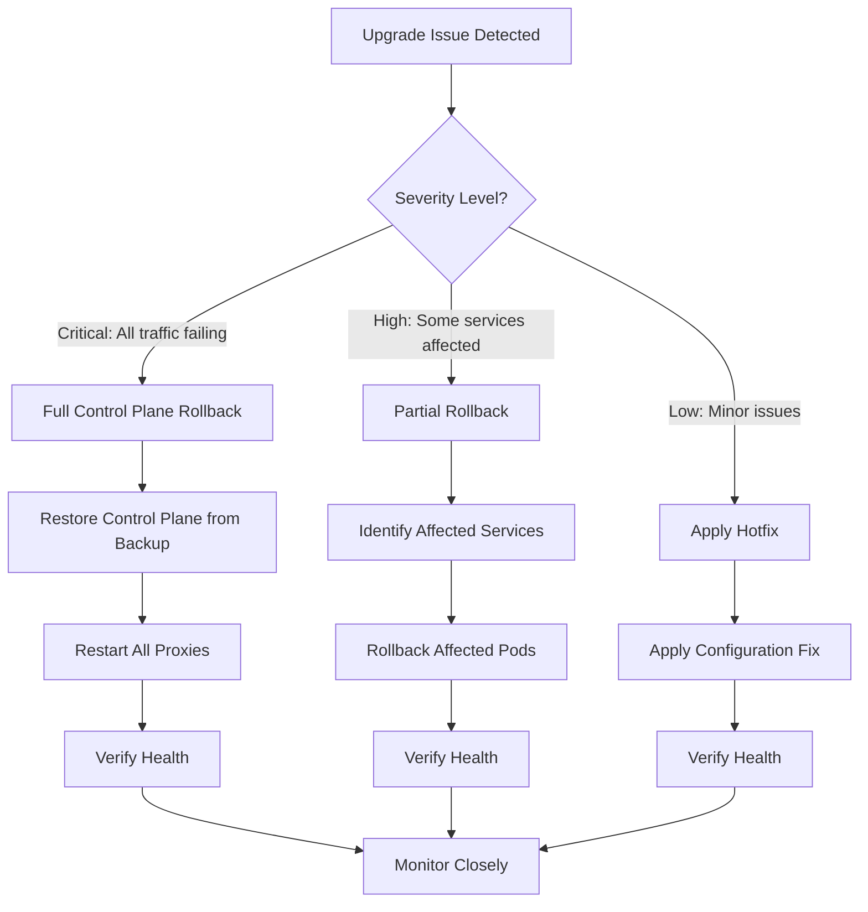

# How to Upgrade Linkerd Safely

Author: [nawazdhandala](https://www.github.com/nawazdhandala)

Tags: Linkerd, Service Mesh, Kubernetes, Upgrades, DevOps, SRE, Zero Downtime

Description: A comprehensive guide to safely upgrading Linkerd in production environments, covering pre-upgrade checks, rolling proxy updates, certificate rotation, and rollback strategies.

---

> "The first rule of upgrading production systems is to always have a way back." - Site Reliability Engineering Wisdom

Upgrading a service mesh in production is one of those tasks that keeps SREs awake at night. Linkerd, while being one of the simpler service meshes to operate, still requires careful planning when upgrading. A botched upgrade can take down your entire mesh and with it, all inter-service communication. This guide walks you through a battle-tested process for upgrading Linkerd safely.

## Understanding Linkerd Architecture

Before diving into upgrades, you need to understand what you are upgrading. Linkerd consists of two main components:



- **Control Plane**: The brains of the operation (destination, identity, proxy-injector)
- **Data Plane**: The proxies injected as sidecars into your application pods

Upgrades must be coordinated between both planes to maintain compatibility.

## Pre-Upgrade Checklist

Before touching anything in production, complete these checks.

### Check Current Version and Health

```bash
# Check current Linkerd version
linkerd version

# Verify the control plane is healthy
linkerd check

# Check data plane health across all namespaces
linkerd check --proxy
```

### Verify Certificate Expiration

Certificates are the Achilles heel of Linkerd upgrades. Check them first.

```bash
# Check certificate expiration dates
linkerd check --proxy | grep -i cert

# Get detailed certificate information
kubectl get secret -n linkerd linkerd-identity-issuer -o jsonpath='{.data.crt\.pem}' | \
  base64 -d | \
  openssl x509 -noout -dates
```

### Document Current State

```bash
# Export current Linkerd configuration
linkerd install --ignore-cluster > linkerd-current-config.yaml

# List all meshed namespaces and pods
kubectl get pods --all-namespaces -o jsonpath='{range .items[*]}{.metadata.namespace}/{.metadata.name}{"\t"}{.spec.containers[*].name}{"\n"}{end}' | \
  grep linkerd-proxy > meshed-pods.txt

# Count meshed pods per namespace
kubectl get pods --all-namespaces -l linkerd.io/control-plane-ns=linkerd --no-headers | \
  awk '{print $1}' | sort | uniq -c
```

### Test in Staging First

Never skip this step. Your staging environment should mirror production.

```bash
# Apply upgrade to staging first
linkerd upgrade | kubectl apply -f - --context staging-cluster

# Run full validation suite
linkerd check --context staging-cluster
linkerd check --proxy --context staging-cluster

# Run your integration tests against staging
./run-integration-tests.sh --env staging
```

## The Upgrade Process

Linkerd upgrades follow a specific order: CLI first, then control plane, then data plane.

### Step 1: Upgrade the Linkerd CLI

```bash
# Download the new CLI version (replace with target version)
curl -sL https://run.linkerd.io/install | sh

# Verify new version
linkerd version --client

# Run pre-upgrade checks with new CLI
linkerd check --pre
```

### Step 2: Upgrade the Control Plane

The control plane upgrade is straightforward but critical.

```bash
# Generate upgrade manifest
# This preserves your existing configuration
linkerd upgrade > linkerd-upgrade.yaml

# Review the changes (critical step!)
diff <(linkerd install --ignore-cluster) linkerd-upgrade.yaml

# Apply the upgrade
kubectl apply -f linkerd-upgrade.yaml

# Wait for control plane to be ready
kubectl rollout status deploy -n linkerd

# Verify upgrade success
linkerd check
```

### Step 3: Upgrade Linkerd Extensions

If you use Linkerd extensions (viz, multicluster, jaeger), upgrade them after the control plane.

```bash
# Upgrade the viz extension
linkerd viz install | kubectl apply -f -

# Wait for viz to be ready
kubectl rollout status deploy -n linkerd-viz

# Verify viz is healthy
linkerd viz check

# Upgrade multicluster if used
linkerd multicluster install | kubectl apply -f -
linkerd multicluster check
```

## Rolling Proxy Updates

The data plane (proxies) requires restarting your application pods. This is where zero-downtime upgrades get tricky.

### Understanding Proxy Version Compatibility



Linkerd supports N-1 version compatibility between control plane and proxies. This means you can upgrade the control plane first and roll out proxy updates gradually.

### Automated Rolling Update Script

```bash
#!/bin/bash
# rolling-proxy-update.sh
# Safely restart pods to pick up new proxy version

set -euo pipefail

NAMESPACE=${1:-""}
BATCH_SIZE=${2:-5}
SLEEP_BETWEEN_BATCHES=${3:-30}

if [[ -z "$NAMESPACE" ]]; then
  echo "Usage: $0 <namespace> [batch_size] [sleep_seconds]"
  exit 1
fi

echo "Starting rolling proxy update for namespace: $NAMESPACE"

# Get all deployments in the namespace that are meshed
DEPLOYMENTS=$(kubectl get deployments -n "$NAMESPACE" \
  -l linkerd.io/control-plane-ns=linkerd \
  -o jsonpath='{.items[*].metadata.name}')

DEPLOY_ARRAY=($DEPLOYMENTS)
TOTAL=${#DEPLOY_ARRAY[@]}

echo "Found $TOTAL meshed deployments"

for ((i=0; i<TOTAL; i+=BATCH_SIZE)); do
  BATCH=("${DEPLOY_ARRAY[@]:i:BATCH_SIZE}")
  echo "Processing batch: ${BATCH[*]}"

  for DEPLOY in "${BATCH[@]}"; do
    echo "Restarting deployment: $DEPLOY"
    kubectl rollout restart deployment/"$DEPLOY" -n "$NAMESPACE"
  done

  # Wait for all deployments in batch to be ready
  for DEPLOY in "${BATCH[@]}"; do
    echo "Waiting for $DEPLOY to be ready..."
    kubectl rollout status deployment/"$DEPLOY" -n "$NAMESPACE" --timeout=300s
  done

  # Check Linkerd health after each batch
  echo "Verifying Linkerd health..."
  if ! linkerd check --proxy --namespace "$NAMESPACE"; then
    echo "ERROR: Linkerd health check failed after updating $DEPLOY"
    exit 1
  fi

  if [[ $((i + BATCH_SIZE)) -lt $TOTAL ]]; then
    echo "Sleeping for $SLEEP_BETWEEN_BATCHES seconds before next batch..."
    sleep "$SLEEP_BETWEEN_BATCHES"
  fi
done

echo "Rolling proxy update completed successfully!"
```

### Using Pod Disruption Budgets

Ensure your applications have proper PDBs before rolling updates.

```yaml
# Example PDB for a critical service
apiVersion: policy/v1
kind: PodDisruptionBudget
metadata:
  name: api-server-pdb
  namespace: production
spec:
  # Ensure at least 2 pods are always available
  minAvailable: 2
  selector:
    matchLabels:
      app: api-server
```

### Verify Proxy Versions After Update

```bash
# Check proxy versions across all pods
linkerd viz stat deploy -n production --all-namespaces | grep -v "MESHED"

# Get detailed proxy version info
kubectl get pods -n production -o jsonpath='{range .items[*]}{.metadata.name}{"\t"}{.spec.containers[?(@.name=="linkerd-proxy")].image}{"\n"}{end}'

# Ensure no old proxies remain
OLD_VERSION="2.13"
kubectl get pods --all-namespaces -o jsonpath='{range .items[*]}{.metadata.namespace}/{.metadata.name}{"\t"}{.spec.containers[?(@.name=="linkerd-proxy")].image}{"\n"}{end}' | \
  grep "$OLD_VERSION" || echo "No old proxies found - upgrade complete!"
```

## Certificate Rotation

Certificate rotation is essential during upgrades, especially if certs are close to expiration.

### Understanding Linkerd Certificate Hierarchy



### Rotate Identity Issuer Certificate

```bash
# Generate new issuer certificate signed by existing trust anchor
# First, extract the trust anchor
kubectl get secret -n linkerd linkerd-identity-trust-roots -o jsonpath='{.data.ca-bundle\.crt}' | \
  base64 -d > trust-anchor.crt

# Generate new issuer key and certificate
step certificate create identity.linkerd.cluster.local issuer-new.crt issuer-new.key \
  --profile intermediate-ca \
  --not-after 8760h \
  --ca trust-anchor.crt \
  --ca-key trust-anchor.key \
  --no-password --insecure

# Update the issuer secret
kubectl create secret tls linkerd-identity-issuer \
  --cert=issuer-new.crt \
  --key=issuer-new.key \
  --namespace=linkerd \
  --dry-run=client -o yaml | kubectl apply -f -

# Restart identity service to pick up new certificate
kubectl rollout restart deploy/linkerd-identity -n linkerd
kubectl rollout status deploy/linkerd-identity -n linkerd

# Verify new certificate
linkerd check --proxy | grep -i cert
```

### Rotate Trust Anchor (Major Operation)

Rotating the trust anchor requires a bundle rotation to avoid downtime.

```bash
# Step 1: Create new trust anchor
step certificate create root.linkerd.cluster.local trust-anchor-new.crt trust-anchor-new.key \
  --profile root-ca \
  --not-after 87600h \
  --no-password --insecure

# Step 2: Create bundle with both old and new trust anchors
cat trust-anchor-old.crt trust-anchor-new.crt > trust-bundle.crt

# Step 3: Update trust roots with bundle
kubectl create configmap linkerd-identity-trust-roots \
  --from-file=ca-bundle.crt=trust-bundle.crt \
  --namespace=linkerd \
  --dry-run=client -o yaml | kubectl apply -f -

# Step 4: Restart all proxies to pick up new bundle
# (Use the rolling update script from earlier)
./rolling-proxy-update.sh production 5 30

# Step 5: Generate new issuer signed by NEW trust anchor
step certificate create identity.linkerd.cluster.local issuer-new.crt issuer-new.key \
  --profile intermediate-ca \
  --not-after 8760h \
  --ca trust-anchor-new.crt \
  --ca-key trust-anchor-new.key \
  --no-password --insecure

# Step 6: Update issuer and restart identity
kubectl create secret tls linkerd-identity-issuer \
  --cert=issuer-new.crt \
  --key=issuer-new.key \
  --namespace=linkerd \
  --dry-run=client -o yaml | kubectl apply -f -

kubectl rollout restart deploy/linkerd-identity -n linkerd

# Step 7: Roll proxies again to get certificates from new issuer
./rolling-proxy-update.sh production 5 30

# Step 8: Remove old trust anchor from bundle (after all proxies updated)
cp trust-anchor-new.crt trust-bundle.crt
kubectl create configmap linkerd-identity-trust-roots \
  --from-file=ca-bundle.crt=trust-bundle.crt \
  --namespace=linkerd \
  --dry-run=client -o yaml | kubectl apply -f -
```

## Rollback Strategies

When upgrades go wrong, you need to roll back quickly. Plan for failure.

### Rollback Decision Flowchart



### Full Control Plane Rollback

```bash
#!/bin/bash
# rollback-linkerd.sh
# Emergency rollback script for Linkerd control plane

set -euo pipefail

PREVIOUS_VERSION=${1:-""}

if [[ -z "$PREVIOUS_VERSION" ]]; then
  echo "Usage: $0 <previous_version>"
  echo "Example: $0 stable-2.13.6"
  exit 1
fi

echo "WARNING: This will rollback Linkerd control plane to $PREVIOUS_VERSION"
read -p "Are you sure? (yes/no): " CONFIRM
if [[ "$CONFIRM" != "yes" ]]; then
  echo "Aborted."
  exit 1
fi

# Download previous CLI version
echo "Downloading Linkerd CLI $PREVIOUS_VERSION..."
curl -sL https://run.linkerd.io/install | LINKERD2_VERSION=$PREVIOUS_VERSION sh

# Generate rollback manifest
echo "Generating rollback manifest..."
linkerd install --ignore-cluster > linkerd-rollback.yaml

# Apply rollback
echo "Applying rollback..."
kubectl apply -f linkerd-rollback.yaml

# Wait for control plane
echo "Waiting for control plane..."
kubectl rollout status deploy -n linkerd --timeout=300s

# Verify
echo "Running health checks..."
linkerd check

echo "Rollback complete. Data plane proxies are still running new version."
echo "Consider rolling back pods if proxy compatibility issues exist."
```

### Selective Proxy Rollback

```bash
#!/bin/bash
# rollback-proxy.sh
# Roll back specific deployments to previous proxy version

NAMESPACE=$1
DEPLOYMENT=$2
PREVIOUS_IMAGE="cr.l5d.io/linkerd/proxy:stable-2.13.6"

if [[ -z "$NAMESPACE" || -z "$DEPLOYMENT" ]]; then
  echo "Usage: $0 <namespace> <deployment>"
  exit 1
fi

# Patch the deployment to use specific proxy image
kubectl patch deployment "$DEPLOYMENT" -n "$NAMESPACE" --type='json' -p="[
  {
    \"op\": \"replace\",
    \"path\": \"/spec/template/metadata/annotations/linkerd.io~1proxy-version\",
    \"value\": \"stable-2.13.6\"
  }
]"

# Restart the deployment
kubectl rollout restart deployment/"$DEPLOYMENT" -n "$NAMESPACE"
kubectl rollout status deployment/"$DEPLOYMENT" -n "$NAMESPACE"

echo "Proxy rollback complete for $DEPLOYMENT"
```

### Backup Before Upgrade

Always create backups before major upgrades.

```bash
#!/bin/bash
# backup-linkerd.sh
# Create comprehensive Linkerd backup before upgrade

BACKUP_DIR="linkerd-backup-$(date +%Y%m%d-%H%M%S)"
mkdir -p "$BACKUP_DIR"

echo "Creating Linkerd backup in $BACKUP_DIR..."

# Backup control plane resources
kubectl get all -n linkerd -o yaml > "$BACKUP_DIR/linkerd-namespace.yaml"

# Backup secrets (contains certificates)
kubectl get secrets -n linkerd -o yaml > "$BACKUP_DIR/linkerd-secrets.yaml"

# Backup configmaps
kubectl get configmaps -n linkerd -o yaml > "$BACKUP_DIR/linkerd-configmaps.yaml"

# Backup CRDs
kubectl get crd -o yaml | grep -A1000 'linkerd' > "$BACKUP_DIR/linkerd-crds.yaml"

# Backup viz extension if present
if kubectl get namespace linkerd-viz &>/dev/null; then
  kubectl get all -n linkerd-viz -o yaml > "$BACKUP_DIR/linkerd-viz.yaml"
fi

# Export current install config
linkerd install --ignore-cluster > "$BACKUP_DIR/linkerd-install.yaml"

# Record current versions
linkerd version > "$BACKUP_DIR/versions.txt"

# Create tarball
tar -czvf "$BACKUP_DIR.tar.gz" "$BACKUP_DIR"
rm -rf "$BACKUP_DIR"

echo "Backup created: $BACKUP_DIR.tar.gz"
```

## Monitoring the Upgrade

Use [OneUptime](https://oneuptime.com) to monitor your Linkerd upgrade in real-time. Set up alerts for:

- Control plane pod restarts
- Proxy injection failures
- Certificate expiration warnings
- Latency spikes during proxy rollouts
- Error rate increases

### Key Metrics to Watch

```bash
# Success rate during upgrade
linkerd viz stat deploy -n production

# Check for retries (indicates issues)
linkerd viz stat deploy -n production -o wide | awk '{print $1, $NF}'

# Monitor latency percentiles
linkerd viz stat deploy -n production --to deploy/api-server
```

### Post-Upgrade Validation Script

```bash
#!/bin/bash
# validate-upgrade.sh
# Comprehensive post-upgrade validation

echo "=== Linkerd Post-Upgrade Validation ==="

echo -e "\n1. Version Check"
linkerd version

echo -e "\n2. Control Plane Health"
linkerd check

echo -e "\n3. Proxy Health"
linkerd check --proxy

echo -e "\n4. Certificate Status"
linkerd check 2>&1 | grep -i cert

echo -e "\n5. Extension Health"
linkerd viz check 2>/dev/null || echo "Viz extension not installed"
linkerd multicluster check 2>/dev/null || echo "Multicluster not installed"

echo -e "\n6. Proxy Version Distribution"
kubectl get pods --all-namespaces -o jsonpath='{range .items[*]}{.spec.containers[?(@.name=="linkerd-proxy")].image}{"\n"}{end}' | \
  sort | uniq -c | sort -rn

echo -e "\n7. Traffic Metrics (last 1m)"
linkerd viz stat deploy --all-namespaces 2>/dev/null | head -20

echo -e "\n=== Validation Complete ==="
```

## Summary

Upgrading Linkerd safely requires methodical preparation and execution:

1. **Prepare**: Check versions, certificates, and document current state
2. **Test**: Always upgrade staging first
3. **Upgrade CLI**: Keep tools in sync
4. **Upgrade Control Plane**: Apply and verify
5. **Upgrade Extensions**: Handle viz, multicluster separately
6. **Roll Proxies**: Gradual rollout with health checks
7. **Rotate Certificates**: If needed, handle carefully
8. **Monitor**: Watch metrics throughout
9. **Have Rollback Ready**: Always plan for failure

The key to safe Linkerd upgrades is patience. Rushing through the process is how you end up with a 3 AM incident. Take your time, verify each step, and keep monitoring throughout.

For comprehensive monitoring of your Linkerd mesh and Kubernetes infrastructure, consider [OneUptime](https://oneuptime.com) - an open-source observability platform that integrates seamlessly with your service mesh telemetry.
