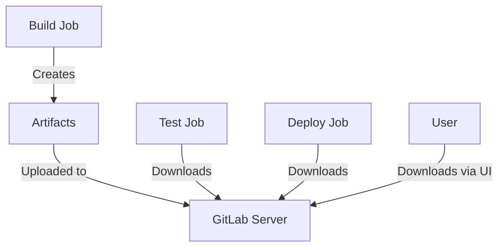

# How to Manage Artifacts in GitLab CI

Author: [nawazdhandala](https://www.github.com/nawazdhandala)

Tags: GitLab CI, Artifacts, CI/CD, Build Outputs, DevOps

Description: Learn how to manage artifacts in GitLab CI for sharing build outputs between jobs, persisting test reports, and maintaining deployment packages across your pipeline.

---

Artifacts are the files your jobs produce and need to share. Test reports, compiled binaries, Docker images saved to disk, coverage reports - all of these flow through GitLab's artifact system. Understanding artifacts is essential for building effective pipelines. This guide covers everything from basic artifact usage to advanced patterns for large-scale projects.

## Artifacts vs Cache

Before diving in, understand the difference between artifacts and cache.

Artifacts pass files from one job to downstream jobs within the same pipeline. They're guaranteed to be available and are stored on the GitLab server.

Cache speeds up jobs by reusing files across pipelines. Cache is best-effort and may not always be available.

Use artifacts for build outputs and test results. Use cache for dependencies that don't change often.

## Basic Artifact Configuration

Define artifacts in your job to save files for later use.

```yaml
stages:
  - build
  - test
  - deploy

build:
  stage: build
  script:
    - npm ci
    - npm run build
  artifacts:
    paths:
      - dist/
    expire_in: 1 week

test:
  stage: test
  script:
    # dist/ is automatically available from build job
    - npm test
  dependencies:
    - build

deploy:
  stage: deploy
  script:
    - ./deploy.sh dist/
  dependencies:
    - build
```

The `dependencies` keyword specifies which jobs' artifacts to download. By default, all artifacts from previous stages are downloaded.

## Artifact Expiration

Control storage costs with expiration policies.

```yaml
build:
  artifacts:
    paths:
      - dist/
    # Expire after 1 week
    expire_in: 1 week

release-build:
  artifacts:
    paths:
      - dist/
    # Keep release artifacts longer
    expire_in: 1 year
  only:
    - tags
```

Supported time formats:
- `42` or `42 seconds`
- `3 mins 4 sec`
- `2 hrs 20 min`
- `2h20min`
- `6 mos 1 day`
- `47 yrs 6 mos and 4d`
- `never` (keep forever, use sparingly)

## Artifact Flow

Here's how artifacts move through your pipeline:



## Selective Dependencies

Download only the artifacts you need to speed up job start times.

```yaml
build-frontend:
  stage: build
  script:
    - npm run build:frontend
  artifacts:
    paths:
      - frontend/dist/

build-backend:
  stage: build
  script:
    - npm run build:backend
  artifacts:
    paths:
      - backend/dist/

deploy-frontend:
  stage: deploy
  script:
    - ./deploy.sh frontend
  dependencies:
    - build-frontend  # Only download frontend artifacts

deploy-backend:
  stage: deploy
  script:
    - ./deploy.sh backend
  dependencies:
    - build-backend  # Only download backend artifacts
```

Use `dependencies: []` to skip downloading any artifacts.

## Test Reports

GitLab can parse test results for display in merge requests.

```yaml
test:
  stage: test
  script:
    - npm test -- --reporter=junit --outputFile=junit.xml
  artifacts:
    reports:
      junit: junit.xml
    when: always  # Upload even if tests fail
```

The test results appear directly in merge requests, showing which tests passed or failed.

## Coverage Reports

Track code coverage across your project.

```yaml
test:
  stage: test
  script:
    - npm test -- --coverage
  coverage: '/All files[^|]*\|[^|]*\s+([\d\.]+)/'
  artifacts:
    reports:
      coverage_report:
        coverage_format: cobertura
        path: coverage/cobertura-coverage.xml
```

The `coverage` regex extracts the coverage percentage from job output. Coverage reports enable line-by-line coverage visualization in merge requests.

## Security and Quality Reports

Upload security scan results for the security dashboard.

```yaml
sast:
  stage: test
  script:
    - semgrep scan --json -o sast-report.json .
  artifacts:
    reports:
      sast: sast-report.json

dependency-scan:
  stage: test
  script:
    - trivy fs --format json -o deps-report.json .
  artifacts:
    reports:
      dependency_scanning: deps-report.json

code-quality:
  stage: test
  script:
    - eslint --format gitlab -o codequality.json src/
  artifacts:
    reports:
      codequality: codequality.json
```

## Artifact Exclusions

Exclude files from artifacts to reduce size.

```yaml
build:
  artifacts:
    paths:
      - dist/
    exclude:
      - dist/**/*.map  # Exclude source maps
      - dist/test/     # Exclude test files
```

## Conditional Artifacts

Upload artifacts only under certain conditions.

```yaml
test:
  script:
    - npm test
  artifacts:
    paths:
      - test-results/
    # Upload artifacts even when job fails
    when: always

build:
  script:
    - npm run build
  artifacts:
    paths:
      - dist/
    # Only upload on success (default)
    when: on_success

debug:
  script:
    - npm run build:debug
  artifacts:
    paths:
      - debug-logs/
    # Only upload when job fails
    when: on_failure
```

## Large Artifacts

Handle large artifacts efficiently.

```yaml
build:
  script:
    - npm run build
    # Compress artifacts before upload
    - tar -czf dist.tar.gz dist/
  artifacts:
    paths:
      - dist.tar.gz
    expire_in: 1 week

deploy:
  script:
    # Decompress in deployment job
    - tar -xzf dist.tar.gz
    - ./deploy.sh dist/
```

For very large files, consider using external storage:

```yaml
build:
  script:
    - npm run build
    # Upload to S3 instead of GitLab artifacts
    - aws s3 cp --recursive dist/ s3://builds/${CI_COMMIT_SHA}/
  artifacts:
    paths:
      # Store just a reference
      - build-location.txt

deploy:
  script:
    # Download from S3
    - aws s3 cp --recursive s3://builds/${CI_COMMIT_SHA}/ dist/
```

## Artifact Browsing

Access artifacts through the GitLab UI or API.

```bash
# Download artifacts via API
curl --header "PRIVATE-TOKEN: $GITLAB_TOKEN" \
  --output artifacts.zip \
  "https://gitlab.example.com/api/v4/projects/${PROJECT_ID}/jobs/${JOB_ID}/artifacts"

# Download specific file from artifacts
curl --header "PRIVATE-TOKEN: $GITLAB_TOKEN" \
  --output file.txt \
  "https://gitlab.example.com/api/v4/projects/${PROJECT_ID}/jobs/${JOB_ID}/artifacts/path/to/file.txt"
```

## Passing Data Between Jobs

Use artifacts to share state between jobs.

```yaml
stages:
  - prepare
  - build
  - deploy

generate-version:
  stage: prepare
  script:
    # Generate version information
    - echo "VERSION=$(git describe --tags --always)" >> version.env
    - echo "BUILD_DATE=$(date -u +%Y-%m-%dT%H:%M:%SZ)" >> version.env
  artifacts:
    reports:
      # dotenv artifacts auto-export variables
      dotenv: version.env

build:
  stage: build
  script:
    # VERSION and BUILD_DATE available automatically
    - echo "Building version ${VERSION}"
    - docker build --build-arg VERSION=${VERSION} -t app:${VERSION} .
  needs:
    - generate-version
```

## Artifact Cleanup

Manage artifact storage to control costs.

```yaml
# Periodic cleanup job
cleanup-old-artifacts:
  stage: cleanup
  script:
    # Delete artifacts older than 30 days via API
    - |
      CUTOFF=$(date -d '30 days ago' +%Y-%m-%dT%H:%M:%SZ)
      curl --request DELETE \
        --header "PRIVATE-TOKEN: $GITLAB_TOKEN" \
        "${CI_API_V4_URL}/projects/${CI_PROJECT_ID}/jobs/artifacts?created_before=${CUTOFF}"
  rules:
    - if: $CI_PIPELINE_SOURCE == "schedule"
```

Configure project-level artifact expiration in Settings, then CI/CD, then Artifact expiration.

## Downloading Artifacts from Other Projects

Access artifacts from other projects (with proper permissions).

```yaml
deploy:
  script:
    # Download artifact from another project
    - 'curl --header "JOB-TOKEN: $CI_JOB_TOKEN" -o shared-lib.zip "${CI_API_V4_URL}/projects/group%2Fshared-library/jobs/artifacts/main/download?job=build"'
    - unzip shared-lib.zip
```

## Named Artifacts

Use the `name` option for downloadable archives.

```yaml
build:
  artifacts:
    name: "${CI_PROJECT_NAME}-${CI_COMMIT_REF_NAME}-${CI_COMMIT_SHORT_SHA}"
    paths:
      - dist/
```

This creates descriptive archive names like `my-app-main-abc123.zip` instead of generic names.

## Debugging Artifact Issues

When artifacts don't work as expected:

```yaml
debug-artifacts:
  stage: test
  script:
    # Check what files exist
    - ls -la
    - find . -type f -name "*.js" | head -20
    # Verify artifact size
    - du -sh dist/ || echo "dist/ not found"
  dependencies:
    - build
```

Common issues:
- **Artifact not found**: Check the path is relative to the project root
- **Job timeout**: Large artifacts take time to upload; increase timeout
- **Disk space**: Runner may be out of space for artifact creation

---

Artifacts are the backbone of multi-stage pipelines. They carry your build outputs, test results, and deployment packages through the pipeline. Start with simple path-based artifacts, add appropriate expiration policies, and use report artifacts to surface data in the GitLab UI. The key is balancing comprehensive artifact collection with storage efficiency.
