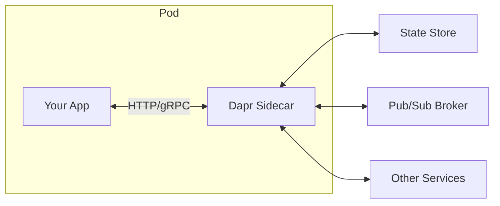
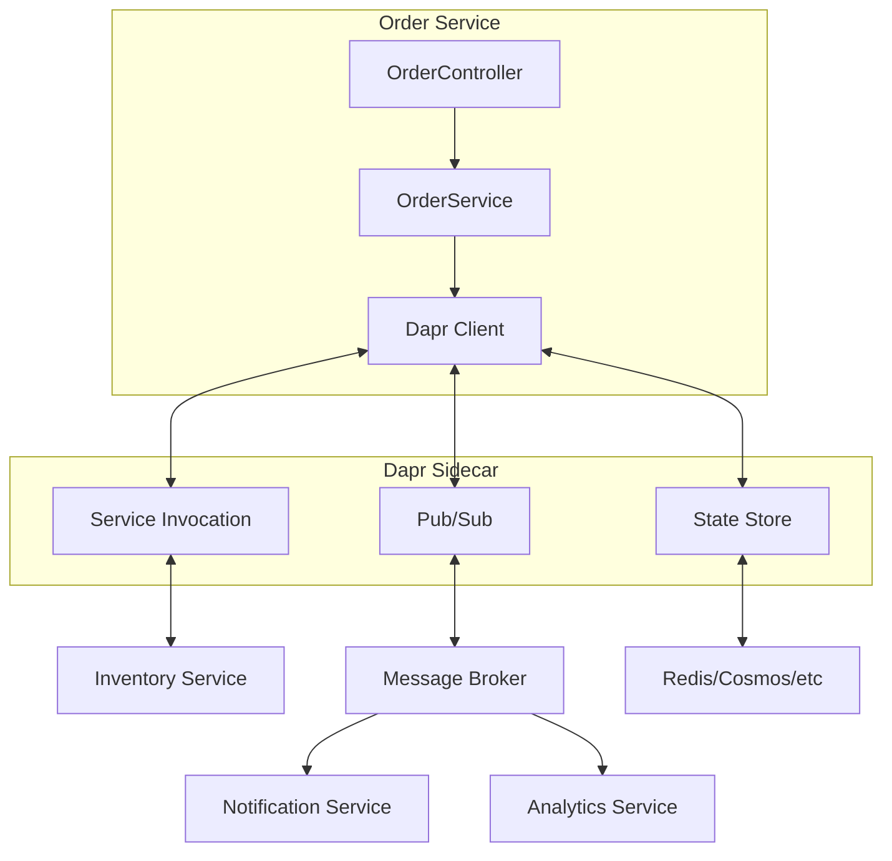

# How to Build Microservices with Dapr in .NET

Author: [nawazdhandala](https://www.github.com/nawazdhandala)

Tags: .NET, C#, Dapr, Microservices, Distributed Systems, Kubernetes, Service Mesh

Description: Learn how to build resilient microservices using Dapr with .NET. This guide covers service invocation, pub/sub messaging, state management, and observability patterns.

---

Dapr (Distributed Application Runtime) simplifies building microservices by providing building blocks for common challenges like service discovery, pub/sub messaging, state management, and observability. Instead of writing infrastructure code, you focus on business logic while Dapr handles the distributed systems complexity.

## What is Dapr?

Dapr runs as a sidecar alongside your application, exposing capabilities through HTTP or gRPC APIs. Your application does not need to know about the underlying infrastructure - whether you are using Redis, RabbitMQ, or Azure Service Bus, the API stays the same.



## Setting Up Dapr

### Installation

Install the Dapr CLI and initialize:

```bash
# Install Dapr CLI (macOS/Linux)
curl -fsSL https://raw.githubusercontent.com/dapr/cli/master/install/install.sh | bash

# Initialize Dapr locally (installs Redis, Zipkin for development)
dapr init

# Verify installation
dapr --version
```

### Project Setup

Create a new .NET Web API project and add the Dapr SDK:

```bash
dotnet new webapi -n OrderService
cd OrderService
dotnet add package Dapr.AspNetCore
```

Configure Dapr in your application:

```csharp
var builder = WebApplication.CreateBuilder(args);

// Add Dapr client for making calls to building blocks
builder.Services.AddDaprClient();

// Add controllers with Dapr support for pub/sub subscriptions
builder.Services.AddControllers().AddDapr();

var app = builder.Build();

// Enable CloudEvents for pub/sub
app.UseCloudEvents();

// Map subscription endpoints
app.MapSubscribeHandler();

app.MapControllers();
app.Run();
```

## Service-to-Service Invocation

Dapr provides service discovery and invocation without requiring service URLs or load balancers.

### Making Service Calls

```csharp
using Dapr.Client;

public class ProductService
{
    private readonly DaprClient _daprClient;
    private readonly ILogger<ProductService> _logger;

    public ProductService(DaprClient daprClient, ILogger<ProductService> logger)
    {
        _daprClient = daprClient;
        _logger = logger;
    }

    public async Task<Product?> GetProductAsync(int productId)
    {
        try
        {
            // Invoke the "inventory-service" app's GET endpoint
            // Dapr handles service discovery and load balancing
            var product = await _daprClient.InvokeMethodAsync<Product>(
                HttpMethod.Get,
                "inventory-service",  // App ID of the target service
                $"api/products/{productId}"
            );

            return product;
        }
        catch (InvocationException ex)
        {
            _logger.LogError(ex, "Failed to fetch product {ProductId}", productId);
            return null;
        }
    }

    public async Task<bool> ReserveInventoryAsync(int productId, int quantity)
    {
        var request = new ReserveInventoryRequest
        {
            ProductId = productId,
            Quantity = quantity
        };

        // POST request with JSON body
        var response = await _daprClient.InvokeMethodAsync<ReserveInventoryRequest, ReserveInventoryResponse>(
            HttpMethod.Post,
            "inventory-service",
            "api/inventory/reserve",
            request
        );

        return response.Success;
    }
}

public record ReserveInventoryRequest
{
    public int ProductId { get; init; }
    public int Quantity { get; init; }
}

public record ReserveInventoryResponse
{
    public bool Success { get; init; }
    public string? ReservationId { get; init; }
}
```

### Implementing the Target Service

```csharp
[ApiController]
[Route("api/[controller]")]
public class ProductsController : ControllerBase
{
    private readonly ProductRepository _repository;

    public ProductsController(ProductRepository repository)
    {
        _repository = repository;
    }

    [HttpGet("{id}")]
    public async Task<ActionResult<Product>> GetProduct(int id)
    {
        var product = await _repository.GetByIdAsync(id);

        if (product is null)
        {
            return NotFound();
        }

        return Ok(product);
    }
}
```

## Publish/Subscribe Messaging

Dapr's pub/sub building block enables event-driven communication between services.

### Configure Pub/Sub Component

Create a component file `components/pubsub.yaml`:

```yaml
apiVersion: dapr.io/v1alpha1
kind: Component
metadata:
  name: order-pubsub
spec:
  type: pubsub.redis
  version: v1
  metadata:
    - name: redisHost
      value: localhost:6379
    - name: redisPassword
      value: ""
```

### Publishing Events

```csharp
public class OrderService
{
    private readonly DaprClient _daprClient;
    private readonly OrderRepository _repository;

    public OrderService(DaprClient daprClient, OrderRepository repository)
    {
        _daprClient = daprClient;
        _repository = repository;
    }

    public async Task<Order> CreateOrderAsync(CreateOrderRequest request)
    {
        // Create the order in database
        var order = new Order
        {
            Id = Guid.NewGuid(),
            CustomerId = request.CustomerId,
            Items = request.Items,
            TotalAmount = request.Items.Sum(i => i.Price * i.Quantity),
            Status = OrderStatus.Created,
            CreatedAt = DateTime.UtcNow
        };

        await _repository.SaveAsync(order);

        // Publish event for other services to react
        var orderCreatedEvent = new OrderCreatedEvent
        {
            OrderId = order.Id,
            CustomerId = order.CustomerId,
            TotalAmount = order.TotalAmount,
            Items = order.Items.Select(i => new OrderItemEvent
            {
                ProductId = i.ProductId,
                Quantity = i.Quantity
            }).ToList(),
            CreatedAt = order.CreatedAt
        };

        await _daprClient.PublishEventAsync(
            "order-pubsub",     // Pub/sub component name
            "orders",           // Topic name
            orderCreatedEvent
        );

        return order;
    }
}

// Event models
public record OrderCreatedEvent
{
    public Guid OrderId { get; init; }
    public string CustomerId { get; init; } = string.Empty;
    public decimal TotalAmount { get; init; }
    public List<OrderItemEvent> Items { get; init; } = new();
    public DateTime CreatedAt { get; init; }
}

public record OrderItemEvent
{
    public int ProductId { get; init; }
    public int Quantity { get; init; }
}
```

### Subscribing to Events

```csharp
[ApiController]
public class OrderEventsController : ControllerBase
{
    private readonly ILogger<OrderEventsController> _logger;
    private readonly InventoryService _inventoryService;

    public OrderEventsController(
        ILogger<OrderEventsController> logger,
        InventoryService inventoryService)
    {
        _logger = logger;
        _inventoryService = inventoryService;
    }

    // Dapr calls this endpoint when messages arrive on the "orders" topic
    [Topic("order-pubsub", "orders")]
    [HttpPost("events/orders")]
    public async Task<ActionResult> HandleOrderCreated(OrderCreatedEvent orderEvent)
    {
        _logger.LogInformation(
            "Processing order {OrderId} with {ItemCount} items",
            orderEvent.OrderId,
            orderEvent.Items.Count);

        try
        {
            // Reserve inventory for each item
            foreach (var item in orderEvent.Items)
            {
                await _inventoryService.ReserveAsync(item.ProductId, item.Quantity);
            }

            return Ok();
        }
        catch (Exception ex)
        {
            _logger.LogError(ex, "Failed to process order {OrderId}", orderEvent.OrderId);

            // Return error to trigger retry
            return StatusCode(500);
        }
    }
}
```

## State Management

Dapr provides a simple key-value state API that works with various backends.

### Configure State Store

Create `components/statestore.yaml`:

```yaml
apiVersion: dapr.io/v1alpha1
kind: Component
metadata:
  name: statestore
spec:
  type: state.redis
  version: v1
  metadata:
    - name: redisHost
      value: localhost:6379
    - name: redisPassword
      value: ""
```

### Using the State Store

```csharp
public class ShoppingCartService
{
    private readonly DaprClient _daprClient;
    private const string StoreName = "statestore";

    public ShoppingCartService(DaprClient daprClient)
    {
        _daprClient = daprClient;
    }

    public async Task<ShoppingCart> GetCartAsync(string userId)
    {
        // Retrieve cart from state store
        var cart = await _daprClient.GetStateAsync<ShoppingCart>(StoreName, $"cart-{userId}");

        return cart ?? new ShoppingCart { UserId = userId, Items = new() };
    }

    public async Task AddItemAsync(string userId, CartItem item)
    {
        var cart = await GetCartAsync(userId);

        // Check if item already exists
        var existingItem = cart.Items.FirstOrDefault(i => i.ProductId == item.ProductId);

        if (existingItem is not null)
        {
            existingItem.Quantity += item.Quantity;
        }
        else
        {
            cart.Items.Add(item);
        }

        cart.UpdatedAt = DateTime.UtcNow;

        // Save with optimistic concurrency using ETags
        await _daprClient.SaveStateAsync(StoreName, $"cart-{userId}", cart);
    }

    public async Task<bool> UpdateCartWithConcurrencyAsync(string userId, ShoppingCart cart)
    {
        try
        {
            // Get current state with ETag
            var (currentCart, etag) = await _daprClient.GetStateAndETagAsync<ShoppingCart>(
                StoreName,
                $"cart-{userId}");

            // Save with ETag for optimistic concurrency
            var success = await _daprClient.TrySaveStateAsync(
                StoreName,
                $"cart-{userId}",
                cart,
                etag);

            return success;
        }
        catch (Exception)
        {
            return false;
        }
    }

    public async Task ClearCartAsync(string userId)
    {
        await _daprClient.DeleteStateAsync(StoreName, $"cart-{userId}");
    }
}

public class ShoppingCart
{
    public string UserId { get; set; } = string.Empty;
    public List<CartItem> Items { get; set; } = new();
    public DateTime UpdatedAt { get; set; }
}

public class CartItem
{
    public int ProductId { get; set; }
    public string ProductName { get; set; } = string.Empty;
    public decimal Price { get; set; }
    public int Quantity { get; set; }
}
```

## Running with Dapr

### Local Development

Run your service with the Dapr sidecar:

```bash
# Run the order service with Dapr
dapr run --app-id order-service \
         --app-port 5000 \
         --dapr-http-port 3500 \
         --components-path ./components \
         -- dotnet run

# Run the inventory service
dapr run --app-id inventory-service \
         --app-port 5001 \
         --dapr-http-port 3501 \
         --components-path ./components \
         -- dotnet run
```

### Kubernetes Deployment

Deploy to Kubernetes with Dapr annotations:

```yaml
apiVersion: apps/v1
kind: Deployment
metadata:
  name: order-service
spec:
  replicas: 3
  selector:
    matchLabels:
      app: order-service
  template:
    metadata:
      labels:
        app: order-service
      annotations:
        dapr.io/enabled: "true"
        dapr.io/app-id: "order-service"
        dapr.io/app-port: "80"
        dapr.io/enable-api-logging: "true"
    spec:
      containers:
        - name: order-service
          image: myregistry/order-service:latest
          ports:
            - containerPort: 80
          env:
            - name: ASPNETCORE_URLS
              value: "http://+:80"
```

## Service Architecture Overview



## Error Handling and Resilience

Dapr provides built-in resiliency policies:

```yaml
# components/resiliency.yaml
apiVersion: dapr.io/v1alpha1
kind: Resiliency
metadata:
  name: default-resiliency
spec:
  policies:
    retries:
      serviceRetry:
        policy: constant
        maxRetries: 3
        duration: 1s
    circuitBreakers:
      serviceCircuitBreaker:
        maxRequests: 10
        timeout: 30s
        trip: consecutiveFailures >= 5
  targets:
    apps:
      inventory-service:
        retry: serviceRetry
        circuitBreaker: serviceCircuitBreaker
```

Handle failures gracefully in your code:

```csharp
public async Task<OrderResult> ProcessOrderAsync(CreateOrderRequest request)
{
    try
    {
        // Check inventory via Dapr service invocation
        var available = await _productService.CheckAvailabilityAsync(
            request.Items.Select(i => i.ProductId).ToList());

        if (!available)
        {
            return OrderResult.Failed("Some items are not available");
        }

        // Create order and publish event
        var order = await _orderService.CreateOrderAsync(request);

        return OrderResult.Success(order);
    }
    catch (DaprException ex) when (ex.InnerException is HttpRequestException)
    {
        _logger.LogWarning("Service communication failed, will retry");
        throw; // Let Dapr handle retry
    }
    catch (Exception ex)
    {
        _logger.LogError(ex, "Order processing failed");
        return OrderResult.Failed("An error occurred processing your order");
    }
}
```

## Summary

Dapr simplifies microservices development by providing consistent APIs for common distributed systems patterns:

| Building Block | Use Case | .NET Integration |
|----------------|----------|------------------|
| **Service Invocation** | Service-to-service calls | `DaprClient.InvokeMethodAsync` |
| **Pub/Sub** | Event-driven messaging | `[Topic]` attribute, `PublishEventAsync` |
| **State Management** | Key-value storage | `GetStateAsync`, `SaveStateAsync` |
| **Bindings** | External system integration | Input/Output bindings |
| **Actors** | Stateful, single-threaded units | Dapr.Actors SDK |

Dapr lets you swap infrastructure components without changing code. Whether you deploy to Kubernetes, use cloud services, or run locally, your application code remains the same. This portability and the reduction in boilerplate code make Dapr a practical choice for building distributed .NET applications.
