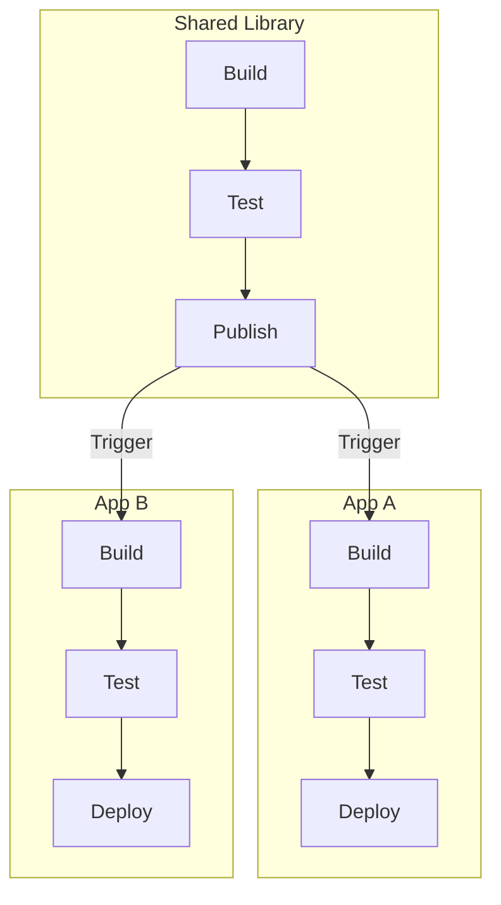

# How to Build Multi-Project Pipelines in GitLab CI

Author: [nawazdhandala](https://www.github.com/nawazdhandala)

Tags: GitLab CI, Multi-Project, Pipelines, Microservices, CI/CD, DevOps

Description: Learn how to build multi-project pipelines in GitLab CI to orchestrate builds across multiple repositories, coordinate microservice deployments, and manage complex CI/CD workflows.

---

Modern applications rarely live in a single repository. Microservices, shared libraries, infrastructure code, and deployment configurations often span multiple projects. Multi-project pipelines let you coordinate these pieces, triggering builds in one project from another. This guide shows you how to connect your GitLab projects into cohesive delivery pipelines.

## Understanding Multi-Project Pipelines

Multi-project pipelines create relationships between pipelines in different repositories. A pipeline in Project A can trigger a pipeline in Project B, wait for it to complete, and pass variables and artifacts between them.

Common use cases include:
- Deploying after a shared library updates
- Running integration tests across microservices
- Coordinating infrastructure and application deployments
- Building mobile apps after API changes

## Basic Trigger Configuration

Use the `trigger` keyword to start a pipeline in another project.

```yaml
# In the upstream project (e.g., shared-library)
stages:
  - build
  - test
  - trigger

build:
  stage: build
  script:
    - npm run build

test:
  stage: test
  script:
    - npm test

# Trigger dependent projects
trigger-app-a:
  stage: trigger
  trigger:
    project: team/app-a
    branch: main
  only:
    - main

trigger-app-b:
  stage: trigger
  trigger:
    project: team/app-b
    branch: main
  only:
    - main
```

When the library pipeline completes, it triggers pipelines in both dependent applications.

## Passing Variables Downstream

Share information between pipelines using variables.

```yaml
# Upstream project
trigger-deployment:
  stage: trigger
  trigger:
    project: ops/deployment
    branch: main
  variables:
    UPSTREAM_PROJECT: ${CI_PROJECT_PATH}
    UPSTREAM_SHA: ${CI_COMMIT_SHA}
    UPSTREAM_REF: ${CI_COMMIT_REF_NAME}
    ARTIFACT_VERSION: "1.2.3"
```

```yaml
# Downstream project (ops/deployment)
deploy:
  stage: deploy
  script:
    - echo "Deploying ${ARTIFACT_VERSION} from ${UPSTREAM_PROJECT}"
    - echo "Commit: ${UPSTREAM_SHA}"
    - ./deploy.sh ${ARTIFACT_VERSION}
  rules:
    # Only run when triggered by upstream
    - if: $CI_PIPELINE_SOURCE == "pipeline"
```

## Multi-Project Flow

Here's how a multi-project pipeline flows:



## Waiting for Downstream Pipelines

By default, the trigger job succeeds immediately. Use `strategy: depend` to wait for the downstream pipeline.

```yaml
trigger-and-wait:
  stage: trigger
  trigger:
    project: team/api
    branch: main
    strategy: depend  # Wait for downstream pipeline to complete
  variables:
    DEPLOY_ENV: staging
```

Now the upstream pipeline waits and reflects the downstream pipeline's status.

## Mirroring Status

The `strategy: depend` option mirrors the downstream pipeline status:

```yaml
integration-tests:
  stage: test
  trigger:
    project: team/integration-tests
    strategy: depend
  # Upstream job status matches downstream pipeline status
```

If the integration tests fail, this job fails, blocking subsequent stages.

## Downloading Artifacts Across Projects

Access artifacts from upstream pipelines.

```yaml
# Downstream project
use-upstream-artifacts:
  stage: build
  script:
    # Download artifacts using the job token
    - 'curl --header "JOB-TOKEN: ${CI_JOB_TOKEN}" -o artifacts.zip "${CI_API_V4_URL}/projects/${UPSTREAM_PROJECT_ID}/jobs/artifacts/${UPSTREAM_REF}/download?job=build"'
    - unzip artifacts.zip
    - ./use-artifacts.sh
  rules:
    - if: $CI_PIPELINE_SOURCE == "pipeline"
```

For more control, use the `needs` keyword with project artifacts (GitLab 14.0+):

```yaml
# This requires the upstream project to explicitly allow artifact sharing
downstream-job:
  stage: build
  needs:
    - project: team/shared-library
      job: build
      ref: main
      artifacts: true
  script:
    - ls -la  # Artifacts are available here
```

## Multi-Project with Microservices

Coordinate deployments across multiple services.

```yaml
# In the orchestrator project
stages:
  - deploy-infrastructure
  - deploy-services
  - verify

deploy-database:
  stage: deploy-infrastructure
  trigger:
    project: ops/database-migrations
    strategy: depend
  variables:
    MIGRATION_VERSION: ${CI_COMMIT_SHA}

deploy-api:
  stage: deploy-services
  trigger:
    project: team/api-service
    strategy: depend
  variables:
    API_VERSION: ${API_VERSION}
  needs:
    - deploy-database

deploy-web:
  stage: deploy-services
  trigger:
    project: team/web-frontend
    strategy: depend
  variables:
    WEB_VERSION: ${WEB_VERSION}
  needs:
    - deploy-database

deploy-worker:
  stage: deploy-services
  trigger:
    project: team/background-worker
    strategy: depend
  variables:
    WORKER_VERSION: ${WORKER_VERSION}
  needs:
    - deploy-database

verify-deployment:
  stage: verify
  script:
    - ./run-smoke-tests.sh
  needs:
    - deploy-api
    - deploy-web
    - deploy-worker
```

## Conditional Multi-Project Triggers

Trigger different projects based on conditions.

```yaml
trigger-staging:
  stage: trigger
  trigger:
    project: ops/deployment
    branch: staging
  variables:
    ENVIRONMENT: staging
  rules:
    - if: $CI_COMMIT_BRANCH == "develop"

trigger-production:
  stage: trigger
  trigger:
    project: ops/deployment
    branch: production
  variables:
    ENVIRONMENT: production
  rules:
    - if: $CI_COMMIT_TAG =~ /^v\d+\.\d+\.\d+$/
  when: manual
```

## Matrix Multi-Project Triggers

Trigger the same project with different configurations.

```yaml
deploy-regions:
  stage: deploy
  parallel:
    matrix:
      - REGION: ["us-east-1", "eu-west-1", "ap-southeast-1"]
  trigger:
    project: ops/regional-deployment
    strategy: depend
  variables:
    DEPLOY_REGION: ${REGION}
    APP_VERSION: ${CI_COMMIT_SHA}
```

## Bidirectional Communication

Set up projects that communicate both ways.

```yaml
# Project A triggers B and waits
trigger-b:
  stage: external
  trigger:
    project: team/project-b
    strategy: depend
  variables:
    CALLBACK_PROJECT: ${CI_PROJECT_ID}
    CALLBACK_REF: ${CI_COMMIT_SHA}
```

```yaml
# Project B can trigger back to A if needed
notify-upstream:
  stage: notify
  trigger:
    project: team/project-a
  variables:
    DOWNSTREAM_STATUS: "complete"
    DOWNSTREAM_SHA: ${CI_COMMIT_SHA}
  rules:
    - if: $CALLBACK_PROJECT
```

## Handling Failures

Manage failures in multi-project pipelines.

```yaml
trigger-critical:
  trigger:
    project: team/critical-service
    strategy: depend
  # Allow manual retry if downstream fails
  retry:
    max: 2
    when:
      - unknown_failure
      - runner_system_failure

trigger-optional:
  trigger:
    project: team/optional-service
    strategy: depend
  # Don't block on optional service failures
  allow_failure: true
```

## Security and Permissions

Control who can trigger downstream pipelines.

The triggering user must have at least Developer access to the downstream project. For automated triggers, create a project access token:

```yaml
# Using a project access token for cross-project triggers
trigger-secured:
  stage: trigger
  script:
    - |
      curl --request POST \
        --header "PRIVATE-TOKEN: ${DOWNSTREAM_TOKEN}" \
        --form "ref=main" \
        --form "variables[VERSION]=${CI_COMMIT_SHA}" \
        "${CI_API_V4_URL}/projects/team%2Fdownstream/pipeline"
  rules:
    - if: $CI_COMMIT_BRANCH == "main"
```

## Monitoring Multi-Project Pipelines

Track pipeline relationships in the UI.

Navigate to the pipeline graph view to see downstream pipelines as linked nodes. You can click through to the downstream pipeline for details.

For programmatic monitoring:

```yaml
check-downstream:
  script:
    - |
      # Get downstream pipeline status via API
      STATUS=$(curl --silent --header "PRIVATE-TOKEN: ${GITLAB_TOKEN}" \
        "${CI_API_V4_URL}/projects/team%2Fdownstream/pipelines?ref=main&per_page=1" | \
        jq -r '.[0].status')
      echo "Downstream status: ${STATUS}"
```

## Debugging Multi-Project Issues

When triggers don't work as expected:

```yaml
debug-trigger:
  stage: trigger
  script:
    # Print relevant information
    - echo "Project: ${CI_PROJECT_PATH}"
    - echo "Token available: $(test -n "$CI_JOB_TOKEN" && echo yes || echo no)"
    - |
      # Test API access to downstream project
      curl --silent --header "JOB-TOKEN: ${CI_JOB_TOKEN}" \
        "${CI_API_V4_URL}/projects/team%2Fdownstream" | jq '.path_with_namespace'
```

Common issues:
- **Permission denied**: Check the user has access to downstream project
- **Project not found**: Verify the project path and namespace
- **Variables not passed**: Variables must be explicitly listed in trigger job

---

Multi-project pipelines connect your distributed codebase into a coherent delivery system. Start with simple triggers between related projects, then add status mirroring and artifact sharing as your needs grow. The key is designing clear interfaces between projects and handling cross-project failures gracefully.
