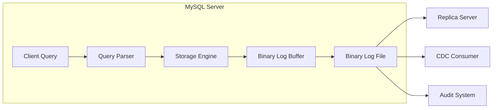
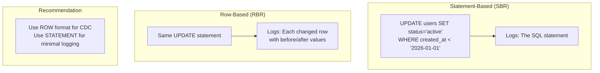
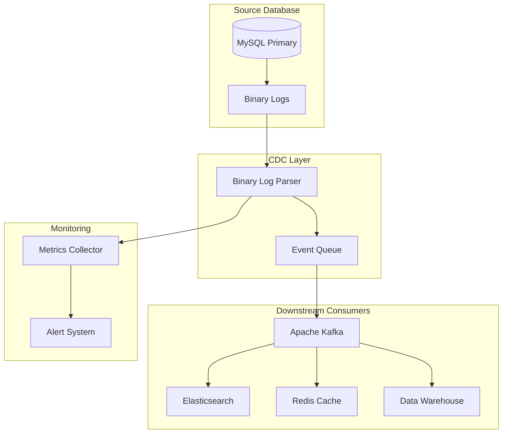
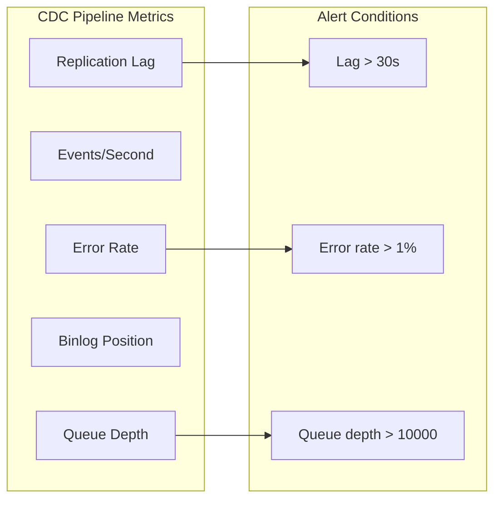

# How to Implement MySQL Binary Log Parsing

By [Nawaz Dhandala](https://github.com/nawazdhandala)

Tags: MySQL, Binary Logs, CDC, Change Data Capture, Database Replication, Auditing, mysqlbinlog, Python, Go, Data Streaming

Description: A comprehensive guide to implementing MySQL binary log parsing for change data capture (CDC), auditing, and real-time data streaming. Covers the mysqlbinlog tool, row-based vs statement-based formats, and parsing with popular libraries.

---

> "The binary log contains a record of all changes to the databases, both data and structure. It is the source of truth for replication and point-in-time recovery." - MySQL Documentation

MySQL binary logs are one of the most powerful yet underutilized features for building robust data pipelines. Whether you need to replicate data across systems, build audit trails, or implement real-time streaming architectures, understanding how to parse binary logs is essential. This guide walks you through everything from basic concepts to production-ready implementations.

---

## Table of Contents

1. Understanding Binary Logs
2. Binary Log Formats: Row-Based vs Statement-Based
3. Using the mysqlbinlog Tool
4. Parsing Binary Logs with Python
5. Parsing Binary Logs with Go
6. Change Data Capture (CDC) Architecture
7. Auditing and Compliance Use Cases
8. Production Considerations
9. Monitoring Your Binary Log Pipeline

---

## 1. Understanding Binary Logs

Binary logs (binlogs) record all changes made to MySQL databases. They serve three primary purposes:

1. **Replication**: Streaming changes from master to replica servers
2. **Point-in-time Recovery**: Replaying changes after restoring from a backup
3. **Change Data Capture**: Capturing database changes for downstream systems

### How Binary Logs Work



When a transaction commits, MySQL writes the changes to the binary log before acknowledging the commit. This ensures durability and allows replicas to stay synchronized.

### Enabling Binary Logs

To enable binary logging, add these settings to your MySQL configuration:

```ini
# /etc/mysql/mysql.conf.d/mysqld.cnf

[mysqld]
# Enable binary logging with a unique server ID
server-id = 1
log_bin = /var/lib/mysql/mysql-bin

# Set the binary log format (ROW recommended for CDC)
binlog_format = ROW

# How long to keep binary logs (in seconds, 7 days here)
binlog_expire_logs_seconds = 604800

# Maximum size of a single binary log file
max_binlog_size = 100M

# For row-based logging, include full row images
binlog_row_image = FULL
```

Verify binary logging is enabled:

```sql
-- Check if binary logging is enabled
SHOW VARIABLES LIKE 'log_bin';
-- Expected: log_bin = ON

-- Show current binary log files
SHOW BINARY LOGS;

-- Show the current binary log position
SHOW MASTER STATUS;
```

---

## 2. Binary Log Formats: Row-Based vs Statement-Based

MySQL supports three binary log formats, each with distinct characteristics:

### Statement-Based Replication (SBR)

Records the actual SQL statements that modify data.

```sql
-- This statement is logged as-is in statement-based format
UPDATE users SET last_login = NOW() WHERE user_id = 123;
```

**Pros:**
- Smaller log files
- Human-readable when decoded

**Cons:**
- Non-deterministic functions (NOW(), RAND()) can cause replica drift
- Requires execution context (variables, session state)

### Row-Based Replication (RBR)

Records the actual row changes (before and after images).

```sql
-- In row-based format, the actual row data is logged:
-- Before: user_id=123, last_login='2026-01-26 10:00:00'
-- After:  user_id=123, last_login='2026-01-27 14:30:00'
```

**Pros:**
- Deterministic - always produces the same result
- Better for CDC - you see exactly what changed
- Safer for complex queries

**Cons:**
- Larger log files
- Not human-readable in raw form

### Mixed Format

MySQL automatically chooses between statement and row-based logging depending on the query.

### Format Comparison



**For CDC and auditing, always use ROW format** - it provides complete visibility into what data changed.

---

## 3. Using the mysqlbinlog Tool

The `mysqlbinlog` utility is the standard tool for reading and processing binary logs.

### Basic Usage

```bash
# Read a binary log file and output human-readable events
mysqlbinlog /var/lib/mysql/mysql-bin.000001

# Read from a specific position
mysqlbinlog --start-position=4 /var/lib/mysql/mysql-bin.000001

# Read events within a time range
mysqlbinlog --start-datetime="2026-01-27 00:00:00" \
            --stop-datetime="2026-01-27 23:59:59" \
            /var/lib/mysql/mysql-bin.000001

# Decode row events (required for ROW format)
mysqlbinlog --base64-output=DECODE-ROWS -v \
            /var/lib/mysql/mysql-bin.000001
```

### Reading from a Remote Server

```bash
# Connect to a remote MySQL server and stream binary logs
# This is useful for building CDC pipelines
mysqlbinlog --read-from-remote-server \
            --host=mysql-primary.example.com \
            --port=3306 \
            --user=replication_user \
            --password=secret \
            --raw \
            mysql-bin.000001
```

### Filtering Specific Databases

```bash
# Only show events for a specific database
mysqlbinlog --database=orders /var/lib/mysql/mysql-bin.000001

# Output SQL that can be replayed
mysqlbinlog --database=orders \
            --base64-output=DECODE-ROWS \
            /var/lib/mysql/mysql-bin.000001 | mysql -u admin -p
```

### Sample Output Analysis

```bash
# Example output from mysqlbinlog with row format
# At position 1234
# Table: orders.order_items
# Event type: WRITE_ROWS (INSERT)
# Columns: id, order_id, product_id, quantity, price
# Row values: 1001, 500, 'PROD-123', 2, 29.99
```

---

## 4. Parsing Binary Logs with Python

For programmatic access, the `mysql-replication` library provides an excellent Python interface.

### Installation

```bash
pip install mysql-replication
```

### Basic Binary Log Consumer

```python
#!/usr/bin/env python3
"""
MySQL Binary Log Parser - Basic Example

This script connects to a MySQL server and streams binary log events
in real-time, demonstrating the foundation for CDC pipelines.
"""

from pymysqlreplication import BinLogStreamReader
from pymysqlreplication.row_event import (
    WriteRowsEvent,
    UpdateRowsEvent,
    DeleteRowsEvent,
)

# MySQL connection settings
# Use a dedicated replication user with REPLICATION SLAVE privilege
MYSQL_SETTINGS = {
    "host": "localhost",
    "port": 3306,
    "user": "replication_user",
    "passwd": "secure_password",
}

def process_binlog_events():
    """
    Stream and process binary log events from MySQL.

    This function creates a connection that mimics a MySQL replica,
    receiving events as they occur on the primary server.
    """

    # Create a binary log stream reader
    # only_events: Filter for row change events only
    # blocking: Wait for new events when caught up
    # resume_stream: Continue from last position on reconnect
    stream = BinLogStreamReader(
        connection_settings=MYSQL_SETTINGS,
        server_id=100,  # Unique ID for this consumer
        only_events=[WriteRowsEvent, UpdateRowsEvent, DeleteRowsEvent],
        blocking=True,
        resume_stream=True,
    )

    print("Connected to MySQL binary log stream...")
    print("Waiting for events (Ctrl+C to stop)\n")

    try:
        for binlog_event in stream:
            # Extract event metadata
            schema = binlog_event.schema  # Database name
            table = binlog_event.table    # Table name

            # Process each row in the event
            for row in binlog_event.rows:
                if isinstance(binlog_event, WriteRowsEvent):
                    # INSERT event - row["values"] contains the new row
                    print(f"INSERT into {schema}.{table}")
                    print(f"  Values: {row['values']}")

                elif isinstance(binlog_event, UpdateRowsEvent):
                    # UPDATE event - has both before and after images
                    print(f"UPDATE in {schema}.{table}")
                    print(f"  Before: {row['before_values']}")
                    print(f"  After:  {row['after_values']}")

                elif isinstance(binlog_event, DeleteRowsEvent):
                    # DELETE event - row["values"] contains the deleted row
                    print(f"DELETE from {schema}.{table}")
                    print(f"  Values: {row['values']}")

                print()  # Blank line between events

    except KeyboardInterrupt:
        print("\nStopping binary log stream...")
    finally:
        stream.close()


if __name__ == "__main__":
    process_binlog_events()
```

### Advanced: CDC Pipeline with Position Tracking

```python
#!/usr/bin/env python3
"""
Production CDC Pipeline with Position Tracking

This implementation includes:
- Persistent position tracking for crash recovery
- Filtering by database and table
- Graceful shutdown handling
- Event batching for efficiency
"""

import json
import signal
import sys
from datetime import datetime
from pathlib import Path
from typing import Any, Dict, List, Optional

from pymysqlreplication import BinLogStreamReader
from pymysqlreplication.row_event import (
    WriteRowsEvent,
    UpdateRowsEvent,
    DeleteRowsEvent,
)

# Configuration
MYSQL_SETTINGS = {
    "host": "localhost",
    "port": 3306,
    "user": "replication_user",
    "passwd": "secure_password",
}

# Track position in this file for crash recovery
POSITION_FILE = Path("binlog_position.json")

# Only capture changes from these tables
WATCHED_TABLES = {
    "orders": ["orders", "order_items", "payments"],
    "inventory": ["products", "stock_levels"],
}


class BinlogPosition:
    """
    Manages binary log position persistence.

    Saves the current position to disk so the consumer can resume
    from where it left off after a restart or crash.
    """

    def __init__(self, position_file: Path):
        self.position_file = position_file
        self.log_file: Optional[str] = None
        self.log_pos: Optional[int] = None
        self._load()

    def _load(self) -> None:
        """Load position from disk if available."""
        if self.position_file.exists():
            data = json.loads(self.position_file.read_text())
            self.log_file = data.get("log_file")
            self.log_pos = data.get("log_pos")
            print(f"Resuming from position: {self.log_file}:{self.log_pos}")

    def save(self, log_file: str, log_pos: int) -> None:
        """
        Persist the current position to disk.

        Call this after successfully processing events to enable
        crash recovery without data loss or duplication.
        """
        self.log_file = log_file
        self.log_pos = log_pos
        self.position_file.write_text(json.dumps({
            "log_file": log_file,
            "log_pos": log_pos,
            "updated_at": datetime.utcnow().isoformat(),
        }))

    def get_stream_args(self) -> Dict[str, Any]:
        """Return arguments for BinLogStreamReader."""
        if self.log_file and self.log_pos:
            return {
                "log_file": self.log_file,
                "log_pos": self.log_pos,
                "resume_stream": True,
            }
        return {"resume_stream": False}


class CDCEvent:
    """Represents a single change data capture event."""

    def __init__(
        self,
        operation: str,
        schema: str,
        table: str,
        data: Dict[str, Any],
        old_data: Optional[Dict[str, Any]] = None,
        timestamp: Optional[datetime] = None,
    ):
        self.operation = operation  # INSERT, UPDATE, DELETE
        self.schema = schema
        self.table = table
        self.data = data
        self.old_data = old_data
        self.timestamp = timestamp or datetime.utcnow()

    def to_dict(self) -> Dict[str, Any]:
        """Convert to dictionary for serialization."""
        return {
            "operation": self.operation,
            "schema": self.schema,
            "table": self.table,
            "data": self.data,
            "old_data": self.old_data,
            "timestamp": self.timestamp.isoformat(),
        }


class CDCPipeline:
    """
    Production-ready CDC pipeline with batching and position tracking.
    """

    def __init__(
        self,
        mysql_settings: Dict[str, Any],
        watched_tables: Dict[str, List[str]],
        batch_size: int = 100,
    ):
        self.mysql_settings = mysql_settings
        self.watched_tables = watched_tables
        self.batch_size = batch_size
        self.position = BinlogPosition(POSITION_FILE)
        self.stream: Optional[BinLogStreamReader] = None
        self.running = False
        self.event_batch: List[CDCEvent] = []

        # Set up graceful shutdown
        signal.signal(signal.SIGINT, self._shutdown_handler)
        signal.signal(signal.SIGTERM, self._shutdown_handler)

    def _shutdown_handler(self, signum, frame) -> None:
        """Handle shutdown signals gracefully."""
        print("\nReceived shutdown signal, finishing current batch...")
        self.running = False

    def _should_process_event(self, schema: str, table: str) -> bool:
        """Check if this table should be processed."""
        if schema in self.watched_tables:
            return table in self.watched_tables[schema]
        return False

    def _process_batch(self, log_file: str, log_pos: int) -> None:
        """
        Process a batch of events.

        In a real implementation, this would send events to:
        - A message queue (Kafka, RabbitMQ)
        - A data warehouse (BigQuery, Snowflake)
        - A search index (Elasticsearch)
        - A cache (Redis)
        """
        if not self.event_batch:
            return

        print(f"\nProcessing batch of {len(self.event_batch)} events...")

        for event in self.event_batch:
            # Replace this with your actual event handling logic
            print(f"  {event.operation} {event.schema}.{event.table}: "
                  f"{event.data.get('id', 'N/A')}")

        # After successful processing, save position
        self.position.save(log_file, log_pos)
        self.event_batch.clear()

        print(f"Saved position: {log_file}:{log_pos}")

    def run(self) -> None:
        """
        Main event loop - stream and process binary log events.
        """
        # Build stream arguments including resume position
        stream_args = {
            "connection_settings": self.mysql_settings,
            "server_id": 100,
            "only_events": [WriteRowsEvent, UpdateRowsEvent, DeleteRowsEvent],
            "blocking": True,
            **self.position.get_stream_args(),
        }

        self.stream = BinLogStreamReader(**stream_args)
        self.running = True

        print("CDC Pipeline started. Streaming binary log events...")
        print(f"Watching tables: {self.watched_tables}\n")

        try:
            for binlog_event in self.stream:
                if not self.running:
                    break

                schema = binlog_event.schema
                table = binlog_event.table

                # Skip events for tables we do not care about
                if not self._should_process_event(schema, table):
                    continue

                # Convert binary log event to CDC events
                for row in binlog_event.rows:
                    if isinstance(binlog_event, WriteRowsEvent):
                        event = CDCEvent(
                            operation="INSERT",
                            schema=schema,
                            table=table,
                            data=row["values"],
                        )
                    elif isinstance(binlog_event, UpdateRowsEvent):
                        event = CDCEvent(
                            operation="UPDATE",
                            schema=schema,
                            table=table,
                            data=row["after_values"],
                            old_data=row["before_values"],
                        )
                    elif isinstance(binlog_event, DeleteRowsEvent):
                        event = CDCEvent(
                            operation="DELETE",
                            schema=schema,
                            table=table,
                            data=row["values"],
                        )
                    else:
                        continue

                    self.event_batch.append(event)

                # Process batch when it reaches the target size
                if len(self.event_batch) >= self.batch_size:
                    self._process_batch(
                        self.stream.log_file,
                        self.stream.log_pos,
                    )

        finally:
            # Process any remaining events
            if self.event_batch and self.stream:
                self._process_batch(
                    self.stream.log_file,
                    self.stream.log_pos,
                )

            if self.stream:
                self.stream.close()

            print("CDC Pipeline stopped.")


if __name__ == "__main__":
    pipeline = CDCPipeline(
        mysql_settings=MYSQL_SETTINGS,
        watched_tables=WATCHED_TABLES,
        batch_size=100,
    )
    pipeline.run()
```

---

## 5. Parsing Binary Logs with Go

For high-performance applications, Go provides excellent libraries for binary log parsing.

### Using go-mysql Library

```go
// main.go
// MySQL Binary Log Parser in Go
//
// This example demonstrates using the go-mysql library to parse
// binary logs with high performance and low memory overhead.

package main

import (
	"context"
	"fmt"
	"log"
	"os"
	"os/signal"
	"syscall"

	"github.com/go-mysql-org/go-mysql/mysql"
	"github.com/go-mysql-org/go-mysql/replication"
)

// Config holds the MySQL connection configuration
type Config struct {
	Host     string
	Port     uint16
	User     string
	Password string
	ServerID uint32
}

// CDCHandler processes binary log events
type CDCHandler struct {
	// Add fields for your event processing logic
	// e.g., Kafka producer, database connection, etc.
}

// OnRow handles row change events (INSERT, UPDATE, DELETE)
func (h *CDCHandler) OnRow(e *replication.RowsEvent) error {
	// Get table metadata
	schema := string(e.Table.Schema)
	table := string(e.Table.Table)

	// Process based on event type
	switch e.Header.EventType {
	case replication.WRITE_ROWS_EVENTv1, replication.WRITE_ROWS_EVENTv2:
		// INSERT event
		for _, row := range e.Rows {
			fmt.Printf("INSERT into %s.%s: %v\n", schema, table, row)
		}

	case replication.UPDATE_ROWS_EVENTv1, replication.UPDATE_ROWS_EVENTv2:
		// UPDATE event - rows come in pairs (before, after)
		for i := 0; i < len(e.Rows); i += 2 {
			before := e.Rows[i]
			after := e.Rows[i+1]
			fmt.Printf("UPDATE in %s.%s:\n", schema, table)
			fmt.Printf("  Before: %v\n", before)
			fmt.Printf("  After:  %v\n", after)
		}

	case replication.DELETE_ROWS_EVENTv1, replication.DELETE_ROWS_EVENTv2:
		// DELETE event
		for _, row := range e.Rows {
			fmt.Printf("DELETE from %s.%s: %v\n", schema, table, row)
		}
	}

	return nil
}

func main() {
	// Configuration
	cfg := Config{
		Host:     "localhost",
		Port:     3306,
		User:     "replication_user",
		Password: "secure_password",
		ServerID: 100, // Unique ID for this consumer
	}

	// Create a binary log syncer configuration
	syncerCfg := replication.BinlogSyncerConfig{
		ServerID: cfg.ServerID,
		Flavor:   "mysql",
		Host:     cfg.Host,
		Port:     cfg.Port,
		User:     cfg.User,
		Password: cfg.Password,
	}

	// Create the syncer
	syncer := replication.NewBinlogSyncer(syncerCfg)
	defer syncer.Close()

	// Get the current binary log position
	// In production, load this from persistent storage
	pos := mysql.Position{
		Name: "mysql-bin.000001",
		Pos:  4, // Start from beginning
	}

	// Start streaming from the position
	streamer, err := syncer.StartSync(pos)
	if err != nil {
		log.Fatalf("Failed to start sync: %v", err)
	}

	// Set up signal handling for graceful shutdown
	ctx, cancel := context.WithCancel(context.Background())
	sigChan := make(chan os.Signal, 1)
	signal.Notify(sigChan, syscall.SIGINT, syscall.SIGTERM)

	go func() {
		<-sigChan
		fmt.Println("\nReceived shutdown signal...")
		cancel()
	}()

	handler := &CDCHandler{}

	fmt.Println("Starting binary log stream...")
	fmt.Printf("Position: %s:%d\n\n", pos.Name, pos.Pos)

	// Main event loop
	for {
		// Get the next event with context for cancellation
		ev, err := streamer.GetEvent(ctx)
		if err != nil {
			if ctx.Err() != nil {
				// Context cancelled - graceful shutdown
				break
			}
			log.Printf("Error getting event: %v", err)
			continue
		}

		// Process based on event type
		switch e := ev.Event.(type) {
		case *replication.RowsEvent:
			if err := handler.OnRow(e); err != nil {
				log.Printf("Error handling row event: %v", err)
			}

		case *replication.QueryEvent:
			// DDL events (CREATE, ALTER, DROP)
			query := string(e.Query)
			fmt.Printf("Query: %s\n", query)

		case *replication.XIDEvent:
			// Transaction commit - good place to save position
			fmt.Printf("Transaction committed (XID: %d)\n", e.XID)
		}
	}

	fmt.Println("Shutdown complete.")
}
```

### High-Performance Batch Processing

```go
// batch_processor.go
// High-performance batch processor for MySQL binary logs
//
// This implementation uses channels and worker pools for
// efficient parallel processing of CDC events.

package main

import (
	"context"
	"encoding/json"
	"fmt"
	"sync"
	"time"
)

// CDCEvent represents a change data capture event
type CDCEvent struct {
	Operation string                 `json:"operation"`
	Schema    string                 `json:"schema"`
	Table     string                 `json:"table"`
	Data      map[string]interface{} `json:"data"`
	OldData   map[string]interface{} `json:"old_data,omitempty"`
	Timestamp time.Time              `json:"timestamp"`
}

// BatchProcessor handles efficient batch processing of CDC events
type BatchProcessor struct {
	batchSize    int
	flushTimeout time.Duration
	eventChan    chan CDCEvent
	wg           sync.WaitGroup

	// Handler function for processing batches
	processBatch func([]CDCEvent) error
}

// NewBatchProcessor creates a new batch processor
func NewBatchProcessor(
	batchSize int,
	flushTimeout time.Duration,
	handler func([]CDCEvent) error,
) *BatchProcessor {
	return &BatchProcessor{
		batchSize:    batchSize,
		flushTimeout: flushTimeout,
		eventChan:    make(chan CDCEvent, batchSize*2),
		processBatch: handler,
	}
}

// Start begins the batch processing goroutine
func (bp *BatchProcessor) Start(ctx context.Context) {
	bp.wg.Add(1)
	go bp.processLoop(ctx)
}

// Submit adds an event to the processing queue
func (bp *BatchProcessor) Submit(event CDCEvent) {
	bp.eventChan <- event
}

// Wait blocks until all events are processed
func (bp *BatchProcessor) Wait() {
	close(bp.eventChan)
	bp.wg.Wait()
}

// processLoop is the main batch processing loop
func (bp *BatchProcessor) processLoop(ctx context.Context) {
	defer bp.wg.Done()

	batch := make([]CDCEvent, 0, bp.batchSize)
	timer := time.NewTimer(bp.flushTimeout)
	defer timer.Stop()

	flush := func() {
		if len(batch) == 0 {
			return
		}

		// Process the batch
		if err := bp.processBatch(batch); err != nil {
			fmt.Printf("Error processing batch: %v\n", err)
			// In production, implement retry logic here
		}

		// Reset the batch
		batch = batch[:0]
		timer.Reset(bp.flushTimeout)
	}

	for {
		select {
		case <-ctx.Done():
			// Flush remaining events on shutdown
			flush()
			return

		case event, ok := <-bp.eventChan:
			if !ok {
				// Channel closed, flush and exit
				flush()
				return
			}

			batch = append(batch, event)

			// Flush when batch is full
			if len(batch) >= bp.batchSize {
				flush()
			}

		case <-timer.C:
			// Flush on timeout even if batch is not full
			flush()
		}
	}
}

// Example batch handler that sends to stdout (replace with Kafka, etc.)
func exampleBatchHandler(events []CDCEvent) error {
	fmt.Printf("Processing batch of %d events:\n", len(events))

	for _, event := range events {
		data, _ := json.Marshal(event)
		fmt.Printf("  %s\n", data)
	}

	return nil
}

// Example usage
func exampleUsage() {
	ctx, cancel := context.WithCancel(context.Background())
	defer cancel()

	// Create processor with batch size of 100 and 5 second timeout
	processor := NewBatchProcessor(100, 5*time.Second, exampleBatchHandler)
	processor.Start(ctx)

	// Submit events (in practice, these come from the binlog stream)
	for i := 0; i < 250; i++ {
		processor.Submit(CDCEvent{
			Operation: "INSERT",
			Schema:    "orders",
			Table:     "order_items",
			Data: map[string]interface{}{
				"id":         i,
				"product_id": fmt.Sprintf("PROD-%d", i),
			},
			Timestamp: time.Now(),
		})
	}

	// Wait for processing to complete
	processor.Wait()
}
```

---

## 6. Change Data Capture (CDC) Architecture

CDC enables real-time data streaming from your MySQL database to other systems. Here is a production-ready architecture:



### Key Components

1. **Binary Log Parser**: Reads and decodes MySQL binary logs
2. **Event Queue**: Buffers events for reliable delivery (Kafka recommended)
3. **Consumers**: Process events for different use cases
4. **Position Tracker**: Maintains read position for crash recovery

### CDC Event Schema

Define a consistent event schema for all downstream consumers:

```json
{
  "$schema": "http://json-schema.org/draft-07/schema#",
  "title": "CDC Event",
  "type": "object",
  "required": ["id", "operation", "source", "timestamp", "data"],
  "properties": {
    "id": {
      "type": "string",
      "description": "Unique event identifier (UUID)"
    },
    "operation": {
      "type": "string",
      "enum": ["INSERT", "UPDATE", "DELETE"],
      "description": "Type of database operation"
    },
    "source": {
      "type": "object",
      "properties": {
        "database": { "type": "string" },
        "table": { "type": "string" },
        "binlog_file": { "type": "string" },
        "binlog_position": { "type": "integer" }
      }
    },
    "timestamp": {
      "type": "string",
      "format": "date-time",
      "description": "Event timestamp in ISO 8601 format"
    },
    "data": {
      "type": "object",
      "description": "Row data after the change"
    },
    "old_data": {
      "type": "object",
      "description": "Row data before the change (UPDATE/DELETE only)"
    }
  }
}
```

---

## 7. Auditing and Compliance Use Cases

Binary log parsing is invaluable for audit trails and compliance requirements.

### Audit Log Implementation

```python
#!/usr/bin/env python3
"""
Audit Log System using MySQL Binary Logs

This implementation creates a complete audit trail of all database
changes, suitable for compliance requirements like SOX, HIPAA, or GDPR.
"""

import hashlib
import json
from datetime import datetime
from typing import Any, Dict, Optional
from dataclasses import dataclass, asdict
import sqlite3  # Using SQLite for audit storage (use PostgreSQL in production)

from pymysqlreplication import BinLogStreamReader
from pymysqlreplication.row_event import (
    WriteRowsEvent,
    UpdateRowsEvent,
    DeleteRowsEvent,
)


@dataclass
class AuditRecord:
    """
    Represents a single audit log entry.

    Contains all information needed to reconstruct what changed,
    when it changed, and provide evidence for compliance audits.
    """
    id: str                          # Unique audit record ID
    timestamp: str                   # ISO 8601 timestamp
    database: str                    # Source database name
    table: str                       # Source table name
    operation: str                   # INSERT, UPDATE, DELETE
    primary_key: Optional[str]       # Primary key of affected row
    old_values: Optional[Dict]       # Previous values (UPDATE/DELETE)
    new_values: Optional[Dict]       # New values (INSERT/UPDATE)
    binlog_file: str                 # Source binary log file
    binlog_position: int             # Position in binary log
    checksum: str                    # SHA-256 checksum for integrity


class AuditLogger:
    """
    Audit logging system backed by binary log parsing.
    """

    def __init__(self, mysql_settings: Dict[str, Any], audit_db_path: str):
        self.mysql_settings = mysql_settings
        self.audit_db = sqlite3.connect(audit_db_path)
        self._init_audit_tables()

    def _init_audit_tables(self) -> None:
        """Create audit tables if they do not exist."""
        self.audit_db.execute("""
            CREATE TABLE IF NOT EXISTS audit_log (
                id TEXT PRIMARY KEY,
                timestamp TEXT NOT NULL,
                database_name TEXT NOT NULL,
                table_name TEXT NOT NULL,
                operation TEXT NOT NULL,
                primary_key TEXT,
                old_values TEXT,
                new_values TEXT,
                binlog_file TEXT NOT NULL,
                binlog_position INTEGER NOT NULL,
                checksum TEXT NOT NULL,
                created_at TEXT DEFAULT CURRENT_TIMESTAMP
            )
        """)

        # Index for efficient querying
        self.audit_db.execute("""
            CREATE INDEX IF NOT EXISTS idx_audit_timestamp
            ON audit_log(timestamp)
        """)
        self.audit_db.execute("""
            CREATE INDEX IF NOT EXISTS idx_audit_table
            ON audit_log(database_name, table_name)
        """)

        self.audit_db.commit()

    def _generate_checksum(self, record: AuditRecord) -> str:
        """
        Generate SHA-256 checksum for audit record integrity.

        This allows verification that audit records have not been
        tampered with after creation.
        """
        # Create deterministic string representation
        data = json.dumps({
            "timestamp": record.timestamp,
            "database": record.database,
            "table": record.table,
            "operation": record.operation,
            "old_values": record.old_values,
            "new_values": record.new_values,
        }, sort_keys=True)

        return hashlib.sha256(data.encode()).hexdigest()

    def _extract_primary_key(
        self,
        table: str,
        values: Dict[str, Any]
    ) -> Optional[str]:
        """
        Extract primary key from row values.

        In production, maintain a schema cache mapping tables to
        their primary key columns.
        """
        # Common primary key column names
        pk_columns = ["id", "uuid", f"{table}_id"]

        for col in pk_columns:
            if col in values:
                return str(values[col])

        return None

    def _create_audit_record(
        self,
        event_type: str,
        schema: str,
        table: str,
        old_values: Optional[Dict],
        new_values: Optional[Dict],
        binlog_file: str,
        binlog_position: int,
    ) -> AuditRecord:
        """Create an audit record from a binary log event."""

        # Determine primary key from available values
        pk_source = new_values or old_values or {}
        primary_key = self._extract_primary_key(table, pk_source)

        record = AuditRecord(
            id=hashlib.sha256(
                f"{binlog_file}:{binlog_position}:{datetime.utcnow().isoformat()}".encode()
            ).hexdigest()[:32],
            timestamp=datetime.utcnow().isoformat(),
            database=schema,
            table=table,
            operation=event_type,
            primary_key=primary_key,
            old_values=old_values,
            new_values=new_values,
            binlog_file=binlog_file,
            binlog_position=binlog_position,
            checksum="",  # Will be set below
        )

        record.checksum = self._generate_checksum(record)
        return record

    def _save_audit_record(self, record: AuditRecord) -> None:
        """Persist audit record to storage."""
        self.audit_db.execute("""
            INSERT INTO audit_log (
                id, timestamp, database_name, table_name, operation,
                primary_key, old_values, new_values, binlog_file,
                binlog_position, checksum
            ) VALUES (?, ?, ?, ?, ?, ?, ?, ?, ?, ?, ?)
        """, (
            record.id,
            record.timestamp,
            record.database,
            record.table,
            record.operation,
            record.primary_key,
            json.dumps(record.old_values) if record.old_values else None,
            json.dumps(record.new_values) if record.new_values else None,
            record.binlog_file,
            record.binlog_position,
            record.checksum,
        ))
        self.audit_db.commit()

    def run(self) -> None:
        """Main audit logging loop."""
        stream = BinLogStreamReader(
            connection_settings=self.mysql_settings,
            server_id=200,
            only_events=[WriteRowsEvent, UpdateRowsEvent, DeleteRowsEvent],
            blocking=True,
        )

        print("Audit logger started. Recording all database changes...")

        try:
            for event in stream:
                schema = event.schema
                table = event.table

                for row in event.rows:
                    if isinstance(event, WriteRowsEvent):
                        record = self._create_audit_record(
                            event_type="INSERT",
                            schema=schema,
                            table=table,
                            old_values=None,
                            new_values=row["values"],
                            binlog_file=stream.log_file,
                            binlog_position=stream.log_pos,
                        )
                    elif isinstance(event, UpdateRowsEvent):
                        record = self._create_audit_record(
                            event_type="UPDATE",
                            schema=schema,
                            table=table,
                            old_values=row["before_values"],
                            new_values=row["after_values"],
                            binlog_file=stream.log_file,
                            binlog_position=stream.log_pos,
                        )
                    elif isinstance(event, DeleteRowsEvent):
                        record = self._create_audit_record(
                            event_type="DELETE",
                            schema=schema,
                            table=table,
                            old_values=row["values"],
                            new_values=None,
                            binlog_file=stream.log_file,
                            binlog_position=stream.log_pos,
                        )
                    else:
                        continue

                    self._save_audit_record(record)
                    print(f"Audit: {record.operation} {record.database}.{record.table} "
                          f"[{record.primary_key}]")

        except KeyboardInterrupt:
            print("\nShutting down audit logger...")
        finally:
            stream.close()


if __name__ == "__main__":
    MYSQL_SETTINGS = {
        "host": "localhost",
        "port": 3306,
        "user": "replication_user",
        "passwd": "secure_password",
    }

    logger = AuditLogger(
        mysql_settings=MYSQL_SETTINGS,
        audit_db_path="audit.db",
    )
    logger.run()
```

### Compliance Queries

```sql
-- Find all changes to a specific record
SELECT * FROM audit_log
WHERE table_name = 'users'
  AND primary_key = '12345'
ORDER BY timestamp;

-- Find all deletions in the last 24 hours
SELECT * FROM audit_log
WHERE operation = 'DELETE'
  AND timestamp > datetime('now', '-1 day');

-- Verify audit record integrity
SELECT id, checksum,
       CASE WHEN checksum = expected_checksum
            THEN 'VALID' ELSE 'TAMPERED' END as status
FROM audit_log;

-- Find all changes by a specific table
SELECT database_name, table_name, operation, COUNT(*) as change_count
FROM audit_log
WHERE timestamp BETWEEN '2026-01-01' AND '2026-01-31'
GROUP BY database_name, table_name, operation;
```

---

## 8. Production Considerations

### Replication User Permissions

Create a dedicated user for binary log access:

```sql
-- Create replication user with minimal required privileges
CREATE USER 'cdc_user'@'%' IDENTIFIED BY 'strong_password_here';

-- Grant replication privileges
GRANT REPLICATION SLAVE, REPLICATION CLIENT ON *.* TO 'cdc_user'@'%';

-- Grant SELECT on tables you need to read schema information
GRANT SELECT ON your_database.* TO 'cdc_user'@'%';

-- Apply changes
FLUSH PRIVILEGES;
```

### Handling Schema Changes

Schema changes (DDL) require special handling in CDC pipelines:

```python
#!/usr/bin/env python3
"""
Schema change handling for CDC pipelines.
"""

from pymysqlreplication import BinLogStreamReader
from pymysqlreplication.event import QueryEvent
import re


def extract_ddl_info(query: str) -> dict:
    """
    Parse DDL statements to extract schema change information.

    Returns information about what changed so downstream systems
    can update their schemas accordingly.
    """
    query = query.upper().strip()

    # ALTER TABLE patterns
    alter_match = re.match(
        r"ALTER\s+TABLE\s+`?(\w+)`?\.?`?(\w+)?`?\s+(.+)",
        query,
        re.IGNORECASE
    )
    if alter_match:
        return {
            "type": "ALTER_TABLE",
            "table": alter_match.group(2) or alter_match.group(1),
            "changes": alter_match.group(3),
        }

    # CREATE TABLE patterns
    create_match = re.match(
        r"CREATE\s+TABLE\s+`?(\w+)`?\.?`?(\w+)?`?",
        query,
        re.IGNORECASE
    )
    if create_match:
        return {
            "type": "CREATE_TABLE",
            "table": create_match.group(2) or create_match.group(1),
        }

    # DROP TABLE patterns
    drop_match = re.match(
        r"DROP\s+TABLE\s+`?(\w+)`?\.?`?(\w+)?`?",
        query,
        re.IGNORECASE
    )
    if drop_match:
        return {
            "type": "DROP_TABLE",
            "table": drop_match.group(2) or drop_match.group(1),
        }

    return {"type": "UNKNOWN", "query": query}


class SchemaAwareCDC:
    """CDC pipeline that handles schema changes gracefully."""

    def __init__(self, mysql_settings: dict):
        self.mysql_settings = mysql_settings
        self.schema_cache = {}  # Cache table schemas

    def handle_ddl(self, query_event: QueryEvent) -> None:
        """Handle DDL events by updating schema cache."""
        query = query_event.query.decode("utf-8")
        ddl_info = extract_ddl_info(query)

        print(f"Schema change detected: {ddl_info}")

        if ddl_info["type"] == "ALTER_TABLE":
            # Invalidate schema cache for this table
            table = ddl_info["table"]
            if table in self.schema_cache:
                del self.schema_cache[table]

            # Notify downstream systems
            self.notify_schema_change(ddl_info)

    def notify_schema_change(self, ddl_info: dict) -> None:
        """
        Notify downstream systems of schema changes.

        This could publish to a schema registry, send alerts,
        or trigger schema migrations in downstream databases.
        """
        print(f"Notifying downstream systems: {ddl_info}")
        # Implement your notification logic here
```

### Error Recovery and Retry Logic

```python
#!/usr/bin/env python3
"""
Robust error handling for CDC pipelines.
"""

import time
from typing import Callable, TypeVar
from functools import wraps

T = TypeVar("T")


def retry_with_backoff(
    max_retries: int = 5,
    base_delay: float = 1.0,
    max_delay: float = 60.0,
    exponential_base: float = 2.0,
) -> Callable:
    """
    Decorator for retry logic with exponential backoff.

    Useful for handling transient failures like network issues
    or temporary database unavailability.
    """
    def decorator(func: Callable[..., T]) -> Callable[..., T]:
        @wraps(func)
        def wrapper(*args, **kwargs) -> T:
            last_exception = None
            delay = base_delay

            for attempt in range(max_retries):
                try:
                    return func(*args, **kwargs)
                except Exception as e:
                    last_exception = e

                    if attempt < max_retries - 1:
                        print(f"Attempt {attempt + 1} failed: {e}")
                        print(f"Retrying in {delay:.1f} seconds...")

                        time.sleep(delay)
                        delay = min(delay * exponential_base, max_delay)
                    else:
                        print(f"All {max_retries} attempts failed")

            raise last_exception

        return wrapper
    return decorator


class RobustBinlogConsumer:
    """
    Binary log consumer with automatic reconnection and error recovery.
    """

    def __init__(self, mysql_settings: dict):
        self.mysql_settings = mysql_settings
        self.stream = None
        self.last_position = {"file": None, "pos": None}

    @retry_with_backoff(max_retries=10, base_delay=1.0)
    def connect(self) -> None:
        """Establish connection to MySQL binary log stream."""
        from pymysqlreplication import BinLogStreamReader

        stream_args = {
            "connection_settings": self.mysql_settings,
            "server_id": 100,
            "blocking": True,
        }

        # Resume from last known position if available
        if self.last_position["file"]:
            stream_args["log_file"] = self.last_position["file"]
            stream_args["log_pos"] = self.last_position["pos"]
            stream_args["resume_stream"] = True

        self.stream = BinLogStreamReader(**stream_args)
        print("Connected to MySQL binary log stream")

    def run(self) -> None:
        """Main loop with automatic reconnection."""
        while True:
            try:
                self.connect()

                for event in self.stream:
                    self.process_event(event)

                    # Track position for recovery
                    self.last_position["file"] = self.stream.log_file
                    self.last_position["pos"] = self.stream.log_pos

            except Exception as e:
                print(f"Stream error: {e}")

                if self.stream:
                    self.stream.close()
                    self.stream = None

                print("Attempting to reconnect...")
                time.sleep(5)

    def process_event(self, event) -> None:
        """Process a single binary log event."""
        # Implement your event processing logic
        pass
```

---

## 9. Monitoring Your Binary Log Pipeline

Monitoring your CDC pipeline is critical for ensuring data consistency and catching issues early.

### Key Metrics to Track



### Prometheus Metrics Example

```python
#!/usr/bin/env python3
"""
CDC Pipeline metrics for Prometheus monitoring.
"""

from prometheus_client import Counter, Gauge, Histogram, start_http_server
import time

# Define metrics
EVENTS_PROCESSED = Counter(
    "cdc_events_processed_total",
    "Total number of CDC events processed",
    ["database", "table", "operation"]
)

PROCESSING_LATENCY = Histogram(
    "cdc_processing_latency_seconds",
    "Time spent processing each event",
    buckets=[0.001, 0.005, 0.01, 0.05, 0.1, 0.5, 1.0]
)

REPLICATION_LAG = Gauge(
    "cdc_replication_lag_seconds",
    "Current replication lag in seconds"
)

BINLOG_POSITION = Gauge(
    "cdc_binlog_position",
    "Current binary log position",
    ["file"]
)

ERROR_COUNT = Counter(
    "cdc_errors_total",
    "Total number of errors",
    ["error_type"]
)


class MetricsCollector:
    """Collect and expose CDC pipeline metrics."""

    def __init__(self, metrics_port: int = 8000):
        self.metrics_port = metrics_port

    def start(self) -> None:
        """Start the Prometheus metrics HTTP server."""
        start_http_server(self.metrics_port)
        print(f"Metrics available at http://localhost:{self.metrics_port}/metrics")

    def record_event(
        self,
        database: str,
        table: str,
        operation: str,
        processing_time: float
    ) -> None:
        """Record metrics for a processed event."""
        EVENTS_PROCESSED.labels(
            database=database,
            table=table,
            operation=operation
        ).inc()

        PROCESSING_LATENCY.observe(processing_time)

    def update_lag(self, lag_seconds: float) -> None:
        """Update the replication lag metric."""
        REPLICATION_LAG.set(lag_seconds)

    def update_position(self, log_file: str, position: int) -> None:
        """Update the binary log position metric."""
        BINLOG_POSITION.labels(file=log_file).set(position)

    def record_error(self, error_type: str) -> None:
        """Record an error occurrence."""
        ERROR_COUNT.labels(error_type=error_type).inc()


# Example usage in your CDC pipeline
def process_with_metrics(event, metrics: MetricsCollector) -> None:
    """Process an event with metrics collection."""
    start_time = time.time()

    try:
        # Your event processing logic here
        pass

        processing_time = time.time() - start_time
        metrics.record_event(
            database=event.schema,
            table=event.table,
            operation="INSERT",  # Determine from event type
            processing_time=processing_time
        )

    except Exception as e:
        metrics.record_error(type(e).__name__)
        raise
```

### Monitoring with OneUptime

For comprehensive monitoring of your MySQL binary log parsing pipeline, integrate with [OneUptime](https://oneuptime.com). OneUptime provides:

- **Real-time alerting** when replication lag exceeds thresholds
- **Custom dashboards** for CDC pipeline metrics
- **Log aggregation** for debugging pipeline issues
- **Incident management** for coordinating response to data pipeline failures
- **Status pages** to communicate data pipeline health to stakeholders

You can send your CDC pipeline metrics directly to OneUptime using the OpenTelemetry protocol:

```python
# Configure OpenTelemetry exporter for OneUptime
from opentelemetry import metrics
from opentelemetry.exporter.otlp.proto.grpc.metric_exporter import OTLPMetricExporter
from opentelemetry.sdk.metrics import MeterProvider
from opentelemetry.sdk.metrics.export import PeriodicExportingMetricReader

# Set up OTLP exporter pointing to OneUptime
exporter = OTLPMetricExporter(
    endpoint="https://oneuptime.com/otlp",
    headers={"x-oneuptime-token": "YOUR_TOKEN"},
)

reader = PeriodicExportingMetricReader(exporter, export_interval_millis=60000)
provider = MeterProvider(metric_readers=[reader])
metrics.set_meter_provider(provider)
```

---

## Summary

MySQL binary log parsing is a powerful technique for building real-time data pipelines. Key takeaways:

1. **Use ROW format** for CDC and auditing - it provides complete visibility into data changes
2. **Track your position** for crash recovery and exactly-once processing
3. **Handle schema changes** gracefully to avoid pipeline failures
4. **Monitor everything** - replication lag, error rates, and throughput
5. **Use appropriate tools** - `mysql-replication` for Python, `go-mysql` for Go

Binary log parsing enables use cases that would be difficult or impossible with traditional polling approaches:

- Real-time search index updates
- Cache invalidation
- Cross-database synchronization
- Complete audit trails
- Event-driven architectures

Start with a simple implementation, add monitoring early, and iterate based on your specific requirements.

---

*Need to monitor your CDC pipeline in production? [OneUptime](https://oneuptime.com) provides comprehensive observability for data pipelines, including custom metrics, alerting, and incident management. Get started free at [oneuptime.com](https://oneuptime.com).*
