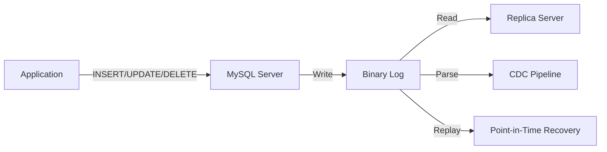
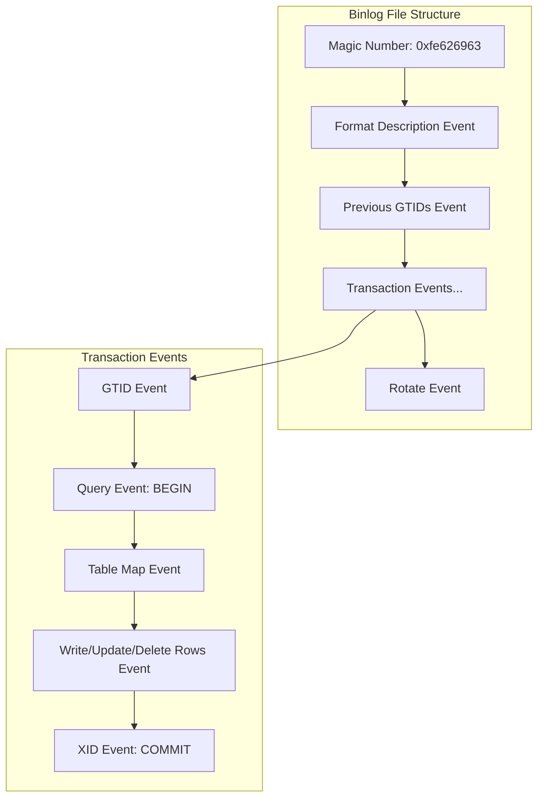
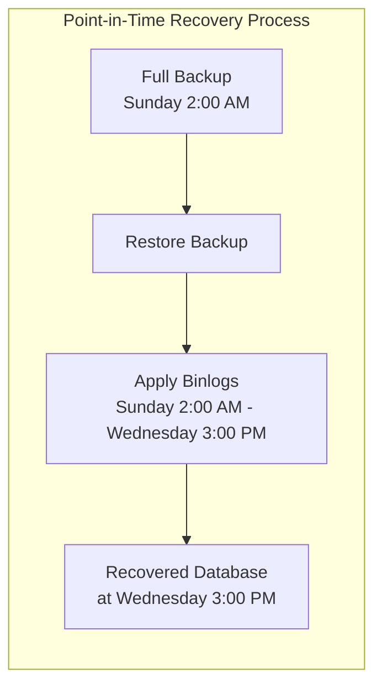
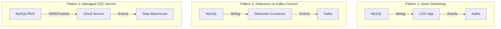

# How to Implement MySQL Binary Log Parsing

Author: [nawazdhandala](https://www.github.com/nawazdhandala)

Tags: MySQL, Binary Logs, CDC, Change Data Capture, Database Replication, Data Streaming, DevOps

Description: A comprehensive guide to MySQL binary log parsing for change data capture, replication monitoring, and data recovery, covering the binlog format, mysqlbinlog utility, programmatic parsing with Python, and production best practices.

---

> The binary log is MySQL's source of truth for every write operation. Master it, and you unlock change data capture, point-in-time recovery, and real-time replication monitoring without touching application code.

MySQL's binary log (binlog) records all changes that modify data or could potentially modify data. Every INSERT, UPDATE, DELETE, and DDL statement gets logged in a compact binary format. Understanding how to parse this log opens up powerful capabilities: streaming changes to downstream systems, building audit trails, recovering from disasters, and monitoring replication lag with precision.

## What is the MySQL Binary Log?

The binary log is a sequential record of all database modifications. MySQL writes to it before committing transactions, making it the authoritative record of what changed and when. The binlog serves three primary purposes:

1. **Replication:** Replicas read the primary's binlog to stay synchronized.
2. **Point-in-Time Recovery:** Replay binlog events after restoring a backup to reach a specific moment.
3. **Change Data Capture (CDC):** Stream row-level changes to external systems like Kafka, Elasticsearch, or data warehouses.



## Binary Log Formats

MySQL supports three binlog formats, each with different trade-offs:

| Format | Description | Use Case |
| --- | --- | --- |
| **STATEMENT** | Logs the SQL statements that modify data | Compact, but non-deterministic functions can cause replica drift |
| **ROW** | Logs the actual row changes (before/after images) | Deterministic, required for CDC, larger log size |
| **MIXED** | Statement-based by default, switches to row-based for non-deterministic operations | Compromise between size and safety |

For CDC and reliable replication, **ROW format is strongly recommended**. It captures exactly what changed at the row level, eliminating ambiguity.

```sql
-- Check current binlog format
SHOW VARIABLES LIKE 'binlog_format';

-- Set to ROW format (requires SUPER privilege)
SET GLOBAL binlog_format = 'ROW';

-- For permanent change, add to my.cnf:
-- [mysqld]
-- binlog_format = ROW
```

## Enabling and Configuring Binary Logging

Binary logging must be enabled in the MySQL configuration. Here is a production-ready configuration:

```ini
# /etc/mysql/mysql.conf.d/mysqld.cnf

[mysqld]
# Enable binary logging with a descriptive prefix
log_bin = /var/log/mysql/mysql-bin

# Use ROW format for deterministic replication and CDC
binlog_format = ROW

# Include full row images for UPDATE statements (before + after)
binlog_row_image = FULL

# Set a unique server ID (required for replication)
server_id = 1

# Expire old binlog files after 7 days
binlog_expire_logs_seconds = 604800

# Maximum size per binlog file (rotate at 100MB)
max_binlog_size = 104857600

# Sync binlog to disk after each transaction for durability
sync_binlog = 1

# Enable GTID for easier replication management (MySQL 5.6+)
gtid_mode = ON
enforce_gtid_consistency = ON
```

After changing configuration, restart MySQL and verify:

```bash
# Restart MySQL service
sudo systemctl restart mysql

# Verify binary logging is enabled
mysql -e "SHOW VARIABLES LIKE 'log_bin';"
# Should show: log_bin | ON

# List current binlog files
mysql -e "SHOW BINARY LOGS;"
```

## Using the mysqlbinlog Utility

The `mysqlbinlog` utility is the standard tool for reading and decoding binary logs. It converts the binary format into human-readable SQL or event data.

### Basic Usage

```bash
# Decode a binlog file to stdout
mysqlbinlog /var/log/mysql/mysql-bin.000001

# Decode with verbose output (shows row changes as pseudo-SQL)
mysqlbinlog -v /var/log/mysql/mysql-bin.000001

# Extra verbose: shows column data types
mysqlbinlog -vv /var/log/mysql/mysql-bin.000001
```

### Filtering by Time Range

```bash
# Extract events from a specific time window
# Useful for point-in-time recovery
mysqlbinlog \
  --start-datetime="2026-01-27 10:00:00" \
  --stop-datetime="2026-01-27 12:00:00" \
  /var/log/mysql/mysql-bin.000001
```

### Filtering by Position

```bash
# Start reading from a specific position (in bytes)
mysqlbinlog --start-position=4 --stop-position=1000 \
  /var/log/mysql/mysql-bin.000001

# Useful when you know the exact binlog coordinates from SHOW MASTER STATUS
```

### Filtering by Database

```bash
# Only show events for a specific database
mysqlbinlog --database=myapp /var/log/mysql/mysql-bin.000001
```

### Remote Binlog Reading

```bash
# Read binlog from a remote server (requires REPLICATION SLAVE privilege)
mysqlbinlog \
  --read-from-remote-server \
  --host=mysql-primary.example.com \
  --user=repl_user \
  --password \
  mysql-bin.000001
```

### Generating Recovery SQL

```bash
# Generate SQL statements that can be piped to mysql for recovery
mysqlbinlog --database=myapp \
  --start-datetime="2026-01-27 10:00:00" \
  /var/log/mysql/mysql-bin.000001 | mysql -u root -p myapp
```

## Understanding Binlog Event Structure

Each binlog file contains a sequence of events. Understanding the event types is crucial for programmatic parsing.



### Key Event Types

| Event Type | Description |
| --- | --- |
| `FORMAT_DESCRIPTION_EVENT` | Contains binlog version and server info; always first event |
| `QUERY_EVENT` | SQL statement (DDL or transaction control like BEGIN) |
| `TABLE_MAP_EVENT` | Maps table ID to database.table name; precedes row events |
| `WRITE_ROWS_EVENT` | INSERT operations with row data |
| `UPDATE_ROWS_EVENT` | UPDATE operations with before/after row images |
| `DELETE_ROWS_EVENT` | DELETE operations with deleted row data |
| `XID_EVENT` | Transaction commit marker |
| `GTID_EVENT` | Global Transaction ID (MySQL 5.6+) |
| `ROTATE_EVENT` | Points to the next binlog file |

## Programmatic Binlog Parsing with Python

For building CDC pipelines, you need programmatic access to binlog events. The `mysql-replication` library provides a pure Python implementation.

### Installation

```bash
pip install mysql-replication
```

### Basic Stream Reader

```python
#!/usr/bin/env python3
"""
MySQL Binary Log Stream Reader

This script connects to a MySQL server and streams binlog events
in real-time, similar to how a replica would read from the primary.

Requirements:
- MySQL user with REPLICATION SLAVE and REPLICATION CLIENT privileges
- Binary logging enabled with ROW format
"""

from pymysqlreplication import BinLogStreamReader
from pymysqlreplication.row_event import (
    WriteRowsEvent,
    UpdateRowsEvent,
    DeleteRowsEvent,
)

# MySQL connection settings
MYSQL_SETTINGS = {
    "host": "127.0.0.1",
    "port": 3306,
    "user": "repl_user",
    "passwd": "secure_password",
}

def main():
    # Create a binlog stream reader
    # blocking=True means it will wait for new events like a replica
    stream = BinLogStreamReader(
        connection_settings=MYSQL_SETTINGS,
        server_id=100,  # Unique ID for this reader (avoid conflicts with replicas)
        blocking=True,  # Wait for new events
        only_events=[WriteRowsEvent, UpdateRowsEvent, DeleteRowsEvent],
        only_schemas=["myapp"],  # Filter to specific databases
        only_tables=["users", "orders"],  # Filter to specific tables
        resume_stream=True,  # Start from current position, not beginning
    )

    print("Listening for binlog events...")

    try:
        for binlog_event in stream:
            # Get the table name
            table = binlog_event.table
            schema = binlog_event.schema

            # Process each row in the event
            for row in binlog_event.rows:
                if isinstance(binlog_event, WriteRowsEvent):
                    # INSERT: row["values"] contains the new row
                    print(f"INSERT into {schema}.{table}:")
                    print(f"  Values: {row['values']}")

                elif isinstance(binlog_event, UpdateRowsEvent):
                    # UPDATE: row["before_values"] and row["after_values"]
                    print(f"UPDATE on {schema}.{table}:")
                    print(f"  Before: {row['before_values']}")
                    print(f"  After:  {row['after_values']}")

                elif isinstance(binlog_event, DeleteRowsEvent):
                    # DELETE: row["values"] contains the deleted row
                    print(f"DELETE from {schema}.{table}:")
                    print(f"  Values: {row['values']}")

    except KeyboardInterrupt:
        print("\nStopping binlog reader...")
    finally:
        stream.close()

if __name__ == "__main__":
    main()
```

### CDC Pipeline to Kafka

```python
#!/usr/bin/env python3
"""
MySQL CDC to Kafka Pipeline

Streams MySQL row changes to Apache Kafka topics in real-time.
Each table gets its own topic: myapp.users, myapp.orders, etc.

This pattern is the foundation for:
- Real-time analytics pipelines
- Search index synchronization
- Cache invalidation
- Event-driven microservices
"""

import json
import signal
import sys
from datetime import datetime, date
from decimal import Decimal
from typing import Any

from kafka import KafkaProducer
from pymysqlreplication import BinLogStreamReader
from pymysqlreplication.row_event import (
    WriteRowsEvent,
    UpdateRowsEvent,
    DeleteRowsEvent,
)

# Configuration
MYSQL_SETTINGS = {
    "host": "127.0.0.1",
    "port": 3306,
    "user": "repl_user",
    "passwd": "secure_password",
}

KAFKA_BOOTSTRAP_SERVERS = ["kafka1:9092", "kafka2:9092", "kafka3:9092"]
KAFKA_TOPIC_PREFIX = "cdc"


def json_serializer(obj: Any) -> str:
    """
    Custom JSON serializer to handle MySQL data types
    that are not natively JSON serializable.
    """
    if isinstance(obj, (datetime, date)):
        return obj.isoformat()
    elif isinstance(obj, Decimal):
        return str(obj)
    elif isinstance(obj, bytes):
        return obj.decode("utf-8", errors="replace")
    raise TypeError(f"Type {type(obj)} not serializable")


def create_kafka_producer() -> KafkaProducer:
    """
    Create a Kafka producer with production-ready settings.
    """
    return KafkaProducer(
        bootstrap_servers=KAFKA_BOOTSTRAP_SERVERS,
        value_serializer=lambda v: json.dumps(v, default=json_serializer).encode("utf-8"),
        key_serializer=lambda k: k.encode("utf-8") if k else None,
        # Ensure messages are durably written
        acks="all",
        # Retry on transient failures
        retries=3,
        retry_backoff_ms=1000,
        # Batch messages for efficiency
        batch_size=16384,
        linger_ms=10,
    )


def build_cdc_message(event, row: dict, operation: str) -> dict:
    """
    Build a standardized CDC message envelope.

    This format is compatible with Debezium's message structure,
    making it easy to swap implementations later.
    """
    message = {
        "schema": event.schema,
        "table": event.table,
        "operation": operation,  # INSERT, UPDATE, DELETE
        "timestamp": datetime.utcnow().isoformat(),
        "position": {
            "file": event.packet.log_file,
            "pos": event.packet.log_pos,
        },
    }

    if operation == "INSERT":
        message["after"] = row["values"]
    elif operation == "UPDATE":
        message["before"] = row["before_values"]
        message["after"] = row["after_values"]
    elif operation == "DELETE":
        message["before"] = row["values"]

    return message


def get_primary_key(event, row: dict) -> str:
    """
    Extract the primary key value(s) for Kafka message key.
    Using PK as message key ensures ordering per row.
    """
    # Get the first column value as a simple key
    # In production, you'd want to identify actual PK columns
    values = row.get("values") or row.get("after_values") or row.get("before_values", {})
    if "id" in values:
        return f"{event.schema}.{event.table}.{values['id']}"
    return f"{event.schema}.{event.table}"


def main():
    # Create Kafka producer
    producer = create_kafka_producer()

    # Create binlog stream reader
    stream = BinLogStreamReader(
        connection_settings=MYSQL_SETTINGS,
        server_id=100,
        blocking=True,
        only_events=[WriteRowsEvent, UpdateRowsEvent, DeleteRowsEvent],
        resume_stream=True,
    )

    # Track statistics
    stats = {"insert": 0, "update": 0, "delete": 0}

    # Graceful shutdown handler
    def shutdown(signum, frame):
        print(f"\nShutting down... Stats: {stats}")
        stream.close()
        producer.flush()
        producer.close()
        sys.exit(0)

    signal.signal(signal.SIGINT, shutdown)
    signal.signal(signal.SIGTERM, shutdown)

    print("CDC pipeline started. Streaming changes to Kafka...")

    for binlog_event in stream:
        # Determine topic name based on schema and table
        topic = f"{KAFKA_TOPIC_PREFIX}.{binlog_event.schema}.{binlog_event.table}"

        for row in binlog_event.rows:
            # Determine operation type
            if isinstance(binlog_event, WriteRowsEvent):
                operation = "INSERT"
                stats["insert"] += 1
            elif isinstance(binlog_event, UpdateRowsEvent):
                operation = "UPDATE"
                stats["update"] += 1
            elif isinstance(binlog_event, DeleteRowsEvent):
                operation = "DELETE"
                stats["delete"] += 1

            # Build and send message
            message = build_cdc_message(binlog_event, row, operation)
            key = get_primary_key(binlog_event, row)

            producer.send(topic, key=key, value=message)

        # Periodic stats logging
        total = sum(stats.values())
        if total % 1000 == 0 and total > 0:
            print(f"Processed {total} events: {stats}")


if __name__ == "__main__":
    main()
```

## Replication Monitoring with Binlog Parsing

Understanding binlog positions is essential for monitoring replication health.

```python
#!/usr/bin/env python3
"""
MySQL Replication Monitor

Monitors replication lag and health by comparing binlog positions
between primary and replicas. Useful for:
- Alerting on replication lag
- Detecting stalled replicas
- Capacity planning
"""

import time
from dataclasses import dataclass
from typing import Optional

import pymysql


@dataclass
class BinlogPosition:
    """Represents a position in the binary log."""
    file: str
    position: int
    gtid_set: Optional[str] = None

    def __str__(self):
        return f"{self.file}:{self.position}"


@dataclass
class ReplicationStatus:
    """Represents the health of a replica."""
    replica_host: str
    io_running: bool
    sql_running: bool
    seconds_behind: Optional[int]
    current_position: BinlogPosition
    relay_log_space: int
    last_error: Optional[str]


def get_primary_position(conn) -> BinlogPosition:
    """
    Get the current binlog position on the primary.

    Uses SHOW MASTER STATUS to get the current write position.
    This is where the primary is writing new events.
    """
    with conn.cursor() as cursor:
        cursor.execute("SHOW MASTER STATUS")
        row = cursor.fetchone()

        if not row:
            raise RuntimeError("Binary logging not enabled on this server")

        return BinlogPosition(
            file=row["File"],
            position=row["Position"],
            gtid_set=row.get("Executed_Gtid_Set"),
        )


def get_replica_status(conn, replica_host: str) -> ReplicationStatus:
    """
    Get detailed replication status from a replica.

    SHOW REPLICA STATUS provides comprehensive information about
    the replication threads and their positions.
    """
    with conn.cursor() as cursor:
        # MySQL 8.0.22+ uses SHOW REPLICA STATUS
        # Older versions use SHOW SLAVE STATUS
        try:
            cursor.execute("SHOW REPLICA STATUS")
        except pymysql.err.ProgrammingError:
            cursor.execute("SHOW SLAVE STATUS")

        row = cursor.fetchone()

        if not row:
            raise RuntimeError(f"Replication not configured on {replica_host}")

        # Extract key fields (handle both old and new column names)
        io_running = row.get("Replica_IO_Running", row.get("Slave_IO_Running")) == "Yes"
        sql_running = row.get("Replica_SQL_Running", row.get("Slave_SQL_Running")) == "Yes"

        return ReplicationStatus(
            replica_host=replica_host,
            io_running=io_running,
            sql_running=sql_running,
            seconds_behind=row.get("Seconds_Behind_Master", row.get("Seconds_Behind_Source")),
            current_position=BinlogPosition(
                file=row.get("Relay_Master_Log_File", row.get("Relay_Source_Log_File")),
                position=row.get("Exec_Master_Log_Pos", row.get("Exec_Source_Log_Pos")),
            ),
            relay_log_space=row.get("Relay_Log_Space", 0),
            last_error=row.get("Last_Error") or None,
        )


def calculate_position_lag(primary_pos: BinlogPosition, replica_pos: BinlogPosition) -> int:
    """
    Calculate the byte lag between primary and replica positions.

    Note: This is an approximation. If they're on different files,
    we assume the replica is behind by the primary's position plus
    some buffer for the file difference.
    """
    if primary_pos.file == replica_pos.file:
        return primary_pos.position - replica_pos.position

    # Different files - extract file numbers
    primary_num = int(primary_pos.file.split(".")[-1])
    replica_num = int(replica_pos.file.split(".")[-1])

    # Rough estimate: assume 100MB per file
    file_lag = (primary_num - replica_num) * 100_000_000
    return file_lag + primary_pos.position - replica_pos.position


def monitor_replication(
    primary_host: str,
    replica_hosts: list[str],
    user: str,
    password: str,
    interval: int = 10,
    lag_threshold: int = 30,
):
    """
    Continuously monitor replication health across replicas.

    Args:
        primary_host: Hostname of the primary MySQL server
        replica_hosts: List of replica hostnames
        user: MySQL username with REPLICATION CLIENT privilege
        password: MySQL password
        interval: Seconds between checks
        lag_threshold: Seconds of lag before alerting
    """
    print(f"Monitoring replication: Primary={primary_host}, Replicas={replica_hosts}")
    print(f"Alert threshold: {lag_threshold} seconds\n")

    while True:
        try:
            # Connect to primary and get position
            with pymysql.connect(
                host=primary_host,
                user=user,
                password=password,
                cursorclass=pymysql.cursors.DictCursor,
            ) as primary_conn:
                primary_pos = get_primary_position(primary_conn)

            print(f"[{time.strftime('%H:%M:%S')}] Primary position: {primary_pos}")

            # Check each replica
            for replica_host in replica_hosts:
                try:
                    with pymysql.connect(
                        host=replica_host,
                        user=user,
                        password=password,
                        cursorclass=pymysql.cursors.DictCursor,
                    ) as replica_conn:
                        status = get_replica_status(replica_conn, replica_host)

                    # Check for replication errors
                    if not status.io_running or not status.sql_running:
                        print(f"  ALERT: {replica_host} - Replication stopped!")
                        print(f"    IO Running: {status.io_running}, SQL Running: {status.sql_running}")
                        if status.last_error:
                            print(f"    Error: {status.last_error}")
                        continue

                    # Calculate lag
                    byte_lag = calculate_position_lag(primary_pos, status.current_position)

                    # Check for excessive lag
                    lag_status = "OK"
                    if status.seconds_behind and status.seconds_behind > lag_threshold:
                        lag_status = "ALERT"

                    print(f"  {replica_host}: {status.seconds_behind}s behind, "
                          f"{byte_lag:,} bytes lag [{lag_status}]")

                except Exception as e:
                    print(f"  ERROR: {replica_host} - {e}")

            print()
            time.sleep(interval)

        except KeyboardInterrupt:
            print("\nStopping monitor...")
            break
        except Exception as e:
            print(f"Error: {e}")
            time.sleep(interval)


if __name__ == "__main__":
    monitor_replication(
        primary_host="mysql-primary.example.com",
        replica_hosts=[
            "mysql-replica-1.example.com",
            "mysql-replica-2.example.com",
        ],
        user="repl_monitor",
        password="secure_password",
        interval=10,
        lag_threshold=30,
    )
```

## Point-in-Time Recovery with Binlog

One of the most critical uses of binlog parsing is disaster recovery.



### Recovery Script

```bash
#!/bin/bash
# Point-in-Time Recovery Script
# Recovers a MySQL database to a specific point in time

set -euo pipefail

# Configuration
BACKUP_FILE="/backups/mysql/full-backup-2026-01-25.sql.gz"
BINLOG_DIR="/var/log/mysql"
TARGET_TIME="2026-01-27 15:30:00"
TARGET_DB="myapp"

echo "=== Point-in-Time Recovery ==="
echo "Backup: $BACKUP_FILE"
echo "Target time: $TARGET_TIME"
echo "Target database: $TARGET_DB"
echo ""

# Step 1: Restore the full backup
echo "[1/3] Restoring full backup..."
gunzip -c "$BACKUP_FILE" | mysql -u root -p "$TARGET_DB"

# Step 2: Find the binlog position from the backup
# Most backup tools record this in a comment or separate file
BACKUP_BINLOG_FILE="mysql-bin.000042"
BACKUP_BINLOG_POS="12345"
echo "[2/3] Backup position: $BACKUP_BINLOG_FILE:$BACKUP_BINLOG_POS"

# Step 3: Apply binlogs from backup position to target time
echo "[3/3] Applying binary logs..."

# Get list of binlog files from backup position onwards
BINLOG_FILES=$(ls "$BINLOG_DIR"/mysql-bin.* | sort | \
    awk -v start="$BINLOG_DIR/$BACKUP_BINLOG_FILE" '$0 >= start')

for binlog_file in $BINLOG_FILES; do
    echo "  Processing: $(basename "$binlog_file")"

    # For the first file, start from the backup position
    # For subsequent files, start from the beginning
    if [ "$(basename "$binlog_file")" = "$BACKUP_BINLOG_FILE" ]; then
        mysqlbinlog \
            --start-position="$BACKUP_BINLOG_POS" \
            --stop-datetime="$TARGET_TIME" \
            --database="$TARGET_DB" \
            "$binlog_file" | mysql -u root -p "$TARGET_DB"
    else
        mysqlbinlog \
            --stop-datetime="$TARGET_TIME" \
            --database="$TARGET_DB" \
            "$binlog_file" | mysql -u root -p "$TARGET_DB"
    fi
done

echo ""
echo "Recovery complete. Database restored to $TARGET_TIME"
```

## CDC Architecture Patterns

When building CDC pipelines, several architectural patterns have emerged as best practices.



### Pattern Comparison

| Pattern | Pros | Cons | Best For |
| --- | --- | --- | --- |
| **Direct Streaming** | Full control, minimal dependencies | Must handle checkpointing, scaling, failures | Small scale, custom requirements |
| **Debezium** | Battle-tested, schema registry, exactly-once | Kafka Connect complexity, JVM overhead | Kafka-centric architectures |
| **Managed Service** | Zero maintenance, built-in scaling | Vendor lock-in, cost at scale, less control | Data warehouse syncing |

## MySQL User Permissions for Binlog Access

CDC and replication monitoring require specific MySQL privileges.

```sql
-- Create a dedicated user for binlog reading
CREATE USER 'cdc_reader'@'%' IDENTIFIED BY 'secure_password';

-- Grant replication privileges
-- REPLICATION SLAVE: Required to read binlog stream
-- REPLICATION CLIENT: Required to execute SHOW MASTER STATUS, SHOW BINARY LOGS
GRANT REPLICATION SLAVE, REPLICATION CLIENT ON *.* TO 'cdc_reader'@'%';

-- If using GTID-based replication, also need:
GRANT SELECT ON mysql.gtid_executed TO 'cdc_reader'@'%';

-- For reading table metadata (column names, types)
GRANT SELECT ON *.* TO 'cdc_reader'@'%';

-- Apply changes
FLUSH PRIVILEGES;

-- Verify grants
SHOW GRANTS FOR 'cdc_reader'@'%';
```

## Handling Schema Changes in CDC

Schema changes (DDL) are a major challenge in CDC pipelines. When columns are added, removed, or altered, your downstream systems must adapt.

```python
#!/usr/bin/env python3
"""
Schema-Aware CDC Pipeline

Demonstrates handling schema changes gracefully by:
1. Detecting TABLE_MAP events that contain column metadata
2. Maintaining a schema cache
3. Emitting schema change events to downstream systems
"""

from pymysqlreplication import BinLogStreamReader
from pymysqlreplication.row_event import (
    WriteRowsEvent,
    UpdateRowsEvent,
    DeleteRowsEvent,
)
from pymysqlreplication.event import QueryEvent

MYSQL_SETTINGS = {
    "host": "127.0.0.1",
    "port": 3306,
    "user": "cdc_reader",
    "passwd": "secure_password",
}


class SchemaCache:
    """
    Maintains a cache of table schemas.

    In production, you would persist this to Redis or a database
    so the CDC pipeline can resume without re-reading all history.
    """

    def __init__(self):
        self.schemas = {}  # {(schema, table): [column_names]}

    def update(self, schema: str, table: str, columns: list):
        """Update the cached schema for a table."""
        key = (schema, table)
        old_columns = self.schemas.get(key)

        if old_columns != columns:
            if old_columns:
                print(f"SCHEMA CHANGE: {schema}.{table}")
                print(f"  Old columns: {old_columns}")
                print(f"  New columns: {columns}")
                # Here you would emit a schema change event to Kafka
                # so downstream consumers can update their processing

            self.schemas[key] = columns

    def get(self, schema: str, table: str) -> list:
        """Get the cached schema for a table."""
        return self.schemas.get((schema, table), [])


def detect_ddl(event: QueryEvent) -> bool:
    """
    Detect if a query event is a DDL statement.

    In ROW format, DDL statements are still logged as QueryEvents.
    """
    query = event.query.upper().strip()
    ddl_keywords = ["CREATE", "ALTER", "DROP", "TRUNCATE", "RENAME"]
    return any(query.startswith(kw) for kw in ddl_keywords)


def main():
    schema_cache = SchemaCache()

    stream = BinLogStreamReader(
        connection_settings=MYSQL_SETTINGS,
        server_id=100,
        blocking=True,
        # Include QueryEvent to catch DDL
        only_events=[WriteRowsEvent, UpdateRowsEvent, DeleteRowsEvent, QueryEvent],
        resume_stream=True,
    )

    print("Schema-aware CDC pipeline started...")

    for event in stream:
        if isinstance(event, QueryEvent):
            if detect_ddl(event):
                print(f"DDL detected: {event.query[:100]}...")
                # In production: pause consumption, refresh schema, resume

        elif isinstance(event, (WriteRowsEvent, UpdateRowsEvent, DeleteRowsEvent)):
            # Update schema cache from the event's column information
            # The mysql-replication library extracts this from TABLE_MAP events
            schema_cache.update(
                event.schema,
                event.table,
                event.columns,
            )

            # Process rows with schema context
            for row in event.rows:
                process_row_with_schema(event, row, schema_cache)


def process_row_with_schema(event, row: dict, schema_cache: SchemaCache):
    """
    Process a row change with full schema context.

    This allows downstream systems to handle the data correctly
    even after schema changes.
    """
    columns = schema_cache.get(event.schema, event.table)

    # Build a message that includes column metadata
    message = {
        "table": f"{event.schema}.{event.table}",
        "columns": [{"name": c.name, "type": c.type} for c in event.columns],
        "data": row.get("values") or row.get("after_values"),
    }

    print(f"Row event: {message['table']} with {len(columns)} columns")


if __name__ == "__main__":
    main()
```

## Best Practices Summary

1. **Always use ROW format** for CDC and critical replication. STATEMENT format can cause data drift with non-deterministic functions.

2. **Set binlog_row_image=FULL** to capture complete before/after images. This enables proper conflict detection and downstream upserts.

3. **Use GTIDs** (MySQL 5.6+) for replication. They make failover and position tracking much simpler than file/position coordinates.

4. **Monitor binlog disk usage**. Set appropriate `binlog_expire_logs_seconds` and alert when disk space is low. Running out of binlog space stops all writes.

5. **Handle schema changes gracefully**. DDL events require special handling in CDC pipelines. Consider using schema registries like Confluent Schema Registry.

6. **Implement checkpointing**. Store the last processed binlog position durably. This enables exactly-once processing and crash recovery.

7. **Use dedicated replication users**. Create MySQL users with minimal privileges (REPLICATION SLAVE, REPLICATION CLIENT) for CDC applications.

8. **Test failover scenarios**. Verify your CDC pipeline handles primary failover, replica promotion, and network partitions correctly.

9. **Monitor replication lag**. Set up alerts for when replicas fall behind. Lag often indicates capacity issues or long-running queries.

10. **Secure binlog access**. Binary logs contain all your data. Encrypt connections (require_secure_transport), restrict network access, and audit who reads them.

## Conclusion

MySQL binary log parsing is a powerful technique for building real-time data pipelines, monitoring replication health, and recovering from disasters. Whether you use the `mysqlbinlog` utility for ad-hoc analysis or build sophisticated CDC pipelines with Python, understanding the binlog format and event types is essential.

For production CDC deployments, consider using established tools like Debezium that handle the complexity of checkpointing, schema evolution, and exactly-once delivery. For simpler use cases or custom requirements, the `mysql-replication` Python library provides a solid foundation.

Monitor your binlog-based systems with [OneUptime](https://oneuptime.com) to get alerts on replication lag, CDC pipeline failures, and disk space issues before they become outages.
