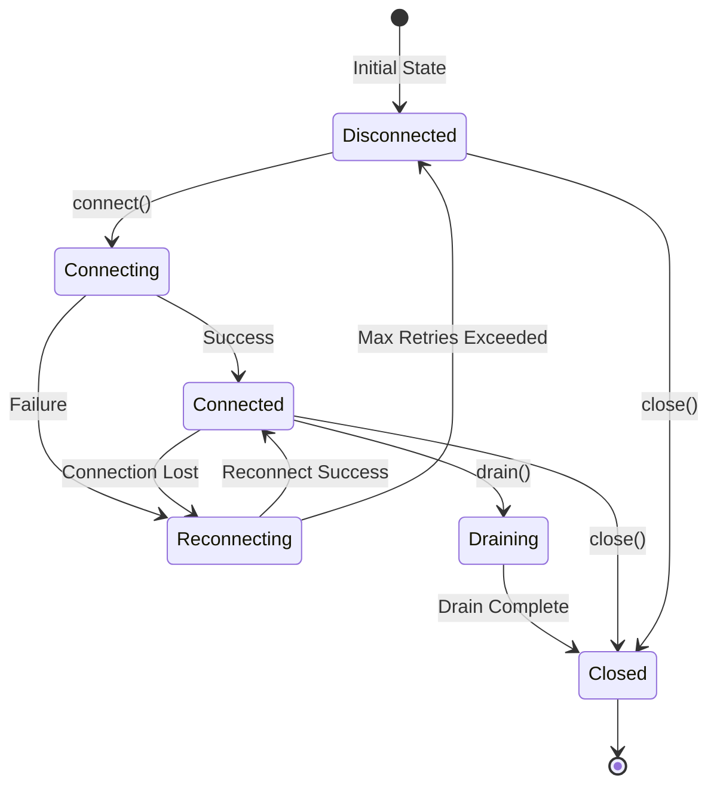
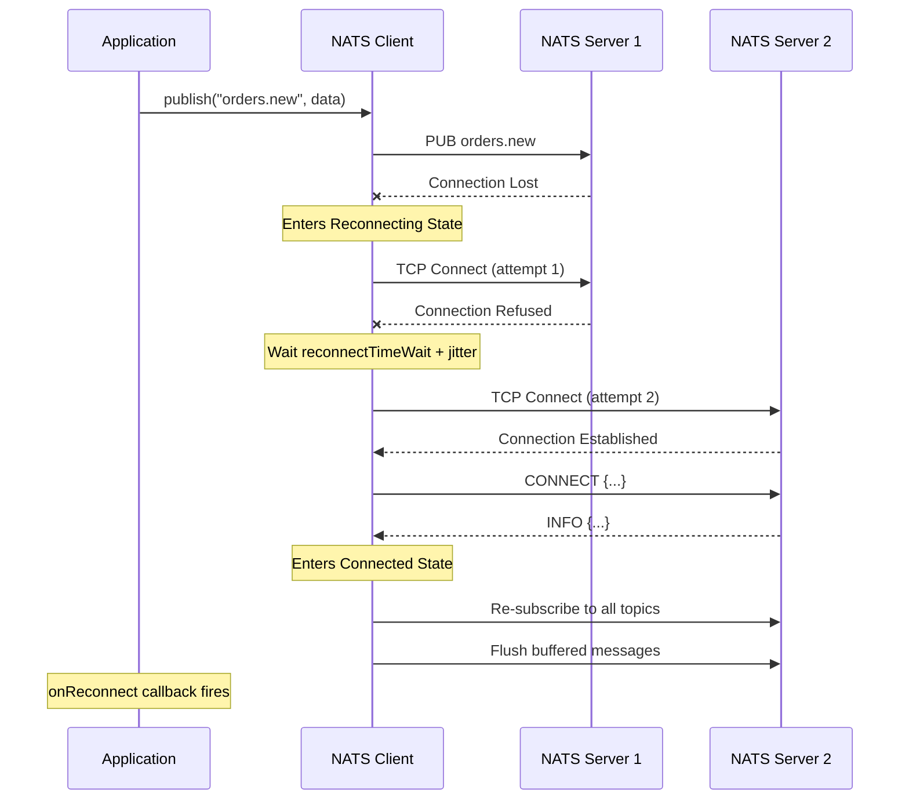
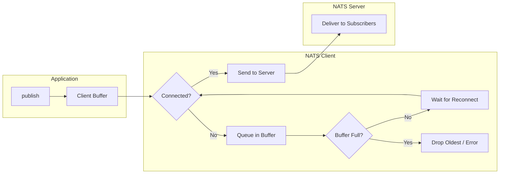
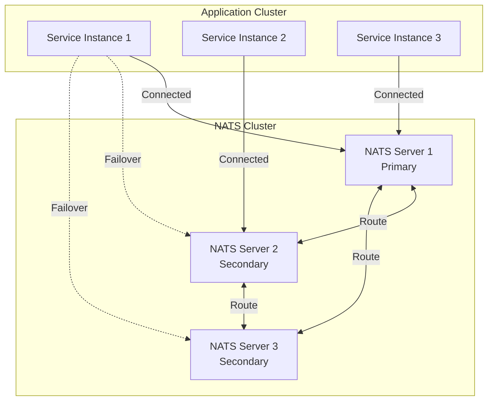
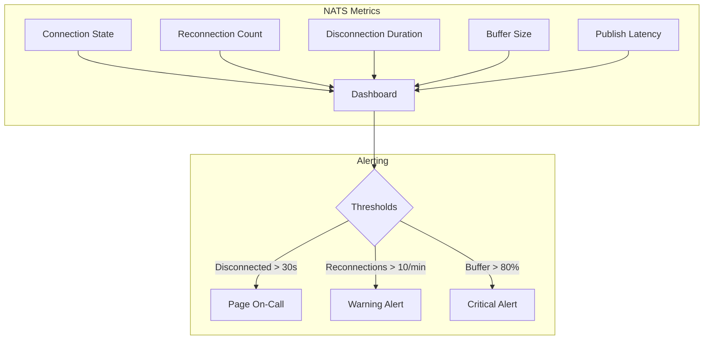

# How to Handle NATS Connection Recovery

By [nawazdhandala](https://github.com/nawazdhandala)

Tags: NATS, Messaging, Connection Recovery, Reliability, Distributed Systems, NodeJS, Go, DevOps

Description: A comprehensive guide to handling NATS connection recovery, including reconnection strategies, connection status callbacks, buffered messages during disconnect, and cluster failover patterns for building resilient messaging systems.

---

> "The network is unreliable. Your messaging system should not be."

NATS is a high-performance messaging system designed for cloud-native applications, but network partitions, server restarts, and infrastructure changes happen. Building resilient applications means handling connection failures gracefully. This guide covers everything you need to know about NATS connection recovery: from basic reconnection handling to advanced cluster failover strategies.

---

## Table of Contents

1. Understanding NATS Connection Lifecycle
2. Connection Status Callbacks
3. Reconnection Handling
4. Buffered Messages During Disconnect
5. Cluster Failover
6. Production Configuration
7. Monitoring Connection Health
8. Common Pitfalls and Best Practices

---

## 1. Understanding NATS Connection Lifecycle

Before diving into recovery strategies, it is essential to understand the connection states a NATS client can be in.



| State | Description |
|-------|-------------|
| Disconnected | No active connection to any NATS server |
| Connecting | Attempting initial connection |
| Connected | Active connection, ready for publish/subscribe |
| Reconnecting | Connection lost, attempting to reconnect |
| Draining | Gracefully closing subscriptions and flushing pending messages |
| Closed | Connection terminated, cannot be reused |

---

## 2. Connection Status Callbacks

NATS clients provide callbacks for monitoring connection state changes. These are essential for implementing proper recovery logic and observability.

### Node.js Implementation

```javascript
// nats-connection.js
// NATS connection manager with comprehensive status callbacks

const { connect, Events } = require('nats');

class NATSConnectionManager {
  constructor(options = {}) {
    // Store configuration
    this.servers = options.servers || ['nats://localhost:4222'];
    this.name = options.name || 'my-service';
    this.nc = null;

    // Track connection state for health checks
    this.isConnected = false;
    this.reconnectAttempts = 0;
    this.lastConnectedAt = null;
    this.lastDisconnectedAt = null;
  }

  async connect() {
    // Connect with reconnection options enabled
    this.nc = await connect({
      servers: this.servers,
      name: this.name,

      // Reconnection settings
      reconnect: true,
      maxReconnectAttempts: -1,  // Infinite retries
      reconnectTimeWait: 2000,   // 2 seconds between attempts
      reconnectJitter: 500,      // Add randomness to prevent thundering herd
      reconnectJitterTLS: 1000,  // Additional jitter for TLS connections

      // Connection timeout settings
      timeout: 10000,            // 10 second connection timeout
      pingInterval: 30000,       // Ping every 30 seconds
      maxPingOut: 3,             // Close after 3 missed pongs
    });

    // Set up all status callbacks
    this.setupStatusCallbacks();

    // Mark as connected
    this.isConnected = true;
    this.lastConnectedAt = new Date();

    console.log(`[NATS] Connected to ${this.nc.getServer()}`);

    return this.nc;
  }

  setupStatusCallbacks() {
    // Called when connection is lost
    // This fires immediately when the TCP connection drops
    this.nc.on(Events.Disconnect, (err) => {
      this.isConnected = false;
      this.lastDisconnectedAt = new Date();
      this.reconnectAttempts = 0;

      console.error('[NATS] Disconnected:', err?.message || 'Unknown reason');

      // Emit event for application-level handling
      this.onDisconnect?.(err);
    });

    // Called when attempting to reconnect
    // Fires for each reconnection attempt
    this.nc.on(Events.Reconnecting, () => {
      this.reconnectAttempts++;

      console.log(`[NATS] Reconnecting... attempt ${this.reconnectAttempts}`);

      // Emit event for metrics/monitoring
      this.onReconnecting?.(this.reconnectAttempts);
    });

    // Called when successfully reconnected
    // Application can resume normal operations
    this.nc.on(Events.Reconnect, () => {
      this.isConnected = true;
      this.lastConnectedAt = new Date();

      const downtime = this.lastDisconnectedAt
        ? Date.now() - this.lastDisconnectedAt.getTime()
        : 0;

      console.log(`[NATS] Reconnected to ${this.nc.getServer()} after ${downtime}ms`);
      console.log(`[NATS] Reconnect took ${this.reconnectAttempts} attempts`);

      // Reset counter after successful reconnect
      this.reconnectAttempts = 0;

      // Emit event for application-level handling
      this.onReconnect?.(this.nc.getServer());
    });

    // Called when client receives update about cluster topology
    // Useful for monitoring cluster health
    this.nc.on(Events.Update, (update) => {
      console.log('[NATS] Cluster update:', update);
      this.onClusterUpdate?.(update);
    });

    // Called when connection is closed (intentionally or after max retries)
    // No more reconnection attempts will be made
    this.nc.on(Events.Close, () => {
      this.isConnected = false;

      console.log('[NATS] Connection closed');

      this.onClose?.();
    });

    // Called for server-initiated errors
    // These may or may not cause disconnection
    this.nc.on(Events.Error, (err) => {
      console.error('[NATS] Error:', err.message);

      this.onError?.(err);
    });

    // Called when server sends informational messages
    // Includes protocol-level information
    this.nc.on(Events.ServerInfo, (info) => {
      console.log('[NATS] Server info received:', {
        serverId: info.server_id,
        version: info.version,
        cluster: info.cluster,
      });
    });
  }

  // Health check method for Kubernetes probes
  getHealthStatus() {
    return {
      connected: this.isConnected,
      server: this.nc?.getServer() || null,
      reconnectAttempts: this.reconnectAttempts,
      lastConnectedAt: this.lastConnectedAt,
      lastDisconnectedAt: this.lastDisconnectedAt,
    };
  }

  async close() {
    if (this.nc) {
      // Drain ensures all pending messages are processed
      await this.nc.drain();
    }
  }
}

// Usage
const nats = new NATSConnectionManager({
  servers: ['nats://nats-1:4222', 'nats://nats-2:4222', 'nats://nats-3:4222'],
  name: 'order-service',
});

// Register application-level handlers
nats.onDisconnect = (err) => {
  // Pause accepting new orders during disconnect
  orderQueue.pause();
};

nats.onReconnect = (server) => {
  // Resume order processing
  orderQueue.resume();

  // Re-subscribe to any ephemeral subscriptions if needed
  resubscribeToTopics();
};

// Connect and start
await nats.connect();
```

### Go Implementation

```go
// nats_connection.go
// NATS connection manager with comprehensive status callbacks for Go

package messaging

import (
	"fmt"
	"log"
	"strings"
	"sync"
	"time"

	"github.com/nats-io/nats.go"
)

// ConnectionManager handles NATS connection lifecycle
type ConnectionManager struct {
	nc                  *nats.Conn
	servers             []string
	name                string

	// State tracking
	mu                  sync.RWMutex
	isConnected         bool
	reconnectAttempts   int
	lastConnectedAt     time.Time
	lastDisconnectedAt  time.Time

	// Callbacks for application-level handling
	OnDisconnect        func(error)
	OnReconnect         func(string)
	OnClose             func()
}

// NewConnectionManager creates a new NATS connection manager
func NewConnectionManager(servers []string, name string) *ConnectionManager {
	return &ConnectionManager{
		servers: servers,
		name:    name,
	}
}

// Connect establishes connection with recovery options
func (cm *ConnectionManager) Connect() error {
	opts := []nats.Option{
		// Connection identity
		nats.Name(cm.name),

		// Reconnection settings
		nats.ReconnectWait(2 * time.Second),
		nats.MaxReconnects(-1), // Infinite retries
		nats.ReconnectJitter(500*time.Millisecond, 1*time.Second),

		// Connection health settings
		nats.Timeout(10 * time.Second),
		nats.PingInterval(30 * time.Second),
		nats.MaxPingsOutstanding(3),

		// Disconnect handler - fires when connection is lost
		nats.DisconnectErrHandler(func(nc *nats.Conn, err error) {
			cm.mu.Lock()
			cm.isConnected = false
			cm.lastDisconnectedAt = time.Now()
			cm.reconnectAttempts = 0
			cm.mu.Unlock()

			if err != nil {
				log.Printf("[NATS] Disconnected: %v", err)
			} else {
				log.Println("[NATS] Disconnected")
			}

			// Call application handler
			if cm.OnDisconnect != nil {
				cm.OnDisconnect(err)
			}
		}),

		// Reconnect handler - fires on each attempt
		nats.ReconnectHandler(func(nc *nats.Conn) {
			cm.mu.Lock()
			cm.isConnected = true
			cm.lastConnectedAt = time.Now()
			downtime := time.Since(cm.lastDisconnectedAt)
			attempts := cm.reconnectAttempts
			cm.reconnectAttempts = 0
			cm.mu.Unlock()

			log.Printf("[NATS] Reconnected to %s after %v (%d attempts)",
				nc.ConnectedUrl(), downtime, attempts)

			// Call application handler
			if cm.OnReconnect != nil {
				cm.OnReconnect(nc.ConnectedUrl())
			}
		}),

		// Close handler - fires when connection is closed
		nats.ClosedHandler(func(nc *nats.Conn) {
			cm.mu.Lock()
			cm.isConnected = false
			cm.mu.Unlock()

			log.Println("[NATS] Connection closed")

			if cm.OnClose != nil {
				cm.OnClose()
			}
		}),

		// Error handler - fires for async errors
		nats.ErrorHandler(func(nc *nats.Conn, sub *nats.Subscription, err error) {
			if sub != nil {
				log.Printf("[NATS] Error on subscription %s: %v", sub.Subject, err)
			} else {
				log.Printf("[NATS] Error: %v", err)
			}
		}),

		// Discovered servers handler - cluster topology updates
		nats.DiscoveredServersHandler(func(nc *nats.Conn) {
			log.Printf("[NATS] Discovered servers: %v", nc.DiscoveredServers())
		}),
	}

	// Connect to NATS cluster
	nc, err := nats.Connect(
		strings.Join(cm.servers, ","),
		opts...,
	)
	if err != nil {
		return fmt.Errorf("failed to connect to NATS: %w", err)
	}

	cm.nc = nc
	cm.mu.Lock()
	cm.isConnected = true
	cm.lastConnectedAt = time.Now()
	cm.mu.Unlock()

	log.Printf("[NATS] Connected to %s", nc.ConnectedUrl())

	return nil
}

// IsConnected returns current connection status
func (cm *ConnectionManager) IsConnected() bool {
	cm.mu.RLock()
	defer cm.mu.RUnlock()
	return cm.isConnected
}

// GetHealthStatus returns detailed health information
func (cm *ConnectionManager) GetHealthStatus() map[string]interface{} {
	cm.mu.RLock()
	defer cm.mu.RUnlock()

	status := map[string]interface{}{
		"connected":          cm.isConnected,
		"reconnect_attempts": cm.reconnectAttempts,
		"last_connected_at":  cm.lastConnectedAt,
	}

	if cm.nc != nil {
		status["server"] = cm.nc.ConnectedUrl()
		status["cluster_id"] = cm.nc.ConnectedClusterName()
	}

	return status
}

// Close gracefully closes the connection
func (cm *ConnectionManager) Close() {
	if cm.nc != nil {
		// Drain ensures all pending messages are flushed
		cm.nc.Drain()
	}
}
```

---

## 3. Reconnection Handling

Proper reconnection handling ensures your application recovers gracefully from network failures.

### Reconnection Flow



### Exponential Backoff with Jitter

```javascript
// reconnection-strategy.js
// Custom reconnection strategy with exponential backoff

const { connect } = require('nats');

async function connectWithExponentialBackoff(options) {
  const {
    servers,
    maxAttempts = 10,
    initialDelay = 1000,
    maxDelay = 30000,
    jitterFactor = 0.3,
  } = options;

  let attempt = 0;

  while (attempt < maxAttempts) {
    try {
      // Attempt connection
      const nc = await connect({
        servers,

        // Disable built-in reconnection for custom handling
        reconnect: false,
        timeout: 5000,
      });

      console.log(`[NATS] Connected on attempt ${attempt + 1}`);

      // Set up reconnection on disconnect
      nc.closed().then(() => {
        console.log('[NATS] Connection closed, will attempt reconnection');

        // Recursive reconnection with backoff
        setTimeout(() => {
          connectWithExponentialBackoff(options);
        }, calculateDelay(0, initialDelay, maxDelay, jitterFactor));
      });

      return nc;
    } catch (err) {
      attempt++;

      // Calculate delay with exponential backoff and jitter
      const delay = calculateDelay(attempt, initialDelay, maxDelay, jitterFactor);

      console.error(
        `[NATS] Connection attempt ${attempt} failed: ${err.message}. ` +
        `Retrying in ${delay}ms`
      );

      // Wait before next attempt
      await sleep(delay);
    }
  }

  throw new Error(`Failed to connect to NATS after ${maxAttempts} attempts`);
}

// Calculate delay with exponential backoff and jitter
// This prevents thundering herd when multiple clients reconnect
function calculateDelay(attempt, initialDelay, maxDelay, jitterFactor) {
  // Exponential backoff: delay doubles with each attempt
  const exponentialDelay = initialDelay * Math.pow(2, attempt);

  // Cap at maximum delay
  const cappedDelay = Math.min(exponentialDelay, maxDelay);

  // Add random jitter (both positive and negative)
  const jitter = cappedDelay * jitterFactor * (Math.random() * 2 - 1);

  // Ensure delay is positive
  return Math.max(0, Math.floor(cappedDelay + jitter));
}

function sleep(ms) {
  return new Promise(resolve => setTimeout(resolve, ms));
}

// Usage
const nc = await connectWithExponentialBackoff({
  servers: ['nats://nats-1:4222', 'nats://nats-2:4222'],
  maxAttempts: 20,
  initialDelay: 1000,
  maxDelay: 30000,
});
```

---

## 4. Buffered Messages During Disconnect

NATS clients can buffer messages during brief disconnections. Understanding this feature is crucial for data integrity.

### How Message Buffering Works



### Configuring Message Buffering

```javascript
// buffered-publishing.js
// Configure and handle message buffering during disconnects

const { connect, ErrorCode } = require('nats');

async function setupBufferedConnection() {
  const nc = await connect({
    servers: ['nats://localhost:4222'],

    // Reconnection must be enabled for buffering to work
    reconnect: true,
    maxReconnectAttempts: -1,

    // Buffer configuration
    // reconnectBufSize: Maximum bytes to buffer during disconnect
    // Default is 8MB (8 * 1024 * 1024)
    reconnectBufSize: 16 * 1024 * 1024, // 16MB buffer

    // Connection settings
    timeout: 10000,
  });

  return nc;
}

// Safe publishing with buffer awareness
class BufferAwarePublisher {
  constructor(nc) {
    this.nc = nc;
    this.pendingCount = 0;
    this.maxPending = 10000;
  }

  async publish(subject, data, options = {}) {
    // Check if we are connected
    if (!this.nc.protocol?.connected) {
      // Decide how to handle based on message importance
      if (options.critical) {
        // For critical messages, throw error to let caller handle
        throw new Error('Not connected to NATS, cannot publish critical message');
      }

      // For non-critical, log warning and proceed (will buffer)
      console.warn(`[NATS] Publishing to buffer while disconnected: ${subject}`);
    }

    // Track pending messages to prevent buffer overflow
    this.pendingCount++;

    try {
      // Publish with optional headers
      if (options.headers) {
        const headers = this.nc.headers();
        for (const [key, value] of Object.entries(options.headers)) {
          headers.set(key, value);
        }
        this.nc.publish(subject, data, { headers });
      } else {
        this.nc.publish(subject, data);
      }

      // Optionally wait for flush to confirm delivery
      if (options.waitForFlush) {
        await this.nc.flush();
      }
    } catch (err) {
      // Handle specific error cases
      if (err.code === ErrorCode.MaxPayloadExceeded) {
        console.error(`[NATS] Message too large for subject ${subject}`);
        throw err;
      }

      if (err.code === ErrorCode.ConnectionClosed) {
        console.error(`[NATS] Connection closed while publishing to ${subject}`);
        throw err;
      }

      throw err;
    } finally {
      this.pendingCount--;
    }
  }

  // Flush all buffered messages
  async flush(timeout = 5000) {
    try {
      await this.nc.flush();
      console.log('[NATS] All buffered messages flushed');
    } catch (err) {
      console.error('[NATS] Flush failed:', err.message);
      throw err;
    }
  }

  // Get buffer status
  getBufferStatus() {
    return {
      pending: this.pendingCount,
      connected: this.nc.protocol?.connected || false,
    };
  }
}

// Usage with critical message handling
const nc = await setupBufferedConnection();
const publisher = new BufferAwarePublisher(nc);

// Non-critical message - will buffer if disconnected
await publisher.publish('logs.info', JSON.stringify({ msg: 'User logged in' }));

// Critical message - throws if disconnected
try {
  await publisher.publish(
    'payments.process',
    JSON.stringify({ orderId: '123', amount: 99.99 }),
    { critical: true, waitForFlush: true }
  );
} catch (err) {
  // Handle critical message failure
  // Perhaps save to local queue for retry
  await saveToLocalQueue('payments.process', { orderId: '123', amount: 99.99 });
}
```

### Handling Buffer Overflow

```javascript
// buffer-overflow-handling.js
// Strategy for handling buffer overflow scenarios

const { connect, Events } = require('nats');
const { EventEmitter } = require('events');

class ResilientPublisher extends EventEmitter {
  constructor(options = {}) {
    super();

    this.nc = null;
    this.servers = options.servers;
    this.overflowQueue = [];
    this.maxOverflowQueue = options.maxOverflowQueue || 10000;
    this.isConnected = false;
  }

  async connect() {
    this.nc = await connect({
      servers: this.servers,
      reconnect: true,
      maxReconnectAttempts: -1,
      reconnectBufSize: 8 * 1024 * 1024, // 8MB
    });

    this.nc.on(Events.Disconnect, () => {
      this.isConnected = false;
    });

    this.nc.on(Events.Reconnect, () => {
      this.isConnected = true;

      // Drain overflow queue after reconnection
      this.drainOverflowQueue();
    });

    this.isConnected = true;
  }

  async publish(subject, data) {
    // Attempt normal publish
    try {
      this.nc.publish(subject, data);
    } catch (err) {
      // If buffer is full, use overflow queue
      if (this.overflowQueue.length < this.maxOverflowQueue) {
        this.overflowQueue.push({
          subject,
          data,
          timestamp: Date.now()
        });

        console.warn(
          `[NATS] Message queued in overflow. Queue size: ${this.overflowQueue.length}`
        );

        this.emit('overflow', { queueSize: this.overflowQueue.length });
      } else {
        // Overflow queue is also full - emit error for handling
        console.error('[NATS] Overflow queue full, message dropped');

        this.emit('messageLost', { subject, data });

        throw new Error('NATS buffer and overflow queue both full');
      }
    }
  }

  async drainOverflowQueue() {
    if (this.overflowQueue.length === 0) return;

    console.log(`[NATS] Draining overflow queue: ${this.overflowQueue.length} messages`);

    // Process queue in order
    while (this.overflowQueue.length > 0 && this.isConnected) {
      const { subject, data, timestamp } = this.overflowQueue[0];

      // Check message age - skip if too old
      const age = Date.now() - timestamp;
      if (age > 60000) { // 1 minute TTL
        console.warn(`[NATS] Dropping stale message (${age}ms old): ${subject}`);
        this.overflowQueue.shift();
        continue;
      }

      try {
        this.nc.publish(subject, data);
        this.overflowQueue.shift(); // Remove after successful publish
      } catch (err) {
        // Stop draining if we hit buffer limit again
        console.warn('[NATS] Buffer full while draining, will retry later');
        break;
      }
    }

    if (this.overflowQueue.length === 0) {
      console.log('[NATS] Overflow queue drained successfully');
    }
  }
}

// Usage
const publisher = new ResilientPublisher({
  servers: ['nats://localhost:4222'],
  maxOverflowQueue: 10000,
});

publisher.on('overflow', ({ queueSize }) => {
  // Alert monitoring system
  metrics.gauge('nats.overflow_queue_size', queueSize);
});

publisher.on('messageLost', ({ subject }) => {
  // Track lost messages
  metrics.increment('nats.messages_lost', { subject });
});

await publisher.connect();
```

---

## 5. Cluster Failover

NATS supports clustering for high availability. Proper cluster failover configuration ensures your application remains connected even when individual servers fail.

### Cluster Architecture



### Cluster Failover Configuration

```javascript
// cluster-failover.js
// Robust NATS cluster connection with failover support

const { connect, Events } = require('nats');

async function connectToCluster(options = {}) {
  const {
    // List all cluster members
    // Client will automatically discover additional servers
    servers = [
      'nats://nats-1.nats.svc.cluster.local:4222',
      'nats://nats-2.nats.svc.cluster.local:4222',
      'nats://nats-3.nats.svc.cluster.local:4222',
    ],

    // Connection name for monitoring
    name = 'my-service',

    // Credentials if using authentication
    token,
    user,
    pass,
  } = options;

  const nc = await connect({
    servers,
    name,

    // Authentication (choose one)
    token,
    user,
    pass,

    // Enable server discovery
    // Client will learn about new servers from cluster gossip
    noRandomize: false,  // Randomize server list for load balancing

    // Reconnection for failover
    reconnect: true,
    maxReconnectAttempts: -1,
    reconnectTimeWait: 1000,
    reconnectJitter: 500,

    // Wait before giving up on initial connection
    timeout: 20000,

    // Health check settings
    pingInterval: 20000,
    maxPingOut: 3,

    // TLS for secure clusters
    // tls: {
    //   caFile: '/etc/nats/ca.pem',
    //   certFile: '/etc/nats/cert.pem',
    //   keyFile: '/etc/nats/key.pem',
    // },
  });

  // Track which server we are connected to
  console.log(`[NATS] Connected to: ${nc.getServer()}`);

  // Monitor server changes
  nc.on(Events.Reconnect, () => {
    console.log(`[NATS] Reconnected to: ${nc.getServer()}`);
  });

  // Log discovered servers
  nc.on(Events.Update, (update) => {
    console.log('[NATS] Cluster topology update:', {
      added: update.added,
      deleted: update.deleted,
    });
  });

  return nc;
}

// Server selection strategy
// By default, NATS randomizes the server list
// For specific use cases, you can control selection

async function connectWithPreferredServer(options = {}) {
  const {
    preferredServer = 'nats://nats-local:4222',
    fallbackServers = [
      'nats://nats-1:4222',
      'nats://nats-2:4222',
    ],
  } = options;

  try {
    // Try preferred server first with short timeout
    const nc = await connect({
      servers: [preferredServer],
      timeout: 5000,
      reconnect: false, // Do not reconnect if preferred fails
    });

    console.log('[NATS] Connected to preferred server');

    // After connected, set up reconnection to any server
    nc.on(Events.Disconnect, async () => {
      // Preferred server lost, connect to cluster
      await reconnectToCluster(fallbackServers);
    });

    return nc;
  } catch (err) {
    console.log('[NATS] Preferred server unavailable, using cluster');

    // Preferred failed, use full cluster
    return connect({
      servers: [preferredServer, ...fallbackServers],
      reconnect: true,
      maxReconnectAttempts: -1,
    });
  }
}

// Handling cluster partition scenarios
class PartitionAwareConnection {
  constructor(options) {
    this.options = options;
    this.nc = null;
    this.partitionCallbacks = [];
  }

  async connect() {
    this.nc = await connect({
      ...this.options,
      reconnect: true,
      maxReconnectAttempts: -1,
    });

    let disconnectedAt = null;

    this.nc.on(Events.Disconnect, () => {
      disconnectedAt = Date.now();
    });

    this.nc.on(Events.Reconnect, () => {
      if (disconnectedAt) {
        const partitionDuration = Date.now() - disconnectedAt;

        // If partition was long, notify application
        if (partitionDuration > 30000) {
          console.warn(`[NATS] Long partition detected: ${partitionDuration}ms`);

          // Application might need to reconcile state
          this.partitionCallbacks.forEach(cb => cb({
            duration: partitionDuration,
            previousServer: this.options.servers[0], // Simplified
            newServer: this.nc.getServer(),
          }));
        }
      }
    });

    return this.nc;
  }

  onPartitionRecovery(callback) {
    this.partitionCallbacks.push(callback);
  }
}

// Usage
const conn = new PartitionAwareConnection({
  servers: ['nats://nats-1:4222', 'nats://nats-2:4222'],
});

conn.onPartitionRecovery(({ duration }) => {
  console.log(`Recovering from ${duration}ms partition`);

  // Refresh cached data that might be stale
  refreshCaches();

  // Re-sync any distributed state
  synchronizeState();
});

await conn.connect();
```

---

## 6. Production Configuration

Complete production-ready configuration with all recovery options.

```javascript
// production-config.js
// Production-ready NATS configuration

const { connect, JSONCodec, Events } = require('nats');

// JSON codec for structured messages
const codec = JSONCodec();

async function createProductionConnection(serviceName) {
  // Configuration from environment
  const config = {
    // Server list - load from environment or config
    servers: process.env.NATS_SERVERS?.split(',') || [
      'nats://localhost:4222',
    ],

    // Service identification
    name: `${serviceName}-${process.env.HOSTNAME || 'local'}`,

    // Authentication
    token: process.env.NATS_TOKEN,
    // Or use user/pass
    // user: process.env.NATS_USER,
    // pass: process.env.NATS_PASS,

    // Or use NKey/JWT
    // authenticator: nkeyAuthenticator(seed),

    // Connection behavior
    reconnect: true,
    maxReconnectAttempts: -1,        // Never give up
    reconnectTimeWait: 2000,         // 2 second base delay
    reconnectJitter: 1000,           // Up to 1 second jitter
    reconnectJitterTLS: 2000,        // More jitter for TLS

    // Buffer for messages during disconnect
    reconnectBufSize: 16 * 1024 * 1024, // 16MB

    // Connection timeouts
    timeout: 30000,                  // 30 second connection timeout
    pingInterval: 30000,             // Ping every 30 seconds
    maxPingOut: 3,                   // 3 missed pings = disconnect

    // Request timeout for request-reply patterns
    // noEcho: true,                 // Do not receive own messages

    // Verbose logging (development only)
    // verbose: true,
    // pedantic: true,
  };

  const nc = await connect(config);

  // Set up comprehensive monitoring
  setupConnectionMonitoring(nc, serviceName);

  return nc;
}

function setupConnectionMonitoring(nc, serviceName) {
  // Metrics for monitoring
  const metrics = {
    connections: 0,
    disconnections: 0,
    reconnections: 0,
    errors: 0,
    messagesPublished: 0,
    messagesReceived: 0,
  };

  nc.on(Events.Disconnect, (err) => {
    metrics.disconnections++;

    console.error('[NATS] Disconnected', {
      service: serviceName,
      error: err?.message,
      totalDisconnections: metrics.disconnections,
    });

    // Update health check status
    healthCheck.setUnhealthy('nats', 'Disconnected from NATS');
  });

  nc.on(Events.Reconnecting, () => {
    console.log('[NATS] Reconnecting...', {
      service: serviceName,
    });
  });

  nc.on(Events.Reconnect, () => {
    metrics.reconnections++;

    console.log('[NATS] Reconnected', {
      service: serviceName,
      server: nc.getServer(),
      totalReconnections: metrics.reconnections,
    });

    // Update health check status
    healthCheck.setHealthy('nats');
  });

  nc.on(Events.Error, (err) => {
    metrics.errors++;

    console.error('[NATS] Error', {
      service: serviceName,
      error: err.message,
      code: err.code,
    });
  });

  // Expose metrics for Prometheus/monitoring
  return metrics;
}

// Health check integration
class NATSHealthCheck {
  constructor(nc) {
    this.nc = nc;
    this.lastError = null;
  }

  async check() {
    // Check if connection is active
    if (!this.nc.protocol?.connected) {
      return {
        status: 'unhealthy',
        message: 'Not connected to NATS',
        lastError: this.lastError,
      };
    }

    try {
      // Verify connection with flush
      await this.nc.flush();

      return {
        status: 'healthy',
        server: this.nc.getServer(),
        stats: {
          inMsgs: this.nc.stats?.inMsgs || 0,
          outMsgs: this.nc.stats?.outMsgs || 0,
          inBytes: this.nc.stats?.inBytes || 0,
          outBytes: this.nc.stats?.outBytes || 0,
        },
      };
    } catch (err) {
      this.lastError = err.message;

      return {
        status: 'unhealthy',
        message: 'Flush failed',
        error: err.message,
      };
    }
  }
}

// Usage with Express health endpoint
const express = require('express');
const app = express();

let nc;
let healthCheck;

async function start() {
  nc = await createProductionConnection('order-service');
  healthCheck = new NATSHealthCheck(nc);

  // Health endpoint for Kubernetes
  app.get('/health/nats', async (req, res) => {
    const health = await healthCheck.check();

    const statusCode = health.status === 'healthy' ? 200 : 503;
    res.status(statusCode).json(health);
  });

  app.listen(3000);
}

start();
```

---

## 7. Monitoring Connection Health

Effective monitoring helps you detect and respond to connection issues before they impact users.

### Metrics to Track

```javascript
// nats-metrics.js
// Comprehensive NATS metrics collection

const { connect, Events } = require('nats');
const prometheus = require('prom-client');

// Create metrics
const metrics = {
  // Connection state
  connectionState: new prometheus.Gauge({
    name: 'nats_connection_state',
    help: 'Current NATS connection state (1=connected, 0=disconnected)',
    labelNames: ['service', 'server'],
  }),

  // Reconnection events
  reconnections: new prometheus.Counter({
    name: 'nats_reconnections_total',
    help: 'Total number of NATS reconnections',
    labelNames: ['service'],
  }),

  // Disconnection duration
  disconnectionDuration: new prometheus.Histogram({
    name: 'nats_disconnection_duration_seconds',
    help: 'Duration of NATS disconnections',
    labelNames: ['service'],
    buckets: [0.1, 0.5, 1, 5, 10, 30, 60, 120],
  }),

  // Message buffer size
  bufferSize: new prometheus.Gauge({
    name: 'nats_buffer_size_bytes',
    help: 'Current size of message buffer',
    labelNames: ['service'],
  }),

  // Messages published
  messagesPublished: new prometheus.Counter({
    name: 'nats_messages_published_total',
    help: 'Total messages published',
    labelNames: ['service', 'subject'],
  }),

  // Publish latency
  publishLatency: new prometheus.Histogram({
    name: 'nats_publish_latency_seconds',
    help: 'Message publish latency',
    labelNames: ['service'],
    buckets: [0.001, 0.005, 0.01, 0.05, 0.1, 0.5],
  }),

  // Connection errors
  errors: new prometheus.Counter({
    name: 'nats_errors_total',
    help: 'Total NATS errors',
    labelNames: ['service', 'type'],
  }),
};

class MonitoredNATSConnection {
  constructor(serviceName) {
    this.serviceName = serviceName;
    this.nc = null;
    this.disconnectedAt = null;
  }

  async connect(servers) {
    this.nc = await connect({
      servers,
      name: this.serviceName,
      reconnect: true,
      maxReconnectAttempts: -1,
    });

    // Set initial state
    metrics.connectionState.set(
      { service: this.serviceName, server: this.nc.getServer() },
      1
    );

    // Track disconnections
    this.nc.on(Events.Disconnect, () => {
      this.disconnectedAt = Date.now();

      metrics.connectionState.set(
        { service: this.serviceName, server: 'disconnected' },
        0
      );
    });

    // Track reconnections
    this.nc.on(Events.Reconnect, () => {
      // Record disconnection duration
      if (this.disconnectedAt) {
        const duration = (Date.now() - this.disconnectedAt) / 1000;
        metrics.disconnectionDuration.observe(
          { service: this.serviceName },
          duration
        );
        this.disconnectedAt = null;
      }

      metrics.reconnections.inc({ service: this.serviceName });

      metrics.connectionState.set(
        { service: this.serviceName, server: this.nc.getServer() },
        1
      );
    });

    // Track errors
    this.nc.on(Events.Error, (err) => {
      metrics.errors.inc({
        service: this.serviceName,
        type: err.code || 'unknown',
      });
    });

    return this.nc;
  }

  // Instrumented publish
  async publish(subject, data) {
    const start = process.hrtime.bigint();

    try {
      this.nc.publish(subject, data);
      await this.nc.flush();

      // Record latency
      const duration = Number(process.hrtime.bigint() - start) / 1e9;
      metrics.publishLatency.observe({ service: this.serviceName }, duration);

      // Count message
      metrics.messagesPublished.inc({
        service: this.serviceName,
        subject: this.normalizeSubject(subject),
      });
    } catch (err) {
      metrics.errors.inc({
        service: this.serviceName,
        type: 'publish_failed',
      });
      throw err;
    }
  }

  // Normalize subject for metrics (avoid high cardinality)
  normalizeSubject(subject) {
    // Replace UUIDs and IDs with placeholders
    return subject
      .replace(/[0-9a-f]{8}-[0-9a-f]{4}-[0-9a-f]{4}-[0-9a-f]{4}-[0-9a-f]{12}/gi, '{uuid}')
      .replace(/\.[0-9]+/g, '.{id}');
  }
}

// Export metrics endpoint
app.get('/metrics', async (req, res) => {
  res.set('Content-Type', prometheus.register.contentType);
  res.end(await prometheus.register.metrics());
});
```

### Connection Health Dashboard



---

## 8. Common Pitfalls and Best Practices

### Pitfalls to Avoid

```javascript
// common-pitfalls.js
// Examples of what NOT to do and how to fix them

// PITFALL 1: Not handling connection errors
// BAD
const nc = await connect({ servers: ['nats://localhost:4222'] });
// If connection fails, unhandled promise rejection!

// GOOD
try {
  const nc = await connect({ servers: ['nats://localhost:4222'] });
} catch (err) {
  console.error('Failed to connect:', err);
  // Implement fallback or retry logic
}

// PITFALL 2: Publishing without checking connection state
// BAD
function publishEvent(nc, data) {
  nc.publish('events', data); // May fail silently if disconnected
}

// GOOD
function publishEvent(nc, data) {
  if (!nc.protocol?.connected) {
    throw new Error('Not connected to NATS');
  }
  nc.publish('events', data);
}

// PITFALL 3: Not draining before shutdown
// BAD
process.on('SIGTERM', () => {
  nc.close(); // Messages in buffer are lost!
  process.exit(0);
});

// GOOD
process.on('SIGTERM', async () => {
  console.log('Draining NATS connection...');
  await nc.drain(); // Flushes pending messages
  console.log('NATS drained, exiting');
  process.exit(0);
});

// PITFALL 4: Ignoring subscription errors after reconnect
// BAD
const sub = nc.subscribe('orders.*');
// After reconnect, subscription is automatically restored
// But any errors during processing might be swallowed

// GOOD
const sub = nc.subscribe('orders.*');
(async () => {
  for await (const msg of sub) {
    try {
      await processOrder(msg);
    } catch (err) {
      console.error('Error processing order:', err);
      // Do not let one bad message kill the subscription
    }
  }
})().catch(err => {
  console.error('Subscription error:', err);
  // Handle subscription-level errors (e.g., after reconnect failures)
});

// PITFALL 5: Not using request timeout
// BAD
const response = await nc.request('api.users.get', data);
// May hang forever if responder is down

// GOOD
const response = await nc.request('api.users.get', data, {
  timeout: 5000, // 5 second timeout
});
```

### Best Practices

```javascript
// best-practices.js
// Recommended patterns for NATS connection recovery

const { connect, StringCodec, JSONCodec, Events } = require('nats');

// 1. Use a connection wrapper for consistent handling
class NATSClient {
  constructor(config) {
    this.config = config;
    this.nc = null;
    this.sc = StringCodec();
    this.jc = JSONCodec();
    this.subscriptions = new Map();
  }

  async connect() {
    this.nc = await connect({
      ...this.config,
      reconnect: true,
      maxReconnectAttempts: -1,
    });

    // Re-setup subscriptions after reconnect if needed
    this.nc.on(Events.Reconnect, () => {
      this.onReconnect();
    });

    return this;
  }

  // 2. Centralize subscription management
  subscribe(subject, handler, options = {}) {
    const sub = this.nc.subscribe(subject, options);

    // Track subscription for potential re-subscription
    this.subscriptions.set(subject, { handler, options });

    // Process messages with error handling
    (async () => {
      for await (const msg of sub) {
        try {
          await handler(msg, this.jc.decode(msg.data));
        } catch (err) {
          console.error(`Error in ${subject} handler:`, err);
          // Optionally implement dead letter queue
        }
      }
    })().catch(console.error);

    return sub;
  }

  // 3. Safe publish with optional confirmation
  async publish(subject, data, options = {}) {
    const encoded = this.jc.encode(data);

    this.nc.publish(subject, encoded);

    if (options.confirm) {
      await this.nc.flush();
    }
  }

  // 4. Request with timeout and retry
  async request(subject, data, options = {}) {
    const { timeout = 5000, retries = 2 } = options;
    const encoded = this.jc.encode(data);

    for (let attempt = 0; attempt <= retries; attempt++) {
      try {
        const response = await this.nc.request(subject, encoded, { timeout });
        return this.jc.decode(response.data);
      } catch (err) {
        if (attempt === retries) throw err;

        // Exponential backoff before retry
        await new Promise(r => setTimeout(r, Math.pow(2, attempt) * 100));
      }
    }
  }

  // 5. Handle reconnection gracefully
  onReconnect() {
    console.log('[NATS] Reconnected, subscriptions automatically restored');
    // NATS client automatically re-subscribes
    // Add any custom reconnection logic here
  }

  // 6. Graceful shutdown
  async close() {
    if (this.nc) {
      await this.nc.drain();
    }
  }
}

// 7. Implement circuit breaker for dependent services
class CircuitBreaker {
  constructor(options = {}) {
    this.failureThreshold = options.failureThreshold || 5;
    this.resetTimeout = options.resetTimeout || 30000;
    this.failures = 0;
    this.state = 'CLOSED';
    this.nextAttempt = 0;
  }

  async execute(fn) {
    if (this.state === 'OPEN') {
      if (Date.now() < this.nextAttempt) {
        throw new Error('Circuit breaker is OPEN');
      }
      this.state = 'HALF_OPEN';
    }

    try {
      const result = await fn();
      this.onSuccess();
      return result;
    } catch (err) {
      this.onFailure();
      throw err;
    }
  }

  onSuccess() {
    this.failures = 0;
    this.state = 'CLOSED';
  }

  onFailure() {
    this.failures++;
    if (this.failures >= this.failureThreshold) {
      this.state = 'OPEN';
      this.nextAttempt = Date.now() + this.resetTimeout;
    }
  }
}

// Usage
const client = new NATSClient({
  servers: ['nats://localhost:4222'],
  name: 'my-service',
});

const breaker = new CircuitBreaker();

await client.connect();

// Subscribe with error handling
client.subscribe('orders.new', async (msg, order) => {
  console.log('New order:', order);

  // Use circuit breaker for downstream calls
  await breaker.execute(() =>
    client.request('inventory.reserve', { sku: order.sku })
  );
});

// Graceful shutdown
process.on('SIGTERM', async () => {
  await client.close();
  process.exit(0);
});
```

---

## Summary

| Recovery Aspect | Key Points |
|-----------------|------------|
| **Connection Callbacks** | Handle disconnect, reconnect, and error events for visibility |
| **Reconnection** | Use infinite retries with exponential backoff and jitter |
| **Message Buffering** | Configure buffer size; implement overflow handling |
| **Cluster Failover** | Provide multiple servers; enable automatic discovery |
| **Health Checks** | Expose connection state for Kubernetes probes |
| **Graceful Shutdown** | Always drain before closing to flush pending messages |

Building resilient NATS applications requires understanding the connection lifecycle, implementing proper callbacks, and configuring appropriate recovery strategies. The patterns in this guide help ensure your messaging infrastructure handles failures gracefully without losing messages or impacting users.

---

*Need to monitor your NATS connections and message flow? [OneUptime](https://oneuptime.com) provides comprehensive observability for messaging systems, including connection health tracking, message latency monitoring, and alerting for connection issues.*
