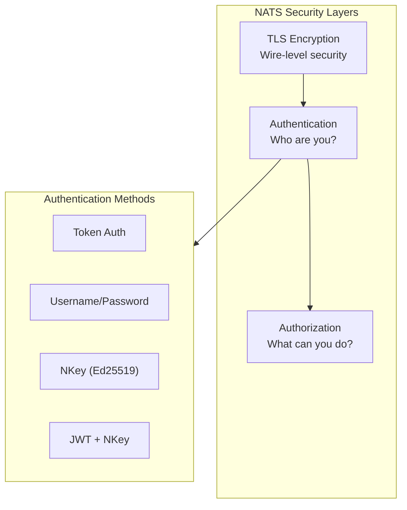
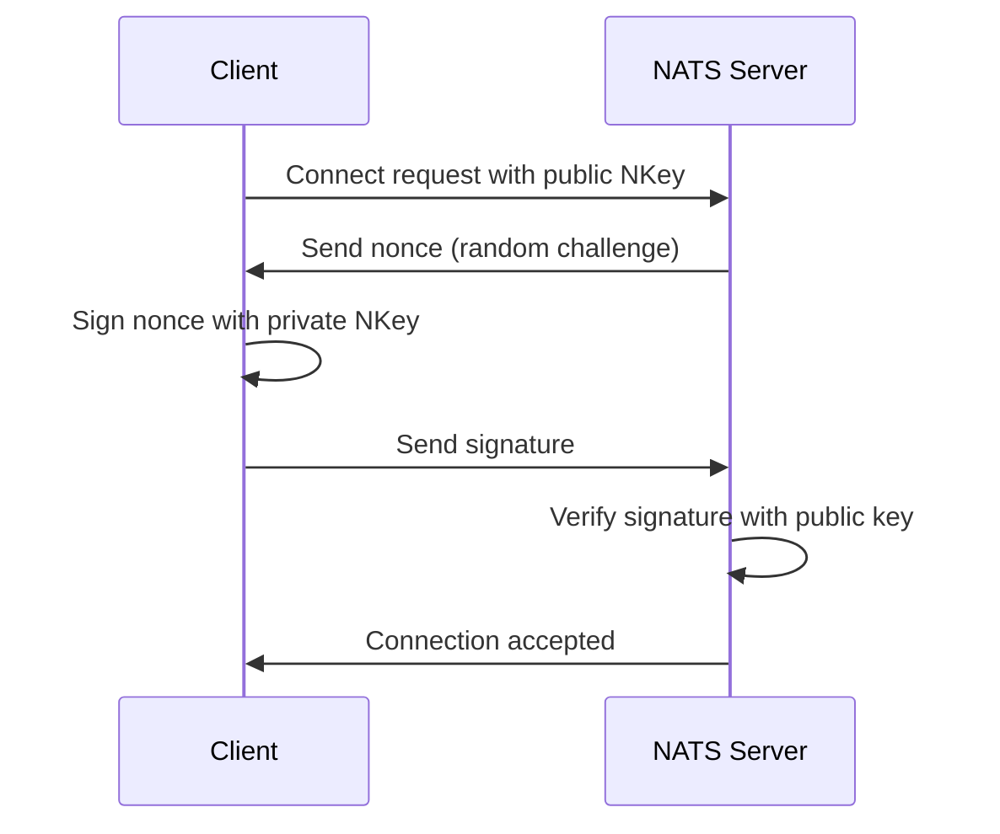
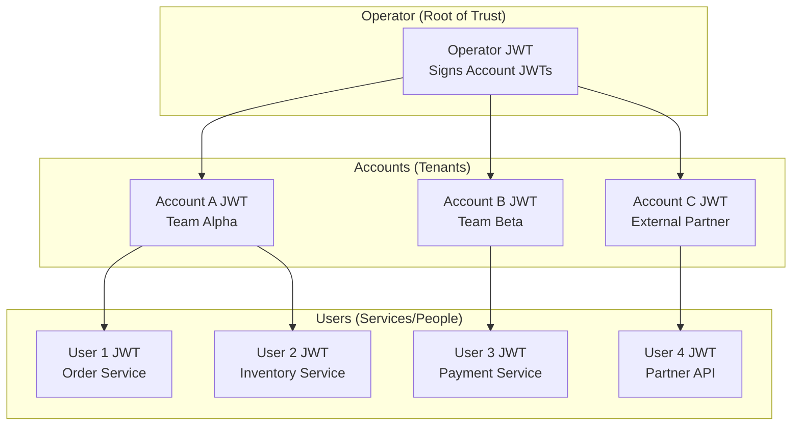
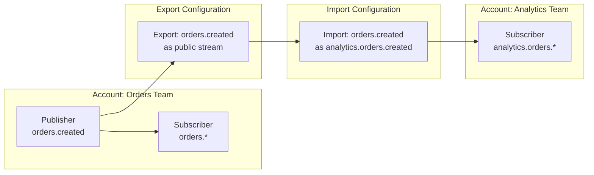

# How to Secure NATS Connections

Author: [nawazdhandala](https://www.github.com/nawazdhandala)

Tags: NATS, Security, TLS, JWT, NKey, Authentication, Authorization, Messaging, Microservices

Description: A comprehensive guide to securing NATS messaging connections using TLS encryption, JWT/NKey authentication, and the Operator/Account/User hierarchy for fine-grained authorization.

---

> "Security is not a product, but a process." - Bruce Schneier

NATS is a high-performance messaging system used by organizations like Synadia, VMware, and countless startups for building distributed systems. By default, NATS connections are unencrypted and unauthenticated - fine for development, dangerous for production. This guide covers everything you need to secure your NATS infrastructure.

## Understanding NATS Security Architecture

NATS provides a layered security model that separates concerns between encryption, authentication, and authorization.



### Security Evolution

| Method | Security Level | Use Case |
|--------|---------------|----------|
| Token | Basic | Development, simple deployments |
| Username/Password | Moderate | Small teams, internal services |
| NKey | Strong | Production without central auth |
| JWT + Operator/Account/User | Enterprise | Multi-tenant, zero-trust environments |

## TLS Configuration

TLS encrypts all communication between NATS clients and servers, preventing eavesdropping and man-in-the-middle attacks.

### Generating Certificates

First, create a Certificate Authority and server certificates.

```bash
# Create directory structure for certificates
mkdir -p nats-certs/{ca,server,client}
cd nats-certs

# Generate CA private key
# The CA key is the root of trust - protect it carefully
openssl genrsa -out ca/ca-key.pem 4096

# Generate CA certificate (valid for 10 years)
# This certificate will sign all server and client certificates
openssl req -new -x509 -days 3650 \
    -key ca/ca-key.pem \
    -out ca/ca-cert.pem \
    -subj "/CN=NATS CA/O=MyOrganization"

# Generate server private key
openssl genrsa -out server/server-key.pem 4096

# Create server certificate signing request
# Include all hostnames and IPs the server will use
openssl req -new \
    -key server/server-key.pem \
    -out server/server.csr \
    -subj "/CN=nats-server/O=MyOrganization"

# Create server certificate with SAN (Subject Alternative Names)
# This allows the certificate to be valid for multiple hostnames
cat > server/server-ext.cnf << EOF
authorityKeyIdentifier=keyid,issuer
basicConstraints=CA:FALSE
keyUsage = digitalSignature, keyEncipherment
extendedKeyUsage = serverAuth
subjectAltName = @alt_names

[alt_names]
DNS.1 = localhost
DNS.2 = nats-server
DNS.3 = nats.example.com
DNS.4 = *.nats-cluster.svc.cluster.local
IP.1 = 127.0.0.1
IP.2 = 10.0.0.1
EOF

# Sign the server certificate with the CA
openssl x509 -req -days 365 \
    -in server/server.csr \
    -CA ca/ca-cert.pem \
    -CAkey ca/ca-key.pem \
    -CAcreateserial \
    -out server/server-cert.pem \
    -extfile server/server-ext.cnf
```

### NATS Server TLS Configuration

Configure the NATS server to require TLS for all connections.

```hcl
# nats-server.conf
# NATS Server Configuration with TLS

# Server identification
server_name: "nats-prod-1"

# Listen on standard NATS port
port: 4222

# TLS Configuration
tls {
    # Path to server certificate
    cert_file: "/etc/nats/certs/server-cert.pem"

    # Path to server private key
    key_file: "/etc/nats/certs/server-key.pem"

    # Path to CA certificate for verifying client certificates
    ca_file: "/etc/nats/certs/ca-cert.pem"

    # Require clients to present valid certificates (mutual TLS)
    verify: true

    # Reject connections without client certificates
    verify_and_map: false

    # TLS handshake timeout (default: 500ms)
    timeout: 2.0

    # Minimum TLS version - never use anything below 1.2
    min_version: "1.2"

    # Preferred cipher suites (TLS 1.2)
    # These are secure, modern cipher suites
    cipher_suites: [
        "TLS_ECDHE_RSA_WITH_AES_256_GCM_SHA384",
        "TLS_ECDHE_RSA_WITH_AES_128_GCM_SHA256"
    ]

    # Curve preferences for ECDHE
    curve_preferences: [
        "X25519",
        "P-256"
    ]
}

# Logging configuration
# Enable debug logging during initial setup
debug: false
trace: false
logtime: true
log_file: "/var/log/nats/nats-server.log"
```

### Client TLS Configuration

Connect to the TLS-enabled server from various languages.

```javascript
// Node.js client with TLS
// Using the official nats.js library

const { connect } = require('nats');
const fs = require('fs');
const path = require('path');

async function connectWithTLS() {
    // Load certificates from disk
    // In production, consider using a secrets manager
    const certsPath = '/etc/nats/certs';

    const nc = await connect({
        servers: 'tls://nats.example.com:4222',

        // TLS configuration object
        tls: {
            // CA certificate to verify the server
            ca: fs.readFileSync(path.join(certsPath, 'ca-cert.pem')),

            // Client certificate for mutual TLS
            cert: fs.readFileSync(path.join(certsPath, 'client-cert.pem')),

            // Client private key
            key: fs.readFileSync(path.join(certsPath, 'client-key.pem')),

            // Verify server certificate hostname
            // Set to false only for testing with self-signed certs
            rejectUnauthorized: true
        },

        // Connection name for monitoring
        name: 'order-service',

        // Reconnection settings
        reconnect: true,
        maxReconnectAttempts: -1,  // Infinite reconnection attempts
        reconnectTimeWait: 2000,   // Wait 2 seconds between attempts
    });

    console.log(`Connected to ${nc.getServer()}`);

    // Handle connection events
    nc.closed().then(() => {
        console.log('Connection closed');
    });

    return nc;
}

// Usage example
(async () => {
    const nc = await connectWithTLS();

    // Publish a message
    nc.publish('orders.created', JSON.stringify({
        orderId: '12345',
        amount: 99.99
    }));

    // Subscribe to messages
    const sub = nc.subscribe('orders.*');
    for await (const msg of sub) {
        console.log(`Received: ${msg.subject} - ${msg.data}`);
    }
})();
```

```go
// Go client with TLS
package main

import (
    "crypto/tls"
    "crypto/x509"
    "log"
    "os"
    "time"

    "github.com/nats-io/nats.go"
)

func connectWithTLS() (*nats.Conn, error) {
    // Load CA certificate
    caCert, err := os.ReadFile("/etc/nats/certs/ca-cert.pem")
    if err != nil {
        return nil, err
    }

    // Create certificate pool and add CA
    caCertPool := x509.NewCertPool()
    caCertPool.AppendCertsFromPEM(caCert)

    // Load client certificate and key for mutual TLS
    clientCert, err := tls.LoadX509KeyPair(
        "/etc/nats/certs/client-cert.pem",
        "/etc/nats/certs/client-key.pem",
    )
    if err != nil {
        return nil, err
    }

    // Create TLS configuration
    tlsConfig := &tls.Config{
        // Root CAs to verify server certificate
        RootCAs: caCertPool,

        // Client certificates for mutual TLS
        Certificates: []tls.Certificate{clientCert},

        // Minimum TLS version
        MinVersion: tls.VersionTLS12,

        // Server name for certificate verification
        // Must match a SAN in the server certificate
        ServerName: "nats.example.com",
    }

    // Connect with TLS and additional options
    nc, err := nats.Connect(
        "tls://nats.example.com:4222",

        // Apply TLS configuration
        nats.Secure(tlsConfig),

        // Connection name for monitoring
        nats.Name("inventory-service"),

        // Reconnection behavior
        nats.ReconnectWait(2*time.Second),
        nats.MaxReconnects(-1),

        // Event handlers for observability
        nats.DisconnectErrHandler(func(nc *nats.Conn, err error) {
            log.Printf("Disconnected: %v", err)
        }),
        nats.ReconnectHandler(func(nc *nats.Conn) {
            log.Printf("Reconnected to %s", nc.ConnectedUrl())
        }),
    )

    return nc, err
}

func main() {
    nc, err := connectWithTLS()
    if err != nil {
        log.Fatal(err)
    }
    defer nc.Close()

    log.Printf("Connected to NATS: %s", nc.ConnectedUrl())
}
```

## NKey Authentication

NKeys use Ed25519 cryptographic signatures for authentication. They are more secure than passwords because the private key never leaves the client.



### Generating NKeys

```bash
# Install the nk tool for generating NKeys
go install github.com/nats-io/nkeys/nk@latest

# Generate a user NKey pair
# The seed (private key) starts with 'SU'
# The public key starts with 'U'
nk -gen user -pubout

# Example output:
# SUACSSL3UAHUDXKFSNVUZRF5UHPMWZ6BFDTJ7M6USDXIEDNPPQYYYCU3VY  <- Seed (keep secret!)
# UAHJZB6POOHSHCE7XHWW4INJHZK4X5H2ACJMQVQGVZDFM2LRMW6AJTJU  <- Public key

# Generate a server NKey (for cluster authentication)
# Server seeds start with 'SN', public keys start with 'N'
nk -gen server -pubout

# Generate an account NKey (for multi-tenant setups)
# Account seeds start with 'SA', public keys start with 'A'
nk -gen account -pubout

# Generate an operator NKey (root of trust)
# Operator seeds start with 'SO', public keys start with 'O'
nk -gen operator -pubout
```

### NKey Server Configuration

```hcl
# nats-server.conf
# Server configuration with NKey authentication

port: 4222

# Enable TLS (always use with authentication)
tls {
    cert_file: "/etc/nats/certs/server-cert.pem"
    key_file: "/etc/nats/certs/server-key.pem"
    ca_file: "/etc/nats/certs/ca-cert.pem"
}

# Authorization with NKeys
authorization {
    # Define users by their public NKey
    users: [
        {
            # Order service - can publish and subscribe to orders.*
            nkey: "UAHJZB6POOHSHCE7XHWW4INJHZK4X5H2ACJMQVQGVZDFM2LRMW6AJTJU"
            permissions: {
                publish: {
                    allow: ["orders.*", "orders.>"]
                }
                subscribe: {
                    allow: ["orders.*", "orders.>", "_INBOX.>"]
                }
            }
        },
        {
            # Inventory service - can publish inventory updates
            nkey: "UBXYZ123ABCDEF456789GHIJKLMNOPQRSTUVWXYZ123456789"
            permissions: {
                publish: {
                    allow: ["inventory.*"]
                }
                subscribe: {
                    allow: ["inventory.*", "orders.shipped", "_INBOX.>"]
                }
            }
        },
        {
            # Admin user - full access for operations
            nkey: "UADMIN123FULLACCESS456789OPERATIONS123456789ABC"
            # No permissions block = full access to everything
        }
    ]
}
```

### Client NKey Authentication

```python
# Python client with NKey authentication
import nats
import asyncio
from nats.nkeys import from_seed

async def connect_with_nkey():
    # Load the NKey seed from a secure location
    # Never hardcode seeds in source code!
    # In production, use environment variables or a secrets manager

    # Option 1: Load from file
    with open('/etc/nats/nkeys/order-service.nk', 'r') as f:
        seed = f.read().strip()

    # Option 2: Load from environment variable
    # import os
    # seed = os.environ.get('NATS_NKEY_SEED')

    # Create the NKey user from seed
    user = from_seed(seed.encode())

    async def sign_callback(nonce: bytes) -> bytes:
        """
        Callback function to sign the server's nonce.
        This proves we possess the private key without revealing it.
        """
        return user.sign(nonce)

    # Connect using the NKey
    nc = await nats.connect(
        servers=['tls://nats.example.com:4222'],

        # NKey authentication
        nkeys_seed=seed,
        signature_cb=sign_callback,

        # TLS settings (required for secure NKey auth)
        tls={
            'ca_file': '/etc/nats/certs/ca-cert.pem',
            'cert_file': '/etc/nats/certs/client-cert.pem',
            'key_file': '/etc/nats/certs/client-key.pem',
        },

        # Connection metadata
        name='order-service-python',

        # Error handling
        error_cb=lambda e: print(f'Error: {e}'),
        disconnected_cb=lambda: print('Disconnected'),
        reconnected_cb=lambda: print('Reconnected'),
    )

    print(f'Connected to NATS at {nc.connected_url.netloc}')
    return nc


async def main():
    nc = await connect_with_nkey()

    # Subscribe to order events
    async def order_handler(msg):
        subject = msg.subject
        data = msg.data.decode()
        print(f'Received on {subject}: {data}')

    await nc.subscribe('orders.*', cb=order_handler)

    # Publish an order
    await nc.publish('orders.created', b'{"orderId": "12345"}')

    # Keep running
    await asyncio.sleep(3600)
    await nc.close()


if __name__ == '__main__':
    asyncio.run(main())
```

## JWT Authentication with Operator/Account/User Hierarchy

For enterprise deployments, NATS supports a hierarchical trust model using JWTs. This enables true multi-tenancy and decentralized administration.



### Creating the Operator

The operator is the root of trust. Guard the operator key carefully.

```bash
# Install NSC (NATS Security CLI)
go install github.com/nats-io/nsc/v2@latest

# Initialize a new operator
# This creates the operator and stores keys in ~/.local/share/nats/nsc
nsc add operator --name MyCompany

# The operator key is automatically generated
# View the operator details
nsc describe operator

# Add a signing key for the operator (best practice)
# This allows you to rotate keys without recreating everything
nsc edit operator --sk generate

# Export the operator JWT for the NATS server
nsc describe operator --raw > /etc/nats/jwt/operator.jwt
```

### Creating Accounts

Accounts provide namespace isolation between tenants.

```bash
# Create account for Team Alpha (internal team)
nsc add account --name TeamAlpha

# Set account limits
nsc edit account --name TeamAlpha \
    --js-mem-storage 1G \
    --js-disk-storage 10G \
    --js-streams 100 \
    --js-consumer 1000 \
    --conns 500

# Create account for external partner with stricter limits
nsc add account --name ExternalPartner
nsc edit account --name ExternalPartner \
    --js-mem-storage 100M \
    --js-disk-storage 1G \
    --js-streams 10 \
    --conns 50

# Enable exports from TeamAlpha (share subjects with other accounts)
nsc add export --account TeamAlpha \
    --name "PublicOrders" \
    --subject "orders.public.>" \
    --service

# Enable imports to ExternalPartner (consume shared subjects)
nsc add import --account ExternalPartner \
    --name "PublicOrders" \
    --src-account TeamAlpha \
    --remote-subject "orders.public.>" \
    --local-subject "partner.orders.>"

# Export account JWTs
nsc describe account TeamAlpha --raw > /etc/nats/jwt/accounts/TeamAlpha.jwt
nsc describe account ExternalPartner --raw > /etc/nats/jwt/accounts/ExternalPartner.jwt
```

### Creating Users

Users represent individual services or people within an account.

```bash
# Create a user for the order service in TeamAlpha
nsc add user --account TeamAlpha --name order-service

# Set user permissions
nsc edit user --account TeamAlpha --name order-service \
    --allow-pub "orders.>" \
    --allow-pub "_INBOX.>" \
    --allow-sub "orders.>" \
    --allow-sub "inventory.updates" \
    --allow-sub "_INBOX.>"

# Create a user for the inventory service
nsc add user --account TeamAlpha --name inventory-service
nsc edit user --account TeamAlpha --name inventory-service \
    --allow-pub "inventory.>" \
    --allow-pub "_INBOX.>" \
    --allow-sub "inventory.>" \
    --allow-sub "orders.shipped" \
    --allow-sub "_INBOX.>"

# Create a read-only monitoring user
nsc add user --account TeamAlpha --name monitoring
nsc edit user --account TeamAlpha --name monitoring \
    --deny-pub ">" \
    --allow-sub ">"

# Generate credentials file for a user
# This file contains both the JWT and the NKey seed
nsc generate creds --account TeamAlpha --name order-service \
    > /etc/nats/creds/order-service.creds

# View user details
nsc describe user --account TeamAlpha --name order-service
```

### Server Configuration for JWT Auth

```hcl
# nats-server.conf
# NATS Server with JWT/Account resolution

port: 4222

# TLS is mandatory for JWT authentication
tls {
    cert_file: "/etc/nats/certs/server-cert.pem"
    key_file: "/etc/nats/certs/server-key.pem"
    ca_file: "/etc/nats/certs/ca-cert.pem"
    verify: true
}

# Operator configuration
operator: "/etc/nats/jwt/operator.jwt"

# System account for NATS internal operations
system_account: "AASYSTEMACCOUNTPUBLICKEY123456789ABCDEFGHIJ"

# Account resolver - how to find account JWTs
resolver: {
    type: full

    # Directory containing account JWTs
    dir: "/etc/nats/jwt/accounts"

    # Allow deletion of accounts
    allow_delete: false

    # Interval to check for updates
    interval: "2m"
}

# Alternative: Use NATS Account Server for dynamic resolution
# resolver: URL(http://account-server.internal:9090/jwt/v1/accounts/)

# JetStream configuration
jetstream {
    store_dir: "/var/nats/jetstream"
    max_memory_store: 4G
    max_file_store: 100G
}

# Logging
debug: false
trace: false
logtime: true
log_file: "/var/log/nats/nats-server.log"
```

### Connecting with JWT Credentials

```javascript
// Node.js client with JWT credentials file
const { connect, credsAuthenticator } = require('nats');
const fs = require('fs');

async function connectWithJWT() {
    // Read the credentials file
    // This file contains both the JWT and the NKey seed
    const credsFile = fs.readFileSync('/etc/nats/creds/order-service.creds');

    const nc = await connect({
        servers: 'tls://nats.example.com:4222',

        // Use the credentials file for authentication
        authenticator: credsAuthenticator(credsFile),

        // TLS configuration
        tls: {
            ca: fs.readFileSync('/etc/nats/certs/ca-cert.pem'),
        },

        // Connection settings
        name: 'order-service',
        reconnect: true,
        maxReconnectAttempts: -1,
    });

    console.log(`Connected as order-service to ${nc.getServer()}`);

    // The permissions in the JWT are automatically enforced
    // Attempting to publish to unauthorized subjects will fail

    // This will work (allowed in JWT)
    nc.publish('orders.created', JSON.stringify({ orderId: '123' }));

    // This will fail with authorization error (not allowed in JWT)
    try {
        nc.publish('payments.process', JSON.stringify({ amount: 100 }));
        await nc.flush();
    } catch (err) {
        console.error('Authorization error:', err.message);
    }

    return nc;
}
```

## Authorization with Accounts

Accounts provide complete isolation between different teams or tenants. Each account has its own subject namespace.



### Subject-Based Permissions

Understanding NATS subject wildcards is essential for permissions.

```hcl
# nats-server.conf
# Detailed permission examples

authorization {
    users: [
        {
            user: "payment-service"
            password: "$2a$11$HASHEDPASSWORD"

            permissions: {
                publish: {
                    # Allowed subjects
                    allow: [
                        "payments.*",           # All payment events
                        "notifications.payment" # Can trigger notifications
                    ]

                    # Denied subjects (takes precedence over allow)
                    deny: [
                        "payments.admin.*"      # Cannot use admin endpoints
                    ]
                }

                subscribe: {
                    allow: [
                        "payments.*",
                        "orders.paid",          # Listen for paid orders
                        "orders.refund.requested",
                        "_INBOX.>"              # Required for request/reply
                    ]

                    # Limit queue group subscriptions
                    deny: [
                        "payments.admin.*"
                    ]
                }

                # Response permissions (for services)
                # Allow responses to requests from specific subjects
                allow_responses: {
                    max: 1        # Max responses per request
                    expires: "5s" # Response window
                }
            }
        },

        {
            user: "audit-service"
            password: "$2a$11$HASHEDPASSWORD"

            permissions: {
                # Read-only access to everything
                publish: {
                    deny: [">"]  # Cannot publish anywhere
                }
                subscribe: {
                    allow: [">"] # Can subscribe to everything
                }
            }
        }
    ]
}
```

### Wildcard Patterns

```text
# NATS Subject Wildcard Reference

# Single token wildcard: *
orders.*        # Matches: orders.created, orders.updated
                # No match: orders.us.created (multiple tokens)

# Multi-token wildcard: >
orders.>        # Matches: orders.created, orders.us.east.created
                # Must be at the end of subject

# Examples:
events.*.created    # events.orders.created, events.users.created
logs.production.>   # logs.production.app1.error, logs.production.db.slow
```

## Complete Production Configuration

Here is a complete, production-ready NATS configuration combining all security features.

```hcl
# /etc/nats/nats-server.conf
# Production NATS Server Configuration

# Server identity
server_name: "nats-prod-1"
server_tags: ["region:us-east", "env:production"]

# Network configuration
host: "0.0.0.0"
port: 4222

# Client TLS (required)
tls {
    cert_file: "/etc/nats/certs/server-cert.pem"
    key_file: "/etc/nats/certs/server-key.pem"
    ca_file: "/etc/nats/certs/ca-cert.pem"
    verify: true
    verify_and_map: true
    timeout: 2.0
    min_version: "1.2"
    cipher_suites: [
        "TLS_ECDHE_RSA_WITH_AES_256_GCM_SHA384",
        "TLS_ECDHE_RSA_WITH_AES_128_GCM_SHA256"
    ]
}

# JWT/Account authentication
operator: "/etc/nats/jwt/operator.jwt"
system_account: "AASYSTEMACCOUNTPUBLICKEY123456789ABCDEFGHIJ"

resolver: {
    type: full
    dir: "/etc/nats/jwt/accounts"
    allow_delete: false
    interval: "2m"
}

# Cluster configuration (for HA)
cluster {
    name: "nats-prod"
    host: "0.0.0.0"
    port: 6222

    # Cluster TLS
    tls {
        cert_file: "/etc/nats/certs/cluster-cert.pem"
        key_file: "/etc/nats/certs/cluster-key.pem"
        ca_file: "/etc/nats/certs/ca-cert.pem"
        verify: true
    }

    # Cluster routes
    routes: [
        "tls://nats-prod-1.internal:6222"
        "tls://nats-prod-2.internal:6222"
        "tls://nats-prod-3.internal:6222"
    ]

    # Cluster authentication with NKeys
    authorization {
        user: "NCLUSTERPUBLICNKEY123456789ABCDEFGHIJKLMNO"
        timeout: 2
    }
}

# JetStream configuration
jetstream {
    store_dir: "/var/nats/jetstream"
    max_memory_store: 4G
    max_file_store: 100G

    # Encryption at rest
    cipher: "aes"
    key: "/etc/nats/jetstream.key"
}

# Monitoring endpoints
http_port: 8222

# Connection limits
max_connections: 10000
max_payload: 8MB
max_pending: 64MB

# Timeouts
ping_interval: "2m"
ping_max: 2
write_deadline: "10s"

# Logging
debug: false
trace: false
logtime: true
log_file: "/var/log/nats/nats-server.log"
log_size_limit: 100MB

# OCSP stapling for certificate validation
ocsp {
    mode: always
    url: "http://ocsp.example.com"
}
```

## Monitoring NATS Security with OneUptime

Securing your NATS infrastructure is only half the battle. You need continuous monitoring to detect anomalies, unauthorized access attempts, and performance degradation.

[OneUptime](https://oneuptime.com) provides comprehensive monitoring for your NATS deployment:

- **Connection Monitoring**: Track connection counts, authentication failures, and TLS handshake errors
- **Alerting**: Get notified when security events occur (failed auth attempts, certificate expiry)
- **Metrics Dashboards**: Visualize message rates, latency, and resource usage
- **Log Aggregation**: Centralize NATS logs for security audit and forensics
- **Uptime Monitoring**: Ensure your NATS cluster is always available

```javascript
// Export NATS metrics to OneUptime
const { connect } = require('nats');

async function setupMonitoring(nc) {
    // Fetch NATS server stats periodically
    setInterval(async () => {
        const stats = nc.stats();

        // Log metrics for OneUptime collection
        console.log(JSON.stringify({
            type: 'nats_metrics',
            timestamp: new Date().toISOString(),
            connections: stats.inMsgs,
            messagesIn: stats.inMsgs,
            messagesOut: stats.outMsgs,
            bytesIn: stats.inBytes,
            bytesOut: stats.outBytes,
            reconnects: stats.reconnects,
        }));
    }, 60000);
}
```

## Security Checklist

Before deploying NATS to production, verify these security controls:

- [ ] TLS enabled with certificates from a trusted CA
- [ ] Minimum TLS version set to 1.2 or higher
- [ ] Strong cipher suites configured
- [ ] Client certificate verification enabled (mutual TLS)
- [ ] Authentication enabled (NKey or JWT)
- [ ] Authorization rules defined for all users/services
- [ ] Operator/Account/User hierarchy implemented for multi-tenancy
- [ ] JetStream encryption at rest enabled
- [ ] Cluster communication secured with TLS
- [ ] Monitoring endpoints protected or disabled
- [ ] Log aggregation configured for security events
- [ ] Certificate rotation process documented
- [ ] Credentials stored securely (not in source control)
- [ ] Regular security audits scheduled

---

NATS security is not optional in production. Start with TLS to encrypt the wire, add NKey authentication to verify identity, and implement the Operator/Account/User hierarchy for enterprise-grade authorization. Combined with monitoring from [OneUptime](https://oneuptime.com), you will have a secure, observable messaging infrastructure ready for any scale.
