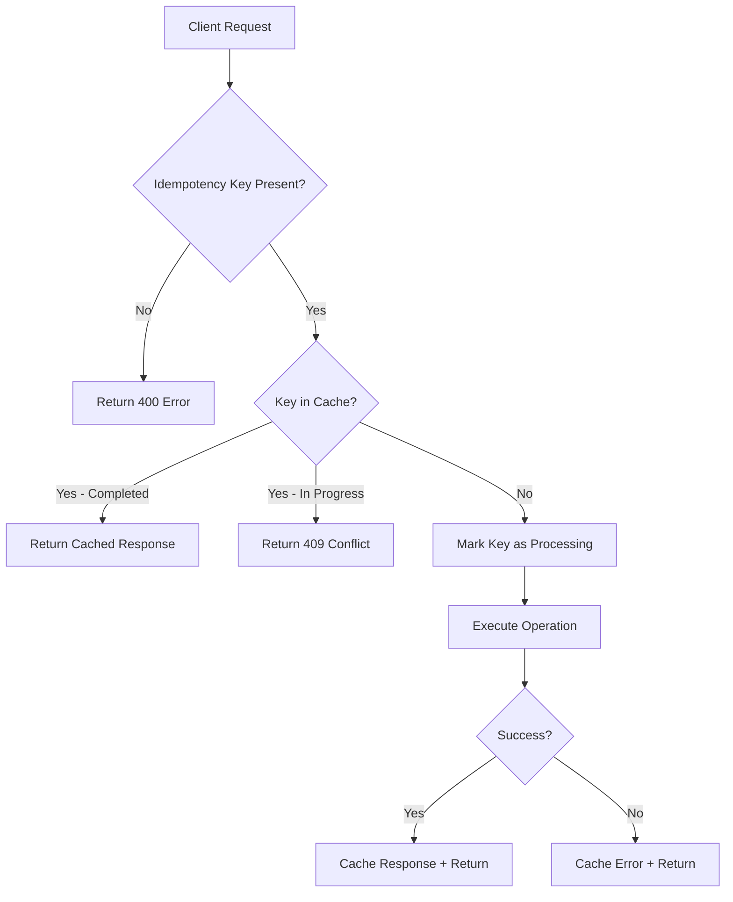

# How to Implement Idempotency Keys in Node.js APIs

Author: [nawazdhandala](https://www.github.com/nawazdhandala)

Tags: NodeJS, API, Idempotency, Reliability, TypeScript, Backend

Description: Learn how to implement idempotency keys in Node.js APIs to safely handle retries, prevent duplicate operations, and build reliable distributed systems.

---

Network failures happen. Timeouts occur. Clients retry requests. Without idempotency, each retry might create duplicate records, process payments twice, or send multiple emails. Idempotency keys let clients safely retry requests with the guarantee that the same operation will not execute twice.

Stripe, PayPal, and other payment APIs rely on idempotency keys to prevent double charges. This guide shows you how to implement the same pattern in your Node.js APIs.

## What Is Idempotency?

An operation is idempotent if performing it multiple times produces the same result as performing it once. GET requests are naturally idempotent. POST requests that create resources are not.

Idempotency keys solve this by:

1. Client sends a unique key with the request
2. Server checks if it has seen this key before
3. If yes, return the cached response
4. If no, process the request and cache the response



## Basic In-Memory Implementation

Start with a simple implementation using a Map:

```typescript
// idempotency-store.ts

interface IdempotencyRecord {
  status: 'processing' | 'completed' | 'failed';
  response?: {
    statusCode: number;
    body: any;
    headers: Record<string, string>;
  };
  createdAt: Date;
  completedAt?: Date;
  requestHash: string;  // Hash of request body to detect misuse
}

class InMemoryIdempotencyStore {
  private records: Map<string, IdempotencyRecord> = new Map();
  private ttlMs: number;
  private cleanupInterval: NodeJS.Timeout;

  constructor(ttlMs: number = 24 * 60 * 60 * 1000) {  // 24 hours default
    this.ttlMs = ttlMs;

    // Clean up expired records periodically
    this.cleanupInterval = setInterval(() => this.cleanup(), 60 * 60 * 1000);
  }

  get(key: string): IdempotencyRecord | undefined {
    return this.records.get(key);
  }

  set(key: string, record: IdempotencyRecord): void {
    this.records.set(key, record);
  }

  delete(key: string): void {
    this.records.delete(key);
  }

  private cleanup(): void {
    const cutoff = Date.now() - this.ttlMs;

    for (const [key, record] of this.records.entries()) {
      if (record.createdAt.getTime() < cutoff) {
        this.records.delete(key);
      }
    }
  }

  stop(): void {
    clearInterval(this.cleanupInterval);
  }
}

export const idempotencyStore = new InMemoryIdempotencyStore();
```

## Express Middleware

Create middleware that handles idempotency for all protected routes:

```typescript
// idempotency-middleware.ts
import { Request, Response, NextFunction } from 'express';
import crypto from 'crypto';
import { idempotencyStore } from './idempotency-store';

interface IdempotencyOptions {
  headerName?: string;
  requiredForMethods?: string[];
  ttlMs?: number;
}

const defaultOptions: IdempotencyOptions = {
  headerName: 'Idempotency-Key',
  requiredForMethods: ['POST', 'PUT', 'PATCH'],
  ttlMs: 24 * 60 * 60 * 1000,
};

// Hash the request body to detect key reuse with different payloads
function hashRequest(body: any): string {
  const content = JSON.stringify(body) || '';
  return crypto.createHash('sha256').update(content).digest('hex');
}

export function idempotencyMiddleware(options: IdempotencyOptions = {}) {
  const config = { ...defaultOptions, ...options };

  return async (req: Request, res: Response, next: NextFunction) => {
    // Skip methods that do not need idempotency
    if (!config.requiredForMethods?.includes(req.method)) {
      return next();
    }

    const idempotencyKey = req.headers[config.headerName!.toLowerCase()] as string;

    // Require idempotency key for protected methods
    if (!idempotencyKey) {
      return res.status(400).json({
        error: 'Missing idempotency key',
        message: `The ${config.headerName} header is required for ${req.method} requests`,
      });
    }

    // Validate key format (UUID recommended)
    if (!/^[a-zA-Z0-9-_]{16,64}$/.test(idempotencyKey)) {
      return res.status(400).json({
        error: 'Invalid idempotency key format',
        message: 'Key must be 16-64 alphanumeric characters, hyphens, or underscores',
      });
    }

    // Create a composite key including the endpoint
    const compositeKey = `${req.method}:${req.path}:${idempotencyKey}`;
    const requestHash = hashRequest(req.body);

    // Check for existing record
    const existing = idempotencyStore.get(compositeKey);

    if (existing) {
      // Verify request body matches (detect key reuse with different payload)
      if (existing.requestHash !== requestHash) {
        return res.status(422).json({
          error: 'Idempotency key reused with different request',
          message: 'Each unique request must use a unique idempotency key',
        });
      }

      // Request is still processing
      if (existing.status === 'processing') {
        return res.status(409).json({
          error: 'Request in progress',
          message: 'A request with this idempotency key is currently being processed',
        });
      }

      // Return cached response
      if (existing.response) {
        // Set headers to indicate cached response
        res.set('Idempotent-Replayed', 'true');

        for (const [key, value] of Object.entries(existing.response.headers)) {
          res.set(key, value);
        }

        return res.status(existing.response.statusCode).json(existing.response.body);
      }
    }

    // Mark request as processing
    idempotencyStore.set(compositeKey, {
      status: 'processing',
      requestHash,
      createdAt: new Date(),
    });

    // Store original response methods
    const originalJson = res.json.bind(res);
    const originalSend = res.send.bind(res);

    // Intercept response to cache it
    const captureResponse = (body: any) => {
      const record = idempotencyStore.get(compositeKey);

      if (record && record.status === 'processing') {
        // Determine if successful based on status code
        const isSuccess = res.statusCode >= 200 && res.statusCode < 300;

        idempotencyStore.set(compositeKey, {
          ...record,
          status: isSuccess ? 'completed' : 'failed',
          response: {
            statusCode: res.statusCode,
            body,
            headers: {
              'Content-Type': res.get('Content-Type') || 'application/json',
            },
          },
          completedAt: new Date(),
        });
      }

      return body;
    };

    // Override response methods
    res.json = (body: any) => {
      captureResponse(body);
      return originalJson(body);
    };

    res.send = (body: any) => {
      if (typeof body === 'object') {
        captureResponse(body);
      }
      return originalSend(body);
    };

    // Handle errors - clear processing state
    res.on('error', () => {
      idempotencyStore.delete(compositeKey);
    });

    next();
  };
}
```

## Redis-Based Store for Production

In-memory storage does not work with multiple server instances. Use Redis instead:

```typescript
// redis-idempotency-store.ts
import { createClient, RedisClientType } from 'redis';

interface IdempotencyRecord {
  status: 'processing' | 'completed' | 'failed';
  response?: {
    statusCode: number;
    body: any;
    headers: Record<string, string>;
  };
  requestHash: string;
  createdAt: string;
  completedAt?: string;
}

class RedisIdempotencyStore {
  private client: RedisClientType;
  private ttlSeconds: number;
  private prefix: string;

  constructor(redisUrl: string, ttlSeconds: number = 86400) {
    this.client = createClient({ url: redisUrl });
    this.ttlSeconds = ttlSeconds;
    this.prefix = 'idempotency:';
  }

  async connect(): Promise<void> {
    await this.client.connect();
  }

  async get(key: string): Promise<IdempotencyRecord | null> {
    const data = await this.client.get(this.prefix + key);
    return data ? JSON.parse(data) : null;
  }

  async set(key: string, record: IdempotencyRecord): Promise<void> {
    await this.client.setEx(
      this.prefix + key,
      this.ttlSeconds,
      JSON.stringify(record)
    );
  }

  // Atomic set-if-not-exists for race condition prevention
  async setIfNotExists(key: string, record: IdempotencyRecord): Promise<boolean> {
    const result = await this.client.set(
      this.prefix + key,
      JSON.stringify(record),
      {
        NX: true,  // Only set if not exists
        EX: this.ttlSeconds,
      }
    );
    return result === 'OK';
  }

  async delete(key: string): Promise<void> {
    await this.client.del(this.prefix + key);
  }

  async disconnect(): Promise<void> {
    await this.client.disconnect();
  }
}

export const redisIdempotencyStore = new RedisIdempotencyStore(
  process.env.REDIS_URL || 'redis://localhost:6379'
);
```

Update the middleware to use Redis with proper locking:

```typescript
// redis-idempotency-middleware.ts
import { Request, Response, NextFunction } from 'express';
import crypto from 'crypto';
import { redisIdempotencyStore } from './redis-idempotency-store';

export function redisIdempotencyMiddleware() {
  return async (req: Request, res: Response, next: NextFunction) => {
    if (!['POST', 'PUT', 'PATCH'].includes(req.method)) {
      return next();
    }

    const idempotencyKey = req.headers['idempotency-key'] as string;
    if (!idempotencyKey) {
      return res.status(400).json({ error: 'Missing Idempotency-Key header' });
    }

    const compositeKey = `${req.method}:${req.path}:${idempotencyKey}`;
    const requestHash = crypto
      .createHash('sha256')
      .update(JSON.stringify(req.body) || '')
      .digest('hex');

    // Try to acquire lock atomically
    const acquired = await redisIdempotencyStore.setIfNotExists(compositeKey, {
      status: 'processing',
      requestHash,
      createdAt: new Date().toISOString(),
    });

    if (!acquired) {
      // Key exists - check if completed or still processing
      const existing = await redisIdempotencyStore.get(compositeKey);

      if (!existing) {
        // Race condition - key was deleted between check and get
        return res.status(500).json({ error: 'Please retry' });
      }

      if (existing.requestHash !== requestHash) {
        return res.status(422).json({
          error: 'Idempotency key reused with different request',
        });
      }

      if (existing.status === 'processing') {
        return res.status(409).json({
          error: 'Request in progress',
          retryAfter: 1,
        });
      }

      if (existing.response) {
        res.set('Idempotent-Replayed', 'true');
        return res.status(existing.response.statusCode).json(existing.response.body);
      }
    }

    // Intercept response
    const originalJson = res.json.bind(res);

    res.json = async (body: any) => {
      await redisIdempotencyStore.set(compositeKey, {
        status: res.statusCode < 400 ? 'completed' : 'failed',
        requestHash,
        createdAt: new Date().toISOString(),
        completedAt: new Date().toISOString(),
        response: {
          statusCode: res.statusCode,
          body,
          headers: {},
        },
      });

      return originalJson(body);
    };

    next();
  };
}
```

## Complete API Example

Here is a full Express application with idempotency:

```typescript
// app.ts
import express from 'express';
import { v4 as uuidv4 } from 'uuid';
import { idempotencyMiddleware } from './idempotency-middleware';

const app = express();
app.use(express.json());

// Apply idempotency to all routes
app.use(idempotencyMiddleware());

// Simulated database
const orders: Map<string, any> = new Map();
const payments: Map<string, any> = new Map();

// Create order endpoint
app.post('/orders', async (req, res) => {
  const { customerId, items, total } = req.body;

  // Simulate processing delay
  await new Promise(r => setTimeout(r, 1000));

  // Create order
  const orderId = uuidv4();
  const order = {
    id: orderId,
    customerId,
    items,
    total,
    status: 'created',
    createdAt: new Date().toISOString(),
  };

  orders.set(orderId, order);

  res.status(201).json({
    success: true,
    order,
  });
});

// Process payment endpoint
app.post('/payments', async (req, res) => {
  const { orderId, amount, paymentMethod } = req.body;

  // Validate order exists
  const order = orders.get(orderId);
  if (!order) {
    return res.status(404).json({ error: 'Order not found' });
  }

  // Simulate payment processing
  await new Promise(r => setTimeout(r, 2000));

  // Create payment record
  const paymentId = uuidv4();
  const payment = {
    id: paymentId,
    orderId,
    amount,
    paymentMethod,
    status: 'completed',
    processedAt: new Date().toISOString(),
  };

  payments.set(paymentId, payment);

  // Update order status
  order.status = 'paid';
  order.paymentId = paymentId;

  res.status(201).json({
    success: true,
    payment,
  });
});

// Get endpoints (no idempotency needed)
app.get('/orders/:id', (req, res) => {
  const order = orders.get(req.params.id);
  if (!order) {
    return res.status(404).json({ error: 'Order not found' });
  }
  res.json(order);
});

app.listen(3000, () => {
  console.log('Server running on port 3000');
});
```

## Client Usage

Here is how clients should use idempotency keys:

```typescript
// client-example.ts
import { v4 as uuidv4 } from 'uuid';

async function createOrderWithRetry(orderData: any, maxRetries: number = 3) {
  // Generate idempotency key once for all retries
  const idempotencyKey = uuidv4();

  let lastError: Error | null = null;

  for (let attempt = 1; attempt <= maxRetries; attempt++) {
    try {
      const response = await fetch('http://localhost:3000/orders', {
        method: 'POST',
        headers: {
          'Content-Type': 'application/json',
          'Idempotency-Key': idempotencyKey,  // Same key for all retries
        },
        body: JSON.stringify(orderData),
      });

      // Handle specific status codes
      if (response.status === 409) {
        // Request still processing - wait and retry
        console.log(`Attempt ${attempt}: Request in progress, waiting...`);
        await new Promise(r => setTimeout(r, 2000));
        continue;
      }

      if (!response.ok) {
        throw new Error(`HTTP ${response.status}: ${await response.text()}`);
      }

      const data = await response.json();

      // Check if this was a replayed response
      if (response.headers.get('Idempotent-Replayed') === 'true') {
        console.log('Received cached response from previous request');
      }

      return data;
    } catch (error) {
      lastError = error as Error;
      console.log(`Attempt ${attempt} failed: ${lastError.message}`);

      if (attempt < maxRetries) {
        // Exponential backoff
        await new Promise(r => setTimeout(r, Math.pow(2, attempt) * 1000));
      }
    }
  }

  throw lastError;
}

// Usage
async function main() {
  try {
    const order = await createOrderWithRetry({
      customerId: 'cust-123',
      items: [{ sku: 'ITEM-001', quantity: 2 }],
      total: 99.99,
    });

    console.log('Order created:', order);
  } catch (error) {
    console.error('Failed to create order:', error);
  }
}

main();
```

## Handling Edge Cases

Several edge cases need careful handling:

```typescript
// edge-cases.ts

// 1. Request timeout during processing
// The client might retry before the server finishes
// Solution: Return 409 and let client poll or wait

// 2. Server crash during processing
// The record stays in "processing" state forever
// Solution: Add a timeout for processing records

async function cleanupStaleRecords(store: RedisIdempotencyStore, maxProcessingMs: number = 30000) {
  // This would need to scan Redis keys (not efficient at scale)
  // Better approach: use Redis sorted sets with timestamps
}

// 3. Different response for same key
// Can happen if the operation is not truly idempotent
// Example: Creating an order with timestamp - each call would have different timestamp
// Solution: The original response is always returned

// 4. Partial failures
// What if the operation partially succeeds?
// Example: Order created but payment failed
// Solution: Design operations to be atomic or use saga pattern

// 5. Key collision between different clients
// Solution: Include client ID in the composite key

function createCompositeKey(clientId: string, req: Request, idempotencyKey: string): string {
  return `${clientId}:${req.method}:${req.path}:${idempotencyKey}`;
}
```

## Testing Idempotency

Write tests to verify the behavior:

```typescript
// idempotency.test.ts
import request from 'supertest';
import { app } from './app';
import { v4 as uuidv4 } from 'uuid';

describe('Idempotency', () => {
  it('should return same response for duplicate requests', async () => {
    const idempotencyKey = uuidv4();
    const orderData = { customerId: 'test', items: [], total: 100 };

    // First request
    const res1 = await request(app)
      .post('/orders')
      .set('Idempotency-Key', idempotencyKey)
      .send(orderData);

    expect(res1.status).toBe(201);
    const orderId = res1.body.order.id;

    // Second request with same key
    const res2 = await request(app)
      .post('/orders')
      .set('Idempotency-Key', idempotencyKey)
      .send(orderData);

    expect(res2.status).toBe(201);
    expect(res2.body.order.id).toBe(orderId);  // Same order ID
    expect(res2.headers['idempotent-replayed']).toBe('true');
  });

  it('should reject key reuse with different body', async () => {
    const idempotencyKey = uuidv4();

    // First request
    await request(app)
      .post('/orders')
      .set('Idempotency-Key', idempotencyKey)
      .send({ customerId: 'test', total: 100 });

    // Second request with same key but different body
    const res2 = await request(app)
      .post('/orders')
      .set('Idempotency-Key', idempotencyKey)
      .send({ customerId: 'test', total: 200 });  // Different total

    expect(res2.status).toBe(422);
  });

  it('should require idempotency key for POST', async () => {
    const res = await request(app)
      .post('/orders')
      .send({ customerId: 'test', total: 100 });

    expect(res.status).toBe(400);
    expect(res.body.error).toContain('idempotency');
  });
});
```

## Summary

Idempotency keys are essential for reliable APIs that handle mutations. The key implementation points:

| Component | Purpose |
|-----------|---------|
| Unique key per request | Identifies duplicate requests |
| Request body hash | Detects key misuse |
| Processing state | Prevents concurrent duplicate execution |
| Response caching | Returns same result for replays |
| TTL cleanup | Prevents unbounded storage growth |
| Redis for production | Works across multiple server instances |

By implementing idempotency, you give clients the confidence to retry failed requests without fear of duplicate side effects. This is especially important for financial operations, inventory management, and any operation where duplicates cause real problems.
