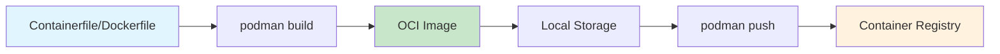
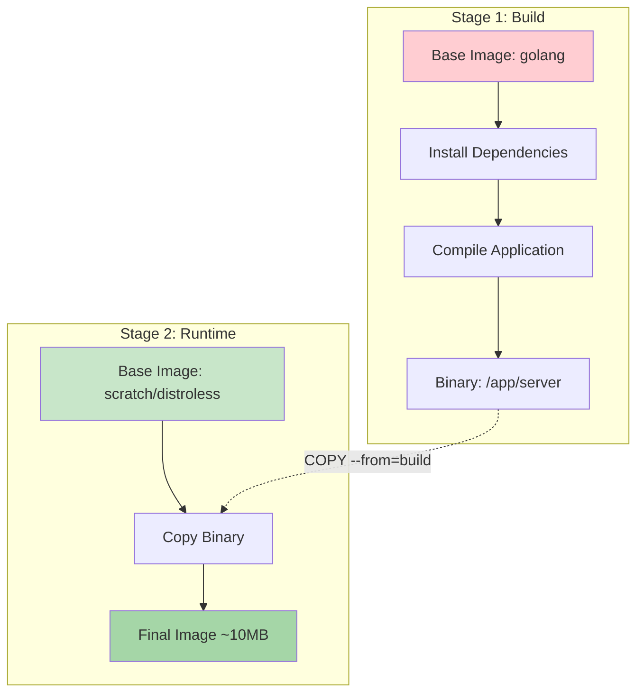
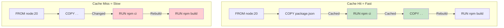
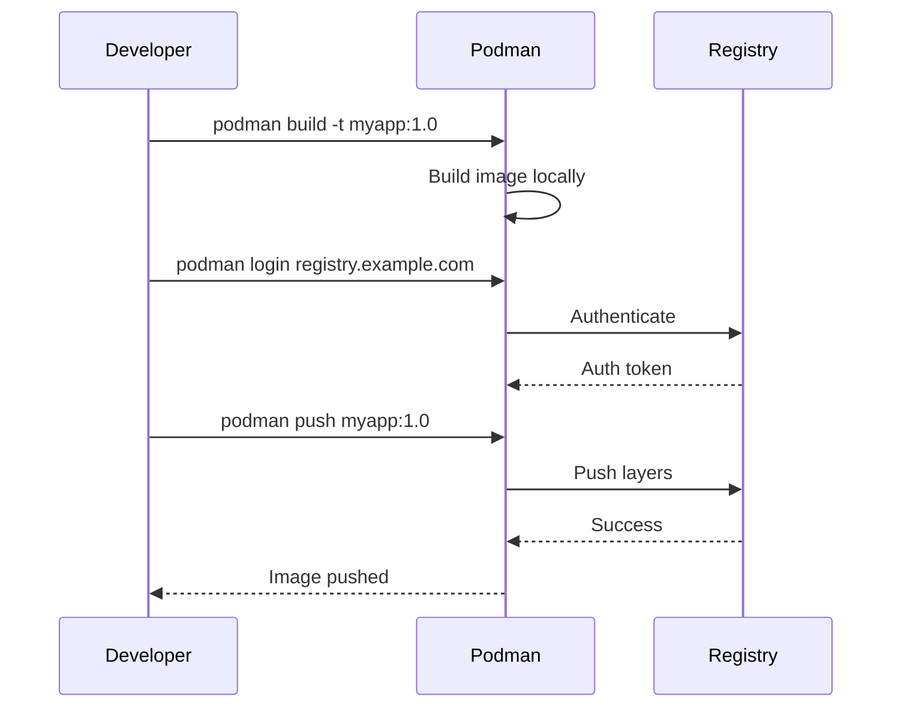

# How to Build Images with Podman

Author: [nawazdhandala](https://github.com/nawazdhandala)

Tags: Podman, Containers, DevOps, Docker, OCI, Security, BuildKit

Description: A comprehensive guide to building container images with Podman, covering Dockerfile/Containerfile basics, multi-stage builds, build arguments, secrets handling, layer caching strategies, and pushing to registries.

---

> **Key Insight:** Podman builds OCI-compliant images without requiring a daemon, making it ideal for CI/CD pipelines, rootless environments, and security-conscious organizations. The `podman build` command is drop-in compatible with Docker, so your existing Dockerfiles work without modification.

## What is Podman?

Podman (Pod Manager) is a daemonless container engine for developing, managing, and running OCI containers. Unlike Docker, Podman does not require a long-running daemon process with root privileges, which significantly improves security and simplifies integration with systemd and other init systems.



## Building from Dockerfile/Containerfile

Podman supports both `Dockerfile` (Docker's naming) and `Containerfile` (Podman's preferred naming). The syntax is identical, making migration seamless.

### Basic Build Command

```bash
# Build an image from the current directory
# -t: Tag the image with a name and optional version
# .: Build context (current directory)
podman build -t myapp:1.0 .

# Build from a specific file
# -f: Specify the path to the Containerfile/Dockerfile
podman build -f ./docker/Containerfile.prod -t myapp:prod .

# Build with a different context directory
# The context determines which files are available during build
podman build -t myapp:latest -f Containerfile /path/to/context
```

### Sample Containerfile

```dockerfile
# Containerfile for a Node.js application
# FROM: Specifies the base image to build upon
FROM node:20-alpine

# LABEL: Add metadata to the image for documentation and filtering
LABEL maintainer="team@example.com"
LABEL version="1.0"
LABEL description="Production Node.js application"

# WORKDIR: Set the working directory for subsequent instructions
# Creates the directory if it doesn't exist
WORKDIR /app

# COPY: Copy files from build context into the image
# Copy package files first to leverage layer caching
COPY package*.json ./

# RUN: Execute commands in a new layer
# npm ci: Clean install - faster and more reliable than npm install
# --omit=dev: Skip devDependencies for smaller production images
RUN npm ci --omit=dev

# Copy application source code
# This layer changes frequently, so it comes after dependency installation
COPY . .

# EXPOSE: Document which ports the container listens on
# This is metadata only - doesn't actually publish the port
EXPOSE 3000

# USER: Switch to non-root user for security
# node:node is a built-in user in Node.js Alpine images
USER node

# CMD: Default command to run when container starts
# Using exec form (JSON array) for proper signal handling
CMD ["node", "server.js"]
```

## Multi-Stage Builds

Multi-stage builds allow you to use multiple FROM statements in your Containerfile. This enables you to create smaller production images by copying only the necessary artifacts from build stages.



### Go Application Example

```dockerfile
# =============================================================================
# Stage 1: Build Environment
# =============================================================================
# Name this stage 'build' for reference in later stages
# BUILDPLATFORM ensures native compilation speed during cross-platform builds
FROM --platform=$BUILDPLATFORM golang:1.22-alpine AS build

# Install build dependencies
# ca-certificates: Required for HTTPS connections
# git: Required if go modules reference git repositories
RUN apk add --no-cache ca-certificates git

WORKDIR /src

# Copy go module files first for better layer caching
# These files change less frequently than source code
COPY go.mod go.sum ./

# Download dependencies (cached if go.mod/go.sum unchanged)
# This layer is expensive but rarely changes
RUN go mod download && go mod verify

# Copy source code
COPY . .

# Build the application
# CGO_ENABLED=0: Create a statically-linked binary (no C dependencies)
# GOOS/GOARCH: Target OS and architecture (supports cross-compilation)
# -ldflags: Linker flags
#   -s: Omit symbol table (reduces binary size)
#   -w: Omit DWARF debugging information (reduces binary size)
#   -X main.version: Inject version at compile time
ARG VERSION=dev
RUN CGO_ENABLED=0 GOOS=${TARGETOS:-linux} GOARCH=${TARGETARCH:-amd64} \
    go build -ldflags="-s -w -X main.version=${VERSION}" \
    -o /out/server ./cmd/server

# =============================================================================
# Stage 2: Minimal Runtime Environment
# =============================================================================
# Use distroless for minimal attack surface
# static-debian12: No libc, perfect for Go static binaries
FROM gcr.io/distroless/static-debian12

# Copy CA certificates for HTTPS support
COPY --from=build /etc/ssl/certs/ca-certificates.crt /etc/ssl/certs/

# Copy the compiled binary from build stage
# --from=build: Reference the build stage by name
COPY --from=build /out/server /server

# Run as non-root user (65532 is the distroless nonroot user)
# This limits potential damage if the application is compromised
USER 65532:65532

# Set the entrypoint
ENTRYPOINT ["/server"]
```

### Python Application with Poetry

```dockerfile
# =============================================================================
# Stage 1: Dependency Builder
# =============================================================================
FROM python:3.12-slim AS builder

# Install poetry in isolated environment
# POETRY_HOME: Install location for poetry
# POETRY_VIRTUALENVS_IN_PROJECT: Create .venv in project directory
ENV POETRY_HOME=/opt/poetry \
    POETRY_VIRTUALENVS_IN_PROJECT=true \
    POETRY_NO_INTERACTION=1

# Install poetry using official installer
RUN python -m venv $POETRY_HOME && \
    $POETRY_HOME/bin/pip install poetry==1.8.0

WORKDIR /app

# Copy dependency specifications
COPY pyproject.toml poetry.lock ./

# Install dependencies (without dev dependencies)
# --no-root: Don't install the project itself yet
# --only main: Only install main dependencies, skip dev/test groups
RUN $POETRY_HOME/bin/poetry install --no-root --only main

# =============================================================================
# Stage 2: Production Runtime
# =============================================================================
FROM python:3.12-slim

# Security: Create non-root user
RUN groupadd --gid 1000 appgroup && \
    useradd --uid 1000 --gid 1000 --shell /bin/bash appuser

WORKDIR /app

# Copy virtual environment from builder
# This contains all installed dependencies
COPY --from=builder /app/.venv /app/.venv

# Copy application code
COPY --chown=appuser:appgroup . .

# Add virtual environment to PATH
ENV PATH="/app/.venv/bin:$PATH" \
    PYTHONDONTWRITEBYTECODE=1 \
    PYTHONUNBUFFERED=1

USER appuser

EXPOSE 8000

# Use exec form for proper signal handling
CMD ["python", "-m", "uvicorn", "main:app", "--host", "0.0.0.0", "--port", "8000"]
```

## Build Arguments and Secrets

Build arguments allow you to pass values at build time, while secrets provide a secure way to use sensitive data without baking them into image layers.

### Using Build Arguments (ARG)

```dockerfile
# Define build arguments with optional default values
# ARG values are available only during build, not at runtime
ARG NODE_ENV=production
ARG APP_VERSION=latest
ARG BASE_IMAGE=node:20-alpine

# Use ARG in FROM statement (must be declared before FROM)
ARG BASE_IMAGE
FROM ${BASE_IMAGE}

# Re-declare ARG after FROM (ARG scope resets after each FROM)
ARG NODE_ENV
ARG APP_VERSION

# Set environment variables from build arguments
# ENV values persist into the running container
ENV NODE_ENV=${NODE_ENV} \
    APP_VERSION=${APP_VERSION}

# Use in RUN commands
RUN echo "Building version ${APP_VERSION} for ${NODE_ENV}"

# Conditional logic based on build arguments
RUN if [ "$NODE_ENV" = "development" ]; then \
        npm install; \
    else \
        npm ci --omit=dev; \
    fi
```

Build with custom arguments:

```bash
# Pass build arguments using --build-arg
podman build \
    --build-arg NODE_ENV=development \
    --build-arg APP_VERSION=2.0.0 \
    --build-arg BASE_IMAGE=node:20-bullseye \
    -t myapp:dev .

# Multiple build arguments for CI/CD
podman build \
    --build-arg GIT_COMMIT=$(git rev-parse HEAD) \
    --build-arg BUILD_DATE=$(date -u +"%Y-%m-%dT%H:%M:%SZ") \
    --build-arg VERSION=${CI_COMMIT_TAG:-dev} \
    -t myapp:${CI_COMMIT_TAG:-latest} .
```

### Using Build Secrets

Secrets allow you to pass sensitive information (API keys, tokens) to the build without storing them in image layers.

```dockerfile
# syntax=docker/dockerfile:1.6
# Enable BuildKit syntax for secret mounts

FROM node:20-alpine

WORKDIR /app

COPY package*.json ./

# Mount secret during this RUN command only
# id=npm_token: Identifier for the secret
# target: Where to mount the secret file
# The secret exists ONLY during this RUN step
RUN --mount=type=secret,id=npm_token,target=/run/secrets/npm_token \
    NPM_TOKEN=$(cat /run/secrets/npm_token) && \
    echo "//registry.npmjs.org/:_authToken=${NPM_TOKEN}" > .npmrc && \
    npm ci && \
    rm -f .npmrc  # Clean up even though secret isn't in layer

COPY . .

CMD ["node", "server.js"]
```

Build with secrets:

```bash
# Method 1: Secret from file
podman build --secret id=npm_token,src=./.npm_token -t myapp .

# Method 2: Secret from environment variable
export NPM_TOKEN="your-secret-token"
podman build --secret id=npm_token,env=NPM_TOKEN -t myapp .

# Multiple secrets
podman build \
    --secret id=npm_token,src=./.npm_token \
    --secret id=github_token,src=./.github_token \
    -t myapp .
```

### SSH Authentication for Private Repositories

```dockerfile
# syntax=docker/dockerfile:1.6

FROM golang:1.22-alpine AS build

# Install git and ssh for private repo access
RUN apk add --no-cache git openssh-client

# Configure git to use SSH for GitHub
RUN mkdir -p ~/.ssh && \
    ssh-keyscan github.com >> ~/.ssh/known_hosts

WORKDIR /src

COPY go.mod go.sum ./

# Mount SSH agent socket for authentication
# This allows git to use your SSH keys without exposing them
RUN --mount=type=ssh \
    go mod download

COPY . .
RUN go build -o /app ./cmd/server
```

Build with SSH forwarding:

```bash
# Forward SSH agent for private repository access
podman build --ssh default -t myapp .

# Or specify a specific SSH key
podman build --ssh default=$HOME/.ssh/id_ed25519 -t myapp .
```

## Layer Caching Strategies

Effective layer caching dramatically reduces build times. Podman caches each instruction's result and reuses it when inputs haven't changed.



### Best Practices for Layer Caching

```dockerfile
# =============================================================================
# GOOD: Optimized for caching
# =============================================================================

FROM node:20-alpine

WORKDIR /app

# Layer 1: System dependencies (rarely changes)
RUN apk add --no-cache python3 make g++

# Layer 2: Package manager files (changes occasionally)
# Copy only what's needed for dependency installation
COPY package.json package-lock.json ./

# Layer 3: Install dependencies (cached unless package files change)
RUN npm ci

# Layer 4: Application code (changes frequently)
# This layer and subsequent ones rebuild on every code change
COPY . .

# Layer 5: Build step
RUN npm run build

CMD ["npm", "start"]
```

### Using Cache Mounts

Cache mounts persist data between builds, speeding up package manager operations:

```dockerfile
# syntax=docker/dockerfile:1.6

FROM node:20-alpine

WORKDIR /app

COPY package*.json ./

# Mount cache directories to persist across builds
# type=cache: Persistent cache mount
# target: Directory to cache
# This avoids re-downloading packages on every build
RUN --mount=type=cache,target=/root/.npm \
    npm ci

COPY . .

# Cache the build output directory
RUN --mount=type=cache,target=/app/.next/cache \
    npm run build

CMD ["npm", "start"]
```

For Go applications:

```dockerfile
FROM golang:1.22

WORKDIR /src

COPY go.mod go.sum ./

# Cache Go module downloads and build cache
RUN --mount=type=cache,target=/go/pkg/mod \
    --mount=type=cache,target=/root/.cache/go-build \
    go mod download

COPY . .

RUN --mount=type=cache,target=/go/pkg/mod \
    --mount=type=cache,target=/root/.cache/go-build \
    go build -o /app ./cmd/server
```

### Controlling Cache Behavior

```bash
# Build without using any cache (clean rebuild)
podman build --no-cache -t myapp .

# Pull latest base image before building
podman build --pull=always -t myapp .

# Use specific cache settings
podman build --layers=true --cache-ttl=24h -t myapp .
```

## Pushing to Registries

After building an image, you typically push it to a container registry for distribution and deployment.



### Tagging for Registries

```bash
# Tag an existing image for a specific registry
# Format: registry/namespace/repository:tag
podman tag myapp:1.0 docker.io/myuser/myapp:1.0
podman tag myapp:1.0 ghcr.io/myorg/myapp:1.0
podman tag myapp:1.0 registry.example.com/myproject/myapp:1.0

# Build and tag for registry in one command
podman build -t ghcr.io/myorg/myapp:1.0 .

# Multiple tags at once
podman build \
    -t myapp:latest \
    -t myapp:1.0 \
    -t ghcr.io/myorg/myapp:1.0 \
    -t ghcr.io/myorg/myapp:latest \
    .
```

### Authentication and Login

```bash
# Login to Docker Hub
podman login docker.io

# Login to GitHub Container Registry
# Use a Personal Access Token (PAT) with packages:write scope
echo $GITHUB_TOKEN | podman login ghcr.io -u USERNAME --password-stdin

# Login to Amazon ECR
aws ecr get-login-password --region us-east-1 | \
    podman login --username AWS --password-stdin 123456789.dkr.ecr.us-east-1.amazonaws.com

# Login to Google Container Registry
cat key.json | podman login -u _json_key --password-stdin gcr.io

# Login to Azure Container Registry
podman login myregistry.azurecr.io -u $SP_APP_ID -p $SP_PASSWORD

# View current login status
podman login --get-login docker.io
```

### Pushing Images

```bash
# Push a single tag
podman push ghcr.io/myorg/myapp:1.0

# Push all tags for an image
podman push --all-tags ghcr.io/myorg/myapp

# Push with compression (useful for large images)
podman push --compress ghcr.io/myorg/myapp:1.0

# Push to insecure registry (development only!)
podman push --tls-verify=false localhost:5000/myapp:1.0
```

### Multi-Architecture Images

Build and push images for multiple CPU architectures:

```bash
# Create a manifest list for multi-arch support
podman manifest create ghcr.io/myorg/myapp:1.0

# Build for different architectures
podman build --platform linux/amd64 -t myapp:amd64 .
podman build --platform linux/arm64 -t myapp:arm64 .

# Add images to manifest
podman manifest add ghcr.io/myorg/myapp:1.0 myapp:amd64
podman manifest add ghcr.io/myorg/myapp:1.0 myapp:arm64

# Push the manifest list (includes all architectures)
podman manifest push ghcr.io/myorg/myapp:1.0

# Or use buildx-style workflow with podman
podman build --platform linux/amd64,linux/arm64 \
    --manifest ghcr.io/myorg/myapp:1.0 .
podman manifest push ghcr.io/myorg/myapp:1.0
```

## Best Practices Summary

| Practice | Description | Impact |
|----------|-------------|--------|
| **Use Multi-Stage Builds** | Separate build and runtime environments | Reduces image size by 50-90% |
| **Run as Non-Root** | Add `USER` instruction for non-root execution | Improves security posture |
| **Order Instructions by Change Frequency** | Put rarely-changing instructions first | Maximizes cache efficiency |
| **Use Specific Base Image Tags** | Avoid `latest`; use version tags like `node:20.11-alpine` | Ensures reproducible builds |
| **Minimize Layers** | Combine related RUN commands with `&&` | Reduces image size |
| **Use `.containerignore`** | Exclude unnecessary files from build context | Speeds up builds |
| **Scan for Vulnerabilities** | Use `podman image scan` or Trivy | Catches security issues early |
| **Use Build Secrets** | Never hardcode credentials in Containerfiles | Prevents credential leakage |
| **Leverage Cache Mounts** | Cache package manager directories | Dramatically speeds rebuilds |
| **Sign Your Images** | Use `podman image sign` with GPG/sigstore | Ensures image integrity |

### Sample .containerignore File

```plaintext
# Version control
.git
.gitignore

# Dependencies (reinstalled during build)
node_modules
vendor
.venv

# Build artifacts
dist
build
*.egg-info

# IDE and editor files
.idea
.vscode
*.swp
*.swo

# Test and development files
tests
__tests__
*.test.js
*.spec.js
coverage
.nyc_output

# Documentation
docs
*.md
!README.md

# Docker/Podman files
Dockerfile*
Containerfile*
docker-compose*.yml
.dockerignore
.containerignore

# Secrets and environment files
.env*
*.pem
*.key
credentials.json
```

## Conclusion

Podman provides a secure, daemonless approach to building container images that is fully compatible with Docker workflows. By leveraging multi-stage builds, proper layer caching, and build secrets, you can create efficient, secure images suitable for production deployments.

The rootless operation mode makes Podman particularly attractive for CI/CD pipelines and environments where running a privileged daemon is not desirable or permitted.

For monitoring your containerized applications in production, [OneUptime](https://oneuptime.com) provides comprehensive observability with metrics, logs, and traces to ensure your services run reliably at scale.
