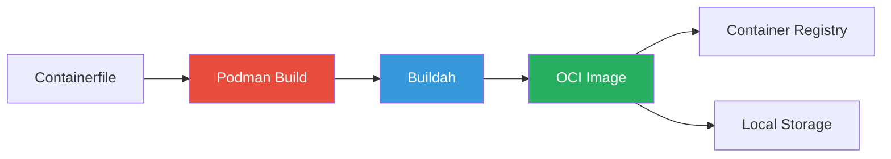
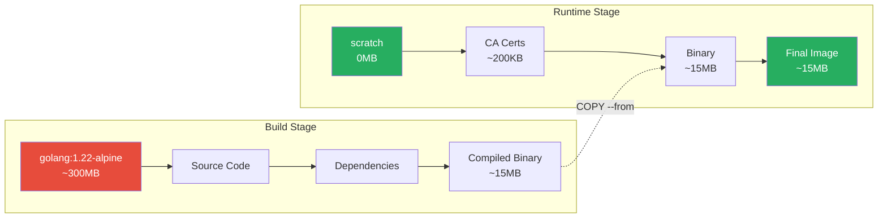
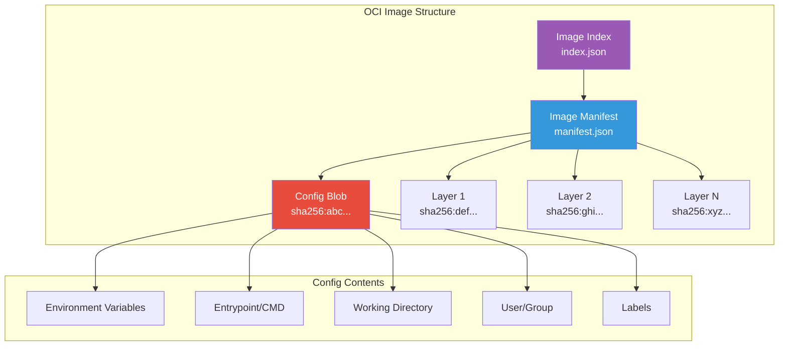
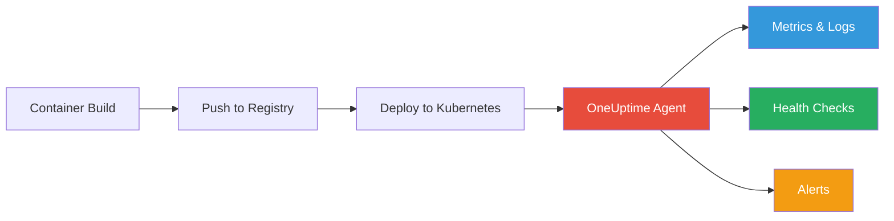

# How to Build Images with Podman

Author: [nawazdhandala](https://www.github.com/nawazdhandala)

Tags: Podman, Containers, Buildah, OCI, DevOps, Docker Alternative

Description: A comprehensive guide to building container images with Podman, covering Buildah integration, multi-stage builds, build arguments, OCI image format, and best practices for rootless container development.

---

> "The best tool is the one that gets out of your way and lets you focus on what matters - your application."

Podman has emerged as a powerful alternative to Docker for building and running containers. It runs daemonless, supports rootless containers out of the box, and produces OCI-compliant images that work everywhere. This guide walks you through building production-ready container images with Podman.

## Why Choose Podman for Building Images

Podman offers several advantages over traditional Docker builds:

- **Daemonless architecture**: No background daemon consuming resources
- **Rootless by default**: Build and run containers without root privileges
- **OCI-compliant**: Images work with Docker, Kubernetes, and any OCI runtime
- **Drop-in Docker replacement**: Most Docker commands work with Podman
- **Buildah integration**: Access advanced build features when needed



## Getting Started with Podman Build

The basic build command mirrors Docker's syntax. Podman reads from a `Containerfile` (or `Dockerfile` for compatibility).

```bash
# Build an image from a Containerfile in the current directory
# -t: Tag the image with a name and optional version
podman build -t myapp:v1.0 .

# Build from a specific file with a different name
# -f: Specify the path to the Containerfile
podman build -f Containerfile.prod -t myapp:prod .

# Build with no cache to ensure fresh layers
# --no-cache: Ignore cached layers and rebuild everything
podman build --no-cache -t myapp:fresh .
```

Here is a simple Containerfile to start with:

```dockerfile
# Use a minimal base image for smaller attack surface
FROM alpine:3.19

# Set metadata labels following OCI conventions
LABEL org.opencontainers.image.title="My Application"
LABEL org.opencontainers.image.version="1.0.0"
LABEL org.opencontainers.image.description="A sample containerized application"

# Install runtime dependencies only
# --no-cache: Don't store the package index locally (saves space)
RUN apk add --no-cache python3 py3-pip

# Create non-root user for security
# -D: Create user without password
# -u: Specify user ID (use high number to avoid conflicts)
RUN adduser -D -u 10001 appuser

# Set working directory (creates it if it doesn't exist)
WORKDIR /app

# Copy application files with correct ownership
# --chown: Set ownership during copy (more efficient than separate chown)
COPY --chown=appuser:appuser . .

# Switch to non-root user before running application
USER appuser

# Define the command to run when container starts
CMD ["python3", "app.py"]
```

## Understanding Buildah Integration

Podman uses Buildah under the hood for building images. You can also use Buildah directly for more granular control over the build process.

```mermaid
flowchart TB
    subgraph "Podman Build Flow"
        A[podman build] --> B[Parses Containerfile]
        B --> C[Calls Buildah APIs]
        C --> D[Creates Working Container]
        D --> E[Executes Instructions]
        E --> F[Commits to Image]
    end

    subgraph "Direct Buildah Flow"
        G[buildah from] --> H[Working Container]
        H --> I[buildah run/copy/config]
        I --> J[buildah commit]
        J --> K[Final Image]
    end

    style A fill:#e74c3c,color:#fff
    style G fill:#3498db,color:#fff
```



Using Buildah directly gives you scripting capabilities:

```bash
#!/bin/bash
# Build a container image using Buildah commands directly
# This approach gives you full control over each step

# Create a new working container from base image
# Store the container ID in a variable for later use
container=$(buildah from alpine:3.19)

# Run commands inside the container
# --: Separates buildah options from the command to run
buildah run $container -- apk add --no-cache nodejs npm

# Copy files into the container
# Specify source on host and destination in container
buildah copy $container ./package.json /app/package.json
buildah copy $container ./src /app/src

# Set working directory for subsequent commands
buildah config --workingdir /app $container

# Install dependencies inside the container
buildah run $container -- npm ci --omit=dev

# Configure the container's runtime settings
# --user: Run as non-root user
# --port: Document exposed ports (metadata only)
# --entrypoint: Set the default executable
buildah config --user 1001 $container
buildah config --port 3000 $container
buildah config --entrypoint '["node", "src/index.js"]' $container

# Commit the working container to a final image
# --squash: Combine all layers into one (smaller size, loses cache benefits)
buildah commit --squash $container myapp:v1.0

# Clean up the working container
buildah rm $container

echo "Image built successfully: myapp:v1.0"
```

## Multi-Stage Builds for Smaller Images

Multi-stage builds let you use heavy build tools in one stage and copy only the artifacts to a minimal runtime image. This drastically reduces image size and attack surface.

```dockerfile
# =============================================================================
# Stage 1: Build Environment
# This stage contains all build dependencies (compilers, dev tools, etc.)
# Nothing from this stage ends up in the final image except what we copy
# =============================================================================
FROM golang:1.22-alpine AS builder

# Install build dependencies needed for CGO or native extensions
RUN apk add --no-cache git ca-certificates

# Set working directory for build context
WORKDIR /build

# Copy dependency files first for better layer caching
# These files change less frequently than source code
COPY go.mod go.sum ./

# Download dependencies (cached if go.mod/go.sum unchanged)
RUN go mod download

# Copy the entire source code
COPY . .

# Build the application with optimizations
# CGO_ENABLED=0: Static binary without C dependencies
# -ldflags="-w -s": Strip debug info and symbol table (smaller binary)
# -trimpath: Remove file paths from binary (reproducible builds)
RUN CGO_ENABLED=0 GOOS=linux GOARCH=amd64 \
    go build -ldflags="-w -s" -trimpath -o /build/server ./cmd/server

# =============================================================================
# Stage 2: Runtime Environment
# Minimal image with only what's needed to run the application
# =============================================================================
FROM scratch

# Copy CA certificates for HTTPS connections
# Required if your app makes external API calls
COPY --from=builder /etc/ssl/certs/ca-certificates.crt /etc/ssl/certs/

# Copy the compiled binary from builder stage
# --from=builder: Reference the first stage by its AS name
COPY --from=builder /build/server /server

# Document the port (informational, doesn't actually expose)
EXPOSE 8080

# Run as non-root user (use numeric ID with scratch images)
USER 65534:65534

# Set the entrypoint to our binary
ENTRYPOINT ["/server"]
```

The multi-stage approach provides dramatic size reductions:



## Using Build Arguments for Flexibility

Build arguments let you parameterize your builds without modifying the Containerfile. They are evaluated at build time and can have default values.

```dockerfile
# Define build arguments with default values
# ARG is only available during build, not at runtime
ARG BASE_IMAGE=node:20-alpine
ARG NODE_ENV=production
ARG APP_VERSION=0.0.0

# Use the build argument in FROM instruction
FROM ${BASE_IMAGE}

# Re-declare ARGs after FROM (they don't persist across stages)
ARG NODE_ENV
ARG APP_VERSION

# Set environment variables from build args
# ENV persists into the running container
ENV NODE_ENV=${NODE_ENV}

# Add version as a label for image inspection
LABEL org.opencontainers.image.version="${APP_VERSION}"

WORKDIR /app

# Copy package files for dependency installation
COPY package*.json ./

# Conditional install based on environment
# Production: --omit=dev excludes devDependencies
# Development: install everything for testing/debugging
RUN if [ "$NODE_ENV" = "production" ]; then \
        npm ci --omit=dev; \
    else \
        npm ci; \
    fi

COPY . .

# Build step (TypeScript compilation, bundling, etc.)
RUN npm run build

# Create non-root user and switch to it
RUN adduser -D -u 1001 appuser
USER appuser

EXPOSE 3000
CMD ["node", "dist/index.js"]
```

Pass build arguments when building:

```bash
# Build with custom arguments
# --build-arg: Pass values to ARG instructions
podman build \
    --build-arg BASE_IMAGE=node:20-slim \
    --build-arg NODE_ENV=production \
    --build-arg APP_VERSION=2.1.0 \
    -t myapp:2.1.0 .

# Build for development with all dependencies
podman build \
    --build-arg NODE_ENV=development \
    -t myapp:dev .

# Use a specific registry mirror for the base image
podman build \
    --build-arg BASE_IMAGE=registry.internal.example.com/node:20-alpine \
    -t myapp:internal .
```

## OCI Image Format Deep Dive

Podman builds OCI (Open Container Initiative) compliant images by default. Understanding the format helps with debugging and optimization.



Inspect OCI image details with Podman:

```bash
# Inspect image configuration and metadata
# Returns JSON with full image details
podman inspect myapp:v1.0

# View image history (layers and commands)
# Shows each layer's size and the command that created it
podman history myapp:v1.0

# Export image layers for analysis
# Useful for debugging what's in each layer
podman save myapp:v1.0 -o myapp.tar
tar -tvf myapp.tar | head -20

# Check image manifest (OCI format details)
# Shows the digest, media type, and layer information
podman manifest inspect myapp:v1.0

# View only the config portion
# Useful for checking environment variables and entrypoint
podman inspect --format='{{.Config}}' myapp:v1.0
```

Building explicitly for OCI format with specific options:

```bash
# Build with OCI format (default in Podman)
# --format=oci: Explicitly request OCI format
podman build --format=oci -t myapp:oci .

# Build with Docker format for compatibility with older registries
# --format=docker: Use Docker manifest format
podman build --format=docker -t myapp:docker .

# Build multi-architecture image manifest
# Creates a manifest list supporting multiple platforms
podman build --platform linux/amd64,linux/arm64 \
    --manifest myapp:multi .

# Push manifest list to registry
podman manifest push myapp:multi docker://registry.example.com/myapp:multi
```

## Advanced Build Techniques

### Caching Dependencies Efficiently

Layer ordering matters for cache efficiency. Place instructions that change infrequently at the top.

```dockerfile
FROM python:3.12-slim

WORKDIR /app

# Copy ONLY dependency files first
# This layer is cached unless requirements.txt changes
COPY requirements.txt .

# Install dependencies in a separate layer
# --no-cache-dir: Don't store pip's cache (smaller image)
# --compile: Compile .py to .pyc for faster startup
RUN pip install --no-cache-dir --compile -r requirements.txt

# Copy application code last (changes most frequently)
# Only this layer rebuilds when code changes
COPY . .

# Compile Python files for production
RUN python -m compileall .

USER 1001
CMD ["python", "app.py"]
```

### Using Build Secrets Securely

Never bake secrets into image layers. Use mounted secrets that exist only during build.

```dockerfile
# syntax=docker/dockerfile:1.6
# Enable BuildKit/Buildah secret mounts

FROM node:20-alpine

WORKDIR /app

COPY package*.json ./

# Mount NPM token as a secret during install
# --mount=type=secret: Secret is available only during this RUN
# The secret is never stored in any layer
RUN --mount=type=secret,id=npm_token,target=/run/secrets/npm_token \
    npm config set //registry.npmjs.org/:_authToken $(cat /run/secrets/npm_token) && \
    npm ci && \
    npm config delete //registry.npmjs.org/:_authToken

COPY . .
RUN npm run build

USER 1001
CMD ["node", "dist/index.js"]
```

Build with the secret:

```bash
# Build with mounted secret (never stored in image)
# --secret: Mount a file as a secret during build
podman build --secret id=npm_token,src=$HOME/.npm_token -t myapp:v1.0 .
```

### Build Cache Management

```bash
# View build cache status
podman system df

# Clear build cache to free space
# -a: Remove all unused build cache, not just dangling
podman builder prune -a

# Build with external cache source
# --cache-from: Use layers from another image as cache
podman build --cache-from=registry.example.com/myapp:cache -t myapp:v1.0 .

# Build and export cache for CI/CD
# --cache-to: Push cache layers to a registry
podman build \
    --cache-to=type=registry,ref=registry.example.com/myapp:cache \
    -t myapp:v1.0 .
```

## Complete Build Pipeline Example

Here is a production-ready multi-stage build that incorporates all best practices:

```dockerfile
# =============================================================================
# Build Arguments - Customize the build without modifying the file
# =============================================================================
ARG NODE_VERSION=20
ARG ALPINE_VERSION=3.19
ARG APP_VERSION=0.0.0
ARG BUILD_DATE=unknown
ARG VCS_REF=unknown

# =============================================================================
# Stage 1: Dependencies - Install and cache node_modules
# =============================================================================
FROM node:${NODE_VERSION}-alpine${ALPINE_VERSION} AS deps

WORKDIR /app

# Copy package files for dependency resolution
COPY package.json package-lock.json ./

# Install ALL dependencies (including devDependencies for build)
# --frozen-lockfile: Fail if lockfile needs update (reproducible builds)
RUN npm ci --frozen-lockfile

# =============================================================================
# Stage 2: Builder - Compile TypeScript and build assets
# =============================================================================
FROM node:${NODE_VERSION}-alpine${ALPINE_VERSION} AS builder

WORKDIR /app

# Copy dependencies from deps stage
COPY --from=deps /app/node_modules ./node_modules

# Copy source code
COPY . .

# Run build process (TypeScript, webpack, etc.)
RUN npm run build

# Remove devDependencies after build
RUN npm prune --omit=dev

# =============================================================================
# Stage 3: Runtime - Minimal production image
# =============================================================================
FROM node:${NODE_VERSION}-alpine${ALPINE_VERSION} AS runtime

# Redeclare ARGs for use in this stage
ARG APP_VERSION
ARG BUILD_DATE
ARG VCS_REF

# OCI-compliant labels for image metadata
LABEL org.opencontainers.image.title="My Application"
LABEL org.opencontainers.image.description="Production container image"
LABEL org.opencontainers.image.version="${APP_VERSION}"
LABEL org.opencontainers.image.created="${BUILD_DATE}"
LABEL org.opencontainers.image.revision="${VCS_REF}"
LABEL org.opencontainers.image.vendor="My Company"
LABEL org.opencontainers.image.licenses="MIT"

# Security: Run as non-root user
RUN addgroup -g 1001 appgroup && \
    adduser -D -u 1001 -G appgroup appuser

WORKDIR /app

# Copy only production dependencies and built assets
COPY --from=builder --chown=appuser:appgroup /app/node_modules ./node_modules
COPY --from=builder --chown=appuser:appgroup /app/dist ./dist
COPY --from=builder --chown=appuser:appgroup /app/package.json ./

# Set production environment
ENV NODE_ENV=production

# Switch to non-root user
USER appuser

# Document the listening port
EXPOSE 3000

# Health check for orchestrators
HEALTHCHECK --interval=30s --timeout=3s --start-period=5s --retries=3 \
    CMD wget --no-verbose --tries=1 --spider http://localhost:3000/health || exit 1

# Start the application
CMD ["node", "dist/index.js"]
```

Build with full metadata:

```bash
# Build with all metadata for production
podman build \
    --build-arg APP_VERSION=$(git describe --tags --always) \
    --build-arg BUILD_DATE=$(date -u +"%Y-%m-%dT%H:%M:%SZ") \
    --build-arg VCS_REF=$(git rev-parse HEAD) \
    -t myapp:$(git describe --tags --always) \
    -t myapp:latest .
```

## Monitoring Your Container Builds

Tracking build performance and container health is essential for production systems. [OneUptime](https://oneuptime.com) provides comprehensive monitoring for your containerized applications:

- **Build Pipeline Monitoring**: Track build times, success rates, and failures
- **Container Health Checks**: Monitor running containers and receive alerts on failures
- **Resource Utilization**: Track CPU, memory, and network usage of your containers
- **Log Aggregation**: Centralize logs from all your containers for debugging
- **Incident Management**: Automated alerting and on-call scheduling when issues arise



## Troubleshooting Common Build Issues

### Permission Denied Errors

```bash
# Check if running in rootless mode
podman info | grep rootless

# Fix storage permissions
podman system reset

# Use --userns=keep-id for bind mounts with correct ownership
podman build --userns=keep-id -t myapp .
```

### Layer Cache Not Working

```bash
# Ensure consistent ordering in Containerfile
# Check if .dockerignore excludes files that change frequently
cat .dockerignore

# Build with verbose output to see cache hits
podman build --log-level=debug -t myapp .
```

### Multi-Architecture Build Issues

```bash
# Install QEMU for cross-platform emulation
# Required for building ARM images on x86 (or vice versa)
podman machine ssh -- sudo rpm-ostree install qemu-user-static

# Register QEMU interpreters
podman run --rm --privileged multiarch/qemu-user-static --reset -p yes

# Verify platform support
podman system info | grep -A5 host
```

---

Podman provides a powerful, secure, and Docker-compatible way to build container images. Its daemonless architecture, rootless operation, and Buildah integration make it ideal for both local development and CI/CD pipelines. Start with simple builds, adopt multi-stage patterns for production, and always follow security best practices like running as non-root and using secrets mounts. Combined with proper monitoring through [OneUptime](https://oneuptime.com), you can build and operate containers with confidence.
