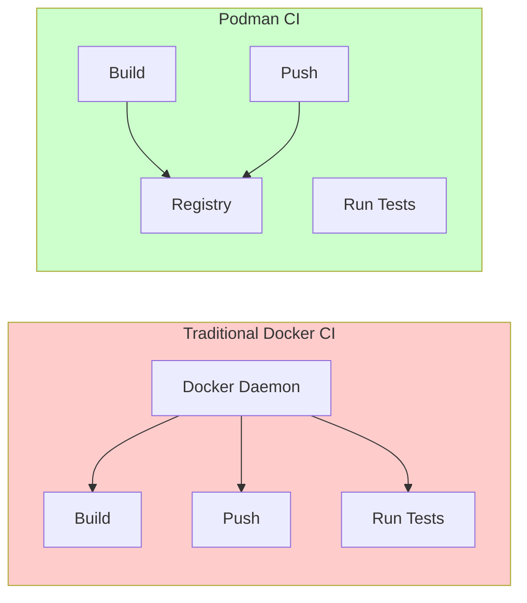
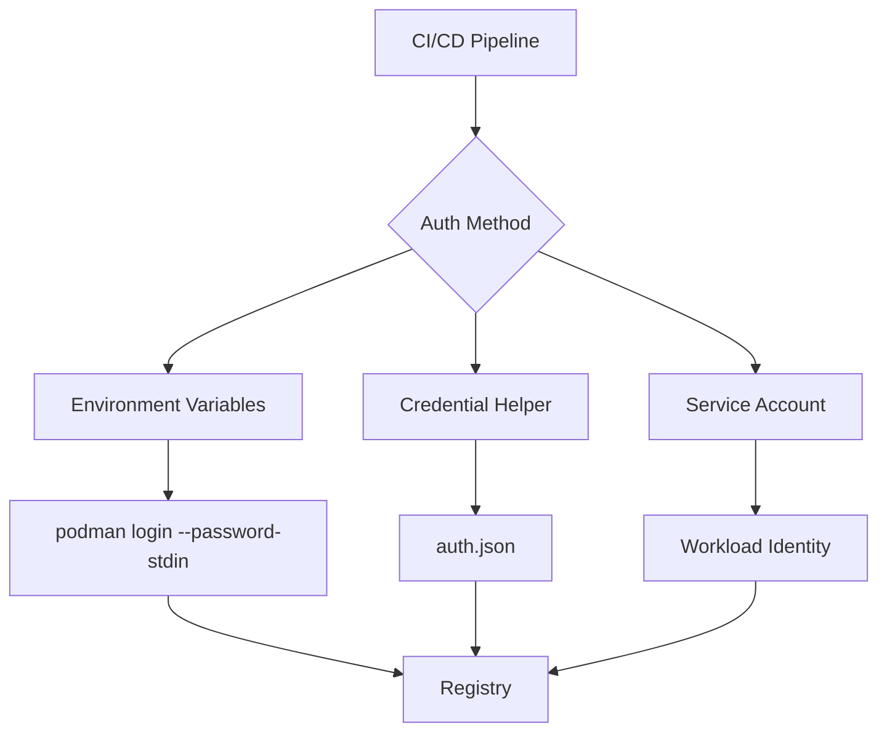
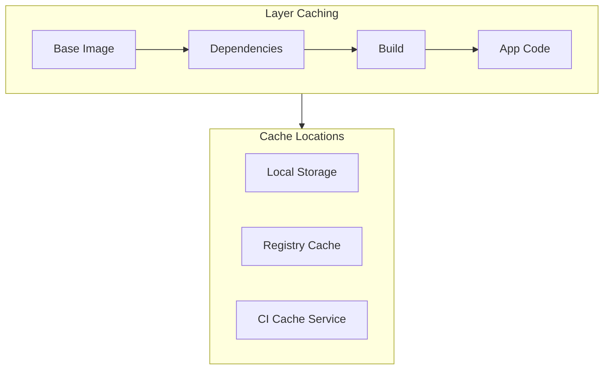
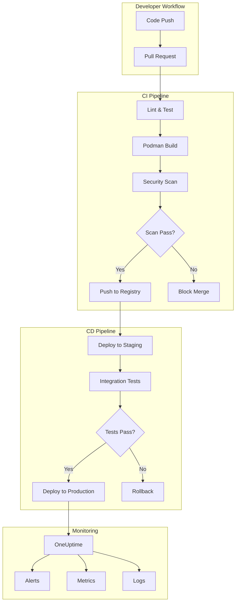

# How to Configure Podman for CI/CD

Author: [nawazdhandala](https://www.github.com/nawazdhandala)

Tags: Podman, CI/CD, GitHub Actions, GitLab CI, Containers, DevOps, Docker Alternative

Description: A comprehensive guide to configuring Podman for CI/CD pipelines, covering GitHub Actions, GitLab CI integration, registry authentication, and caching strategies for faster, more secure container builds.

---

> "The best container runtime is the one that fits your workflow. Podman fits CI/CD like a glove - daemonless, rootless, and drop-in compatible with Docker commands."

## Why Podman for CI/CD?

Podman brings several advantages to CI/CD pipelines that make it worth considering over traditional Docker:



Key benefits:

1. **Daemonless** - No background daemon required, reducing attack surface
2. **Rootless** - Run containers without root privileges
3. **OCI Compliant** - Standard container images work everywhere
4. **Drop-in Replacement** - `alias docker=podman` just works

## GitHub Actions with Podman

### Basic Podman Build Workflow

GitHub-hosted runners come with Podman pre-installed. Here's a complete workflow for building and pushing container images.

```yaml
# .github/workflows/podman-build.yml
name: Podman Build and Push

on:
  push:
    branches: [main]
  pull_request:
    branches: [main]

jobs:
  build:
    runs-on: ubuntu-latest

    steps:
      # Checkout the repository code
      - name: Checkout code
        uses: actions/checkout@v4

      # Verify Podman is available and check version
      - name: Check Podman version
        run: podman version

      # Build the container image using Podman
      # --format docker ensures compatibility with most registries
      - name: Build container image
        run: |
          podman build \
            --format docker \
            --tag ghcr.io/${{ github.repository }}:${{ github.sha }} \
            --tag ghcr.io/${{ github.repository }}:latest \
            --file Dockerfile \
            .

      # Run security scan on the built image
      - name: Scan image for vulnerabilities
        run: |
          podman run --rm \
            -v /var/run/podman/podman.sock:/var/run/docker.sock:ro \
            aquasec/trivy:latest image \
            --severity HIGH,CRITICAL \
            --exit-code 1 \
            ghcr.io/${{ github.repository }}:${{ github.sha }}

      # Push to GitHub Container Registry (only on main branch)
      - name: Push to GHCR
        if: github.ref == 'refs/heads/main'
        run: |
          echo "${{ secrets.GITHUB_TOKEN }}" | podman login ghcr.io \
            --username ${{ github.actor }} \
            --password-stdin

          podman push ghcr.io/${{ github.repository }}:${{ github.sha }}
          podman push ghcr.io/${{ github.repository }}:latest
```

### Multi-Architecture Builds with Podman

Building for multiple architectures requires QEMU emulation. This workflow builds for both AMD64 and ARM64.

```yaml
# .github/workflows/podman-multiarch.yml
name: Multi-Architecture Build

on:
  release:
    types: [published]

jobs:
  build-multiarch:
    runs-on: ubuntu-latest

    steps:
      - name: Checkout code
        uses: actions/checkout@v4

      # Install QEMU for cross-platform emulation
      # This enables building ARM images on x86 runners
      - name: Set up QEMU
        run: |
          sudo apt-get update
          sudo apt-get install -y qemu-user-static

      # Create a manifest list to combine architecture-specific images
      - name: Build and push multi-arch image
        run: |
          # Login to registry
          echo "${{ secrets.GITHUB_TOKEN }}" | podman login ghcr.io \
            --username ${{ github.actor }} \
            --password-stdin

          # Build AMD64 image
          podman build \
            --platform linux/amd64 \
            --manifest ghcr.io/${{ github.repository }}:${{ github.ref_name }} \
            .

          # Build ARM64 image and add to manifest
          podman build \
            --platform linux/arm64 \
            --manifest ghcr.io/${{ github.repository }}:${{ github.ref_name }} \
            .

          # Push the manifest list (includes both architectures)
          podman manifest push \
            ghcr.io/${{ github.repository }}:${{ github.ref_name }} \
            docker://ghcr.io/${{ github.repository }}:${{ github.ref_name }}
```

### Rootless Podman in GitHub Actions

For enhanced security, run Podman in rootless mode inside containers.

```yaml
# .github/workflows/podman-rootless.yml
name: Rootless Podman Build

jobs:
  build:
    runs-on: ubuntu-latest

    steps:
      - name: Checkout code
        uses: actions/checkout@v4

      # Configure rootless Podman storage
      # This ensures builds run without elevated privileges
      - name: Configure rootless Podman
        run: |
          mkdir -p ~/.config/containers
          cat > ~/.config/containers/storage.conf << 'EOF'
          [storage]
          driver = "overlay"
          runroot = "/tmp/containers-user"
          graphroot = "/tmp/containers-storage"

          [storage.options]
          mount_program = "/usr/bin/fuse-overlayfs"
          EOF

      # Build using rootless Podman
      - name: Build image (rootless)
        run: |
          podman build \
            --tag myapp:${{ github.sha }} \
            --security-opt label=disable \
            .
```

## GitLab CI Integration

### Basic GitLab CI Pipeline with Podman

GitLab CI requires explicit Podman installation in most runners. Here's a complete pipeline configuration.

```yaml
# .gitlab-ci.yml
stages:
  - build
  - test
  - security
  - push

variables:
  # Use overlay storage driver for better performance
  STORAGE_DRIVER: overlay
  # Build context and image naming
  IMAGE_NAME: $CI_REGISTRY_IMAGE
  IMAGE_TAG: $CI_COMMIT_SHA

# Template for Podman jobs - reuse across stages
.podman-setup: &podman-setup
  before_script:
    # Install Podman if not available (Alpine-based runners)
    - |
      if ! command -v podman &> /dev/null; then
        apk add --no-cache podman fuse-overlayfs
      fi
    # Configure storage for containerized environments
    - |
      mkdir -p /etc/containers
      cat > /etc/containers/storage.conf << 'EOF'
      [storage]
      driver = "overlay"
      [storage.options]
      mount_program = "/usr/bin/fuse-overlayfs"
      EOF

# Build stage - create the container image
build:
  stage: build
  image: alpine:latest
  <<: *podman-setup
  script:
    # Build the image with labels for traceability
    - |
      podman build \
        --format docker \
        --label "org.opencontainers.image.revision=$CI_COMMIT_SHA" \
        --label "org.opencontainers.image.source=$CI_PROJECT_URL" \
        --tag $IMAGE_NAME:$IMAGE_TAG \
        .
    # Save image to file for later stages
    - podman save --output image.tar $IMAGE_NAME:$IMAGE_TAG
  artifacts:
    paths:
      - image.tar
    expire_in: 1 hour

# Test stage - run tests inside the built container
test:
  stage: test
  image: alpine:latest
  <<: *podman-setup
  needs:
    - build
  script:
    # Load the image from previous stage
    - podman load --input image.tar
    # Run tests inside the container
    - |
      podman run --rm \
        --entrypoint "" \
        $IMAGE_NAME:$IMAGE_TAG \
        npm test

# Security scan stage
security-scan:
  stage: security
  image: alpine:latest
  <<: *podman-setup
  needs:
    - build
  script:
    - podman load --input image.tar
    # Scan for vulnerabilities using Trivy
    - |
      podman run --rm \
        -v $(pwd):/workspace:ro \
        aquasec/trivy:latest image \
        --severity HIGH,CRITICAL \
        --exit-code 1 \
        $IMAGE_NAME:$IMAGE_TAG
  allow_failure: true  # Don't block pipeline on scan failures

# Push stage - push to GitLab Container Registry
push:
  stage: push
  image: alpine:latest
  <<: *podman-setup
  needs:
    - build
    - test
    - security-scan
  rules:
    - if: $CI_COMMIT_BRANCH == $CI_DEFAULT_BRANCH
  script:
    - podman load --input image.tar
    # Authenticate to GitLab Container Registry
    - |
      echo "$CI_REGISTRY_PASSWORD" | podman login $CI_REGISTRY \
        --username $CI_REGISTRY_USER \
        --password-stdin
    # Push with multiple tags
    - podman tag $IMAGE_NAME:$IMAGE_TAG $IMAGE_NAME:latest
    - podman push $IMAGE_NAME:$IMAGE_TAG
    - podman push $IMAGE_NAME:latest
```

### GitLab CI with Podman-in-Podman

For GitLab runners using Docker executor, you can run Podman inside containers.

```yaml
# .gitlab-ci.yml for Docker executor with Podman
build:
  image: quay.io/podman/stable:latest
  variables:
    # Required for Podman to run inside Docker
    STORAGE_DRIVER: vfs
  before_script:
    # Verify Podman is working
    - podman info
  script:
    - |
      podman build \
        --format docker \
        --tag $CI_REGISTRY_IMAGE:$CI_COMMIT_SHA \
        .
    - echo "$CI_REGISTRY_PASSWORD" | podman login $CI_REGISTRY \
        --username $CI_REGISTRY_USER \
        --password-stdin
    - podman push $CI_REGISTRY_IMAGE:$CI_COMMIT_SHA
```

## Registry Authentication

### Secure Credential Management



### Multiple Registry Authentication

Configure authentication for multiple registries in your CI pipeline.

```yaml
# GitHub Actions example with multiple registries
- name: Authenticate to registries
  run: |
    # GitHub Container Registry
    echo "${{ secrets.GITHUB_TOKEN }}" | podman login ghcr.io \
      --username ${{ github.actor }} \
      --password-stdin

    # Docker Hub
    echo "${{ secrets.DOCKERHUB_TOKEN }}" | podman login docker.io \
      --username ${{ secrets.DOCKERHUB_USERNAME }} \
      --password-stdin

    # AWS ECR (using AWS CLI)
    aws ecr get-login-password --region us-east-1 | podman login \
      --username AWS \
      --password-stdin \
      ${{ secrets.AWS_ACCOUNT_ID }}.dkr.ecr.us-east-1.amazonaws.com

    # Google Artifact Registry
    echo '${{ secrets.GCP_SA_KEY }}' | podman login \
      --username _json_key \
      --password-stdin \
      us-docker.pkg.dev
```

### Auth Configuration File

For complex setups, use a credential configuration file.

```yaml
# Create auth.json for Podman
- name: Configure registry auth
  run: |
    mkdir -p ~/.config/containers
    cat > ~/.config/containers/auth.json << 'EOF'
    {
      "auths": {
        "ghcr.io": {
          "auth": "${{ secrets.GHCR_AUTH_B64 }}"
        },
        "docker.io": {
          "auth": "${{ secrets.DOCKERHUB_AUTH_B64 }}"
        }
      }
    }
    EOF
    chmod 600 ~/.config/containers/auth.json
```

### Using Credential Helpers

For production environments, credential helpers provide better security.

```bash
#!/bin/bash
# setup-credential-helper.sh

# Install docker-credential-helper for your cloud provider
# AWS ECR
sudo apt-get install -y amazon-ecr-credential-helper

# Configure Podman to use the helper
mkdir -p ~/.config/containers
cat > ~/.config/containers/registries.conf << 'EOF'
[registries.search]
registries = ['docker.io', 'quay.io', 'ghcr.io']

[[registry]]
prefix = "*.dkr.ecr.*.amazonaws.com"
location = "*.dkr.ecr.*.amazonaws.com"

[registry.mirror]
# No mirrors needed for ECR
EOF

# Configure credential helper
cat > ~/.config/containers/auth.json << 'EOF'
{
  "credHelpers": {
    "public.ecr.aws": "ecr-login",
    "*.dkr.ecr.*.amazonaws.com": "ecr-login"
  }
}
EOF
```

## Caching Strategies

Effective caching dramatically reduces build times. Here are several strategies for Podman in CI/CD.



### GitHub Actions Cache Integration

Use GitHub's cache action to persist Podman's local storage between runs.

```yaml
# .github/workflows/podman-cached.yml
name: Cached Podman Build

on:
  push:
    branches: [main]
  pull_request:

jobs:
  build:
    runs-on: ubuntu-latest

    steps:
      - name: Checkout code
        uses: actions/checkout@v4

      # Cache Podman's local image storage
      # Key includes Dockerfile hash for cache invalidation
      - name: Cache Podman storage
        uses: actions/cache@v4
        with:
          path: |
            ~/.local/share/containers
            /var/lib/containers
          key: podman-${{ runner.os }}-${{ hashFiles('**/Dockerfile') }}
          restore-keys: |
            podman-${{ runner.os }}-

      # Build with layer caching enabled
      - name: Build with cache
        run: |
          # Pull previous image to use as cache source
          podman pull ghcr.io/${{ github.repository }}:latest || true

          # Build using the previous image layers as cache
          podman build \
            --cache-from ghcr.io/${{ github.repository }}:latest \
            --tag ghcr.io/${{ github.repository }}:${{ github.sha }} \
            .
```

### Registry-Based Caching

Use container registries to store and retrieve cached layers.

```yaml
# Build with inline cache metadata
- name: Build with registry cache
  run: |
    # Enable BuildKit-style caching (Podman 4.0+)
    podman build \
      --layers \
      --cache-from ghcr.io/${{ github.repository }}:buildcache \
      --cache-to ghcr.io/${{ github.repository }}:buildcache \
      --tag ghcr.io/${{ github.repository }}:${{ github.sha }} \
      .
```

### Optimized Dockerfile for Caching

Structure your Dockerfile to maximize cache hits.

```dockerfile
# Dockerfile optimized for CI caching
# syntax=docker/dockerfile:1.4

# Stage 1: Dependencies (cached unless package files change)
FROM node:20-alpine AS deps
WORKDIR /app

# Copy only package files first - this layer is cached
# until package.json or package-lock.json changes
COPY package.json package-lock.json ./

# Install dependencies - cached if package files unchanged
RUN npm ci --only=production

# Stage 2: Build (cached unless source code changes)
FROM node:20-alpine AS builder
WORKDIR /app

# Copy dependencies from previous stage
COPY --from=deps /app/node_modules ./node_modules
COPY package.json ./

# Copy source code (changes frequently)
COPY src/ ./src/
COPY tsconfig.json ./

# Build the application
RUN npm run build

# Stage 3: Production (minimal final image)
FROM node:20-alpine AS runner
WORKDIR /app

# Create non-root user for security
RUN addgroup --system --gid 1001 nodejs && \
    adduser --system --uid 1001 appuser

# Copy only production artifacts
COPY --from=deps /app/node_modules ./node_modules
COPY --from=builder /app/dist ./dist
COPY package.json ./

# Switch to non-root user
USER appuser

EXPOSE 3000
CMD ["node", "dist/index.js"]
```

### GitLab CI Distributed Cache

```yaml
# .gitlab-ci.yml with distributed caching
variables:
  # Use GitLab's container registry for caching
  CACHE_IMAGE: $CI_REGISTRY_IMAGE/cache

build:
  stage: build
  script:
    # Pull cache image if it exists
    - podman pull $CACHE_IMAGE:latest || true

    # Build using cache
    - |
      podman build \
        --cache-from $CACHE_IMAGE:latest \
        --tag $CI_REGISTRY_IMAGE:$CI_COMMIT_SHA \
        --tag $CACHE_IMAGE:latest \
        .

    # Push cache image for future builds
    - podman push $CACHE_IMAGE:latest
    - podman push $CI_REGISTRY_IMAGE:$CI_COMMIT_SHA
  cache:
    key: podman-storage-$CI_COMMIT_REF_SLUG
    paths:
      - .podman-cache/
```

## Complete CI/CD Pipeline Architecture

Here's how all the pieces fit together in a production pipeline.



## Complete GitHub Actions Workflow

Here's a production-ready workflow combining all best practices.

```yaml
# .github/workflows/production-pipeline.yml
name: Production Pipeline

on:
  push:
    branches: [main]
    tags: ['v*']
  pull_request:
    branches: [main]

env:
  REGISTRY: ghcr.io
  IMAGE_NAME: ${{ github.repository }}

jobs:
  # Build and test on every push
  build:
    runs-on: ubuntu-latest
    outputs:
      image-tag: ${{ steps.meta.outputs.tags }}

    steps:
      - name: Checkout
        uses: actions/checkout@v4

      # Generate image metadata (tags, labels)
      - name: Extract metadata
        id: meta
        run: |
          if [[ "${{ github.ref }}" == refs/tags/* ]]; then
            echo "tags=${{ env.REGISTRY }}/${{ env.IMAGE_NAME }}:${GITHUB_REF#refs/tags/}" >> $GITHUB_OUTPUT
          else
            echo "tags=${{ env.REGISTRY }}/${{ env.IMAGE_NAME }}:${{ github.sha }}" >> $GITHUB_OUTPUT
          fi

      # Restore cached layers
      - name: Cache Podman storage
        uses: actions/cache@v4
        with:
          path: ~/.local/share/containers
          key: podman-${{ hashFiles('**/Dockerfile') }}
          restore-keys: podman-

      # Build the image
      - name: Build image
        run: |
          podman build \
            --format docker \
            --label "org.opencontainers.image.source=${{ github.server_url }}/${{ github.repository }}" \
            --label "org.opencontainers.image.revision=${{ github.sha }}" \
            --tag ${{ steps.meta.outputs.tags }} \
            .

      # Run unit tests
      - name: Run tests
        run: |
          podman run --rm \
            --entrypoint "" \
            ${{ steps.meta.outputs.tags }} \
            npm test

      # Save image for subsequent jobs
      - name: Save image
        run: |
          podman save ${{ steps.meta.outputs.tags }} | gzip > image.tar.gz

      - name: Upload image artifact
        uses: actions/upload-artifact@v4
        with:
          name: container-image
          path: image.tar.gz
          retention-days: 1

  # Security scanning
  security:
    needs: build
    runs-on: ubuntu-latest

    steps:
      - name: Download image
        uses: actions/download-artifact@v4
        with:
          name: container-image

      - name: Load image
        run: gunzip -c image.tar.gz | podman load

      # Scan for vulnerabilities
      - name: Run Trivy scan
        run: |
          podman run --rm \
            aquasec/trivy:latest image \
            --severity HIGH,CRITICAL \
            --exit-code 1 \
            ${{ needs.build.outputs.image-tag }}

  # Push to registry on main branch
  push:
    needs: [build, security]
    runs-on: ubuntu-latest
    if: github.ref == 'refs/heads/main' || startsWith(github.ref, 'refs/tags/')

    permissions:
      contents: read
      packages: write

    steps:
      - name: Download image
        uses: actions/download-artifact@v4
        with:
          name: container-image

      - name: Load image
        run: gunzip -c image.tar.gz | podman load

      - name: Push to registry
        run: |
          echo "${{ secrets.GITHUB_TOKEN }}" | podman login ${{ env.REGISTRY }} \
            --username ${{ github.actor }} \
            --password-stdin

          podman push ${{ needs.build.outputs.image-tag }}

          # Also tag as latest on main branch
          if [[ "${{ github.ref }}" == "refs/heads/main" ]]; then
            podman tag ${{ needs.build.outputs.image-tag }} ${{ env.REGISTRY }}/${{ env.IMAGE_NAME }}:latest
            podman push ${{ env.REGISTRY }}/${{ env.IMAGE_NAME }}:latest
          fi

  # Deploy to production (manual approval required)
  deploy:
    needs: push
    runs-on: ubuntu-latest
    if: startsWith(github.ref, 'refs/tags/')
    environment:
      name: production
      url: https://myapp.example.com

    steps:
      - name: Deploy to Kubernetes
        run: |
          # Update Kubernetes deployment with new image
          kubectl set image deployment/myapp \
            myapp=${{ needs.build.outputs.image-tag }}

          # Wait for rollout
          kubectl rollout status deployment/myapp --timeout=300s

      # Notify OneUptime of deployment
      - name: Notify monitoring
        run: |
          curl -X POST "https://oneuptime.com/api/deployment" \
            -H "Authorization: Bearer ${{ secrets.ONEUPTIME_API_KEY }}" \
            -H "Content-Type: application/json" \
            -d '{
              "service": "myapp",
              "version": "${{ github.ref_name }}",
              "commit": "${{ github.sha }}"
            }'
```

## Monitoring Your CI/CD Pipeline

Integrate your Podman CI/CD pipeline with [OneUptime](https://oneuptime.com) to monitor build times, failure rates, and deployment health.

### Track Build Metrics

```yaml
# Add to your workflow
- name: Report build metrics to OneUptime
  if: always()
  run: |
    curl -X POST "https://oneuptime.com/api/ingest/metrics" \
      -H "Authorization: Bearer ${{ secrets.ONEUPTIME_API_KEY }}" \
      -H "Content-Type: application/json" \
      -d '{
        "metrics": [{
          "name": "ci.build.duration",
          "value": ${{ job.duration }},
          "tags": {
            "repository": "${{ github.repository }}",
            "status": "${{ job.status }}",
            "branch": "${{ github.ref_name }}"
          }
        }]
      }'
```

### Set Up Deployment Monitoring

After deploying containers built with Podman, monitor their health with OneUptime:

1. **Uptime Monitoring** - Check container health endpoints
2. **Log Aggregation** - Collect container logs for troubleshooting
3. **Metrics Dashboards** - Visualize container resource usage
4. **Alerting** - Get notified when containers fail

---

Podman's daemonless architecture makes it ideal for CI/CD pipelines. With proper caching, multi-architecture builds, and security scanning, you can build containers faster and more securely than traditional Docker workflows. The drop-in compatibility means you can migrate existing pipelines incrementally.
