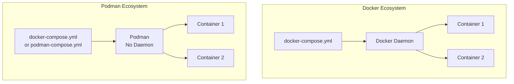
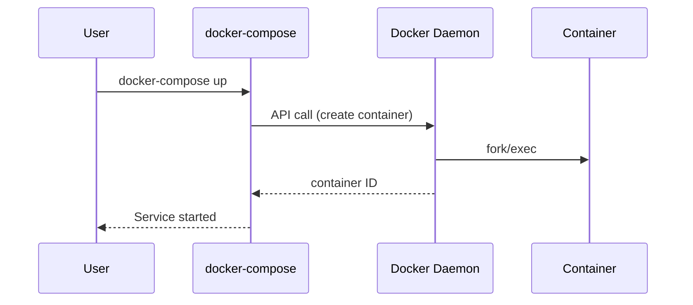
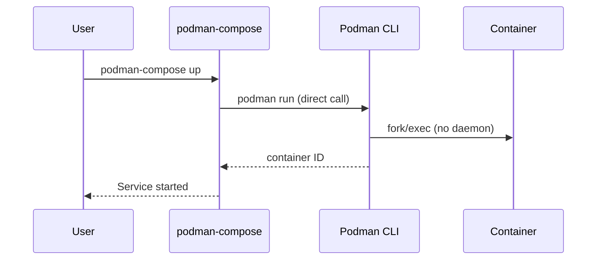
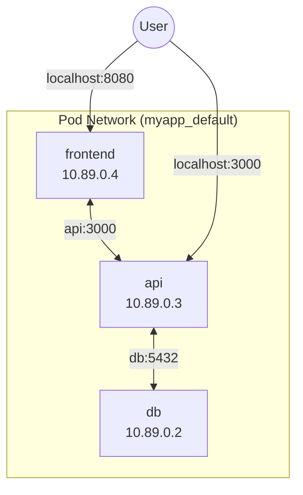
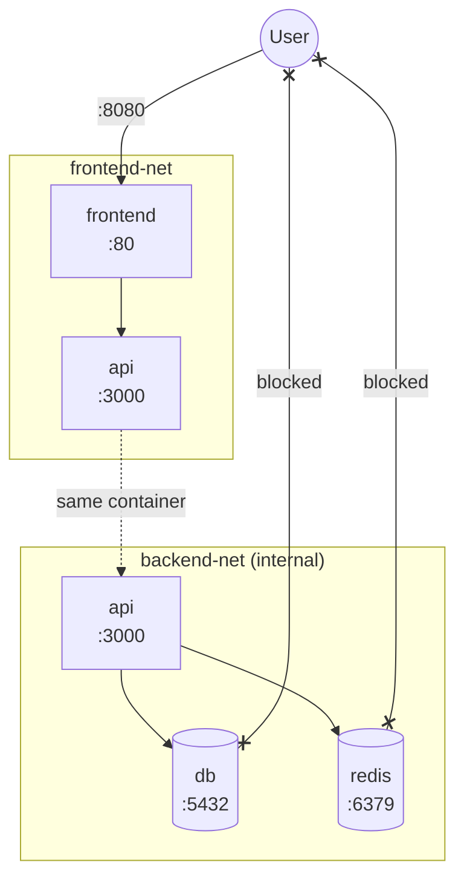

# How to Use Podman Compose

Author: [nawazdhandala](https://www.github.com/nawazdhandala)

Tags: Podman, Podman Compose, Docker Compose, Containers, DevOps, Multi-Container, Rootless Containers

Description: Learn how to use Podman Compose to manage multi-container applications with Docker Compose compatibility. This guide covers installation, networking, volumes, and migrating from Docker Compose to Podman.

---

> "Podman Compose brings the simplicity of Docker Compose to rootless, daemonless container management - giving you the same developer experience with enhanced security and no root privileges required."

Podman has emerged as a powerful alternative to Docker, offering rootless containers and a daemonless architecture. But what about orchestrating multi-container applications? That is where Podman Compose comes in. It provides Docker Compose compatibility, letting you use your existing `docker-compose.yml` files with minimal or no modifications.

This guide walks through using Podman Compose for local development and production deployments, covering networking, volumes, and the key differences from Docker Compose.

---

## Table of Contents

1. What is Podman Compose?
2. podman-compose vs docker-compose
3. Installation
4. Your First Multi-Container Application
5. Networking in Podman Compose
6. Volumes and Persistent Storage
7. Environment Variables and Secrets
8. Production Considerations
9. Migrating from Docker Compose
10. Monitoring with OneUptime

---

## What is Podman Compose?

Podman Compose is a tool that implements the Compose Specification using Podman as the container engine. It reads `docker-compose.yml` (or `podman-compose.yml`) files and translates them into Podman commands to create pods, containers, networks, and volumes.



Key benefits of Podman Compose:

- **Rootless by default**: Run containers without root privileges
- **Daemonless**: No background daemon consuming resources
- **Docker Compose compatible**: Use existing `docker-compose.yml` files
- **Pod support**: Group related containers into Kubernetes-style pods
- **Systemd integration**: Generate systemd unit files for production

---

## podman-compose vs docker-compose

Understanding the differences helps you choose the right tool and avoid surprises.

| Feature | docker-compose | podman-compose |
|---------|---------------|----------------|
| **Daemon** | Requires Docker daemon | Daemonless (direct fork/exec) |
| **Root access** | Root by default | Rootless by default |
| **Pod support** | No native pods | Creates pods for services |
| **Build support** | Full Buildx support | Uses `podman build` |
| **Compose spec version** | v3.x, v2.x | v3.x, v2.x |
| **Network mode** | bridge by default | bridge or slirp4netns |
| **Secrets** | Docker Swarm secrets | File-based secrets |
| **Resource limits** | Full support | Full support |

### Architecture Comparison





The key difference: Docker Compose communicates with a daemon, while Podman Compose directly invokes Podman which forks the container process. This means no persistent daemon and better resource efficiency.

---

## Installation

### Installing Podman

First, install Podman for your operating system.

```bash
# Ubuntu/Debian
# Install Podman from the official repositories
sudo apt update
sudo apt install podman

# Fedora/RHEL/CentOS
# Podman is often pre-installed on Fedora
sudo dnf install podman

# macOS (using Homebrew)
# Podman runs in a lightweight VM on macOS
brew install podman
podman machine init
podman machine start

# Verify installation
podman --version
# podman version 4.9.0
```

### Installing Podman Compose

Podman Compose is a Python package. Install it via pip or your package manager.

```bash
# Using pip (recommended for latest version)
# Works on any system with Python 3.6+
pip3 install podman-compose

# Ubuntu/Debian
# Available in universe repository
sudo apt install podman-compose

# Fedora
# Packaged in official repositories
sudo dnf install podman-compose

# Verify installation
podman-compose --version
# podman-compose version 1.0.6
```

### Verifying Your Setup

```bash
# Check Podman is working with a simple test
podman run --rm hello-world

# Check podman-compose can parse a compose file
# Create a minimal test file to verify everything works
echo 'version: "3"
services:
  test:
    image: alpine
    command: echo "Hello from Podman Compose"' > test-compose.yml

podman-compose -f test-compose.yml up
# Creating pod...
# Hello from Podman Compose

# Clean up the test
podman-compose -f test-compose.yml down
rm test-compose.yml
```

---

## Your First Multi-Container Application

Let us build a typical web application with a frontend, API, and database.

### Project Structure

```
myapp/
├── docker-compose.yml
├── api/
│   ├── Dockerfile
│   └── server.js
└── frontend/
    ├── Dockerfile
    └── index.html
```

### The Compose File

```yaml
# docker-compose.yml
# This file works with both docker-compose and podman-compose
version: "3.8"

services:
  # PostgreSQL database service
  db:
    image: postgres:16-alpine
    container_name: myapp-db
    environment:
      POSTGRES_USER: myapp
      POSTGRES_PASSWORD: secret123
      POSTGRES_DB: myapp
    volumes:
      # Named volume for data persistence across container restarts
      - db-data:/var/lib/postgresql/data
    # Health check ensures dependent services wait for DB readiness
    healthcheck:
      test: ["CMD-SHELL", "pg_isready -U myapp"]
      interval: 5s
      timeout: 5s
      retries: 5

  # Node.js API server
  api:
    build:
      context: ./api
      dockerfile: Dockerfile
    container_name: myapp-api
    environment:
      # Service name 'db' resolves to database container IP
      DATABASE_URL: postgres://myapp:secret123@db:5432/myapp
      NODE_ENV: development
    ports:
      - "3000:3000"
    # Wait for database health check to pass before starting
    depends_on:
      db:
        condition: service_healthy
    # Mount source code for development hot-reload
    volumes:
      - ./api:/app
      - /app/node_modules

  # Nginx frontend server
  frontend:
    build:
      context: ./frontend
      dockerfile: Dockerfile
    container_name: myapp-frontend
    ports:
      - "8080:80"
    depends_on:
      - api

# Named volumes persist data beyond container lifecycle
volumes:
  db-data:
```

### API Dockerfile

```dockerfile
# api/Dockerfile
FROM node:22-alpine

WORKDIR /app

# Copy package files first for better layer caching
# This layer only rebuilds when dependencies change
COPY package*.json ./
RUN npm ci --only=production

# Copy application source code
COPY . .

# Run as non-root user for security
# The 'node' user is built into the node image
USER node

EXPOSE 3000
CMD ["node", "server.js"]
```

### Simple API Server

```javascript
// api/server.js
const http = require('http');

// Simple HTTP server that responds with JSON
// This demonstrates the basic structure of a containerized API
const server = http.createServer((req, res) => {
  // Health check endpoint for container orchestration
  if (req.url === '/health') {
    res.writeHead(200, { 'Content-Type': 'application/json' });
    res.end(JSON.stringify({ status: 'healthy' }));
    return;
  }

  // Main API endpoint returns service information
  res.writeHead(200, { 'Content-Type': 'application/json' });
  res.end(JSON.stringify({
    message: 'Hello from Podman Compose!',
    timestamp: new Date().toISOString(),
    database: process.env.DATABASE_URL ? 'configured' : 'not configured'
  }));
});

const PORT = process.env.PORT || 3000;
server.listen(PORT, '0.0.0.0', () => {
  console.log(`API server running on port ${PORT}`);
});
```

### Running the Application

```bash
# Navigate to project directory
cd myapp

# Start all services in detached (background) mode
# Podman Compose creates containers, networks, and volumes
podman-compose up -d

# View running containers and their status
podman-compose ps
# NAME            STATUS      PORTS
# myapp-db        running
# myapp-api       running     0.0.0.0:3000->3000/tcp
# myapp-frontend  running     0.0.0.0:8080->80/tcp

# Follow logs from all services in real-time
podman-compose logs -f

# View logs from a specific service only
podman-compose logs -f api

# Test the API endpoint
curl http://localhost:3000
# {"message":"Hello from Podman Compose!","timestamp":"2026-01-27T..."}

# Stop all services and remove containers
podman-compose down

# Stop and also remove volumes (complete cleanup)
podman-compose down -v
```

---

## Networking in Podman Compose

Podman Compose creates networks that allow containers to communicate using service names as hostnames.

### Default Network Behavior



By default, Podman Compose creates a bridge network for your services. Containers can reach each other using their service names.

```yaml
# Services communicate using service names as hostnames
services:
  api:
    environment:
      # 'db' resolves to the database container IP address
      DATABASE_URL: postgres://user:pass@db:5432/myapp
```

### Custom Networks

Define custom networks for isolation or specific configurations.

```yaml
# docker-compose.yml with custom networks
version: "3.8"

services:
  frontend:
    image: nginx:alpine
    networks:
      - frontend-net

  api:
    build: ./api
    networks:
      # API connects to both networks, bridging public and private
      - frontend-net
      - backend-net

  db:
    image: postgres:16
    networks:
      # Database is only accessible from backend network
      - backend-net

  redis:
    image: redis:7-alpine
    networks:
      - backend-net

networks:
  # Frontend network for public-facing services
  frontend-net:
    driver: bridge

  # Backend network for internal services only
  backend-net:
    driver: bridge
    internal: true  # Prevents external access to this network
```

### Network Isolation Diagram



### Host Network Mode

For maximum performance (at the cost of isolation):

```yaml
services:
  api:
    image: myapi:latest
    # Container uses host network directly
    # No port mapping needed - binds directly to host ports
    network_mode: host
```

### Inspecting Networks

```bash
# List all networks created by podman-compose
podman network ls

# Inspect a specific network to see configuration and containers
podman network inspect myapp_default

# See which containers are connected to a network
podman network inspect myapp_default --format '{{range .Containers}}{{.Name}} {{end}}'
```

---

## Volumes and Persistent Storage

Podman Compose supports both named volumes and bind mounts.

### Named Volumes

Named volumes are managed by Podman and persist data independently of containers.

```yaml
version: "3.8"

services:
  db:
    image: postgres:16
    volumes:
      # Named volume - data persists across container restarts
      - pgdata:/var/lib/postgresql/data

  redis:
    image: redis:7-alpine
    volumes:
      # Named volume with driver options
      - redis-data:/data
    # Enable AOF persistence for Redis
    command: redis-server --appendonly yes

volumes:
  pgdata:
    # Default local driver stores data on host filesystem
    driver: local

  redis-data:
    driver: local
    driver_opts:
      type: none
      o: bind
      device: /srv/redis-data  # Specific host path for volume
```

### Bind Mounts for Development

Bind mounts map host directories into containers - essential for development.

```yaml
services:
  api:
    build: ./api
    volumes:
      # Bind mount: host path : container path
      # :Z suffix relabels for SELinux (Fedora/RHEL)
      - ./api/src:/app/src:Z
      # Anonymous volume preserves node_modules from image
      - /app/node_modules

  frontend:
    build: ./frontend
    volumes:
      # Read-only bind mount for static files
      # :ro prevents container from modifying host files
      - ./frontend/dist:/usr/share/nginx/html:ro,Z
```

The `:Z` suffix is important for SELinux systems (Fedora, RHEL) - it relabels the content for container access.

### Volume Backup and Restore

```bash
# List all volumes managed by Podman
podman volume ls

# Inspect a volume to see its mount point on host
podman volume inspect myapp_pgdata

# Backup a volume to a tar file
# This creates a compressed archive of all volume data
podman run --rm \
  -v myapp_pgdata:/data:ro \
  -v $(pwd):/backup \
  alpine tar czf /backup/pgdata-backup.tar.gz -C /data .

# Restore volume from backup
# Extracts the archive into the named volume
podman run --rm \
  -v myapp_pgdata:/data \
  -v $(pwd):/backup:ro \
  alpine tar xzf /backup/pgdata-backup.tar.gz -C /data
```

---

## Environment Variables and Secrets

### Environment Variables

Multiple ways to pass environment variables:

```yaml
version: "3.8"

services:
  api:
    image: myapi:latest
    environment:
      # Direct values specified in compose file
      NODE_ENV: production
      LOG_LEVEL: info
      # Reference host environment variable
      API_KEY: ${API_KEY}
      # With default value if variable is not set
      PORT: ${PORT:-3000}

    # Load environment variables from files
    env_file:
      - .env
      - .env.local  # Overrides values from .env
```

```bash
# .env file
# Store configuration that varies between environments
DATABASE_URL=postgres://user:pass@db:5432/myapp
REDIS_URL=redis://redis:6379
JWT_SECRET=your-secret-key
```

### Secrets Management

For sensitive data, use file-based secrets:

```yaml
version: "3.8"

services:
  api:
    image: myapi:latest
    secrets:
      - db_password
      - api_key
    environment:
      # Tell application where to read secret
      DB_PASSWORD_FILE: /run/secrets/db_password

secrets:
  db_password:
    # Secrets are mounted read-only at /run/secrets/
    file: ./secrets/db_password.txt
  api_key:
    file: ./secrets/api_key.txt
```

```javascript
// api/server.js - Reading secrets from files
const fs = require('fs');

// Helper function to read secrets from file or environment
function readSecret(name) {
  const filePath = process.env[`${name}_FILE`] || `/run/secrets/${name}`;
  try {
    // Read secret from mounted file
    return fs.readFileSync(filePath, 'utf8').trim();
  } catch (err) {
    // Fall back to environment variable for local development
    return process.env[name];
  }
}

const dbPassword = readSecret('DB_PASSWORD');
```

---

## Production Considerations

### Generating Systemd Units

Podman can generate systemd unit files for production deployments.

```bash
# Start your services first
podman-compose up -d

# Generate systemd units for containers
# --new flag ensures container is recreated on service start
podman generate systemd --new --files --name myapp-api
podman generate systemd --new --files --name myapp-db

# Move to user systemd directory
mkdir -p ~/.config/systemd/user/
mv container-myapp-*.service ~/.config/systemd/user/

# Reload systemd and enable services
systemctl --user daemon-reload
systemctl --user enable container-myapp-api.service
systemctl --user start container-myapp-api.service

# Enable lingering so services start on boot without login
loginctl enable-linger $USER
```

### Resource Limits

Specify CPU and memory limits:

```yaml
version: "3.8"

services:
  api:
    image: myapi:latest
    deploy:
      resources:
        # Hard limits - container cannot exceed these
        limits:
          cpus: "2.0"
          memory: 512M
        # Reservations - guaranteed minimum resources
        reservations:
          cpus: "0.5"
          memory: 256M
```

### Restart Policies

```yaml
services:
  api:
    image: myapi:latest
    # Restart unless explicitly stopped
    restart: unless-stopped

  worker:
    image: myworker:latest
    # Only restart on non-zero exit code
    restart: on-failure
    deploy:
      restart_policy:
        condition: on-failure
        max_attempts: 3
        delay: 5s
```

### Health Checks

```yaml
services:
  api:
    image: myapi:latest
    healthcheck:
      # Command to determine if container is healthy
      test: ["CMD", "curl", "-f", "http://localhost:3000/health"]
      interval: 30s      # Time between health checks
      timeout: 10s       # Maximum time for check to complete
      retries: 3         # Failures before marking unhealthy
      start_period: 40s  # Grace period during startup
```

---

## Migrating from Docker Compose

### Compatibility Check

Most `docker-compose.yml` files work with Podman Compose without changes. Here is what to check:

```bash
# Validate your existing compose file with podman-compose
# This parses the file and shows the resolved configuration
podman-compose -f docker-compose.yml config
```

### Common Adjustments

```yaml
# docker-compose.yml adjustments for Podman

version: "3.8"

services:
  web:
    image: nginx:alpine
    # Podman-specific: Add :Z for SELinux relabeling on Fedora/RHEL
    volumes:
      - ./html:/usr/share/nginx/html:Z

    # Rootless Podman cannot bind to ports below 1024 by default
    # Either use higher ports or configure sysctl
    ports:
      - "8080:80"  # Use 8080 instead of 80 for rootless

  app:
    build: .
    # Ensure Dockerfile uses non-root user
    # Podman runs rootless by default
    user: "1000:1000"
```

### Migration Script

```bash
#!/bin/bash
# migrate-to-podman.sh - Helper script for migration

set -e

echo "Checking Podman installation..."
if ! command -v podman &> /dev/null; then
    echo "Podman not installed. Please install it first."
    exit 1
fi

echo "Checking podman-compose installation..."
if ! command -v podman-compose &> /dev/null; then
    echo "Installing podman-compose..."
    pip3 install podman-compose
fi

echo "Validating compose file..."
podman-compose config > /dev/null

echo "Pulling images..."
podman-compose pull

echo "Building local images..."
podman-compose build

echo "Starting services..."
podman-compose up -d

echo "Checking service status..."
podman-compose ps

echo "Migration complete! Services are running."
echo "Use 'podman-compose logs -f' to view logs"
```

### Alias for Convenience

```bash
# Add to ~/.bashrc or ~/.zshrc
# These aliases allow existing scripts to work without modification
alias docker-compose='podman-compose'
alias docker='podman'

# Now existing scripts work transparently
docker-compose up -d
```

---

## Monitoring with OneUptime

Production container deployments need proper observability. Monitor your Podman Compose applications with OneUptime.

### Container Health Monitoring

```yaml
# docker-compose.yml with monitoring
version: "3.8"

services:
  api:
    image: myapi:latest
    healthcheck:
      test: ["CMD", "curl", "-f", "http://localhost:3000/health"]
      interval: 30s
      timeout: 10s
      retries: 3
    labels:
      # Labels for monitoring discovery
      oneuptime.monitor: "true"
      oneuptime.service: "myapp-api"

  # OpenTelemetry Collector for metrics and traces
  otel-collector:
    image: otel/opentelemetry-collector-contrib:latest
    command: ["--config=/etc/otel-config.yaml"]
    volumes:
      - ./otel-config.yaml:/etc/otel-config.yaml:ro,Z
    ports:
      - "4317:4317"   # OTLP gRPC receiver
      - "4318:4318"   # OTLP HTTP receiver
```

### OpenTelemetry Configuration

```yaml
# otel-config.yaml
# OpenTelemetry Collector configuration for OneUptime
receivers:
  otlp:
    protocols:
      grpc:
        endpoint: 0.0.0.0:4317
      http:
        endpoint: 0.0.0.0:4318

processors:
  batch:
    # Batch telemetry data for efficient export
    timeout: 10s

exporters:
  otlphttp:
    # Send telemetry to OneUptime
    endpoint: https://otlp.oneuptime.com
    headers:
      x-oneuptime-token: ${ONEUPTIME_TOKEN}

service:
  pipelines:
    traces:
      receivers: [otlp]
      processors: [batch]
      exporters: [otlphttp]
    metrics:
      receivers: [otlp]
      processors: [batch]
      exporters: [otlphttp]
```

### Key Metrics to Monitor

| Metric | Description | Alert Threshold |
|--------|-------------|-----------------|
| Container CPU | CPU usage per container | > 80% sustained |
| Container Memory | Memory usage and limits | > 90% of limit |
| Container Restarts | Restart count | > 3 in 5 minutes |
| Health Check Failures | Failed health probes | > 2 consecutive |
| Network I/O | Traffic in/out | Anomaly detection |
| Volume Usage | Disk space consumption | > 85% full |

### Health Check Endpoint Pattern

```javascript
// api/server.js - Production-ready health endpoint
const http = require('http');

// Track service dependencies health status
const dependencies = {
  database: { healthy: false, lastCheck: null },
  redis: { healthy: false, lastCheck: null }
};

async function checkDatabase() {
  // Implement actual database connectivity check
  try {
    // await db.query('SELECT 1');
    dependencies.database.healthy = true;
  } catch (err) {
    dependencies.database.healthy = false;
  }
  dependencies.database.lastCheck = new Date().toISOString();
}

// Health check endpoint for monitoring and orchestration
function handleHealthCheck(req, res) {
  const isHealthy = Object.values(dependencies).every(d => d.healthy);

  // Return 503 if any dependency is unhealthy
  res.writeHead(isHealthy ? 200 : 503, {
    'Content-Type': 'application/json'
  });

  res.end(JSON.stringify({
    status: isHealthy ? 'healthy' : 'unhealthy',
    timestamp: new Date().toISOString(),
    dependencies,
    uptime: process.uptime()
  }));
}

const server = http.createServer((req, res) => {
  if (req.url === '/health') {
    return handleHealthCheck(req, res);
  }
  // ... other routes
});
```

With [OneUptime](https://oneuptime.com), you can:

- Set up uptime monitors for your container endpoints
- Create custom dashboards for container metrics
- Configure alerts for container health issues
- Correlate container events with application traces
- Track resource usage trends over time

---

## Summary

| Concept | Key Points |
|---------|------------|
| **Installation** | Install Podman first, then `pip install podman-compose` |
| **Compatibility** | Most docker-compose.yml files work unchanged |
| **Networking** | Service names resolve to container IPs automatically |
| **Volumes** | Use `:Z` suffix on bind mounts for SELinux systems |
| **Rootless** | Default mode - no root required for containers |
| **Production** | Generate systemd units with `podman generate systemd` |
| **Migration** | Alias `docker-compose` to `podman-compose` for easy transition |

Podman Compose brings container orchestration to the Podman ecosystem while maintaining Docker Compose compatibility. The rootless, daemonless architecture provides enhanced security for development and production workloads. Combined with systemd integration and [OneUptime](https://oneuptime.com) monitoring, you have a complete solution for running containerized applications.

---

### See Also

- [10 Docker Superpowers Developers Forget to Use](/blog/post/2025-11-27-ten-docker-superpowers-youre-probably-not-using/) - Advanced container techniques
- [Debug Docker Containers Like a Pro](/blog/post/2025-11-27-debug-docker-containers/) - Container debugging strategies
- [Migrate Legacy VMs to Docker](/blog/post/2025-11-27-migrate-legacy-vms-to-docker/) - Containerization migration guide
