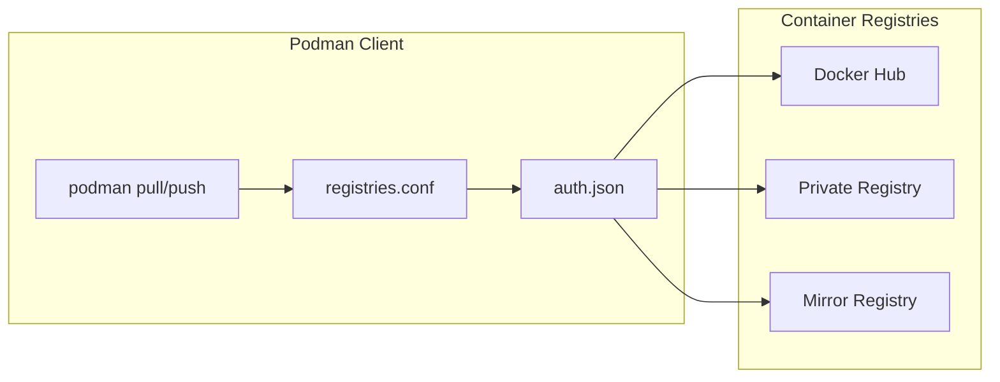
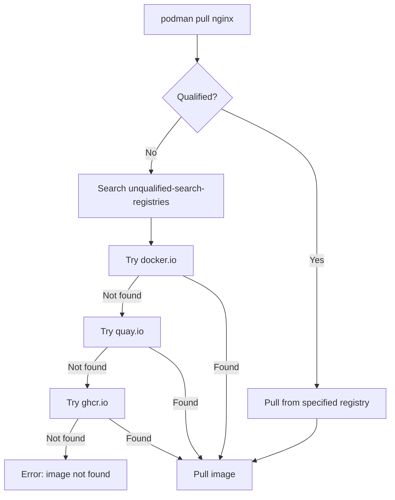
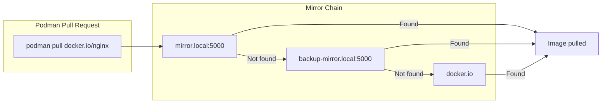
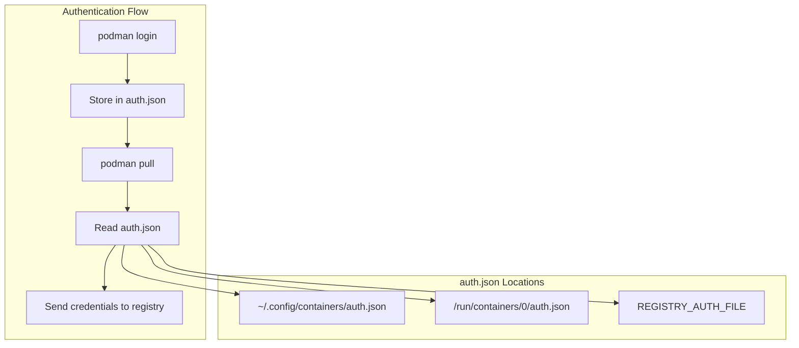

# How to Configure Podman Registry

Author: [nawazdhandala](https://www.github.com/nawazdhandala)

Tags: Podman, Container Registry, Docker, Containers, DevOps, Security

Description: A comprehensive guide to configuring container registries in Podman, covering registry configuration, insecure registries, mirror registries, and credential management for seamless container workflows.

---

> "The container registry is the heart of your container ecosystem. Configure it well, and your deployments flow smoothly. Configure it poorly, and you'll spend hours debugging pull failures." - Container Engineering Wisdom

Podman is a daemonless container engine that provides a Docker-compatible CLI. One of its key strengths is flexible registry configuration. This guide walks you through everything you need to know about configuring registries in Podman.

## Understanding Podman Registry Architecture

Before diving into configuration, let's understand how Podman interacts with container registries.



Podman uses two main configuration files:
- `/etc/containers/registries.conf` - Registry configuration (system-wide)
- `~/.config/containers/registries.conf` - Registry configuration (user-specific)
- `~/.config/containers/auth.json` - Authentication credentials

## Basic Registry Configuration

The main configuration file is `registries.conf`. Here's how to set it up.

### Location of Configuration Files

```bash
# System-wide configuration (requires root)
/etc/containers/registries.conf

# User-specific configuration (preferred for rootless Podman)
~/.config/containers/registries.conf

# Check which config file Podman is using
podman info | grep -A 20 registries
```

### Default Registry Configuration

```toml
# /etc/containers/registries.conf

# Specify registries to search when pulling unqualified images
# (images without a registry prefix like "nginx" instead of "docker.io/library/nginx")
unqualified-search-registries = ["docker.io", "quay.io", "ghcr.io"]

# Short name mode controls how Podman handles unqualified image names
# "enforcing" - always prompt for registry selection
# "permissive" - use first matching registry without prompting
short-name-mode = "enforcing"
```

### Understanding Unqualified Image Names

When you run `podman pull nginx`, Podman doesn't know which registry to use. The `unqualified-search-registries` option tells Podman where to look.

```bash
# Without qualified name - searches registries in order
podman pull nginx

# With qualified name - goes directly to specified registry
podman pull docker.io/library/nginx
```



## Configuring Insecure Registries

For development environments or private registries without TLS certificates, you may need to allow insecure connections.

### Allow Insecure Registry (HTTP)

```toml
# /etc/containers/registries.conf

# Define a registry that uses HTTP instead of HTTPS
[[registry]]
location = "my-registry.local:5000"
insecure = true
```

### Allow Self-Signed Certificates

```toml
# /etc/containers/registries.conf

# Trust a registry with self-signed certificate
[[registry]]
location = "registry.internal.company.com"
insecure = true

# Alternatively, add the CA certificate to the system trust store
# Then you can use:
[[registry]]
location = "registry.internal.company.com"
insecure = false
```

### Adding CA Certificates for Private Registries

```bash
# Copy your CA certificate to the trust store
sudo cp my-ca.crt /etc/pki/ca-trust/source/anchors/

# Update the certificate trust
sudo update-ca-trust

# For Debian/Ubuntu systems
sudo cp my-ca.crt /usr/local/share/ca-certificates/
sudo update-ca-certificates

# Verify the certificate is trusted
openssl s_client -connect registry.internal.company.com:443 -CApath /etc/ssl/certs/
```

### Per-Registry TLS Configuration

```toml
# /etc/containers/registries.conf

[[registry]]
location = "secure-registry.company.com"

# Specify custom CA certificate for this registry only
# This avoids modifying system-wide certificate trust
[[registry.mirror]]
location = "secure-registry.company.com"
insecure = false

# Custom certificate directory
# Place your CA cert here: /etc/containers/certs.d/secure-registry.company.com/ca.crt
```

Create the certificate directory structure:

```bash
# Create directory for registry certificates
sudo mkdir -p /etc/containers/certs.d/secure-registry.company.com/

# Copy your CA certificate
sudo cp my-ca.crt /etc/containers/certs.d/secure-registry.company.com/ca.crt

# Verify the setup
podman pull secure-registry.company.com/myimage:latest
```

## Configuring Mirror Registries

Mirror registries are useful for:
- Reducing bandwidth by caching images locally
- Improving pull performance
- Providing redundancy when the primary registry is unavailable
- Air-gapped environments

### Basic Mirror Configuration

```toml
# /etc/containers/registries.conf

# Mirror Docker Hub through a local registry
[[registry]]
location = "docker.io"

[[registry.mirror]]
location = "mirror.local:5000"
insecure = true

[[registry.mirror]]
location = "backup-mirror.local:5000"
insecure = true
```



### Mirror with Pull-Through Cache

```toml
# /etc/containers/registries.conf

# Configure pull-through cache for Docker Hub
[[registry]]
prefix = "docker.io"
location = "docker.io"

# Primary mirror - pull-through cache
[[registry.mirror]]
location = "cache.internal:5000"
insecure = false

# Fallback to original registry if cache fails
[[registry.mirror]]
location = "docker.io"
```

### Setting Up a Registry Mirror with Podman

```bash
# Run a registry as a pull-through cache
podman run -d \
  --name registry-mirror \
  -p 5000:5000 \
  -v registry-data:/var/lib/registry \
  -e REGISTRY_PROXY_REMOTEURL=https://registry-1.docker.io \
  docker.io/library/registry:2

# Test the mirror
podman pull localhost:5000/library/nginx:latest
```

### Air-Gapped Environment Configuration

For environments without internet access:

```toml
# /etc/containers/registries.conf

# Block all external registries
# Only allow pulls from internal mirror
[[registry]]
prefix = "docker.io"
location = "internal-registry.airgap.local:5000"
blocked = false

[[registry]]
prefix = "quay.io"
location = "internal-registry.airgap.local:5000"
blocked = false

[[registry]]
prefix = "gcr.io"
location = "internal-registry.airgap.local:5000"
blocked = false

# Block direct access to public registries
[[registry]]
location = "docker.io"
blocked = true

[[registry]]
location = "quay.io"
blocked = true
```

## Credential Management

Podman stores credentials in `auth.json`, compatible with Docker's credential format.

### Login to a Registry

```bash
# Interactive login - prompts for username and password
podman login docker.io

# Login with credentials from command line (not recommended for scripts)
podman login -u myuser -p mypassword registry.example.com

# Login with credentials from stdin (safer for automation)
echo $REGISTRY_PASSWORD | podman login -u myuser --password-stdin registry.example.com

# Login to multiple registries
podman login docker.io
podman login quay.io
podman login ghcr.io
```

### Understanding auth.json

```bash
# View stored credentials (base64 encoded)
cat ~/.config/containers/auth.json
```

```json
{
    "auths": {
        "docker.io": {
            "auth": "bXl1c2VyOm15cGFzc3dvcmQ="
        },
        "quay.io": {
            "auth": "bXl1c2VyOm15cGFzc3dvcmQ="
        },
        "ghcr.io": {
            "auth": "bXl1c2VyOm15dG9rZW4="
        }
    }
}
```



### Using Credential Helpers

Credential helpers provide secure storage for registry credentials.

```bash
# Install credential helper (example: pass-based helper)
sudo dnf install podman-docker-credential-helpers

# Or for Debian/Ubuntu
sudo apt install golang-docker-credential-helpers
```

Configure the credential helper:

```json
{
    "credHelpers": {
        "docker.io": "pass",
        "quay.io": "secretservice",
        "gcr.io": "gcloud"
    }
}
```

### Environment Variable Authentication

```bash
# Set custom auth file location
export REGISTRY_AUTH_FILE=/path/to/custom/auth.json

# Login will now use custom location
podman login docker.io

# Pull will also use custom location
podman pull docker.io/library/nginx
```

### Authentication in CI/CD Pipelines

```bash
#!/bin/bash
# ci-registry-login.sh - Secure registry authentication for CI/CD

# Create auth file from environment variables
# REGISTRY_USER and REGISTRY_PASSWORD should be CI/CD secrets
mkdir -p ~/.config/containers

# Use podman login with stdin to avoid password in process list
echo "${REGISTRY_PASSWORD}" | podman login \
    --username "${REGISTRY_USER}" \
    --password-stdin \
    "${REGISTRY_URL}"

# Verify login succeeded
if [ $? -eq 0 ]; then
    echo "Successfully authenticated to ${REGISTRY_URL}"
else
    echo "Failed to authenticate to ${REGISTRY_URL}"
    exit 1
fi
```

### Managing Multiple Credential Files

```bash
# Create separate auth files for different environments
mkdir -p ~/.config/containers/auth

# Development credentials
REGISTRY_AUTH_FILE=~/.config/containers/auth/dev.json \
    podman login dev-registry.local

# Production credentials
REGISTRY_AUTH_FILE=~/.config/containers/auth/prod.json \
    podman login prod-registry.company.com

# Use specific credentials for a pull
REGISTRY_AUTH_FILE=~/.config/containers/auth/prod.json \
    podman pull prod-registry.company.com/myapp:latest
```

## Complete Configuration Example

Here's a comprehensive `registries.conf` for a typical enterprise environment:

```toml
# /etc/containers/registries.conf
# Complete Podman registry configuration

# Search order for unqualified images
unqualified-search-registries = ["registry.internal.company.com", "docker.io"]

# Enforce explicit registry selection for security
short-name-mode = "enforcing"

# Internal company registry (primary)
[[registry]]
prefix = "registry.internal.company.com"
location = "registry.internal.company.com"
insecure = false

# Docker Hub with internal mirror
[[registry]]
prefix = "docker.io"
location = "docker.io"

# Try internal mirror first
[[registry.mirror]]
location = "mirror.internal.company.com:5000"
insecure = false

# Fall back to Docker Hub
[[registry.mirror]]
location = "docker.io"
insecure = false

# Quay.io with mirror
[[registry]]
prefix = "quay.io"
location = "quay.io"

[[registry.mirror]]
location = "mirror.internal.company.com:5000/quay"
insecure = false

[[registry.mirror]]
location = "quay.io"
insecure = false

# GitHub Container Registry
[[registry]]
prefix = "ghcr.io"
location = "ghcr.io"
insecure = false

# Development registry (HTTP allowed)
[[registry]]
prefix = "dev-registry.local"
location = "dev-registry.local:5000"
insecure = true

# Block untrusted registries
[[registry]]
location = "untrusted-registry.com"
blocked = true
```

## Troubleshooting Registry Issues

### Common Problems and Solutions

```bash
# Check Podman's registry configuration
podman info --format '{{range .Registries.Search}}{{.}}{{"\n"}}{{end}}'

# Debug registry connection
podman pull --log-level debug docker.io/library/nginx

# Test registry connectivity
curl -v https://registry.example.com/v2/

# Verify TLS certificate
openssl s_client -connect registry.example.com:443 -servername registry.example.com

# Check if credentials are stored
podman login --get-login docker.io

# List all logged-in registries
cat ~/.config/containers/auth.json | jq '.auths | keys'
```

### Registry Configuration Validation

```bash
#!/bin/bash
# validate-registry-config.sh - Validate Podman registry configuration

echo "=== Checking Registry Configuration ==="

# Check config file syntax
if podman info > /dev/null 2>&1; then
    echo "[OK] registries.conf syntax is valid"
else
    echo "[ERROR] registries.conf has syntax errors"
    podman info 2>&1 | head -20
    exit 1
fi

# List configured registries
echo -e "\n=== Configured Search Registries ==="
podman info --format '{{range .Registries.Search}}{{.}}{{"\n"}}{{end}}'

# Test authentication
echo -e "\n=== Testing Registry Authentication ==="
for registry in docker.io quay.io ghcr.io; do
    if podman login --get-login "$registry" > /dev/null 2>&1; then
        echo "[OK] Authenticated to $registry"
    else
        echo "[WARN] Not authenticated to $registry"
    fi
done

# Test image pull
echo -e "\n=== Testing Image Pull ==="
if podman pull --quiet docker.io/library/alpine:latest > /dev/null 2>&1; then
    echo "[OK] Successfully pulled test image"
    podman rmi docker.io/library/alpine:latest > /dev/null 2>&1
else
    echo "[ERROR] Failed to pull test image"
fi
```

## Monitoring Registry Operations

To ensure your container registry operations are running smoothly, proper monitoring is essential. [OneUptime](https://oneuptime.com) provides comprehensive monitoring for your container infrastructure:

- **Registry Health Checks**: Monitor your private registry endpoints for availability
- **Pull/Push Latency**: Track container image transfer times
- **Authentication Failures**: Alert on failed login attempts
- **Certificate Expiry**: Get notified before TLS certificates expire
- **Incident Management**: Coordinate responses when registry issues occur

With OneUptime, you can set up custom monitors for your registry endpoints, create status pages for your container infrastructure, and receive alerts through multiple channels when issues arise.

## Summary

Configuring Podman registries properly is essential for a smooth container workflow. Key takeaways:

1. **Use qualified image names** when possible to avoid ambiguity
2. **Configure mirrors** for better performance and reliability
3. **Secure your credentials** using credential helpers or environment variables
4. **Test your configuration** before deploying to production
5. **Monitor your registries** to catch issues before they impact your workflows

The flexibility of Podman's registry configuration makes it well-suited for both simple development setups and complex enterprise environments with multiple registries, mirrors, and security requirements.
