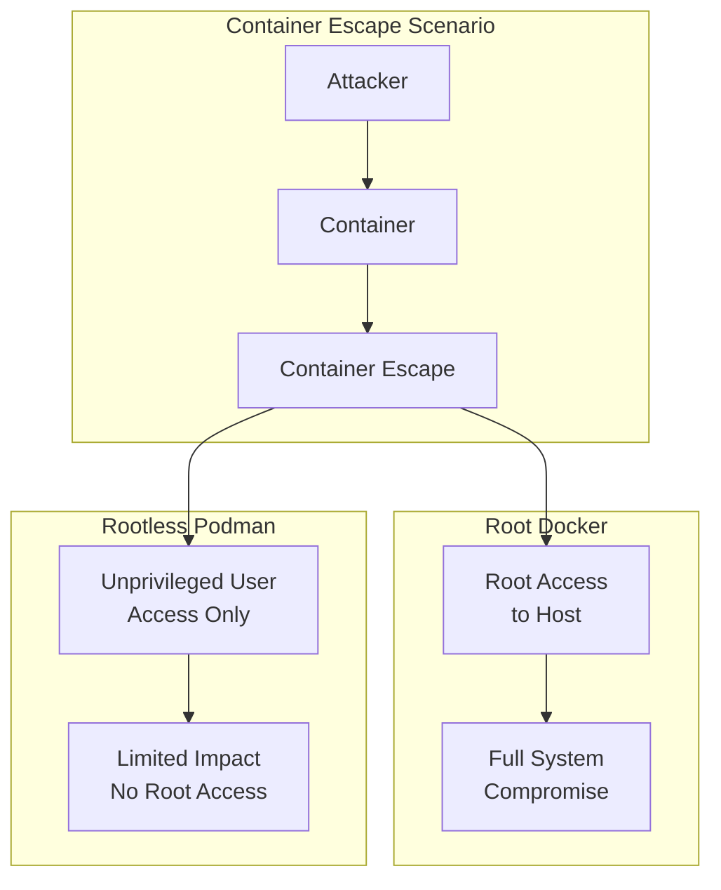

# How to Run Rootless Containers with Podman

Author: [nawazdhandala](https://www.github.com/nawazdhandala)

Tags: Podman, Containers, Security, Rootless, Linux, DevOps, Docker Alternative

Description: A comprehensive guide to running containers without root privileges using Podman, covering user namespace mapping, storage configuration, networking, and security best practices.

---

> Running containers as root is a security liability. A container escape means immediate root access to your host. Podman's rootless mode eliminates this risk by running containers entirely in user space, with no elevated privileges required.

## Why Rootless Containers Matter

Traditional container runtimes like Docker require a root daemon. This creates a massive attack surface. If an attacker escapes a container, they have root access to the host.

Podman takes a different approach. It runs containers without a daemon and supports rootless operation out of the box. No root, no daemon, no problem.


## Setting Up Rootless Mode

Podman supports rootless mode by default on most Linux distributions. Here is how to verify and configure it.

### Install Podman

```bash
# Fedora/RHEL/CentOS
# Install podman using dnf package manager
sudo dnf install podman

# Ubuntu/Debian
# Update package lists and install podman
sudo apt-get update
sudo apt-get install podman

# Arch Linux
# Install podman using pacman
sudo pacman -S podman
```

### Verify Rootless Setup

```bash
# Check if you can run containers without sudo
# This should work without any root privileges
podman run --rm alpine echo "Rootless works!"

# Verify you are running rootless
# Output should be: true
podman info --format '{{.Host.Security.Rootless}}'
```

### Enable User Namespaces (If Needed)

Some systems require enabling user namespaces at the kernel level.

```bash
# Check current setting
# Output: 1 means enabled, 0 means disabled
cat /proc/sys/kernel/unprivileged_userns_clone

# Enable if disabled (requires root)
sudo sysctl -w kernel.unprivileged_userns_clone=1

# Make the setting permanent across reboots
echo "kernel.unprivileged_userns_clone=1" | sudo tee /etc/sysctl.d/userns.conf
```

## User Namespace Mapping

User namespaces map container UIDs to unprivileged host UIDs. Root inside the container is not root on the host.


### Configure Subordinate UIDs and GIDs

The `/etc/subuid` and `/etc/subgid` files define the range of UIDs/GIDs your user can map.

```bash
# Check your current allocation
# Format: username:start_uid:count
cat /etc/subuid
# Output: youruser:100000:65536

cat /etc/subgid
# Output: youruser:100000:65536

# This means youruser can use UIDs 100000-165535
# Container UID 0 maps to host UID 100000
# Container UID 1 maps to host UID 100001
# And so on...
```

### Add or Modify Subordinate ID Ranges

```bash
# Add a new user with subordinate IDs
# usermod adds 65536 subordinate UIDs/GIDs starting at 100000
sudo usermod --add-subuids 100000-165535 --add-subgids 100000-165535 youruser

# Or directly edit the files to add entries
echo "youruser:100000:65536" | sudo tee -a /etc/subuid
echo "youruser:100000:65536" | sudo tee -a /etc/subgid
```

### Verify UID Mapping in a Running Container

```bash
# Run a container and check the UID mapping
# Shows how UIDs are mapped between container and host
podman run --rm alpine cat /proc/self/uid_map
# Output:
#          0     100000      65536
# Inside    Host     Range
# UID       UID

# Check from the host side
# Find the container process - it runs as your user, not root
ps aux | grep -E 'conmon|podman'
```

## Storage Configuration

Rootless Podman uses different storage locations and drivers than root mode.

### Default Storage Locations

```bash
# Rootless storage is in your home directory
# Contains images, containers, and volumes
ls ~/.local/share/containers/storage/

# Configuration file location
cat ~/.config/containers/storage.conf
```

### Configure Storage Driver

The default driver depends on your system. `overlay` is preferred but requires kernel support.

```bash
# Check current storage driver
podman info --format '{{.Store.GraphDriverName}}'

# Create configuration directory if it does not exist
mkdir -p ~/.config/containers

# Create storage.conf with recommended settings
cat > ~/.config/containers/storage.conf << 'EOF'
[storage]
# Use overlay driver for best performance
driver = "overlay"

# Store images and containers here
graphroot = "/home/youruser/.local/share/containers/storage"

# Temporary files location (uses XDG runtime dir)
runroot = "/run/user/1000/containers"

[storage.options]
# Enable fuse-overlayfs as fallback when native overlay is unavailable
mount_program = "/usr/bin/fuse-overlayfs"

[storage.options.overlay]
# Use metacopy for copy-on-write efficiency
mountopt = "nodev,metacopy=on"
EOF
```

### Migrate Storage Between Drivers

```bash
# Reset storage if changing drivers
# WARNING: This deletes all images and containers
podman system reset

# Verify new driver is active
podman info --format '{{.Store.GraphDriverName}}'
```

### Storage Space Management

```bash
# Check disk usage for images, containers, and volumes
podman system df

# Clean up all unused resources (images, containers, volumes)
podman system prune -a

# Remove only dangling images (untagged and unreferenced)
podman image prune

# Remove only stopped containers
podman container prune
```

## Networking in Rootless Mode

Rootless containers have networking limitations because they cannot create real network interfaces. Podman uses slirp4netns or pasta for user-mode networking.


### Network Modes

```bash
# Default: slirp4netns (older, more compatible)
podman run --rm --network slirp4netns alpine ip addr

# Pasta: newer, faster, better port forwarding
podman run --rm --network pasta alpine ip addr

# Host network (limited in rootless mode)
podman run --rm --network host alpine ip addr

# No network - completely isolated
podman run --rm --network none alpine ip addr
```

### Configure Default Network Mode

```bash
# Create containers.conf for Podman configuration
mkdir -p ~/.config/containers

cat > ~/.config/containers/containers.conf << 'EOF'
[containers]
# Use pasta for better performance (requires pasta package)
default_network = "pasta"

[network]
# Default subnet for container networks
default_subnet = "10.88.0.0/16"
EOF
```

### Port Forwarding

```bash
# Forward host port 8080 to container port 80
podman run -d -p 8080:80 nginx

# Note: Rootless containers cannot bind to ports below 1024
# This will fail:
podman run -d -p 80:80 nginx
# Error: rootlessport cannot expose privileged port 80

# Solution 1: Use a high port (recommended)
podman run -d -p 8080:80 nginx

# Solution 2: Allow unprivileged port binding (requires root once)
sudo sysctl -w net.ipv4.ip_unprivileged_port_start=80

# Make the setting permanent
echo "net.ipv4.ip_unprivileged_port_start=80" | sudo tee /etc/sysctl.d/unprivileged-ports.conf
```

### Create Custom Networks

```bash
# Create a user-defined network for container communication
podman network create mynetwork

# Run containers on the network
podman run -d --name web --network mynetwork nginx
podman run -d --name app --network mynetwork alpine sleep infinity

# Containers can reach each other by name (DNS resolution)
podman exec app ping -c 2 web
```

## Security Benefits

Rootless containers provide defense in depth. Even if an attacker escapes the container, they only have your user privileges, not root.



### Security Features Comparison

```bash
# Check if seccomp is enabled
podman info --format '{{range .Host.Security.SECCOMPEnabled}}{{.}}{{end}}'

# Verify rootless mode is active
podman info --format '{{.Host.Security.Rootless}}'

# Check if SELinux is enabled
podman info --format '{{.Host.Security.SELinuxEnabled}}'

# View seccomp profile in a running container
# Output: Seccomp: 2 means seccomp filter is active
podman run --rm alpine cat /proc/self/status | grep Seccomp
```

### Run with Additional Security Options

```bash
# Drop all capabilities except those needed
# This minimizes the attack surface significantly
podman run --rm \
  --cap-drop=ALL \
  --cap-add=NET_BIND_SERVICE \
  nginx

# Read-only root filesystem prevents filesystem modifications
# Use tmpfs for directories that need writes
podman run --rm \
  --read-only \
  --tmpfs /tmp \
  --tmpfs /var/cache/nginx \
  nginx

# No new privileges prevents SUID/SGID binaries from working
podman run --rm \
  --security-opt=no-new-privileges \
  alpine

# Apply a custom seccomp profile for fine-grained syscall filtering
podman run --rm \
  --security-opt seccomp=/path/to/profile.json \
  alpine
```

### User Namespace Isolation Verification

```bash
# Inside container, you appear to be root
podman run --rm alpine id
# Output: uid=0(root) gid=0(root)

# But on the host, you are just your user
# Run this on the host while container is running:
podman run -d --name test alpine sleep 60
ps aux | grep "sleep 60"
# Shows process running as your user, not root

# The container root cannot affect host files
podman exec test touch /etc/passwd
# Works inside container

# But it is isolated - the file is in container filesystem
# not the real /etc/passwd
ls -la ~/.local/share/containers/storage/overlay/*/merged/etc/passwd

# Clean up test container
podman rm -f test
```

## Best Practices Summary

### Do

- Always use rootless mode for development and CI/CD
- Configure proper subordinate UID/GID ranges
- Use overlay storage driver with fuse-overlayfs fallback
- Use pasta network mode for better performance
- Drop unnecessary capabilities
- Use read-only root filesystems when possible
- Keep Podman and dependencies updated

### Avoid

- Running as root unless absolutely necessary
- Binding to privileged ports without proper configuration
- Sharing the host network namespace carelessly
- Ignoring storage driver compatibility issues
- Skipping user namespace configuration validation

### Configuration Checklist

```bash
#!/bin/bash
# Rootless Podman health check script
# Run this to verify your rootless setup is correct

echo "=== Rootless Podman Configuration Check ==="

echo -e "\n[1] Checking if running rootless..."
if podman info --format '{{.Host.Security.Rootless}}' | grep -q true; then
    echo "PASS: Running in rootless mode"
else
    echo "FAIL: Not running rootless"
fi

echo -e "\n[2] Checking subordinate UIDs..."
if grep -q "$(whoami)" /etc/subuid; then
    echo "PASS: Subordinate UIDs configured"
    grep "$(whoami)" /etc/subuid
else
    echo "FAIL: No subordinate UIDs for current user"
fi

echo -e "\n[3] Checking storage driver..."
DRIVER=$(podman info --format '{{.Store.GraphDriverName}}')
echo "Storage driver: $DRIVER"
if [[ "$DRIVER" == "overlay" ]]; then
    echo "PASS: Using overlay driver"
else
    echo "WARN: Consider using overlay driver for better performance"
fi

echo -e "\n[4] Checking network mode..."
podman info --format '{{.Host.NetworkBackend}}'

echo -e "\n[5] Testing container execution..."
if podman run --rm alpine echo "Container works!" 2>/dev/null; then
    echo "PASS: Can run containers"
else
    echo "FAIL: Cannot run containers"
fi

echo -e "\n=== Check Complete ==="
```

## Migrating from Docker

If you are coming from Docker, Podman is designed to be a drop-in replacement.

```bash
# Create an alias for muscle memory
alias docker=podman

# Or make it permanent by adding to your shell config
echo 'alias docker=podman' >> ~/.bashrc

# Most Docker commands work identically
podman pull nginx
podman run -d -p 8080:80 nginx
podman ps
podman logs <container-id>
podman stop <container-id>
podman rm <container-id>

# Docker Compose compatibility with podman-compose
pip install podman-compose
podman-compose up -d
```

---

Rootless containers are the future of container security. Podman makes it easy to adopt this security-first approach without sacrificing compatibility. Start running rootless today and eliminate an entire class of container escape vulnerabilities.

Monitor your containerized applications with [OneUptime](https://oneuptime.com) for complete observability across your infrastructure.
