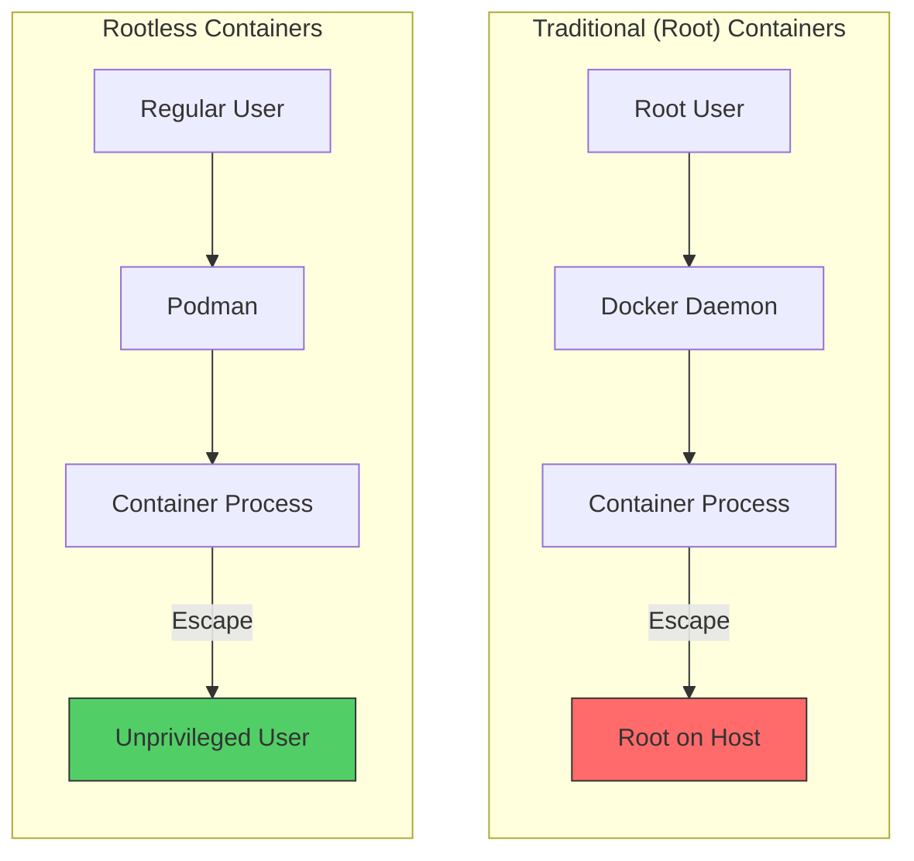
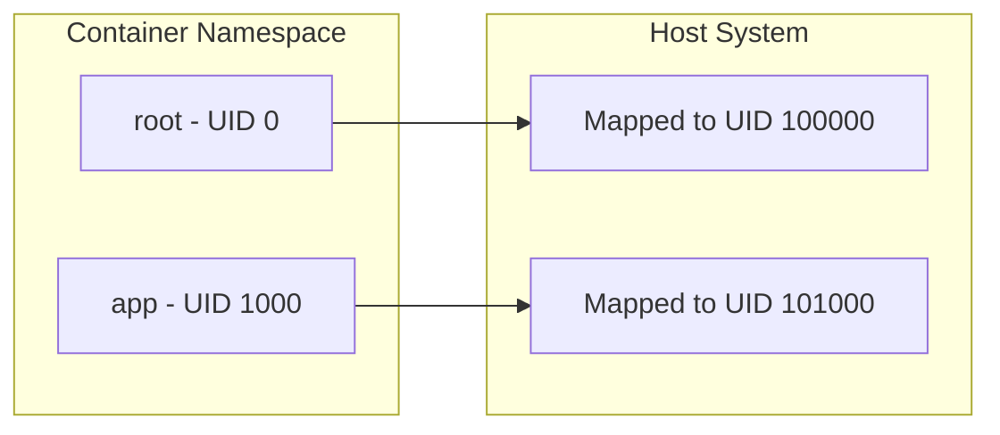
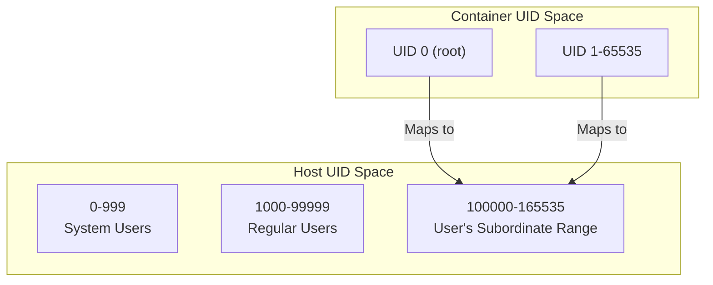
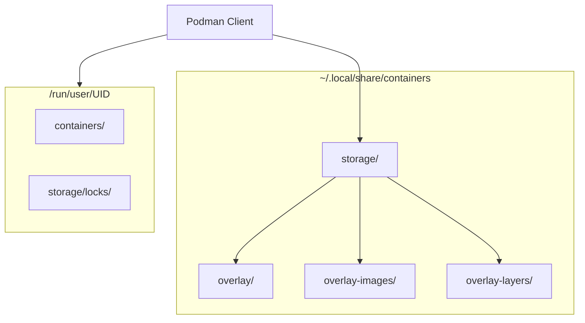
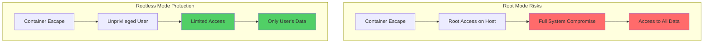
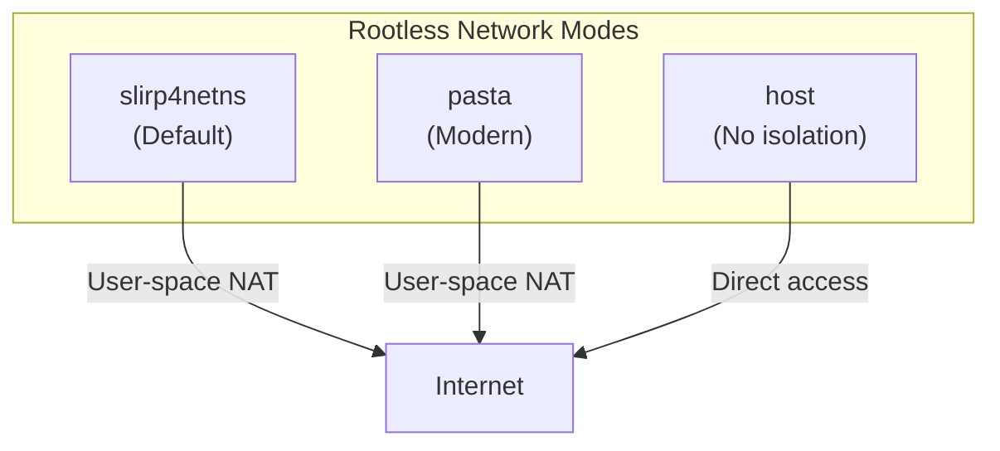
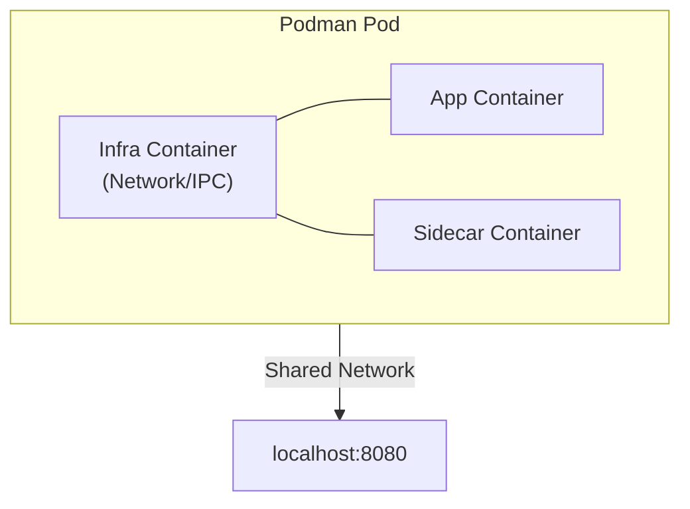

# How to Run Rootless Containers with Podman

Author: [nawazdhandala](https://www.github.com/nawazdhandala)

Tags: Podman, Containers, Security, Rootless, Linux, DevOps, Docker Alternative

Description: A comprehensive guide to running rootless containers with Podman, covering user namespace configuration, storage setup, and the security benefits of unprivileged container execution.

---

> "The principle of least privilege is a security concept in which a user is given the minimum levels of access necessary to complete their job functions." - Saltzer and Schroeder

Running containers as root is a security risk that many organizations overlook. Podman's rootless mode lets you run containers without any elevated privileges, significantly reducing your attack surface. This guide walks you through setting up and using rootless containers with Podman.

## Why Rootless Containers Matter

Traditional container runtimes like Docker require root privileges to function. This creates a significant security concern: if an attacker escapes the container, they have root access to the host system.



Rootless containers provide defense in depth. Even if a container escape occurs, the attacker only gains access as an unprivileged user.

## Understanding User Namespaces

User namespaces are the Linux kernel feature that makes rootless containers possible. They allow mapping UIDs inside the container to different UIDs on the host.



Inside the container, processes think they're running as root (UID 0), but on the host, they're actually running as an unprivileged user (e.g., UID 100000).

## Prerequisites

Before setting up rootless Podman, ensure your system meets these requirements.

### Check Kernel Support

```bash
# Verify user namespace support is enabled
# This should return a number greater than 0
cat /proc/sys/kernel/unprivileged_userns_clone

# If it returns 0 or the file doesn't exist, enable it
sudo sysctl kernel.unprivileged_userns_clone=1

# Make it persistent across reboots
echo 'kernel.unprivileged_userns_clone=1' | sudo tee /etc/sysctl.d/userns.conf
```

### Install Podman

```bash
# On Ubuntu/Debian
sudo apt update
sudo apt install -y podman slirp4netns fuse-overlayfs

# On Fedora/RHEL/CentOS
sudo dnf install -y podman slirp4netns fuse-overlayfs

# On Arch Linux
sudo pacman -S podman slirp4netns fuse-overlayfs

# Verify installation
podman --version
```

## Configuring User Namespaces

User namespaces require subordinate UID and GID ranges for your user. These define which UIDs/GIDs your user can map inside containers.

### Set Up Subordinate IDs

```bash
# Check if your user already has subordinate ID ranges
grep $USER /etc/subuid /etc/subgid

# If not present, add them (requires root)
# Format: username:start_id:count
sudo usermod --add-subuids 100000-165535 --add-subgids 100000-165535 $USER

# Verify the configuration
cat /etc/subuid
# Output: username:100000:65536

cat /etc/subgid
# Output: username:100000:65536
```

### Understanding Subordinate ID Ranges



The subordinate range gives your user 65,536 UIDs (100000-165535) that can be mapped inside containers. UID 0 in the container maps to UID 100000 on the host.

## Storage Configuration

Rootless Podman stores images and containers in your home directory. Proper storage configuration is essential for performance and reliability.

### Configure Storage Location

```bash
# Create the storage configuration directory
mkdir -p ~/.config/containers

# Create storage.conf for rootless operation
cat > ~/.config/containers/storage.conf << 'EOF'
[storage]
# Storage driver - use overlay with fuse-overlayfs for rootless
driver = "overlay"

# Root directory for storage (default: $HOME/.local/share/containers/storage)
# Uncomment to customize:
# graphroot = "/path/to/custom/storage"

# Run directory for transient data
runroot = "/run/user/1000/containers"

[storage.options]
# Use fuse-overlayfs for rootless overlay support
mount_program = "/usr/bin/fuse-overlayfs"

[storage.options.overlay]
# Enable native overlay diff for better performance (if supported)
# mount_program = "/usr/bin/fuse-overlayfs"
EOF

# Replace 1000 with your actual UID
sed -i "s/1000/$(id -u)/g" ~/.config/containers/storage.conf
```

### Verify Storage Configuration

```bash
# Check the current storage configuration
podman info --format '{{.Store.GraphRoot}}'
# Output: /home/username/.local/share/containers/storage

# Check the storage driver
podman info --format '{{.Store.GraphDriverName}}'
# Output: overlay

# View complete storage info
podman info | grep -A 20 "store:"
```

### Storage Architecture



## Running Your First Rootless Container

Now let's run containers without root privileges.

### Basic Container Operations

```bash
# Pull an image (no sudo required!)
podman pull docker.io/library/nginx:alpine

# Run a container
podman run -d --name my-nginx -p 8080:80 nginx:alpine

# Verify the container is running
podman ps

# Check which user the container process runs as on the host
ps aux | grep nginx
# Notice: Running as your user, not root!

# Access the container
curl http://localhost:8080

# Stop and remove the container
podman stop my-nginx
podman rm my-nginx
```

### Port Binding Considerations

Rootless containers cannot bind to privileged ports (below 1024) by default.

```bash
# This will fail - port 80 is privileged
podman run -d -p 80:80 nginx:alpine
# Error: rootlessport cannot expose privileged port 80

# Solution 1: Use unprivileged ports
podman run -d -p 8080:80 nginx:alpine

# Solution 2: Allow unprivileged port binding (requires root once)
sudo sysctl net.ipv4.ip_unprivileged_port_start=80

# Make it persistent
echo 'net.ipv4.ip_unprivileged_port_start=80' | sudo tee /etc/sysctl.d/unprivileged-ports.conf
```

## Security Benefits of Rootless Mode

Rootless containers provide multiple layers of security protection.

### Security Comparison



### Key Security Advantages

```bash
# 1. No root daemon running
# Docker requires a root daemon; Podman doesn't
ps aux | grep -E 'dockerd|podman'
# Podman: No daemon process
# Docker: dockerd running as root

# 2. Container processes run as unprivileged user
podman run -d --name test alpine sleep 3600
ps aux | grep "sleep 3600"
# Shows process owned by your user, not root

# 3. User namespace isolation prevents privilege escalation
# Even if attacker becomes root in container, they're still unprivileged on host
podman run --rm alpine id
# uid=0(root) gid=0(root)  <- root INSIDE container only

# 4. No access to host's root-owned files
podman run --rm -v /etc/shadow:/shadow:ro alpine cat /shadow
# Permission denied - cannot read root-only files

# Clean up
podman stop test && podman rm test
```

## Advanced Configuration

### Configuring Registries

```bash
# Create registries configuration
mkdir -p ~/.config/containers

cat > ~/.config/containers/registries.conf << 'EOF'
# Search these registries when pulling images without full path
unqualified-search-registries = ["docker.io", "quay.io", "ghcr.io"]

# Registry-specific configuration
[[registry]]
location = "docker.io"

[[registry.mirror]]
location = "mirror.gcr.io"
EOF
```

### Resource Limits with cgroups v2

```bash
# Check if cgroups v2 is enabled (required for rootless resource limits)
cat /sys/fs/cgroup/cgroup.controllers
# Output should include: cpu memory io

# Enable CPU delegation for your user (if not already enabled)
sudo mkdir -p /etc/systemd/system/user@.service.d/
sudo cat > /etc/systemd/system/user@.service.d/delegate.conf << 'EOF'
[Service]
Delegate=cpu cpuset io memory pids
EOF
sudo systemctl daemon-reload

# Now you can set resource limits
podman run -d \
    --name limited-container \
    --memory 512m \
    --cpus 1.0 \
    nginx:alpine

# Verify limits are applied
podman stats --no-stream limited-container
```

### Networking Options



```bash
# Default: slirp4netns (user-space networking)
podman run -d --name slirp-test -p 8080:80 nginx:alpine

# Use pasta (newer, better performance) if available
podman run -d --name pasta-test --network pasta -p 8081:80 nginx:alpine

# Host networking (shares host network namespace)
podman run -d --name host-test --network host nginx:alpine

# Check which network mode is being used
podman inspect slirp-test --format '{{.HostConfig.NetworkMode}}'
```

## Common Issues and Solutions

### Issue: "ERRO[0000] cannot find UID/GID"

```bash
# Problem: Subordinate IDs not configured
# Solution: Add subordinate ID ranges
sudo usermod --add-subuids 100000-165535 --add-subgids 100000-165535 $USER

# Then reset Podman storage
podman system reset
```

### Issue: "Error: mount /sys/fs/cgroup/systemd"

```bash
# Problem: cgroups v2 not properly configured
# Solution: Ensure systemd user session is running
loginctl enable-linger $USER

# Verify
loginctl show-user $USER | grep Linger
# Output: Linger=yes
```

### Issue: Slow Image Pulls

```bash
# Problem: fuse-overlayfs performance
# Solution: Use native overlay if kernel supports it

# Check if native overlay works
podman info | grep -i native
# If "Native Overlay Diff: true", you can use native overlay

# For better I/O, consider using a dedicated partition for container storage
# Edit ~/.config/containers/storage.conf:
# graphroot = "/fast-disk/containers/storage"
```

### Issue: Container Can't Resolve DNS

```bash
# Problem: DNS resolution fails in rootless containers
# Solution: Check slirp4netns is installed and working

# Verify slirp4netns
which slirp4netns
slirp4netns --version

# Test DNS inside container
podman run --rm alpine nslookup google.com

# If DNS fails, try specifying DNS servers
podman run --rm --dns 8.8.8.8 alpine nslookup google.com
```

## Migrating from Docker to Rootless Podman

Podman is designed as a drop-in replacement for Docker.

```bash
# Create an alias for seamless transition
echo 'alias docker=podman' >> ~/.bashrc
source ~/.bashrc

# Docker Compose alternative: podman-compose
pip install podman-compose

# Or use Podman's built-in compose support
podman compose up -d

# Import Docker images
docker save my-image:latest | podman load

# Most Docker commands work identically
podman pull nginx
podman run -d nginx
podman ps
podman logs <container>
podman exec -it <container> /bin/sh
```

## Monitoring Rootless Containers

For production environments, monitoring your rootless containers is essential. [OneUptime](https://oneuptime.com) provides comprehensive container monitoring with support for Podman environments.

```bash
# Export container metrics for monitoring
podman stats --format json --no-stream > /tmp/container-metrics.json

# Use Podman's events for alerting
podman events --format json --filter event=died

# Health checks for container monitoring
podman run -d \
    --name monitored-app \
    --health-cmd "curl -f http://localhost:8080/health || exit 1" \
    --health-interval 30s \
    --health-retries 3 \
    my-app:latest

# Check health status
podman healthcheck run monitored-app
```

## Production Best Practices

### Systemd Integration

```bash
# Generate systemd unit file for a container
podman generate systemd --name my-nginx --files --new

# Move to user systemd directory
mkdir -p ~/.config/systemd/user
mv container-my-nginx.service ~/.config/systemd/user/

# Enable and start the service
systemctl --user daemon-reload
systemctl --user enable --now container-my-nginx

# Check status
systemctl --user status container-my-nginx

# Enable lingering so services start at boot (before login)
loginctl enable-linger $USER
```

### Podman Pods for Multi-Container Applications



```bash
# Create a pod (similar to Kubernetes pods)
podman pod create --name my-app-pod -p 8080:80

# Add containers to the pod
podman run -d --pod my-app-pod --name web nginx:alpine
podman run -d --pod my-app-pod --name cache redis:alpine

# Containers in the same pod share network namespace
# They can communicate via localhost
podman exec web curl localhost:6379

# List pods
podman pod ls

# Stop and remove pod (includes all containers)
podman pod stop my-app-pod
podman pod rm my-app-pod
```

## Summary

Rootless containers with Podman provide enterprise-grade security without sacrificing usability. Key takeaways:

1. **User namespaces** map container UIDs to unprivileged host UIDs
2. **No root daemon** eliminates a major attack vector
3. **Storage configuration** lives in your home directory
4. **Most Docker workflows** work unchanged with Podman
5. **Systemd integration** enables production-ready deployments

The security benefits of rootless containers are substantial. Even if an attacker escapes the container, they only gain access as an unprivileged user - a significant improvement over traditional root-based container runtimes.

---

Running containers shouldn't require root privileges. With Podman's rootless mode, you get the isolation and portability of containers while maintaining the principle of least privilege. Your security team will appreciate the reduced attack surface, and your developers will appreciate the familiar Docker-like workflow.
