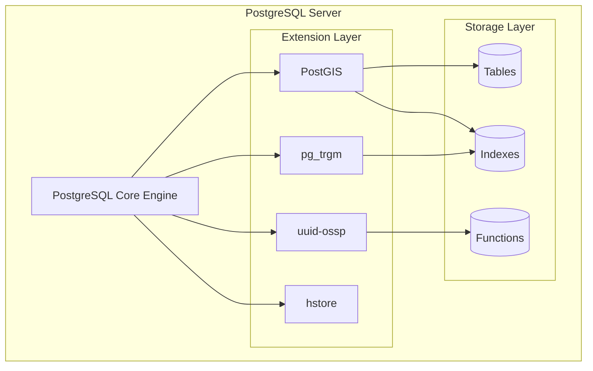
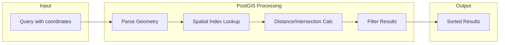
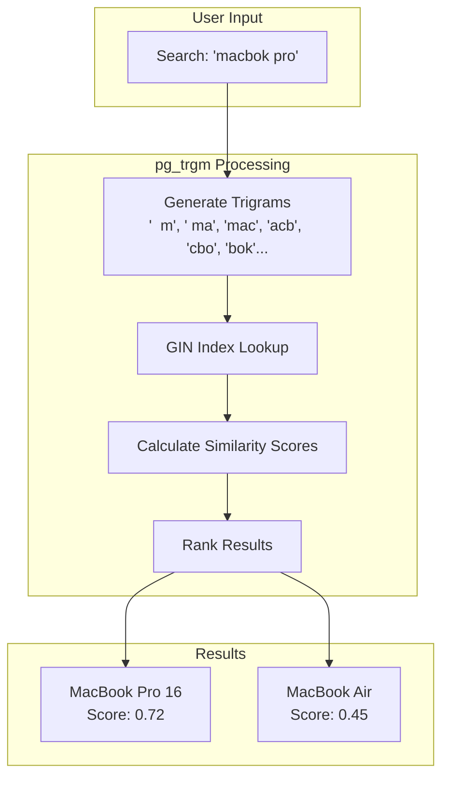
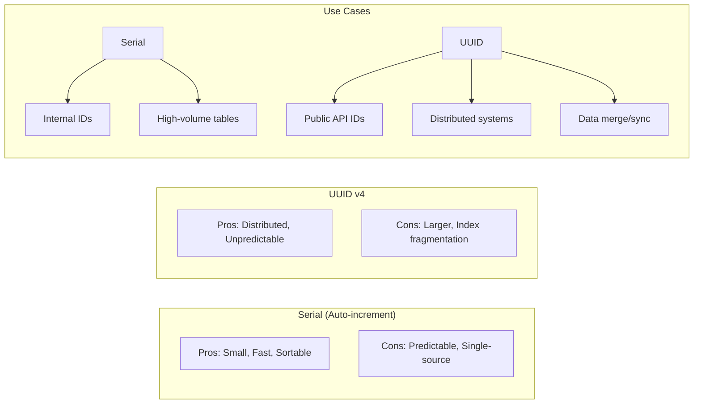
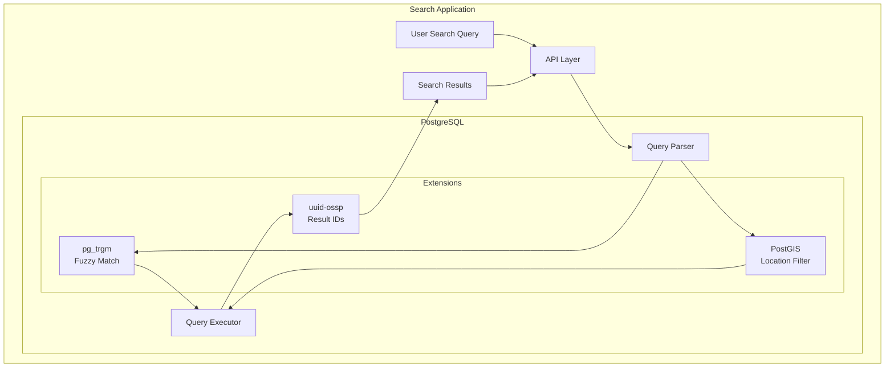

# How to Use PostgreSQL Extensions (PostGIS, pg_trgm, etc.)

Author: [nawazdhandala](https://github.com/nawazdhandala)

Tags: PostgreSQL, Database, PostGIS, pg_trgm, uuid-ossp, Extensions, SQL, Geospatial, Full-Text Search

Description: Learn how to supercharge your PostgreSQL database with powerful extensions like PostGIS for geospatial data, pg_trgm for fuzzy search, and uuid-ossp for UUID generation. This guide covers installation, configuration, and practical examples.

---

> PostgreSQL is already powerful, but extensions transform it into a Swiss Army knife for specialized workloads - from mapping the world to finding typos in user searches.

## Why PostgreSQL Extensions Matter

PostgreSQL extensions are add-on modules that extend the database with new data types, functions, operators, and index types. Instead of bolting on external services, you keep everything in one place - your queries stay simple, your transactions stay atomic, and your operations team stays sane.

Popular extensions solve common problems elegantly:

- **PostGIS**: Geospatial queries (find restaurants within 5km)
- **pg_trgm**: Fuzzy text search (match "Jhon" to "John")
- **uuid-ossp**: Generate UUIDs without application code
- **hstore**: Key-value storage within a column
- **pg_stat_statements**: Query performance analysis

## Extension Architecture Overview



## Installing and Managing Extensions

### Checking Available Extensions

Before installing, see what extensions are available on your PostgreSQL installation:

```sql
-- List all available extensions (installed + installable)
SELECT name, default_version, comment
FROM pg_available_extensions
ORDER BY name;

-- Check currently installed extensions
SELECT extname, extversion
FROM pg_extension;
```

### Installing Extensions

Extensions are installed per-database using the `CREATE EXTENSION` command:

```sql
-- Install an extension
CREATE EXTENSION IF NOT EXISTS pg_trgm;

-- Install with a specific schema
CREATE EXTENSION IF NOT EXISTS postgis SCHEMA public;

-- Install a specific version
CREATE EXTENSION IF NOT EXISTS uuid_ossp VERSION '1.1';
```

### Managing Extension Lifecycle

```sql
-- Upgrade an extension to the latest version
ALTER EXTENSION pg_trgm UPDATE;

-- Upgrade to a specific version
ALTER EXTENSION pg_trgm UPDATE TO '1.6';

-- Move extension to a different schema
ALTER EXTENSION postgis SET SCHEMA gis;

-- Remove an extension (CASCADE removes dependent objects)
DROP EXTENSION IF EXISTS pg_trgm CASCADE;
```

### System-Level Installation

Some extensions require system packages to be installed first:

```bash
# Ubuntu/Debian - Install PostGIS
sudo apt-get update
sudo apt-get install postgresql-16-postgis-3

# RHEL/CentOS - Install PostGIS
sudo dnf install postgis34_16

# Alpine Linux (Docker)
apk add postgis

# Verify installation
psql -c "SELECT * FROM pg_available_extensions WHERE name = 'postgis';"
```

## PostGIS for Geospatial Data

PostGIS transforms PostgreSQL into a powerful geographic information system (GIS), adding support for geographic objects, spatial indexes, and thousands of geospatial functions.

### Setting Up PostGIS

```sql
-- Install PostGIS and related extensions
CREATE EXTENSION IF NOT EXISTS postgis;
CREATE EXTENSION IF NOT EXISTS postgis_topology;
CREATE EXTENSION IF NOT EXISTS postgis_raster;

-- Verify installation
SELECT PostGIS_Version();
-- Returns: 3.4 USE_GEOS=1 USE_PROJ=1 USE_STATS=1
```

### Creating Tables with Geographic Data

```sql
-- Create a table to store locations (e.g., restaurants, stores)
CREATE TABLE locations (
    id SERIAL PRIMARY KEY,
    name VARCHAR(255) NOT NULL,
    address TEXT,
    -- GEOGRAPHY type stores lat/lng coordinates (SRID 4326 = WGS84)
    -- Calculations use spherical math (accurate for Earth distances)
    coordinates GEOGRAPHY(POINT, 4326),
    -- GEOMETRY type for planar calculations (faster, less accurate globally)
    geom GEOMETRY(POINT, 4326),
    created_at TIMESTAMP DEFAULT NOW()
);

-- Create a spatial index for fast proximity queries
-- GiST (Generalized Search Tree) is the standard spatial index
CREATE INDEX idx_locations_coordinates
ON locations USING GIST(coordinates);

-- Insert sample data
-- ST_MakePoint creates a point from longitude, latitude
-- Note: PostGIS uses (longitude, latitude) order, not (lat, lng)
INSERT INTO locations (name, address, coordinates, geom)
VALUES
    ('Central Park', 'New York, NY',
     ST_SetSRID(ST_MakePoint(-73.9654, 40.7829), 4326)::geography,
     ST_SetSRID(ST_MakePoint(-73.9654, 40.7829), 4326)),
    ('Golden Gate Bridge', 'San Francisco, CA',
     ST_SetSRID(ST_MakePoint(-122.4783, 37.8199), 4326)::geography,
     ST_SetSRID(ST_MakePoint(-122.4783, 37.8199), 4326)),
    ('Space Needle', 'Seattle, WA',
     ST_SetSRID(ST_MakePoint(-122.3493, 47.6205), 4326)::geography,
     ST_SetSRID(ST_MakePoint(-122.3493, 47.6205), 4326));
```

### Finding Nearby Locations

```sql
-- Find all locations within 10 kilometers of a point
-- ST_DWithin is index-optimized and should be preferred over ST_Distance < X
SELECT
    name,
    address,
    -- ST_Distance returns meters for GEOGRAPHY type
    ST_Distance(
        coordinates,
        ST_SetSRID(ST_MakePoint(-73.9857, 40.7484), 4326)::geography
    ) / 1000 AS distance_km
FROM locations
WHERE ST_DWithin(
    coordinates,
    ST_SetSRID(ST_MakePoint(-73.9857, 40.7484), 4326)::geography,
    10000  -- Distance in meters (10km)
)
ORDER BY distance_km;

-- Find the 5 nearest locations to a given point (KNN query)
-- The <-> operator uses the spatial index for efficient ordering
SELECT
    name,
    ST_Distance(
        coordinates,
        ST_SetSRID(ST_MakePoint(-73.9857, 40.7484), 4326)::geography
    ) / 1000 AS distance_km
FROM locations
ORDER BY coordinates <-> ST_SetSRID(ST_MakePoint(-73.9857, 40.7484), 4326)::geography
LIMIT 5;
```

### Working with Polygons and Areas

```sql
-- Create a table for geographic regions (delivery zones, service areas)
CREATE TABLE service_areas (
    id SERIAL PRIMARY KEY,
    name VARCHAR(255) NOT NULL,
    -- POLYGON type for closed shapes
    boundary GEOGRAPHY(POLYGON, 4326),
    active BOOLEAN DEFAULT true
);

-- Create spatial index
CREATE INDEX idx_service_areas_boundary
ON service_areas USING GIST(boundary);

-- Insert a polygon (must be closed - first and last points match)
INSERT INTO service_areas (name, boundary)
VALUES (
    'Downtown Delivery Zone',
    ST_GeogFromText('POLYGON((
        -73.990 40.750,
        -73.970 40.750,
        -73.970 40.730,
        -73.990 40.730,
        -73.990 40.750
    ))')
);

-- Check if a point is within a service area
SELECT name
FROM service_areas
WHERE ST_Within(
    ST_SetSRID(ST_MakePoint(-73.980, 40.740), 4326)::geography,
    boundary
) AND active = true;

-- Calculate area in square kilometers
SELECT
    name,
    ST_Area(boundary) / 1000000 AS area_sq_km
FROM service_areas;
```

### PostGIS Query Flow



## pg_trgm for Fuzzy Search

The `pg_trgm` extension provides functions and operators for determining the similarity of alphanumeric text based on trigram matching. This is perfect for search-as-you-type, typo tolerance, and fuzzy matching.

### Understanding Trigrams

A trigram is a group of three consecutive characters. For example, the string "hello" produces these trigrams: `"  h", " he", "hel", "ell", "llo", "lo "`. Similarity is measured by comparing trigram sets.

### Setting Up pg_trgm

```sql
-- Install the extension
CREATE EXTENSION IF NOT EXISTS pg_trgm;

-- Create a sample products table
CREATE TABLE products (
    id SERIAL PRIMARY KEY,
    name VARCHAR(255) NOT NULL,
    description TEXT,
    category VARCHAR(100),
    created_at TIMESTAMP DEFAULT NOW()
);

-- Insert sample data with deliberate typos for testing
INSERT INTO products (name, description, category) VALUES
    ('iPhone 15 Pro', 'Latest Apple smartphone with A17 chip', 'Electronics'),
    ('Samsung Galaxy S24', 'Android flagship with AI features', 'Electronics'),
    ('MacBook Pro 16', 'Professional laptop with M3 chip', 'Computers'),
    ('Sony WH-1000XM5', 'Noise cancelling wireless headphones', 'Audio'),
    ('Mechanical Keyboard', 'RGB backlit gaming keyboard', 'Peripherals');
```

### Creating Trigram Indexes

```sql
-- GIN index is better for many lookups (typical web app usage)
-- Supports %, <%, %>, <->
CREATE INDEX idx_products_name_gin
ON products USING GIN(name gin_trgm_ops);

-- GiST index is better for nearest-neighbor searches
-- Supports %, <%, %>, <->, similarity ordering
CREATE INDEX idx_products_name_gist
ON products USING GIST(name gist_trgm_ops);

-- Index on description for full-text fuzzy search
CREATE INDEX idx_products_description_gin
ON products USING GIN(description gin_trgm_ops);
```

### Basic Similarity Queries

```sql
-- Calculate similarity between two strings (0 to 1)
SELECT similarity('iPhone', 'iPohne') AS sim_score;
-- Returns ~0.5 (accounts for transposition typo)

-- Show trigrams for a string (useful for debugging)
SELECT show_trgm('hello');
-- Returns: {"  h"," he",hel,ell,llo,"lo "}

-- Find products similar to a search term
-- The % operator returns true if similarity > pg_trgm.similarity_threshold
SELECT name, similarity(name, 'iPhone Pro') AS score
FROM products
WHERE name % 'iPhone Pro'
ORDER BY score DESC;

-- Adjust the similarity threshold (default is 0.3)
SET pg_trgm.similarity_threshold = 0.2;
```

### Search-as-You-Type Implementation

```sql
-- Create a function for autocomplete search
-- Returns products matching partial input with typo tolerance
CREATE OR REPLACE FUNCTION search_products(
    search_term TEXT,
    result_limit INTEGER DEFAULT 10
)
RETURNS TABLE (
    id INTEGER,
    name VARCHAR,
    category VARCHAR,
    relevance REAL
) AS $$
BEGIN
    RETURN QUERY
    SELECT
        p.id,
        p.name,
        p.category,
        -- Combine multiple similarity factors
        (
            similarity(p.name, search_term) * 2 +  -- Name match weighted higher
            similarity(COALESCE(p.description, ''), search_term) * 0.5 +
            similarity(COALESCE(p.category, ''), search_term) * 0.5
        ) / 3 AS relevance
    FROM products p
    WHERE
        -- Match against name OR description
        p.name % search_term OR
        p.description % search_term
    ORDER BY relevance DESC
    LIMIT result_limit;
END;
$$ LANGUAGE plpgsql;

-- Usage: Search for "iphon" (typo for iPhone)
SELECT * FROM search_products('iphon');
-- Returns iPhone 15 Pro with high relevance score
```

### Advanced Pattern Matching

```sql
-- ILIKE with trigram acceleration (case-insensitive)
-- The GIN index speeds up this query significantly
SELECT name
FROM products
WHERE name ILIKE '%keyboard%';

-- Word similarity (matches word boundaries)
SELECT
    name,
    word_similarity('galaxy', name) AS word_sim
FROM products
WHERE 'galaxy' <% name  -- <% operator for word similarity
ORDER BY word_sim DESC;

-- Strict word similarity (even stricter matching)
SELECT
    name,
    strict_word_similarity('phone', name) AS strict_sim
FROM products
WHERE 'phone' <<% name  -- <<% operator for strict word similarity
ORDER BY strict_sim DESC;
```

### Fuzzy Search Architecture



## uuid-ossp for UUID Generation

The `uuid-ossp` extension provides functions to generate universally unique identifiers (UUIDs). UUIDs are perfect for distributed systems where you need globally unique IDs without coordination.

### Setting Up uuid-ossp

```sql
-- Install the extension
CREATE EXTENSION IF NOT EXISTS "uuid-ossp";

-- Verify available functions
SELECT proname
FROM pg_proc
WHERE proname LIKE 'uuid%';
```

### UUID Generation Methods

```sql
-- UUID v1: Time-based + MAC address (contains creation timestamp)
-- Pros: Sortable by time, can extract timestamp
-- Cons: Exposes MAC address, potentially predictable
SELECT uuid_generate_v1();
-- Returns: f47ac10b-58cc-11ee-8c99-0242ac120002

-- UUID v1mc: Time-based with random MAC (more private)
SELECT uuid_generate_v1mc();
-- Returns: f47ac10b-58cc-11ee-a456-426614174000

-- UUID v4: Completely random (most common choice)
-- Pros: No information leakage, unpredictable
-- Cons: Not sortable, worse index locality
SELECT uuid_generate_v4();
-- Returns: 550e8400-e29b-41d4-a716-446655440000

-- UUID v5: Namespace + name based (deterministic)
-- Same input always produces same UUID
SELECT uuid_generate_v5(uuid_ns_url(), 'https://example.com/users/123');
-- Returns: same UUID every time for this input
```

### Using UUIDs as Primary Keys

```sql
-- Create a table with UUID primary key
CREATE TABLE users (
    -- Generate UUID automatically on insert
    id UUID PRIMARY KEY DEFAULT uuid_generate_v4(),
    email VARCHAR(255) UNIQUE NOT NULL,
    name VARCHAR(255) NOT NULL,
    created_at TIMESTAMP DEFAULT NOW()
);

-- Create related table with UUID foreign key
CREATE TABLE orders (
    id UUID PRIMARY KEY DEFAULT uuid_generate_v4(),
    user_id UUID NOT NULL REFERENCES users(id),
    total_amount DECIMAL(10, 2) NOT NULL,
    status VARCHAR(50) DEFAULT 'pending',
    created_at TIMESTAMP DEFAULT NOW()
);

-- Index for foreign key lookups
CREATE INDEX idx_orders_user_id ON orders(user_id);

-- Insert without specifying ID (auto-generated)
INSERT INTO users (email, name)
VALUES ('user@example.com', 'John Doe')
RETURNING id;
-- Returns: 7c9e6679-7425-40de-944b-e07fc1f90ae7

-- Insert with explicit UUID (useful for data migration)
INSERT INTO users (id, email, name)
VALUES ('550e8400-e29b-41d4-a716-446655440000', 'admin@example.com', 'Admin User');
```

### UUID Performance Considerations

```sql
-- For better index performance with UUID v4, consider using
-- the built-in gen_random_uuid() function (PostgreSQL 13+)
-- which is slightly faster and does not require an extension

-- PostgreSQL 13+ native UUID generation
CREATE TABLE events (
    id UUID PRIMARY KEY DEFAULT gen_random_uuid(),
    event_type VARCHAR(100) NOT NULL,
    payload JSONB,
    created_at TIMESTAMP DEFAULT NOW()
);

-- For time-series data where you need ordering,
-- consider ULID-style UUIDs (time-prefixed)
-- This improves B-tree index locality

-- Custom function for time-ordered UUIDs
CREATE OR REPLACE FUNCTION uuid_time_ordered()
RETURNS UUID AS $$
DECLARE
    timestamp_hex VARCHAR(12);
    random_hex VARCHAR(20);
BEGIN
    -- Get milliseconds since epoch as hex (first 48 bits)
    timestamp_hex := lpad(
        to_hex((extract(epoch from clock_timestamp()) * 1000)::bigint),
        12, '0'
    );
    -- Generate random component (remaining 80 bits)
    random_hex := encode(gen_random_bytes(10), 'hex');

    -- Combine into UUID format
    RETURN (
        substring(timestamp_hex from 1 for 8) || '-' ||
        substring(timestamp_hex from 9 for 4) || '-' ||
        '4' || substring(random_hex from 1 for 3) || '-' ||
        '8' || substring(random_hex from 4 for 3) || '-' ||
        substring(random_hex from 7 for 12)
    )::UUID;
END;
$$ LANGUAGE plpgsql;
```

### UUID vs Serial Comparison



## Combining Extensions for Powerful Queries

Extensions can be combined to create sophisticated query capabilities:

```sql
-- Create a locations table using multiple extensions
CREATE TABLE businesses (
    id UUID PRIMARY KEY DEFAULT uuid_generate_v4(),
    name VARCHAR(255) NOT NULL,
    description TEXT,
    location GEOGRAPHY(POINT, 4326),
    created_at TIMESTAMP DEFAULT NOW()
);

-- Create indexes for each search method
CREATE INDEX idx_businesses_location ON businesses USING GIST(location);
CREATE INDEX idx_businesses_name ON businesses USING GIN(name gin_trgm_ops);
CREATE INDEX idx_businesses_description ON businesses USING GIN(description gin_trgm_ops);

-- Insert sample data
INSERT INTO businesses (name, description, location) VALUES
    ('Joes Coffee Shop', 'Best espresso in downtown',
     ST_SetSRID(ST_MakePoint(-73.985, 40.748), 4326)::geography),
    ('Marias Italian Kitchen', 'Authentic pasta and pizza',
     ST_SetSRID(ST_MakePoint(-73.982, 40.752), 4326)::geography),
    ('Quick Bites Deli', 'Fresh sandwiches and salads',
     ST_SetSRID(ST_MakePoint(-73.978, 40.745), 4326)::geography);

-- Combined fuzzy + proximity search
-- Find businesses near a location that match a fuzzy search term
SELECT
    id,
    name,
    description,
    ST_Distance(location, search_point) / 1000 AS distance_km,
    similarity(name, 'coffee') AS name_match,
    similarity(description, 'coffee') AS desc_match
FROM businesses,
     -- Subquery to define search parameters once
     (SELECT ST_SetSRID(ST_MakePoint(-73.980, 40.750), 4326)::geography AS search_point) AS params
WHERE
    -- Within 2km
    ST_DWithin(location, search_point, 2000)
    AND (
        -- Fuzzy match on name or description
        name % 'coffee'
        OR description % 'coffee'
    )
ORDER BY
    -- Combine distance and text relevance for ranking
    ST_Distance(location, search_point) * 0.5 +
    (1 - GREATEST(similarity(name, 'coffee'), similarity(description, 'coffee'))) * 1000
LIMIT 10;
```

## Extension Management Best Practices

### Tracking Extensions in Migrations

```sql
-- migration_001_add_extensions.sql

-- Check if running as superuser (some extensions require it)
DO $$
BEGIN
    IF NOT EXISTS (SELECT 1 FROM pg_roles WHERE rolsuper AND rolname = current_user) THEN
        RAISE WARNING 'Some extensions may require superuser privileges';
    END IF;
END $$;

-- Install extensions in a transaction
BEGIN;

-- Core extensions for the application
CREATE EXTENSION IF NOT EXISTS "uuid-ossp";
CREATE EXTENSION IF NOT EXISTS pg_trgm;
CREATE EXTENSION IF NOT EXISTS postgis;

-- Log what was installed
DO $$
DECLARE
    ext RECORD;
BEGIN
    FOR ext IN SELECT extname, extversion FROM pg_extension WHERE extname IN ('uuid-ossp', 'pg_trgm', 'postgis')
    LOOP
        RAISE NOTICE 'Installed: % version %', ext.extname, ext.extversion;
    END LOOP;
END $$;

COMMIT;
```

### Extension Health Checks

```sql
-- Check extension status and versions
CREATE OR REPLACE FUNCTION check_extensions()
RETURNS TABLE (
    extension_name TEXT,
    installed_version TEXT,
    available_version TEXT,
    needs_update BOOLEAN
) AS $$
BEGIN
    RETURN QUERY
    SELECT
        e.extname::TEXT,
        e.extversion::TEXT,
        a.default_version::TEXT,
        e.extversion <> a.default_version
    FROM pg_extension e
    JOIN pg_available_extensions a ON e.extname = a.name
    WHERE e.extname IN ('uuid-ossp', 'pg_trgm', 'postgis', 'postgis_topology')
    ORDER BY e.extname;
END;
$$ LANGUAGE plpgsql;

-- Run health check
SELECT * FROM check_extensions();
```

## Monitoring Extension Performance

Track how your extensions are performing with query statistics:

```sql
-- Enable query statistics tracking
CREATE EXTENSION IF NOT EXISTS pg_stat_statements;

-- Find slow queries using PostGIS functions
SELECT
    substring(query, 1, 100) AS query_preview,
    calls,
    total_exec_time / calls AS avg_time_ms,
    rows / calls AS avg_rows
FROM pg_stat_statements
WHERE query ILIKE '%st_dwithin%'
   OR query ILIKE '%st_distance%'
   OR query ILIKE '%similarity%'
ORDER BY total_exec_time DESC
LIMIT 20;

-- Check index usage for spatial queries
SELECT
    schemaname,
    tablename,
    indexname,
    idx_scan,
    idx_tup_read,
    idx_tup_fetch
FROM pg_stat_user_indexes
WHERE indexname LIKE '%gist%'
   OR indexname LIKE '%gin%'
ORDER BY idx_scan DESC;
```

## Common Extension Patterns



## Troubleshooting Common Issues

### Extension Installation Failures

```sql
-- Check if extension files exist on the server
SELECT * FROM pg_available_extensions WHERE name = 'postgis';

-- If empty, the extension is not installed at the OS level
-- Install the package and restart PostgreSQL

-- Check for permission issues
SELECT current_user, rolsuper, rolcreatedb
FROM pg_roles
WHERE rolname = current_user;

-- Some extensions need shared_preload_libraries
-- Check postgresql.conf
SHOW shared_preload_libraries;
```

### Performance Issues

```sql
-- Check if spatial indexes are being used
EXPLAIN (ANALYZE, BUFFERS)
SELECT * FROM locations
WHERE ST_DWithin(
    coordinates,
    ST_SetSRID(ST_MakePoint(-73.985, 40.748), 4326)::geography,
    5000
);

-- Look for "Index Scan using idx_locations_coordinates"
-- If you see "Seq Scan", the index is not being used

-- Force index usage for testing
SET enable_seqscan = OFF;

-- Check trigram index effectiveness
EXPLAIN (ANALYZE)
SELECT * FROM products WHERE name % 'keyboard';

-- Ensure statistics are up to date
ANALYZE locations;
ANALYZE products;
```

---

PostgreSQL extensions transform a general-purpose database into a specialized powerhouse. PostGIS brings enterprise-grade GIS capabilities, pg_trgm enables Google-like search tolerance, and uuid-ossp provides distributed-system-friendly identifiers - all without leaving the comfort of SQL transactions.

Start with one extension, prove its value, then expand. Your database can handle more than you think.

For monitoring your PostgreSQL databases and tracking extension performance, check out [OneUptime](https://oneuptime.com) - it provides comprehensive database monitoring with custom metrics, query analysis, and alerting for slow spatial queries or failing fuzzy searches.
